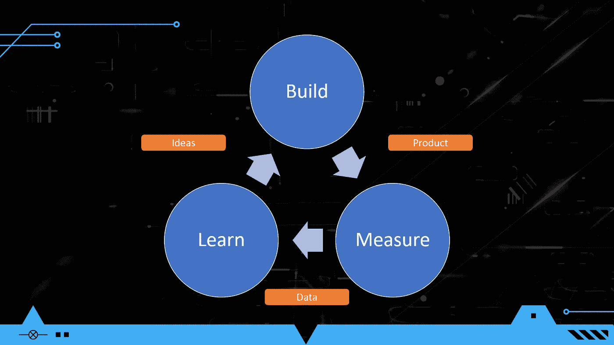
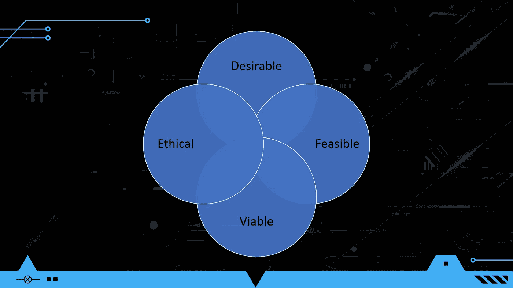
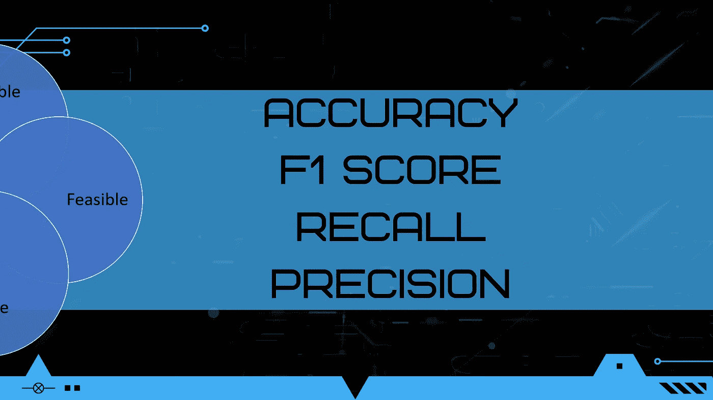
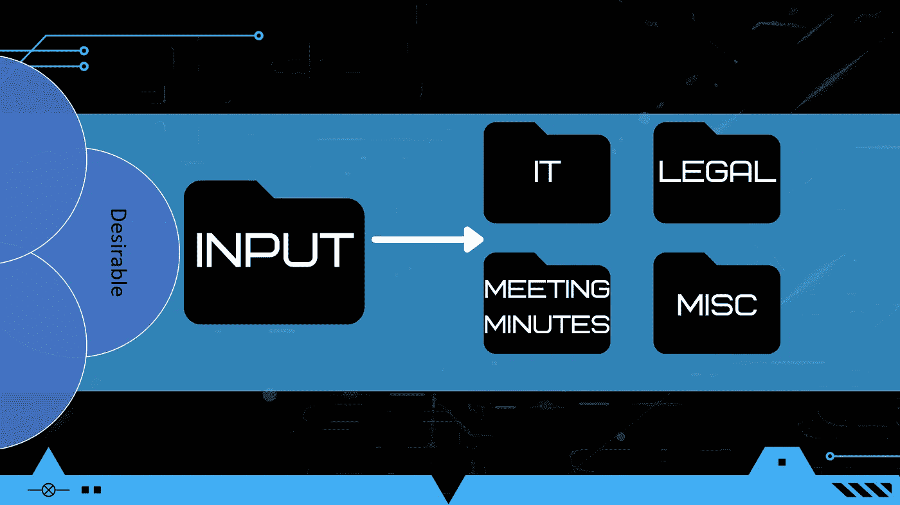
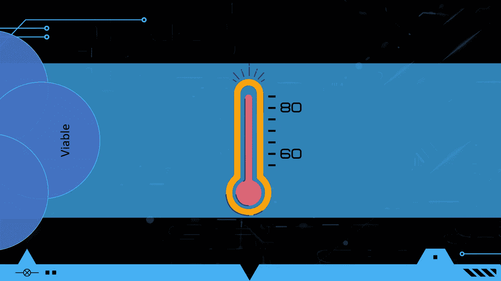

# 精益机器学习:以精益创业的方式运行概念验证(第 2 部分)

> 原文：<https://towardsdatascience.com/lean-machine-learning-running-your-proof-of-concept-the-lean-startup-way-part-2-cf13b6b5154a>

## 如何转变构建机器学习产品的方式

图 Eric Reis 的《精益创业中的构建度量学习周期》。图片作者。

欢迎回来！如果这是你看过的这个系列的第一篇文章，你可以在这里查看第 1 部分。简单回顾一下，我们一直在讨论如何通过应用 Eric Ries 的精益创业方法来构建更好的机器学习产品。

在第 1 部分中，我们介绍了机器学习概念证明(POCs)和产品管理中的一个概念，称为创新最佳点(ISS)。基础设施服务由四个关键领域组成——理想的、可行的、可行的和道德的。在第 1 部分中，我们介绍了确定您的机器学习产品是否令人满意的方法。在第 2 部分，我们将讨论机器学习产品的可行性和生存能力。最后，在第 3 部分，我们将给出构建一个合乎伦理的机器学习产品的提示。

图 2:创新最佳点。图片作者。

# **机器学习产品的技术可行性**

当数据科学家开始机器学习概念验证时，技术可行性总是首先想到的。在第 1 部分中，我们强调了确定合意性实际上应该是 POC 的第一步。浪费时间去做一个没有人真正想要的产品有什么意义呢？但另一方面，没有人会买一个实际上不起作用的产品。确保你能真正解决手头的问题是至关重要的。但是可能不那么明显的是你确定某件事情在技术上是否可行的*方式*。

你在学校学到了什么衡量标准来确定机器学习模型是否成功？下面的图 3 显示了我的教授与我分享的一些。虽然这些指标有助于评估模型，但它们不会告诉你最终用户是否满意你的机器学习产品。

图 3:经典的建模指标。图片作者。

以你手机的自动完成功能为例。这些模型以 F1 分数高而闻名，但最终用户花了数年时间从 autocomplete 的错误中创造迷因。很多时候，数据科学家不知道图 3 中的指标阈值应该是多少，以满足给定用例的最终用户。这意味着我们需要根据交付给最终用户的价值来定义我们的指标。一旦我们确定了这一点，我们就可以很容易地确定我们的建模指标的阈值，从而为我们的最终用户带来一个可接受的解决方案。

## 创建简单模型的好处

在第 1 部分中，我们描述了使用简单的、基于规则的方法(图 4)的机器学习模型如何有助于确定合意性。我喜欢以这种方式开始我的机器学习概念验证，因为它允许我获得关于产品是否令人满意的近乎即时的反馈。然而，另一个好处是，我获得了一个基于规则的方法解决问题的基线度量。

请注意，如果基于规则的方法实际上满足了最终用户，并且增加了足够的价值，您应该将它作为您的最小可行产品(MVP)。很多时候，数据科学家只想建立机器学习模型——这是理所当然的，这是我们上学的目的，也是我们在这个领域的原因！然而，机器学习比基于规则的系统维护成本更高。如果我们希望我们的机器学习产品是可行的，我们需要考虑我们的解决方案要花多少钱(稍后会详细介绍)。

图 4:测量合意性的简单模型。图片作者。

## 如何衡量技术可行性

遵循 Eric Ries 的精益创业方法，我们首先需要确定我们想要学习什么。在这种情况下，我们想知道我们的机器学习产品是否可行。接下来，我们如何衡量问题在技术上是否可行？我们可以通过关注我们试图从最终用户那里获取的实际商业价值来做到这一点。让我们以一个文档分类器为例。

自动分类文档对最终用户有什么价值？很简单，您可以节省最终用户的时间。因此，我的一个基本衡量标准是了解目前手动分类文档花费了多少时间。这建立了一个非常基本的基线，我们可以在此基础上进行改进。但这不是我们唯一应该捕捉的东西。

如果文档分类不正确，我们还应该了解相关的风险级别。在某些领域，不正确的分类没什么大不了的，但在其他领域，这是生死攸关的问题。如果我们处于生死关头，我们可能无法优化为最终用户节省的时间。无论哪种情况，我们都需要确保我们的模型有一个安全的失败方式。如果我们不这样做，我们的最终用户可能需要审查我们的模型做出的所有预测，这将降低我们的解决方案的感知价值。

在 [Unsplash](https://unsplash.com?utm_source=medium&utm_medium=referral) 上由 [janilson furtado](https://unsplash.com/@janilson123?utm_source=medium&utm_medium=referral) 拍照

然而，这带来了另一个需要注意的重要基准—您的最终用户今天在这方面做得如何？如果您的机器学习模型将自动执行终端用户目前正在执行的任务，您可能需要在相同的水平上执行，或者比他们更好。如果节省时间的代价是准确性不如继续手动流程，最终用户可能不会高兴。

除了捕获终端用户今天执行任务的情况，您可能还希望捕获终端用户从您的模型接收预测所需的时间。我见过最终用户总体上节省时间的机器学习产品，但他们无法忍受要花多长时间才能得到预测。

最终，初始模型的伟大之处在于，您可以从最终用户的角度捕获所有这些指标，并快速建立基线。这使您能够迭代地改进每个指标，并获得最终用户何时对他们收到的价值真正满意的直觉。你的最终用户可能无法告诉你什么样的 F1 分数是可以接受的，所以你应该根据用户的体验来确定可行性。

## 确定技术可行性是一个反复的过程

像软件世界中的许多事情一样，采用迭代的方法来解决问题是一个很好的实践。这应该包括你确定技术可行性的工作。我最喜欢的创业概念之一是首先尝试手动解决你的问题。是的，最终目标是自动化事情，但是手动工作可以让你获得对问题的良好直觉。在创建机器学习产品的时候，你的第一个模型应该是 *you* ！

是的，你没看错——*你*应该是模特。

作为模特，你会学到一些重要的东西。首先，你开始建立你对问题的直觉。这个问题会有多难解决？有可能的是，如果*你正在*努力做出正确的预测，机器学习模型可能也会努力。

其次，作为模型可以让你围绕数据本身建立直觉。您可能会了解哪些数据点有助于您做出预测。这将有助于你开始特征工程。

最后，你的机器学习模型的数据集可能是未标记的。如果要让人们为您注释数据集，您需要为注释者编写说明。几乎不可能编写一套很好的指令来注释您以前从未注释过的数据集。

照片由 [Edz Norton](https://unsplash.com/es/@edznorton?utm_source=medium&utm_medium=referral) 在 [Unsplash](https://unsplash.com?utm_source=medium&utm_medium=referral) 上拍摄

在第一轮成为模型之后，您可以使用新发现的直觉为基于规则的模型构建特性。正如在第 1 部分中所讨论的，找到一种基于规则的方法来解决所有问题并不可耻。基于规则的系统通常更容易维护，但是一旦有了太多的规则，情况就不一样了。一个规则太多的系统会变得脆弱，规则开始互相冲突。当规则的复杂性成为一篇论文时，维护一个机器学习模型可能会更有效，并产生更少的异常。

最后，在所有非机器学习方法之后，我们可以建立一个机器学习模型。许多新数据科学家希望直接进入深度学习方法，但我在使用简单模型方面取得了成功，如逻辑回归、k-最近邻、支持向量机、k-means 聚类和 XGBoost。如果您可以用一组巧妙的特性和一个简单的模型来解决问题，您将获得一些重大的好处。

第一个好处是，您的模型需要更少的数据来训练，最终将训练得更快。说到速度，简单的模型也会让预测更快。简单模型的另一个好处是它们更容易对生产中的问题进行分类。简单模型还有一个额外的好处，那就是可以让你更好地理解模型中的任何固有偏差。对于像迁移学习这样更高级的技术来说，就不能这么说了。最后但同样重要的是，简单的机器学习模型对环境更好。复杂的模型在计算上是昂贵的，并且需要更多的能量来创建预测。模型的复杂性和碳排放量之间有着直接的联系。

[K8](https://unsplash.com/@k8_iv?utm_source=medium&utm_medium=referral) 在 [Unsplash](https://unsplash.com?utm_source=medium&utm_medium=referral) 上拍照

虽然数据科学家在学校被教导直接进入复杂的机器学习模型，但我建议你采取迭代的方法来建模。首先，自己做预测，然后尝试一个基于规则的模型来获得对你试图解决的问题的直觉。之后，你可以尝试一些简单的机器学习算法，只有在需要的时候才使用高级技术。

# 机器学习产品的生存能力

生存能力是橡胶遇到道路的地方。没有人愿意为一个成本高于人工操作的产品买单。此外，你可能想获利——我怀疑你的公司是在以成本价销售商品。

图 5:你的模式是否扼杀了你的底线？图片作者。

你可能已经知道成本、收入和利润应该留给财务部门去操心。大多数数据科学家没有意识到，他们在一个机器学习产品有多贵的问题上发挥了很大的作用。花费数周时间进行概念验证，却发现您的解决方案实施起来太过昂贵，这将令人沮丧。

技术可行性对你产品的生存能力有直接的影响。如果你使用复杂的机器学习模型，你可能需要更多的数据。额外的数据需要更多的存储成本。更复杂的模型需要更多的计算能力。这些因素都会增加模型预测的成本。

## 选择特定的云提供商会影响生存能力吗？

我听到许多数据科学家争论哪个云提供商拥有最准确的机器学习算法。我认为这是一个有争议的观点，我将用一个关于室温的类比来说明这一点。

图 6:人类可接受的温度范围。图片作者。

想象一下，你有一个完美的温控房间，你可以进行极其精确的温度变化。虽然在理论上，这听起来像是一个很好的方法来根据个人的喜好调整房间温度，但大多数人不会注意到一到两华氏度的温度变化。

现在，我们假设大多数人的舒适温度范围在华氏 60 度到 80 度之间。1 度的变化代表在该唯一范围内 5%的温度变化。我们基本上是说，大多数人甚至没有注意到 5-10%的变化。

因此，当我听到数据科学家争论哪个云提供商拥有最好的算法时，我会问，你的最终用户能看出一个云提供商相对于另一个云提供商在准确性上的微小提高吗？你的终端用户在乎吗？请记住前面的技术可行性部分，我们应该根据最终用户将获得的商业价值来放置我们的所有指标。如果您的最终用户不能区分这两者，您又何必在意呢？答案是不应该。

当你沉迷于云提供商之间的算法性能时，这可能会导致你的机器学习产品的成本增加。以运行在 AWS 中的应用程序为例，该应用程序也将其数据存储在 AWS 中。虽然谷歌或 IBM 可能会推出一种更精确的算法，但现实是，你的最终用户可能无法区分这两者。即使他们知道，他们可能也不会在乎承担将数据从一个云提供商转移到另一个云提供商所带来的额外成本。云提供商通常会向你收取更多的数据迁移费。当您完成概念验证时，您希望能够对实施和维护您的模型的成本做出合理的估计。

# 结论

在一天结束时，您希望确保您已经设置了 POC，以获取有关客户体验和获得的价值的指标。这些指标对于确定您的解决方案的可行性至关重要。最终用户可能无法告诉你理想的 F1、精度或召回率应该是多少。然而，他们可以告诉你你的解决方案是否太麻烦或者太令人沮丧。

在设计机器学习产品时，数据科学家通常偏向于使用复杂的模型。我的建议是保持简单和迭代。通过首先成为模型，然后转向简单的基于规则的方法，获得对问题和数据的直觉。如果这能解决问题，那太好了！如果没有，尝试几个简单的机器学习模型。只有在绝对需要的时候才使用复杂的方法。

至于成本，你可能应该为你的机器学习使用与使用机器学习的应用相同的云提供商。如果云提供商不能满足您的客户体验需求，您有理由测试不同的云提供商，但您也必须考虑随之而来的额外成本。这是一个不容忽视的重大决策点。这是你的底线！

# 参考

1.  埃里克·里斯，《精益创业》(2011)，【http://theleanstartup.com/book 