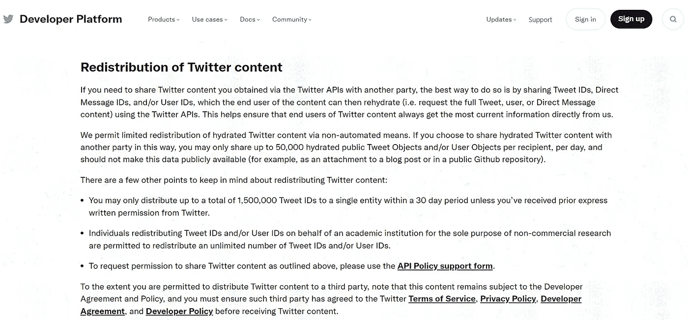
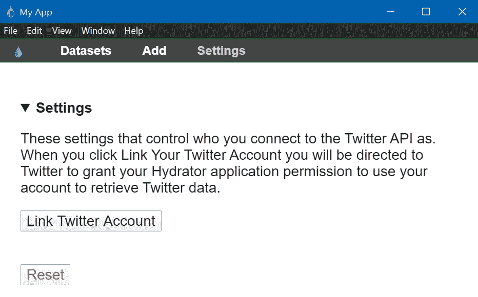
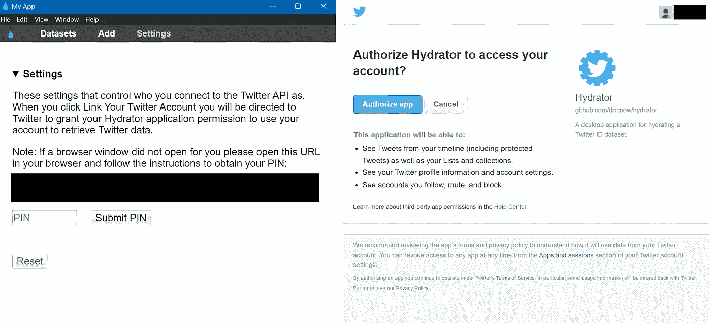
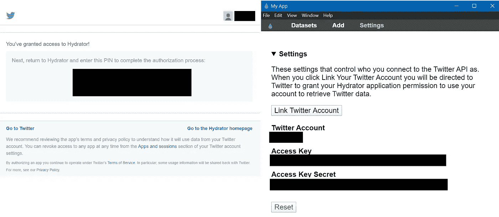
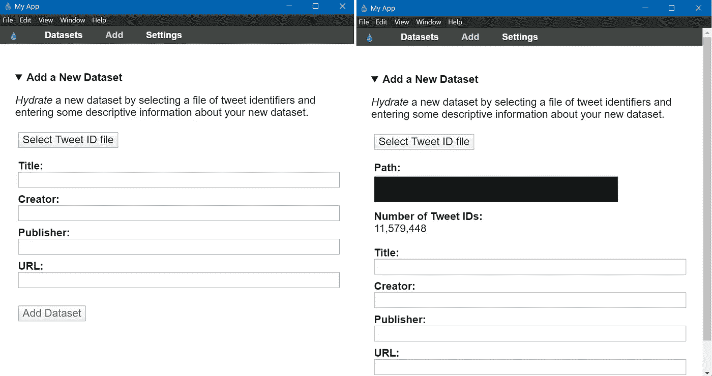
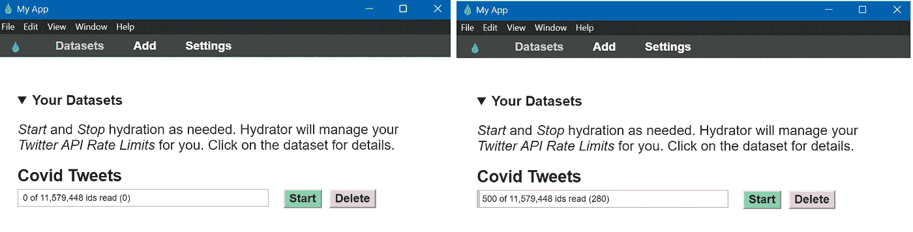
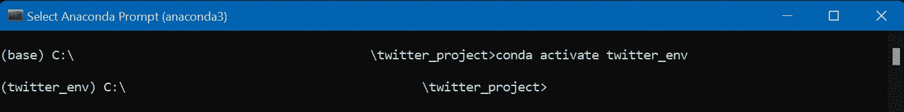
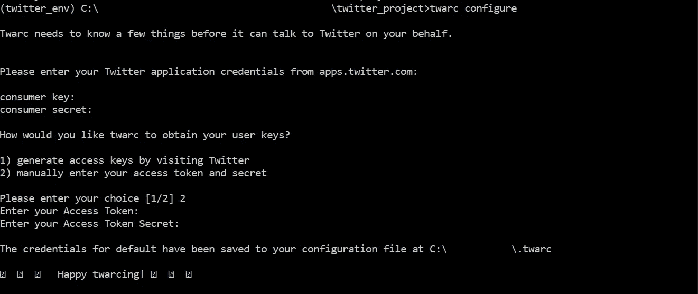

# 了解如何轻松补充推特信息

> 原文：<https://towardsdatascience.com/learn-how-to-easily-hydrate-tweets-a0f393ed340e>

## 使用 DocNow 的 Hydrator 应用程序和 twarc 工具


亚历山大·沙托夫在 [Unsplash](https://unsplash.com/s/photos/twitter?utm_source=unsplash&utm_medium=referral&utm_content=creditCopyText) 上拍摄的照片

# 1.介绍

近年来，社交媒体作为一种交流工具的使用越来越多，导致社交媒体研究获得了很大的关注。Twitter 就是这样一种流行的在线交流形式，它既提供了一个易于访问的 API 来收集数据，又提供了许多工具来分析这些收集到的数据。人口统计、情绪、社会趋势；从 Twitter 上可以收集到的信息种类似乎是无穷无尽的！

与任何数据分析一样，第一步是收集相关数据(在我们的例子中，是推文)。然而，通常自己收集你需要的推文并不总是可行的(例如，如果你需要历史推文)。值得庆幸的是，由于 twitter 的流行，你可能会在网上找到合适的 Twitter 数据集。话虽如此，但有一个问题:Twitter 限制向第三方重新发布 Twitter 内容，因此我们可以在网上获得的只是由相关推文的推文 id 组成的数据集(或者脱水推文)。然后，我们必须合成这些 tweet IDs，以获取 tweet 内容。



Twitter APIs 的受限用例(更多详情，请访问[https://developer . Twitter . com/en/developer-terms/more-on-restricted-Use-Cases](https://developer.twitter.com/en/developer-terms/more-on-restricted-use-cases))

我正在研究如何对这样的数据集进行水化，并发现了**为此提供的两个工具:一个桌面应用程序 *Hydrator* 和一个命令行工具 *twarc。我想我应该在这里写下我使用这些工具的经历，以防对其他想做同样事情的人有所帮助。***

# 2.入门指南

## **第一步:找到要处理的数据集！**

我将在本文中使用由[陈等人](https://github.com/echen102/COVID-19-TweetIDs)【1】提供的数据集。如果你希望只处理这个数据集，他们已经提供了一个脚本，用于合成他们收集的推文(由[埃德·萨默斯](https://github.com/edsu)编写)。因为我的主要目标是熟悉补水工具，所以我不会使用他们的脚本。首先，我决定只使用他们数据集中 2020 年 1 月的 tweet IDs。*注意:如果你想从 GitHub 库中下载特定的文件夹，你可以查看*[***down git***](https://downgit.github.io/#/home)*。然而，永远记住引用你正在使用的库！*

## 第二步:创建一个 Twitter 开发者账户

从事任何与 Twitter 相关的工作都需要你在 [Twitter 开发者门户](https://developer.twitter.com/en)上创建一个账户。在门户网站上注册后，您可以创建一个新的“应用程序”来指定您的研究目的。你现在要做的就是记下你的**消费者(API)密钥**、**消费者(API)秘密**、**访问令牌**、**访问令牌秘密**和**不记名令牌**(可选)。

## 第三步:让我们把文件准备好！

我们将在本文中使用的 twitter 数据集遵循命名约定“冠状病毒-tweet-id-年-月-日-小时”,我们感兴趣的 tweet IDs 分布在 242 个文件中！因此，我们需要首先将所有这些 tweet IDs 合并到一个文件中。由于我使用的是 Windows，这可以通过简单地在命令提示符下输入`copy *.txt merged_tweet_ids.txt`来完成。查看合并后的推文文件，仅在 2020 年 1 月，我们就有大约*1100 万条推文*！

现在，我们都准备好开始补水了！

# 3.补水推文

## 工具 1: [DocNow/Hydrator](https://github.com/DocNow/hydrator) :

让我们从桌面应用程序开始。你可以在这里下载最新发布的 Hydrator 应用[。](https://github.com/DocNow/hydrator/releases)



Hydrator 应用程序启动屏幕(图片由作者提供)

从应用程序的启动屏幕可以看出，我们需要将我们的 twitter 帐户链接到应用程序，以检索推文内容。点击“链接 Twitter 账户”会在你的浏览器中打开一个链接，如下图所示。你只需要授权给 Hydrator 应用程序就可以得到一个 PIN。在应用程序中输入这个 PIN，你就可以开始水合你的 tweet IDs 数据集了(详情见下图)。



点击“链接 Twitter 账户”后的 Hydrator 屏幕(图片由作者提供)



授予 Hydrator 权限(图片由作者提供)

接下来，你必须点击应用程序中的“添加”标签，并选择你的推文 id 数据集。一旦文件被验证(你也可以确认应用程序读取的 tweet IDs 的数量)，如果你愿意，你可以添加关于这个数据集的信息(见下图)。现在剩下的就是点击“添加数据集”了！



添加新的 Tweet IDs 数据集(图片由作者提供)

我们都准备好了！现在，我们所要做的就是点击“开始”(你可以随时停止补水)，应用程序将开始为你的推文 id 补水。*注:所有水合推文都存储在你指定的一个. jsonl 文件中(第一次点击“开始”时)。*



开始/停止补水推文(图片作者)

## 工具 2: [DocNow/twarc](https://github.com/DocNow/twarc)

现在让我们转到命令行工具， *twarc。我在一台 Windows PC 上工作，并为此使用了 Anaconda。让我们首先为我们的项目创建一个虚拟环境(并避免任何未来的包冲突！).*

首先，让我们使用`cd *path*`导航到我们的项目文件夹。现在，我们使用命令`conda create --name *env_name* python=3.10`在这个目录中创建一个虚拟环境。在这里，我还指定了我希望在环境中安装的 python 版本(您可以跳过它，Anaconda 将安装一个默认的 python 版本)。我们现在可以通过输入命令`conda activate env_name`来激活我们的虚拟环境。环境激活后，您可以看到括号内的环境名称，如下图所示。



激活的康达环境“twitter_env”(图片由作者提供)

接下来，让我们在我们的环境中安装 twarc。我用`pip`安装了`twarc`包(`pip install twarc`)。现在，有两种方法可以使用`twarc`给推文补水。

1.  您可以直接从命令行使用`twarc`:在这种情况下，您需要首先用您的凭证配置`twarc`工具(键入`twarc configure`；见下图)。配置完成后，补水就像输入命令一样简单:`twarc hydrate *merged_tweets_ids.txt* > *hydrated_tweets.jsonl*` *。*



twarc 配置(图片由作者提供)

2.您可以使用`twarc`作为一个库:对于这个方法，您可以创建一个`twarc`的实例，如下所示。

```
from twarc import Twarct_inst = Twarc(consumer_key, consumer_secret, access_token, access_token_secret)
```

我更喜欢使用第二种方法，因为:

(a)您可以简单地将您的凭证添加到*中。env* 文件，这比通过命令行输入凭证更安全(坦率地说，也更容易)。你所要做的就是创建一个*。env* 文件。样品*。在我们的例子中，env* 文件将如下所示:

```
BEARER_TOKEN=*BEARER_TOKEN*
CONSUMER_KEY=*CONSUMER_KEY*
CONSUMER_SECRET=*CONSUMER_SECRET*
ACCESS_TOKEN=*ACCESS_TOKEN*
ACCESS_TOKEN_SECRET=*ACCESS_TOKEN_SECRET*
```

(b)你可以直接将你的含水推文添加到数据库中，使你更容易探索数据

如果您也希望遵循第二种方法，您可以使用以下示例脚本:

```
# import required libraries
import os
from dotenv import load_dotenv
from twarc import Twarc
from pymongo import MongoClient# load your environment variables 
BASEDIR = os.path.abspath(os.path.dirname(__file__))
load_dotenv(os.path.join(BASEDIR, '.env'))
load_dotenv('.env')# access credentials from environment variables and provide them to the twarc instancet_inst = Twarc(os.getenv("consumer_key"), os.getenv("consumer_secret"), os.getenv("access_token"), os.getenv("access_token_secret"))# start hydrating tweets and storing them into a MongoDB database (Database*: twitter_db, Collection: covid_tweets*)num_tweets=0for tweet in t_inst.hydrate(open('merged_tweet_ids.txt')):
    client = MongoClient('localhost', 27017)
    db = client.twitter_db
    db.covid_tweets.insert_one(tweet)
    num_tweets += 1
    if num_tweets % 10 == 0:
        print('Number of tweets added into database:{}'.format(num_tweets))
```

# 4.我的想法

如果您只是需要将 tweet IDs 数据集合并到 JSON 中，那么 Hydrator 应用程序似乎是最直接的方法。根据你的方便选择开始/停止补水也是一个明显的优势。然而，如果你希望有更多的灵活性(例如，使用数据库)或者你希望做的事情不仅仅是简单地合成 tweet IDs(例如，使用 Twitter API 过滤/搜索 tweet ),那么使用`twarc`似乎是一个不错的选择。此外，`twarc`工具还提供了许多其他工具(例如，创建文字云、推特墙等。)这将是相当有趣的探索。

当然，这是我第一次使用`twarc`，所以我不是最有效使用这个工具的权威。您可以查看这些链接，获得关于使用`twarc`的更全面的指南:

1.  [https://scholarslab.github.io/learn-twarc/](https://scholarslab.github.io/learn-twarc/)
2.  [https://github.com/alblaine/twarc-tutorial](https://github.com/alblaine/twarc-tutorial)
3.  [https://ucsb-collaboratory.github.io/twarc/](https://ucsb-collaboratory.github.io/twarc/)

# 感谢阅读！:)

这就是这篇文章的结尾！

我们都准备好开始分析我们的水分推文了！

快乐学习！

## 参考:

[1] Chen，e .，Lerman，k .，和 Ferrara，e .，跟踪关于的社交媒体话语:公共冠状病毒推特数据集的开发 JMIR 公共卫生监测，2020，6(2):e19273 (DOI: 10.2196/19273，:32427106)