# 了解如何使用 NeoVim 作为 IDE

> 原文：<https://towardsdatascience.com/learn-how-to-use-neovim-as-an-ide-bc8a4b12cdb2>

## 关于如何设置和使用 NeoVim 的一步一步的教程，适合完全的初学者

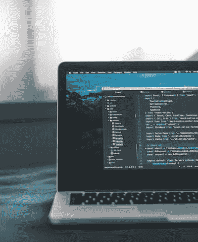

照片由 AltumCode 在 Unsplash 上拍摄

很多年前，我尝试了 NeoVim，我被需要的设置数量吓坏了，我跑了。

我跑到我的常规 VS 代码的舒适处。一个有效的 IDE，看起来不错，拥有我想要的大部分功能。

我以为我在 VS 代码中是有效的，但后来我决定再试一次 NeoVim。

有些人可能会问，当您可以在一分钟内完成一个完整的工作时，为什么要花几个小时来设置一个 IDE，我同意。但是让我们面对现实吧，如果我们每天都要在 IDE 中工作，几个小时的配置并不是一件坏事。

使用 NeoVim 的原因是它是超级可定制的，你真的可以让这个编辑器看起来像你想要的样子，让它的行为像你想要的样子。

NeoVim 的缺点也是定制能力，它需要一些时间来设置和修改在未来。但是一旦你知道如何添加你想要的任何特性，这并不困难或费时。

你也可以在 YouTube 上看这篇文章

本教程不会给你一个完美的 IDE 配置，因为你可以搜索人们的点文件。本教程旨在帮助你理解 NeoVim 并学习如何管理它，让你以后可以构建任何你想要的东西。我不会期望在 Vi 或 NeoVim 中有任何先前的知识。

你知道他们说什么吗

给开发人员一个 IDE，他/她就会编码。

给开发者定制 IDE 的能力，他/她将成为开发者之神。

> 如果你想了解更多关于 Vim 的知识，一本很棒的书是《现代 VIM》。你可以在这里找到，链接是联盟链接，购买会赞助我。

## 安装 NeoVim 并打包插件管理器

按照 [GitHub](https://github.com/neovim/neovim/wiki/Installing-Neovim) 上的说明开始安装 NeoVim。如果你使用的是 ubuntu，我不推荐使用 apt-get install，因为它是一个旧版本。

```
curl https://github.com/neovim/neovim/releases/download/stable/nvim-linux64.tar.gz
tar -xvf nvim-linux64.tar.gz
```

将解压后的文件夹移到存储软件的地方，或者将在`./nvim-linx64/bin/nvim`找到的二进制文件添加到您的 PATH 中。

然后，您可以通过运行`nvim`来打开它

```
nvim
```

这样做将打开 NeoVim 和一个闪屏。请记住，NeoVim 更多的是一个终端，而不是一个具有花哨 UI 的常规编辑器。

您的终端应该如下所示

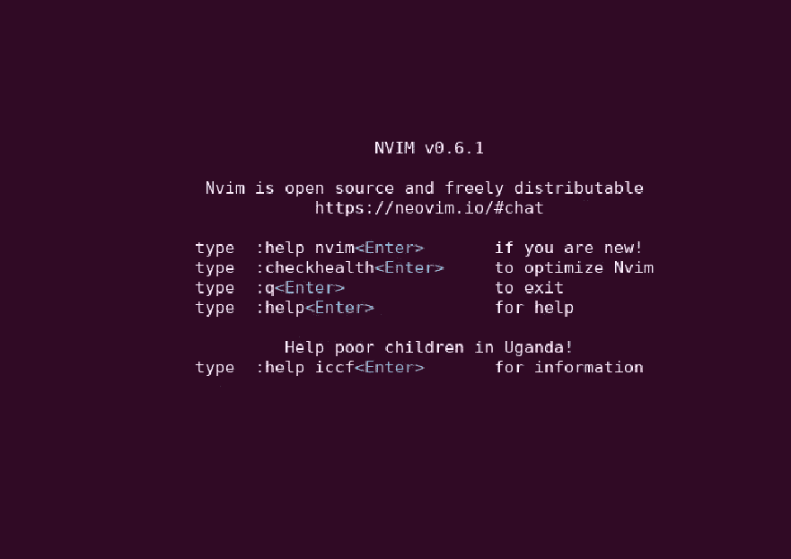

NeoVim 闪屏

如果我们不开始添加一些插件，NeoVim 就没有什么特别的了。这是大部分人刚开始使用 NeoVim 时被吓跑的部分。所以让我们试着简单点。

你现在可以通过按下`SHIFT+:`关闭 NeoVim，这将打开命令提示符，然后在底部出现的选项卡中写下`q`，并按下 enter 键。

按下`SHIFT+:`将打开命令选项卡，允许我们传递命令。

我们需要一个插件管理器，我们将使用的一个流行的插件是 [Packer](https://github.com/wbthomason/packer.nvim) 。

我们可以在 bash 中使用一行程序来安装它，它将获取存储库并将其放在第二个参数的`~/.local/share/nvim`路径中。除非你知道你在做什么，否则不要修改这个路径，它使用默认路径指向 Vim/NeoVim 中的 PackPath。

```
git clone --depth 1 https://github.com/wbthomason/packer.nvim\
 ~/.local/share/nvim/site/pack/packer/start/packer.nvim
```

现在我们已经安装了 Packer，我们需要第一次访问插件配置文件。

所有的配置都保存在一个 LUA 文件中，默认保存在`~/.config/nvim/lua/`。在该位置，我们可以指定配置文件。

## 编写第一个配置&导入插件&导航

NeoVim 中的一切几乎都是由一个插件处理的，例如，如果我们将 NeoVim 用作 IDE，我们将需要语言服务器来理解代码。

我们将继续创建第一个配置文件，它将是`~/.config/nvim/lua/plugins.lua`。

如果该文件夹不存在，则创建它并通过用 NeoVim 打开它来创建文件。

```
mkdir -p ~/.config/nvim/lua
nvim ~/.config/nvim/lua/plugins.lua
```

通过将名字传递给`require`函数，可以在 Lua 文件中导入 Packer。然后，我们将在 NeoVim 上运行一个名为`startup`的函数，该函数将在 NeoVim 启动时执行，这意味着每当 neo vim 启动时，我们都会添加插件和功能。

按下`Insert`或`i`进入插入模式，然后添加以下内容

```
return require('packer').startup(function(use)
  -- Configurations will go here soon
 use 'wbthomason/packer.nvim'
end)
```

我们所做的是让 packer 在启动时运行，然后导入我们想要使用的所有插件，我们还包括 Packer 插件。这允许包装商自我管理和更新等。

按`ESC`退出插入模式，打开命令选项卡`SHIFT+:`并传入`w`保存文件，T10 是 write 的缩写。

如果你现在重启 NeoVim，什么都不会改变，很郁闷吧？

我们还需要告诉 NeoVim 找到这个配置文件并加载它。

这可以在第二个配置文件`~/.config/nvim/init.lua`中完成，这个文件在启动时由 NeoVim 执行，我们将需要 Lua 中的配置脚本。

再次打开`plugins.lua`文件，让我们学习如何在 NeoVim 中导航(暂时),这样我们就不需要一直跳出去了。

一旦 NeoVim 打开，输入命令`Explore`，这将为我们打开一个基于文本的浏览器。它叫 [Netrw](https://neovim.io/doc/user/pi_netrw.html) ，我就不细说了，它甚至可以抓取远程文件等。

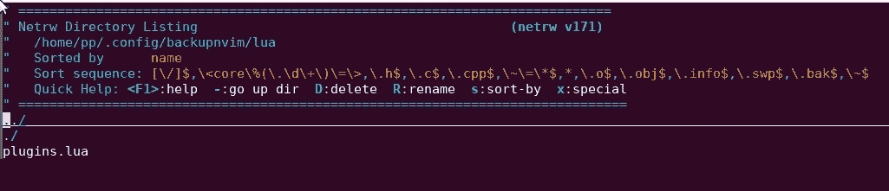

探索显示 NetRW 目录列表

从这里，您可以看到当前目录中的文件，以及默认的 Linux 路径指示器`./`和`../`。一个点是当前目录，两个点是父目录。

我们想在父目录中创建`init.lua`文件，所以选择`../`后按 enter 键，然后按`SHIFT+%`。Shift+%会在底部打开一个输入栏，要求输入文件名，输入`init.lua`。它将在创建文件后打开它。

我们将向它添加一行，如果它不存在，则创建该文件。这一行将确保插件被添加。

```
require('plugins')
```

使用`w`命令保存并重启 NeoVim，我们应该已经安装了 Packer，我们可以通过运行命令来控制它。

如果 Packer 安装正确，我们应该可以使用它的命令，其中一个是`PackerStatus`，它打印所有使用的插件列表。

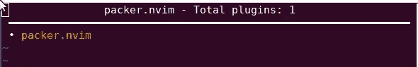

PackerStatus 输出所有使用的插件

你可以按 q 键把状态栏打印下来。

简而言之，我们到目前为止所做的。

1.  学习了如何使用 Packer 来导入插件，`~/.config/nvim/lua/plugins.lua`与此相关。
2.  `~/.config/nvim/init.lua`允许我们告诉 NeoVim 在启动时尊重我们的 Packer 文件。
3.  使用`SHIFT+:`运行命令，如`PackerStatus`。
4.  学习如何使用`Explore`命令导航。

到目前为止，这可能看起来不太令人印象深刻，我同意。让我们添加更多的插件。

我们要编码，所以我们需要语言服务器和调试器等插件。有一个很棒的插件叫做 [Mason](https://github.com/williamboman/mason.nvim) 可以用来做这个，让我们更新一下打包器的配置，你现在应该知道是哪个文件了吧！我们还将获取`neovim/nvim-lspconfig`，这使我们能够获取不同 LSP 的不同配置，查看[文档](https://github.com/neovim/nvim-lspconfig/blob/master/doc/server_configurations.md)以获得完整列表。

将插件配置更新为以下内容。

```
return require('packer').startup(function(use)
        -- Configurations will go here
        use 'wbthomason/packer.nvim'
        use 'williamboman/mason.nvim'   
        use 'williamboman/mason-lspconfig.nvim'
        use 'neovim/nvim-lspconfig'  

end)
```

一旦完成，打开命令栏`SHIFT+:`保存文件，然后运行命令`w`，它将记录下你所做的任何更改。

我们已经保存了文件，但是我们需要重新加载它，这样 Packer 才能注意到这些变化，所以打开命令栏，输入下面的命令，它将重新加载当前打开的 lua 文件。

```
:luafile %
```

然后执行`PackerInstall`命令下载新插件。

```
:PackerInstall
```

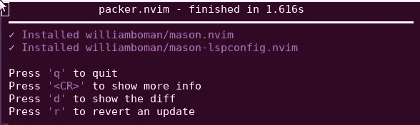

PackerInstall 显示成功安装的软件包

请注意，我们现在安装的插件只帮助我们设置和配置 LSP。例如，如果我们想要 GOPLS，它不会为我们下载它们，我们仍然需要单独安装。

## 启用语言服务器协议支持

使用 nvim-lspconfig 要求我们安装第三方语言服务器，然后可以连接到 NeoVim。这就是我如何在 Mason 的帮助下启用 GOPLS 的。

我们首先启用 Mason，这与 Packer 的做法相同，我们创建一个 lua 脚本来启用它，然后在`init.lua`中需要该脚本。

让我们从创建 lua 文件来管理 mason 开始。

```
touch ~/.config/nvim/lua/mason-config.lua
```

然后打开文件，并填写下面的代码，要求插件和调用他们的设置功能。

```
require("mason").setup()
require("mason-lspconfig").setup()
```

使用`w`保存文件。

然后我们通过使用名称前缀`mason-config`来更新`init.lua`以要求该脚本。在文件之间切换时，记得使用`Explore`。

```
require('plugins')
require('mason-config')
```

一旦完成，打开 NeoVim 应该有新的`Mason`命令，这将为我们打开一个设置管理器。

如果您使用的是早于 0.7 的 NeoVim 版本，打开 NeoVim 时可能会出现错误，请按 enter 键并运行命令

```
:checkhealth
```

这是一个非常有用的命令，用于测试和检测任何错误。

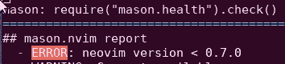

运行旧版本 NeoVim 时出错

运行`:Mason`将调出所有可用的 LSP，找到您拥有的 LSP，并记住名称。我就装`gopls`。

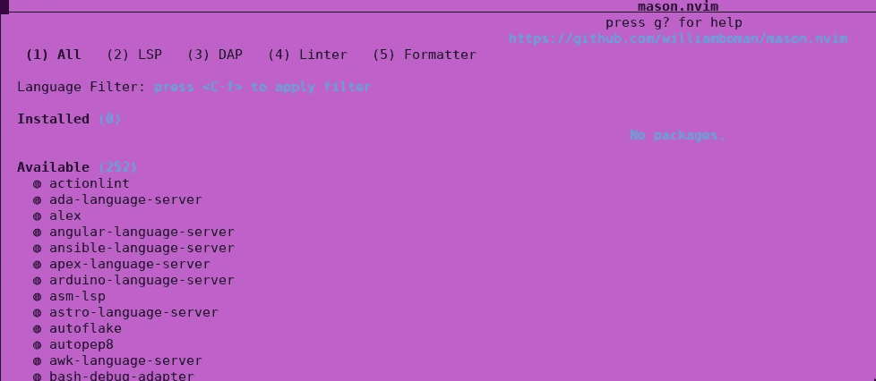

Mason 命令调出一个 UI 来设置语言服务器

要安装它，运行命令，添加您想要的任何包，如果您添加了许多包，那么用空格将它们分开。

```
MasonInstall gopls
```

请注意，每个安装可能需要您安装软件，就像 gopls 安装需要 go 一样。

现在 gopls 已经安装好了，我们需要让 NeoVim 附加上它。

这真的很简单，过程现在应该很熟悉了，我们将在 lua 文件夹中创建一个`gopls.lua`文件，然后我们将在`init.lua`中需要该脚本。

`gopls.lua`将导入 lspconfig 包，它允许我们将 gopls 附加到 neovim。

您可以配置 gopls 来做很多事情，我们将使用 gopls 文档中的简单示例，每个服务器都有自己的一组配置，您需要查看它们的文档来指定哪些内容。

```
 -- Require LSP config which we can use to attach gopls
  lspconfig = require "lspconfig"
  util = require "lspconfig/util"
-- Since we installed lspconfig and imported it, we can reach
-- gopls by lspconfig.gopls
-- we can then set it up using the setup and insert the needed configurations
  lspconfig.gopls.setup {
    cmd = {"gopls", "serve"},
    filetypes = {"go", "gomod"},
    root_dir = util.root_pattern("go.work", "go.mod", ".git"),
    settings = {
      gopls = {
        analyses = {
          unusedparams = true,
        },
        staticcheck = true,
      },
    },
  }
```

如果你正在使用 go，你会想添加更多的分析等，但我们在这里如何学习如何设置，然后定制是由你决定的。

> 我向你推荐 go 版的 [ray-x](https://github.com/ray-x/go.nvim) ，按照本教程学习后，它应该很容易安装。

确保在`init.lua`中需要新的 lua 脚本。

```
require('plugins')
require('mason-config')
require('gopls')
```

现在创建一个`main.go`,看看它是否能检测到错误，这里有一张图片显示了我的错误。


main.go 文件中出现错误

## 代码完成和建议

我们正朝着正确的方向前进，但我们看到了错误。不知道大家注意到没有代码补全或者建议。

那是编辑器里的超级必备，我们来补充一下。

补充一下，我们需要一个…..*鼓点*，等着吧，一个插件！

我们将利用 [hrsh7th](https://github.com/hrsh7th/) 插件为这个或插件。

他有一整套插件，我会把链接放在这里，但我不会详细介绍它们

*   nvim-CMP—neo vim 的完井引擎插件
*   [CMP-nvim-LSP](https://github.com/hrsh7th/cmp-nvim-lsp)—neo vim 内置语言服务器客户端的 nvim-cmp 源代码。
*   [CMP-nvim-LSP-signature-help](https://github.com/hrsh7th/cmp-nvim-lsp-signature-help)—nvim-CMP 源，用于显示强调当前参数的函数签名:
*   [CMP-nvim-Lua](https://github.com/hrsh7th/cmp-nvim-lua)—neovim Lua API 的 nvim-cmp 源代码。
*   [vim-vsnip](https://github.com/hrsh7th/vim-vsnip) —创建和使用 vs 代码片段的能力。
*   [cmp-path](https://github.com/hrsh7th/cmp-path) —文件系统路径的 nvim-cmp 源文件。
*   [cmp-buffer](https://github.com/hrsh7th/cmp-buffer) —缓冲字的 nvim-cmp 源。

我们可以将所有这些插件添加到`lua/plugins.lua`文件中。

```
-- Hrsh7th Code Completion Suite
    use 'hrsh7th/nvim-cmp' 
    use 'hrsh7th/cmp-nvim-lsp'
    use 'hrsh7th/cmp-nvim-lua'
    use 'hrsh7th/cmp-nvim-lsp-signature-help'
    use 'hrsh7th/cmp-vsnip'                             
    use 'hrsh7th/cmp-path'                              
    use 'hrsh7th/cmp-buffer'                            
    use 'hrsh7th/vim-vsnip'
```

然后通过运行`:w`命令保存文件，用`:luafile %`重新加载 lua 文件，然后用`:PackerSync`同步软件包，这将删除任何未使用的插件，并安装新的插件。

一旦完成，我们需要在`lua/code-completion.lua`中编写一个新的配置文件，我们用它来管理插件，并配置它们按照我们想要的方式运行。

我们希望出现一个带有代码建议的小弹出对话框，这可以使用 NeoVim 中可用的许多配置之一来完成，所有配置都可以在这里找到。

我们正在寻找的是`vim.opt.[completeopt](https://neovim.io/doc/user/options.html#'completeopt')`，这是用来使一个菜单出现的建议。所有可用的配置都在[文档](https://neovim.io/doc/user/options.html#'completeopt')中，我将只在每个文档上方留下注释来解释它。

之后，我们将需要`cmp`，它允许我们配置插件。我们将调用 setup 函数在设置时应用一些设置。

该文件在开始时将如下所示

```
-- completeopt is used to manage code suggestions
-- menuone: show popup even when there is only one suggestion
-- noinsert: Only insert text when selection is confirmed
-- noselect: force us to select one from the suggestions
vim.opt.completeopt = {'menuone', 'noselect', 'noinsert', 'preview'}
-- shortmess is used to avoid excessive messages
vim.opt.shortmess = vim.opt.shortmess + { c = true}

local cmp = require'cmp'
cmp.setup({ 
  -- Configurations will go here
})
```

我们需要配置的第一件事是源代码，我们在这里做的是将已安装的插件设置为代码建议的源代码。

```
-- sources are the installed sources that can be used for code suggestions
 sources = {
      { name = 'path' },
      { name = 'nvim_lsp', keyword_length = 3 },
      { name = 'nvim_lsp_signature_help'}, 
      { name = 'nvim_lua', keyword_length = 2},
      { name = 'buffer', keyword_length = 2 },
      { name = 'vsnip', keyword_length = 2 },
 }
```

之后，我们将想要添加映射！

映射非常有趣，这意味着我们可以创建键盘快捷键来执行某些命令。如果代码建议对话框显示选项，我们如何选择我们想要的选项，如何确认，当我们确认时会发生什么？

映射很容易建立，我们做的第一件事是声明激活动作的键。语法是`<Key-Key2-Key3>`，可能需要一段时间来学习哪些键是可用的，但是[文档](https://neovim.io/doc/user/intro.html)为我们提供了帮助。

我希望有和我在 VS 代码中使用的相同的映射，但是你可以按照你想要的方式设置它！我将使用缩写为`C`的 CTRL。如何在按下`CTRL+SPACE`时触发代码完成对话框的示例如下所示。

```
 ['<C-Space>'] = cmp.mapping.complete(),
```

我们使用的 cmp 包有几个可以调用的可用函数，它们都出现在这里。

我将在每个映射上面添加注释，下面是我的`code-completion.lua`如何处理映射。

```
-- completeopt is used to manage code suggestions
-- menuone: show popup even when there is only one suggestion
-- noinsert: Only insert text when selection is confirmed
-- noselect: force us to select one from the suggestions
vim.opt.completeopt = {'menuone', 'noselect', 'noinsert', 'preview'}
-- shortmess is used to avoid excessive messages
vim.opt.shortmess = vim.opt.shortmess + { c = true}

local cmp = require'cmp'
cmp.setup({ 

  mapping = {
    -- Shift+TAB to go to the Previous Suggested item
    ['<S-Tab>'] = cmp.mapping.select_prev_item(),
    -- Tab to go to the next suggestion
    ['<Tab>'] = cmp.mapping.select_next_item(),
    -- CTRL+SHIFT+f to scroll backwards in description
    ['<C-S-f>'] = cmp.mapping.scroll_docs(-4),
    -- CTRL+F to scroll forwards in the description
    ['<C-f>'] = cmp.mapping.scroll_docs(4),
    -- CTRL+SPACE to bring up completion at current Cursor location
    ['<C-Space>'] = cmp.mapping.complete(),
    -- CTRL+e to exit suggestion and close it
    ['<C-e>'] = cmp.mapping.close(),
    -- CR (enter or return) to CONFIRM the currently selection suggestion
    -- We set the ConfirmBehavior to insert the Selected suggestion
    ['<CR>'] = cmp.mapping.confirm({
      behavior = cmp.ConfirmBehavior.Insert,
      select = true,
    })
  },

  -- sources are the installed sources that can be used for code suggestions
 sources = {
      { name = 'path' },
      { name = 'nvim_lsp', keyword_length = 3 },
      { name = 'nvim_lsp_signature_help'}, 
      { name = 'nvim_lua', keyword_length = 2},
      { name = 'buffer', keyword_length = 2 },
      { name = 'vsnip', keyword_length = 2 },
 }
})
```

打开`init.lua`并将`code-completion.lua`添加到文件中。

```
require('plugins')
require('mason-config')
require('gopls')
```

一旦在配置中，保存它，打开一个新的`.go`文件，并尝试它！您应该看到代码建议，并且能够使用键映射来导航这些建议。

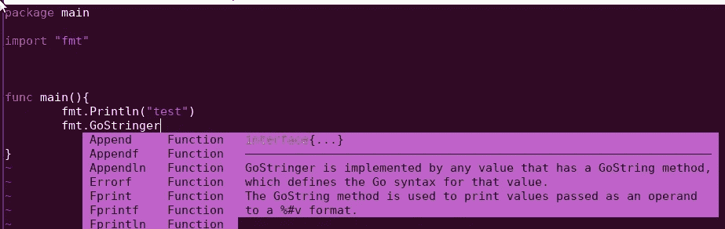

代码建议现在起作用了

如果您想要启用 vsnip 插件，我们还需要将以下代码添加到`code-completion.lua`中。

```
 snippet = {
    expand = function(args)
        vim.fn["vsnip#anonymous"](args.body)
    end,
  },
```

我们可以在窗户上加一些边框，让它看起来好一点。

```
 window = {
      completion = cmp.config.window.bordered(),
      documentation = cmp.config.window.bordered(),
  },
```

如果我们添加它，它将看起来像下面这样。

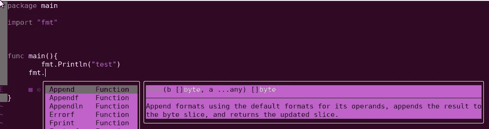

为建议添加边框

有时编辑格式可能是有意义的，例如，我们可以根据建议的来源添加图标。下面的代码片段根据源的名称添加格式。

```
-- completeopt is used to manage code suggestions
-- menuone: show popup even when there is only one suggestion
-- noinsert: Only insert text when selection is confirmed
-- noselect: force us to select one from the suggestions
vim.opt.completeopt = {'menuone', 'noselect', 'noinsert', 'preview'}
-- shortmess is used to avoid excessive messages
vim.opt.shortmess = vim.opt.shortmess + { c = true}

local cmp = require'cmp'
cmp.setup({ 
  -- Required by vsnip
  snippet = {
    expand = function(args)
        vim.fn["vsnip#anonymous"](args.body)
    end,
  },
  -- Add Mappings to control the code suggestions
  mapping = {
    -- Shift+TAB to go to the Previous Suggested item
    ['<S-Tab>'] = cmp.mapping.select_prev_item(),
    -- Tab to go to the next suggestion
    ['<Tab>'] = cmp.mapping.select_next_item(),
    -- CTRL+SHIFT+f to scroll backwards in description
    ['<C-S-f>'] = cmp.mapping.scroll_docs(-4),
    -- CTRL+F to scroll forwards in the description
    ['<C-f>'] = cmp.mapping.scroll_docs(4),
    -- CTRL+SPACE to bring up completion at current Cursor location
    ['<C-Space>'] = cmp.mapping.complete(),
    -- CTRL+e to exit suggestion and close it
    ['<C-e>'] = cmp.mapping.close(),
    -- CR (enter or return) to CONFIRM the currently selection suggestion
    -- We set the ConfirmBehavior to insert the Selected suggestion
    ['<CR>'] = cmp.mapping.confirm({
      behavior = cmp.ConfirmBehavior.Insert,
      select = true,
    })
},

  -- sources are the installed sources that can be used for code suggestions
  sources = {
      { name = 'path' },
      { name = 'nvim_lsp', keyword_length = 3 },
      { name = 'nvim_lsp_signature_help'}, 
      { name = 'nvim_lua', keyword_length = 2},
      { name = 'buffer', keyword_length = 2 },
      { name = 'vsnip', keyword_length = 2 },
  },
  -- Add borders to the windows
   window = {
      completion = cmp.config.window.bordered(),
      documentation = cmp.config.window.bordered(),
  },
  -- add formating of the different sources
    formatting = {
      fields = {'menu', 'abbr', 'kind'},
      format = function(entry, item)
          local menu_icon ={
              nvim_lsp = 'λ',
              vsnip = '⋗',
              buffer = 'b',
              path = 'p'
          }
          item.menu = menu_icon[entry.source.name]
          return item
      end,
  },
})
```

应用后，你应该会看到小图标或文字取决于来源。

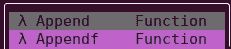

显示信号源的图标

我们现在已经有了代码完成功能，但是我们还可以做得更多！

## 文件树&简单遍历&第一个自定义键映射

到目前为止，我们一直使用`Explore`命令来切换文件。如果你想保持理智，我不建议你在开发环境中这么做。

幸运的是，在 NeoVim 中有一个简单的解决方案。有一个非常流行的插件叫做`nvim-tree`，可以在 [GitHub](https://github.com/nvim-tree/nvim-tree.lua) 上找到。

现在安装它应该是轻而易举的。

打开 Packer 配置文件`plugins.lua`并添加 Nvim 插件。我们将添加`nvim-web-devicons`使新的文件浏览器更好看一些。

这一次，你会在 Packer 配置中看到一个新的语法，我们不会使用一个字符串来导入插件，而是一个内部有需求的对象。

这意味着我们将需要 nvim-tree 插件，但也需要 devicons。这可以用来确保我们有所有需要的插件，而不是只有一个。

```
return require('packer').startup(function(use)
 -- Configurations will go here
 use 'wbthomason/packer.nvim'
 use 'williamboman/mason.nvim'
 use 'williamboman/mason-lspconfig.nvim'
 use 'neovim/nvim-lspconfig'
 -- Hrsh7th Code Completion Suite
 use 'hrsh7th/nvim-cmp' 
 use 'hrsh7th/cmp-nvim-lsp'
 use 'hrsh7th/cmp-nvim-lua'
 use 'hrsh7th/cmp-nvim-lsp-signature-help'
 use 'hrsh7th/cmp-vsnip'                             
 use 'hrsh7th/cmp-path'                              
 use 'hrsh7th/cmp-buffer'                            
 use 'hrsh7th/vim-vsnip'
 -- File explorer tree
 use {
  'nvim-tree/nvim-tree.lua',
    requires = {
      'nvim-tree/nvim-web-devicons', -- optional, for file icons
    },
 }
end)
```

注意，为了让 devicons 正常工作，你需要安装书呆子字体，如果你不想要，就跳过这个要求。书呆子字体很容易安装滚动到网页底部，并安装他们的修补软件。

下载一个字体，我用`Go-Mono`然后把它添加为字体，我推荐用`font-manager`，这里看怎么用。

一旦完成，保存文件`:w`，然后重新加载`luafile %`，然后用`PackerSync`更新插件。

我们希望在启动时配置 NvimTree，我们将从他们的文档中获取配置，但添加它以便树在启动时打开。

创建一个新的 lua 脚本并适当地命名，我将命名我的`file-explorer.lua`。

```
-- disable netrw at the very start of your init.lua (strongly advised)
vim.g.loaded_netrw = 1
vim.g.loaded_netrwPlugin = 1

-- set termguicolors to enable highlight groups
vim.opt.termguicolors = true

-- empty setup using defaults
require("nvim-tree").setup({
  open_on_setup = true,
  ignore_buffer_on_setup = true,
})
```

让我们要求`init.lua`里面的脚本

```
require('plugins')
require('file-explorer')
require('mason-config')
require('gopls')
require('code-completion')
```

重新启动 NeoVim 将会显示一个新的漂亮的文件树，这样我们就可以导航了。

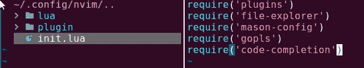

NvimTree 现在显示文件和目录

使用鼠标或它附带的许多默认映射，在树中导航很容易。我推荐这本[指南](https://docs.rockylinux.org/books/nvchad/nvchad_ui/nvimtree/)，它很适合学习。

您可以使用快捷键`CTRL+w`进入导航模式，该模式允许您在打开的面板之间跳转，按左键或右键向该方向跳转。您也可以使用`CTRL+w+w`快速跳到下一个面板。

您可能需要了解一些不错的命令。一旦你进入 NvimTree，按`a`将允许你创建一个文件，`d`将删除一个文件。

按下`q`将关闭该树，要打开它，我们可以运行长而不必要的命令`:NvimTreeToggle`。

我喜欢在按下`ctrl+n`时打开树，所以我将添加映射。

使用 NvimTree，我将转到`lua`目录并创建一个`custom-keys.lua`文件，我将在其中存储我的个人键映射。我可以通过按下`a`来创建文件。

```
-- fetch keymap
local map = vim.api.nvim_set_keymap

-- map the key n to run the command :NvimTreeToggle
map('n', 'n', [[:NvimTreeToggle<CR>]], {})
```

在脚本中，我们使用 nvim api 的一部分`vim.api.nvim_set_keymap`来创建自定义键映射。查看他们的[文档](https://neovim.io/doc/user/api.html#nvim_set_keymap())了解所有可用的设置和模式。

第一个参数指定启用键映射的模式，我希望它处于正常模式。您也可以在其他模式下使用它，例如插入模式。

然后我们设置按 n 将触发`:NvimTreeToggle`命令，我们添加`<CR>`来自动触发命令，我们不想每次都按 enter。

然后，当然，我们需要更新`init.lua`来包含`custom-keys`文件。

```
require('plugins')
require('file-explorer')
require('mason-config')
require('gopls')
require('code-completion')
require('custom-keys')
```

重新打开 NeoVim 并按下`n`将会打开 NvimTree，你应该把它设置成你觉得舒服的键。

## 使用 DAP 和 DapUI 调试

我们现在有了一个文件树，我们有了代码完成，还有一个语言服务器，它会告诉我们什么时候出错了。

开发时的一件重要事情是测试和调试代码，所以我们需要添加这一点。

我们可以再次使用 Mason 插件，我们想要安装一个 DAP，因为我关注 Go，所以我想要 [Delve](https://github.com/go-delve/delve) 。

运行命令

```
:MasonInstall delve
```

之后，我们需要安装一个名为`nvim-dap`的[插件](https://github.com/mfussenegger/nvim-dap)，用于管理多种语言的 DAP。

把它添加到`plugins.lua`，保存文件并重新加载它，你记得怎么对吗？然后执行`PackerSync`。

```
return require('packer').startup(function(use)
 -- Configurations will go here
 use 'wbthomason/packer.nvim'
 use 'williamboman/mason.nvim'
 use 'williamboman/mason-lspconfig.nvim'
 use 'neovim/nvim-lspconfig'
 -- Hrsh7th Code Completion Suite
     use 'hrsh7th/nvim-cmp' 
     use 'hrsh7th/cmp-nvim-lsp'
     use 'hrsh7th/cmp-nvim-lua'
     use 'hrsh7th/cmp-nvim-lsp-signature-help'
     use 'hrsh7th/cmp-vsnip'                             
     use 'hrsh7th/cmp-path'                              
     use 'hrsh7th/cmp-buffer'                            
     use 'hrsh7th/vim-vsnip'
 -- File explorer tree
     use 'nvim-tree/nvim-web-devicons' -- optional, for file icons
 use 'nvim-tree/nvim-tree.lua'
 -- DAP for debugging
 use 'mfussenegger/nvim-dap'
end)
```

根据您想要调试的语言，我们需要对其进行配置。您可以在[文档](https://github.com/mfussenegger/nvim-dap/wiki/Debug-Adapter-installation#Go)中找到不同语言的完整示例列表。

我们从要求 dap 开始，然后您可以使用`dap.adapters`后跟适配器名称来定位 DAP。在我的例子中，我的目标是`delve`，它将是`dap.adapters.delve`。应该为每个适配器检查要设置的配置，我将简单地让 delve 运行当前打开的文件。

我将创建一个新的配置脚本，惊喜！

这一个将被命名为`debugging.lua`。

```
-- fetch the dap plugin
local dap = require('dap')
-- Add adapter to delve
dap.adapters.delve = {
  type = 'server',
  port = '${port}',
  executable = {
    command = 'dlv',
    args = {'dap', '-l', '127.0.0.1:${port}'},
  }
}

-- https://github.com/go-delve/delve/blob/master/Documentation/usage/dlv_dap.md
dap.configurations.go = {
  {
    type = "delve",
    name = "Debug",
    request = "launch",
    program = "${file}"
  },
  {
    type = "delve",
    name = "Debug test", -- configuration for debugging test files
    request = "launch",
    mode = "test",
    program = "${file}"
  },
  -- works with go.mod packages and sub packages 
  {
    type = "delve",
    name = "Debug test (go.mod)",
    request = "launch",
    mode = "test",
    program = "./${relativeFileDirname}"
  } 
}
```

和往常一样，更新`init.lua`以包含脚本

```
require('plugins')
require('file-explorer')
require('mason-config')
require('gopls')
require('code-completion')
require('custom-keys')
require('debugging')
```

nvim-dap 不附带任何预设映射。没有映射，使用它是一种痛苦。

要设置断点，我们需要执行命令`:lua require'dap'.toggle_breakpoint()`。

或者开始调试当前文件，我们需要`:lua require'dap'.continue()`。

你可能会理解，这有点过了。让我们修复键映射，因为我们已经知道如何做了！

我将首先添加两个映射，第一个是当我按 F5 时启动调试器，第二个是使用`CTRL+b`切换断点。

在`custom-keys.lua`内添加以下内容

```
-- nvim-dap keymappings
-- Press f5 to debug
map('n', '<F5>', [[:lua require'dap'.continue()<CR>]], {})
-- Press CTRL + b to toggle regular breakpoint
map('n', '<C-b>', [[:lua require'dap'.toggle_breakpoint()<CR>]], {})
```

重新启动 NeoVim 并在文件中按 CTRL+B 将会设置断点，如左边的 B 所示。

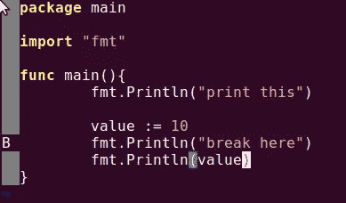

b 表示断点

按 F5 应该会调出配置选择，并显示我们创建的所有不同配置。你可以添加许多不同的配置，比如一个`launch.json`。如果你有一个来自 VS 代码的。

如果选择 1，调试器将运行，并在断点处停止。用箭头表示。

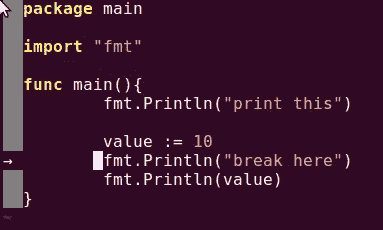

箭头显示我们正在调试当前行

> 现在你可能已经明白，我们可以配置图标和更多。查看插件文档

然后我们可以打开一个 [REPL](https://github.com/mfussenegger/nvim-dap/blob/master/doc/dap.txt#L794) 窗口来使用 delve 查找值等。

运行以下命令浏览 REPL

```
:lua require'dap'.repl.open()
```

您应该会看到一个新窗口出现

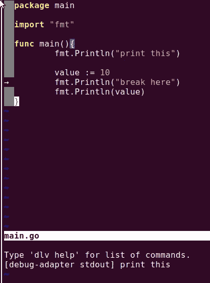

REPL 窗口与我们的调试器

使用`CTRL+w+arrowdown`导航到它。然后你需要通过按下`i`激活插入模式，并尝试执行一个命令。我将使用`.scopes`来查看局部范围变量。

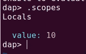

打印局部范围变量

你可以用`:q`关闭调试窗口。

现在我们知道了如何使用调试器，让我们添加一些更方便的映射。我已经为每个命令添加了解释，你可以根据自己的需要更改按钮。

```
-- nvim-dap keymappings
-- Press f5 to debug
map('n', '<F5>', [[:lua require'dap'.continue()<CR>]], {})
-- Press CTRL + b to toggle regular breakpoint
map('n', '<C-b>', [[:lua require'dap'.toggle_breakpoint()<CR>]], {})
-- Press CTRL + c to toggle Breakpoint with Condition
map('n', '<C-c>', [[:lua require'dap'.set_breakpoint(vim.fn.input('Breakpoint Condition: '))<CR>]], {})
-- Press CTRL + l to toggle Logpoint
map('n', '<C-l>', [[:lua require'dap'.set_breakpoint(nil, nil, vim.fn.input('Log Point Msg: '))<CR>]], {})
-- Pressing F10 to step over
map('n', '<F10>', [[:lua require'dap'.step_over()<CR>]], {})
-- Pressing F11 to step into
map('n', '<F11>', [[:lua require'dap'.step_into()<CR>]], {})
-- Pressing F12 to step out
map('n', '<F12>', [[:lua require'dap'.step_out()<CR>]], {})
-- Press F6 to open REPL
map('n', '<F6>', [[:lua require'dap'.repl.open()<CR>]], {})
-- Press dl to run last ran configuration (if you used f5 before it will re run it etc)
map('n', 'dl', [[:lua require'dap'.run_last()<CR>]], {})
```

现在，运行调试器是惊人的，但有时有一个 UI 来帮助我们也不错。

我推荐 [nvim-dap-ui](https://github.com/rcarriga/nvim-dap-ui) ，它让一切看起来更干净一点。

到目前为止，添加插件应该是轻而易举的事情。更新`plugins.lua`。

```
return require('packer').startup(function(use)
 -- Configurations will go here
 use 'wbthomason/packer.nvim'
 use 'williamboman/mason.nvim'
 use 'williamboman/mason-lspconfig.nvim'
 use 'neovim/nvim-lspconfig'
 -- Hrsh7th Code Completion Suite
     use 'hrsh7th/nvim-cmp' 
     use 'hrsh7th/cmp-nvim-lsp'
     use 'hrsh7th/cmp-nvim-lua'
     use 'hrsh7th/cmp-nvim-lsp-signature-help'
     use 'hrsh7th/cmp-vsnip'                             
     use 'hrsh7th/cmp-path'                              
     use 'hrsh7th/cmp-buffer'                            
     use 'hrsh7th/vim-vsnip'
 -- File explorer tree
     use 'nvim-tree/nvim-web-devicons' -- optional, for file icons
 use 'nvim-tree/nvim-tree.lua'
 -- DAP for debugging
 use 'mfussenegger/nvim-dap'
 -- UI for DAP
 use { "rcarriga/nvim-dap-ui", requires = {"mfussenegger/nvim-dap"} }
end)
```

保存、重新加载(luafile %)和打包同步。

安装后，我们还需要设置它。由于这是调试的一部分，我将把它存储在我们配置 dap 的`debugging.lua`中。为 dapui 添加一个需求，执行 setup()函数。

```
-- fetch the dap plugin
local dap = require('dap')
-- Setup DapUI
local dapui = require('dapui')
-- set it up see more configs in their repo
dapui.setup()
```

和大多数插件一样，这增加了一些命令，我们将更新`custom-keys.lua`来触发 DapUi。

DapUI 有一个切换功能来打开它，我们想移除 Nvim 树来让它看起来更好一些。

这是 NeoVim 开始变酷的时候，看看我们如何轻松地将这些功能链接在一起。无限可能。

```
-- Press Ctrl+d to toggle debug mode, will remove NvimTree also
map('n', '<C-d>', [[:NvimTreeToggle<CR> :lua require'dapui'.toggle()<CR>]], {})
```

如果您执行我们之前使用的相同的`main.go`，设置一个断点并启动调试器(F5)。一旦停止，按`d`调出 DapUI，显示线程、变量值、REPL 和播放/重复/停止按钮。

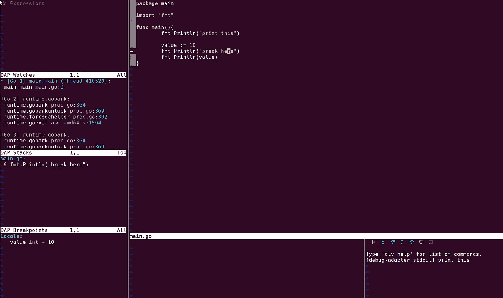

DAPUi 让调试变得更好。

按`CTRL+d`恢复 nvimtree 并移除调试栏。

## 使用事件监听器使 NeoVim 具有反应性

这很好，我们可以调试我们写的代码。

当你穿越 NeoVim 无底洞去做你想做的事情时，有一件重要的事情需要知道，那就是如何使用[事件](https://neovim.io/doc/user/api.html#api-global-events)。NeoVim 触发事件，插件也可以触发事件。

就像在 JavaScript 等中一样，我们可以监听这些事件并应用命令来触发它们。

了解这一点的一个简单方法是每当我们触发一个调试会话时就让 DapUI 出现。

Nvim DAP 将触发两个事件，`before`和`after`，可以在它们的[文档](https://github.com/mfussenegger/nvim-dap/blob/master/doc/dap.txt#L1002)中找到。

在`debugging.lua`内部，我将添加一个事件监听器，并在 DAP 初始化后触发`dapui.open`。一旦 DAP 被终止或退出，我们将使用`dapui.close`关闭。

```
-- fetch the dap plugin
local dap = require('dap')
-- Setup DapUI
local dapui = require('dapui')
-- set it up see more configs in their repo
dapui.setup()

-- dap fires events, we can listen on them to open UI on certain events
dap.listeners.after.event_initialized["dapui_config"] = function()
  dapui.open()
end
dap.listeners.before.event_terminated["dapui_config"] = function()
  dapui.close()
end
dap.listeners.before.event_exited["dapui_config"] = function()
  dapui.close()
end
```

重启`main.go`中的调试器，看看它现在是如何自动打开和关闭的。

使用侦听器，您可以添加格式等任何您想要的东西。

## 样式和添加开发工具

老实说，我们目前所做的非常强大和灵活，但是看起来像垃圾。

为了让 NeoVim 看起来更好一点，我们可以开始修改配色方案。改变颜色模式将应用不同的颜色，使事情看起来更好。

一个真正常见的主题是吸血鬼主题。它之所以流行，大概是因为它看起来很棒，支持很多流行的插件。

它安装起来超级简单，和所有其他插件一样。

强大的三步火箭，更新插件，添加配置文件，在 init.lua 中添加 require。

添加到`plugins.lua`

```
 -- Dracula theme for styling
 use 'Mofiqul/dracula.nvim'
```

保存文件`:w`，重新加载文件`:luafile %`，执行`:PackerSync`

在 NvimTree 中按下`a`创建一个名为`styling.lua`的新文件。

在 styling.lua 内部，应用 dracula 配色方案。

```
vim.cmd[[colorscheme dracula]]
```

保存文件并更新`init.lua`以包含样式

```
require('plugins')
require('file-explorer')
require('mason-config')
require('gopls')
require('code-completion')
require('custom-keys')
require('debugging')
require('styling')
```

重新加载 NeoVim，它应该看起来更酷！

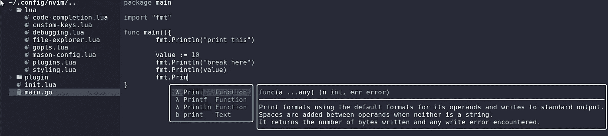

德古拉主题已应用

为了使它更加强大，让我们添加 [nvim-treesitter](https://github.com/nvim-treesitter/nvim-treesitter) 。Treesitter 是在代码中提供更好的突出显示的一种方式。

至此，您已经非常熟悉如何安装插件了，所以我不会解释每个步骤，只展示文件。您应该能够自己配置它。

```
return require('packer').startup(function(use)
 -- Configurations will go here
 use 'wbthomason/packer.nvim'
 use 'williamboman/mason.nvim'
 use 'williamboman/mason-lspconfig.nvim'
 use 'neovim/nvim-lspconfig'
 -- Hrsh7th Code Completion Suite
     use 'hrsh7th/nvim-cmp' 
     use 'hrsh7th/cmp-nvim-lsp'
     use 'hrsh7th/cmp-nvim-lua'
     use 'hrsh7th/cmp-nvim-lsp-signature-help'
     use 'hrsh7th/cmp-vsnip'                             
     use 'hrsh7th/cmp-path'                              
     use 'hrsh7th/cmp-buffer'                            
     use 'hrsh7th/vim-vsnip'
 -- File explorer tree
     use 'nvim-tree/nvim-web-devicons' -- optional, for file icons
 use 'nvim-tree/nvim-tree.lua'
 -- DAP for debugging
 use 'mfussenegger/nvim-dap'
 -- UI for DAP
 use { "rcarriga/nvim-dap-ui", requires = {"mfussenegger/nvim-dap"} }
 -- Dracula theme for styling
 use 'Mofiqul/dracula.nvim'
 -- Treesitter
 use {
  -- recommended packer way of installing it is to run this function, copied from documentation
         'nvim-treesitter/nvim-treesitter',
      run = function()
              local ts_update = require('nvim-treesitter.install').update({ with_sync = true })
              ts_update()
         end,

 }
end)
```

然后是一个`syntax-highlight.lua`文件来处理配置

```
require'nvim-treesitter.configs'.setup {
  -- A list of parser names, or "all"
  ensure_installed = { "go", "lua", "rust" },

  -- Install parsers synchronously (only applied to `ensure_installed`)
  sync_install = false,

  -- Automatically install missing parsers when entering buffer
  -- Recommendation: set to false if you don't have `tree-sitter` CLI installed locally
  auto_install = true,

  highlight = {
    -- `false` will disable the whole extension
    enable = true,

  },
}
```

和`init.lua`

```
require('plugins')
require('file-explorer')
require('mason-config')
require('gopls')
require('code-completion')
require('custom-keys')
require('debugging')
require('styling')
require('syntax-highlight')
```

重启后，代码应该会突出显示函数名。


树保姆突出显示

我们要的下一个插件是模糊搜索文件，它叫做[望远镜](https://github.com/nvim-telescope/telescope.nvim)。

> 要获得完整的功能，您需要安装 [RipGrep](https://github.com/BurntSushi/ripgrep)

让我们把它加到 Packer 上。

```
 -- Telescope used to fuzzy search files
 use {
    'nvim-telescope/telescope.nvim', tag = '0.1.0',
    requires = { {'nvim-lua/plenary.nvim'} }
 }
```

然后添加一个`file-finder.lua`并填写配置，在本例中，一个键映射显示不同的搜索栏。

```
-- search files, even hidden ones
vim.keymap.set('n', '<leader>ff', ':lua require"telescope.builtin".find_files({no_ignore=true, hidden=true})<CR>', {})
-- ripgrep files, respects gitignore
vim.keymap.set('n', '<leader>fg', ':lua require"telescope.builtin".live_grep()<CR>', {})
```

请注意，Live Grep 尊重任何`.gitignore`文件，并从其中排除结果。除非配置为包含它们。

然后也把它加到`init.lua`

```
require('plugins')
require('file-explorer')
require('mason-config')
require('gopls')
require('code-completion')
require('custom-keys')
require('debugging')
require('styling')
require('file-finder')
require('syntax-highlight')
```

现在你可能注意到映射使用了`Leader`，默认情况下是反斜杠键。这在我的笔记本电脑上真的很乱，所以我将通过添加下面一行来将其重新映射到`custom-keys.lua`内的`,`中。

```
-- update leader key to ,
vim.g.mapleader = ","
```

现在，重新启动 NeoVim，享受难以置信的模糊搜索

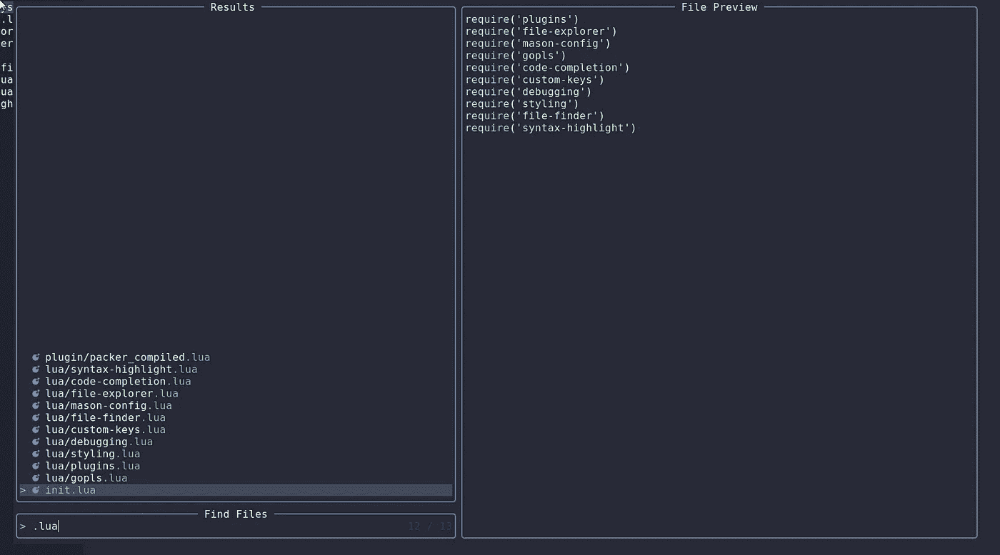

按下 <leader>ff 打开文件搜索</leader>

我特别喜欢使用`<Leader>fg`的 live-grep 搜索，它也搜索文件中的关键字。

最后要补充的是，我喜欢有一个状态栏来显示一些信息，比如 git 分支等等。

我们可以通过添加`nvim-lualine` [插件](https://github.com/nvim-lualine/lualine.nvim)来添加这个。

```
 -- Lualine information / Status bar
 use {
    'nvim-lualine/lualine.nvim',
    requires = { 'kyazdani42/nvim-web-devicons', opt = true }
 }
```

安装后，按照你认为合适的方式配置它，我将在一个新文件`statusbar.lua`中使用默认值。

```
require('lualine').setup()
```

然后也更新`init.lua`以包含状态栏。

```
require('plugins')
require('file-explorer')
require('mason-config')
require('gopls')
require('code-completion')
require('custom-keys')
require('debugging')
require('styling')
require('file-finder')
require('syntax-highlight')
require('statusbar')
```

重启 Neovim，你应该会看到一个漂亮的小状态栏。

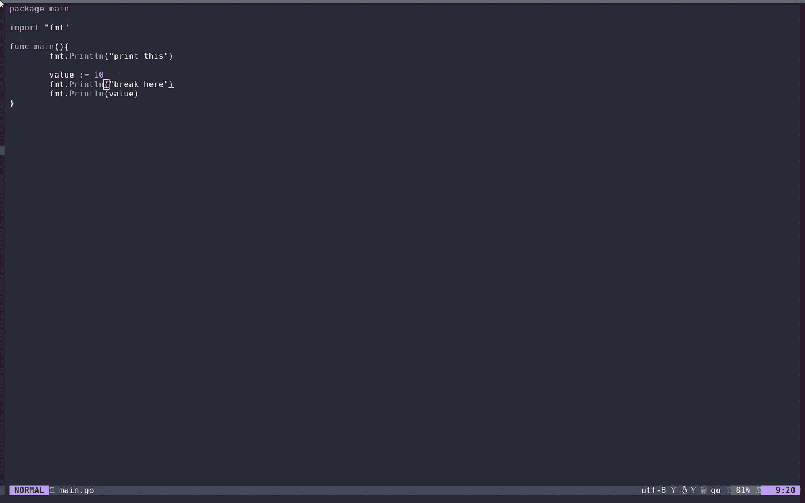

Lualine 状态栏—我不在 Git Repo 中，所以它显示一个错误的图标

## 推荐的插件

这里有一个我推荐的插件列表，可以给你一些安装时的训练。

[自动配对](https://github.com/windwp/nvim-autopairs) —创建括号和圆括号对时生成它们。

[Bufferline](https://github.com/akinsho/bufferline.nvim) —添加一个显示打开的缓冲区(文件)的标题

[LSPSaga](https://github.com/glepnir/lspsaga.nvim) —代码动作、浮动悬停文档等。

[IndentBlankline](https://github.com/lukas-reineke/indent-blankline.nvim) —压痕指南

[FloatTerm](https://github.com/voldikss/vim-floaterm#lazygit) —开放浮动终端，适用于开放 LazyGit 等。

[nvim-lint](https://github.com/mfussenegger/nvim-lint) — Linter！非常需要。

[故障](https://github.com/folke/trouble.nvim) —思考 VS 代码按钮错误标签

我喜欢写 TODO 注释作为提醒，这个插件使它们可以用 Telescope 搜索到，并且突出显示它们。

[标签栏](https://github.com/preservim/tagbar) —获取文件中结构、功能等的概述。

## 结论

我们已经学会了如何使用 NeoVim，当然还有更多要学，但我认为如果你开始每天使用它，那会很自然。

到目前为止，我们已经涵盖了最需要的基础知识，以及开始有效使用 NeoVim 所需的知识。学完这个之后，你应该可以毫无问题地使用 NeoVim。

您应该熟悉以下内容

*   使用正常模式和插入模式导航 NeoVim
*   在 Vim 中执行命令
*   添加插件和配置 NeoVim
*   处理插件及其配置

现在，我推荐查找 Linters 和 Formatters(提示:mason 可以帮助你)。

这对你来说是一个很好的练习，你可以自己安装一个插件来真正学习并坚持下去。

请记住，通常有一些插件可以帮助您定制完整的开发环境，例如 x-ray/go。它们的缺点是，它们通常包含太多，以至于很难真正了解默认映射以及如何使用它们。

你可以在 [Github](https://github.com/percybolmer/dotfiles/tree/learn/demo) 上找到我的 dotfiles 和当前的 NeoVim 配置。

我希望你喜欢这篇文章，现在去为自己打造一个梦想的编辑器吧。