# 学习 Kubernetes，简单的方法

> 原文：<https://towardsdatascience.com/learn-kubernetes-the-easy-way-d1cfa460c013>

## 在本教程中，我们将了解 Kubernetes 以及如何使用它来编排容器化的应用程序


汉斯-彼得·高斯特在 [Unsplash](https://unsplash.com/s/photos/puzzle?utm_source=unsplash&utm_medium=referral&utm_content=creditCopyText) 上拍摄的照片

如果你是一名软件开发人员，你可能几乎每天都会听说 Kubernetes。Kubernetes 已经成为业界领先的容器编排工具。

> 本教程中的所有图像都是由珀西·博尔梅勒创作的

当我开始学习 Kubernetes 时，它很难，有太多的术语，我几乎很快就放弃了。出于这个原因，我将在本教程中尝试以简洁易懂的方式慢慢地、彻底地走完 Kubernetes 的每一步。

如果你喜欢视频格式，你可以在 YouTube 上观看相同的教程。

我浏览教程的 YouTube 视频

我们将构建一个运行 API 和数据库的简单应用程序。本教程旨在帮助您熟悉 Kubernetes，并希望学习一些基础知识。本教程不会涵盖如何将应用程序部署到生产环境中，这是一个本身需要一整篇文章的主题。

在开始编码之前，让我们先了解一些信息。

> 你可以在我的 [GitHub](https://github.com/percybolmer/kubedemo) 上找到这个教程的完整代码

## 什么是 Kubernetes

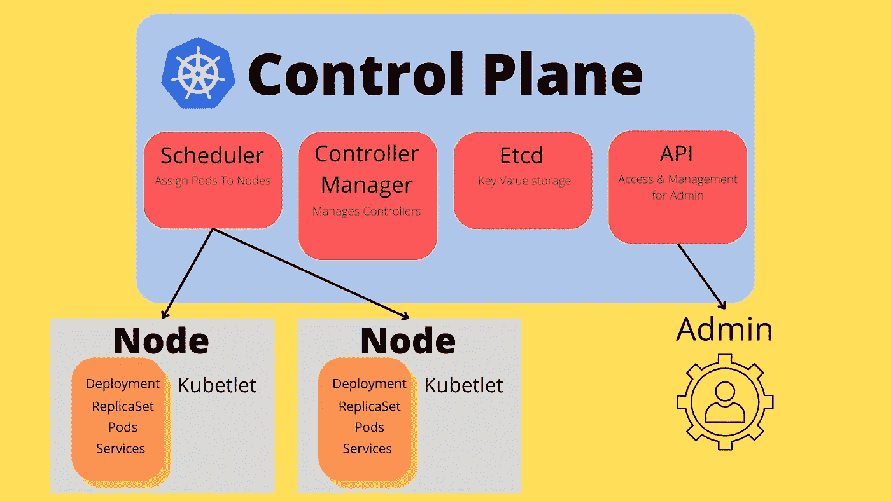

库伯内特建筑形象化

Kubernetes 是一个管理和控制容器化应用程序的工具。如果不熟悉容器和 Docker，可以阅读[学习 Docker](https://medium.com/@programmingpercy/learning-docker-52b7bdec5e86) 。

> Kubernetes ，也称为 K8S，是一个用于自动化部署、扩展和管理容器化应用程序的开源系统。

Kubernetes 旨在解决整个基础设施中多个容器的部署和控制。Kubernetes 是谷歌开发的开源软件。

你会发现 Kubernetes 的一些特点是

*   **服务发现** —通过 DNS 公开您的容器，并使发现正在运行的服务成为可能。
*   **负载平衡** —如果您的一个容器流量过大，它可以将流量分配给另一个已部署的容器。
*   **自我修复** —可配置为在需要时重启/移除并启动新容器。
*   **机密&配置** —这使得为您的部署存储和管理机密变得容易。
*   **监控** —应用程序的内置监控

为了让我们了解所有这些特性，Kubernetes 运行了许多协同工作的组件，我们将简要概述 Kubernetes 组件，这样我们就知道什么是基础。

运行中的 K8 集群由一个[控制平面](https://kubernetes.io/docs/concepts/overview/components/)组成。控制平面负责公开一个 API 来控制集群和容器生命周期的管理。在控制平面内，我们发现一些重要的节点有不同的职责。

*   **API**—kube-API server 用于连接集群，并允许我们与集群对话。
*   [**Etcd**](https://etcd.io/docs/)—K8 用来维护集群数据的键值存储解决方案
*   **调度器** —检查没有分配节点(工作机)的新容器(运行容器)，并分配它们。
*   **控制器管理器** —负责管理控制器的组件。

然后，我们有与控制平面通信的工作节点。控制平面与工作节点对话，以便它们知道该做什么。worker 节点用于运行 pod(一组容器)。

每个 worker 节点都有一个`[kubelet](https://kubernetes.io/docs/reference/command-line-tools-reference/kubelet/)`正在运行，它负责接受来自控制平面的关于它应该运行什么的指令。Kubelets 通常被称为节点代理。

所以，我们有一个控制平面在运行，多个 kubelets (worker nodes)可以连接到它。这是对 Kubernetes 整个基础设施如何工作的一个非常基本的解释，你应该再一次熟悉所有的东西，探索文档以了解更多关于确切的内部工作方式。

一旦我们进入了 Kubelet，了解它们可以运行的不同资源是很有好处的。

这里有一些和 K8 一起工作时很好理解的词。

*   **pod**—您的集群中的一组运行容器，将 pod 视为在 K8 内工作的最小单位。通常，每个 pod 使用一个容器，但也可以是多个容器。
*   **节点** —集群中的一台工作机
*   **控制器**——一个检查集群某个状态并试图调节它的回路。
*   **复制集** —用于确保始终有设定数量的 pod 运行。
*   **部署** —提供副本集和单元的更新
*   **作业** —由 pod 执行的流程，将创建 Pod 并执行流程，然后关闭。
*   **服务** —通过在内部公开端口，允许 pod 与集群中的其他 pod 进行通信。

我试着把单词列表保持得很小，我知道要记住它们可能会很难，但是不要担心，当我们把它们添加到我们的应用程序中时，我们会一点一点地介绍它们。

## 安装 Kubernetes、Minikube、Docker 和 Go

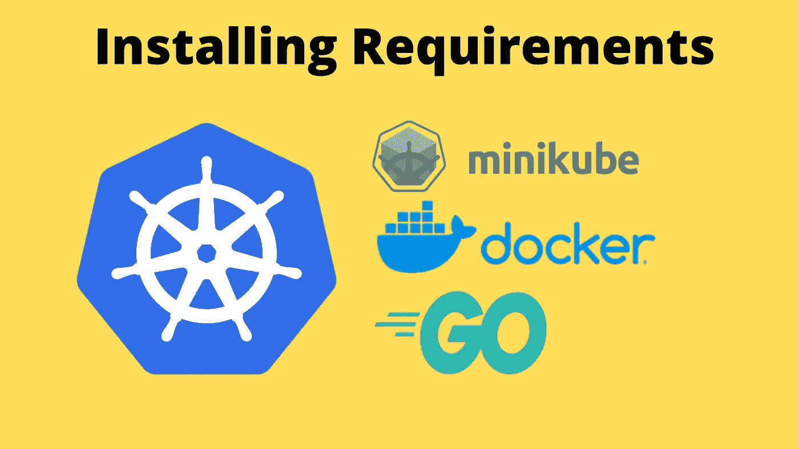

本教程的要求— Kubernetes、Minikube、Docker、Go

在我们开始使用 K8S 之前，我们需要下载并安装它，以及本教程中使用的一些其他工具。

[](https://kubernetes.io/releases/download/)  

遵循 Kubernetes 自己提供的安装指南。如果你用的是 Linux，这就是我们需要做的。

首先使用 curl 获取 Kubernetes 并安装下载的二进制文件。

```
curl -LO "https://dl.k8s.io/release/**$(**curl -L -s https://dl.k8s.io/release/stable.txt**)**/bin/linux/amd64/kubectl" sudo install -o root -g root -m 0755 kubectl /usr/local/bin/kubectl
```

您可以通过运行以下命令来确保安装工作正常

```
kubectl version
```

第二步是安装 Minikube。Minikube 是一个本地 Kubernetes 节点，可以用来学习和测试 Kubernetes。基本上，它在您的计算机上设置一个虚拟机，该虚拟机运行一个具有单个节点的集群。

要安装 Minikube，请遵循[说明](https://minikube.sigs.k8s.io/docs/start/)。对我来说，运行 Linux，就像跑步一样简单

```
curl -LO [https://storage.googleapis.com/minikube/releases/latest/minikube-linux-amd64](https://storage.googleapis.com/minikube/releases/latest/minikube-linux-amd64)sudo install minikube-linux-amd64 /usr/local/bin/minikube
```

如果你运行的是 Windows，请不要在 WSL 里面安装 Minikube，同时也要确保你已经安装了 [Hyper-V](https://docs.microsoft.com/en-us/virtualization/hyper-v-on-windows/quick-start/enable-hyper-v) 。避免 WSL 的原因是因为在写这个教程的时候，让它工作是非常复杂的。

通过运行`minikube version`命令来验证您的安装。

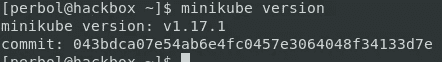

Minikube 版本打印版本

你需要的第三个软件是 Docker，因为我们将使用它来构建我们的容器。

你可以在他们的[网站](https://docs.docker.com/engine/install/ubuntu/)上找到如何安装 Docker 的说明。我不会详细介绍如何安装它，因为在[Learning Docker-The Easy Way](https://medium.com/@programmingpercy/learning-docker-52b7bdec5e86)中已经介绍过了。

第四个需求是 [Go](https://go.dev/learn/) ，可以通过访问他们的[网站](https://go.dev/dl/)进行安装。在本教程中，我使用 Go 来实现一个简单的服务，这个服务并不复杂，对于新开发人员来说应该非常容易理解。

## 让我们为库伯内特探险做准备

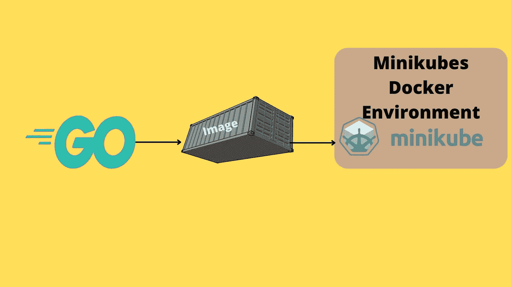

将我们的 Go 应用程序封装到 Minikubes Docker 环境中

一旦一切就绪并开始运行，是时候开始熟悉 Kubernetes 的实际用法了。在使用 Kubernetes 之前，我们需要在一个由 Minikube 创建的节点上运行应用程序。

运行`minikube start`使 Kubernetes 在运行应用程序时使用 Minikube。这一点很重要，因为我们只有一台计算机来运行它。这可能需要一些时间来运行，去喝杯咖啡。

> 请注意，如果您使用的是另一个虚拟机驱动程序而不是 windows 上的 Hyper-V，例如 Docker，您需要将其添加到 start `minikube start --driver=docker`

通过运行 Kubectl 命令行工具来列出可用节点，可以确保一切正常。在您的终端中运行`kubectl get nodes`，您应该看到`Minikube`被列为一个节点。当您想要查看集群上的节点时，此命令非常有用。

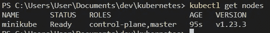

获取节点应该列出 minikube 节点。

我们将需要建立一个 docker 图像，我们可以使用它在 Kubernetes 内部运行。我用 Go 准备了一个超级简单的 HTTP 服务器和一个构建它的 docker 文件。创建一个`main.go`文件，用下面的要点填充它。

main . Go——Go 中一个超级简单的 HTTP 服务器

我们还需要创建一个`dockerfile`，我不会详细介绍 Docker 是如何归档的，如果你需要了解 Docker，可以看看我的[学习 Docker](https://medium.com/@programmingpercy/learning-docker-52b7bdec5e86) 文章。

dockerfile —构建 HTTP 服务器，并将其设置为在容器启动时启动

在我们能够构建 docker 之前，我们需要确保两件事情是有序的。第一个是我们需要在项目根目录中初始化一个 go 模块。

`go mod init programmingpercy/hellogopher`

我们还需要确保通过运行`eval $(minikube docker-env)`来使用 Minikubes docker 环境。 ***这是每个终端重启所需要的。*** 如果您使用的是 Windows，请改为运行命令。

```
minikube -p minikube docker-env | Invoke-Expression
```

请不要跳过上述命令，如果你这样做，你将面临的问题，寻找 docker 镜像安装在您的计算机上，因为你使用了错误的 docker 环境！

是时候建立我们想要使用的图像了

```
docker build -t programmingpercy/hellogopher:1.0 .
```

## 准备好 Kube！

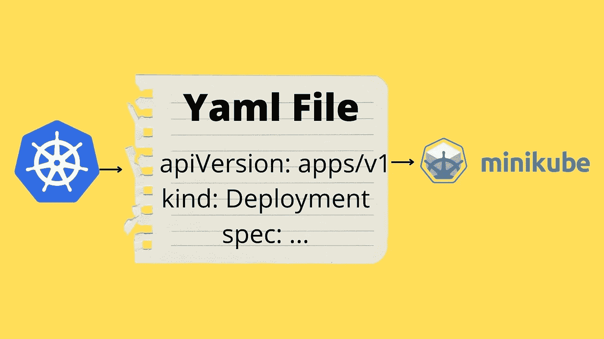

Kubernetes 对象是在 Yaml 文件中定义的

我们现在有了我们需要的一切，我们有 Kubernetes，Minikube，还有一个 Docker 映像中的惊人的 HTTP 服务器可以运行。让我们创建我们的第一个 Kubernetes 资源。

在 Kubernetes 中，我们使用 YAML 文件来定义[对象](https://kubernetes.io/docs/concepts/overview/working-with-objects/kubernetes-objects/)，应用程序的所有部分都被称为对象。在 YAML 中有大量的东西需要定义，但是我们将从简单开始。

创建一个名为`hellogopher.yml`的新文件，它将维护与 API 相关的对象。

我们将一步一步填充 YAML 文件，看看每一行的意思。我们从一些必需的缺省值开始。我们在 YAML 中定义的是一个 [Kubernetes 对象](https://kubernetes.io/docs/concepts/overview/working-with-objects/kubernetes-objects/)，每个对象都需要这些字段。

*   **apiVersion** 是一个描述您将使用哪个版本的 Kubernetes API 的字段。
*   **种类**是我们正在创建的对象的种类。
*   **元数据**是关于对象的信息，可用于跟踪和识别对象。

hellogopher.yml 第 1–4 行包含默认字段

接下来，我们将定义`spec`，spec 是 YAML 中的一个字段，它定义了对象将处于的状态。规范中需要提供哪些信息取决于您创建的对象的类型。

我们正在创建一个**部署**对象，一个[部署](https://kubernetes.io/docs/concepts/workloads/controllers/deployment/)用于指定运行 API 的 Pod 的期望状态。这可以是关于环境变量的设置、要创建多少个副本以及关于正在运行的 pod 的默认设置。我们将首先添加三个字段。

*   **选择器—** 部署应该用来查找相关 pod 的标签。这很重要，因为我们可以让其他对象使用这个选择器来引用它，并在以后使用 kubectl 命令找到它。
*   **副本—** 要启动多少个副本，一个副本是一个相同的容器。如果我们将其设置为 1，我们将启动 1 个容器，如果我们将其设置为 3，将启动 3 个容器。
*   **模板—** 定义新创建的 pod 应该如何设置的模板，请注意，模板是一个对象，包含自己的 spec 字段。

模板字段包含自己的规范，因为它是一个对象。在该规范中，我们定义了 pod 都应该运行我们构建的 docker 映像。我们还指定应该公开端口 8080，它不应该从 DockerHub 获取图像，我们只在本地构建它。

如果你对任何领域有疑问，想要更多的信息，请随时查看官方文件。我已经对每个领域做了评论。

hellogopher.yml —添加了部署规范

为了创建和运行这个新资源，我们将运行以下命令

```
kubectl create -f hellogopher.yml
```

`kutebectl create`用于创建资源，`-f`标志用于指向某个文件。

现在可以运行`kubectl get all`来列出所有名称空间中的所有资源。我们可以在 Kubernetes 中使用名称空间来分离资源，稍后会详细介绍。


ErrImagePull —如果您忘记评估 Minikubes docker env 并在其中构建 docker 映像

如果您看到 Status ErrImagePull，很可能是您忘记了使用 Minikubes docker 的 eval the docker 环境。

请记住，每次重启终端时都需要进行评估。另一个常见的错误是，首先在计算机的 docker env 中构建 docker 映像，然后是 eval。

如果您有任何其他错误，您可以通过使用下面的命令获得关于部署的详细信息。

```
kubectl get deployment/hellogopher -o yaml
```

要访问应用程序，您需要公开一个节点端口。在 go HTTP 服务器内部，我们已经对要公开的端口 8080 进行了硬编码，但是这也需要为 Kubernetes 进行配置。我们可以使用`expose deployment`命令来做到这一点，该命令接受资源的名称和要公开的类型。在我们的例子中，我们希望公开一个节点端口，这是公开服务端口的一种方式，如果您希望从部署外部访问服务，这是必需的。

```
kubectl expose deployment hellogopher --type=NodePort --port=8080
```

现在检查资源的状态(提示: *kubectl get all* )，您应该会看到节点端口。

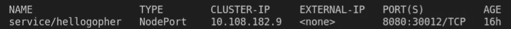

Kubectl get all —输出显示我们现在将 hellogopher 服务的端口 8080 公开到主机的 30012 端口。

您可能已经注意到，您机器上正在使用的端口是为我动态分配的(30012)。很高兴，Minikube 提供了一组命令来帮助我们访问部署，这样我们就不需要跟踪分配的端口。

您可以通过运行`minikube service hellogopher`来访问该服务。该命令将打开您的网络浏览器，显示`hello gopher`消息。

让我们练习一下，我们想删除部署，因为我们现在已经完成了。你可以使用`delete deployment`命令来完成。

```
kubectl delete deployment hellogopher
```

## 标签和选择器

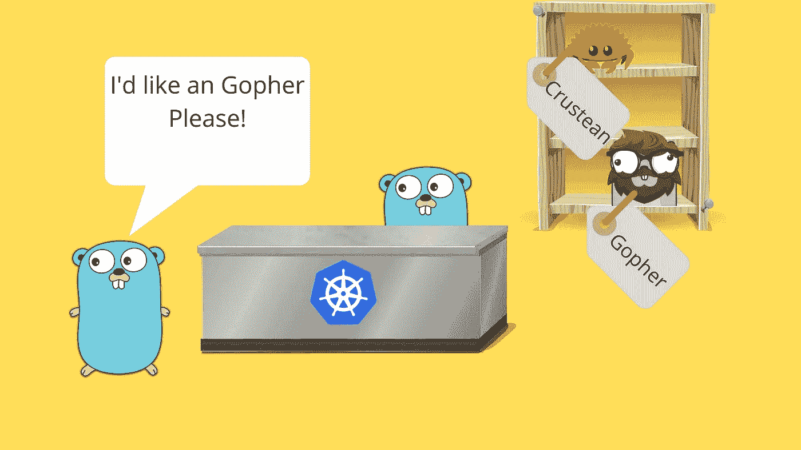

标签和选择器允许我们指定目标对象

与 Kubernetes 合作时，您会遇到术语`labels`。标签[是一个键/值对，可以分配给资源。标签通常用于在资源上附加信息，但也用于在大型环境中区分它们。您可以使用标签来定位特定的资源，这些资源使用 kubectl 命令的匹配标签进行标记，这在您想要删除多个包含相同标签的资源时非常有用。](https://kubernetes.io/docs/concepts/overview/working-with-objects/labels/)

您可以在运行时或在 YAML 配置中添加标签。让我们尝试一下，以便更好地理解，我们将在 pod 中添加一个标签运行时。

如果您注意到了，我们在 YAML 配置中创建了一个名为`app`的标签。您可以通过添加`--show-labels`来查看标签，这是大多数获取资源的 kubectl 命令的一个参数。

```
kubectl get all --show-labels
kubectl get pods --show-labels
```

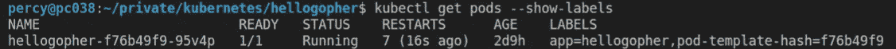

显示标签的 kubectl 命令输出

让我们为 pod 创建一个名为 author 的新标签。请记住，您可以向所有资源添加标签，因此当我们添加标签时，我们将在名称前面使用`po`，这告诉命令这是一个 Pod 资源。我们使用`kubectl label`,后跟资源的名称，带标签的`key=value`。

```
kubectl label po/hellogopher-f76b49f9-95v4p author=percy
```

获取 pod 现在应该显示您已经添加了一个作者标签。

有时您可能想要更新一个现有的标签，它可能是一个版本标签，或者可能是作者已经更改。在这种情况下，您需要在命令中添加`--overwrite`参数。我们把作者换成钢铁侠吧。

```
kubectl label po/hellogopher-56d8758b6b-2rb4d author=ironman --overwrite
```

有时，我们可能想要删除标签，这只是通过使用相同的命令来完成，但是我们使用的是`key-`命令，而不是`key=value`。我们再来去掉作者标签。

```
kubectl label po/hellogopher-56d8758b6b-2rb4d author-
```

现在，如果您再次使用`--show-labels`获得 pod，它应该不再包含作者标签。

所以添加和删除标签非常简单，让我们看看如何使用它们来选择某些资源。

使用标签来定位资源被称为`Selector`。大多数 kubectl 命令接受`--selector`标志，该标志使用它们的`key=value`语法接受多个标签。您可以通过逗号分隔来指定多个选择器。

```
kubectl get pods --selector app=hellogopher
```

您也可以通过在等号前添加一个`!`来使用负值。

```
kubectl get pods --selector app!=hellogopher
```

现在，基于标签获取资源是很好的，但是想象一下，你有一个巨大的资源集群，这时标签就变得非常重要了。此外，在管理资源时，它们非常方便，并且您需要用同一个命令定位多个实例。让我们尝试删除所有标有 app=hellogopher 的 pod。这里我使用了`-l`，它是`--selector`的简写。

```
kubectl delete pods -l app=hellogopher
```

您应该会看到一条消息，提示 pod 已被删除，但是如果您尝试获取所有 pod，则会出现一个新的 pod。

请记住，部署中说我们希望 1 个 pod 一直运行，Kubernetes 会为您处理这个问题。所以，当旧的被删除时，一个新的被创建，不要感到惊讶。这就是我们想要的，如果你想删除一切，你必须删除部署。

## 活动、就绪和启动探测

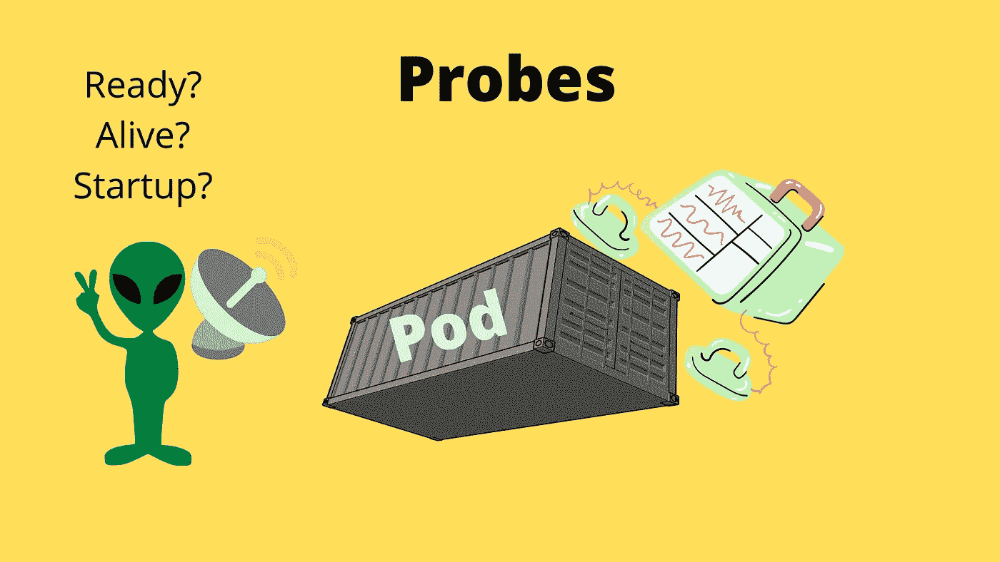

Kubernetes 允许我们探测 pod 的状态

Kubernetes 的卖点之一是应用程序监控。我们可以使用探针来监控我们的应用程序，探针用于监控端点、TCP 套接字或 gRPC 端点等的状态。

我们有三个探测器

*   **活跃度** —检查容器是否正常运行，如果不是，它将尝试重启该容器。
*   **Readiness** —检查容器是否按预期启动，以及何时准备好供其他服务使用。
*   **启动** —该探针将禁用活性和就绪性探针，这是有充分理由的。想象一下，如果容器启动缓慢，并且在启动之前需要运行缓慢的进程，那么并发地，活性探测检查端点是否是活动的，并且它返回 500，然后活性探测重新启动。在启动最终完成后，启动将启用活跃度和就绪性。

我们将从了解如何轻松创建一个简单的就绪性探针开始。我们将添加一个探测错误端口的探测器，该端口是 pod 不会暴露的。然后，我们将继续检查我们如何能看到为什么吊舱从未准备好。

当我们添加一个需要定义的探针来检查 Kubernetes 的状态时，有一些不同的探针，最简单的一个是 HTTP 探针，它发送一个 HTTP 请求并期望一个 200 响应。您可以找到可以添加到[文档](https://kubernetes.io/docs/tasks/configure-pod-container/configure-liveness-readiness-startup-probes/)中的所有探头类型和配置。

更新`hellogopher.yml`来定义 readinessprobe，注意我们使用了错误的端口。

hellogopher.yml —检查容器是否就绪的就绪探测器

删除旧的部署，并重新部署它(如果您不记得本文中如何回溯)。

重新部署部署后，让我们看看如何找出问题所在。

运行`kubectl get all`获取关于部署和 pod 的信息。获取 pod 名称，我们将使用该名称来描述它。描述是 Kubernetes 中获取资源详细信息的一种方式。

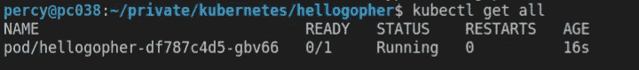

ku bectl—pod 未准备好(0/1)

复制名称并描述它。

```
kubectl describe pod/hellogopher-df787c4d5-gbv66
```

请注意，它将打印关于 pod 的大量日志信息。最后，有一个名为`Events`的部分显示了发生的所有事情。

在 event 部分，您应该看到失败原因，这应该是准备就绪探测。

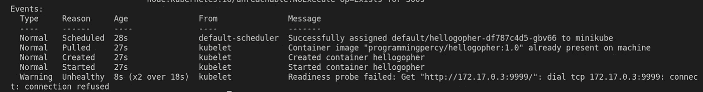

kubectl describe —显示失败的事件

您可以将在`hellogopher.yml`中定义的端口切换到 8080，并重新部署，看看它是否工作。

让我们看一下活性探测，它的工作方式与就绪探测相同。该探测器一直运行，以检查启动后容器是否在工作。

为了测试这一点，我们需要添加探针并更新 go HTTP 服务器，以便在 10 秒钟后返回一个失败。然后，我们将更新旧的部署，而不是删除它。

活性探测器 YAML 看起来与就绪探测器完全一样，但是多了一个名为`failureThreshold`的字段，它表示在重启之前允许容器失败的次数。

hellogopher.yml —更新了活性探测

更改 YAML 后，我们将更新`main.go`然后重建 docker 映像，并更新部署以使用新的映像版本。

在此之前，我想确保我们删除了旧的部署和创建的任何服务

```
kubectl delete service/hellogopher
kubectl delete deployment hellogopher
```

我们将让它在运行 10 秒钟后开始返回 HTTP 状态 500。

main . go-10 秒后失败的 HTTP 服务器版本 2

用 2.0 的新标签重建图像。

```
docker build -t programmingpercy/hellogopher:2.0 .
```

现在我们有了新的映像，让我们用版本 1 运行部署，并在运行时更新它，看看会发生什么。

```
kubectl create -f hellogopher.yml
```

如果您现在用`kubectl get all`检查，您将看到它已经启动并运行，但它使用的是 YAML 文件中指定的我们映像的 1.0 版本。让我们通过使用`set image`来更新 docker 图像。第一个参数是部署名称，然后是 YAML 中定义的 pod 名称，在我们的例子中是 hellogopher。

```
kubectl set image deployment/hellogopher hellogopher=programmingpercy/hellogopher:2.0
```

如果您运行`kubectl get all`，您可以看到新的 pod 是如何首先创建的，一旦它准备好了，旧的 pod 就会被删除。

您还可以通过修改`hellogopher.yml`文件，然后运行`kubectl apply`命令来更新集群。您可以通过更改配置中的 docker 映像版本标签，然后运行它来尝试一下。应用非常有用，因为您不必手动删除资源。它将检测任何需要进行的更改并执行它们。

```
kubectl apply -f hellogopher.yml
```

之后，您可以继续运行状态检查，并看到重启计数在 pod 上缓慢上升，现在每次在 10 秒钟后，当容器响应 3 次失败的探测尝试时，就会发生这种情况。


显示 pod 正在重新启动的事件

太好了，我们有办法在应用程序出现问题时重启它。我们都知道修复所有失败软件的秘诀是重启。

我们在这里所做的只是触及了您可以用探针做的事情的表面，但是因为我们处于学习阶段，所以让我们保持简单。

## 调试 Pod

当我们的软件失败时，重启可能会解决问题，但通常有一个潜在的原因。在 K8，调试并找出 pod 内部发生了什么是相当容易的。

最常见的方法是深入日志，您可以通过使用`kubectl logs`后跟 pod 名称来找到 pod 的日志。

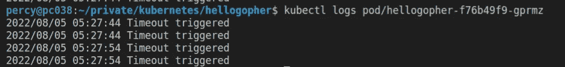

kubectl 日志显示了 pod 的标准输出

在 K8 调试时需要学习的另一件非常重要的事情是带着终端进入 pod。现在，如果你按照前面的步骤，我们的分离舱会一直崩溃，所以进入会很困难。

我建议你创建一个 docker 镜像版本 3.0，要么增加`main.go`中的超时限制，要么你必须非常快速地工作。我将通过将代码修改为 100 秒来快速增加我的时间，用一个新的标记重新构建 docker 映像，并像以前一样在运行时设置映像。我不会涵盖如何做所有这些，你现在应该能够，或回溯，看看我们以前是如何做的。

> 您可以设置一个大于 100 秒的超时限制，或者现在完全删除它，因为我们已经完成了活动探测，这可能会避免您在测试教程的其余部分时出现崩溃的容器

从 pod 内部打开终端很简单，你需要在 docker 上安装一个终端，bash 或 ash 或其他。

您可以使用`kubectl exec`从 pod 执行命令。我们将添加一面代表互动的旗帜`-it`。然后指定 pod 名称，后跟一个`--`，它将本地命令与 pod 内部的命令分开，因此在`--`之后是在 pod 内部运行的命令。

我们想把它连接到终端，所以我们插入到 ash 的路径。

```
kubectl exec -it pod/hellogopher-79d5bfdfbd-bnhkf -- /bin/sh
```

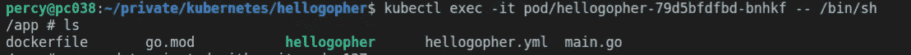

吊舱内部的终端

在 pod 内部并能够运行命令使得调试变得容易得多。

Kubernetes 中一个非常常见的错误是`oomkiller`，也称为错误代码 137。这是应用程序内存不足时发生的错误。这可能是因为节点没有足够的内存，或者应用程序超出了其使用资源的限制。

如果您的应用程序超过了分配给它的内存限制，它将重新启动，如果它仍然超过限制，继续重新启动。因此，重启可以避免常规的内存泄漏，但是如果应用程序使用的内存真的超过了允许的范围，它就会反复杀死容器。

## 可视化集群

关于调试这个话题，很多人想要一个 UI 来查看正在发生的事情。幸运的是，我们可以通过 K8 实现这一点，有一个管理控制面板可用于可视化集群。

仪表板可以通过跟随[官方文件](https://kubernetes.io/docs/tasks/access-application-cluster/web-ui-dashboard/)来使用，或者因为我们使用的是 Minikube，它有很多插件，我们可以简单地通过运行来启用仪表板

```
minikube addons enable dashboard
minikube addons enable metrics-server 
```

您可以通过运行`minikube addons list`查看所有 minikube 插件。

通过运行以下命令打开仪表板。

```
minikube dashboard
```

您将看到一个令人惊叹的控制面板，它为您呈现了群集，该控制面板在监控群集时非常有用。

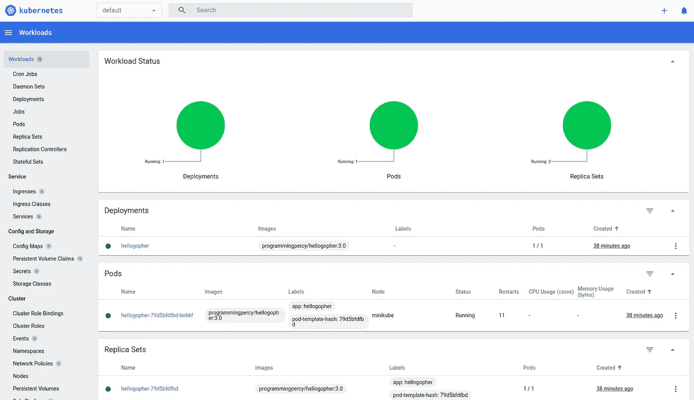

Kubernetes 仪表板—可视化集群

请注意，我们使用 Minikube 运行仪表板，您也可以单独运行它，Minikube 只是使它在您的开发环境中更容易。请参阅 K8 文档，了解如何在没有 Minikube 的情况下运行它。

在 UI 中，您可以查看工作负载、资源使用情况以及存在哪些资源。

您还可以查看日志并在 pod 中执行。如果您访问 pod 部分，您还可以看到 pod 事件以及我们之前通过终端看到的所有内容。

## 多个 pod、服务和命名空间

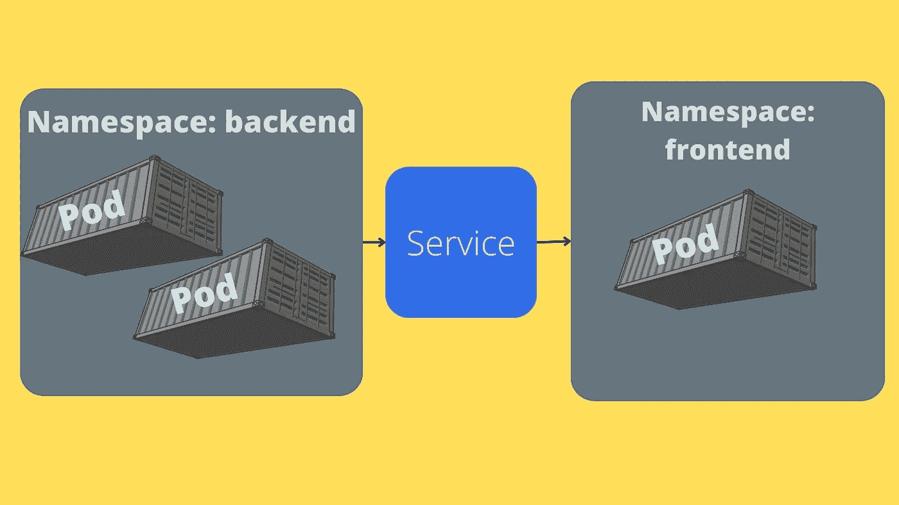

服务允许 pod 之间的通信

现在，我们正在运行一个具有单个部署单元的集群。大多数情况下，整个应用程序会有多个部署。

让我们通过添加一个运行的 MySQL 数据库来获得一些实际操作，我们的 hellogopher 应用程序可以连接到这个数据库。

我们将一步一步来，这样我们就可以探索 K8 内部的`services`。[服务](https://kubernetes.io/docs/concepts/services-networking/service/)用于向集群中的其他 pod 公开 pod。

第一步是添加运行 MySQL 容器的部署。现在，我们将通过硬编码的环境配置使它变得非常简单，现在不要担心这个。

我喜欢分离，所以我建议我们创建一个名为`database.yml`的新文件，其中包含所有与数据库相关的 K8 对象。有几种不同的方法来解决这个问题，有时你会在同一个文件中看到许多 Kubernetes 对象，这可以通过用一个`---`来分隔文件来实现，它告诉 Kubernetes 下面的行是一个新对象。

此时，创建一个名为`kubernetes`的文件夹来存储我们所有的 YAML 文件可能会比较好。

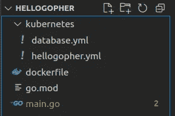

清理文件夹结构

让我们用一个部署对象填充`database.yml`。这将用于创建一个简单的 MySQL 数据库容器和一个值为`password`的 root 密码。

database.yml —使用硬编码密码部署 MySQL

一旦我们将 YAML 文件移动到它们自己的文件夹中，让我们用`kubectl apply`更新正在运行的集群。Apply 将检查任何更改并应用这些更改，而保留未更改的资源。它接受一个`-f`标志，这是文件夹的缩写，你甚至可以用`-R`让它递归。

```
kubectl apply -f kubernetes/
```

在应用之后，您应该看到两个部署启动并运行，hellogopher 和 MySQL。运行`kubectl get all`查看集群或访问仪表板。

您可以通过在容器中执行来尝试轻松登录 MySQL。获取 MySQL pod 的名称，并使用`bash`作为命令执行它。

```
kubectl exec pod/mysql-77bd8d464d-8vd2w -it -- bash
# You are now inside the pod terminal
mysql --user=root --password=$MYSQL_ROOT_PASSWORD
```

你应该登录一个 MySQL，我们还没有做任何事情，所以你可以输入`exit`离开终端。

现在当前设置的一个问题是第一个 hellogopher pod 不能到达 MySQL pod。为了实现这一点，我们必须使用`service`、[服务](https://kubernetes.io/docs/concepts/services-networking/service/)来允许 pod 之间或外部世界的访问。K8 将负责为 pod 设置 IP 地址和 DNS 名称。您甚至可以包括负载平衡。

解决两个 pod 之间连接的第一步是将它们放在同一个[名称空间](https://kubernetes.io/docs/concepts/overview/working-with-objects/namespaces/)中。命名空间用于将资源或资源组隔离到同一个群集中。默认情况下，使用`default`名称空间。因此，现在我们的 pod 在同一个名称空间中，但是我们希望控制名称空间，提到名称空间是很重要的，因为资源使用的名称空间是 DNS 名称的一部分。

在 Kubernetes 文件夹中创建一个名为`00_namespace.yml`的新文件。Kubernetes 使用前缀`00`来知道创建资源的顺序，这很重要，因为我们的资源需要首先创建名称空间。

00_namespace.yml —将创建的第一个对象

接下来，我们将把`database.yml`重命名为`01_database.yml`，这样数据库就是创建的第二个项目。我们将在文件中添加一个`---`,如前所述，这告诉 Kubeternetes 在同一个文件中出现了一个新对象。在三连破折号之后，我们将创建服务，注意我们没有告诉 K8 服务连接到哪个资源，但是我们设置了一个选择器。

这就是服务如何通过应用到选择器匹配的所有其他对象来知道要公开哪些部署。所以在我们的例子中，任何带有标签`app: mysql`的资源都将被暴露。

01 _ database.yml 添加了服务的新数据库 YAML 文件

注意，我已经在每个对象上添加了`namespace: hellogopher`标签作为元数据。这是一种方法，另一种方法是使用`use-context`改变默认使用的名称空间。我们不会在这里讨论如何建立多个使用环境，你可以在[文档](https://kubernetes.io/docs/tasks/administer-cluster/namespaces-walkthrough/)中读到它们。

确保在`hellogopher.yml`文件中也添加了名称空间。然后从默认名称空间中删除任何现有的部署和服务，然后重新部署。

```
kubectl apply -f kubernetes
```

尝试使用`kubectl get all`获取资源，您会注意到没有资源。这是因为该命令使用默认的名称空间，我们可以通过在当前上下文中设置名称空间来将其设置为默认名称空间。

```
kubectl config set-context --current --namespace=my-namespace
```

现在当你获取资源时，你应该可以看到所有的资源。您可以跳过在 YAML 文件中指定名称空间，但是如果在同一个部署中有多个名称空间，这将非常有用。

现在我们有了一个部署，它将为我们设置 Pod 和 ReplicaSet，这是一个公开数据库的服务，我们已经将它们包含在它们自己的名称空间中。

注意，要访问 hellogopher 服务，您需要在以后使用`-n`将名称空间应用到 minikube 命令。

```
minikube service hellogopher -n hellogopher
```

## 连接到数据库

现在我们有两个 pod，一个运行我们的软件，一个运行 MySQL。我们需要连接到 MySQL one，它在一个服务的后面。

在 Kubernetes 中有两种方法可以找到需要的服务信息，比如 IP 和端口。你可以在这里阅读更多关于它们的细节[。](https://kubernetes.io/docs/concepts/services-networking/service/)

第一种，也是首选的生产方式是使用 DNS。Kubernetes 允许我们安装一个可以使用的 CoreDNS 插件。如果你安装了一个 DNS，你可以使用它的名字来引用服务，就像你在 docker-compose 中做的一样。

第二种方法是使用内置的发现。创建的每个 pod 都将获得一组为同一名称空间中的每个服务设置的环境变量。这要求首先创建服务，然后创建 pod。我们使用`00_`和`01_`名称前缀解决了这个问题。

环境变量将被命名为`{SERVICENAME}`作为前缀。在我们的例子中，我们将服务命名为`mysql`。因此，在我们的服务之后创建的所有 pod 都将设置以下变量。

```
MYSQL_SERVICE_HOST=10.0.0.11
MYSQL_SERVICE_PORT=3306
MYSQL_PORT=tcp://10.0.0.11:3306
MYSQL_PORT_3306_TCP=tcp://10.0.0.11:3306
MYSQL_PORT_3306_TCP_PROTO=tcp
MYSQL_PORT_3306_TCP_PORT=3306
MYSQL_PORT_3306_TCP_ADDR=10.0.0.11
```

您可以尝试在 HelloGopher pod 中执行并打印变量来进行测试。

让我们更新 Go 代码来连接数据库，以确保一切正常。我将创建一个名为`mysql.go`的新文件，其中包含数据库代码，因为我们在本教程中没有关注 Go，所以我不会详细解释。代码将使用与我们的服务相关的环境变量连接到数据库，如果数据库不存在，它将创建它。

mysql.go —使用服务变量连接到数据库

添加之后，我们需要从主函数执行连接。

main.go 添加了要执行的数据库连接

太好了，连接数据库的代码准备好了。我们需要重新构建 docker 并更新我们的集群以使用新版本，我将用版本`5.0`标记它。

```
docker build -t programmingpercy/hellogopher:5.0 .
```

现在，我们需要更新集群以使用这个版本的代码，您可以在运行时通过更改 docker 映像，或者更新 YAML 并应用。由于我们还需要添加一些不会自动生成的环境变量，比如`DATABASE_USERNAME`、`DATABASE_PASSWORD`、`DATABASE_NAME`，我建议我们更新`hellogopher.yml`。我们可以使用`env`字段添加这些变量，并为每个变量设置`name`和`value`。

我们还将确保将文件重命名为`02_hellogopher.yml`。因为我们希望它在 MySQL 服务之后创建。

02 _ hellogopher.yml 更新的 yml，带有数据库的环境变量

为了测试这一点，您可以应用新的配置，然后执行 MySQL pod 并查看可用的数据库，您应该会看到一个名为`test`的数据库。

```
mv kubernetes/hellogopher.yml kubernetes/02_hellogopher.yml
kubectl apply -f kubernetes/
kubectl exec pod/mysql-77bd8d464d-n5fx5 -it -- sh
#: mysql -p
show databases;
```

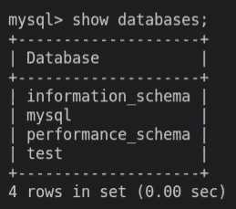

数据库显示在 SQL 窗格上，HelloGopher 窗格成功创建了测试

太好了，现在我们的豆荚连在一起了！

## 配置映射和机密

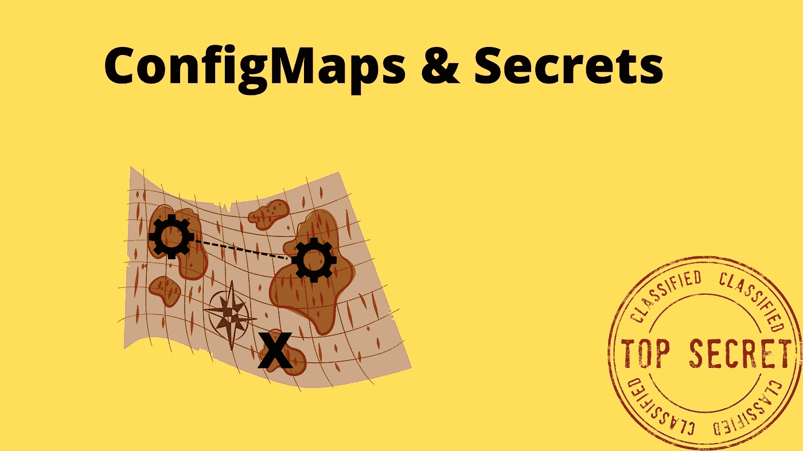

配置映射和秘密在 Kubernetes 中用于配置应用程序

你可能已经注意到，现在我们在 YAML 的文件中有明文的硬编码密码。正如您所猜测的，这不是一个好的做法。

Kubernetes 允许我们使用`configmap`和`secrets`来处理配置和秘密。您可以在[文档](https://kubernetes.io/docs/tasks/configure-pod-container/configure-pod-configmap/)中找到详细信息。

当您有非机密值时，应该使用配置映射，当您有敏感值(如密码)时，应该使用 secret。

让我们用适当的解决方案代替环境变量。我们将把`DATABASE_NAME`和`DATABASE_USER`存储在一个配置图中，但是密码是保密的。

让我们从创建 Configmap 开始，您可以从字面量(基本上是将值设置为字符串)开始创建。您也可以使用使用换行符作为分隔符的文件。因为你通常有多个环境变量，我更喜欢使用一个文件。

```
# Using Literal 
kubectl create configmap myConfigMap --from-literal=log_level=debug
# Using a file
kubectl create configmap myConfigMap --from-env-file=path/to/file
```

让我们从试验开始。创建一个名为`dbConfig.properties`的新文件，并将以下值插入其中。

dbConfig.properties —我们的非机密数据库属性

然后我们可以使用`create configmap`命令创建这个配置图。

```
kubectl create configmap database-configs --from-env-file=dbConfig.properties 
```

然后，您可以通过指定要自省的配置映射的名称来查看配置映射或有关配置映射的详细信息。

```
kubectl get configmapskubectl get configmap/myConfigMap -o yaml
```

接下来，我们需要更新`02_hellogopher.yml`来开始使用配置图。为了使用 configmap，我们将用`valueFrom`替换每个环境变量的`value`字段。这个属性接受一个对象，我们将在`configMapKeyRef`中传递这个对象。这是 Kubernetes 引用同一名称空间中某个配置映射的一种方式，使用`name`表示配置映射，使用`key`表示我们想要的特定值。

这是 YAML 的更新版本，它使用我们的新配置图获取值。

02_hellogopher.yml —我们用 valueFrom 替换 value 字段

您可以通过应用新的更改，然后获取日志来查看一切是否仍然工作，来尝试这种方法。

```
kubectl apply -f kubernetes/
```

现在这是一个很大的改进，我们仍然有密码，但我们会先看看。在我们这样做之前，我想解决当前 configmap 方法的一个问题，如果您有许多环境变量，正如您可能理解的那样，这将成为在 YAML 中配置的大量文本。

但是，您可以应用整个 configmap，而无需专门分配每个键值。我们可以通过添加一个`envFrom`字段来做到这一点，该字段接受 YAML 内容器上的配置图的名称。这将使所有的配置键作为环境变量出现在 pod 中。

这里是我们这样做的要点，注意我不再需要分配`DATABASE_NAME`或`DATABASE_USER`，因为它们在配置图中有定义。

02 _ hellogopher.yml 改为使用 configMapRef 应用整个 ConfigMap。

如果您想确保它仍然工作，可以继续并重试部署。

现在，我们已经创建了一个部署使用的 ConfigMap，但是我们也向这个 configmap 引入了一个很小的奇怪的依赖项。没有手动创建它的人将无法部署，因为他们没有它，而我们不能拥有它。

一个非常简单的解决方案是添加一个新的 Kubernetes 对象来创建 configmap。由于这与数据库有关，所以我将它添加到`01_database.yml`文件中。再次，一个新的对象，所以我们需要通过在新的一行上添加`---`来划定它的界限。因为这是一个常规的配置，没有秘密，我们可以简单地预置一个默认值。

我将移动`dbConfig.properties`中的所有设置，以便您可以删除该文件。请记住，我们将它添加在`01_database.yml`文件的底部。

01 _ database.yml 将其添加到文件的底部

删除旧的手动创建的配置映射并重新应用集群。

```
kubectl delete configmap database-configs
kubectl apply -f kubernetes/
```

查看创建的配置图，查看日志，并确保一切仍在运行。到目前为止，您应该已经熟悉了。

是时候处理最后一块了，秘密密码。许多应用程序都需要存储机密。对我们来说幸运的是，这几乎和 ConfigMap 完全一样，只是一个 SecretMap

我们将从对我们的秘密值进行 base64 编码开始，所有的秘密都应该以 base64 格式存储。请记住，这是不安全的。

```
percy@pc038:~/private/kubernetes/hellogopher$ echo -n "password" | base64
cGFzc3dvcmQ=
```

我们将获取输出的值，并将其放入清单文件`01_database.yml`。正如 configmap 一样，我们将创建一个秘密对象，用于存储我们可以引用的秘密。

在`01_database.yml`中，在底部添加以下要点。

01 _ database.yml 在底部添加了一个秘密对象映射

我们还需要更改`02_hellogopher.yml`来使用这个秘密。用以下要点替换环境变量`DATABASE_PASSWORD`。正如我们使用`configMapRef`一样，我们现在将使用`secretKeyRef`。语法是一样的。

02_hellogopher.yml —密钥被引用

应用更改，并看到它创建了秘密。

```
kubectl apply -f kubernetes/
```

您现在可以通过运行以下命令列出所有存在的秘密

```
kubectl get secrets
```

然后选择要反省的名称，并通过提供它们的名称来显示关于某些秘密的更详细的信息。

```
kubectl get secrets database-secrets -o yaml
```

如果你想确定，从 pod 中获取日志以确保它工作。

现在你可能会想，嘿，我们仍然有“明文”密码，因为 base64 没有增加任何保护。幸运的是，我们可以用 Kubernetes patch 命令替换这些值。这太棒了，因为我们可以在 CI/CD 中自动进行秘密修补。

我们使用的命令是`patch secret`，后跟秘密对象的名称。然后我们指定 JSON，因为我们希望补丁请求使用 JSON 格式。

该命令的输入作为有效负载`-p`标志发送，它接受一组要应用的更改。`op`代表操作，是我们想要执行的操作，在我们的例子中是替换。`path`是秘密的完整路径，通常是/data/your-secret-name，然后是值。记住该值应该是 base64 编码的。

```
kubectl patch secret database-secrets --type='json' -p='[{"op" : "replace" ,"path" : "/data/DATABASE_PASSWORD" ,"value" : "test"}]'
```

替换密码后，尝试重新应用更改并获取日志来验证数据库连接是否失败。

## 资源有限

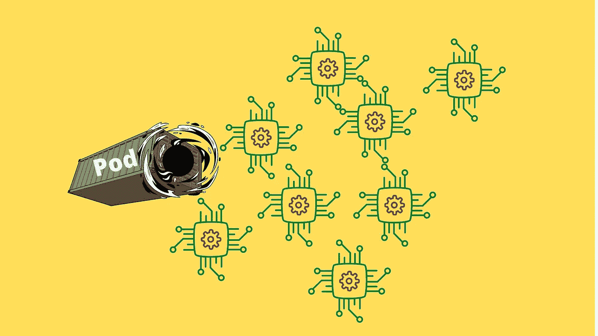

吊舱失控旋转，在无限量的内存中旋转

在我们结束本教程之前，我想说明一个我们还没有触及的重要方面。现在，我们创建的资源已经设置好了，一切都如我们所期望的那样工作，但是 pod 可以自由地使用他们想要的计算机上的任何资源。

有两种类型的设置你需要熟悉`limit`和`request`。

**请求—** 是节点需要提供的最小可用资源，以便在其上创建 pod。
**限制—** 是允许您的 pod 使用的最大资源量。除非指定，否则 pod 可以在节点上使用无限量的资源。

您可以使用`top`命令查看您当前的 pods 正在使用多少资源。

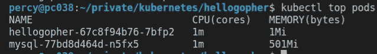

Pod 资源资源用量

在图中，您可以看到我们列出了 CPU 内核和已用内存，这是两种最常见的资源。

让我们为 hellogopher pod 添加资源限制，然后您可以尝试自己限制 MySQL。

hellogopher 是一个超级简单的 API，它不需要一个完整的 CPU 内核，所以我们首先将它限制在 0.1 个内核，通常你会看到一个数字，如代表 0.5 个 CPU 内核的`500m`。所以要得到 0.1 核，我们需要把极限设为`100m`。

> 对于 CPU 资源单位，[数量](https://kubernetes.io/docs/reference/kubernetes-api/common-definitions/quantity/)表达式`0.1`等价于表达式`100m`，可以读作“一百毫 CPU”——[Kubernetes 资源文档](https://kubernetes.io/docs/concepts/configuration/manage-resources-containers/)

该服务不需要太多内存，因为它是一个超级简单的 API。我们将它限制在`10Mi`，你可以在[内存文档](https://kubernetes.io/docs/concepts/configuration/manage-resources-containers/)中阅读更多关于所有可用单元的信息。

记住，要求是最低的，限制是最高的。让我们将它应用到我们的配置中。

hellogopher.yml 更新了资源限制

设置限制很好，因为它可以使您的部署更便宜，避免使用不必要的资源。不要把它设置得太低，内存不足很可能会导致你的 pod 崩溃。

您可以继续并重新应用配置以确保其工作，并尝试在数据库上设置资源。

## 结论


这条路并没有到此为止，在掌握 Kubernetes 之前还有很多东西要学

在本教程中，我们介绍了如何配置一个简单的 Kubernetes 应用程序，以及如何使用 Minikube 在本地节点上运行它。我们只是触及了基础，在成为 Kubernetes 大师之前还有很多要学的。希望我已经帮助你开始走上这条路。

本教程的最终代码可以在 [GitHub](https://github.com/percybolmer/kubedemo) 上找到。

希望您对 Kubernetes 中使用的组件有了更多的了解。我可以推荐《Kubernetes the hard way 》( Kubernetes the hard way )( T16 ),这是凯尔西·海托华(Kelsey Hightower)的一个更深入的教程，但也更难。

将 Kubernetes 部署到生产环境中本身就是一个完整的教程。我建议在`kubeadm`和`kops`上搜索，以熟悉用于部署的工具。轻松部署 Kubernetes 的一种方式是在 AWS、Google 或 Azure 上使用托管服务。它们让您可以非常轻松地进行部署，而不是自己设置一切。

Kubeadm 是一个无需任何麻烦的设置就能轻松建立新集群的工具。

[Kops](https://github.com/kubernetes/kops) 是一个在 AWS 上创建和维护生产级集群的工具。

我建议查看一下[的配置环境](https://kubernetes.io/docs/tasks/administer-cluster/namespaces-walkthrough/)，这样你就可以在开发和生产环境之间切换，在生产环境中，我建议添加更多的标签。

我推荐另外两个工具，它们可能会有所帮助，希望我很快会创建关于这些工具的教程。

用于从 docker-compose 创建 Kubernetes 配置的工具。

[Helm](https://helm.sh/) —简化 Kubernetes 应用程序的安装和管理。可以把它看作是 Kubernetes 应用程序的包管理器。

我希望你喜欢它，随时联系任何问题、反馈或未来文章的提示。