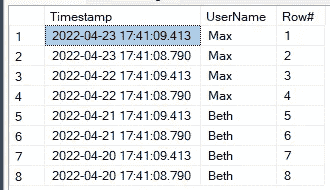
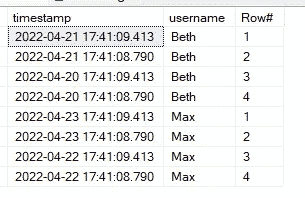
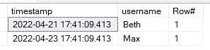

# 了解 SQL Server Management Studio —第 12 部分排名窗口函数

> 原文：<https://towardsdatascience.com/learn-sql-server-management-studio-part-12-ranking-window-functions-b66b5e331d7a>

## 如何使用 SQL 获取每个用户的最新记录？循序渐进教程


迈克尔·泽兹奇在 [Unsplash](https://unsplash.com/?utm_source=medium&utm_medium=referral) 上的照片

## 在最后几集里…

你好。欢迎来到 SQL 和 SQL Server Studio 系列教程的第 12 期。我的目标很简单:让你熟悉和适应这个工具和语言。“这有什么关系？”我知道你在问。事实证明，好奇心和副业往往是被新项目选中甚至获得新工作的关键。事实上，您已经使用了一个重要的工具，比如 SQL Server Studio，并且编写了一些 SQL 查询，这将会给您一个清晰的开端。

*   **在第 1 集**中，我将向您展示**如何设置我们的环境和本地服务器** — [第 1 部分逐步设置 SQL Server Studio](/getting-started-with-sql-server-management-studio-part-1-step-by-step-setup-63428650a1e0)
*   **在第 2 集**中，我们将讲述**如何创建数据库、表**、**和**关于**命名约定的重要注释—** [第 2 部分数据库、表&命名约定](/getting-started-with-sql-server-management-studio-5cd24bb1a87c)
*   **在第三集**中，我们介绍了 **CRUD 操作**和**主键和外键** — [第三部分 CRUD 操作，主键&外键](/learn-sql-server-management-studio-part-3-crud-operations-primary-foreign-keys-9d884b32ad70)
*   **在第 4 集**中，我们讨论了**模式&的主要规范化步骤** — [第 4 部分模式&规范化](/learn-sql-server-management-studio-part-4-schemas-normalization-80bcd6a5258)
*   **在第 5 集**中，我们覆盖了**存储过程&调度**，这是一个真正的野兽。我怎么强调这将如何促进和自动化你的日常(数据)生活都不为过。[第五部分存储过程&调度](/learn-sql-server-management-studio-part-5-stored-procedures-scheduling-88fd9788d314)
*   **在第 6 集**中，我们介绍了用于 ETL 的 **SSIS 包，并回顾了如何在两个数据库之间以及一个数据库和 Excel 之间导入和导出数据。[第六部 SSIS 套餐简介](/learn-sql-server-management-studio-part-6-ssis-packages-9438dbc90437)**
*   在第 7 集中，我们**将 SQL Studio 连接到 PowerBI** 并构建我们的第一个视觉效果。[第 7 部分连接到 PowerBI &第一视觉效果](http://part%207%20connect%20to%20powerbi%20%26%20first%20visuals/)。
*   **在第 8 集**中，我们**利用 SQL 视图**的强大功能，这是一个简单的轻量级工具，用于组合和检索复杂的表。你不会相信没有他们你怎么活下去。[第 8 部分利用观点](/learn-sql-server-management-studio-part-8-leverage-the-views-206fbcef3957)
*   在第 9 集中，我们利用临时表，在存储过程中临时存储和检索数据。找出中间结果并以表格形式缓存数据以备后用是非常有用的。在[第九部分临时表格](/learn-sql-server-management-studio-part-9-temporary-tables-f69aee616833)中了解更多信息
*   第 10 集探讨了如何使用存储过程和调度任务将 SQL 数据导出为 CSV 文件并通过电子邮件发送。[第 10 部分通过电子邮件以 CSV 格式导出 SQL 查询数据](/learn-sql-server-management-studio-part-10-export-tables-by-email-as-csv-29bf2d990656)
*   **第 11 集**跳入云端，在 Azure Cloud 中设置服务器和数据库。

别忘了回来😉。

## 期待什么？

数据以多种形式出现。在一段时间内，一个数据集(比如一个日志表)可能包含一个用户或一台机器的多条记录。我们怎么可能分割这些数据，只检索给定用户、机器或 X 的最新时间戳呢？

这就是排名窗口函数的用处。它们的语法比我们在其他章节中看到的常规 SELECT 或 CRUD 操作要复杂一些(见上文)。老实说，我永远也搞不懂那个语法，总是需要参考我的神圣文本文件😉。

知道如何利用它将解决许多令人头痛的问题，并允许您对记录进行排序并过滤掉不需要的内容。事不宜迟…

## 介绍

我们假设您已经设置好了 SQL Server Studio 环境。如果你需要任何帮助，请查看上面提到的第一集。

让我们首先创建一个新表“日志”:

```
CREATE TABLE Logs(Timestamp datetime,Username nvarchar(100))
```

现在让我们用一些数据填充它:

```
INSERT INTO [HR_data].[dbo].[Logs]VALUES(GETUTCDATE(), 'Max'),(GETUTCDATE()-1, 'Max'),(GETUTCDATE()-2, 'Beth'),(GETUTCDATE()-3, 'Beth')
```

让我们添加更多的噪音，通过复制我们刚刚插入的内容。这将插入相同的行，只是时间戳会有几秒钟的差异，这取决于您执行查询的时间。

```
/* This is to add a bit more records/noise in our dataset */INSERT INTO [HR_data].[dbo].[Logs]VALUES(GETUTCDATE(), 'Max'),(GETUTCDATE()-1, 'Max'),(GETUTCDATE()-2, 'Beth'),(GETUTCDATE()-3, 'Beth')
```

运行快速选择查询来检查数据集:

```
SELECT * FROM [HR_data].[dbo].[Logs]
```

这将返回 8 条记录。

## 排名窗口功能

我们如何提取表中任何一个用户的最新时间戳呢？排名窗口功能来拯救我们。这是一个本机 T-SQL 函数。

```
SELECT Timestamp, UsernameROW_NUMBER() OVER(ORDER BY Timestamp DESC) AS Row#FROM [HR_data].[dbo].[Logs]
```

*   我们从选择时间戳和用户名开始。到目前为止一切顺利。
*   然后我们添加 Row_Number()函数，它将为每条记录定义一个行号。
*   OVER()有助于定义我们的目标。在这种情况下，我们将查看时间戳。在 OVER()函数中，我们精确地定义了一个 ORDER BY，并定义了它是升序(ASC)还是降序(DESC)。
*   最后，我们设置了一个别名，这里将该列称为 Row#

**输出为:**



好吧，至少他们有排名。但是我们需要的是找到任何给定用户的最新时间戳。我们需要在 ROW_NUMBER()中添加另一个元素。PARTITION BY 的使用将帮助我们对 FROM 子句引用的数据集进行分区。正如我们在上面看到的，当不使用 PARTITION BY 时，结果的所有行都被视为一个组。

我们可以这样编写我们的查询:

```
SELECT Timestamp, UserName,ROW_NUMBER() OVER(PARTITION BY UserName ORDER BY Timestamp DESC) AS Row#FROM [HR_data].[dbo].[Logs]
```

*   OVER 子句中添加了 PARTITION BY。
*   PARTITION BY 要求我们至少定义一列，在我们的例子中，我们按用户名进行分区。

**输出:**



麦克斯和贝丝各有 4 张唱片。他们的记录是按时间戳排序的。

*   该分区由有针对性的*用户名*组成。有两个不同的用户名，ROW_NUMBER()根据分区对这些记录进行排序。
*   这就是为什么 Max 和 Beth 的记录从 1 到 4，而我们之前的排名是从 1 到 8。

## 最后一步

我们最初的目标是为每个用户获取最新的时间戳。如上面的输出所示，我们知道哪个记录是每个用户的最新记录。只看第# = 1 行。我们怎样才能把这些行分离出来呢？嵌套查询将帮助我们。

我们将首先重用运行良好的内容:

```
SELECT Timestamp, UserName,ROW_NUMBER() OVER(PARTITION BY UserName ORDER BY Timestamp DESC) AS Row#FROM [HR_data].[dbo].[Logs]
```

然后，我们用圆括号将它括在另一个 SELECT 语句中，并为嵌套查询提供别名“x ”:

```
SELECT * FROM(
SELECT Timestamp, UserName,ROW_NUMBER() OVER(PARTITION BY UserName ORDER BY Timestamp DESC) AS Row#FROM [HR_data].[dbo].[Logs]
) x
```

最后一步是添加一个 WHERE 条件，这样我们只查看 Row# = 1:

```
SELECT * FROM(
SELECT Timestamp, UserName,ROW_NUMBER() OVER(PARTITION BY UserName ORDER BY Timestamp DESC) AS Row#FROM [HR_data].[dbo].[Logs]
) x
where x.Row# = 1
```

**输出:**



我们现在有了两个不同用户的两个最新时间戳。任务已完成🙂

## 最后的话

我们现在掌握了一个新工具，排名窗口功能。这可以解决许多问题，例如，当我们面对相同的行，只是时间戳不同。ROW_NUMBER()结合 PARTITION BY 将允许我们基于一个或多个属性对数据集进行分区。在我们的例子中是用户名。然后，我们可以根据时间戳对行进行排序。

最后，嵌套查询允许我们挑选出给定的等级。在我们的例子中，我们关注的是 rank/row #1，即最近的时间戳。

我希望你觉得这篇文章有用，让我知道你的想法，或者如果有我应该涵盖的主题。与此同时，请随时订阅并关注我。下次见！

# 快乐编码🎉！

感谢阅读！喜欢这个故事吗？ [**加入媒介**](https://medium.com/@maximegodfroid/membership) 可完整访问我的所有故事。