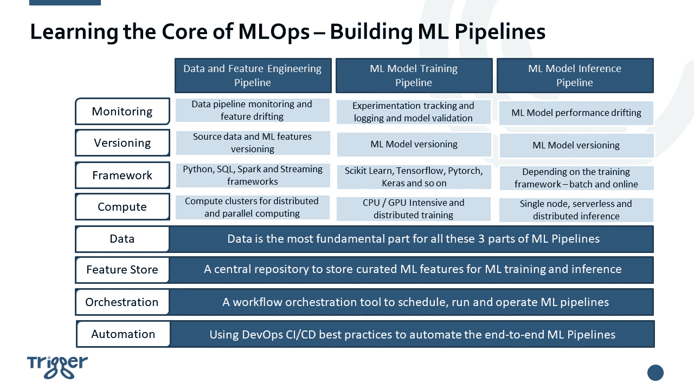

# 了解 MLOps 的核心——构建机器学习(ML)管道

> 原文：<https://towardsdatascience.com/learn-the-core-of-mlops-building-machine-learning-ml-pipelines-7242b77520b7>

## 实施 MLOps 使人工智能发挥作用的实用指南

## 为什么需要 MLOps

众所周知，为了让人工智能发挥作用，真正的挑战不是建立一个机器学习(ML)模型，而是建立一个集成的 ML 系统，并在生产中持续运行它。这就是为什么 MLOps 的概念被开发出来，并且它正在数据科学家、ML 工程师和 AI 爱好者中迅速获得动力。

由于近年来对最大似然算法的大力研究，人工智能和最大似然在创造新的商业机会、提供更好的客户体验、提高运营效率等方面向组织展示了巨大的潜力。然而，在 Jupyter 笔记本中训练 ML 模型和在生产系统中部署 ML 模型之间存在巨大的技术差距。因此，许多公司还没有找到如何实现他们的人工智能/人工智能目标的方法，他们向人工智能操作系统寻求帮助，希望通过人工智能操作系统，他们可以使人工智能在现实世界的生产环境中工作，以真正获得人工智能和人工智能驱动的解决方案的好处

因此，我认为开发一系列解释如何实施 MLOps 实践的实用指南是非常有用的。这些指南将包括对关键 MLOps 组件、设计考虑因素以及实施示例代码的解释。

如果我们纯粹从工程和实施的角度来看待 MLOps，任何端到端 MLOps 解决方案都有三个核心部分:

*   第一部分是— ***数据和特征工程管线***
*   第二部分是— ***ML 模型训练和再训练管道***
*   第三部分是— ***ML 模型推理和服务管道***

MLOps 以一种 ***自动化*** 的方式将上述三条流水线缝合在一起，并确保 ML 解决方案是 ***可靠的*** 、 ***可测试的*** 和 ***可再现的*** 。在这篇博客的剩余部分，我将一点一点地解释这三条管道。

照片由 [Hitesh Choudhary](https://unsplash.com/@hiteshchoudhary?utm_source=medium&utm_medium=referral) 在 [Unsplash](https://unsplash.com?utm_source=medium&utm_medium=referral) 上拍摄

## 实施 MLOps 解决方案的关键构建模块

下图显示了上述 3 条 MLOps 管道的所有关键组件。正如您所看到的，构建端到端的 MLOps 解决方案可能非常复杂，但请不要担心，在接下来的系列文章中，我将逐一详细解释它们，并演示如何实现每个组件。

学习 MLOps 的核心——构建 ML 管道(图片由作者提供)

## 数据和特征工程管线

我将从数据和特征工程管道开始，因为数据是任何 ML 系统的核心。一般来说，数据管道是指提取、转换和加载(ETL)管道，数据工程师通过这些管道从源系统摄取原始数据，然后将数据清理并转换为可靠的高质量信息，供下游数据消费者使用。如果您有兴趣了解如何构建数据管道，我有一篇单独的文章。[学习数据工程的核心——构建数据管道](https://medium.com/@weiyunna91/learn-the-core-of-data-engineering-building-data-pipelines-21a4be265cc0?source=friends_link&sk=a15ca2e70b29b46a33adc695a341349e)。请随意阅读。

ML 的独特之处在于 ***原始数据*** 需要转换成**特征**以便 ML 模型可以有效地从数据中学习有用的模式。将原始数据转换成特征的过程称为 ***特征工程。*** 因此，这篇文章的重点将是实现特征工程管道，并介绍什么是特征库。

有各种各样的特征工程技术，包括插补、异常值处理、宁滨、对数变换、一键编码等等。如果你想了解更多，我相信你可以谷歌一下，在特色商店里会有很多博客。然而，我想在这里强调的是，通常对于机器学习(ML)项目，数据科学家将大量的时间和精力投入到特征工程中，以便在他们的机器学习模型上获得体面的性能。因此，存储这些特征以供发现和重用是有价值和必要的。因此,“功能商店”的概念得到了发展，并且在功能商店上有相当多的开源和商业产品。然而，功能存储不仅仅是为了功能重用。 ***特征库是机器学习的数据管理层，允许您共享&发现特征并创建更有效的机器学习管道。*** 任何 MLOps 解决方案中最重要的两个部分——模型训练和模型服务——都可以利用特征存储。总之，功能存储提供了以下功能和优势:

*   特征发现和重用
*   用于模型训练和服务的一致特征工程
*   监控数据和特征漂移
*   训练数据集的再现性

对于完整的 MLOps 解决方案，必须为模型训练和服务建立特征工程管道和特征存储。这是一个非常高层次的介绍。我将很快发表一篇关于特色商店的博客。如果您想在新日志发布时收到通知，请随时关注我。

## ML 模型训练和再训练管道

一旦特征工程完成，下一步将是 ML 模型训练。ML 模型训练是一个高度迭代的过程，这就是为什么它也被称为 ***ML 模型实验*** 的原因。数据科学家必须使用不同的参数和超参数运行许多实验，以便找到具有最佳性能的模型。因此，数据科学家需要一种系统的方法来记录和跟踪每次实验运行的超参数和指标，以便他们可以比较每次运行，并找到最佳运行。有一些开源库可以帮助数据科学家记录和跟踪模型实验，如 [mlflow](https://mlflow.org/) 。mlflow 是一个管理 ML 生命周期的开源平台，包括实验、再现性、部署和中央模型注册。

除了模型训练之外，数据科学家还需要 ***评估和测试*** 模型，然后才能适应将模型放入真实的生产环境。他们需要确保该模型在真实世界的实时数据中表现良好，就像在训练数据中一样。因此，选择正确的测试数据集和最相关的性能指标是非常重要的。有了 MLOps，模型训练和模型评估都需要自动化。

ML 驱动系统的关键挑战是模型性能由用于训练它的数据决定。然而， ***数据总是变化的。*** 因此，对于大多数 ML 驱动的场景，重新训练模型变得绝对必要。通常，有几种方式来触发模型重新训练:

*   ***基于计划的*** —以预定义的时间间隔，例如每周一次，用最新数据重新训练模型。根据数据变化的速度和其他业务需求，计划频率可能会有很大差异。
*   *—当识别到漂移时，如数据漂移、特征漂移或模型性能恶化，触发模型重新训练。为了实现完全自动化的方法来重新训练模型，需要有一个健壮的监控解决方案来监控数据变化和模型变化。*

*MLOps 解决方案的理想结果是不仅自动重新训练模型，而且基于预定义的模型指标评估新训练的模型并选择最佳运行。*

## *ML 模型推理/服务管道*

*一旦模型被训练和评估，下一步将是把模型放到真实的生产环境中使用。一般来说，有两种方式来为训练好的 ML 模型服务:*

*   ****离线批量推断*** —调用 ML 模型，以一定的频率进行预测。频率可以高达每天、每周，甚至更长，但也可以低至每分钟。当频率非常低时(非常频繁)，您可以将流数据管道与 ML 模型推理集成在一起。当批量推理的数据量非常大时，就需要一个分布式计算框架。例如，您可以将模型作为 Spark 用户定义函数(UDF)加载，并使用分布式计算进行大规模并行推理。*
*   ****在线实时推理*** —将 ML 模型封装为 REST API 端点。对于在线实时推理，打包的 ML 模型通常被嵌入到应用程序中，其中模型预测是根据请求生成的。当请求量很大时，可以将模型打包成容器映像，部署到 Kubernetes 环境中进行自动缩放，以响应 ***大量的预测请求。****

*如前所述，数据决定了模型的性能。在现实世界中，数据总是在变化，模型性能也不可避免地会发生变化，而且经常会恶化。因此 ***拥有一个监控解决方案来跟踪生产模型的变化以及用于反馈这些变化的数据/特征是非常必要的。*** 一旦识别出重大变更，监控解决方案需要能够触发模型再训练或者向相关团队发送通知，以便可以立即进行修复。这对于业务关键的 ML 驱动的应用程序尤其必要。通常，ML 模型监控包括以下 4 个类别:*

*   *预测漂移*
*   *数据/特征漂移*
*   *目标漂移*
*   *数据质量*

*监控 ML 解决方案既有开源产品，也有商业产品。例如，[显然 AI](https://www.evidentlyai.com/) 是一个开源的 Python 库，用于评估、测试和监控 ML 模型从验证到生产的性能。*

*到目前为止，我们已经涵盖了完整 MLOps 解决方案的 3 个关键管道——数据和特征工程管道、ML 模型训练和再训练管道、ML 模型推理管道以及 ML 模型监控。*

## *MLOps 解决方案的规模范围*

*MLOps 是一个相当新的概念，你可能会从上面的介绍中看出，MLOps 涉及到将许多不同的组件拼凑在一起，以便使 AI 在现实世界中工作。因此，许多人认为 MLOps 令人生畏且复杂。然而，当我们谈论实施端到端 MLOps 解决方案时，需要绘制一个**规模谱**。*

*例如，如果您的 ML 解决方案是小规模和基于批处理的—批处理数据管道、批处理培训、批处理推理，并且数据量不需要分布式计算—那么实施 MLOps 并不困难，甚至数据科学家也可以成为“全栈”并拥有整个解决方案。然而，如果你谈论的是大规模的、持续的训练和实时的推理，这可能是相当复杂的，需要多个团队和不同的基础设施一起工作。*

*因此，在接下来的帖子中，我将解释一些 ML 参考架构和在不同规模下实现 MLOps 的最佳实践，因为每个规模可能涉及非常不同的技能集和不同的基础设施设置。敬请关注。*

*我希望你喜欢阅读这篇博客。如果你想在有新博客发表时得到通知，请随时关注我的 Medium，这肯定会激励我写更多。*

*如果想看到更多围绕现代高效数据+AI 栈的指南、深度潜水、见解，请订阅我的免费简讯— [***高效数据+AI 栈***](https://yunnawei.substack.com/) ，谢谢！*

*注:以防万一你还没有成为媒体成员，并希望获得无限制的媒体访问，你可以使用我的[推荐链接](https://medium.com/@weiyunna91/membership)注册！我可以免费给你一点佣金。非常感谢你的支持！*