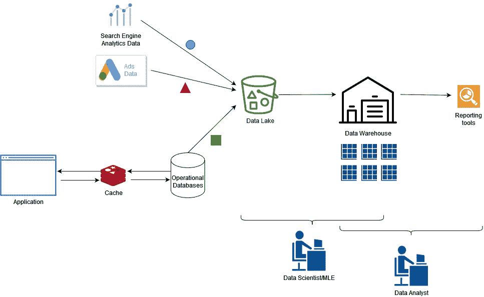
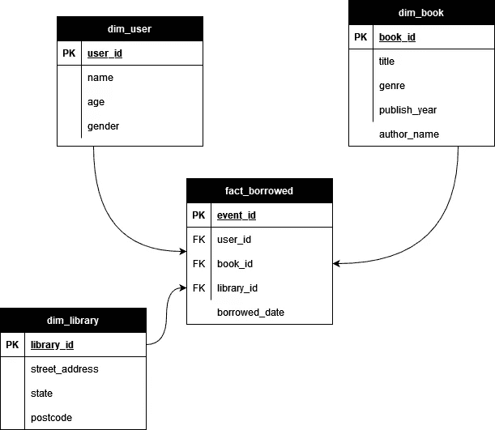
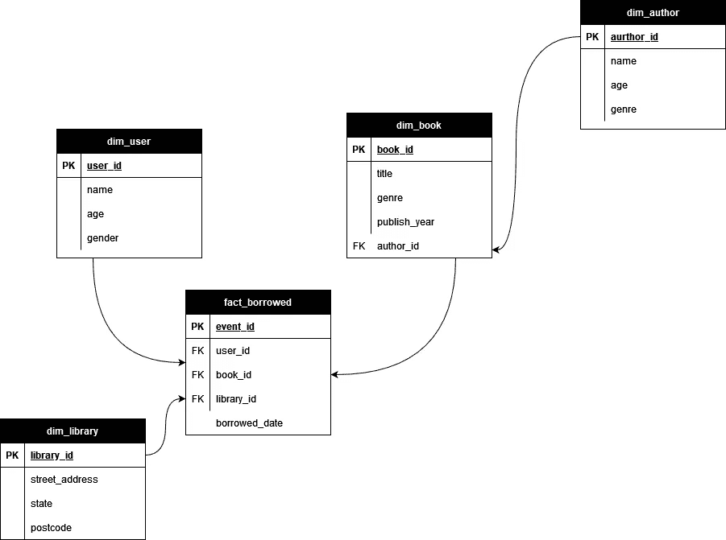

# 了解数据之谈——深入数据黑暗深处的 MLEs 之旅

> 原文：<https://towardsdatascience.com/learn-the-talk-of-data-an-mles-journey-to-the-dark-depths-of-data-storage-bf4c4369a917>

图片来自 [Pixabay](https://pixabay.com/?utm_source=link-attribution&utm_medium=referral&utm_campaign=image&utm_content=1147815) 的 [ElasticComputeFarm](https://pixabay.com/users/elasticcomputefarm-1865639/?utm_source=link-attribution&utm_medium=referral&utm_campaign=image&utm_content=1147815)

让我们面对现实吧，如果有什么东西是数据科学家(DSs)或机器学习工程师(MLEs)会回避的，那就是还不是一个`Numpy`数组或`pandas`数据帧的数据。在不影射数据科学家对数据库的恐惧的情况下，让我们试着理解其中的一些概念。

# 作为 DS/MLE 为什么重要？

服务于数百万客户的公司每秒钟都会收集大量的结构化和非结构化数据。为这些客户提供毫秒级延迟，同时支持分析团队开展工作，这是一项挑战，需要精心设计的数据架构。大多数公司会有数据工程师来为我们做这件事。作为一个 MLE，我就不能幸福地忽略所有的方面，做好我的工作吗？大多数时候，答案是响亮的**不**。出于一些原因，

*   组织中的数据(尤其是大规模数据)可能会很快变得令人毛骨悚然。通过了解基本概念，您将能够自信地选择最有效的方法来为您的 ML 用例收集高质量的数据。
*   通过 MLEs 拥有 ML 模型的数据源总是更有效，因为等待帮助可能会很慢。
*   自己做事情的时候，可能需要去找数据工程师谈，解决问题。你的数据知识将决定你的谈话有多有意义。

# 这是给谁的？

这是 MLE 对数据世界的解释。这些知识大部分来自经验和自学。这是给那些，

*   渴望了解大规模工作中的数据及其在公司中的应用
*   接触数据但不了解概念，
*   难道**不是**一个处理复杂数据管道的经验丰富的数据工程师吗

作为一个只触及数据表面的人，可能会有一些我没有意识到的细微差别，或者对我讨论的某些方面的其他解释。如果你看到任何需要添加/修改的地方，请在评论中告诉我。

有了这个小小的免责声明，让我们了解一些您可能会遇到的数据中的基本数据概念。下一次，您将能够自信地与数据工程师交谈，并与他们合作，以更快地解决您的问题。

# 体系结构

让我们首先了解一下，对于拥有大量数据的公司来说，典型的数据架构是什么样子的。

用于将不同来源的异构数据引入数据仓库的数据流(图片由作者提供)

应用程序将从关系(或事务)数据库中读取和写入数据。我们称之为操作 DBs。这些数据库针对读写记录(或事务)进行了优化。然而，直接读取/写入数据库是很昂贵的。因此，我们在两者之间使用一个缓存层，其中应用程序将读取或写入缓存，而缓存将读取或写入操作数据库(在[通读/直写缓存](https://docs.oracle.com/cd/E15357_01/coh.360/e15723/cache_rtwtwbra.htm)上读取)。缓存可能类似于 [Redis](https://redis.io/) 。这些数据库被频繁地转储并存储到数据湖中，比如亚马逊 S3。数据库可以每隔几分钟复制一次，以避免丢失数据。此外，其他第三方数据可能会被写入数据湖。

接下来，这些数据被加载并集中到一个数据仓库中，然后被转换为适合分析的数据。最后，仓库中可用的干净且经过转换的数据可以直接使用，或者由报告层用于可视化和做出基于数据的决策。

# 数据湖与数据仓库

数据湖和数据仓库是公司数据流的焦点。它们是什么，如何互相恭维？数据湖存储几乎没有结构的数据，这意味着写入数据非常快。但是读取是昂贵的，因为在能够有效地使用数据之前，您需要推断模式并进行清理(称为模式读取)。数据湖为存储大量数据提供了廉价的存储。例如，您可以将在线运行数据库的垃圾存储到一个湖中，然后将其用于离线分析目的。数据湖的一些例子有[亚马逊 S3](https://aws.amazon.com/s3/) 或者[谷歌云存储](https://cloud.google.com/storage)。你可以使用节省空间的格式来存储数据。

这些数据随后被数据仓库使用。数据仓库通常在写入时执行模式，并使用结构化的 SQL 数据库。它们针对复杂计算(如数学运算、窗口等)进行了优化。)，因此在数据仓库中计算相对更便宜和高效。例子有[亚马逊红移](https://aws.amazon.com/redshift/)。

> 数据湖针对存储和非结构化数据进行了优化，而数据仓库针对计算和结构化数据进行了优化

我们还得到了更先进的技术，结合了两个世界的精华，被称为[数据仓库](https://databricks.com/glossary/data-lakehouse)。[雪花](https://www.snowflake.com/)就是一个例子。例如，虽然雪花提供了数据仓库功能，如存储 SQL 表、复杂的分析功能，但您可以利用`VARIANT`数据类型来存储非结构化数据(如 JSON blobs)并有效地查询它们。雪花还提供了存储和计算实例之间的分离，能够分别针对它们进行优化以降低成本。

> 数据湖库将数据湖和数据仓库的优势结合到一个解决方案中

# 运营数据库与数据仓库

在最面向用户的方面，您会发现针对事务处理进行了优化的操作数据库(有时称为 OLTP 数据库)。他们就是这么做的。他们对单个记录(或事务)进行大量的创建、读取、更新和删除操作。换句话说，您不希望在这些数据库中加入复杂的分析功能。因此，像 [MySQL](https://www.mysql.com/) 或[PostGres](https://www.postgresql.org/)db 这样的东西在大多数时候都工作得很好。

两种解决方案中使用的存储类型是一个关键区别。操作数据库将逐行存储数据(或基于行的存储)。这是有意义的，因为操作数据库是对数据行进行操作的。然而，数据仓库使用更适合分析查询的列存储。

# 数据仓库的内部

现在让我们把注意力转向数据仓库。作为一名 DS 或 MLE，你将在这里度过大部分时间。

## 数据仓库的层次

数据仓库解决方案通常很复杂，有多个层次。您可以在其中找到以下几层，

*   临时区域—这是源数据转储到的地方。运营数据库、第三方数据的转储将被加载到暂存区
*   转换/存储层—来自临时区域的数据被聚合并转换到新表中。这些表格可以作为 ML 模型的数据集，或者为数据分析师提供产品/服务的洞察力
*   报告层-在此基础上，您可以决定建立一个报告层，用于存储更多基于源数据和转换数据的定制表格，这些表格可由可视化报告工具直接使用

## 表格与视图

另一个需要注意的区别是表和视图之间的区别。表实际上存在于数据库中，而视图是虚拟的，可以按需填充。例如，对于偶尔使用的数据(例如，每隔几天训练一个模型)，视图是一个很好的选择。这将帮助您节省存储空间。

## 事实和模糊表

当您整理来自仓库中不同微服务的所有源数据时，这些表被组织成事实表和 dim 表。它们构成了你的服务/产品的数据架构。理解事实表和 dim 表最简单的方法是考虑一个用户故事。让我们想象一个在线图书馆系统。其中一个用户故事可能是，

> 作为一个借书者，我需要能够去图书馆，选择一本书，并检查可用性

在这个故事中，我们可能有下列表格

事实表和维度表的组织(星型架构)。PK 指主键，FK 指外键(图片由作者提供)

## 星形与雪花形模式

将数据加载到仓库的目的是为分析处理提供一个集中的避风港。因此，拥有一个能够更容易/更快速地处理分析查询的模式设计非常重要。星型和雪花型模式是组织表以适应分析的方式。

我们讨论的用户故事中的模式被称为星型模式。您可以看到 dim 表是如何从事实表散开的。这是对现实的一种过于简化的表示，其中 dim 表的数量，也就是外键的数量实际上可以从几十个增加到 100 个。

雪花模式比星型模式更进了一步。它进一步规范化了 dim 表，允许 dim 表扇出到其他 dim 表。例如，如果您决定提供按作者搜索的能力，您可以引入另一个名为`dim_author`的 dim 表，并将`Author ID`作为外键添加到`dim_book`。

雪花模式示例(作者图片)

如您所见，这允许对数据进行进一步分析，例如基于作者的分组等。

## ETL/ELT 管道

ELT 管道是数据架构不可或缺的一部分。他们从杂乱的异构数据库中获取实时数据，并将这些数据泵送到同构数据仓库。您可以将 ETL 管道视为服务数据库数据到达数据仓库的过程。ETL 代表提取、加载和转换。让我们了解每一步发生了什么，

*   提取-从异构源中提取数据。这可以通过自动计划、手动等方式完成。
*   转换-清理源数据并构建转换后的表
*   加载—将干净的转换数据加载到数据仓库中的目标数据库

但是由于存储变得越来越便宜，通常是先提取源数据并将其加载到数据仓库中，然后再转换数据。这个过程被称为 E **LT** (与 ETL 相对)。通常，现代数据仓库解决方案已经提供了大量现成的 ELT 功能(比如雪花中的 [COPY INTO](https://docs.snowflake.com/en/sql-reference/sql/copy-into-table.html) )。

如果你使用 AWS 这样的自管理服务，你可以使用他们的服务完成大部分的提取、加载和转换[。例如，](https://aws.amazon.com/blogs/big-data/loading-ongoing-data-lake-changes-with-aws-dms-and-aws-glue/) [Amazon DMS](https://aws.amazon.com/dms/) (数据库迁移服务)为您提供了将数据从运行中的数据库复制到像 S3 这样的湖泊中的简单方法。然后 [AWS Glue](https://aws.amazon.com/glue) 可以帮你做大部分 ETL 工作，比如清理和转换数据，以及构建数据目录。

当处理数百个表时，转换表不是一件容易的事情。我们需要能够跟踪变更，版本控制转换逻辑。一个不断发展的公司，比如一家初创公司，会更加凸显这种需求。像 [dbt](https://www.getdbt.com/) 这样的工具可以帮助你做到这一点。您可以轻松地将您的`dbt`工作流与雪花等仓库解决方案集成。`dbt`的几个优点是，

*   能够像代码存储库一样对转换逻辑进行版本控制
*   通过`dbt`中的引用机制了解数据转换的谱系

# 结论

我们在这里讨论了许多不同的话题。有了这些知识，当谈到去哪里寻找数据时，你将很容易做出许多决定。此外，它将帮助你说数据工程师的语言，使你与他们的对话更有效。

首先，我们讨论了大规模运营的公司的典型高层数据流。接下来，我们比较和对比了各种数据存储，如操作数据库、仓库和数据湖。接下来，我们深入研究数据仓库的细节。从数据仓库的不同层开始，我们讨论了数据在仓库中是如何组织的。最后，我们讨论了什么是 ETL 管道，以及它们如何适应数据流。

# 参考

*   [Martin Kleppmann 的《设计数据密集型应用》](https://www.amazon.com.au/Designing-Data-Intensive-Applications-Reliable-Maintainable/dp/1449373321)
*   [AWS 文档](https://aws.amazon.com)
*   [雪花文档](https://www.snowflake.com/)