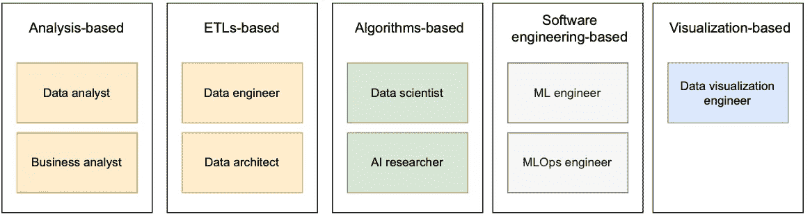
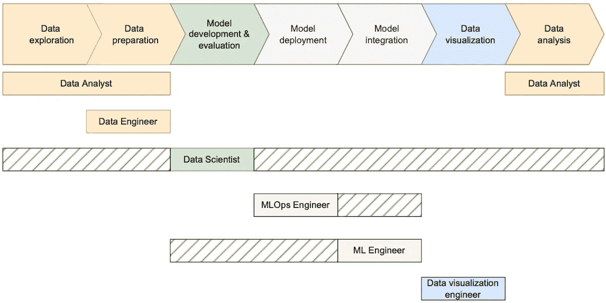
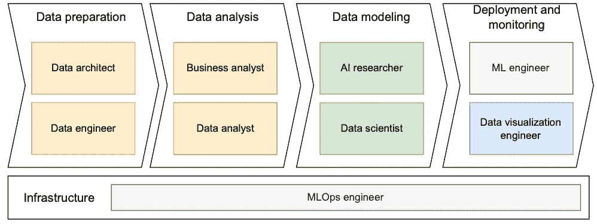

# 学习区分这些数据角色

> 原文：<https://towardsdatascience.com/learn-to-differentiate-these-data-roles-8e4c37e77a6a>

## 数据科学家、数据分析师、数据工程师、人工智能研究员、ML 工程师、ML DevOps 和业务分析师等

由[雷内](https://www.pexels.com/@reneasmussen/)在[像素](https://www.pexels.com/photo/man-s-holding-swords-clip-art-25755/)上拍摄的照片。

如果您正在阅读这篇文章，您可能也面临着区分各种数据角色的困难，例如数据科学家、数据分析师、数据工程师、人工智能研究员、ML 工程师和业务分析师等。

这可能是由于员工的职称与其在公司内从事的项目的责任相比。特别是，公司越小，员工的个人资料和角色之间的差异就越大。

因此，本文尽可能准确地总结了一些更“常见”的数据角色。为了做到这一点，本文首先描述了下面显示的数据角色，然后图示了它们之间的主要联系，并总结了可能造成混淆的角色之间的主要差异。

**图一**。数据角色。 **Ref** :图片作者。

**图二**。核心数据科学生命周期&角色。**参考**:图片由作者提供。

## 数据角色

*   *数据分析师*:通过分析数据和解读结果来回答问题。
*   *业务分析师*:通过数据分析，处理、解释和记录业务流程、产品、服务和软件，以帮助形成业务洞察力，做出更有效的业务决策。
*   *数据可视化工程师*:设计数据报告解决方案，简化对数据及其洞察力的理解。
*   *数据科学家*:专注于通过开发基于人工智能的模型来解决问题，而不是给出问题的答案。
*   人工智能研究员:探索并提出解决问题的新系统，然后由现实世界场景中的其他角色使用。
*   *数据工程师*:构建数据管道，将来自不同源系统的信息汇集在一起。
*   *数据架构师*:定义用于收集、组织、存储和访问公司信息的政策、程序、模型和技术[1]。
*   *ML*工程师:构建和维护人工智能系统，实现预测模型的自动化。
*   *MLOps 工程师*:为数据科学家和其他角色提供对专业工具和基础设施(例如，存储、分布式计算、GPU 等)的访问。)他们在整个数据生命周期中都需要。他们开发方法来平衡独特的数据科学要求与业务其余部分的要求，以提供与现有流程和 CI/CD 管道的集成[2]。

## 数据角色图

如果我们根据角色的需求和依赖关系来连接角色，我们最终会得到如图 3 所示的图表。下面是对每个模块的描述，以及要求开发预测模型时每个角色的职责(说明性示例)。

**图三**。数据角色之间的主要关系。**参考号**:作者图片。

*1。数据准备*:

数据架构师规划组织的数据框架，并与实现它的数据工程师进行讨论。然后，数据工程师创建 ETL 管道，生成数据科学家、数据分析师和业务分析师使用的数据。

对于预测任务，这两个角色将负责构建数据框架来收集数据，以及开发 ETP 管道来创建数据集。

*2。数据建模*:

数据分析师和业务分析师都与数据打交道，主要区别在于他们用数据做什么。业务分析师使用数据来帮助组织做出更有效的业务决策。相比之下，数据分析师更感兴趣的是收集和分析数据，以给出具体问题的答案[4]。

在我们的示例中，所需的角色是数据分析师，他将执行解释性数据分析以获得洞察力。

*3。数据分析*:

人工智能研究人员研究新的基于人工智能的方法，这些方法通常发表在开放存取的档案中，如 [arXiv](https://arxiv.org/) 或会议记录。数据科学家主要使用这些信息来解决他们的任务。

在我们的例子中，数据科学家将根据当前的文献开发预测模型，这些文献来自人工智能研究人员的研究。

*4。部署和监控*:

一旦数据科学家建立了一个模型，机器学习工程师就会将该模型运送到生产环境中。此外，数据可视化工程师设计界面来报告解决方案。

对于预测任务，ML 工程师将采用数据科学家开发的模型，对其进行优化，并将其投入生产。ML 工程师不一定需要理解模型是如何工作的。数据可视化工程师将设计向用户显示的界面。

*5。基础设施:*

MLOps 工程师通过构建和维护一个平台来实现机器学习模型的开发和部署，从而实现其他角色。

在给定的示例中，这些工程师将开发所有专用工具和基础架构(例如，存储、分布式计算、GPU 等。)贯穿数据科学的整个生命周期。

## 数据角色差异

这最后一节重点提到一些最难区分的角色之间的区别。创建预测模型的任务也将用作比较角色的说明性示例。

> 数据架构师 vs 数据工程师

数据架构师设计组织数据框架的远景和蓝图，而数据工程师负责创建远景[3]。

对于预测示例，数据架构师将专注于定义策略、过程、模型和技术，并向数据工程师提供关于如何组织数据以及数据应该以何种格式呈现的见解。此后，数据架构师依赖于数据工程师的具体设想来收集数据，将其存储在系统中，并为分析做准备。

> 业务分析师与数据分析师

虽然数据分析师和业务分析师都与数据打交道，但主要区别在于他们用数据做什么。业务分析师使用数据来帮助组织做出更有效的业务决策。相比之下，数据分析师更感兴趣的是收集和分析数据，以进行评估并用于自己做出决策。[4].

对于给定的示例，数据分析师将负责通过使用统计、数据挖掘和可视化技术对预测问题进行建模、发现见解和识别机会。相比之下，业务分析师将应用广泛的工具、数据源和分析技术来回答广泛的高影响力业务问题，并简洁有效地提出见解。此类业务关键型洞察的示例包括提供新计划/产品和市场发布的估计，以及深入研究最近的事件以了解对联系量的影响。

> 数据分析师 vs 数据科学家

数据分析师通常与给出问题的答案有关，而数据科学家则专注于通过使用数据的发现见解开发基于人工智能的模型来解决问题。

对于预测示例，数据分析师将通过使用诸如平稳性、相关性、自相关性、多重共线性等方法，专注于发现对数据的洞察。另一方面，基于数据分析师的见解，数据科学家将专注于构建模型，可能会实施 LSTM 神经网络、基于变压器的神经网络或 1D 卷积神经网络等。

> 数据科学家 vs 人工智能研究员

人工智能研究人员探索新的方法，提出解决问题的新系统，而数据科学家则在现实世界的场景中调整和应用这些系统[5]。

对于预测任务，两种角色之间存在明显的差距，因为人工智能研究人员不会执行这种类型的任务，因为他们的工作是处理公开可用的数据集，以便他们可以将他们提出的方法与最先进的方法进行比较。这项任务将交给数据科学家，他们将使用 SOTA 模型找到最佳解决方案。

> 数据科学家 vs ML 工程师

数据科学家处理算法的建模方面，而 ML 工程师专注于同一模型的部署。数据科学家专注于算法的细节，而机器学习工程师则致力于将模型投入生产环境[6]。

对于预测任务，数据科学家专注于建立预测模型，试图尽可能减少误差。一旦完成，ML 工程师负责将这个模型运送到生产中，重新训练它，并维护它。

> ML 工程师 vs ML 开发人员

ML 工程师专注于实现和再培训机器学习模型，而 MLOps 工程师通过构建和维护一个平台来实现机器学习模型的开发和部署，从而实现 ML 工程师[7]。

对于给定的示例，ML 工程师的角色是将预测模型运送到由 ML DevOps 维护的基础设施中的生产中，ML devo PS 可能被要求安装例如特定的库或 CUDA 版本。

***如果你喜欢这个帖子，请考虑*** [***订阅***](https://javiferfer.medium.com/membership) ***。你将获得我所有的内容+所有其他来自牛逼创作者的文章！***

## 参考

*最佳参考*:中等，[数据科学领域角色](https://medium.com/towards-artificial-intelligence/the-universe-of-data-science-roles-demystified-b13dd00dc212)

[1][https://www.techtarget.com/whatis/definitions/D](https://www.techtarget.com/whatis/definitions/D)

[https://blog.dominodatalab.com/7-roles-in-mlops](https://blog.dominodatalab.com/7-roles-in-mlops)

[3] Striim，[数据架构师 vs 数据工程师](https://www.striim.com/blog/data-architect-vs-data-engineer-an-overview-of-two-in-demand-roles/#:~:text=The%20data%20architect%20and%20data%20engineer%20titles%20are%20closely%20related,responsible%20for%20creating%20that%20vision)

【4】东北大学，[数据分析师 vs 商业分析师:有什么区别？](https://www.northeastern.edu/graduate/blog/data-analyst-vs-business-analyst/)

[5]实习生 Khoj，[艾研究](https://www.internkhoj.com/jobs/ai-research)

[6]中等，[数据科学家 vs 机器学习工程师技能。区别在这里](/data-scientist-vs-machine-learning-engineer-skills-heres-the-difference-93eb2f4f6f98)

【7】海王星博客，[m lops 工程师是个东西吗？](https://neptune.ai/blog/mlops-engineer#:~:text=In%20my%20opinion%2C%20ML%20Engineers,standardization%2C%20automation%2C%20and%20monitoring.)