# 全球可变可再生能源部署的学习曲线效应

> 原文：<https://towardsdatascience.com/learning-curve-effect-on-the-global-variable-renewable-energy-deployment-73d1e28da390>

## 基于学习曲线效应，可再生能源技术进入良性循环

> 如果你每天提高 1%，到年底你将会提高 37 倍。

当我第一次读到上面这句话的时候，我被它惊呆了。的确，学习是一个缓慢但稳定的过程。当一个人踏上学习新技能的旅程时，这个人在开始时经历相对缓慢的成长是正常的。一旦一个人很好地掌握了基础知识，他的成长会非常快。如果这个人继续努力，从长远来看，他们可以掌握这项技能。这是上面引用的要点，在下面的图中描述得很清楚。

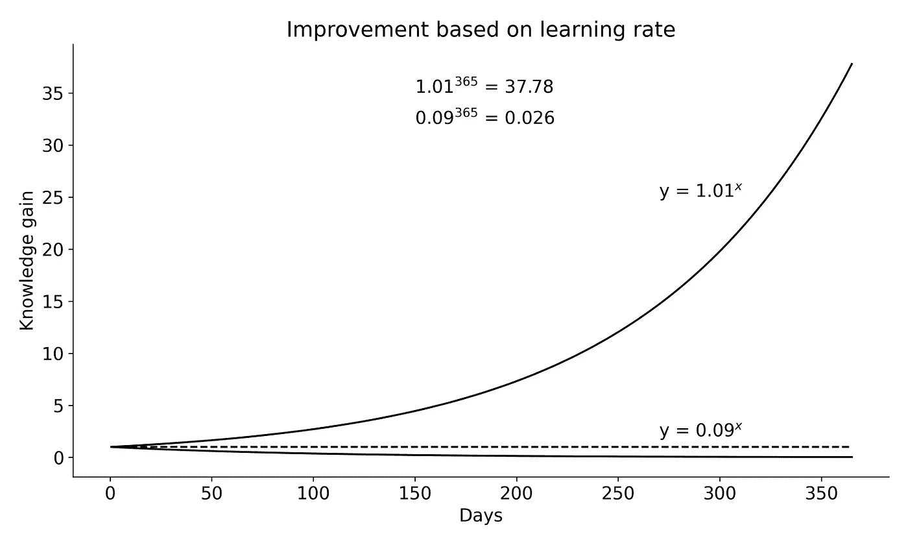

说明通过学习获得的知识。图片作者。

## **学习曲线**

事实上，获得某一领域的知识或熟练程度并不是一个顺利的过程。在前进的道路上有几个挑战。从整体角度来看，类似于学习旅程的曲线被称为**学习曲线**。它是一个领域在一段时间内所获得的熟练程度或专业知识的图形表示。

学习曲线的形状可以根据环境而变化。它可以是线性的、s 曲线的，甚至是指数的。s 曲线(sigmoid 函数)是学习曲线的一般形式，从起点开始慢慢积累小步骤。接下来是更大的步骤，然后随着学习进入成熟阶段，又是更小的步骤。

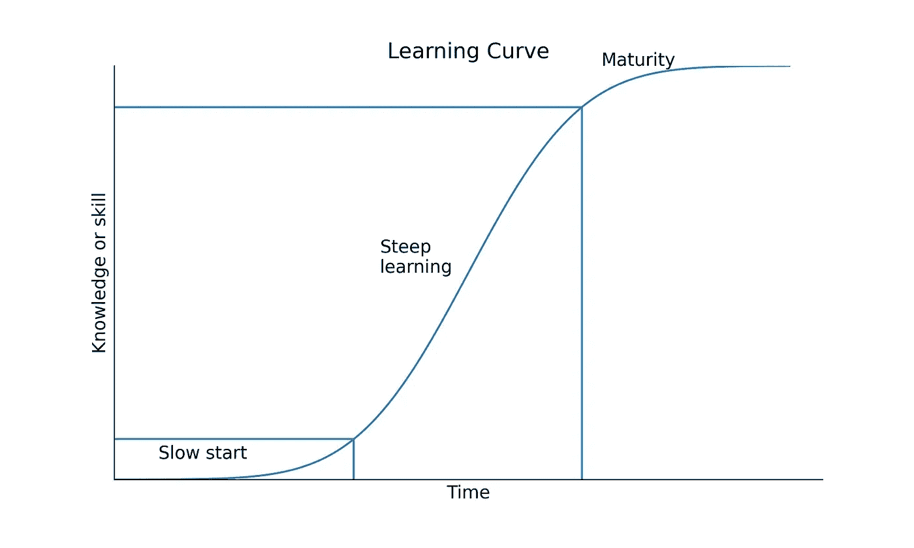

**学习曲线**的图示。图片作者。

## 经验曲线

学习曲线的概念也适用于经济学。市场中的每个产品在其生命周期中都要经历四个主要阶段:

*   **简介**:产品投放市场后，
*   **增长**:当销量开始增长时，
*   **成熟期**:当产品销售达到顶峰时，
*   **衰落**:产品变老，一种新兴技术取而代之。

产品在其生命周期中销量或产量的增长类似于学习过程中的知识增长。当产品产量增加时，与之相关的经验也会增加，从而随着时间的推移提高效率。因此，累积产量的增加导致单位产品成本的下降。这种效应被称为**学习曲线效应**或**经验曲线效应**。

术语“学习曲线”和“经验曲线”经常根据上下文互换使用。

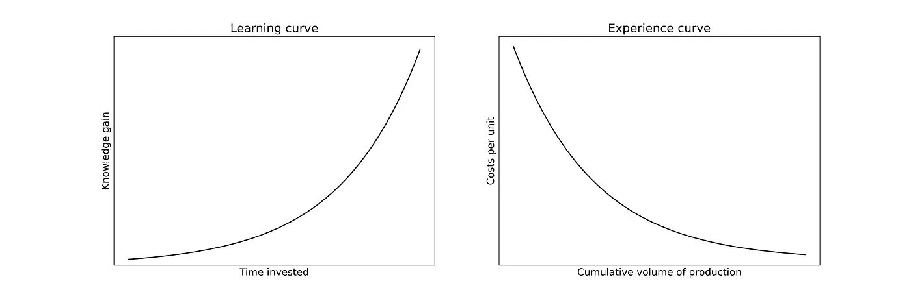

学习过程和经验曲线效应的图解。图片作者。

# 可变可再生能源技术部署的学习曲线效应案例研究

可再生能源技术的应用，特别是**可变可再生能源(VRE)**在过去十年里显著增长。风能和太阳能等能源技术被称为 VRE，因为它们具有间歇性和不确定性等特性。在以下部分，我将讨论从 2010 年到 2020 年 VRE 部署的趋势、驱动因素以及学习曲线的影响。

## **全球可再生能源趋势**

根据国际可再生能源机构的数据，可再生能源技术的总装机容量从 2010 年的约 1，300 千兆瓦增加到 2020 年的近 2，900 千兆瓦，增加了一倍多(国际可再生能源机构，2021 年 a)。虽然水电和生物质能等可再生能源技术在过去十年中略有增长，但 VRE 技术的安装在同一时期呈指数增长。

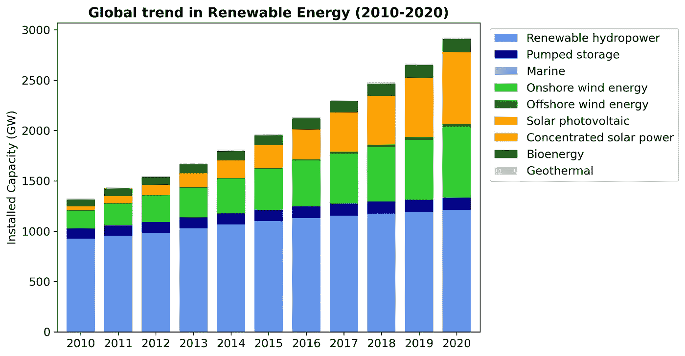

2010-2020 年世界可再生能源技术总装机容量。图片作者。

## **可变可再生能源的全球趋势**

在过去的十年里，在全球范围内部署最多的技术是太阳能光伏发电。太阳能光伏装机容量从 2010 年的 40 GW 增长到 2020 年的 710 GW，增长了近 18 倍。其次是陆上风能技术，其装机容量增长了近四倍，从 2010 年的 178 吉瓦增长到 2020 年的近 700 吉瓦。虽然海上风力发电和聚光太阳能发电技术的装机容量在此期间也有所增长，但这些技术的总装机容量仍然相对较小。总体而言，VRE 的装机容量从 2010 年的 222 GW 增长到 2020 年的 1448 GW，增长了近六倍半，如下图所示。

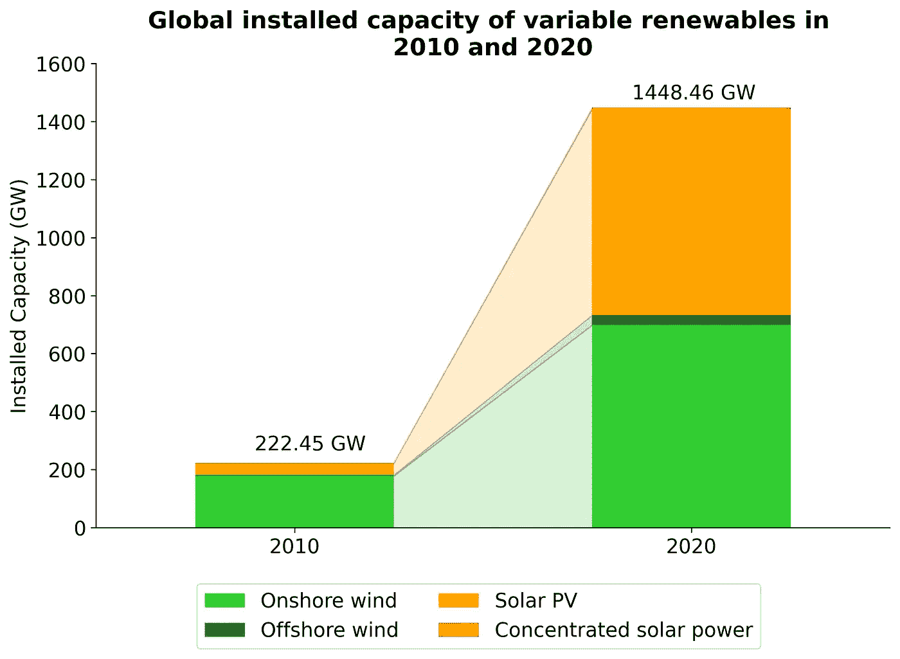

2010 年和 2020 年 VRE 全球装机容量对比。图片作者。

所用数据帧的名称是`abc`，如下图所示。用于获得上图的数据框架可在下面的要点中找到。

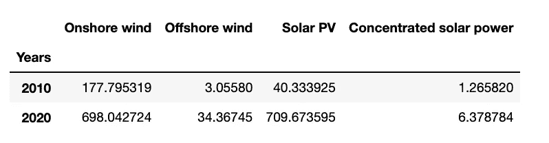

包含 2010 年和 2020 年 VRE 技术总装机容量的数据框架。图片作者。

## **VRE 技术成本下降**

减少能源组合中的碳排放以缓解气候变化的需求无疑是过去十年中 VRE 技术应用增加的主要驱动力之一。然而，市场总是由产品成本驱动的。每当市场上有多种选择可以满足我们的**目标**，我们倾向于选择**最具成本效益的一个**。

VRE 技术公司的资本成本在过去十年里稳步下降，而且今天还在继续下降(IRENA，2021b)。2010 年至 2020 年间，太阳能光伏的资本成本下降了 5 倍多，从 4731 美元/千瓦降至 883 美元/千瓦。在同一时期，陆上风电的资本成本从 1971 美元/千瓦下降到 1349 美元/千瓦。

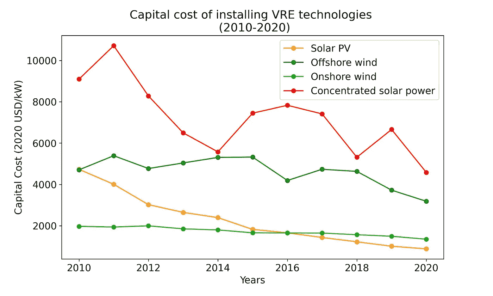

2010 年至 2020 年安装 VRE 技术的资本成本。图片作者。

随着这些技术的资本成本直线下降，这些技术的发电成本(称为**平准化电力成本(LCOE)** )也逐年大幅下降。因此，近年来，VRE 技术与化石燃料技术相比越来越具有成本竞争力。根据国际可再生能源机构的数据，2010 年至 2020 年间，太阳能光伏、陆上风能、海上风能和光热发电技术新增产能的全球加权平均 LCOE 分别下降了 85%、56%、48%和 68%(国际可再生能源机构，2021 年 b)。

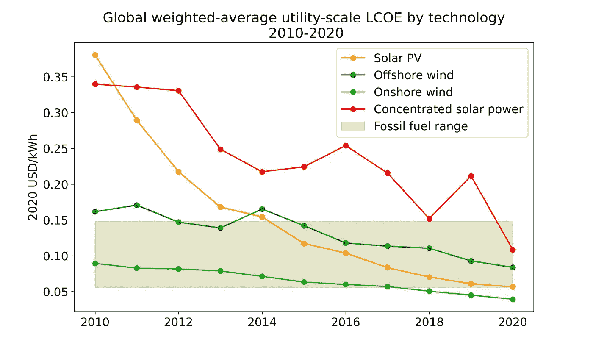

2010 年至 2020 年 VRE 技术公司的全球加权平均公用事业规模 LCOE。图片作者。

与非可再生能源相比，可再生能源技术的资本成本和 LCOE 的快速下降可归因于这样一个事实，即可再生能源技术遵循一条**学习曲线**，而非可再生能源则不然。这是因为，虽然化石燃料和核电的 LCOE 很大程度上取决于燃料价格和运行成本，但可再生能源技术没有燃料成本，运行成本相对较低，因此，可再生能源技术的 LCOE 很大程度上取决于技术本身的成本。

学习曲线的原理是，

> 累计装机容量每增加一倍，成本就会以一定的平均百分比下降，这个百分比称为学习率。

这种关系显示在下面的数学等式中:

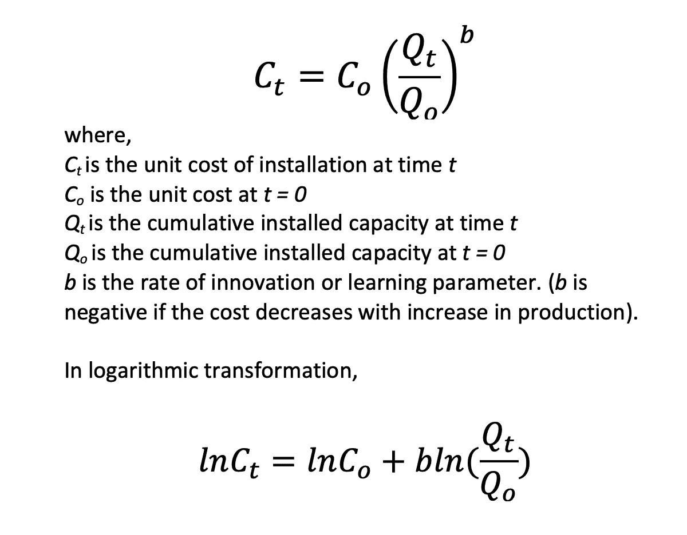

基于学习参数，显示开始和结束时间的资本成本和累计装机容量之间关系的等式。图片作者。

学习率通过以下公式计算:

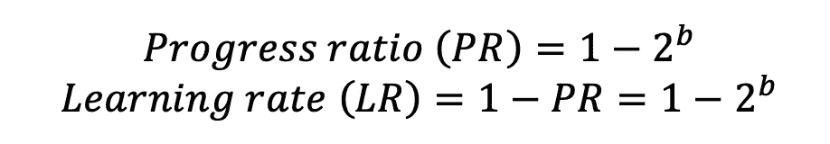

显示学习率和进步率之间关系的方程。图片作者。

基于学习曲线效应，可再生能源技术进入良性循环。例如，太阳能光伏发电的部署增加，以满足一个地区不断增长的电力需求。随着部署的增加，由于大规模生产，即规模经济、技术改进、效率提高和供应链中的竞争，安装的单位成本直线下降。因此，太阳能光伏在市场上变得更具成本竞争力，这反过来又进一步增加了需求。

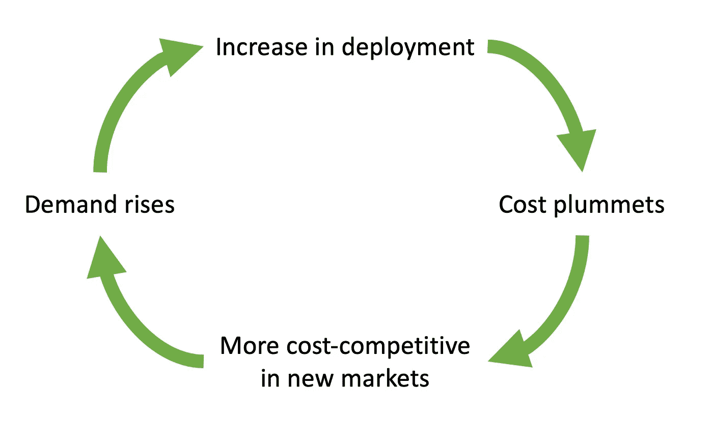

随着累计安装量的增加，可再生能源技术变得更加便宜，并进入良性循环。图片作者。

根据 VRE 技术公司的资本成本和累计投资数据，2010 年至 2020 年间，太阳能光伏发电的学习率为 33%，而陆上风能的学习率为 18%。这意味着，装机容量每翻一番，太阳能光伏发电的单位资本成本平均下降 33%，陆上风能平均下降 18%。

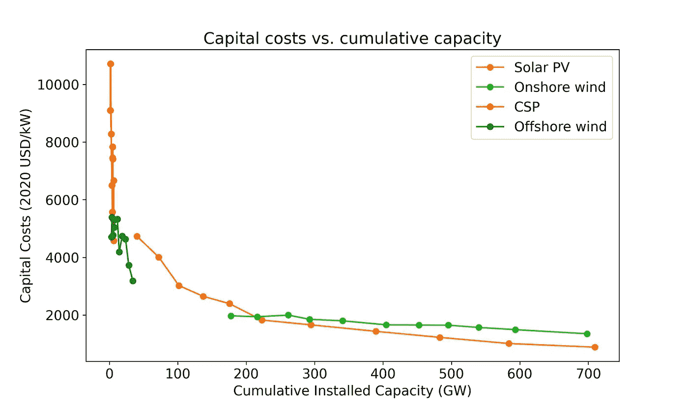

2010 年至 2020 年太阳能光伏和陆上风能的资本成本和累计装机容量。图片作者。

在所有 VRE 技术中，太阳能光伏发电的学习率最高(33%)，其次是 CSP (25%)、陆上风能(17%)和海上风能(10%)。当两个变量都以对数标度绘制时，从线的陡度可以明显看出这一点。

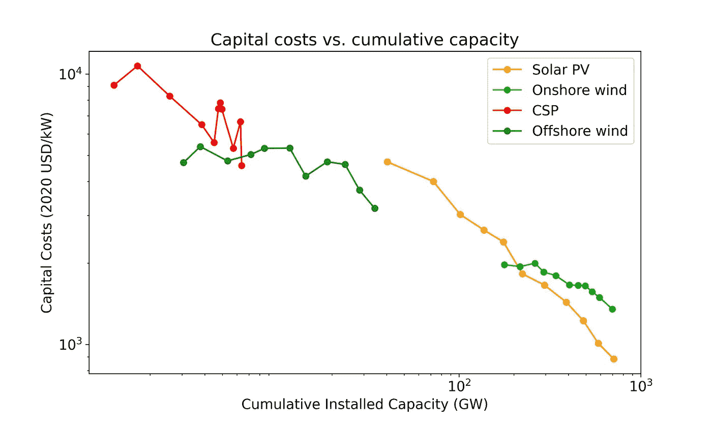

如果 2010 年至 2020 年太阳能光伏的学习率仅为 10%，资本成本将从 2010 年的 4731 美元/千瓦降至 2020 年的 3055 美元/千瓦。如果学习率为 40%，资本成本将在 2020 年进一步下降到 567 美元/千瓦。这在下面的图中得到了证明。

2010 年至 2020 年不同学习率下太阳能光伏的资本成本预测。图片作者。

## 结论

世界传统电力市场由化石燃料技术主导。今天，可再生能源技术，特别是 VRE，在世界上大多数国家都比化石燃料便宜。在过去十年中，太阳能和风能发电的大规模部署导致了电力系统和电力市场的范式转变。VRE 和其他可再生能源技术的部署是如何改变择优次序和发电边际成本的，在这个[故事](/merit-order-and-marginal-abatement-cost-curve-in-python-fe9f77358777)中有所呈现。

在这篇文章中，我从全球的角度讨论了可再生能源和 VRE 的趋势。我进一步讨论了学习曲线的概念，为什么可再生能源技术遵循学习曲线，以及该曲线如何引导技术进入成本下降和部署增加的良性循环。本文中用于分析的笔记本和数据可以在这个 [GitHub 资源库](https://github.com/hbshrestha/Data_Analytics)中获得。感谢您的阅读！

## 参考

国际原子能机构，2021 年 a。可再生能源的趋势。【irena.org】统计时间序列

IRENA，2021b。[2020 年可再生能源发电成本(irena.org)](https://www.irena.org/publications/2021/Jun/Renewable-Power-Costs-in-2020)

OWID，2020。为什么可再生能源如此迅速地变得如此便宜？—我们的数据世界