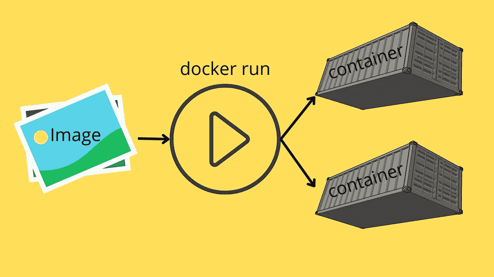
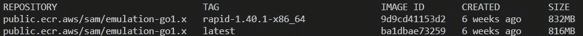
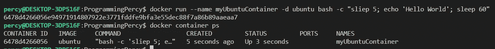
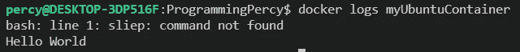
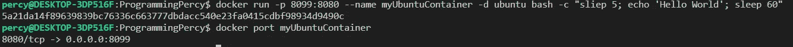
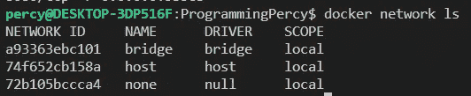
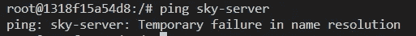
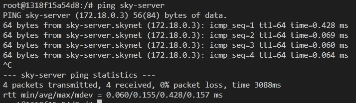
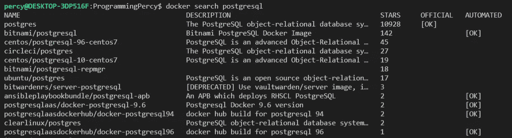
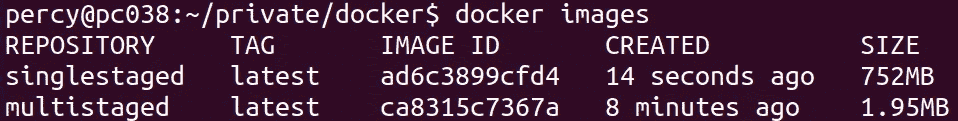

# 学习 Docker，简单的方法

> 原文：<https://towardsdatascience.com/learning-docker-the-easy-way-52b7bdec5e86>

## 一个教程，涵盖了 Docker 的基础知识，并教你如何容器化你的应用程序


凯利·西克玛在 [Unsplash](https://unsplash.com/?utm_source=unsplash&utm_medium=referral&utm_content=creditCopyText) 上的照片

Docker 已经接管了软件行业，成为事实上的标准。我想我们大多数人都同意这一点。

Docker 不仅让开发人员的生活变得更加轻松，也让运营人员和普通用户的生活变得更加轻松。几年前，安装一个软件可能会很麻烦，安装和设置数据库等东西需要几个小时。今天，它就像在 Docker 桌面上点击开始或使用 Docker CLI 运行一行命令一样简单。

这篇文章是关于如何使用 Docker 和学习入门基础的教程。

教程的 YouTube 视频

## 什么是 Docker

Docker 用于构建可发布的映像，这些映像可以在任何安装了 docker 的系统上发布和执行。这可以通过容器化软件来实现，容器化软件是一套拥有运行所需一切的软件。

任何拥有这种容器化软件的人都可以运行它。想象一下，你在一台 Ubuntu 机器上安装 PostgreSQL 并配置它工作，这需要时间，但有了 docker，你可以将安装和操作系统容器化，下次你需要它时，只需启动它。

Docker 映像不是虚拟机，而是软件的自包含单元，该自包含单元包含它需要运行的一切。当我说一切时，我指的是一切，操作系统、依赖项、网络、配置。

如果你正在寻找关于它如何工作的更深入的解释，我推荐阅读官方的 [docker docs](https://www.docker.com/resources/what-container) 以了解细节。

> 需要我说 docker 在 Go 中编码吗？

## 安装 Docker

通过访问他们的下载网站下载并安装 docker 引擎。Docker-desktop 现在可用于所有平台，可以作为学习和维护 Docker 引擎的一个非常好的途径。

[](https://docs.docker.com/engine/install/)  

如果您使用的是 Linux，不要忘记运行

```
curl -fsSL https://download.docker.com/linux/ubuntu/gpg | sudo gpg --dearmor -o /usr/share/keyrings/docker-archive-keyring.gpg 
```

这将下载 docker 加密密钥，并将其添加为可信来源。

如果您使用的是 Linux，您还需要将您的用户添加到 docker 组中，这样您就可以在没有 sudo 的情况下运行 docker。

```
sudo groupadd docker
sudo usermod -aG docker $USER
```

## 图像和容器



图像充当一个模板，一旦运行就变成一个容器

所有 docker 用法都以`Image`开头。您的映像是包含运行操作系统和其他依赖项所需的一切的盒子。把它想象成一个盒子，里面装满了启动这个盒子所需的所有文件。

> *Docker 容器映像是一个轻量级的、独立的、可执行的软件包，包括运行应用程序所需的一切:代码、运行时、系统工具、系统库和设置。*

在 docker 中，我们经常会谈到两种类型的[图像](https://docs.docker.com/develop/develop-images/baseimages/)。

*   **基础图像** —每个图像的开始，称为`scratch`的图像，这是一个没有任何内容的图像，大小为 0 字节。
*   **父映像** —创建映像时，我们定义一个父映像作为起点，父映像中的所有内容都将出现在新映像中。

图像是用`docker build`命令在 docker 中构建的。构建映像时，您需要指定一个`tag`，它通常与版本、使用的系统架构或父映像相关。我们还需要给它一个名字，名字和标签，用`:`分开。

一个示例构建命令如下所示

```
docker build -t myImage:1.0 .
```

最后，这个点不是一个错别字，构建图像时给出的最后一个参数是[上下文](https://docs.docker.com/engine/context/working-with-contexts/)。稍后将详细介绍上下文。

您可以使用 Docker CLI 工具查看您有哪些图像。

```
docker images
```



docker 图像的输出

如您所见，您将看到位于您机器上的所有当前图像。您将看到图像来自的`repository`，而`tag`是版本标签。`Image id`是一个自动生成的 ID，可以用来指代某个图像。它的创建日期和整个图像的总大小也会显示出来。

docker 使用该映像将其运行到一个`container`中。每当我们使用`docker run`启动一个容器时，它就会使用`image`并将它转换成一个容器。容器是一个开始的图像。

把映像想象成蓝图，它有运行所需的软件，当你启动一个映像时，它会根据这个蓝图构建一个容器。

或者如果你熟悉 OOP，图像可以被认为是一个类，而容器是一个对象。

这意味着您可以从同一个映像运行许多容器。理解从同一个映像运行的两个容器是完全独立的是很重要的。如果我们有一个称为基础的映像，并且我们从基础启动两个容器，我们在容器 A 中所做的更改不会反映在容器 b 中。在容器中所做的任何更改也不会反映在映像中。

使用`docker run`命令启动容器。Run 获取图像并将其转换为容器。

请记住，容器是图像的实例，但是容器中的任何更改都不会保存到图像中。

然而，Docker 的一个优点是，如果我们从一个干净的 Ubuntu 映像启动一个容器，并添加我们想要的软件和文件，我们可以使用`docker commit`将该容器保存为映像。

简单地说，我们有用于构建图像的`docker build`，我们有从图像创建容器的`docker run`，以及从容器创建图像的`docker commit`。

这使我们能够创建高度定制的映像，满足成功运行软件的所有需求。

DockerHub 是一个图片存储库，任何组织或开发者都可以在这里发布他们的图片。Docker 会自动使用 dockerhub 来查找任何你试图使用，但本地没有的图片。

## 运行和管理容器


使用 docker CLI 管理容器

让我们运行一个容器来学习它。

使用`docker run`命令运行 docker。如果您执行它，您会看到它打印出一个非常易于使用的语法。

```
docker run [OPTIONS] IMAGENAME:TAG [COMMAND] [ARGS]
```

其中`OPTIONS`是行为标志，改变如何运行容器。Imagename 和 Tag 只是要使用的名称和标记。

`COMMAND`是我们希望在容器启动后传递给它的任何命令，后面跟有任何`ARGS`。

让我们运行一个 Ubuntu 容器，让它打印出当前工作目录中的所有文件。如果你没有安装 Ubuntu 容器也不用担心，当试图运行一个不存在的容器时，docker 会自动查看 DockerHub 并为你下载。

```
docker run ubuntu ls -al
```

在命令中我没有指定使用什么标签，它会自动使用特殊标签`latest`，这是最近上传的同名图片。

如果您运行这个命令两次，您会看到第一次它下载图像需要几秒钟，第二次它会立即运行。

现在，我们已经创建了两个容器来打印目录内容，我们可以使用`ps`命令找到容器。我们将添加`a`标志来列出所有容器，否则，只列出正在运行的容器。

```
docker container ps -a
```

你应该看看那里的集装箱。你现在可以使用他们的 ID 删除他们。

```
docker container rm $ID
```

使用容器 ID 很麻烦，而且很长，我通常用`--name`来运行我的容器，它允许你为你的容器创建一个自定义名称。该名称可用于在其他命令中引用 docker，例如如果您想要删除它。

```
docker run --name test ubuntu ls
docker container rm test
```

在处理运行中的容器时，还有一些其他标志可以派上用场。

`--rm`将确保在流程结束后移除容器

`-it`用交互式外壳运行。

请记住，如果你运行没有`--rm`的`docker run`，你不会删除容器，这将占用你的硬盘空间。

尝试打开一个 ubuntu shell，然后退出并重新列出你的容器，它应该已经被删除了。当调试为什么软件不能如预期的那样工作时，使用交互式 shell 是非常有用的。

```
docker run --rm -it ubuntu
```

当然，我们可以让 docker 容器运行很长时间，我们可以使用`-d`标志让容器在一个分离的进程中运行。当你有一个运行你的软件的 docker 时，这是很常见的。

您可以很容易地尝试所有这些，只需执行以下命令。在这个例子中，我们希望在 bash 中运行不止一个内部命令，所以我们没有简单地将 sleep 直接传递给 docker，而是使用`bash -c`插入多个命令来顺序运行。每个命令由`;`分隔。

```
docker run --name myUbuntuContainer -d ubuntu bash -c "sliep 5; echo 'Hello World'; sleep 60"
```

现在你应该明白这个命令是做什么的了，但是为了好玩，它会从 ubuntu 映像创建一个名为`myUbuntuContainer`的容器，在后台运行(分离`-d`)，然后依次执行`-c`中的命令。注意，我没有使用`--rm`,所以这个容器不会在执行完成后自行移除。

您可以通过运行`docker ps -a`列出所有现有的容器。



使用 ps 显示正在运行的 docker 容器

输出向您显示用于引用容器的容器 ID，例如，如果您想要删除容器，但是您也可以使用名称。`ps`还显示了哪些端口从容器暴露给主机，目前没有。

如果您想查看分离的容器中发生了什么，您可以通过运行。当您想要排除故障或了解容器不工作的原因时，这很有用。

```
docker logs $CONTAINERID/NAME
```



docker 日志向我们显示了一个错误

请注意，我们记录了一个错误，在第一个`sleep`命令中有一个打字错误。让我们移除这个容器，这样它就不会占用额外的空间，是的，留下一个容器会占用和图片一样多的空间。

我们可以使用`docker container rm`后跟容器 ID 或名称来删除容器。注意如果你的容器还在运行，你必须通过`-f`标志来强制移除它。

```
docker container rm myUbuntuContainer
```

运行 docker 的一个重要方面是限制某个容器允许使用的资源数量，比如内存和 CPU。您可以使用以下标志添加这些资源。

`--memory` —使用它来设置允许的最大内存量，等等`--memory=6m` (6 兆字节是一个容器的最小值)

`--cpus` —用于限制容器允许使用多少 CPU 资源等`--cpus=1`。

您可以使用`inspect`来验证容器的任何配置。尝试启动一个容器并设置内存限制，然后检查它

```
docker inspect ID/Name
```

## 容器中的网络


Docker 中的联网和连接容器

默认情况下，您的容器在私有网络中运行。您可以让容器在同一个网络中运行，或者将它们隔离开来。

最常见的事情之一是从容器中公开端口。

您可以轻松地将`publish`标志添加到`docker run`命令中。简写标志为`-p`，接受主机端口和容器端口以`:`分隔链接。

假设您在容器的端口`8080`上托管了一个 API，但是想要在运行端口`8099`上的容器的主机上公开该 API。

您可以通过运行以下命令来实现这一点

```
docker run -p 8099:8080 --name myUbuntuContainer -d ubuntu bash -c "sleep 5; echo 'Hello World'; sleep 60"
```

您可以使用`docker container ps`或`docker port $CONTAINERID`查看暴露的端口。



docker port 显示暴露的端口

注意 docker 将默认为 TCP，您可以通过在端口后添加`/tcp`或`/udp`来指定协议。

另一件很酷的事情是，你可以让 docker 动态地为你分配主机端口。如果您将主机部分排除在`-p`标志之外，它将找到任何可用的端口并使用该端口。

尝试一下，只指定`-p 8080`看看它为你选择了什么端口。

Docker 还允许我们创建虚拟网络，以帮助我们拥有能够连接的容器。

您可以使用`docker network ls`查看所有当前的虚拟网络。你会看到至少三个网络。

如果你不想隔离，可以使用`host`网络，它将运行与运行容器的主机相同的网络。如果您完全不想要网络，则使用`none`。



默认存在的 Docker 网络

您可以使用以下命令创建新的虚拟网络

```
docker network create skynet
```

一旦你创建了它，当运行容器时，我们可以使用`--net`标志告诉容器在这个网络中运行。

为了测试这一点，我们将打开两个容器，并将它们分配给`skynet`，看看我们是否能相互 ping 通。然而，我们需要将`ping`安装到 ubuntu 容器中，并且**你不应该在容器**中这样做。
我们只是安装 ping 软件来展示网络。我们将在本文后面的构建容器时研究如何做到这一点。

> 在构建映像时，始终安装依赖项

让我们从启动第一个容器并准备它开始，我们将这个第一个容器命名为`sky-client`。

```
docker run --rm -it --net skynet --name sky-client ubuntu
root@134f1245a32:/# apt-get update; apt-get install iputils-ping
```

安装 ping 后，尝试对`sky-server`执行 ping。您应该会看到一条错误消息，指出这在 DNS 中不存在。



找不到天空服务器

我们可以解决这个问题，打开第二个终端，启动第二个名为`sky-server`的容器。注意我们如何使用容器名在网络上定位它们。

```
docker run --rm -it --net skynet --name sky-server ubuntu
```

一旦 sky-server 开始运行，再次尝试从`sky-client`ping 它。



使用容器名称 using 同一网络上正在运行的容器

太好了，我们现在有两个容器运行在同一个虚拟网络上。需要记住的一点是，在同一个容器中可以有多个网络。

## 卷

有时您希望在主机和容器之间共享数据。例如，当您有一个在容器中运行的数据库，并且希望该数据库在重新启动之间保持不变时，通常就是这种情况。

您可以使用`-v`标志在容器和主机之间添加卷。同样，与网络端口一样，您可以指定主机上的路径，然后指定容器上的路径来装载。路径用`:`划分，大部分时间用 docker。

让我们试着打开一个容器，与主机共享一个文件夹。请记住始终使用主机上的完整路径。

```
docker run --rm -ti -v /home/percy/sharedfolder:/shared --name sharing-is-caring ubuntu
```

该命令将在我的主机上的`/home/percy/sharedfolder`处创建一个文件夹，该文件夹连接到容器上的`/shared`文件夹。

尝试在该文件夹中创建一两个文件，看看能否在您的主机上查看它们。

您还可以使用`--volumes-from`标志在容器之间安装文件夹。如果您有需要跨多个容器共享的数据，这将非常有用。

```
# Start container with mount
docker run --rm -ti --net skynet --name sky-client -v $PWD/data:/shared ubuntu
# Start the second container with same mounts
docker run --rm -ti --net skynet --name sky-server --volumes-from sky-client ubuntu
```

## 注册

注册表用于管理和分发图像。有一个默认使用的官方 docker 注册表，但是你也可以设置你的公司注册表。

您可以使用`docker search`在注册表中搜索图像。如果你对某个软件感兴趣，你可以随时搜索是否有它的图片。假设您想运行一个 PostgreSQL 容器。



docker 搜索显示许多图像

请注意，您会发现许多图像，因为任何人都可以在官方注册表上上传图像。在决定使用哪张图片时，你应该看看官方标签和星星的数量。

由于任何人都可以创建并上传图像，因此在选择图像时可能会有风险。

如果你想要一个 UI，你可以通过访问 [Docker Hub](https://hub.docker.com/) 来查看官方注册表。在 Hub 中，您通常可以找到关于如何使用该映像的自述文件。

您可以将注册表视为代码存储库。

## 构建定制的图像

自定义图片有两种方式，第一种是使用`docker commit`，将容器保存为新图片。第二种方法是使用 Dockerfiles，我们很快就会了解更多。

让我们首先看看如何使用 Docker commit 来轻松地保存一个包含从容器中进行的任何更改的图像。还记得之前我们在容器中下载 Ping 吗？这不能保存，也不是正确的方法，但是如果我们测试了它，并且知道这个容器是正确的，我们想把它保存为一个图像，我们可以提交这个容器。

打开一个新的 Ubuntu 容器，再次安装 Iputils-ping。

```
docker run -it --name test ubuntu
apt-get update -y; apt-get -y install iputils-ping
```

完成后，退出 shell 并打开主机上的终端。

Docker commit 接受几个选项，我喜欢添加`--message`，这是一个更改的提交消息。我也喜欢添加`--author`，这样其他开发人员就知道该联系谁了。

语法是

```
docker commit [OPTIONS] [ContainerName/ID] [repository/name:tag]
```

因此，让我们提交包含我们需要的软件的容器。

```
docker commit --message "added iputils" --author programmingpercy test programmingpercy/ubuntu:1.0
```

现在，您应该能够从这个映像开始运行一个新的容器了。

```
docker run -it --name test2 programmingpercy/ubuntu:1.0
```

到目前为止，我们已经使用了预定义的图像，但还没有触及 Docker 最漂亮的部分。我们可以使用`Dockerfiles`创建定制的图像。Dockerfile 是一个包含脚本语言的文件，我们可以用它来创建和制作我们的图像。

Docker 文件应该被命名为`dockerfile`，这允许 docker 在你执行目录中的 docker 时自动检测文件。

docker 文件非常容易阅读和理解，它们从上到下连续运行。有一点需要记住，docker 文件中的每一行都是对`docker run`和`docker commit`的执行。这被称为`layer`，有时你可以将动作组合成一行以节省空间。

我们如何创建一个包含预装 FFmpeg 的自定义 ubuntu 映像的例子如下所示。

> FFMPEG 是一个用于修改和处理视频和音频流的工具

Dockerfile —用于运行 FFMPEG 的定制 he

语法非常简单，我们现在只讨论基本内容。

在第 1 行您可以看到`FROM`，它表示我们的构建过程将从其开始的父节点`image`。因此，在这种情况下，它将使用`ubuntu`图像作为启动容器，将 ubuntu 作为一个容器运行，应用并提交更改。如果你想要一个特定的版本，你可以在分号后添加标签，所以如果你想要 ubuntu 20.10 等等，添加标签`FROM ubuntu:20.10`。

下一行使用`RUN`命令，这将用当前层启动一个容器并执行该命令。所以在第 3 行，我们将启动一个基于`ubuntu`的容器，并更新 apt-get 存储库。这将被提交到一个新的临时映像中。

这个新的临时图像将用于第 4 行，下载 FFmpeg 并将其添加到容器中，然后将容器保存为图像。

现在你可能开始想知道为什么它重建图像的每一步作为一个层，这是超级有效的，没有什么可担心的。如果层在以后没有以任何方式被引用，它将在使用后被删除。主要的好处是 docker 将缓存这些层，并在构建中重用它们。所以，如果你修改了某个东西，你不必等待所有的东西都重新构建。

在第 5 行中，您可以看到 docker 的一个很酷的特性。`CMD`允许我们在映像中指定容器运行时将执行的可执行文件。这允许我们说，当有人运行这个图像时，执行`FFmpeg`。所以，我们刚才做的就是把 FFmpeg 打包成 docker 镜像，可以在任何支持 docker、windows、mac 等的电脑上运行。

在你尝试之前，我们需要建立图像。我们只在 dockerfile 文件中定义了如何构建它。

为了构建图像，我们使用`docker build`命令。我们将传入一个标记标志`-t`,为我们的图像指定一个名称。我们还会用一个`.`来结束命令，这个点会让很多人感到困惑，所以试着跟着做。

docker build 命令的最后一个参数是构建上下文。它是 docker 在构建映像时应该使用的位置的路径。一个`.`命令告诉 docker 使用当前目录，这是最常见的方法，但是理论上您可以通过指定路径在另一个位置构建这个映像。为什么，你可能会想，因为有时你想让本地文件从你的计算机出现在图像中，我们还没有谈到这一点，但你可以包括文件从主机到 docker 图像。

```
docker build -t demo/ffmpeg .
```

运行构建命令并等待它完成，这可能需要一些时间，这也是我选择 FFmpeg 的原因。不是让你厌烦，而是向你展示缓存机制。

在构建期间，您将看到所有构建的层，并在最终图像完成之前移除这些层。第一次构建需要一些时间，但是我建议您在之后尝试运行相同的命令。您应该看到图层被缓存，构建时间是真实的，即时的。

你现在可以用`docker run`命令运行你的令人惊叹的 FFmpeg 图像，在任何你想要的地方执行 FFmpeg。

```
docker run demo/ffmpeg
```

docker 文件还有许多其他的 docker 语句。
一个很常见的是`ADD`语句。这允许您在主机(构建映像的主机)上指定要复制到映像中的文件夹或文件。

语法非常简单，您指定主机上的路径，然后是映像上的路径。

```
ÀDD mycomputer/myfile.txt /path/in/image
```

`ADD`也接受 URL，所以你可以告诉 docker 从一个 URL 获取一个文件并把它放在图像中。

另一个重要的声明是`ENV`，它是环境变量的缩写

```
ENV DATABASE_USER = "my user"
```

现在，我们的图像中有一个小缺陷。我们使用了`CMD`语句来触发 FFmpeg，它可以工作，但是它不允许我们向 FFmpeg 中添加更多我们需要的参数。

是时候阐明`CMD`语句和`ENTRYPOINT`语句之间的区别了。

`CMD`用于指定一个完整的命令在容器运行时使用。`ENTRYPOINT`相反指定一个命令运行的开始。

因此，为了允许用户使用我们的 FFmpeg 图像，但是修改 FFmpeg 参数，我们需要将`CMD`改为`ENTRYPOINT`。请尝试执行更改，然后重新运行容器。现在，您还可以在 run 命令中添加某些 FFmpeg 参数。

Dockerfile —使用入口点允许 FFmpeg 的子参数

重建图像现在应该允许用户添加输入文件等和更多的`docker run demo/ffmpeg -inputfile`等。

让我们尝试添加文件，我们将使用前面提到的`ADD`命令来获取演示视频。我们将从一个网址获取演示视频，所以我们可以尝试转换视频。我们将把文件存储在`/videos`图像里面。

> 我建议不要在图像中存储视频，这只是为了展示它是如何工作的。

在下面的要点中，我还修改了所有的运行命令到一个层中，这是一个常用的技术，通过将相关的层分组到相同的层中来节省一些空间。`&&`是 bash for AND，`\`只是一个不破坏命令的新行。

Dockerfile —我们将 URL 中的文件添加到/videos 中

接下来，我们将重建图像，然后执行 FFmpeg 来加速视频，然后输出到一个挂载的文件夹中。

使用 mount 运行容器，并在演示文件中使用 FFmpeg。

执行该命令后，您应该能够在您的主机上查看视频的加速版本。

这里列出了 Dockerfiles 中最常用的命令。

*   **运行** —用于在终端执行命令。对于 Linux，它是 Bash，对于 windows，它是 cmd。
*   **ENV** —用于在容器内部分配环境变量。
*   **标签** —用于向容器添加元数据。来自父图像的标签被继承。
*   **复制** —将文件从主机复制到容器。只能从主机复制文件。
*   **添加**——非常类似于 COPY，它也将文件复制到我们的容器中。不同之处在于，ADD 还可以通过 URL 使用远程文件。它还可以将本地焦油提取到容器中。
*   **ARG** —可以由构建映像的人在构建时设置的变量。在构建过程中，可以在 docker 文件中使用 ARGS，但是在构建映像之后，除非重新构建映像，否则不能使用或更改它们。
*   **卷** —在主机和容器之间添加一个挂载点。语法是卷路径。这通常在容器重启之间持久化数据时使用，例如数据库。实际数据存储在主机上，但在容器中使用。
*   **EXPOSE** —告诉 Docker 引擎容器正在监听特定的端口和协议。格式是端口/协议(UDP/TCP)
*   **CMD** —定义 Docker 容器在启动时应该运行的命令和参数。这通常指向带有一组缺省值的二进制文件。当允许用户更改命令时，应该使用 CMD。
*   **入口点** —通常在容器应该作为可执行文件运行时使用。它的功能与 CMD 相同，但是如果使用 ENTRYPOINT，用户不允许更改该命令。
*   **WORKDIR** —设置命令运行的路径。所以如果设置为/app，就像运行 cd /app 一样。

## 多阶段构建

在 docker 文件中，您可以做更多的事情。有一件事需要你自己去研究，那就是如何使用多重构建来大量减少 docker 图像的大小。使用多阶段构建，您可以将图像的大小减少 90%以上。我见过大小在 1GB 左右的图像变成几 MB。

多阶段允许我们使用映像来构建我们的软件，然后将它们作为最终产品移动到一个更加精简的映像中。

我通常用它在 Ubuntu 映像上构建我的 Go 软件，然后将它转移到一个只包含我的单个二进制文件的暂存容器中。

通过在 Dockerfile 文件中添加多个`FROM`语句，多阶段构建是可能的，我们可以使用`AS`为每个`FROM`指定一个特定的名称。这是很常见的看到建立阶段命名为`builder`等。

```
FROM ubuntu AS builder
```

通过命名一个构建阶段，我们可以稍后使用带有`--from`参数的`COPY`来引用该构建阶段的文件系统。

dockerfile —我们本质上要做的是在一个成熟的操作系统中构建，然后将构建好的二进制文件转移到一个精简的操作系统中。

为了查看多阶段构建和正常构建之间的差异，我们将构建两个图像并进行比较。首先，我们需要构建一些东西，并更新 dockerfile 文件来构建二进制文件。

这是一个简单的 Go 程序，它只是打印一条消息，如果你没有安装 Go，不要担心，我们将在 Docker 镜像中构建它，记得吗？

将下面的要点复制到与 dockerfile 目录相同的名为`main.go`的文件中。

main.go —打印消息的简单程序

现在让我们更新`dockerfile`，首先将`main.go`从主机复制到镜像中，然后构建二进制文件。

然后，我们将把这个二进制文件复制到一个暂存映像中。

dockerfile —在运行映像上构建二进制文件，然后进入临时映像

通过执行常规的 Build 命令来构建映像。

```
docker build -t multistaged .
```

执行`docker images`查看最终图像，我的最后是 1.95 MB 大小，超级小。这是因为映像中唯一的东西是我们的二进制文件，没有其他东西会使映像膨胀。

您甚至可以尝试执行图像来验证它是否工作。

```
docker run multistaged
```

那么，为什么我们要经历这一切，而不是一个单一的构建，让我们来比较图像。

您可以使用 docker build 的`--target`选项在某个构建步骤停止多阶段构建。这将允许我们运行第一个构建阶段并从中创建一个映像，我们传递我们的阶段的名称，`builder`。

```
docker build --target builder -t singlestaged .
```

完成后，您可以运行`docker images`来比较大小。

太棒了，对吧？



多阶段与单阶段构建

## 编排容器

现在很容易想象，当我们开始使用 docker 时，它进展很快，我们可以很容易地建立一个数据库、Redis 等。如果您构建一个依赖于这些容器的系统，我们需要编排它们。

编排系统用于在容器出现故障时启动和重启容器，管理资源，并允许容器发现彼此。

有许多编排服务，最容易上手的是`docker-compose`，它通常用于帮助开发人员以一种非常简单的方式运行多个容器。Docker-compose 经常被用在开发阶段，使得在本地测试和运行一切变得容易。docker-compose 不适合更广泛部署的原因是它仅限于在单台计算机上运行。

对于生产环境，使用 [Kubernetes](https://kubernetes.io/) 更为常见。Kubernetes 在本地硬件上使用，也很容易部署到使用托管服务的云提供商。

推荐学习 Kubernetes，如果你想入门，我有一篇文章你可以看看。

  

## 结论

在本教程中，您已经学习了图像和容器，这是 Docker 的两个关键组件。

我们已经学习了如何创建图像，以及如何使用 Dockerfiles 编写图像规范。

我们已经了解了如何在容器之间配置网络。

我们学习了如何在主机和容器之间以及容器之间装载卷。

我希望您已经掌握了足够的基础知识，能够独立使用 Docker。

在我的项目中，我几乎总是保存一个打包软件的 dockerfile 文件。我还建议添加一个 docker-compose 文件，它将启动任何相关的所需服务。例如，如果您开发一个使用数据库的 API，拥有一个启动 API 和数据库的 compose 是非常有用的。它帮助其他开发人员快速启动并运行，并减少安装数据库或保持开发实例运行的需要。

作为一名开发人员，Docker 确实改变了我的生活，让我的生活变得更加轻松。

我希望你喜欢这个教程，我很乐意听到你对这个教程的想法、反馈或意见。