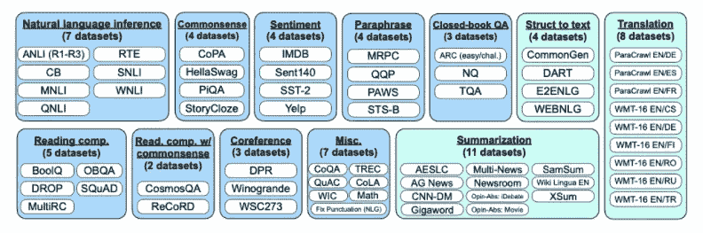
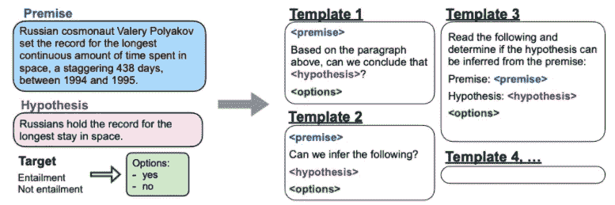
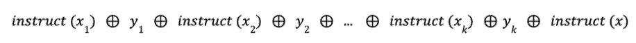
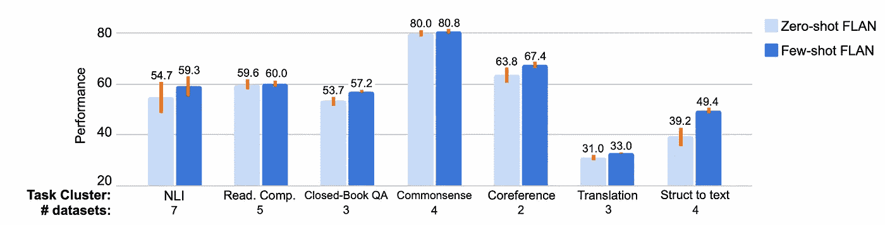

# 了解 GPT-3 教学模型(很可能)是如何训练的

> 原文：<https://towardsdatascience.com/learning-how-gpt-3-instruct-models-were-most-likely-trained-3eb61e0f4169>

斯文·布兰德斯马在 [Unsplash](https://unsplash.com/s/photos/word?utm_source=unsplash&utm_medium=referral&utm_content=creditCopyText) 上的照片

**【更新**:2022 年 1 月 27 日，Open AI 发表了一篇名为*排列语言模型以遵循指令*的论文，其中他们解释了他们真正用来训练 InstructGPT 的方法。你可以在这里找到论文。]

几个月前，OpenAI 发布了他们位于 GPT 的指令模型的测试版。Open AI 声称，指令模型可以像人类一样理解你的指令，并且它们仍然拥有与其他 GPT-3 基础模型相同的能力。

这一进步为设计和工程师带来了更多创新提示的可能性。你可以告诉模型你的任务是什么，你想得到的结果是什么，模型会尽力理解你的指令并完成它们。

在 [Flowrite](https://www.flowrite.com/) ，我们每天都在使用 GPT-3 模型，所以我们没有等待一秒钟，就开始广泛测试这些指令模型。

  

我们对这些指导模型是如何工作的有了一个坚实的直觉，但是 Open AI 从未发表过关于指导模型如何被训练的论文或文章，所以这个问题仍然是未知的。幸运的是，谷歌研究团队在 2021 年 12 月就同一主题发表了一篇[论文](https://arxiv.org/pdf/2109.01652.pdf)，该论文揭示了基于 transformer 的模型如何被微调以理解指令。

让我们看看这篇文章中最重要的方面，这将帮助我们理解如何微调大型语言模型，以便它们能够处理指令提示。

# 微调模型是零射击学习者

正如您可能已经发现的那样，本文围绕大型语言模型执行零触发任务的能力以及指令调优如何提高这些模型的零触发能力展开。

> 零射击学习(ZSL)是机器学习中的一个问题设置，在测试时，学习者观察训练中没有观察到的来自班级的样本，并需要预测它们所属的班级。— [维基百科](https://en.wikipedia.org/wiki/Zero-shot_learning)

大规模的语言模型，如 GPT-3，具有巨大的少量学习能力，但在零次学习中表现较差。在几项任务(阅读理解、质量保证和 NGI)中，GPT-3 零发成绩比少发成绩差得多。在零镜头设置中，提示没有少量镜头/上下文中的示例，模型可能很难表现良好，这可能是因为它们无法找到与预训练数据的相似性。

**指令调优**被描述为微调预训练语言模型(LM)的任务，以提高其响应自然语言指令的能力。这个想法是，通过使用监督来教 LM 执行通过指令描述的任务，它将学会遵循指令，甚至对看不见的任务也这样做。

作者的指令在通过自然语言指令模板表达的 60 个 NLP 数据集上微调了 137B 参数预训练语言模型。由此产生的微调模型被称为 FLAN，正如我们将要看到的，它是在看不见的任务类型上进行评估的，这些任务类型显示了在其他机器学习设置中(例如，少量学习)相对于其他语言模型在许多任务中的性能改善。

## 数据集

对于教学微调，谷歌研究团队必须将超过 60 个 NLP 数据集的混合物转换为教学格式。这些数据集在 [TensorFlow 数据集](https://www.tensorflow.org/datasets?hl=es-419)中公开。

用于指令微调的公开可用数据集。数据集被转换成教学格式，并按任务聚集成簇。——图来自[微调过的模特是零起点的学习者](https://arxiv.org/pdf/2109.01652.pdf)由[谷歌研究团队](https://research.google/research-areas/natural-language-processing/)

作者根据任务将数据集聚集成簇:常识、自然语言推理(NLI)、情感等。然后，对于每个数据集，他们创建了 10 个描述任务的独特的指令提示模板。为了增加数据的多样性，10 个模板中有 3 个指示模型改变任务。例如情感分类→生成一条情感正面的影评。

最后，通过随机选择特定于每个数据集的指令提示模板，对每个数据集进行格式化。

在下图中，作者说明了如何创建指令提示来构建用于指令微调的数据集:

描述自然语言推理任务的多个指令模板——图来自[微调模型是零射击学习者](https://arxiv.org/pdf/2109.01652.pdf)由[谷歌研究团队](https://research.google/research-areas/natural-language-processing/)

## 估价

作者感兴趣的是评估 FLAN 如何执行在指令调优期间没有看到的任务，因此有必要清楚地定义什么算作看不见的任务。

如果在指令调优期间没有看到来自 *D* 所属的任何任务集群的数据集，他们在评估时定义了一个看不见的数据集 *D* 。例如，让我们假设 *D* 是一个包含任务，那么该包含集群被忽略用于指令调整，并且只使用所有其他集群。

作者将数据集分组到任务簇中，并支持评估簇，同时指示对所有剩余簇进行调优。通过这种方式，他们确保果馅饼是在看不见的任务上被评估的。

## 带选项的分类

FLAN 是一种专用于解码器的语言模型(如 GPT ),针对不同的任务进行指令调整，因此，它会将完成的内容返回给输入文本。

分类任务的输出空间是特定于当前问题的几个唯一类之一。例如，如果我们使用仅解码器语言模型执行二元分类(“是”或“否”)，我们需要记住，该模型仍在生成文本，并且大量不同的回答“是”的方式可能会降低分配给标记“是”的概率质量。

正如作者所述，在表达相同答案的备选方案中具有不期望分布的答案的概率质量使得一些方法如*等级分类*(考虑 2 个输出，并且 2 个输出之间最可能的是预测)不完美。

为了解决分类任务中的这个潜在问题，作者提出了**选项后缀**。Options 后缀是一个附加到分类任务末尾的标记，附带一个唯一输出类的列表，因此模型被限制为仅响应其中一个类。

## 培养

模型架构是一个密集的从左到右，只有 137B 参数的解码器转换器语言模型。该模型在网络文档、对话数据等方面被预先训练。使用 [SentencePiece](https://github.com/google/sentencepiece) 库，该文本被标记为 2.49T 的 32k 词汇量的 BPE 标记。此外，作者在预训练数据集中包括了大约 10%的非英语文本。

得到的预训练模型被称为基本 LM，因此 FLAN 是基本 LM 的指令调整版本。

对于指令微调，作者建立了管道来混合所有数据集，并从其中随机采样。

## 结果

在自然语言推理、阅读理解、闭卷问答、翻译、常识推理、共指消解和结构转文本方面对 FLAN 进行了评估。

以下是结果的简要总结。更多细节可以在[原文](https://arxiv.org/pdf/2109.01652.pdf)中找到。

*   在 25 个任务中，零发子弹的 FLAN 在 20 个任务中超过了零发子弹的 GPT-3，甚至在 10 个任务中超过了 GPT-3 的少发子弹性能
*   指令调优显著提高了大多数任务的基本 LM。

作者表示，总的来说，指令调优对于由人类自然表述为指令的任务(NLI、QA、翻译、结构到文本)更有效，而对于可以直接表述为语言建模的任务(常识推理和指代消解任务，格式为完成不完整的句子或段落)，该模型则不太有效。这背后的直觉是，在后一种情况下，指令可能被认为是多余的，因此，它们不会添加太多信息。

## 消融研究——包含少量实例的说明

该论文的作者介绍了一些消融研究。其中最有趣的一个研究了指令调优的能力，在提示中的推断时间提供了一些例子。

他们在零投提示的基础上建立了一个少投学习提示，如下所示:

对于输入 *x* 和输出 *y，*让*指令(x)* 表示零炮指令。给定 *k* 少量拍摄的例子:

和一个新的输入 *x* ，少拍提示的指令格式定义为

其中指令由输入填充，并通过中间的分隔符标记与输出连接。

提示中提供的示例的最大数量限制为 16 个，这些示例是从训练集中随机抽取的。

零注果馅饼对少注果馅饼。橙色条表示模板之间的标准偏差，是每个聚类在数据集级别的平均值——来自[微调模型的数字是零射击学习者](https://arxiv.org/pdf/2109.01652.pdf)来自[谷歌研究团队](https://research.google/research-areas/natural-language-processing/)

可以看出，与零镜头设置相比，在提示中添加少量镜头的例子提高了 FLAN 在所有任务中的性能。在复杂的任务中，如结构到文本或 QA，这些改进更大。这实际上是有意义的，因为这些任务的输出空间更大，上下文中的示例有助于模型更好地理解输出格式，因此在零触发设置中比 FLAN 执行得更好。

# 摘要

在这篇文章中，我试图总结谷歌研究团队[的论文](https://research.google/research-areas/natural-language-processing/)[中最重要的概念。](https://arxiv.org/pdf/2109.01652.pdf)

如果您听说过 GPT-3 指令模型，但不知道这些模型是如何训练的，我希望这篇摘要和本文能让您对指令调整及其好处有一个良好的直觉。

由于开放人工智能没有发表关于指令模型的论文，我们不能完全肯定 GPT-3 指令模型是按照这里介绍的完全相同的程序训练的，但很可能他们采用了非常相似的技术。

[**如果你想在 LinkedIn 上和我联系，就给我发个纸条！:)**](https://www.linkedin.com/in/bernardo-garc%C3%ADa-del-r%C3%ADo-b4a98873/)

# 参考

1.  微调过的语言模型都是零命中率的学习者——[贾森·魏](https://arxiv.org/search/cs?searchtype=author&query=Wei%2C+J)、[马腾·博斯马](https://arxiv.org/search/cs?searchtype=author&query=Bosma%2C+M)、[文森特·y·赵](https://arxiv.org/search/cs?searchtype=author&query=Zhao%2C+V+Y)、[凯尔文·古](https://arxiv.org/search/cs?searchtype=author&query=Guu%2C+K)、[亚当斯·禹卫](https://arxiv.org/search/cs?searchtype=author&query=Yu%2C+A+W)、[布莱恩·莱斯特](https://arxiv.org/search/cs?searchtype=author&query=Lester%2C+B)、[杜南](https://arxiv.org/search/cs?searchtype=author&query=Du%2C+N)、[安德鲁·m·戴](https://arxiv.org/search/cs?searchtype=author&query=Dai%2C+A+M)、[郭诉勒](https://arxiv.org/search/cs?searchtype=author&query=Le%2C+Q+V)
2.  开放 AI API 文档—[https://beta.openai.com/docs/engines/instruct-series-beta](https://beta.openai.com/docs/engines/instruct-series-beta)