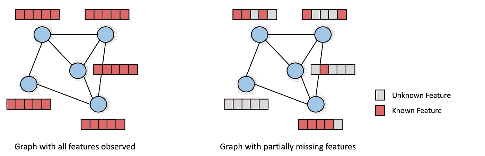
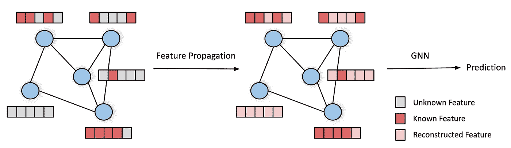
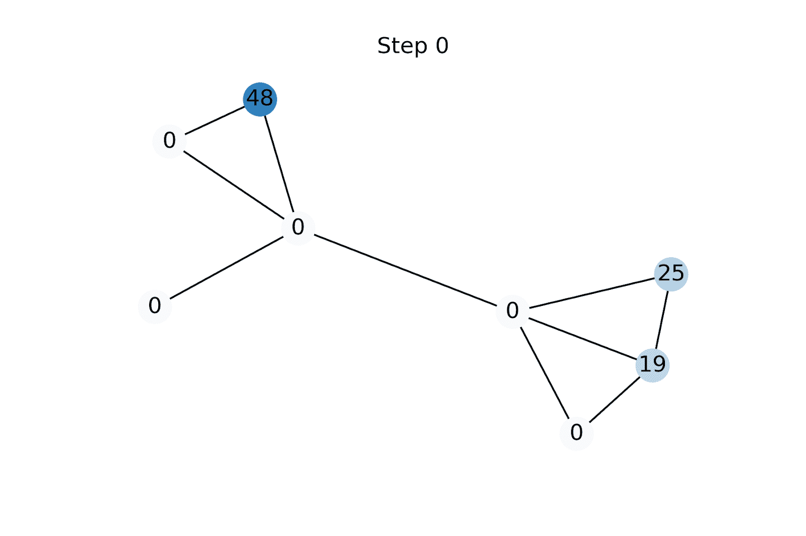
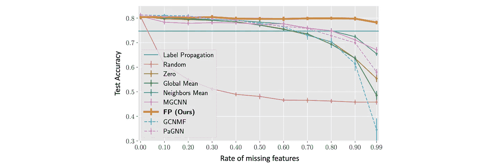
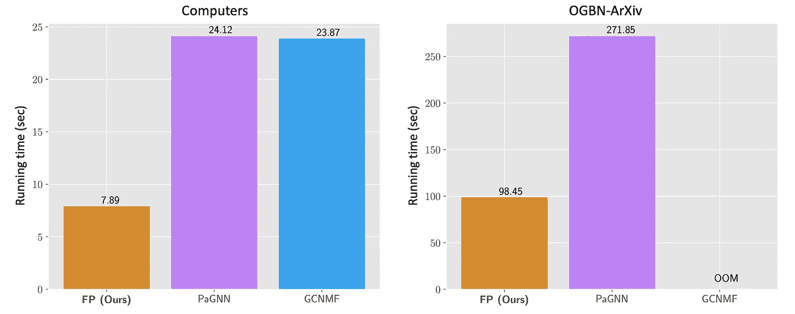
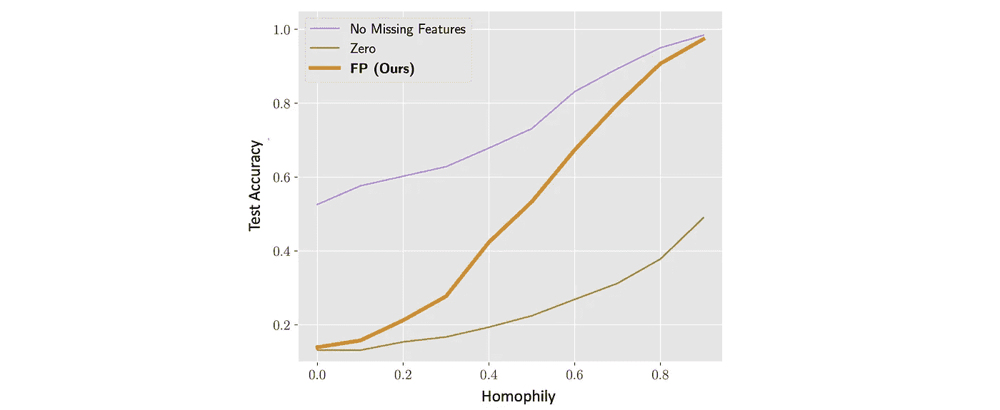

# 对于在缺少节点特征的图上学习来说，特征传播是一种简单且令人惊讶地高效的解决方案

> 原文：<https://towardsdatascience.com/learning-on-graphs-with-missing-features-dd34be61b06>

## **数据不完整的图形 ML**

## **大多数图形神经网络通常在所有节点可用的全套特征的假设下运行。在现实场景中，功能通常只是部分可用(例如，在社交网络中，年龄和性别只能为一小部分用户所知)。我们表明，特征传播是一种有效的和可扩展的方法，用于处理图形机器学习应用中的缺失特征，尽管它很简单，但工作得非常好。**

大多数图形神经网络期望作为输入的图形具有每个节点的完整特征向量(左)。更常见的真实场景是只有部分功能可用(右图)。

*本文与* [*伊曼纽·罗西*](https://emanuelerossi.co.uk/) *合著。*

G raph 神经网络(GNN)模型通常为每个节点假设一个完整的特征向量。以两层 GCN 模型[1]为例，它具有以下形式:

**z**=**a**σ(**axw**₁)**w**₂

该模型的两个输入是编码图结构的(标准化)邻接矩阵 **A** 和包含作为行的节点特征向量的特征矩阵 **X** ，并输出节点嵌入 **Z** 。GCN 的每一层执行节点式特征变换(由可学习矩阵 **W** ₁和 **W** ₂参数化),然后将变换后的特征向量传播到邻居节点。重要的是，GCN 假设*观察到了 **X** 中的所有条目*。

在现实世界的场景中，我们经常会看到一些节点特性可能缺失的情况。例如年龄、性别等人口统计信息。仅可用于一小部分社交网络用户，而内容特征通常仅呈现给最活跃的用户。在联合购买网络中，并非所有产品都有完整的描述。这种情况变得更加严重，因为随着对数字隐私的认识不断提高，只有在用户明确同意的情况下，数据才越来越可用。

在所有上述情况下，特征矩阵具有缺失值，并且大多数现有的 GNN 模型不能被直接应用。最近的几项工作导出了能够处理缺失特征的 GNNs 模型(例如[2–3])，然而，这些模型在高缺失特征率(> 90%)的情况下受到影响，并且不能扩展到具有超过几百万条边的图。

在与 Maria Gorinova、Ben Chamberlain (Twitter)、Henry Kenlay 和 Xiaowen Dong (Oxford)共同撰写的一篇新论文[4]中，我们提出了特征传播(FP) [4]作为这个问题的一个简单而有效的解决方案。简而言之，FP 通过传播图上的已知特征来重构缺失的特征。然后，可以将重构的特征输入任何 GNN，以解决下游任务，例如节点分类或链路预测。

特征传播框架。输入是一个缺少结点要素的图表(左侧)。在初始步骤中，特征传播通过迭代扩散图中的已知特征来重建缺失的特征(中间)。随后，该图和重构的节点特征被输入到下游的 GNN 模型，该模型然后产生预测(右)。

传播步骤非常简单:首先，用任意值初始化未知特征[5]。通过应用(标准化的)邻接矩阵来传播特征，然后将已知特征重置为其基础真值。我们重复这两个操作，直到特征向量收敛[6]。

特征传播是在缺失特征的图上学习的一种简单而惊人强大的方法。特征的每个坐标被单独处理( **x** 表示 **X** 的一列)。

FP 可以从数据*同质性*(“平滑度”)的假设中导出，即，邻居趋向于具有相似的特征向量。可以使用*狄利克雷能量*来量化同质性的水平，狄利克雷能量是一种二次形式，用于测量节点的特征与其邻居的平均值之间的平方差。狄利克雷能量的梯度流[7]是图热扩散方程，已知特征用作边界条件。FP 是通过使用单位步长的显式前向欧拉方案对该扩散方程进行离散化而获得的[8]。

动画展示了应用更多特征传播迭代时标量节点特征的演变示例。未知特征被初始化为零，但是迅速收敛到使给定图形上的狄利克雷能量最小化的值。

特征传播与标签传播(LP) [9]相似。然而，关键区别在于 LP 是一种*特性不可知的*方法，它通过传播图中的已知标签来直接预测每个节点的类别。另一方面，FP 用于首先重建丢失的节点特征，然后将这些特征馈送到下游的 GNN。这使得 FP 能够利用观察到的特性，并在我们实验的所有基准测试中超过 LP。此外，在实践中，带有标签的节点集和带有特征的节点集不一定完全重叠，因此这两种方法并不总是直接可比的。

我们使用七个标准节点分类基准对 FP 进行了广泛的实验验证，其中我们随机移除了可变分数的节点特征(独立于每个通道)。在重构特征上，FP 后接 2 层 GCN 明显优于简单基线以及最新的最先进方法[2–3]。

FP 在特征丢失率高(> 90%)的情况下表现尤为突出，而在这种情况下，所有其他方法都会受到影响。例如，即使丢失了 99%的特征，当所有特征都存在时，与相同的模型相比，FP 平均只损失大约 4%的相对精度。

Cora 数据集上不同缺失率(从 0%是大多数 gnn 的标准状态到 99%的极端情况)下的节点分类精度。

FP 的另一个关键特性是它的可伸缩性。虽然竞争方法不能扩展到几百万边的图，但是 FP 可以扩展到十亿边的图。我们用了不到一个小时的时间在我们的内部 Twitter 图表上运行它，使用一台机器有大约 10 亿个节点和 100 亿条边。

FP+GCN 的运行时间(以秒为单位)以及最新的最新方法 GCNMF 和 PAG nn[2–3]。FP+GCN 比其他两种方法快 3 倍。GCNMF 在 OGBN-Arxiv 上内存不足(OOM)，而 GCNMF 和 PaGNN 在 OGBN-Products 上内存不足(约 123M 边)，其中 FP 的重建部分(不训练下游模型)只需约 10s。

FP 目前的一个局限是它不能很好地处理异向图，即邻居往往具有不同特征的图。这并不奇怪，因为 FP 是从同伦假设(借助于扩散方程中狄利克雷能量的最小化)中导出的。此外，FP 假设不同的特征通道是不相关的，这在现实生活中很少发生。用替代的更复杂的扩散机制来适应这两种限制是可能的。

当 99%的特征缺失时，具有不同程度的同嗜性(0 表示极端异嗜性，1 表示极端同嗜性)的合成图上的节点分类精度。虽然在高同质性设置中，FP 的性能几乎与具有全部特征的情况一样好，但是在低同质性设置中，两者之间的差距是显著的，并且 FP 的性能劣化为简单基线的性能，在简单基线中，缺失的特征用零代替。

尽管缺失节点特征的图在现实应用中无处不在，但在缺失节点特征的图上获取是一个几乎未被探索的研究领域。我们相信，我们的特征传播模型是提高在具有缺失节点特征的图上学习的能力的重要一步。它也提出了关于在这种环境中学习的理论能力的深刻问题，作为关于信号和图形结构的假设的函数。FP 的简单性和可扩展性，以及与更复杂的方法相比惊人的好结果，即使在极度缺失特征的情况下，也使其成为大规模工业应用的良好候选。

[1] T. Kipf 和 M. Welling，[带图卷积网络的半监督分类](https://arxiv.org/abs/1609.02907) (2017)，ICLR。

[2] H. Taguchi 等人，[包含缺失特征的图的图卷积网络](https://arxiv.org/abs/2007.04583) (2020)，未来一代计算机系统。

[3] X .陈等.[属性缺失图的学习](https://arxiv.org/abs/2011.01623) (2020)，arXiv:2011.01623

[4] E. Rossi 等人，[关于在具有缺失节点特征的图上学习的特征传播的不合理有效性](https://arxiv.org/abs/2111.12128) (2021)，arXiv:2111.12128

[5]我们证明了该算法收敛于相同的解，而不管未知值的初始化。然而，不同的初始化可能导致收敛所需的不同迭代次数。在我们的实验中，我们将未知值初始化为零。

[6]我们发现约 40 次迭代足以在我们实验的所有数据集上收敛。

【7】一个*梯度流*可以看作是变分问题中梯度下降的连续类比。它源于泛函的最优性条件(变分法中称为[欧拉-拉格朗日方程](https://en.wikipedia.org/wiki/Euler%E2%80%93Lagrange_equation))。

[8] B. Chamberlain 等人， [GRAND: Graph 神经扩散](https://arxiv.org/abs/2106.10934) (2021)，ICML。另见[附带的博文](/graph-neural-networks-as-neural-diffusion-pdes-8571b8c0c774?sk=cf541fa43f94587bfa81454a98533e00)。

[9] X. Zhu 和 Z. Ghahramani，【利用标签传播从有标签和无标签数据中学习】 (2002)，技术报告。

我们非常感谢 Henry Kenlay 和 Davide Eynard 对这篇文章的校对。关于图形深度学习的其他文章，请参见《走向数据科学》中迈克尔的 [*其他帖子*](https://towardsdatascience.com/graph-deep-learning/home) *，* [*订阅他的帖子*](https://michael-bronstein.medium.com/subscribe) *和* [*YouTube 频道*](https://www.youtube.com/c/MichaelBronsteinGDL) *，获取* [*中等会员资格*](https://michael-bronstein.medium.com/membership) *，或者关注* [*迈克尔*](https://twitter.com/mmbronstein)