# 使用监督方法学习电子商务中的产品相似性

> 原文：<https://towardsdatascience.com/learning-product-similarity-in-e-commerce-using-a-supervised-approach-525d734afd99>

## 利用深度学习寻找相似产品的实用解决方案。以产品为中心的方法。


斯科特·韦伯在 [Unsplash](https://unsplash.com/s/photos/deep-learning?utm_source=unsplash&utm_medium=referral&utm_content=creditCopyText) 上拍摄的照片

T 每个电子商务的主要组成部分是产品和与产品互动的消费者。在电子商务处理的许多用例中，有一些是以消费者为中心的，它们试图通过分析购买或查看产品的历史来了解消费者的行为，并向具有类似购买行为的消费者推荐类似的产品，以及以产品为中心的，如新产品的价格估计、需求预测、找到类似的产品等。本文的范围是研究以产品为中心的方法来学习产品相似性，目标是获得每个产品的低维向量表示。有了这样的数字表示，我们就可以应用某种相似性度量，如余弦相似性，并在不同产品之间建立相似性。我展示了两种构建低维产品表示的实用方法，首先使用 PyTorch 训练回归深度学习模型，然后通过提取包含产品标题的每个词的嵌入权重或提取包含所有产品属性的完整向量来构建这样的表示。每种方法都有优点和缺点，本文也将讨论这些优点和缺点。

电商公司发布的文章数量显示，构建产品相似度解决方案确实是一项非常重要的工作: [Price2Spy](https://medium.com/gobeyond-ai/product-matching-via-machine-learning-abstract-8b5de637114b) ， [EDITED](/unravelling-product-matching-with-ai-1a6ef7bd8614) ， [Walmart](https://medium.com/walmartglobaltech/product-matching-in-ecommerce-4f19b6aebaca) ， [Webinterpret](https://tech.webinterpret.com/approach-and-techniques-used-to-build-a-product-similarity-catalog/) 。一些科学论文也讨论了这个主题:

*   [根据属性在电子商务网站中查找相似产品](http://ceur-ws.org/Vol-1378/AMW_2015_paper_10.pdf)
*   [产品匹配和分类的机器学习方法](http://www.heikopaulheim.com/docs/swj2018_product_data.pdf)
*   [基于 BERT 的产品匹配相似性学习](https://aclanthology.org/2020.ecomnlp-1.7.pdf)

产品之间相似性的定义是领域和用例特定的，例如:给定两只阿迪达斯的鞋子。在 0-1 的范围内，相似度是多少？

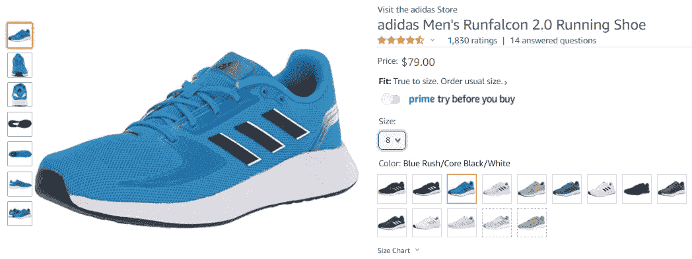

截图自 Amazon.com

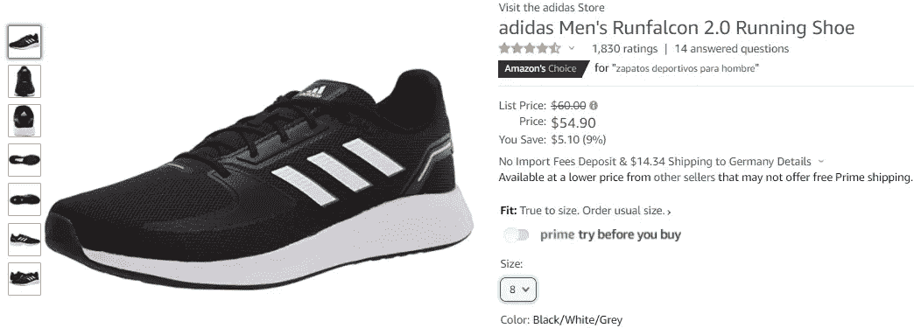

截图自 Amazon.com

答案是:视情况而定。如果只比较产品名称，产品完全相似。如果我们引入颜色属性，相似性仍然很高，但不是 1，可能是 0.95 或 0.9，我们不知道确切的数字。比较同色不同码的鞋子怎么样？我们看到价格现在发生了变化。

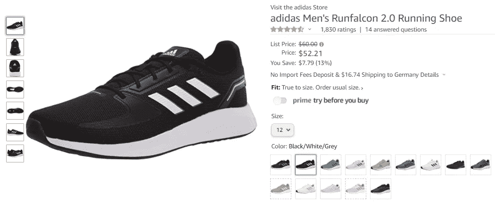

截图自 Amazon.com

这个例子表明相似性取决于所选择的产品属性。基于产品属性估计产品相似度的可能解决方案有哪些？

*   我们可以训练一个关于标题的 [word2vec](https://radimrehurek.com/gensim/models/word2vec.html) 或 [BERT](https://arxiv.org/abs/1810.04805) 模型，或者使用预训练的嵌入来学习包含标题的单词的矢量表示，或者使用 [doc2vec](https://radimrehurek.com/gensim/models/doc2vec.html) 模型学习完整标题的矢量表示——然而，这些模型可能无法很好地表示简短的产品标题、拼写错误的标题或非常专业的单词、特定领域的缩写，或者用英语以外的语言编写的标题。
*   我们可以应用产品的图像相似性，并将它们与标题的矢量表示相结合。但是产品的图像可能丢失或者质量不足以训练图像相似性模型。
*   我们可以对由不同属性、图像嵌入和标题嵌入构建的产品表示进行聚类——缺点包括可伸缩性问题、难以建立最佳数量的聚类，以及需要在一个聚类内执行额外的相似性比较。
*   最后但同样重要的是，我们可以使用基于深度学习的监督方法(分类或回归),其中在损失最小化期间学习产品向量表示。我们必须回答的唯一问题是我们的最小化任务是什么。其中一个候选可以是价格估计或需求预测。在这种情况下，模型可以了解哪些产品在价格方面彼此更相似(在价格估计的情况下)，或者哪些产品在销售方面彼此更相似(在需求预测的情况下)。这种方法的优点很多:( 1)它不需要对包括产品标题和其他文本信息在内的产品属性进行特殊处理和复杂的预处理;( 2)它解决了主监督任务并并行生成产品向量表示;( 3)然后可以通过更新关于类似产品的知识来改进主监督任务。

我遵循监督方法，并在来自 [Kaggle Mercari 价格建议挑战赛](https://www.kaggle.com/c/mercari-price-suggestion-challenge)的数据上进行演示，该挑战赛的任务是自动向在线卖家建议产品价格:

> [日本最大的社区购物应用 Mercari](https://www.mercari.com/) ，想要为卖家提供定价建议，但这很难，因为他们的卖家可以在 Mercari 的市场上出售任何东西，或任何一捆东西。

Mercari 数据集包含大约 150 万种产品，并包含以下各列:

*   ***名称*** —卖方提供的产品名称。
*   ***item _ condition _ id***—卖方提供的物品的五个条件(1，2…5)
*   ***category _ name***—每个产品的类别列表的三个级别，如男士/上衣/t 恤、女士/珠宝/项链
*   ***brand_name*** —每个产品可能所属的对应品牌
*   ***运费*** — 1，如果运费由卖家支付，则为 0，否则为
*   ***item _ description***—产品描述(卖方可自由提供任何描述)
*   ***价格*** —目标变量，以美元表示

正如我们可以看到的，Mercari 数据包含所有类型的特征:数字、分类和文本，它们通常出现在电子商务数据中。我们在这里也有几个挑战:由于卖家可以自由提供关于产品的任何信息，产品描述可能完全是空的或拼错的。产品名称也可以用错别字书写，如下例所示。


作者图片

深度学习解决方案具有以下架构:

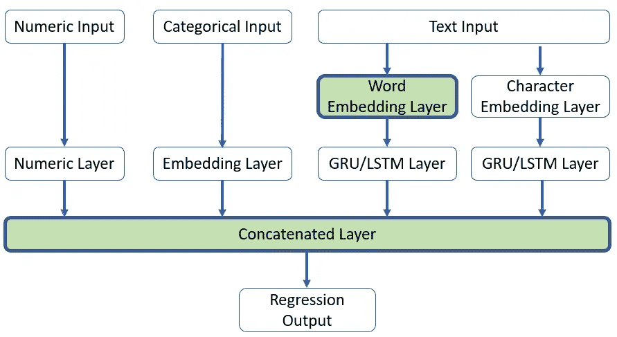

作者图片

输入由各种特征组成:数字、分类和文本。以 PoC 形式提供的代码在编写时考虑到了最大的灵活性。它允许定义属于上述三种类型之一的任何特征集。分类输入通过嵌入层转换到低维空间。文本输入(产品标题、产品描述)首先被令牌化为文字和字符，并通过嵌入层转换到低维空间。在字符级别上学习产品标题和描述可以增加拼写错误的产品或在文本输入中有轻微差异的产品的匹配。GRU/LSTM 层返回序列中最后一个单词或字符的隐藏状态。最后，所有图层输出被连接成一个密集图层，并且可以在顶层定义附加的密集或跳过连接图层。绿色突出显示的两个层在我们的下游任务中起着重要作用。

模型定型后，有两种方法可以提取产品表示:

**单词嵌入层**包含每个单词的嵌入。我们提取属于产品标题的每个单词表示，并对所有单词向量进行平均。得到的平均向量是产品名称的数字表示。构建了所有产品的向量表示后，我们可以应用类似余弦相似性的相似性度量来比较产品之间的相似程度。这种方法的优点是，在我们提取单词嵌入后，可以丢弃训练好的模型。这种方法的缺点是在训练中没有看到的标题词不会被表示出来。因此，没有代表性的产品标题的相似性是不可能测量的。另一个不利方面是对名称几乎相似但属于不同类别的产品的敏感性。由于产品名称是由单词嵌入层构成的，所以一个单词只有一种表示。

PyTorch 示例:假设我们已经将产品标题符号化为单词。字典中有 10 个单词，我们的单词向量表示有 4 个维度。

```
import torch
import torch.nn as nn
from sklearn.metrics.pairwise import cosine_similarity#size of the dictionary + 1 out of vocabulary token
word_embedding = **nn.Embedding**(10 + 1, 4, padding_idx = 0)#here we should have trained our model
#extract word representations#there are 4 products each having 3 words indexed by the vocabulary
#index 0 reserved for any out of vocabulary tokenproduct_words = torch.LongTensor([[1, 2, 3], 
                                  [3, 9, 8], 
                                  [4, 5, 7], 
                                  [1, 2, 4]
                                 ])
#average words per product
title_vectors = word_embedding(product_words).mean(axis = 1).detach().numpy()#compare similarity of the first product to all products
**cosine_similarity**(title_vectors[0].reshape(1,-1), title_vectors)
```

**串联层**是第一个密集层，它将各个数值、分类和文本层的输出串联起来。我们可以将这一层视为由所有类型的输入组成的产品表示。这样做的好处是，如果测试产品由单词嵌入层中不存在的单词组成，仍然有可能使用其他产品属性找到相似性。这种方法需要改变正向传播函数。我们返回最后一个输出图层和连接图层的结果，而不是返回回归结果(最后一个输出图层)。通过在训练和测试产品上应用该模型来执行单词表示的提取。

PyTorch 示例:假设我们已经将产品标题符号化为单词。字典中有 10 个单词，我们的单词向量表示有 4 个维度。此外，我们有一个分类输入，它有 4 个唯一值，我们希望将它们表示为一个三维嵌入向量。

首先，我们通过使用嵌入层和 LSTM 层来处理产品标题。

```
import torch
import torch.nn as nn**EMBEDDING_DIM** = 4#size of the dictionary + 1 out of vocabulary token
word_embedding = **nn.Embedding**(10+1, EMBEDDING_DIM, padding_idx = 0)#do we want to process text from left to right only or in both directions?
**BIDIRECTIONAL** = True
**HIDDEN_SIZE** = 5
**NUM_LAYERS** = 2
lstm = **nn.LSTM**(input_size=**EMBEDDING_DIM**, hidden_size=**HIDDEN_SIZE**, batch_first=True, num_layers = **NUM_LAYERS**, bidirectional = **BIDIRECTIONAL**)product_words = torch.LongTensor([[1, 2, 3], 
                                  [3, 9, 8]
                                 ])#apply lstm on embedded words
packed_output, (**hidden_state**, cell_state) = **lstm(word_embedding(product_words))**batch_size = hidden_state.shape[1]#extract last step from the hidden state
last_step = hidden_state.view(**NUM_LAYERS**, 2 if **BIDIRECTIONAL** else 1, batch_size, -1)
last_step = last_step[num_layers-1]
#reorder batch to come first
last_step = last_step.permute(1, 0, 2)
#flatten dimensions (B, HIDDEN_SIZE * 2 if BIDIRECTIONAL else 1)last_step = last_step.reshape(batch_size, -1)
last_step.shape
```

第二，我们通过嵌入层来处理分类输入

```
**EMBEDDING_DIM** = 3cat_embedding = **nn.Embedding**(4 + 1, **EMBEDDING_DIM**, padding_idx = 0)#indices of categorical values
batch_categories = torch.LongTensor([[1],
                                     [3]
                                 ])batch_size = batch_categories.shape[0]
cat_result = **cat_embedding(batch_categories)**
cat_result = cat_result.reshape(batch_size, -1)
cat_result.shape
```

最后，我们连接两个向量，形成我们的乘积表示向量:

```
#tensor dimensionality [batch_size, last_step.shape[1] + cat_result.shape[1]#this is our product representation
concatenated_layer = **torch.cat**([last_step, cat_result], dim = 1)
concatenated_layer.shape
```

## 关于 Kaggle Mercari 数据的培训

我从下面的 [Kaggle 笔记本](https://www.kaggle.com/code/tunguz/wordbatch-ftrl-fm-lgb-lbl-0-42506)中使用了一些方法来应用数据清理和特征工程。

我在模型中使用了以下数字特征:

*   **运费** — 1，运费由卖家支付，否则为 0
*   **desc _ 伦** —产品描述的字数
*   **name_len** —产品标题的字数
*   **is_brand_missing** —如果缺少品牌信息，则为 1，否则为 0
*   **is _ item _ description _ missing**—如果缺少产品描述，则为 1，否则为 0

分类特征:

*   **item_condition_id** —卖方提供的项目的五个条件(1，2…5)
*   **brand_name** —每个产品可能所属的相应品牌
*   **子类别 _1** 、**子类别 _2** 、**子类别 _3** —每种产品的三级类别列表

文本特征(单词和字符级别)

*   **名称** —产品名称
*   **项目 _ 描述** —产品描述

目标变量**价格**首先进行对数转换，然后使用 scikit-learn[power transformer](https://scikit-learn.org/stable/modules/generated/sklearn.preprocessing.PowerTransformer.html)进行转换

我将 Kaggle 提供的[训练集](https://www.kaggle.com/competitions/mercari-price-suggestion-challenge/data?select=train.tsv.7z)拆分为训练和验证，分配 20%的产品进行验证。最后，我对 1，185，328 个产品进行了 10 个时期的模型训练，并提前停止

模型参数总结如下:

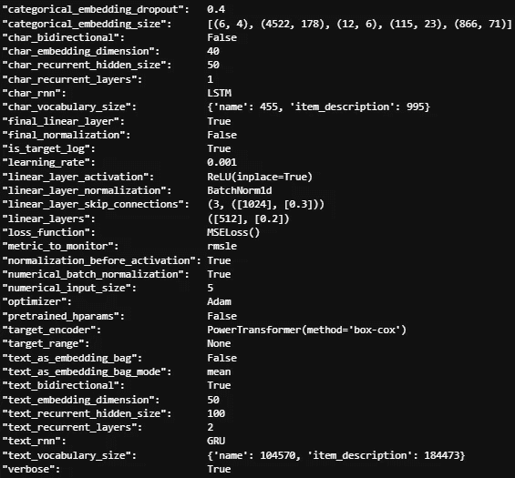

作者图片

由单词嵌入层构造的产品表示向量的维数为 50(*text _ Embedding _ dimension*)。从级联层构建的乘积表示向量具有 787 的维度，并且计算如下:

*   具有 4，178，6，23，71 → 282 的不同嵌入维数的 5 个分类特征(*分类嵌入大小*
*   5 个数字特征(*数字输入 _ 大小*)
*   2 基于单词的**双向**文本特征(*text _ recurrent _ hidden _ size*):
    2 *(100 * 2)→400
*   2 基于字符的**单向**文本特征(*char _ recurrent _ hidden _ size*):2 * 50→100

## 结果

**第一次比较:不存在于训练集中的产品**

该产品为“**speacker”**，卖方将其拼错。

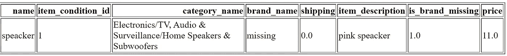

作者图片

在这种情况下，单词嵌入方法不起作用，因为模型没有将这个单词映射到词汇表中。级联层方法是可行的。

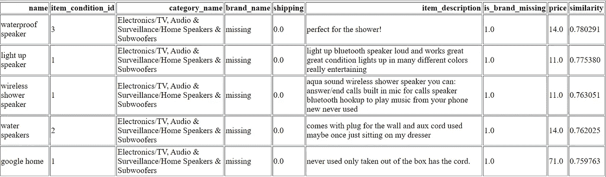

作者图片

前 4 个最相似的产品是与被搜索产品具有可比价格的扬声器。类别、品牌和运输具有相同的值。我猜第一个产品的相似度更高，因为它的产品描述比其他产品更短。如果像产品描述长度这样的特征在相似性比较过程中不太重要，我们可以创建两个连接层:一个用于相似性比较，另一个用于保存对建模重要但对下游任务中的相似性比较不重要的特征的输入。

**第二次比较:*快递波托菲诺上衣 m 码***

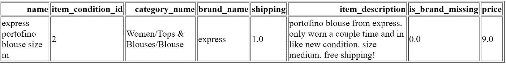

作者图片

Word 嵌入层的前 5 名同类产品:

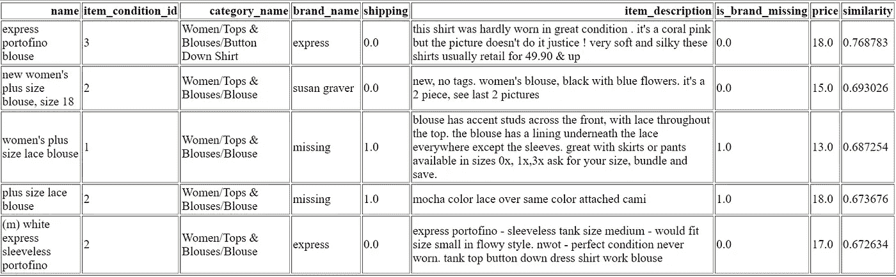

作者图片

最上面的产品与搜索的产品有相似的品牌。标题中也有三个常用词。

串联层的前 5 个类似产品:

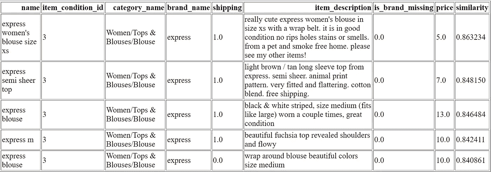

作者图片

虽然顶级产品在被搜索产品的标题内具有不同数量的常用词，但是所有产品都属于同一品牌。而且这些商品的价格也和搜索到的商品价格相当。

**第三次对比:*iphone 5c 16gb att GSM***

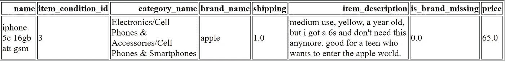

作者图片

Word 嵌入层的前 5 名同类产品:

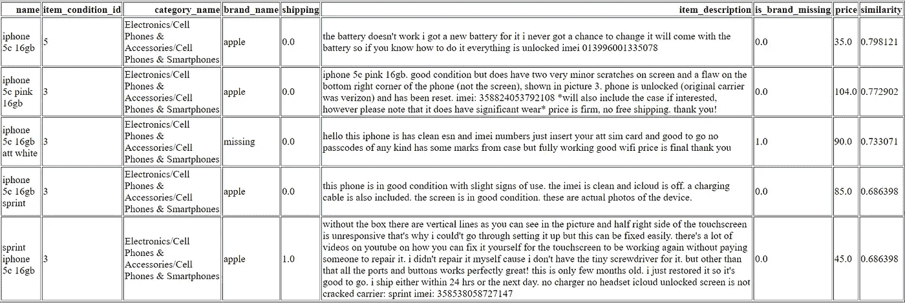

作者图片

这里的顶级相似产品在标题中有更多与搜索产品相同的词

串联层的前 5 个类似产品:

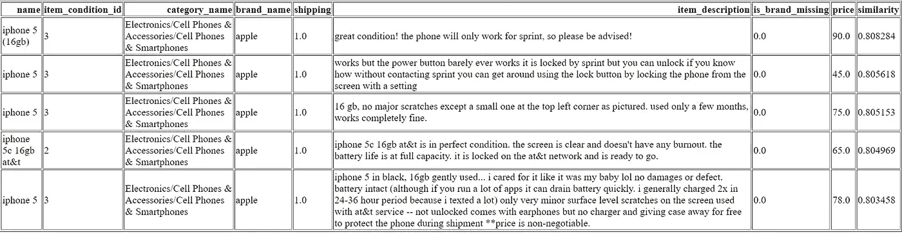

作者图片

搜索到的产品和第四个产品都提到了美国电话电报公司(att vs at&t)。他们两个价格一样。很难决定第四个产品是否与第一个产品更相似，但相似性差异不大(0.808 比 0.805)

## 结论

我在本文中提到的几个例子表明，两种产品相似性的方法非常有效。单词嵌入层有一个缺点，那就是由训练时不知道的全新单词组成的产品标题将不可能进行比较。另一方面，一旦从单词表示中重建了产品标题，就可以丢弃训练好的模型。在连接层方法中，需要模型来预测新产品和提取产品表示。无论采用何种方法，都需要对模型参数和领域专业知识进行适当的调整。在级联层方法中，需要决定哪些特性对于产品表示是重要的。附加的文本预处理或/和包含图像嵌入也可以提高相似性。

所提供的代码非常灵活，可以适应许多具有数值、分类和文本特征的表格数据集，用于回归任务。

完整代码可以从我的 [Github repo](https://github.com/slavakx/medium_posts/tree/master/product_similarity_pytorch) 下载

感谢阅读！