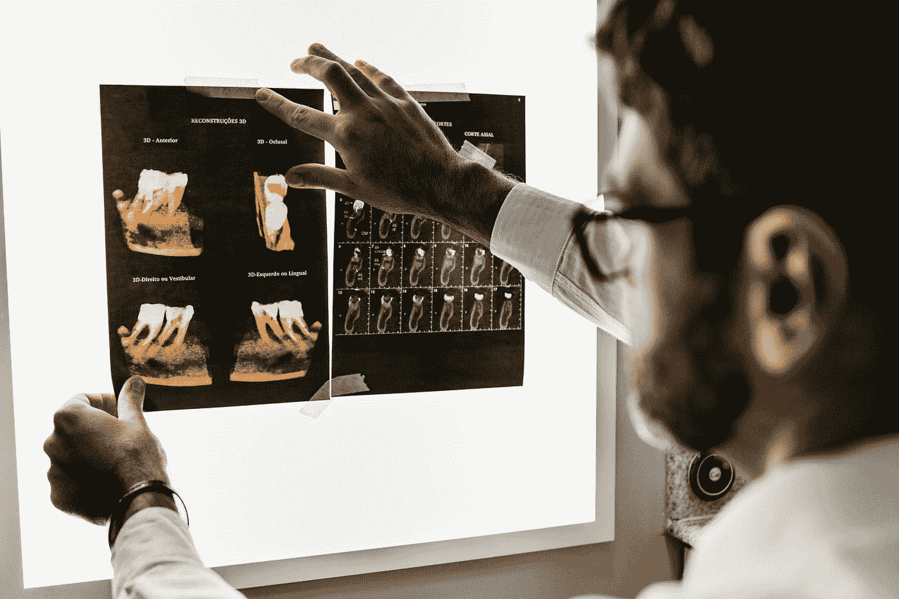
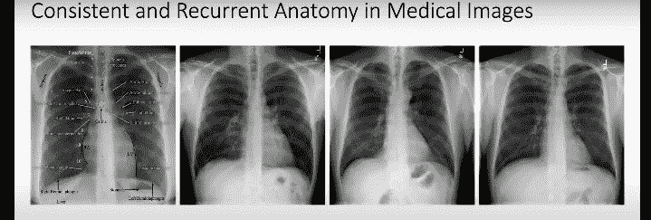
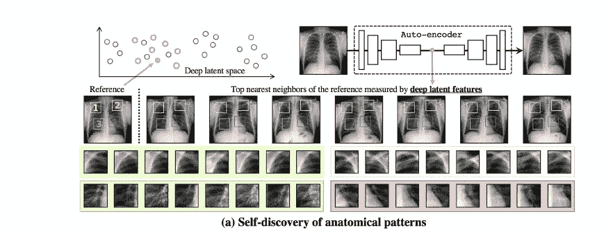
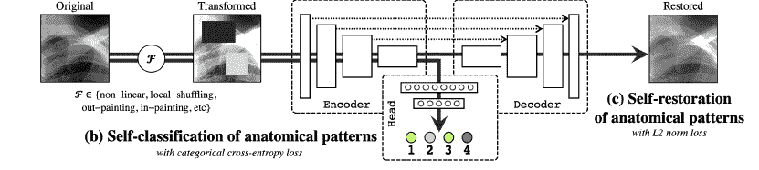
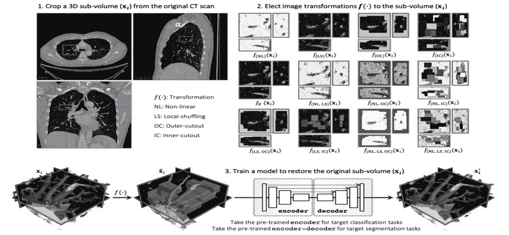
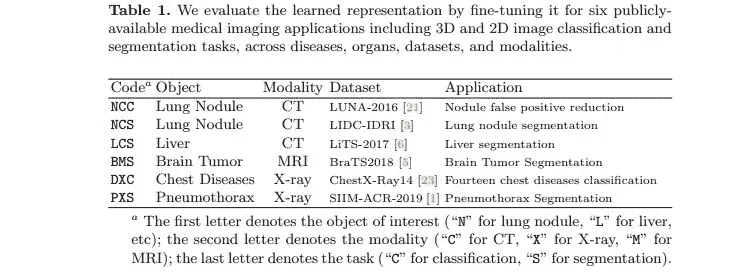
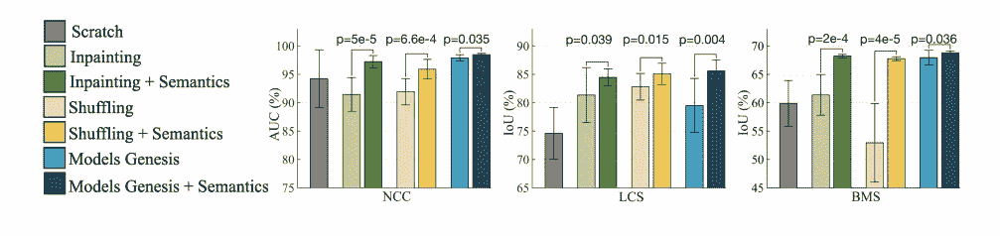
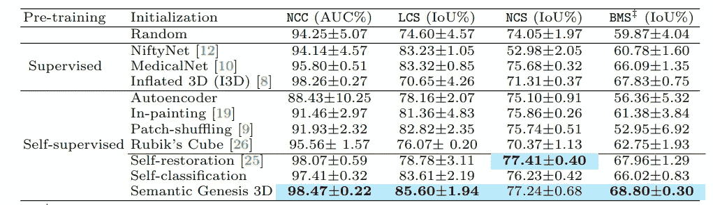
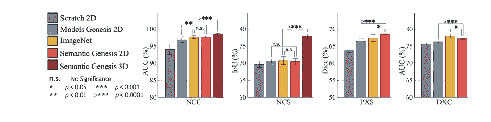

# 通过自我发现、自我分类和自我恢复学习语义丰富的表征:综述

> 原文：<https://towardsdatascience.com/learning-semantics-enriched-representation-via-self-discovery-self-classification-and-ec0b7a08e566>

## 使用新的迁移学习技术预训练深度学习模型，在稀缺的医学图像数据集上获得更好的结果

乔纳森·博尔巴在 [Unsplash](https://unsplash.com?utm_source=medium&utm_medium=referral) 上的照片

将机器学习和深度学习模型应用于医学成像任务的主要问题之一是**缺乏足够的数据**来训练模型。医学图像的手动生成和标记成本高且耗时，因为需要训练有素的专家来正确理解和标记医学图像。为了解决计算机视觉中缺乏数据的问题，通常使用迁移学习技术，例如预训练和微调，其中首先用另一个域(通常是有大量训练数据的域)中的数据训练模型，然后将这个预训练的模型微调到有少量标记数据的域。在大量未标记数据可用的情况下**通常使用自我监督学习**技术，利用训练数据中的有用信息对这些未标记图像的模型进行预训练。要了解更多关于自我监督学习与其他培训模式的不同之处，请参考这篇由 Louis Bouchard[撰写的](https://medium.com/u/f34bfe2bbaec?source=post_page-----ec0b7a08e566--------------------------------)[文章](https://medium.com/what-is-artificial-intelligence/what-is-self-supervised-learning-will-machines-be-able-to-learn-like-humans-d9160f40cdd1)。

任何**自监督**学习算法中的一个重要步骤是确定**学习信号**和**可用于模型训练的数据**的属性。当数据是图像时，诸如彩色化[1，2]，拼图[3，4]，旋转[5，6]和许多其他技术被用于从未标记的数据预训练模型。彩色化技术通常试图从图像的灰度对应物预测图像的颜色属性。拼图技术破坏图像并训练网络来恢复原始图像。旋转技术试图预测图像旋转。

尽管这些自监督技术对于自然图像工作得很好，但是，对于从医学数据集进行预训练来说，这些不是最佳的技术。医学数据具有**重复的解剖模式**，其也可被用作预训练模型的学习信号。这篇[论文](https://arxiv.org/pdf/2007.06959.pdfhttps://arxiv.org/pdf/2007.06959.pdf)【8】介绍了一种自我监督的预训练方法，该方法利用医学图像中的重复模式来学习更适合各种医学成像任务的预训练模型。图 1 显示了医学图像中循环模式的一个例子。

图一。医学图像中的循环模式。来源[链接](https://arxiv.org/pdf/2007.06959.pdf)。

本文[8]中利用循环解剖模式的自我监督技术介绍了三个步骤，即:相似患者中解剖模式的自我发现**、已学习解剖模式的自我分类****和转换模式的自我恢复**。**这个模型整体被称为**语义生成**。仅使用自我恢复模块而不进行自我分类和自我发现是同一研究组的早期论文之一，被称为**Models Genesis【7】。****

**自分类模块帮助模型学习图像的**语义**，自恢复模块帮助模型学习数据的**视觉属性**，如外观、纹理、几何形状等。接下来，我们将逐一介绍这些步骤。**

****自我发现—** 该步骤的目标是**从未标记的图像中识别**重复的解剖模式。这主要包括 3 个步骤——**

1.  **用未标记的图像训练**自动编码器**。要了解更多关于自动编码器的信息，请参考由 [Matthew Stewart](https://medium.com/u/b89dbc0712c4?source=post_page-----ec0b7a08e566--------------------------------) 撰写的这篇综合[文章](/generating-images-with-autoencoders-77fd3a8dd368)。图像的潜在表示被用作图像的标识符，这意味着对于未来的步骤，我们使用学习到的图像的潜在表示，而不是原始图像。**
2.  **随机选择一个**参考图像**，然后在潜在空间中找到与参考图像最近的 k 个图像(距离是在图像的潜在表示上测量的，而不是在原始图像上)。**注-** k 是一个超参数，本文中使用的值的选择在实验部分讨论。**
3.  **在所有这些相似的图像中随机选择 n 个点，然后裁剪一个补丁。将伪标签分配给补丁。这些补丁包含在步骤 2 中发现的相似图像中的重复模式。补片数和伪标签数(C)是另一个超参数，论文中使用的值在实验部分提到。**

**在自我发现过程的最后，我们有一个分配了伪标签的补丁集合，可能在每个补丁中捕获一些有用的解剖模式。图 2 显示了完整的自我发现过程。**

****

**图二。来源[链接](https://arxiv.org/pdf/2007.06959.pdf)。**

****自分类—** 该步骤利用自发现步骤后获得的**标记的小块**来训练多类分类器以正确预测伪标签。分类器有一个类似编码器的网络，后面是一个完全连接的层。**编码器与接下来讨论的自恢复步骤共享。**想法是通过训练分类器来预测在自我发现步骤中发现的重现解剖模式的正确伪标签，模型的学习权重存储关于图像中这些**语义结构**的信息。**

****自恢复—** 该步骤首先用某些变换来修改图像(稍后将讨论这些变换)，然后尝试使用编码器-解码器网络从变换后的图像重建原始图像。训练模型来重建原始图像有助于学习各种视觉表示。**

**编码器与自我分类步骤中使用的编码器相同。自分类和自恢复网络以多任务学习格式一起训练。图 3 显示了自我分类和自我恢复模块。**

****

**图 3。自我分类和自我恢复模块。注意，编码器对于两个模块是公共的，并且转换仅仅是为了自恢复而进行的。来源[链接](https://arxiv.org/pdf/2007.06959.pdf)。**

**由模型学习的**视觉属性**取决于在恢复之前对图像进行的变换的类型。本文讨论了 4 种类型的变换— **非线性、局部像素混洗、出画和入画**。**

****通过**非线性变换学习外观**—**本文使用贝塞尔曲线([视频解说](https://www.youtube.com/watch?v=aVwxzDHniEw))作为非线性变换，为每个像素赋予一个唯一的值。原始图像的恢复教导网络关于器官外观，因为医学图像中的强度值给出了对器官结构的洞察。**

****通过**局部像素重排**学习局部边界和纹理**——局部像素重排涉及从一个面片随机选择窗口中重排像素顺序，以获得一个变换的面片。选择窗口的大小，使得图像的全局内容不变。从这个变换中的恢复学习了图像的局部边界和纹理。**

****通过**外绘和内绘**学习上下文**t——在外绘和内绘中，通过**将不同尺寸和纵横比的**窗口叠加在彼此之上，获得复杂形状的单个窗口。**

****外绘** —在窗口外分配随机像素，同时保留窗口内像素的原始亮度。画外复原学**全局几何**和**空间布局**。**

****In-painting** —保留窗口外的原始亮度，并替换内部像素的亮度值。器官的局部连续性是在修复过程中从内嵌图像中学习的。**

**图 4 显示了应用于 CT 图像的每个变换的可视化。**

****

**图 4。在 3D CT 图像上完成的变换。来源[链接](https://arxiv.org/pdf/2007.06959.pdf)。**

****训练—** 在多任务学习范例中，涉及自我分类和自我恢复模块的整个模型被一起训练。这实质上意味着用于训练整个模型的损失函数是自分类(分类交叉熵损失)和自恢复(重建损失)模块的损失函数的**加权和**。个体损失函数的权重是经验学习的超参数。**

****微调和模型重用** —在使用自我发现、自我分类和自我恢复来训练模型之后，模型的不同组件可以被重用并针对目标任务域进行微调。**对于图像分类任务，模型的编码器被重用。对于图像分割任务，编码器和解码器都被重用。****

# **实验**

**基于目标图像模态，在两个不同的数据集上训练该模型。公开可用的 CT 扫描用于 3D 图像模态，X 射线用于 2D 图像模态。**

****由 623 个 CT 扫描组成的训练数据集**—[LUNA 2016](https://luna16.grand-challenge.org/Data/)【9】([Creative Commons Attribution 4.0 国际许可](https://creativecommons.org/licenses/by/4.0/))和由 75708 个 X 射线图像组成的[胸部 X 射线 14](https://www.med.upenn.edu/cbica/brats2019/data.html)【10】([CC0:公共领域](https://creativecommons.org/publicdomain/zero/1.0/))用于训练语义发生模型。**

****超参数—****

*   ****对于自我发现，选择前 k 个相似患者。对于 2D/3D 情况，k 根据经验设置为 200/1000。****
*   **对于 3D/2D 图像，c(伪标签的数量)被设置为 44/100，以覆盖整个图像，同时避免重叠。**

****基线** —在所有实验中，模型都在六个公开的医学成像应用程序上进行评估，涵盖分类和分割。图 5 显示了用于评估模型的不同任务。**

****

**图 5。用于评估的数据集。来源[链接](https://arxiv.org/pdf/2007.06959.pdf)。**

****评测/微调数据集-**[LUNA-2016](https://luna16.grand-challenge.org/Data/)【9】([知识共享署名 4.0 国际许可](https://creativecommons.org/licenses/by/4.0/))[LIDC-IDRI](https://wiki.cancerimagingarchive.net/display/Public/LIDC-IDRI)【16】([知识共享署名 3.0 未署名许可](https://creativecommons.org/licenses/by/3.0/))[LiTS-2017](https://competitions.codalab.org/competitions/17094)【17】([署名-非商业性-非商业性-非专有 4.0 国际](https://creativecommons.org/licenses/by-nc-nd/4.0/))[brats 20](https://www.med.upenn.edu/cbica/brats2019/data.html)**

****3D 迁移学习的预训练 3D 模型** — NiftyNet[11]，MedicalNet[12]，Models Genesis[7]，Inflated 3D[13]。**

****预训练的自我监督学习** —图像嵌入绘画【14】，补丁洗牌【15】，模型生成【7】。**

# **结果**

1.  ****将自我分类和自我恢复添加到现有的自我监督学习方法中****

**图 6 比较了在现有的自我监督学习方法上添加语义(自我恢复+自我分类)的结果，所述自我监督学习方法包括修补[14]、修补洗牌[15]和模型生成[7]。注— **Models Genesis** 是同一个研究组的论文，只涉及**自我恢复**模块，没有自我发现和自我分类模块。**

**实验在 3 个不同的领域进行(NCC——CT 图像上的肺结节分类，LCS——CT 图像上的肝脏分割，BMS——MRI 图像上的脑肿瘤分割)。在现有的自我监督学习技术的基础上添加语义导致了这 3 个领域的改进。**

****

**图 6。来源[链接](https://arxiv.org/pdf/2007.06959.pdf)。**

**2.**将语义 Genesis 3D 与预训练的 3D 模型进行比较—** 该实验将语义 Genesis 与其他预训练(监督和自监督)的 3D 模型进行比较。对涉及 3D 图像(CT 和 MRI 图像)的 6 个任务中的 4 个任务的结果(图 7)进行了评估。**

****

**图 7。来源[链接](https://arxiv.org/pdf/2007.06959.pdf)。**

**3.**自我分类和自我恢复模块的比较—** 将自我恢复和自我分类分别与组合语义生成方法进行比较。结果(图 7)显示了两个重要的结论。首先，在四个不同任务中的三个任务中，自我恢复和自我分类的组合优于单个组件。第二，自我分类在一些任务中表现更好，而自我恢复在其他任务中表现更好，这表明它们学习**互补特征**，将它们加在一起比单独使用它们中的每一个导致学习额外的特征。**

**4.**语义成因 3D 与基于 2D 切片的方法的比较**—3D 成像模式中的任务通常在 2D 重新制定和解决。该实验比较了语义 Genesis 3D 和基于 2D 切片的方法。在两种 3D 成像模式中评估结果(NCC-CT 上的肺结节检测，NCS-CT 图像上的肺结节分割)。结果(图 8 中的前两个结果)显示语义 Genesis 3D 优于其他基于 2D 切片的方法。**

****

**图 8。来源[链接](https://arxiv.org/pdf/2007.06959.pdf)。**

**5.**语义成因 2D 与其他预训练 2D 模型的比较** —比较是在两个医学成像任务(**PXS**—x 射线图像上的气胸分割，**DXC**—x 射线图像上的胸部疾病分类)包括 2D x 射线图像，以及两个 3D 医学成像任务( **NCC 和 NCS** )上进行的。结果(图 8)表明 Semantic genesis 在 PXS 中的性能优于 ImageNet，在 NCC 和 NCS 中的性能与 ImageNet 相当。**

# **结论**

**本文提供了一种模型和训练算法来学习医学成像任务的更好的表示和更好的预训练模型，这些模型可以针对不同的医学图像领域进行微调，以应对医学应用任务中的数据稀缺问题。该论文设计了模型以利用医学图像中重复出现的解剖模式，并在自我监督的训练范例中利用它们。我觉得这个想法和结果非常有前途，可以用作医学分类/分割任务的预训练方法，尽管与公开可用的预训练图像净重相比，实现起来更加耗时和复杂。**

**你可以在下面的网址找到这篇论文的官方 GitHub 实现——[https://github.com/fhaghighi/SemanticGenesis](https://github.com/fhaghighi/SemanticGenesis)。**

**我希望这篇文章对你有所帮助和启发。我写过的其他论文总结[这里](/towards-controlled-generation-of-text-a-summary-7f4c954c1fad)和[这里](https://pub.towardsai.net/disentangled-representation-learning-for-non-parallel-text-style-transfer-paper-summary-aa862bc46349)你都可以找到。**

**请关注我的个人资料，以获得我未来文章的通知。**

# **参考**

1.  **Larsson，g .，Maire，m .，Shakhnarovich，g .:自动着色的学习表示。年:欧洲计算机视觉会议。第 577-593 页。施普林格(2016)2。拉尔森、迈尔、沙赫纳罗维奇；**
2.  **彩色化作为视觉理解的代理任务。IEEE 计算机视觉和模式识别会议论文集。第 6874 至 6883 页(2017 年)**
3.  **Kim，d .，Cho，d .，Yoo，d .，Kweon，I.S .:通过完成损坏的拼图学习图像表示。In: 2018 年 IEEE 计算机视觉应用冬季会议(WACV)。第 793-802 页。电气和电子工程师协会(2018)**
4.  **诺鲁齐，m .，法瓦罗，p .:通过解决七巧板视觉表征的无监督学习。年:欧洲计算机视觉会议。第 69-84 页。施普林格(2016 年)**
5.  **冯，钟，徐，c，陶，d:基于旋转特征解耦的自监督表示学习。IEEE 计算机视觉和模式识别会议论文集。第 10364 至 10374 页(2019 年)**
6.  **通过预测图像旋转的无监督表示学习。arXiv 预印本 arXiv:1803.07728 (2018)**
7.  **Z.Zhou，V. Sodha，M. M. Rahman Siddiquee，R. Feng，N. Tajbakhsh，M. B. Gotway，和 J. Liang，“模型生成:用于 3d 医学图像分析的通用自学模型”，医学图像计算和计算机辅助干预 MICCAI 2019 年。湛:施普林格国际出版公司，2019 年，第 384–393 页。**
8.  **F.、M. R. Hosseinzadeh、Z. Zhou、M. B. Gotway 和 J. Liang，“通过自我发现、自我分类和自我恢复学习语义丰富的表示”，医学图像计算和计算机辅助干预 MICCAI 2020。湛:施普林格国际出版公司，2020 年，第 137-147 页。**
9.  **Setio，A.A.A .，Traverso，a .，De Bel，t .，Berens，M.S .，van den Bogaard，c .，Cerello，p .，Chen，h .，Dou，q .，Fantacci，M.E .，Geurts，b .，等人:计算机断层摄影图像中肺结节自动检测算法的验证、比较和组合:luna16 挑战。医学图像分析 42，1–13(2017)**
10.  **王，x，彭，y，陆，l，陆，z，Bagheri，m，Summers，R.M.: Chestx-ray8:医院级胸部 x 线数据库和常见胸部疾病的弱监督分类和定位基准。IEEE 计算机视觉和模式识别会议论文集。第 2097 至 2106 页(2017 年)**
11.  **Gibson，e .，Li，w .，Sudre，c .，Fidon，l .，Shakir，D.I .，Wang，g .，Eaton-Rosen，z .，Gray，r .，Doel，t .，Hu，y .，等人:Niftynet:一个用于医学成像的深度学习平台。生物医学中的计算机方法和程序 158，113–122(2018)**
12.  **陈，s，马，k，郑，Y.: Med3d:用于三维医学图像分析的迁移学习。arXiv 预印本 arXiv:1904.00625 (2019)**
13.  **卡雷拉，j .，齐塞曼，A.: Quo vadis，动作识别？一个新的模型和动力学数据集。IEEE 计算机视觉和模式识别会议论文集。第 6299 至 6308 页(2017 年)**
14.  **Pathak，d .、Krahenbuhl，p .、Donahue，j .、Darrell，t .、Efros，A.A .:上下文编码器:通过修补进行特征学习。IEEE 计算机视觉和模式识别会议论文集。第 2536 至 2544 页(2016 年)**
15.  **Chen，l .，Bentley，p .，Mori，k .，Misawa，k .，m .，Rueckert，d .:使用图像上下文恢复进行医学图像分析的自我监督学习。医学图像分析 58，101539 (2019)**
16.  **Armato III，S.G .，g .，Bidaut，l .，McNitt-Gray，M.F .，Meyer，C.R .，Reeves，A.P .，Zhao，b .，Aberle，D.R .，Henschke，C.I .，Hoffman，E.A .等人:肺部图像数据库联盟(lidc)和图像数据库资源倡议(idri):一个完整的 ct 扫描肺结节参考数据库。医学物理学 38(2)，915–931(2011)**
17.  **Bilic，p .，Christ，P.F .，Vorontsov，e .，Chlebus，g .，Chen，h .，Dou，q .，Fu，C.W .，Han，x .，Heng，P.A .，Hesser，j .等人:肝肿瘤分割基准(lits)。arXiv 预印本 arXiv:1901.04056 (2019)**
18.  **Bakas，s .，Reyes，m .，Jakab，a .，Bauer，s .，Rempfler，m .，克里米，a .，蛯原姫奈，R.T .，Berger，c .，Ha，S.M .，Rozycki，m .，等人:在 brats 挑战中识别用于脑肿瘤分割、进展评估和总体存活率预测的最佳机器学习算法。arXiv 预印本 arXiv:1811.02629 (2018)**
19.  **Siim-acr 气胸分割(2019)，[https://www.kaggle.com/c/ siim-ACR 气胸分割/](https://www.kaggle.com/competitions/siim-acr-pneumothorax-segmentation/data)**