# 通过 R 中的划痕编码使用非负矩阵分解学习面部特征

> 原文：<https://towardsdatascience.com/learning-the-facial-features-using-non-negative-matrix-factorization-from-scratch-in-r-e0a82c836775>

## 动手香草建模第四部分

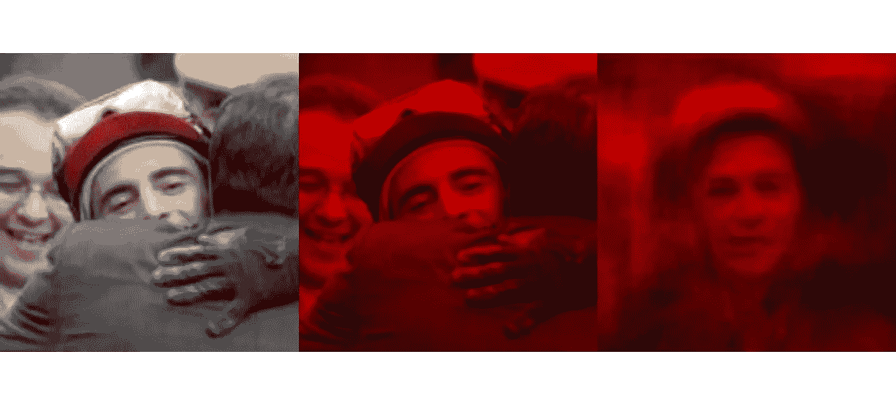

作者图片

转向离你最近的窗户，试着凝视外面你的眼睛可能遇到的任何物体。现在问你自己一个问题，在识别物体的时候，你的大脑是把它看成一个整体，还是物体的某些部分或特征足以让你决定这个物体是什么？我们的大脑能够通过识别一个物体的各个部分来识别它，而不必看到整个物体，这是一个非常有趣的现象。当看到一朵抽象形状的云时，我们的大脑会自动将漂浮的形状与最相似的物体联系起来。心理学研究[ [1](https://psycnet.apa.org/doiLanding?doi=10.1037%2F0033-295x.94.2.115) ]，生理学研究[ [2](https://academic.oup.com/cercor/article-abstract/4/5/509/332250) ]，以及计算机视觉的电子神经网络架构等计算研究[ [3](https://mitpress.mit.edu/9780262710077/high-level-vision/) ]调查并支持大脑中基于部分的表示的想法。

一种这样的计算机视觉技术被称为非负矩阵分解(NMF ),它巧妙地学习对象的特征，并且**可能是最简单和容易实现的算法**。NMF 作为一种探索性因素分析于 1994 年由 Paatero 和 Tapper 提出，并于 1999 年由 Daniel D . Lee&[H Sebastian Seung](https://www.nature.com/articles/44565#auth-H__Sebastian-Seung)[4](https://www.nature.com/articles/44565#Bib1)进一步推广。它仍然是图像和文本挖掘的流行算法。NMF 的基本原理是基于非负约束的部分学习，这意味着 NMF 只有在感兴趣的数据矩阵没有负条目时才有用。

鼓励对实现和代码感兴趣的读者快速阅读下一部分，以便理解我将在数据准备和代码中使用的维度符号。还有，随意探索一下动手香草造型系列的 [*第一部分*](/a-laymans-guide-to-building-your-first-image-classification-model-in-r-using-keras-b285deac6572?source=your_stories_page-------------------------------------) 、 [*第二部分、*](/understanding-a-neural-network-through-scratch-coding-in-r-a-novice-guide-a81e5777274b?source=your_stories_page-------------------------------------) *和* [*第三部分*](/logistic-regression-explained-from-scratch-visually-mathematically-and-programmatically-eb83520fdf9a) *。欢呼:)*

# 了解 NMF

让我们直接开始理解 NMF 背后的数学。本质上，NMF 通过将数据分解成权重和因子来减少数据，使得原始矩阵和新形成的矩阵的乘积之间的距离(欧几里德或弗罗贝纽斯)最小。

设**V**(*m*x*n*)*为我们的数据矩阵。目标是将 **V** 分解为低维 *k* 的*基*W(*m*x*k*)*和*编码矩阵***H**(*k*x*n*)*这样 ***H*** 的各列与 ***V*** 中的列一一对应。基本上，编码列是与基矩阵的线性组合产生 v 列的系数。***

**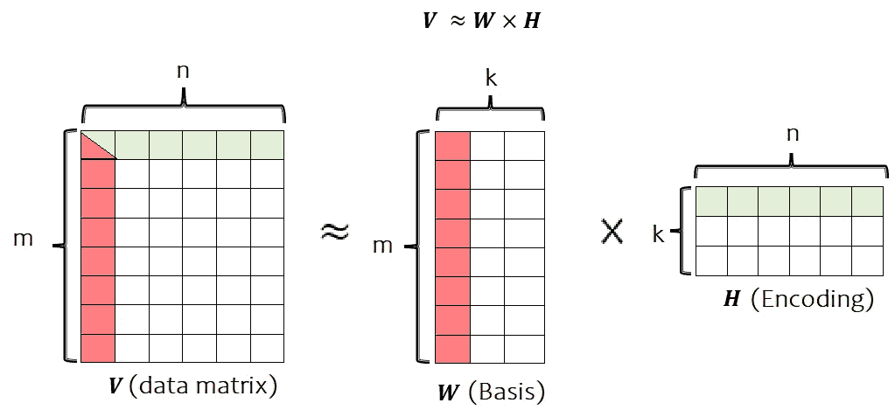**

**作者图片**

**例如，当数据矩阵 **V** 的每一列表示面部图像时，基列是除了诸如眼睛、鼻子、嘴唇等特征之外什么也不是的基图像。，而 H 的列指示哪个特征以什么强度出现在哪个图像中。 *k* 维度表示数据的特征(部分)。通常选择 *k* 使得(*m*+*n*)*k*≤*Mn。*把产品***W***x***H***称为数据 **V** 的压缩形式不会错。**

**潜在的 NMF 目标是相对于 **W** 和 **H** 最小化 **V** 和 **W** x **H** 之间的距离，同时保持 **W** 和 **H** 的非负性。**

> **非否定性约束与组合部分以形成整体的直观概念是相容的，这就是 NMF 学习基于部分的表征的方式。**

**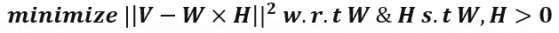**

**这个最小化问题无法解析地解决，因为它是一个 NP-Hard 问题，这意味着它在 **W** 和 **H** 中不是凸的。简而言之，找到全局最小值即使不是不可能，也是很困难的。对于标量情况可以观察到这种证明，其中 *m* 和 *n* 是等于 1。那么目标就是:**

**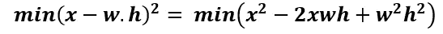**

**这个目标函数的梯度是:**

**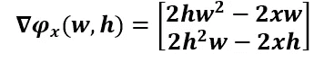**

**同样，黑森人会是:**

**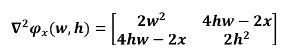**

**这里，可以容易地观察到，对于所有的 *w* 和*h*的值，hessian 并不总是[正半确定的](https://math.stackexchange.com/questions/2533610/how-do-you-recognize-a-positive-semidefinite-matrix)**

**基于梯度下降的知识，朝向梯度的缓慢步骤应该引导我们到达目标函数的最小值。**

**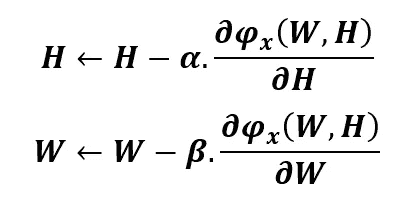**

**这里α和β是学习率。原则上，这些学习率可以估计为:**

**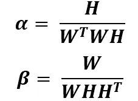**

**从梯度矩阵中代入学习率和梯度，更新规则变成:**

**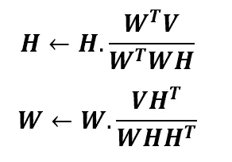**

**从针对 *W* 和 *H* 的非负初始条件开始，针对非负 *V* 的这些更新规则的迭代通过收敛到目标函数的局部最小化来找到 *V* ≈ *WH* 的近似因式分解。**

# **履行**

**为了学习面部特征，我们使用了 [LFW(野生标记人脸)](http://vis-www.cs.umass.edu/lfw/)数据集，这是一个面部照片数据库，旨在研究无约束人脸识别问题。该数据集包含从网络上收集的 13，000 多张面部图像。**

**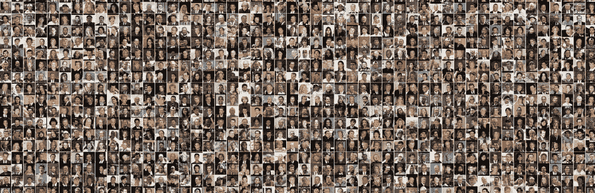**

**LFW 的拼贴画(作者)**

**NMF 的代码如下。W 和 H 矩阵由来自均匀分布的值初始化。默认情况下，迭代次数设置为 500，但是 50 次迭代足以达到可观的收敛。**

```
**#---------- NMF ---------------NMF<-function(X, K, ite = 500, verbose){

  N=nrow(X); M=ncol(X)
  W<-matrix(runif(N*K), nrow = N)
  H<-matrix(runif(K*M), nrow = K)

  loss<-NULL#-------Update------------#  
  for(i in 1:ite){

    H_num<-t(W)%*%X
    H_deno<-t(W)%*%W%*%H + 1e-10
    H<-H*(H_num/H_deno)

    W_num<-X%*%t(H)
    W_deno<-W%*%H%*%t(H) + 1e-10
    W<-W*(W_num/W_deno)

    loss[i]<-sum((X-W%*%H)^2)

    if(i%%500==0 & verbose == T){print(paste("iteration----------",i, sep = " "))
      print(sum((X-W%*%H)^2))}

  }

  return(list(Basis = W, Encoding = H, loss = loss))
}**
```

**这里，我们将只使用 500 张随机选择的图片。第一步，面部图像被缩放到 150×150 像素。然后，每个图像的像素被标准化，使得平均值和标准偏差等于 0.25。最后，图像像素被裁剪到范围[0，1]以允许非负性。**

**在步骤 2 中，每个图像像素然后被展平以成为列向量。将所有展平的图像组合成列，我们得到数据矩阵 v。**

**在步骤 3 中，用随机初始化的 *W* 和 *H* 用上述迭代算法在 V 上执行 NMF。**

**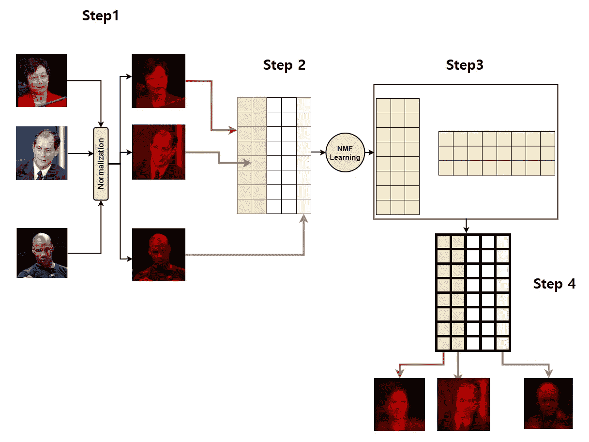**

**工作流程(作者图片)**

```
**setwd(".\\medium\\NMF\\lfw")
set.seed(123)
main.dir<-".\\medium\\NMF\\lfw"
my.list<-list(NULL)
index<-1
for(j in seq_along(dir())){ #reading all the image and storing into a list

  paste(main.dir,"\\",dir()[j], sep="")%>%setwd()

  for(i in seq_along(dir())){

    my.list[[index]]<-readImage(dir()[i])
    index<-index+1

  }
  setwd(main.dir)

}
#-------------------------Functions------------------------#
zscale<-function(x, u, sigma){ (x-mean(x, na.rm=T))*sigma/sd(x, na.rm = T) + u} #standardization function
minmax<-function(x){ (x-min(x, na.rm = T))/(max(x, na.rm = T)-min(x, na.rm = T)) } #min max function
#---------------------------------#
images=500 #number of images to be selected from the data base
pixel=150
sample.image<-sample(size = images, c(1:length(my.list)), replace = F)
my.new.list<-my.list[c(sample.image)]
#-------Step 1-------------------#
for(i in 1:images){my.new.list[[i]]<-c(channel(my.new.list[[i]], "grey")%>%resize(pixel, pixel))%>%zscale(u=0.25, sigma = 0.25)%>%minmax()}
#---------------Step 2--------------------------#
V<-unlist(my.new.list)%>%matrix(nrow = pixel*pixel, byrow = F)
#---------------Step 3------------------#
a<-NMF(X = V, K = 100, ite=1000, verbose = F)**
```

**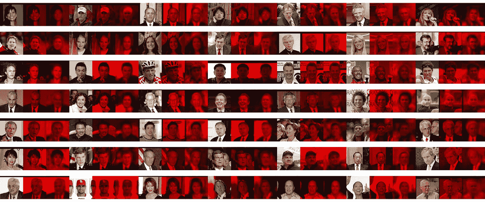**

**输出(图片由作者提供)**

**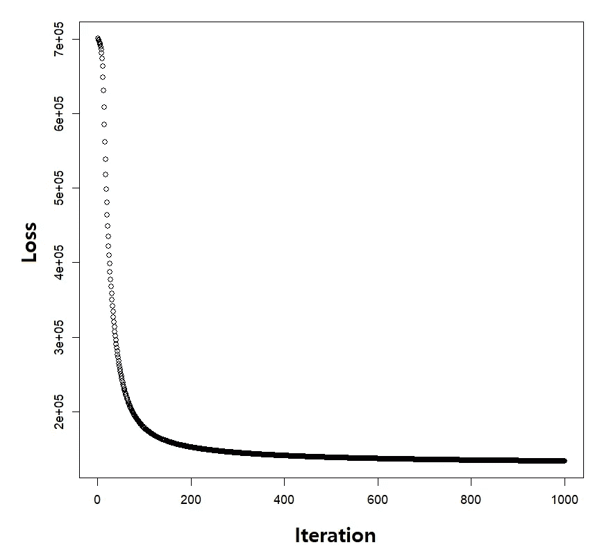**

**损失(按作者)**

**NMF 同时执行学习和推理。也就是说，它既学习一组基础图像，又从可见变量中推断隐藏变量的值。**

****局限性**
虽然 NMF 在学习面部零件方面是成功的，但这并不意味着该方法可以从任何数据库中学习零件，例如从极其不同的角度观看的物体图像或高度铰接的物体。虽然非负约束可以帮助这种模型学习基于部分的表征，但 NMF 的发明者并不认为它们本身就足够了。此外，NMF 不知道各部分之间的“句法”关系。NMF 假设隐变量是非负的，但没有进一步假设它们的统计相关性。人们还必须认识到，一种可以在人们不知情的情况下远程识别或分类的技术从根本上来说是危险的。跟随[这篇](https://www.nature.com/articles/d41586-020-03187-3)更好地理解面部识别或特征学习模型的伦理衍生。**

**我希望这篇文章能让你对 NMF 有所了解，作为一名读者，你会喜欢它的内容。从我的 [GitHub](https://github.com/AbhibhavS/NMF/tree/main) 访问代码。留下来更多的手香草造型系列。干杯！**

> **[从零开始解释的逻辑回归(可视化、数学化、程序化)](/logistic-regression-explained-from-scratch-visually-mathematically-and-programmatically-eb83520fdf9a)
> [通过 R 中的 Scratch 编码理解一个神经网络；新手指南](/understanding-a-neural-network-through-scratch-coding-in-r-a-novice-guide-a81e5777274b)
> [使用 Keras 建立你的第一个 R 图像分类模型的外行指南](/a-laymans-guide-to-building-your-first-image-classification-model-in-r-using-keras-b285deac6572)**

# **资源**

> **[通过非负矩阵分解学习物体的部件](https://www.nature.com/articles/44565#Bib1)**
> 
> **[非负矩阵分解的原因和方法](https://blog.acolyer.org/2019/02/18/the-why-and-how-of-nonnegative-matrix-factorization/)**