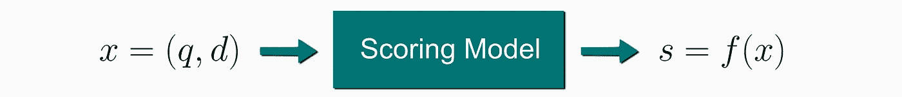
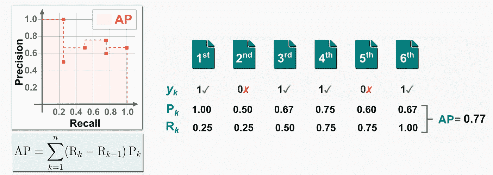
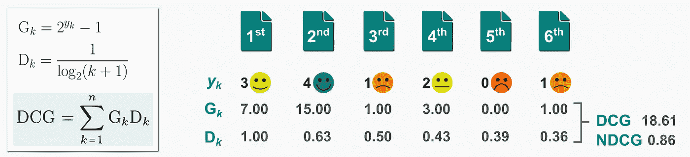
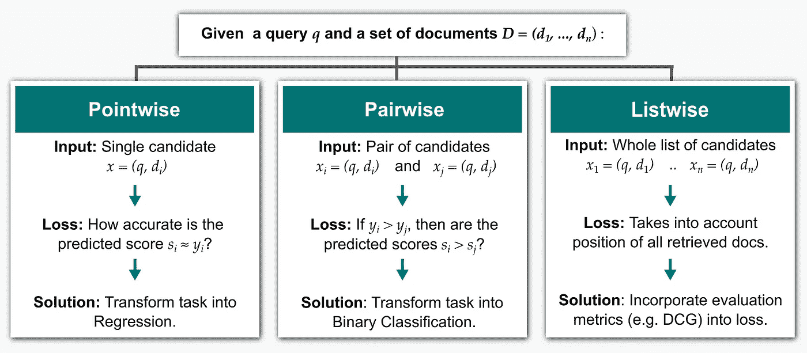
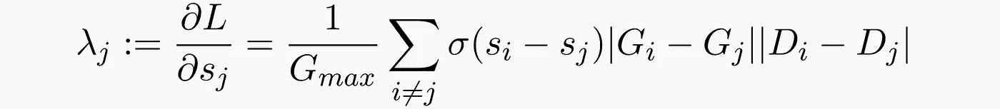
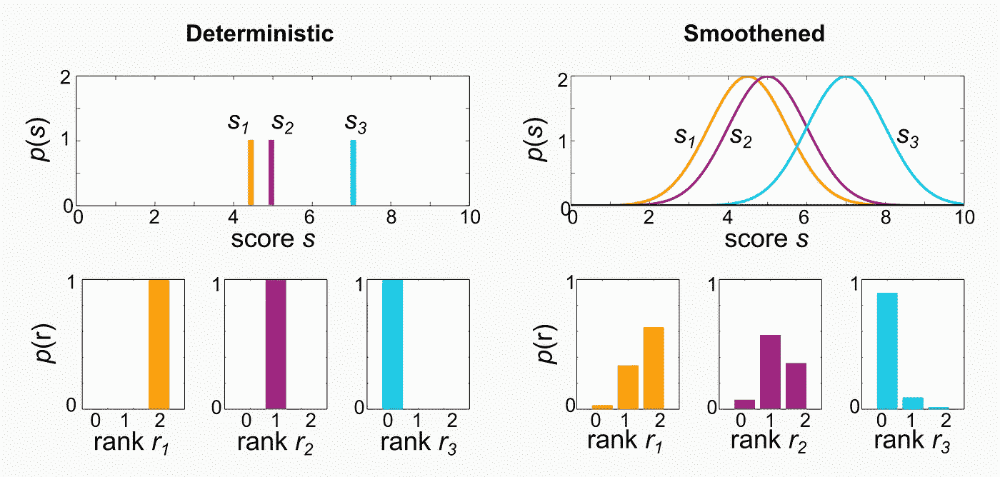
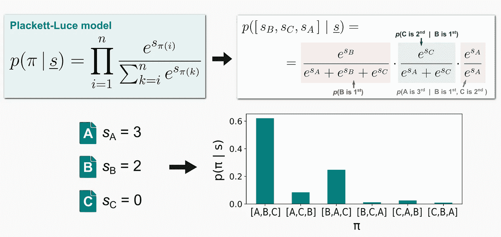
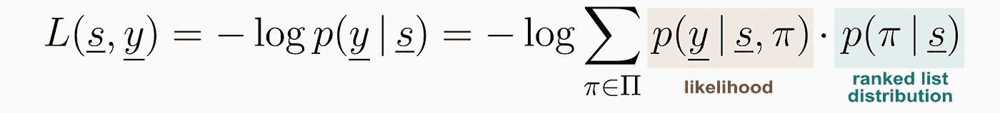

# 学习排序:使用机器学习的排序完全指南

> 原文：<https://towardsdatascience.com/learning-to-rank-a-complete-guide-to-ranking-using-machine-learning-4c9688d370d4>

照片由 [Unsplash](https://unsplash.com/s/photos/library?utm_source=unsplash&utm_medium=referral&utm_content=creditCopyText) 上的[尼克·费因斯](https://unsplash.com/@jannerboy62?utm_source=unsplash&utm_medium=referral&utm_content=creditCopyText)拍摄

# 排名:什么和为什么？

在这篇文章中，通过“**排名**，我们指的是**通过相关性**对文档进行排序，以找到与查询相关的感兴趣的内容**。这是 [**信息检索**](https://en.wikipedia.org/wiki/Information_retrieval) 的一个基本问题，但这个任务在许多其他应用中也会出现:**

1.  [**搜索引擎**](https://en.wikipedia.org/wiki/Search_engine) —给定一个用户简介(位置、年龄、性别……)一个文本查询，按相关性对网页结果进行排序。
2.  [**推荐系统**](https://en.wikipedia.org/wiki/Recommender_system)——给定一个用户简档和购买历史，对其他项目进行排序，为用户找到新的潜在感兴趣的产品。
3.  [**旅行社**](https://en.wikipedia.org/wiki/Travel_agency) —给定一个用户配置文件和过滤器(入住/退房日期、旅行者的数量和年龄等)，根据相关性对可用房间进行排序。

排名应用:1)搜索引擎；2)推荐系统；3)旅行社。(图片由作者提供)

排名模型通常通过为每个输入预测一个**相关性分数*s = f*(*x*)**x=(*q，d* ) 来工作，其中 ***q*** **是一个** **查询**并且 *d* **是一个文档一旦我们有了每个文档的相关性，我们就可以根据这些分数对文档进行排序(即排名)。**

排名模型依赖于评分函数。(图片由作者提供)

可以使用各种方法实现评分模型。

*   [**向量空间模型**](https://en.wikipedia.org/wiki/Vector_space_model)——为每个查询和文档计算一个向量嵌入(例如使用 [Tf-Idf](https://en.wikipedia.org/wiki/Tf%E2%80%93idf) 或 [BERT](https://arxiv.org/abs/1908.10084) ，然后计算相关性得分***f*(*x*)*= f*(*q，d* )** 作为 ***q* 的向量嵌入之间的余弦相似度**
*   [**学习排名**](https://en.wikipedia.org/wiki/Learning_to_rank)**–评分模型是一种机器学习模型，它在某种排名损失最小化的训练阶段，在给定输入***×=(*q，d* )*** 的情况下，学习预测得分 ***s*** 。**

**在本文中，我们关注后一种方法，我们展示了如何实现用于学习排名的**机器学习模型。****

# **评估指标排名**

**在分析学习排名的各种 ML 模型之前，我们需要定义使用哪些度量来评估排名模型。这些度量是对排名的**预测文档进行计算的，即第 ***k-* 个最高检索文档**是具有最高预测分数 ***s*** 的第 *k* 个文档。****

## **平均精度**

****

**地图-平均精度。(图片由作者提供)**

**[平均精度](https://en.wikipedia.org/wiki/Evaluation_measures_(information_retrieval)#Mean_average_precision)用于**二元相关**的任务，即当一个文档 *d* 的真实分数 *y* 只能是 **0 ( *不相关*或 1 ( *相关* )** 时。**

**对于给定的查询 *q* 和相应的文档*d*=*t5】{*d*₁、…， *dₙ* }，我们检查前 *k* 个检索到的文档中有多少是相关的( *y* =1)或不相关的( *y=* 0)。为了计算**精度** P *ₖ* 和**召回** R *ₖ* 。对于 *k =* 1… *n* ，我们得到不同的 P *ₖ* 和* R *ₖ* 值，它们定义了**精度-召回曲线**:这条曲线下的面积就是**平均精度(AP)** 。**

**最后，通过计算一组 *m* 查询的 AP 值的平均值，我们获得了**平均精度(MAP)** 。**

## **贴现累计收益(DCG)**

****

**DCG——贴现累积收益。(图片由作者提供)**

**[折扣累积收益](https://en.wikipedia.org/wiki/Discounted_cumulative_gain)用于**分级相关**的任务，即当文档 *d* 的真实得分 *y* 是衡量查询 *q* 相关度的尺度中的离散值时。一个典型的尺度是 **0 ( *差*)、1 ( *一般*)、2 ( *好*)、3 ( *优秀*)、4 ( *完美* )** 。**

**对于一个给定的查询 *q* 和相应的文档*d*=*{*d*₁、…、 *dₙ* }，我们考虑第 *k* 个顶部检索到的文档。增益 gₖ=2^*yₖ*–1 衡量这个文档有多有用(我们想要相关性高的文档！)，而**折扣**d*ₖ=*1/log(*k*+1)惩罚以较低等级检索的文档(我们希望相关文档在最高等级！).***

*****贴现收益**项 g*ₖ*d*ₖ*for*k =*1…*n*之和就是**贴现累计收益(DCG)** 。为了确保这个分数在 0 和 1 之间，我们可以用测量的 DCG 除以理想的分数 IDCG，如果我们用真实值 *yₖ* 对文档进行排序，就会得到理想的分数 idcg。这给了我们**归一化贴现累积收益(NDCG)** ，其中 NDCG = DCG/IDCG。***

***最后，对于 MAP，我们通常计算一组 *m* 查询的 DCG 或 NDCG 值的平均值来获得一个平均值。***

# ***用于学习排序的机器学习模型***

***为了建立一个用于排名的机器学习模型，我们需要定义**输入**、**输出**和**损失函数**。***

*   *****输入**–对于一个查询 ***q*** 我们有 ***n*** 个文档***d*=*{*d*****₁、…、***d****ₙ***}**按相关性进行排序。元素***=(*q*， *dᵢ* )*** *是我们模型的输入。*****
*   ******输出**–对于一个查询文档输入 *xᵢ* = ( *q* ， *dᵢ* )，我们假设存在一个真实的**相关性得分*yᵢ*t51】。我们的模型输出一个**预测分数*****sᵢ= f*(*xᵢ*)***。*******

****所有的学习排序模型都使用一个基本的机器学习模型(例如[决策树](https://en.wikipedia.org/wiki/Decision_tree_learning)或[神经网络](https://en.wikipedia.org/wiki/Artificial_neural_network))来计算*s*=*f*(*x*)。选择**损失函数**是学习排列模型的独特元素。一般来说，我们有 **3 种方法**，这取决于损失是如何计算的。****

1.  ******逐点法**——总损失计算为各文件**上定义的损失项之和*dᵢ*t81】(因此**t83】逐点 t85)作为预测得分 ***sᵢ*** 和地面真实值 ***yᵢ*** ，对于 *i=* 1 通过这样做，我们将我们的任务转化为一个**回归问题，**其中我们训练一个模型来预测 *y.*********
2.  ****成对方法**——总损失计算为每对单据**上定义的损失条款之和 *dᵢ、*** (因此 ***成对*** )，对于 *i，j=* 1… *n* 。训练模型的目的是预测 ***yᵢ > yⱼ*** 是否相关，即两个文档中哪一个更相关。通过这样做，我们将我们的任务转化为一个**二元分类问题**。**
3.  ****列表方式**——直接在整个文档列表上计算损失(因此 ***列表方式*** ),具有相应的预测等级。这样，排名指标可以更直接地纳入损失。**

****

**学习排序的机器学习方法:逐点，成对，列表。(图片由作者提供)**

## **逐点方法**

**逐点法是最容易实现的方法，也是第一个被提出来学习任务排序的方法。损失直接测量地面真实分数*和预测的***【sᵢ】***之间的距离，因此我们通过有效地解决回归问题来处理这个任务。例如， [**子集排序**](https://link.springer.com/chapter/10.1007/11776420_44) 使用了[均方误差(MSE)](https://en.wikipedia.org/wiki/Mean_squared_error) 损失。***

****

**子集排序中逐点方法的 MSE 损失。(图片由作者提供)**

## **成对方法**

**逐点模型的主要问题是需要真实的相关性分数来训练模型。但是在许多场景中，训练数据仅可用于**的部分信息，例如，我们仅知道用户选择了文档列表中的哪个文档(因此*与*更相关)，但是我们不知道这些文档中的与*有多相关！*****

**由于这个原因，成对方法不能与绝对相关性一起工作。相反，他们使用**相对偏好**:给定两个文档，我们想要预测第一个文档是否比第二个更相关。这样，我们解决了一个**二元分类任务**，其中我们只需要基本事实 *yᵢⱼ* ( *=* 1 如果 *yᵢ > yⱼ* ，否则为 0)，并且我们使用[逻辑函数](https://en.wikipedia.org/wiki/Logistic_function):*sᵢⱼ*=σ(*sᵢ–sⱼ*)将模型输出映射到概率。这种方法最早由 [**RankNet**](https://icml.cc/Conferences/2015/wp-content/uploads/2015/06/icml_ranking.pdf) 使用，其中使用了[二进制交叉熵【BCE】](https://en.wikipedia.org/wiki/Cross_entropy)损失。**

****

**RankNet 中成对方法的 BCE 损失。(图片由作者提供)**

**RankNet 是对逐点方法的改进，但在训练期间所有文档仍然被赋予相同的重要性，而我们希望给予排名更高的文档更多的重要性(正如 DCG 度量对折扣条款所做的那样)。**

**不幸的是，排序信息只有在排序后才可用，而且排序是不可微的。然而，要运行[梯度下降](https://en.wikipedia.org/wiki/Gradient_descent)优化，我们不需要损失函数，我们只需要它的梯度！[**λrank**](https://www.microsoft.com/en-us/research/publication/learning-to-rank-with-non-smooth-cost-functions/)定义了隐式损失函数的梯度，使得等级高的文档具有大得多的梯度:**

****

**如 LambdaRank 中的隐式损失函数的梯度。(图片由作者提供)**

**拥有渐变也足以构建一个[渐变提升](https://en.wikipedia.org/wiki/Gradient_boosting)模型。这就是[**λmart**](https://www.microsoft.com/en-us/research/wp-content/uploads/2016/02/MSR-TR-2010-82.pdf)**使用的思想，产生了比用 than 更好的结果。****

## ****列表式方法****

****逐点和成对方法将排序问题转化为代理回归或分类任务。相反，列表式方法通过最大化评估指标更直接地解决问题**。******

****直观上，这种方法**应该给出最好的结果**，因为关于排名的信息被充分利用并且 NDCG 被直接优化。但是设置**loss = 1–ndcg**的一个明显问题是，计算折扣 Dₖ所需的排名信息只有在根据预测分数对文档进行排序后才可用，而**排序** **是不可微的**。我们如何解决这个问题？****

****第一种**方法**是使用迭代方法，其中**排名度量用于在每次迭代中重新加权**实例。这是由[**λrank**](https://www.microsoft.com/en-us/research/publication/learning-to-rank-with-non-smooth-cost-functions/)**和[**λmart**](https://www.microsoft.com/en-us/research/wp-content/uploads/2016/02/MSR-TR-2010-82.pdf)使用的方法，它们确实介于成对方法和列表方法之间。******

********第二种方法**是逼近目标使其可微，这是 [**SoftRank**](https://www.researchgate.net/publication/221520227_SoftRank_optimizing_non-smooth_rank_metrics) 背后的思想。不是预测一个确定性的分数*s*=*f*(*x*)，而是预测一个**平滑的概率分数***s ~*𝒩(*f*(*x*)， *σ* )。**排名 *k*** 是**预测得分 *s*** 的非连续函数，但是由于平滑化，我们可以计算每个文档排名的**概率分布。最后，我们优化 **SoftNDCG** ，这是一个平滑函数，它是这个秩分布的期望 NDCG。********

********

****分数的不确定性导致了 SoftRank 的平滑损失。(图片由作者提供)****

****第三种方法被认为是每个排序列表对应于一个排列，并定义排列空间上的**损失**。在 [**ListNet**](https://www.microsoft.com/en-us/research/wp-content/uploads/2016/02/tr-2007-40.pdf) 中，给定一个分数列表 *s* 我们使用 [**Plackett-Luce 模型**](https://en.wikipedia.org/wiki/Discrete_choice#J._Exploded_logit) 定义任何排列的概率。然后，我们的损失很容易计算为置换空间上真实和预测的**概率分布之间的**二元交叉熵距离**。******

********

****ListNet 中 Plackett-Luce 模型各种排列的概率。(图片由作者提供)****

****最后，[**lambda loss**](https://research.google/pubs/pub47258.pdf)**论文对这个问题引入了一个新的视角，并创建了一个**广义框架**来定义新的列表式损失函数并实现**最先进的精度**。其主要思想是以一种严格和通用的方式将问题框架化，作为一个 [**混合模型**](https://en.wikipedia.org/wiki/Mixture_model) ，其中排序列表 *π* 被视为一个隐藏变量。然后，损失被定义为该模型的负对数似然。******

************

******loss 损失函数。(图片由作者提供)******

******LambdaLoss 框架的作者证明了两个基本结果。******

1.  ******所有其他列表式方法(RankNet、LambdaRank、SoftRank、ListNet、…)都是这个通用框架的**特殊配置**。的确，他们的损失是通过准确选择**似然** ***p* ( *y | s，π* )** 和**排序列表分布 *p* ( *π | s* )** 得到的。******
2.  ******这个框架允许我们定义度量驱动的损失函数，直接连接到我们想要优化的排名度量。这有助于**显著提高任务排序的学习水平。********

# ******结论******

******从信息检索到推荐系统和旅游预订，排名问题无处不在。像 MAP 和 NDCG 这样的评估指标同时考虑了检索文档的排名和相关性，因此很难直接优化。******

******学习排序方法使用机器学习模型来预测文档的相关性分数，并被分为 3 类:点方式、成对方式、列表方式。在大多数排序问题上，列表式方法如 LambdaRank 和广义框架 LambdaLoss 达到了最先进的水平。******

# ******参考******

*   ******[维基百科关于“学习排名”的页面](https://en.wikipedia.org/wiki/Learning_to_rank)******
*   ******【李，】号杭。“学习排名的简短介绍。” 2011 年******
*   ******[铁岩。“学习信息检索排序”，2009 年](https://web.archive.org/web/20170808044438/http://wwwconference.org/www2009/pdf/T7A-LEARNING%20TO%20RANK%20TUTORIAL.pdf)******
*   ******[李铁岩《学会排名》，](http://didawiki.di.unipi.it/lib/exe/fetch.php/magistraleinformatica/ir/ir13/1_-_learning_to_rank.pdf) 2009******
*   ******[X .王《排名度量优化的 LambdaLoss 框架》，2018](https://research.google/pubs/pub47258/)******
*   ******[曹志，“学习排序:从两两法到列表法”，2007](https://www.microsoft.com/en-us/research/wp-content/uploads/2016/02/tr-2007-40.pdf)******
*   ******[M . Taylor，“软排名:优化非平滑排名指标”，2008 年](https://www.microsoft.com/en-us/research/wp-content/uploads/2016/02/SoftRankWsdm08Submitted.pdf)******