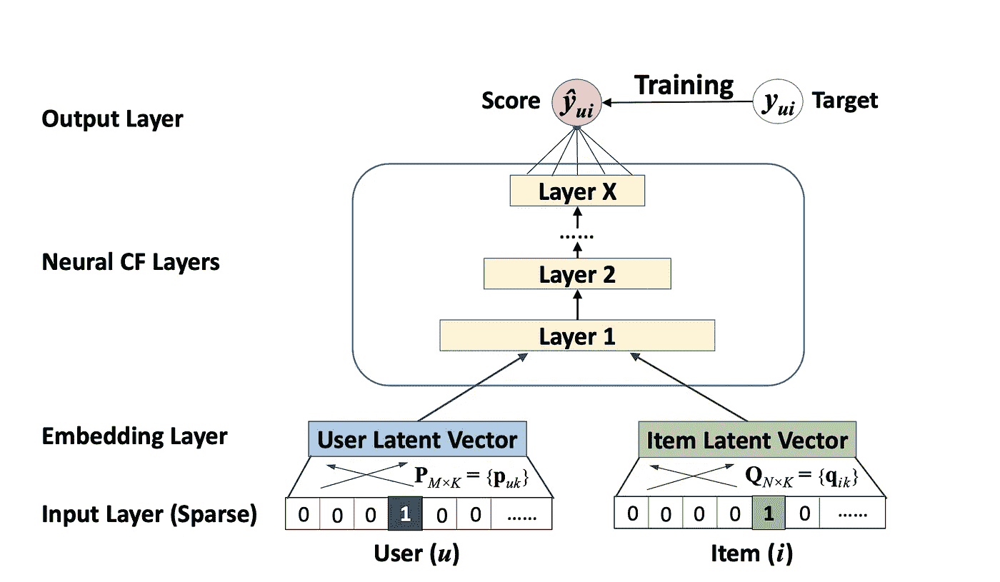

# 学习排名:入门

> 原文：<https://towardsdatascience.com/learning-to-rank-a-primer-40d2ff9960af>

## 为搜索引擎、推荐系统、社交媒体和广告提供动力的算法

在 [Unsplash](https://unsplash.com?utm_source=medium&utm_medium=referral) 上由 [tatonomusic](https://unsplash.com/@tatonomusic?utm_source=medium&utm_medium=referral) 拍摄的照片

每当你在谷歌上搜索一个页面或亚马逊上的一个产品，在网飞上选择一部电影，滚动浏览你的脸书或 Twitter feed，或者对作为内容一部分显示的广告感到恼火，你都在查看一个**排名算法**的结果，该算法决定你正在展示的印象是最有可能与你互动的。

事实上，排名算法是当今世界最普遍的 ML 应用之一。它们是如何工作的？在这次深入探讨中，我们将了解一些驱动搜索引擎、推荐系统、提要和广告选择的算法。让我们开始吧。

## 搜索引擎

搜索引擎的目标是向用户显示与给定搜索查询最相关的文档(谷歌的页面，亚马逊的产品)。搜索中最大的挑战之一是搜索空间的大小，可能有数十亿个文档。一个算法如何在如此广阔的空间中搜索？

搜索引擎通常使用一个**漏斗架构**，它由两个复杂性不断增加的阶段组成:第一阶段是一个针对召回进行优化的简单模型(确保我们捕获所有相关内容)，第二阶段是一个针对精确度进行优化的更复杂的模型(确保我们首先显示最相关的内容)。第一阶段可以是一个简单的**倒排索引**，它为每个术语存储该术语出现的所有文档的索引。这个阶段可以将文档总数从 10B 减少到大约 100K，这更易于管理。然后，第二阶段可以是更强大的 ML 模型，例如提升树的集合或**双塔神经网络**(更多内容见下文)，它根据点击概率对文档进行排序。

这些模特是怎么训练出来的？通常有两种不同的方法，逐点和成对。在**逐点**方法中，一般来说，每个有点击的历史印象都是正面训练样本，每个没有点击的印象都是负面训练样本。在**成对**方法中，一个训练示例是一对文档，模型学习预测这两个文档的相对排名。注意，成对排序本质上仍然是二进制分类问题:如果文档 A 的排序高于文档 B，则标签为 1，否则为 0。

我们可以用什么特征来训练搜索引擎？特征有几个来源，并且在实践中，排名模型可能消耗数百甚至数千个特征，例如:

*   文档相关的特征，例如词袋/ TF-IDF 特征或低维嵌入，
*   文档元数据，例如在电子商务搜索的情况下的品牌、制造商或平均产品评级，
*   与查询相关的特征，例如词袋特征或嵌入(类似于与文档相关的特征)，
*   相关性特征，即测量文档与查询相关程度的特征，例如通过计算共享嵌入空间中的距离，
*   与用户相关的特征，例如用户年龄、性别、位置、总结历史用户行为的特征，以及
*   行为特征，例如某种产品在过去 24 小时内获得了多少参与度。

这些特征还取决于特定的搜索领域:例如， [Sorokina 等人](https://assets.amazon.science/89/cd/34289f1f4d25b5857d776bdf04d5/amazon-search-the-joy-of-ranking-products.pdf)强调了**行为特征**在亚马逊产品排名中的重要性:

> 在产品搜索中，数百种产品可能共享非常相似的描述，并且似乎与特定查询同样相关。但其中一些产品比其他产品更受欢迎，应该排名更高。这就是为什么行为特征在亚马逊搜索中比在网络搜索中更大程度地推动了排名。通常，它们是梯度增强树中方差减少的主要原因。

我们如何衡量一个搜索引擎的性能？概括地说，我们区分了**离线指标**(从历史数据中获得)和**在线指标**(从实时用户流量中获得)。一个好的离线指标是 **NDGC@k，**或显示的前 k 个搜索结果中的归一化折扣累积收益。如果显示的所有搜索结果真正相关，并且它们也以正确的方式排序，即如果排名较高的搜索结果比排名较低的搜索结果更相关，则 NDCG 最高(即 1)。一个好的在线指标是点击率，

> CTR =(点击次数)/(展示次数)。

如果对于给定的查询，在 SERP(搜索引擎结果页面)中排名最高的文档确实具有最高的 CTR，则搜索引擎工作良好。换句话说，如果排名最高的文档的点击率低，这将表明搜索引擎有问题。

离线和在线度量在实践中都很重要。离线指标很容易获得，可以用来快速排除假设。然而，实践者发现，离线指标的改进并不总是转化为实时系统的改进(例如，见 [Yi 等人 2013](https://chbrown.github.io/kdd-2013-usb/kdd/p1294.pdf) )，因此，通过 A/B 测试在线估计改进是生产 ML 模型的关键步骤。

## 基于推荐和馈送的系统

根据我们对用户的了解，推荐系统是推荐下一部要看的电影(网飞)、下一件要购买的产品(亚马逊)或下一个要添加的朋友(脸书)的算法。为了做到这一点，我们可以利用来自用户的**显性或隐性反馈**。在网飞的例子中，显式反馈是用户对电影的明确评价，而隐式反馈是用户观看了哪些电影。

*通过隐式反馈，我们可以访问更大的标记数据池，这仅仅是因为典型用户观看的电影比他们评价的多得多。*

我们如何衡量我们的推荐有多好？如果我们有明确的反馈，如星级，我们可以简单地计算一个指标，如 RMSE。如果我们只有隐式反馈，我们可以计算 N 个推荐的平均精度，其中“平均值”是对等级取的，“平均值”是对用户取的。用一个例子最容易理解 MAP@N:假设在推荐的前 5 部电影中，用户看了 1、2、3、5 部，而不是 4 部。那么我们的 AP@5 就会是(1/1 + 2/2 + 3/3 + 3/4 + 4/5)/5 = 0.91，相当不错，但不完美。对于 MAP@5，我们简单地计算所有用户的平均值。

推荐系统背后最常用的一类算法是**协同过滤**:对于一个给定的用户，我们构建一个二进制向量，其中每个条目对应一部特定的电影，如果用户观看了该电影，则该向量为 1，否则为 0。现在我们对每个用户都有了一个数字表示，可以衡量他们有多相似。为了构建推荐，我们可以在用户列表中选择最相似的用户最常观看的未观看的电影。

协同过滤在计算上非常昂贵。让我们假设网飞有 2 亿用户和 10K 电影:然后，我们需要在 10K 维度的空间中找出 200 米内最近的邻居！降低问题计算复杂度的一种方法是**矩阵分解**，其中我们将维数为 N_user x N_movie 的用户/电影矩阵 X 分解为 2 个更小的矩阵，X = U x M，其中 U 具有 shape N_user x k，M 具有 shape k x N_movie。这里，k 是**潜在因素**的数量。在最简单的情况下，k=1，U 简单地编码每个用户总体上喜欢电影的程度，M 编码每个电影总体上被喜欢的程度。通过增加 k，我们可以增加潜在空间的细微差别，如流派(电影)或风格(服装)。

然而，矩阵分解只是一个线性模型，我们可以通过深度神经网络获得更好的性能，深度神经网络可以学习偏好表示的**层次**，类似于在图像上训练的神经网络如何学习视觉潜在表示的层次(例如，边缘、眼睛、脸、人)。推荐器中使用的网络架构通常是一个**双塔结构**，我们已经在上面介绍过，其中一个塔接收稀疏用户表示，另一个塔接收稀疏电影表示:

用于推荐的双塔神经网络。图片鸣谢:[何等 2017](https://arxiv.org/pdf/1708.05031.pdf)

*双塔神经网络的关键在于用户和项目的表示在模型训练期间被共同学习，这将导致共享的嵌入空间。在这样的共享嵌入空间中，我们可以简单地通过最近邻算法为用户获得新的推荐。*

推荐系统中使用了哪些功能？在“纯”协同过滤系统中，我们只考虑历史用户/项目交互矩阵。此外，我们可以添加基于用户的功能，如年龄、性别或地理位置，以及基于电影的功能，如导演、演员、标题、情节、运行时间、原籍国或语言。这两个集合也形成了强大的组合特征，例如在用户的地理位置中所说的语言是否与电影语言相匹配。对于 YouTube 推荐，内容会迅速传播，观看时视频的年龄是另一个非常强大的功能( [Covington et al 2017](https://static.googleusercontent.com/media/research.google.com/en//pubs/archive/45530.pdf) )。

**基于订阅源的系统**，如脸书、Twitter、LinkedIn 或谷歌新闻，类似于推荐系统，但用户有多种方式与显示的内容进行交互，如喜欢/反应、分享/转发、评论、直接发送消息、发送好友请求、报告等，而不仅仅是一种类型的交互(观看)。这为排名模型提供了额外的设计考虑。例如，我们可以构建一个预测整体参与度的排名器，或者我们可以构建单独的排名器，比如为每种参与度类型(喜欢、分享、评论等)构建一个排名器。后一种方法在优化下游模型时会给我们更多的灵活性，例如，当我们希望将创建分享或评论的内容优先于仅创建喜欢的内容时。

## Ads 预测系统

广告显示在搜索引擎结果中(如谷歌、亚马逊)，或显示在基于订阅源的系统中(如推特、脸书)。

*一般来说，广告排名的工作方式类似于搜索引擎和推荐系统，但有一个关键的区别:排名功能，它将模型得分映射到排名。*

在搜索结果中，我们希望通过点击概率 p 对显示的内容进行排序:点击概率越高，我们希望显示的内容就越高。另一方面，在广告排名中，我们通过(p x b^(alpha)进行排名，其中 b 是来自广告商的**出价**，即当广告被点击时他们向平台支付的钱，alpha 是一个自由参数；请注意，搜索排名和广告排名在 alpha → 0 的限制下是相同的。这种基于出价的排名的原因是广告的目标是总收入，而不是用户参与度:例如，如果耐克为 p=0.009 的广告出价 1 美分，但阿迪达斯为 p=0.007 的广告出价 5 美分，我们仍然更喜欢首先放置阿迪达斯的广告，即使点击概率较低，因为它将创造更多的收入。

由于模型得分和收入之间的紧密关系，广告排名中的模型得分经过**校准**至关重要，例如，0.009 的得分实际上意味着 9/1000 的用户点击了该广告。这种行为是不能保证的，深度神经网络特别容易出现误校准(参见例如[郭等 2017](https://arxiv.org/pdf/1706.04599.pdf) )。*如果模型校准错误，那么最终排名可能不理想，我们可能会将收入留在桌面上。*

我们如何训练一个广告预测模型？正如在搜索引擎和推荐系统中一样，我们可以从在线用户行为中生成训练数据:没有点击的印象是负面的，而点击是正面的。通常，点击率很小，可能只有 1%或更少，因此我们可能希望对负面数据进行下采样，以便更快地进行模型训练。在这种情况下，我们可以通过更新来重新校准模型的输出分数，以校正已完成的重新采样

> p ← p/(p+(1-p)/w)，

其中 w 是下采样速率。

广告中的另一个挑战是，人类很容易被操纵，经常改变主意，因此，今天表现良好的广告明天可能会表现不佳:这造成了**概念漂移**。由于概念漂移，我们希望尽可能频繁地更新模型，每天或者甚至每小时。另一个好方法是**在线学习**，系统随着每一批新用户的点击而更新。使用逻辑回归可以最容易地进行在线学习，因为需要更新的参数数量很少。然而，logreg 模型不利用特征交互。因此，一个强大的想法是一种“混合”在线建模方法，其中我们使用树集成或深度神经网络作为特征生成器，并且仍然使用 logreg 模型作为这些生成的特征之上的最终分类层(参见[何等人 2014](https://quinonero.net/Publications/predicting-clicks-facebook.pdf) )。

图片来源:作者个人收藏

## 结论

让我们回顾一下:

*   在**搜索引擎**中，我们构建了一个模型来预测给定用户搜索查询的最相关文档，该模型利用了从文档和查询中导出的特征；
*   在**推荐系统**和 **feeds** 中，没有明确的用户查询，而是基于用户过去做了什么以及相似用户参与了什么内容，我们预测用户最有可能与之交互的内容；
*   最后，**广告预测系统**的工作方式类似于搜索引擎和推荐系统，重要的区别是我们根据点击概率 x 出价对广告进行排名，而不是只根据点击概率，因为目标是实现收入最大化。

最后，搜索引擎、推荐系统和广告预测系统之间的界限可能是模糊的。例如，假设你在亚马逊上搜索一个特定品牌的产品，但没有看到一个空的结果页面，而是显示了一个类似的备选列表:*这是一个搜索，但也是一种推荐*。

 [## 通过我的推荐链接加入媒体-塞缪尔·弗莱德

### 作为一个媒体会员，你的会员费的一部分会给你阅读的作家，你可以完全接触到每一个故事…

medium.com](https://medium.com/@samuel.flender/membership)