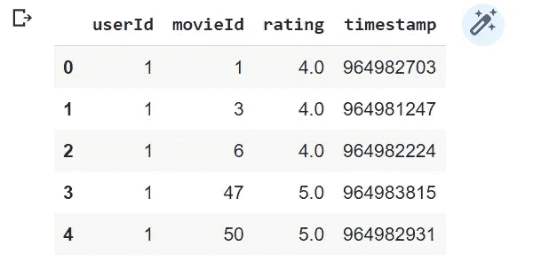
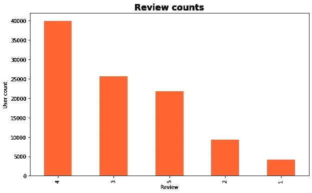
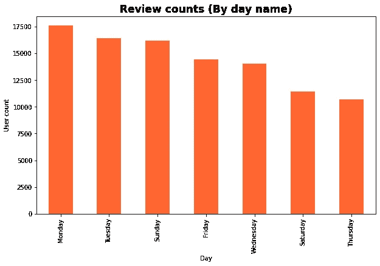
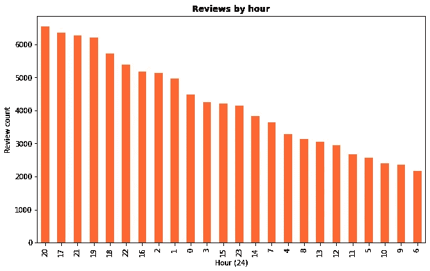
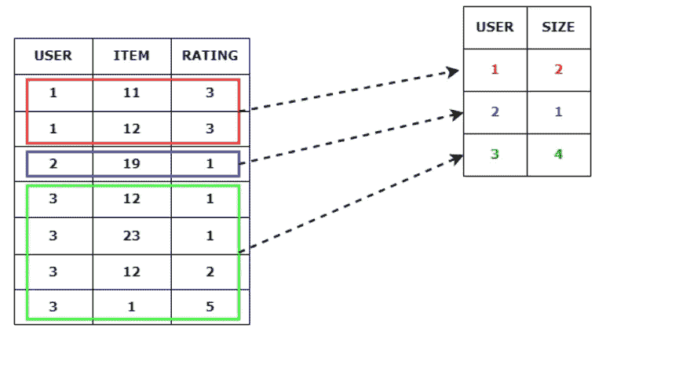
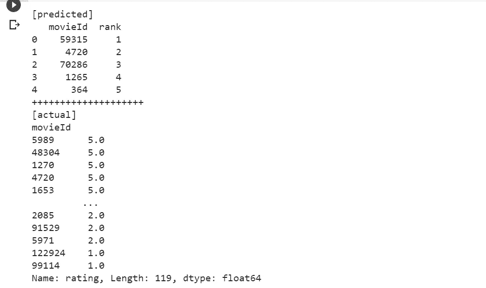
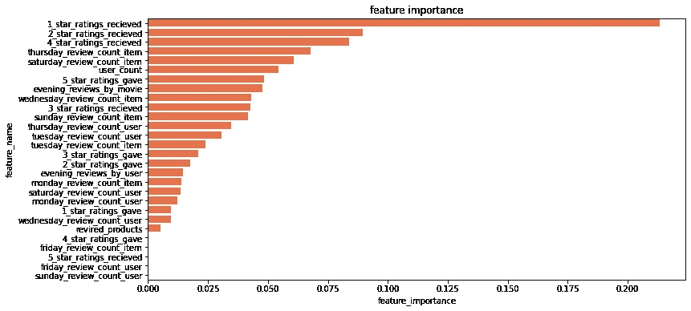

# 学习产品推荐排名

> 原文：<https://towardsdatascience.com/learning-to-rank-for-product-recommendations-a113221ad8a7>

## 本文将介绍如何使用流行的 XGBoost 库来解决学习排序(LTR)问题

[Malvestida](https://unsplash.com/@malvestida?utm_source=medium&utm_medium=referral) 在 [Unsplash](https://unsplash.com?utm_source=medium&utm_medium=referral) 上拍摄的照片

LTR 最常见的用例是搜索引擎和推荐系统。排名的最终目的是按照有意义的顺序排列项目。
本文将使用流行的 XGBoost 库进行电影推荐。

开始做 LTR 的时候，我的第一个问题是，传统的机器学习和排名问题有什么区别？这就是我的发现。在传统的机器学习问题中，每个实例都有一个目标类或值。例如，如果您正在处理一个客户流失预测问题，那么您拥有每个客户和相关类别的特性集。同样，我们的输出将是一个客户 id 和预测类或概率分数。但是在 LTR 中，我们没有针对每个实例的单一类或值。相反，我们有多个项目和它们每个实例的基本真值，我们的输出将是这些项目的最优排序。例如，如果我们有用户过去与项目的交互，我们的目标是建立一个能够预测最佳用户-项目对的模型。

现在是时候进入编码部分了。为简单起见，我将使用 movielens 小型数据集。您可以使用下面的链接下载数据集。

  

让我们加载数据集，并对数据集进行基本的预处理。

在这个数据集中，我们有 100，000 个评级和 3，600 个标签应用程序，由 600 个用户应用于 9，000 部电影。

让我们快速看一下评级栏。

按值查看计数

按日名称查看计数

按接收小时数查看计数

看了上面的图之后，我为建模添加了一个基于时间、基于天的特性。因此，我将创建用户级和项目级功能。例如，对于某部电影“X ”,我得到了与之互动的用户总数，收到了 5、4、3、2 和 1 星的评论。此外，我正在添加每天收到的评论和下午 5 点后收到的评论。

让我们将数据集分成训练集和测试集。我会用过去作为训练，最新的数据会用来评估模型。

现在是时候创建模型输入了。由于排名模型不同于传统的监督模型，我们必须向模型中输入额外的信息。现在是创建模型的时候了。我们将使用 xgboost，XGBRanker。让我们把重点放在它的*上。配合*方法。下面是 *XGBRanker()的 docstring。适合()。*

> 签名:model.fit(X，y，group，sample_weight=None，eval_set=None，sample_weight_eval_set=None，eval_group=None，eval_metric=None，early_stopping_rounds=None，verbose=False，xgb_model=None，callbacks=None)
> Docstring:拟合梯度增强模型
> 
> 因素
> 
> X : array_like 特征矩阵
> y : array_like 标签
> group : array_like **训练数据的组大小**sample _ weight:array _ like 组权重
> ..注意:权重是针对分级任务中的每个组的，一个权重被分配给每个组(而不是每个数据点)。这是因为我们只关心每个组内数据点的相对顺序，所以给单个数据点分配权重没有意义。

根据下面的文档字符串，我们必须为训练和测试样本输入组。所以问题是如何在排名模型中创建组数组。我看到很多人很难理解这个群参数。

简而言之，group 参数表示每个用户的交互次数。根据下面的片段，你可以看到一号用户与两个项目(11 和 12)进行了交互。因此，用户 1 的组大小为 2。此外，组长度应该等于数据集中唯一用户的数量，组大小的总和应该等于数据集中记录的总数。在下面的例子中 ***组*** 参数是*【2，1，4】*。

让我们创建模型输入。我们可以使用下面的代码。

现在，我们将训练和测试输入输入到模型中。是时候对模型进行训练和评估了。在此之前，为了文章的完整性，我需要解释几个术语。

建立模型时，衡量预测的质量至关重要。评估推荐模型的可用度量有哪些？很少，但最常用的度量是[归一化贴现累积增益(NDCG)](http://en.wikipedia.org/wiki/NDCG) 和[平均精度(MAP)](http://en.wikipedia.org/wiki/Mean_average_precision#Mean_average_precision) 。在这里，我将使用 NDCG 作为评估指标。NDCG 是 CG(累积增益)的增强版。在 CG 中，推荐一个订单并不重要。如果您的结果包含任何顺序的相关项目，这将给您更高的值，表明我们的预测是好的。但在现实世界中，情况并非如此。我们在推荐时应该优先考虑相关项目。为了实现这一点，当低相关性项目在结果中较早出现时，我们应该进行惩罚。这就是 DCG 的做法。但是，当不同的用户有不同的项目/交互计数时，DCG 仍然会受到影响。这就是[归一化贴现累计收益(NDCG)](http://en.wikipedia.org/wiki/NDCG) 发挥作用的地方。它将使 DCG 度量标准正常化。

现在我们可以移动到模型部分。

现在我们可以做出一些预测。

以下是一些生成的预测。

评估你的推荐模型的覆盖面总是好的。使用覆盖率度量，您可以检查测试集中培训产品的百分比。覆盖面越广，模型越好。在某些情况下，模型试图预测受欢迎的商家，以最大化 NDCG 和 MAP@k。我在处理 [starpoints](https://play.google.com/store/apps/details?id=com.atlinkcom.starpointapp&hl=en&gl=US) 产品推荐时遇到了这个问题。当我们对我们的评估标准有疑问时，我们可以快速检查我们模型的覆盖率。在这个模型中，我得到了大约 2%的覆盖率。表明我们的模型应该进一步改进。

此外，我们可以如下绘制特征重要性。

特性对 XGBRanker 的重要性

# 结论

在本文中，我们介绍了学习排序问题的基础知识，如何对排序问题建模，以及一些与评估推荐模型相关的技巧。虽然本文展示了如何使用 xgboost 解决产品排名问题，但是我们也可以使用这种方法解决其他排名问题。

***参考文献***

麦克斯韦·哈珀和约瑟夫·康斯坦。2015.电影镜头数据集:历史和背景。美国计算机学会交互式智能系统汇刊 5，4:19:1–19:19。[*https://doi.org/10.1145/2827872*](https://doi.org/10.1145/2827872)

感谢阅读。您可以使用[此](https://colab.research.google.com/drive/1pyhxI2skMUVsVVwZQ2uX2Pse8Y_NZH2N?usp=sharing)链接访问 colab 笔记本。

在 [*LinkedIn*](http://www.linkedin.com/in/ransaka) 上和我联系。