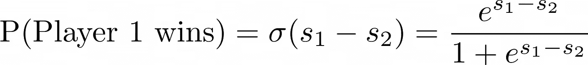
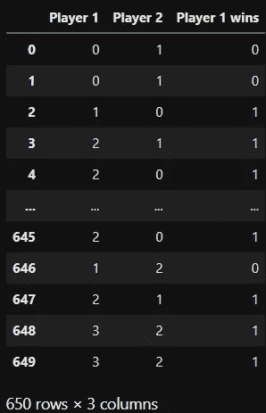
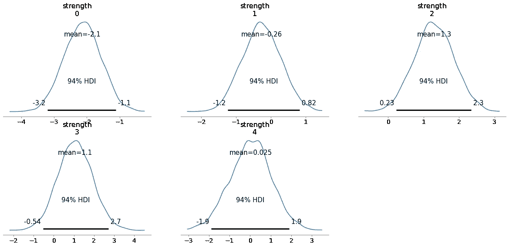
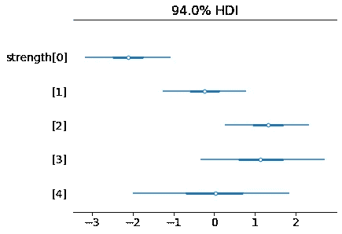
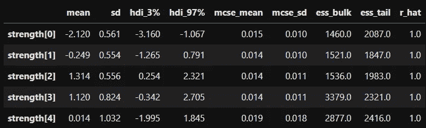

# 学习贝叶斯方法排序

> 原文：<https://towardsdatascience.com/learning-to-rank-the-bayesian-way-29af4c61939b>

## [贝叶斯统计](https://medium.com/tag/bayesian-statistics)

## 在 PyMC 中实施布拉德利-特里模型


由[彼得罗·马蒂亚](https://unsplash.com/@pietromattia?utm_source=medium&utm_medium=referral)在 [Unsplash](https://unsplash.com?utm_source=medium&utm_medium=referral) 上拍摄的照片

想象一下，一群玩家在某个游戏中一对一地竞争。于是，一个自然的问题出现了:

> 如何给选手排名？

理论上，这个问题应该不会太难——让他们玩一堆游戏，检查玩家的**胜率**。不幸的是，这种自然的方法有一些问题:

*   你无法判断**接近 100%** 的胜率是否意味着该玩家**异常**，或者该玩家是否只是踩死了**弱小的对手**，以及
*   如果一个玩家只玩了**几局**，那么对这个玩家实力的估计应该带有**高不确定性**，而这是一个原始的**胜率无法提供的**。

在许多地方，您可能会遇到类似一对一游戏的问题:

*   当**在**实际比赛**中对玩家**进行排名时:网球、赛车、纸牌游戏、神奇宝贝战斗……
*   当**对搜索结果** : 排序时，如果一个搜索结果与用户的查询更相关，则该搜索结果优于另一个。
*   当**排列推荐** : 一个推荐比另一个更好，如果它与用户可能想要购买的东西更相关的话
*   …

在本文中，我将向您展示如何在 PyMC 中构建一个简单的**贝叶斯模型**来解决这个问题。如果你不知道我在说什么，可以看看我对使用 PyMC3 的贝叶斯世界的介绍，PyMC 的前身具有几乎相同的语法。

[](/conducting-bayesian-inference-in-python-using-pymc3-d407f8d934a5)  

# 布拉德利-特里模型

我们将使用的模型被称为[布拉德利-特里模型](https://en.wikipedia.org/wiki/Bradley%E2%80%93Terry_model)，我们给它一个贝叶斯扭曲。这听起来很吓人，但实际上相当容易。只是跟着走。

## 模型直觉

整个模型归结为只有两个假设:

1.  我们假设每个**玩家**(人类，口袋妖怪，搜索结果，推荐，…)都有一些**实力**(技能，相关性，…)。
2.  如果拥有实力*的玩家 1s₁*和拥有实力*的玩家 2s₂*竞争，那么**玩家 1 以**的概率**赢得**



图片由作者提供。

其中 *σ* 就是你的老朋友，sigmoid 函数。就是这样。

请注意，我们**在这里没有使用任何玩家特征**，例如，如果玩家是真实的人类，身高或体重之类的特征。这意味着我们可以将这个模型应用于各种问题。

然而，如果我们碰巧有播放器特性，我们也可以将它们合并到模型中，最终得到类似于[微软的 RankNet](https://www.microsoft.com/en-us/research/wp-content/uploads/2005/08/icml_ranking.pdf) [1]的东西。作者使用神经网络架构从特征 *x* 中**显式构建玩家的优势*s*=*f*(*x*)**，而我们在贝叶斯方法中直接将**优势 s 视为参数**。

对于对神经网络感兴趣的人来说:我们可以使用嵌入层在你选择的深度学习框架中建立布拉德利-特里模型的频率主义版本。

让我们做一个小的理智检查，看看这个定义是否有意义。好吧，每个玩家都有自己的优势。这正是我们需要的，如果我们想根据球员的实力来排序，所以这很棒。

如果我们现在假设 1 号玩家的实力远高于 2 号玩家，即 *s₁ — s₂* 是一个很大的数，这就暗示着*σ*(*s₁—s₂*)*接近于 1。所以**玩家 1 以压倒性的概率**获胜，这正是我们在这种情况下想要的。如果参与人 1 的实力远低于参与人 2，同样的道理也适用。如果两位选手实力相当，那么他们各自获胜的概率是*σ*(*0*)*=*50%。完美！*

## *创建数据集*

*在我们进入建模部分之前，让我们创建一个由游戏结果组成的人工数据集，如下所示:*

**

*图片由作者提供。*

*这样做的好处是，我们知道模型应该能够找到哪些属性。*

*若要创建此数据集，可以使用以下代码:*

```
*import pandas as pd
import numpy as np

np.random.seed(0)

def determine_winner(player_1, player_2):
    if player_1 == 0 and player_2 == 1:
        return np.random.binomial(n=1, p=0.05)
    if player_1 == 0 and player_2 == 2:
        return np.random.binomial(n=1, p=0.05)
    if player_1 == 1 and player_2 == 0:
        return np.random.binomial(n=1, p=0.9)
    if player_1 == 1 and player_2 == 2:
        return np.random.binomial(n=1, p=0.1)
    if player_1 == 2 and player_2 == 0:
        return np.random.binomial(n=1, p=0.9)
    if player_1 == 2 and player_2 == 1:
        return np.random.binomial(n=1, p=0.85)

games = pd.DataFrame({
    "Player 1": np.random.randint(0, 3, size=1000),
    "Player 2": np.random.randint(0, 3, size=1000)
}).query("`Player 1` != `Player 2`")

games["Player 1 wins"] = games.apply(
    lambda row: determine_winner(row["Player 1"], row["Player 2"]),
    axis=1
)*
```

*在这里，我们创建了一个数据集，由三个玩家随机相互挑战组成。函数`determine_winner`就是这样做的:如果 `**player_1**` **赢了**，它将获得两个玩家索引(0，1，2)和**输出。例如，在游戏(0，1)中——在代码中用**粗体**标记——数字为 0 的玩家以`p=0.05`的概率战胜数字为 1 的玩家。***

> ****如果你仔细查看概率，会发现数字 2 的玩家应该是最好的，数字 1 居中，0 最弱。****

*为了增加趣味，让我们**介绍第四个玩家**，这个**只玩了两局**。*

```
*new_games = pd.DataFrame({
    "Player 1": [3, 3],
    "Player 2": [2, 2],
    "Player 1 wins": [1, 1]
})

games = pd.concat(
    [games, new_games],
    ignore_index=True
)*
```

*3 号玩家和 2 号玩了两次，甚至赢了两次。所以数字 3 应该也有相当高的强度，但是我们不能说数字 3 是否真的比数字 2 好，或者仅仅是运气。*

## *在 PyMC 中构建模型*

*我们现在能够在 PyMC 中构建模型。请注意，我们将使用高斯先验的球员的力量。此外，我将让模型推断五个**玩家的后验概率，尽管没有最后一个号码为 4 的玩家的数据。我们将会看到模型是如何处理这个问题的。***

> **另一件重要的事情是，我不会显式地使用 sigmoid 函数。如果我们通过* `*logit_p*` *参数而不是* `*p*` *来传递玩家实力的差异，那么* `*pm.Bernoulli*` *对象会处理它。**

```
*import pymc as pm

with pm.Model() as model:
    strength = pm.Normal("strength", 0, 1, shape=5)
    diff = strength[games["Player 1"]] - strength[games["Player 2"]]

    obs = pm.Bernoulli(
        "wins",
        logit_p=diff,
        observed=games["Player 1 wins"]
    )

    trace = pm.sample()*
```

*奇迹发生后，我们可以检查后验概率是如何分布的。在左边，你可以看到后验分布作为密度图，在右边，你可以看到一个森林图，让您轻松地比较强度后验。*

****

*图片由作者提供。*

*这里可以看到 0 号确实是最弱的玩家，1 号次之。正如所料，数字 2 和 3 是最好的。数字 3 的后验分布的平均值略低于数字 2，但 HDI(高密度区间)要大得多，这表明与数字 2 相比，数字 3 的强度有更多的不确定性。数字 4 的后验强度与前一个相同:正态分布，平均值为 0，标准差为 1。模特在这里学不到任何新东西。*

*如果你更喜欢数字，这里有:*

**

*图片由作者提供。*

*从那里，我们还可以看到 MCMC 似乎收敛得很好，因为`r_hat`值都等于 1。*

*我们还可以看到一些玩家的**强度为负**，但这完全没问题，因为我们只使用两个玩家之间的强度差。如果你出于某种原因不喜欢这样，你可以用一个`HalfNormal`分布来代替强度先验，或者你只需在后验分布中增加一些常数，比如 5，这样所有的均值和 HDI 都在正范围内。*

# ***结论***

*在本文中，我们看到了如何构建一个模型，让您对一组玩家(实际玩家、推荐、搜索结果……)进行排名。一个贝叶斯模型，甚至没有任何球员的特点。然而，这并不是一个限制，因为我们也可以合并特性。*

*该模型从一些关于运动员力量水平的先验信念开始，然后通过数据进行更新。玩家玩的游戏越多，这个玩家实力的不确定性就越小。在一个极端的情况下，如果一个玩家从来没有玩过一场游戏，他们实力的后验分布等于先验分布，这是有意义的。*

# *参考*

*[1] Burges，c .、Shaked，t .、Renshaw，e .、Lazier，a .、Deeds，m .、Hamilton，n .和 Hullender，g .，[使用梯度下降法学习排序](https://www.microsoft.com/en-us/research/wp-content/uploads/2005/08/icml_ranking.pdf) [](https://arxiv.org/abs/1407.7502)(2005)，第 22 届机器学习国际会议论文集(第 89–96 页)*

*我希望你今天学到了新的、有趣的、有用的东西。感谢阅读！*

***作为最后一点，如果你***

1.  ***想支持我多写点机器学习和***
2.  ***无论如何都要计划获得中等订阅量，***

***为什么不做** [**通过这个链接**](https://dr-robert-kuebler.medium.com/membership) **？这将对我帮助很大！😊***

*[](https://dr-robert-kuebler.medium.com/membership)  

透明地说，给你的价格不变，但大约一半的订阅费直接归我。

非常感谢，如果你考虑支持我的话！

> *有问题就在*[*LinkedIn*](https://www.linkedin.com/in/dr-robert-k%C3%BCbler-983859150/)*上写我！**