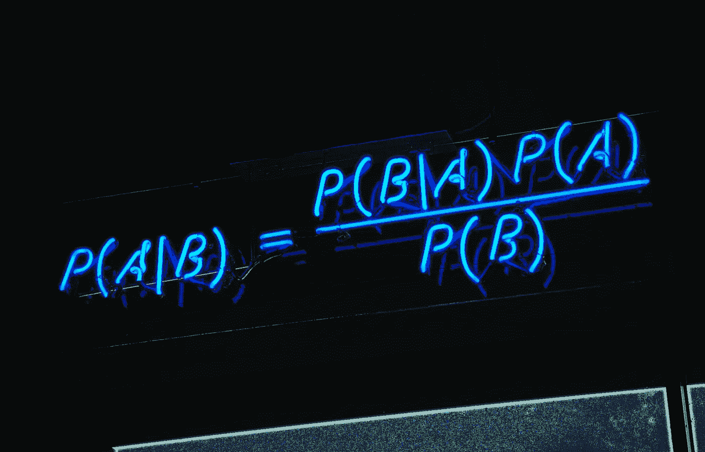
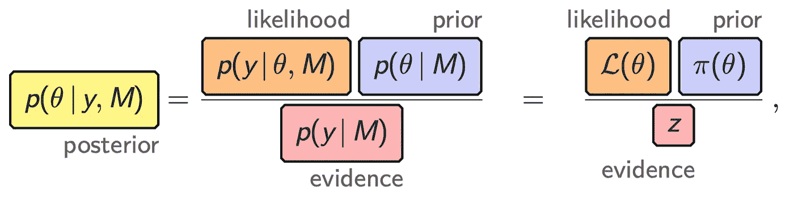
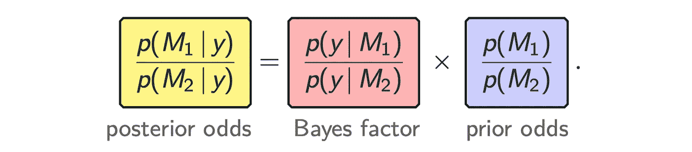
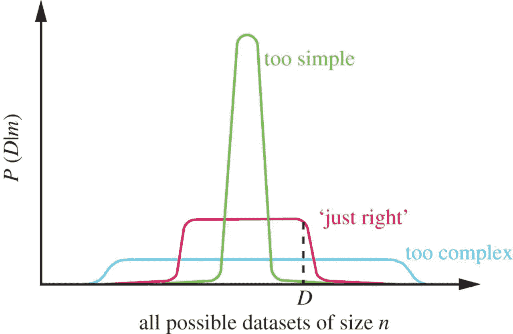
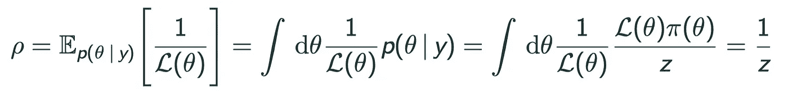
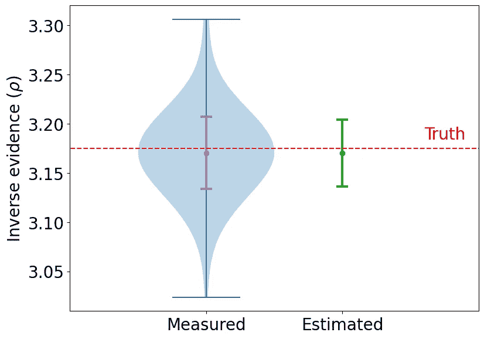
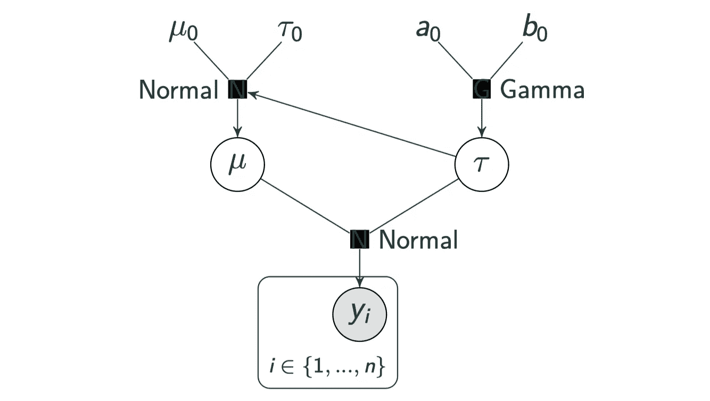
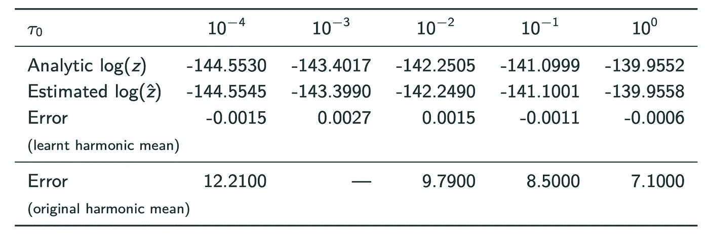

# 贝叶斯模型选择的学习调和均值估计

> 原文：<https://towardsdatascience.com/learnt-harmonic-mean-estimator-for-bayesian-model-selection-47258bb0fc2e>

## 机器学习辅助的边际可能性计算

*贝叶斯模型比较提供了一个原则性的统计框架，用于选择合适的模型来描述观察数据，自然地权衡模型复杂性和拟合优度。然而，它需要计算贝叶斯模型证据，也称为边际可能性，这在计算上具有挑战性。我们提出了学习调和均值估计器来计算模型证据，这是不可知的采样策略，提供了很大的灵活性。*

本文由[阿莱西奥·斯普尔里奥·曼奇尼](https://www.ucl.ac.uk/astrophysics/people/dr-alessio-spurio-mancini)合著。

贝叶斯定理。【[图片来源](https://miro.medium.com/max/3200/1*as2DnWuAUVLSZpS6MvPZxw.png)。]

选择一个合适的模型来描述观察到的数据，这在数据科学的许多领域都是一项重要的任务。贝叶斯形式主义为比较和选择模型提供了一个健壮和有原则的统计框架。然而，执行贝叶斯模型选择是高度计算要求的。

# 贝叶斯模型选择

贝叶斯形式主义是统计推断最常用的方法之一。对于参数推断，对于给定的模型 *M* ，感兴趣的参数𝜽的后验概率分布可以通过贝叶斯定理与数据 *y* 的似然相关

其中先验分布 *p(* 𝜽 *| M)* 编码了我们在观察数据之前对参数的先验知识(关于贝叶斯推理的介绍，请参见[这篇优秀的 TDS 文章](/probability-concepts-explained-bayesian-inference-for-parameter-estimation-90e8930e5348))。

由上述等式的分母给出的*贝叶斯模型证据*与参数估计无关，因为它独立于感兴趣的参数，并且可以简单地视为归一化常数。然而，对于模型比较来说，*贝叶斯模型证据*，也称为*边际可能性*，起着核心作用。

对于模型选择，我们感兴趣的是模型的后验概率，通过贝叶斯定理的另一个应用，它可以写成

因此，为了比较模型，我们需要计算贝叶斯因子，这需要计算考虑中的模型的模型证据。这就是计算挑战的地方。

**贝叶斯模型证据**由参数空间上的似然和先验的积分给出:

因此，证据的计算需要评估多维积分，这在计算上极具挑战性。我们将很快回到这一点，引入学习调和平均估计量来计算模型证据。

值得注意的是，模型证据自然地结合了**奥卡姆剃刀**，权衡了模型复杂性和拟合优度，如下图所示。

贝叶斯模型证据自然地结合了奥卡姆剃刀，权衡了模型的复杂性和拟合优度。【图表来自[Ghahramani(2013)](https://royalsocietypublishing.org/doi/10.1098/rsta.2011.0553)【1】，经许可转载，其灵感来自 [David MacKay](https://en.wikipedia.org/wiki/David_J._C._MacKay) 的类似图表。]

上图[1]中的水平 x 轴代表所有可能的数据集。在贝叶斯形式主义中，模型被指定为数据集上的概率分布，并且由于概率分布的总和必须为 1，所以每个模型都有有限的“*概率预算*来分配。虽然复杂模型可以很好地表示大范围的数据集，但它的预测概率分布很广。这样做，如果不需要这样的复杂性，复杂模型的模型证据将被扣分。

因此，贝叶斯形式主义提供了一种原则性的统计方法来执行模型选择。但是，在实践中应用这种形式并不简单，并且在计算上极具挑战性。

已经开发了各种计算模型证据的方法，这些方法被证明非常成功(例如[2，3，4，5])。然而，这些通常有一些限制，并且很难扩展到更高维度的设置。因此，模型证据的计算远不是一个已解决的问题。在本文中，我们将重点放在调和平均估计量来计算贝叶斯模型的证据。

# 原始调和均值估计量

*原始调和平均值估计值*于 1994 年由牛顿&拉夫特[6]引入，依赖于以下关系:

这表明模型证据(倒数)的估计量如下:

因此，给定来自后验𝜽 *ᵢ* 的样本，可通过[马尔可夫链蒙特卡罗(MCMC)采样](https://en.wikipedia.org/wiki/Markov_chain_Monte_Carlo)生成，从似然的调和平均值中估计模型证据。

调和平均值估计的一个非常好的特性是，它只需要来自后验的样本，这可以通过任何 MCMC 技术产生。相比之下，计算模型证据的替代方法通常与特定的采样方法紧密结合，这可能具有很大的限制性。

然而，在调和平均值估计被提出后，人们立即意识到它可能会灾难性地失败[7]。事实上，最初的调和均值估计被称为[有史以来最差的蒙特卡罗方法](https://radfordneal.wordpress.com/2008/08/17/the-harmonic-mean-of-the-likelihood-worst-monte-carlo-method-ever/)！

为了直观地了解为什么最初的估计会失败，可以从[重要性抽样](https://en.wikipedia.org/wiki/Importance_sampling)的角度来看。估计量可以看作是重要抽样，其中先验扮演重要抽样目标分布的角色，后验扮演抽样密度的角色。

为了使重要性抽样有效，我们通常会考虑比目标更宽的抽样密度。然而，对于调和平均值估计量，我们有相反的情况，因为封装了我们对模型参数的初始知识的先验分布通常比封装了我们对数据观察后的模型参数的知识的后验分布更宽。因此，原始谐波平均值的方差可能变得非常大，并且可能不是有限的，使得估计器在实践中无效。

# 重定目标调和均值估计量

盖尔范德&戴伊在 1994 年【8】引入了*重定目标调和平均值估计器*来解决这个问题。重定目标的谐波均值估计器引入了新的目标分布 *φ* (𝜽)，其可以被设计成避免上述有问题的配置，从而产生以下估计器:

问题仍然是:应该如何选择新的目标分布 *φ* (𝜽)？

已经考虑了各种情况，例如一个[多元高斯函数](https://en.wikipedia.org/wiki/Multivariate_normal_distribution)【9】和[指示函数](https://en.wikipedia.org/wiki/Indicator_function)【10，11】。高斯曲线通常具有太宽的尾部，这会增加估计量的方差。虽然指标函数已被证明是有效的[10]，但它们通常局限于参数空间的一个小区域，因此可能是低效的。

# 学习调和均值估计器

通过考虑最佳目标，人们可以更直观地了解如何设计有效的目标分布，这只不过是标准化后验本身(因为所得的估计量具有零方差)。然而，目标分布必须归一化，后验的归一化常数是模型证据…正是我们试图估计的术语！

虽然最佳目标(标准化后验概率)在实践中不可及，但我们建议使用机器学习来估计近似值:

这就产生了*学习谐波均值估计器*【12】。后验概率的学习近似值不需要非常精确。但是，至关重要的是，它的尾巴不能比屁股更肥。当从后验样本学习目标分布时，我们施加这个约束。此外，我们提出策略来估计学习调和平均估计量的方差，它自己的方差，和其他健全性检查。(进一步的细节可以在我们的相关文章中找到:[麦克尤恩等人 2021](https://arxiv.org/abs/2111.12720)【12】。)

# 数值实验

我们进行了大量的数值实验，通过与贝叶斯模型证据的基础真值进行比较来验证学习的调和均值估计量。

Rosenbrock 函数为评估计算模型证据的方法提供了一个公共基准。在下面的图中，我们显示了学习谐波均值估计器对于这个问题是鲁棒的和高度准确的。

Rosenbrock 例子中学习调和平均值估计量计算的模型证据。执行 100 次实验来恢复估计器的统计的经验估计。不仅估计量本身是准确的，而且估计量的方差估计也是准确的。【原创剧情由作者创作。]

另一个常见的基准问题是法线伽马模型，如下图所示。

正常伽马模型的图形表示。【原图由作者创作。]

在一项审查用于计算模型证据的估计量的研究[13]中，该示例显示了原始调和平均值估计量的病理性故障。在下表中，我们给出了由原始调和平均值估计器和我们学习的调和平均值估计器为该问题计算的模型证据值。我们的学习估计器非常准确，比原始估计器提高了四个数量级。

贝叶斯模型证据值由原始调和平均值估计器和我们学习的调和平均值估计器为正常伽马基准问题计算。我们的学习估计器是高度准确的，提供了比原始估计器高四个数量级的改进(在对数空间中)。

# 谐波代码

学习谐波均值估计器在 [*谐波*](https://github.com/astro-informatics/harmonic) 软件包中实现，该软件包是开源的并可公开获得。遵循软件工程最佳实践，仔细考虑了代码的设计和实现。

因为学习谐波均值估计器只需要来自后验分布的样本，所以*谐波*码对于用于生成后验样本的方法或码是不可知的。也就是说， *harmonic* 与 MCMC 采样技术配合得非常好，MCMC 采样技术通过其系综特性自然地提供来自多个链的样本，例如仿射不变性系综采样器[14]。 [*主持人*](https://emcee.readthedocs.io/en/stable/) 代码【15】提供了仿射不变性集合采样器的出色实现，因此*主持人*是与*谐波一起使用的自然选择。*

# 摘要

贝叶斯模型比较为选择合适的模型来描述观察数据提供了一个强大的原则性统计框架，自然地权衡了模型的复杂性和拟合优度。然而，它需要计算贝叶斯模型证据，也称为边际可能性，这是一个具有计算挑战性的问题。

在本文中，我们回顾了用于计算模型证据的调和均值估计器，包括我们最近提出的*学习调和均值估计器*。学习调和均值估计器对用于产生后验样本的方法是不可知的，这给它提供了很大的灵活性。我们还发布了一个开源代码， [*harmonic*](https://github.com/astro-informatics/harmonic) ，它实现了估算器，我们遵循软件工程的最佳实践，非常关注代码的设计和实现。

目前，我们采用非常简单的机器学习模型和我们学习的调和均值估计器。这些简单的模型将很难扩展到非常高维的环境。我们已经在探索使用更复杂的机器学习模型，这将允许我们扩展到更高维度的设置。

我们希望学习调和均值估计已经可以为贝叶斯模型选择提供一个有用的工具。特别是，由于它是不可知的抽样方法，它允许一个人计算模型证据的大量不同的抽样方法，这在以前是不可能的。

# 参考

[1] [Ghahramani](https://royalsocietypublishing.org/doi/10.1098/rsta.2011.0553) ，*贝叶斯非参数化和概率方法建模，* [菲尔。反式。R. Soc。](https://doi.org/10.1098/rsta.2011.0553) (2013 年)

[2] Skilling，*一般贝叶斯计算的嵌套抽样。* [贝叶斯分析](https://www.mrao.cam.ac.uk/~steve/maxent2009/images/skilling.pdf) (2006)

[3] Feroz & Hobson， *MultiNest:一种用于宇宙学和粒子物理学的高效且健壮的贝叶斯推理工具，* MNRAS (2009)， [arXiv:0809.3437](https://arxiv.org/abs/0809.3437)

[4] Handley，Hobson & Lasenby， *PolyChord:宇宙学的嵌套采样，* MNRAS (2015)， [arXiv:1502.01856](https://arxiv.org/abs/1502.01856)

[5]蔡，McEwen，Pereyra，*高维贝叶斯模型选择的近似嵌套抽样*， [arXiv:2106.03646](https://arxiv.org/abs/2106.03646)

[6] Newton & Raftery，*用加权似然 bootstrap 进行近似贝叶斯推断，*[J R Stat Soc Ser A](http://www.jstor.org/stable/2346025)(1994)

[7] Neal， [*对“用加权似然自助法近似贝叶斯推断”的讨论的贡献*](https://radfordneal.files.wordpress.com/2008/08/newton-raftery-disc.pdf) (1994)

[8]盖尔范德&戴伊，*贝叶斯模型选择:渐近和精确计算*。J R Stat Soc Ser B

[9] Chib，*来自吉布斯产出的边际可能性*，[美国统计协会杂志](https://www.tandfonline.com/doi/abs/10.1080/01621459.1995.10476635#:~:text=In%20the%20context%20of%20Bayes,draws%20from%20the%20posterior%20distribution.) (1995)

[10] Robert & Wraith，贝叶斯模型选择的计算方法，美国物理学会会议论文集(2009)， [arXiv:0907.5123](https://arxiv.org/abs/0907.5123)

[11] van Haasteren，【MCMC 方法的边际似然计算，载于[引力波探测和脉冲星计时阵列数据分析](https://link.springer.com/book/10.1007/978-3-642-39599-4) (2014)

[12]麦克尤恩，沃利斯，普莱斯，多切蒂，*机器学习辅助贝叶斯模型比较:已学习调和均值估计器* (2021)，[arXiv:2111.12720](https://arxiv.org/abs/2111.12720)

[13]弗列尔和怀斯，*评估证据——一项审查*，尼尔兰迪卡统计局(2012 年)， [arXiv:1111.1957](https://arxiv.org/abs/1111.1957)

[14] Goodman & Weare，*仿射不变性集合采样器，* [应用数学与计算科学通讯](https://msp.org/camcos/2010/5-1/camcos-v5-n1-p04-p.pdf) (2010)

[15]福尔曼-麦基，霍格，郎，古德曼，*主持人:MCMC 汉默，* PASP (2013)， [arXiv:1202.3665](https://arxiv.org/abs/1202.3665)