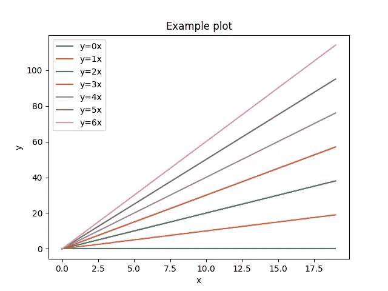
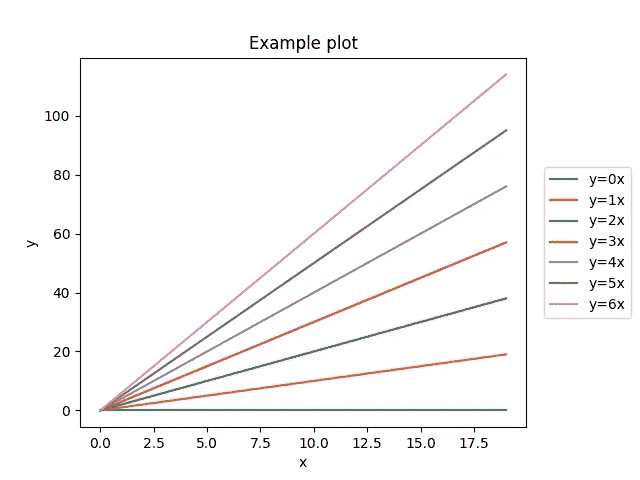
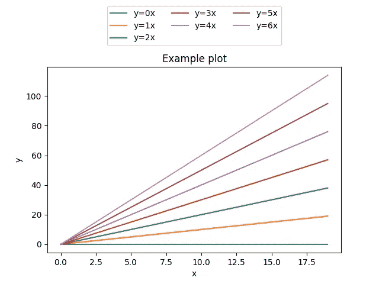
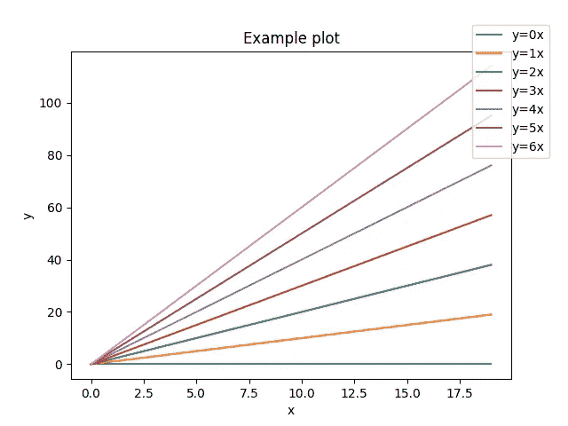

# 如何在 Matplotlib 中将图例放置在绘图之外

> 原文：<https://towardsdatascience.com/legend-outside-the-plot-matplotlib-5d9c1caa9d31>

## 展示如何使用 matplotlib 和 Python 将图例放置在绘图之外


由 [KOBU 机构](https://unsplash.com/@kobuagency?utm_source=unsplash&utm_medium=referral&utm_content=creditCopyText)在 [Unsplash](https://unsplash.com/s/photos/draw?utm_source=unsplash&utm_medium=referral&utm_content=creditCopyText) 拍摄的照片

## 介绍

当用`matplotlib`绘制图形时，重要的是确保包含图例，以便读者能够区分 y 轴上显示的数据。图例通常以方框的形式包含在绘制的图表中，它可以用作将颜色或形状映射到特定数据条目的字典。

在今天的简短教程中，我们将展示如何将图形的图例放置在`matplotlib`的绘图区域之外。当要显示的图形可能包含太多信息(甚至在四个角上)时，通常需要这样做。在这种情况下，将图例放在外面最终会使您的图表可读性更好。

更具体地说，我们将展示如何

*   将图例放置在图外(以及任何需要的位置)
*   稍微把传说推到情节之外
*   更改放置在图外的图例的形状(例如，水平)

首先，让我们创建一个示例图，我们将在整个教程中使用它来演示一些概念，并了解如何将图例放置在绘图区域之外的几个不同位置。

```
import numpy as np
import matplotlib.pyplot as plt# Create some sample data
data = np.arange(20)# Create a matplotlib figure
fig, ax = plt.subplots()# Create multiple plots 
for i in range(7):
    ax.plot(data, i * data, label=f'y={i}x')# Set title and labels
ax.set_title('Example plot')
ax.set_xlabel('x')
ax.set_ylabel('y')# Add a legend
ax.legend()# Visualize the final plot
plt.show()
```

下面分享了上面代码的输出图



matplotlib 示例图—来源:作者

注意，默认情况下，`matplotlib`会根据可视化的数据将图例(如果有)放置在最佳位置。

## 将图例放置在图外

现在，为了将图例放置在绘图之外(假设在右侧的中心)，我们实际上需要做两件事。

首先，我们需要缩小图的宽度(以便图例适合图形)。然后我们可以使用`bbox_to_anchor`参数，它为手工放置图例提供了一定程度的控制。

> **bbox_to_anchor**
> 
> 用于与*锁定*一起定位图例的盒子。默认为`**axes.bbox**`(如果作为方法调用`[**Axes.legend**](https://matplotlib.org/stable/api/_as_gen/matplotlib.axes.Axes.legend.html#matplotlib.axes.Axes.legend)`)或`**figure.bbox**`(如果`[**Figure.legend**](https://matplotlib.org/stable/api/figure_api.html#matplotlib.figure.Figure.legend)`)。该参数允许任意放置图例。
> 
> Bbox 坐标在由 *bbox_transform* 给出的坐标系中进行解释，根据调用的`legend`不同，使用默认的变换轴或图形坐标。
> 
> 如果给定了一个 4 元组或`[**BboxBase**](https://matplotlib.org/stable/api/transformations.html#matplotlib.transforms.BboxBase)`，那么它指定放置图例的 bbox `(x, y, width, height)`。将图例放在坐标轴(或图形)右下象限的最佳位置。
> 
> — [matplotlib 文档](https://matplotlib.org/stable/api/legend_api.html)

```
import numpy as np
import matplotlib.pyplot as plt# Create some sample data
data = np.arange(20)# Create a matplotlib figure
fig, ax = plt.subplots()# Create multiple plots 
for i in range(7):
    ax.plot(data, i * data, label=f'y={i}x')# Set title and labels
ax.set_title('Example plot')
ax.set_xlabel('x')
ax.set_ylabel('y')# Add a legend
pos = ax.get_position()
ax.set_position([pos.x0, pos.y0, pos.width * 0.9, pos.height])
ax.legend(loc='center right', bbox_to_anchor=(1.25, 0.5))# Visualize the final plot
plt.show()
```



图例位于地块外部的示例地块-来源:作者

## 更改放置在图外的图例的形状

现在让我们假设我们想把图例放在图的外面，但是这次是在顶部位置。更有意义的做法是改变图例的形状，使其水平显示，而不是垂直显示，这样实际绘图可以占用更多的区域。

再一次，我们将不得不缩小图的高度，这一次是为了给放置在图的顶部区域的图例留出一些空间。然后，我们可以将图例放置在所需的位置，还可以更改列数，以便它可以水平显示。

```
import numpy as np
import matplotlib.pyplot as plt# Create some sample data
data = np.arange(20)# Create a matplotlib figure
fig, ax = plt.subplots()# Create multiple plots 
for i in range(7):
    ax.plot(data, i * data, label=f'y={i}x')# Set title and labels
ax.set_title('Example plot')
ax.set_xlabel('x')
ax.set_ylabel('y')# Add a legend
pos = ax.get_position()
ax.set_position([pos.x0, pos.y0, pos.width, pos.height * 0.85])
ax.legend(
    loc='upper center', 
    bbox_to_anchor=(0.5, 1.35),
    ncol=3, 
)# Visualize the final plot
plt.show()
```



图例水平放置在图外的示例图-来源:作者

## 将图例稍微移出剧情

这里的另一种可能性是，稍微将传说推到情节之外，使一半落在情节本身之内。这可能是最简单的方法，因为我们只需要使用`bbox_to_anchor`参数将图例与`loc`一起放置。

```
import numpy as np
import matplotlib.pyplot as plt# Create some sample data
data = np.arange(20)# Create a matplotlib figure
fig, ax = plt.subplots()# Create multiple plots 
for i in range(7):
    ax.plot(data, i * data, label=f'y={i}x')# Set title and labels
ax.set_title('Example plot')
ax.set_xlabel('x')
ax.set_ylabel('y')# Add a legend
ax.legend(loc='upper right', bbox_to_anchor=(1.1, 1.1))# Visualize the final plot
plt.show()
```



图例被稍稍推出图外的示例图—来源:作者

## 最后的想法

在今天的简短教程中，我们讨论了在图表中包含图例的重要性。此外，我们展示了如何在`matplotlib`和 Python 中将图例放置在情节之外。

重要的是要记住，通过将图例放置在图形之外，可以使您的绘图更具可读性，特别是当它们超载了太多信息，甚至在绘图区域的四个角包含线条或任何其他信息时。

[**成为会员**](https://gmyrianthous.medium.com/membership) **阅读媒体上的每一个故事。你的会员费直接支持我和你看的其他作家。你也可以在媒体上看到所有的故事。**

<https://gmyrianthous.medium.com/membership>  

**相关文章你可能也喜欢**

</save-plots-matplotlib-1a16b3432d8a>  </change-font-size-matplolib-480630e300b4>  </change-figure-size-matplotlib-11a409f39584> 