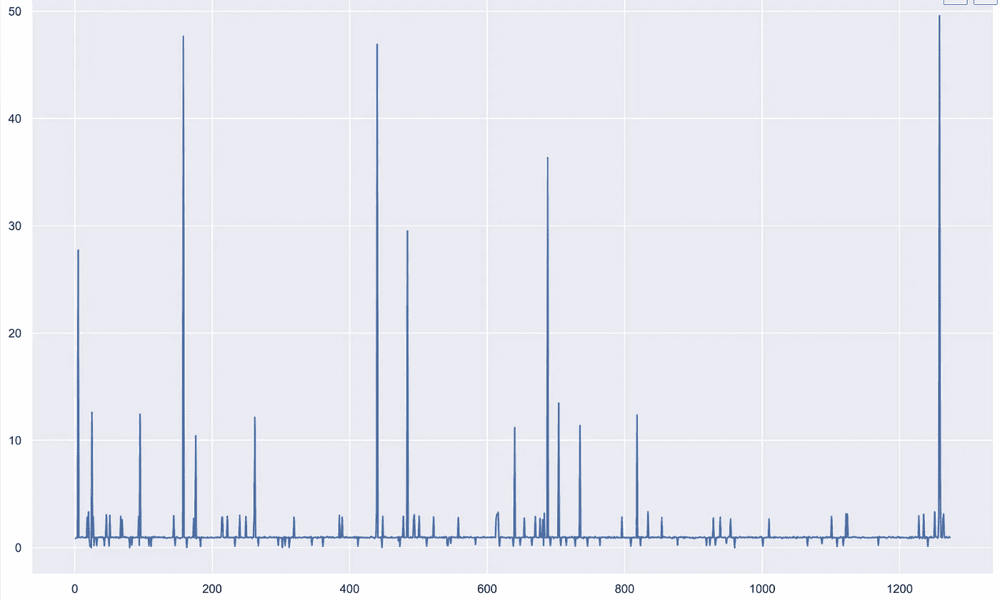
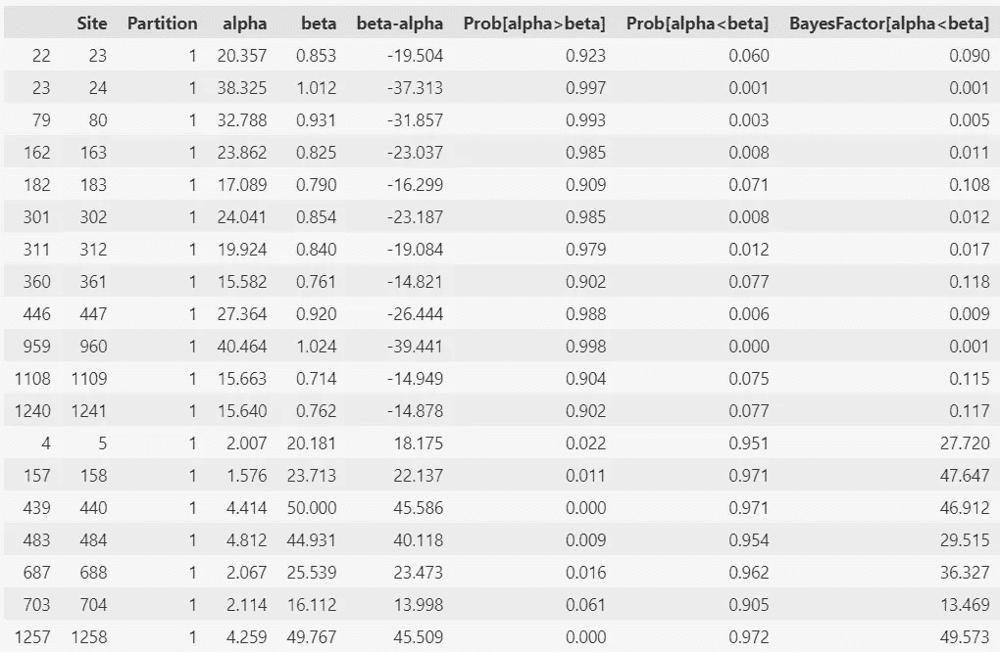
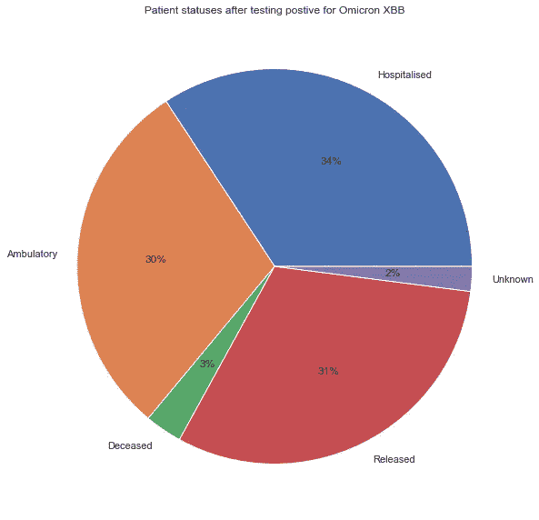

# 即使在热爱大数据的领域，少即是多

> 原文：<https://towardsdatascience.com/less-is-more-even-in-the-field-that-loves-big-data-699798b700ac>

## **在生物信息学中，有时“精心制作”的小数据可以为我们提供与大数据见解相当的强大见解**


由[马库斯·斯皮斯克](https://unsplash.com/@markusspiske?utm_source=medium&utm_medium=referral)在 [Unsplash](https://unsplash.com?utm_source=medium&utm_medium=referral) 上拍摄的照片

大约在去年的这个时候，奥米克隆作为主要的严重急性呼吸综合征冠状病毒-2(新型冠状病毒)变种已经占领了世界。在今年的过程中，一些 Omicron 亚变异体通过突变和某些情况下的重组交换了优势。新型冠状病毒奥米克隆 XBB 亚变异体(在本文中简称为奥米克隆 XBB)就是这样一个重组亚变异体的例子，它在 2022 年 8 月以其高传播性而闻名。

然而，我写这篇文章的主要动机不是调查 Omicron XBB 中的进化，而是证明在生物信息学中，像其他数据科学子领域一样，在某些情况下**精心制作的**小数据可以产生与大数据相当的洞察力。在撰写本文时，大约有 2 300 个 Omicron XBB 的全基因组序列上传到了 GISAID 上。作为筛选序列的一种方式，我选择了以下序列:

1.完成

2.大视野

3.以病人身份。

这将我的序列缩小到 414 个可供下载的高质量序列。

一旦我有了高质量的全基因组序列，就到了推断见解的时候了。我通常使用下面的 6 个 Python 包，从生物信息中获得尽可能多的见解。

```
# I'm a fan of importing all the packages I'll use in the first cell
# Useful for pinpointing which package is not executing properly

import numpy as np
import pandas as pd
import Bio     #Biopython
from collections import Counter
import matplotlib.pyplot as plt
import seaborn as sns
```

我使用 **Biopython (Bio)** 来解析/读取 fasta 文件中的核苷酸序列，我使用 **print** 函数来确认内容并浏览文件中的内容。fasta 序列存储在 **omicron** 变量中。

```
from Bio import SeqIO
# Biopython is useful for loading biological sequence

omicron = SeqIO.parse("Omicron XBB Complete Sequences.fasta", 'fasta')

for seq_record in omicron:

    print(seq_record.id)            #taking a glimpse of what's in the file
    print(repr(seq_record.seq))
```

在这项研究中，我选择集中研究编码刺突蛋白的刺突基因。刺突蛋白是冠状病毒进入宿主细胞的关键。此外，它还演示了生物信息学家如何从生物序列中切割出所需的片段。

因为完整的序列具有不同数量的核苷酸碱基，所以使用了一个近似的刺突基因座位，所有的刺突基因都可以整合到该座位上，即使末端变细。

```
from Bio import SeqIO
# I had to recall the Biopython package, for some reason it could not work without being recalled

#THis cell is slicing the approximate spike genes from SARS-CoV-2 OmicronXBB whole genome sequences.
omicron_spike = []

for seq_record in SeqIO.parse("Omicron XBB Complete Sequences.fasta",'fasta'):
    spike_gene = seq_record[21500:25499]
    omicron_spike.append(spike_gene)

SeqIO.write(omicron_spike,'omicron_spike.fasta','fasta') 
# writes omicron_spike  contents to a fasta file with name provided.
```

1.  然后使用 EBI 网络服务器上可获得的 Clustal 比对近似的刺突序列。

2.用于删除冗余/重复序列的 Jalview。

3.Mega X 用于编辑比对，使用 GISAID Spike Ref Seq 作为移除锥形末端的指南。

4.现在干净的刺突基因文件通过 Datamonkey 网络服务器上传到 FUBAR 上用于选择分析。

5.分析之后，生成的结果表被导出为。csv 文件。

## **选择调查**

的。然后使用 pandas 加载从 FUBAR 导出的 csv 文件进行进一步分析。只是对这些术语的含义进行了简要的分析:

1.位点=三联体编码的位点，三联体编码氨基酸，因此它相当于氨基酸位置。

2.α=同义替换率，相当于编码的氨基酸改变的频率导致编码的氨基酸没有改变。

3.β=同义替换率，相当于编码的氨基酸改变导致编码的氨基酸改变的频率。

其他参数将 alpha 和 beta 值联系起来，为我们提供数据集中观察到的进化模式的更多细节。

```
selection_table = pd.read_csv('OmicronXBBdatamonkey-table.csv')
selection_table
```

通常阴性/纯化选择不会给我们提供足够的信息，除非它是研究的目的，因为我们正在观察稳定其构象的某些位点。由于这种稳定性，某些位点非常适合设计配体/药物，因为它们很少改变。

我最感兴趣的是积极/适应性选择，因为它让我们了解病毒是如何进化的，当某个突变在病毒群体中逐渐出现时，它应该比没有突变的病毒更有优势。

如果对负选择感兴趣，可以取消涉及负选择的代码的注释

```
sites_positive = []
# sites_negative = []

for idx, val in enumerate(selection_table['beta-alpha']):
    if val > 1:
        sites_positive.append(idx)

    else:
        pass

number_of_positive_sites = str(len(sites_positive))
# number_of_negative_sites = str(len(sites_negative))

print(f'{number_of_positive_sites} sites show adaptive selection')
# print(f'{number_of_negative_sites} sites show purifying selection')
```

## **正选择网站的贝叶斯因子**

我喜欢用贝叶斯因子来理解正选择，因为它给了我强正选择位点的突出峰。

```
site = selection_table['Site']
bayes_factor = selection_table['BayesFactor[alpha<beta]']

plt.figure(figsize=(16,10), dpi=1200)
ax = plt.axes()
ax.plot(site, bayes_factor)
plt.show;
```



显示强阳性网站的网站的贝叶斯因子(图片由作者提供)

## **显示强阳性和强阴性选择的位点**

上图显示了位点的一般趋势，将强阳性选择显示为尖峰，将阴性选择显示为小/平峰。

根据 FUBAR 的说法，大于 0.9 的后验概率显示了强阳性或强阴性选择的证据，这取决于所选择的特征，因此下面的代码块有助于我们找到该模式。

```
strong_beta = selection_table['Prob[alpha<beta]']
strong_alpha = selection_table['Prob[alpha>beta]']
# The Posterior probability where alpha (synonymous rates) < beta (non-synonymous rates/var(strong_beta)) is more than 0.9 were selected as evidence of strong positive selection 
# The Posterior probability where alpha (synonymous rates) > beta (non-synonymous rates/var(strong_alpha)) is more than 0.9 were selected as evidence of strong negative selection 

strong_positive_selection = selection_table.loc[strong_beta > 0.9] 
strong_negative_selection = selection_table.loc[strong_alpha > 0.9]

# print(Counter(strong_positive_selection))

#Then we combine the two strong_selection dataframes.
strong_selection_dfs = [strong_negative_selection,strong_positive_selection]
strong_selection_sites = pd.concat(strong_selection_dfs)
strong_selection_sites
```



显示强阴性和强阳性选择的网站(图片由作者提供)

开始讨论上面表格和图表中显示的趋势和数字将会是一篇有价值的文章，并且会偏离本文的主旨。

## **Omicron XBB 对患者的影响**

嗯，从我们的数据中获得数字和趋势对我们来说是一个漫长的旅程，但是到目前为止，产生的信息对少数知道我们是如何做到这一点的人来说是很酷的。如果它对我们理解新冠肺炎没有帮助的话，它会变成更多的爱好，而且爱好不会让我们资助 lol。

下一个简短的部分帮助我们理解这些突变是如何对健康产生影响的。

请记住，用于选择这些序列的过滤器之一是患者数据，我将根据用例演示使用这些数据的方法之一。

我选择了患者状态，但还有其他字段需要研究，如性别、位置、收集日期等其他参数。

患者数据文件下载为. tsv 文件(制表符分隔值),我发现很难使用，所以我将其转换为。使用在线工具生成 csv 文件(逗号分隔值)。如果脱机工作，MS Excel 也可以进行转换，只是对我来说需要更长的时间。

```
patient_data = pd.read_csv('Omicron XBB Patient Data.csv')
patient_data
```

```
patient_status  #some of the fields can be combined as they mean the same to reduce noise
```

一些用于描述患者状态的不同术语意思相同，这是因为这些序列是由世界各地不同的实验室生成和上传的。

所以我不得不用手工的方式去做，因为我找不到更好的方法来使用代码。同样，如果我处理数百万的患者条目，这将会非常耗时。

```
generalised_patient_status = ('Hospitalised','Ambulatory','Deceased','Released','Unknown')
patient_numbers = (135,117,12,122,8) 

labels = list(generalised_patient_status)
size = list(patient_numbers)

sns.set()
plt.figure(figsize=(16,10))
plt.pie(size, labels=labels, autopct='%1.0f%%');
plt.title('Patient statuses after testing postive for Omicron XBB')
plt.figure(dpi=1200); #for image quality
```



患者状态(图片由作者提供)

因此，从上面生成的饼状图可以清楚地看出，34%的 Omicron XBB 患者住院，3%死于 Omicron XBB，31%出院。感染 Omicron XBB 的新冠肺炎患者中有 30%是门诊患者或未住院患者。

正是从这些统计数据中，医疗专业人员可以推断出 Omicron XBB 的致命性或健康负担，这有助于他们采取健康措施来遏制该病毒。

假设来说，随着大数据或数百万生物序列的使用，由于大量样本可供选择，洞察的准确性有所提高。

然而，随着数据量的增加，寻找单个的“未知”或错误变得繁琐而耗时。通过这些未知或误差的积累，数据积累了噪声，这可能会破坏下游过程中使用的算法的平稳执行。

除了顺利执行精心制作的小数据，它还可以更快地生成见解，以便您可以有更多的时间来分析您的数据，从中提取有用的信息。唯一要付出的代价就是精心制作。