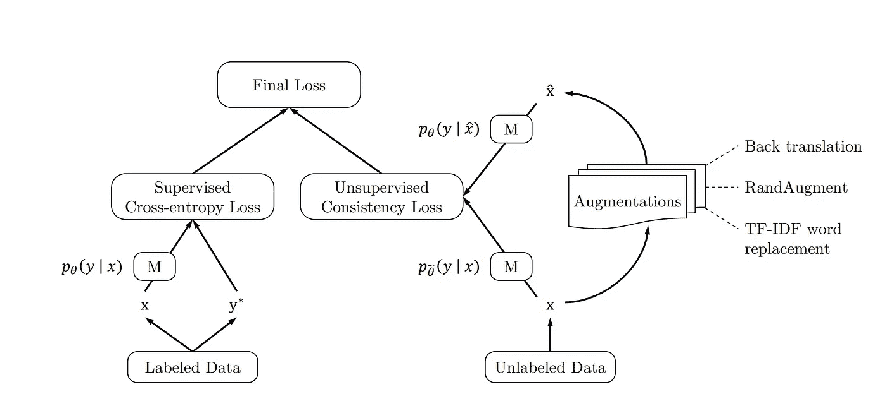

# 少即是多:带标签的数据不再重要

> 原文：<https://towardsdatascience.com/less-is-more-labeled-data-just-isnt-as-important-anymore-7cf3b403969>

## *对半监督学习的新研究表明，较少标记的数据实际上使机器学习算法更强大*

我过去总是认为*数据*本质上是平静有序的——一组准备处理的整齐包装的信息。我想大多数没尝过现实世界混乱滋味的人也会这么认为。专业人士(或者，实际上，任何与数据打交道的人)都知道，数据的流动性和无定形性要大得多。很少有数据被有序地组织起来，并带有一个漂亮的标签。事实上，

> 大多数时候，数据是未标记的、非结构化的和混乱的。

不幸的是，今天广泛使用的大多数机器学习算法都严重依赖于标记数据和完全监督的算法。数据科学家和数据工程师花费了大量的时间和精力来对抗熵并产生这些干净的数据集，我们已经习惯于在像 [Kaggle](https://kaggle.com) 这样的网站上看到这些数据集。

然而，事实证明，带有故意噪声注入的半监督方法可能比任何监督学习方法都好，即使在使用**明显较少标记的数据**时也是如此。

# 半监督学习

监督学习需要大量的标记数据，而我们大多数人都没有这些数据。半监督学习(SSL)是一种不同的方法，它结合了无监督和监督学习，以利用各自的优势。下面是一个可能的过程(称为 SSL 和“域相关数据过滤”):

> 1.训练一个模型( ***M*** )上标注的数据(***【X】****)*和真实标签(***【Y】****)。
> 2*2。计算误差。
> 3。对未标记的数据应用***M***(***【X’****)*“预测”标签(***【Y’****)*。
> 4。从(2)中取出任何高可信度的猜测，并将它们从***X’***移动到 ***X*** *。* 5。重复一遍。

随着时间的推移，标注数据集的大小会增加，并为模型提供相当多的数据。这已经令人印象深刻，因为**未标记的数据远比标记的数据**便宜和丰富，但 SSL [并不能保证是一个好的解决方案](https://www.cs.cmu.edu/~aarti/pubs/NIPS08_ASingh.pdf) (Singh，Nowak，& Zhu)。然而，一项新的研究表明，我们可以改变一些事情来提高 SSL 的性能。

如果我告诉你，这个 SSL 的新版本几乎优于监督学习，只有一小部分必要的标记数据，会怎么样？

# 无监督数据增强(UDA)

如果你的孩子只从你告诉他们的东西中学到东西，很有可能在很多情况下他们会完全迷失。机器学习算法也是如此。事实证明，让算法处理棘手的数据会让它们在以后变得更加健壮。这些“棘手的数据”也可以被称为“噪音”加强机器学习算法的一个真正有用的技术是故意向数据添加噪声(在本文中称为“噪声注入”或“数据扩充”)。在 CMU 和谷歌大脑团队在[的一篇新论文中，一个关心“噪音质量”的新 SSL 框架也被注入。以下是总体模型的流程图:](https://arxiv.org/pdf/1904.12848.pdf)



转载自“用于一致性训练的无监督数据增强”(谢等。艾尔。2020).

以下是同一流程图的分步格式:

> 1.在标签数据( ***X*** )和真实标签( ***Y*** )上训练一个模型( ***M*** )。
> 2。计算监督误差。
> 3。对未标记的数据应用***【M】*****(***X’****)***“预测”标签(***Y’****)*。
> 4。巧妙的将噪声引入到*产生***【X】***。
> 5。将 ***M*** 应用于未标记的、被扰乱的数据(***【X】****)*“预测”标签(***【Y】****)*。
> 6。通过比较***Y’***和***Y’***计算无监督误差。
> 7。使用(2)和(6)计算总误差。
> 8。从(3)中取出任何高置信度的猜测，并将它们从 ***X* '** 移动到 ***X*** *。
> 9。*重复。*****

*****在上面的步骤过程中，有很多方法可以做到(4)。一种有趣的方法叫做反向翻译。想想这句话:*****

> *****“**标注的**数据不如**未标注的**数据便宜，因此**是过去的**遗迹**。”*******

***我可以把这个句子转换成另一种语言，然后再转换成英语。这是我用挪威语作为中间媒介的结果。***

> ***“**标明的**数据不像**未标明的**数据那么便宜，因此**已经是过去的**了。”*******

***现在我们添加了噪声。细微的变化，但对一个算法来说是天壤之别。***

# ***结果&标签数据的困境***

***前面提到的论文对上一节中概述的方法进行了压力测试。在文本分类数据集上使用 [Google 的 BERT (Large)算法](https://github.com/google-research/bert)，他们生成了以下结果，其中 *n* 是使用的标记样本的数量):***

```
 *+ — — — — + — — — — — — — —  + — — — — — — — — — — — +
       | **Dataset** | **Supervised Error** | **Semi-Supervised Error** |
       + **— — — —** + **— — — — — — — —** + **— — — — — — — — — — —** +
       | *IMDb*    | 4.51  (n = 20k)  | 4.78 (n = 20)         |
       | *Yelp-2*  | 1.89  (n = 560k) | 2.50 (n = 20)         |
       | *Yelp-5*  | 29.32 (n = 650k) | 33.54(n = 2.5k)       |
       | *Amazon-2*| 2.63  (n = 3.6m) | 3.93 (n = 20)         |
       | *Amazon-5*| 34.17 (n = 3.0m) | 37.80(n = 2.5k)       |
       | *DBpedia* | 0.64  (n = 560k) | 1.09 (n = 140)        |
       + — — — — + — — — — — — — —  + — — — — — — — — — — — +*
```

***这些结果表明，这种特殊的 **SSL 方法在处理一小部分标记数据**时几乎与监督方法处理所有标记数据时一样好！***

***至于带标签的数据的有用性——自然，如果带标签的数据是可用的，你就使用它。但是有了这样的结果，任何创建有序、结构化、有标签的数据的基本原理正在迅速消失，特别是因为无标签数据可以广泛获得并且非常便宜(计算、时间和精力方面)。未来是不可预测的(也是未标记的)，但我们正在慢慢获得捕捉它的必要工具！***

****本帖原文可在* [*这里*](https://abhiraghunathan.com/posts/unsupervised_data_augmentation.html) *找到。****