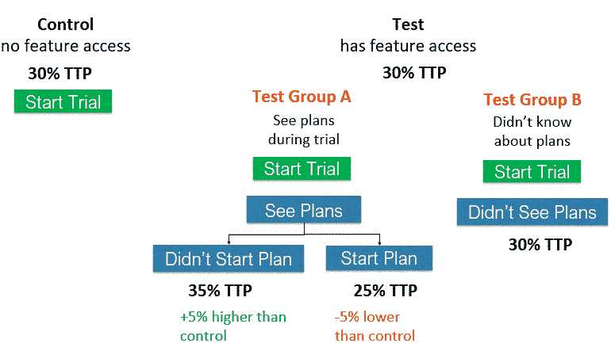

# 从失败的产品实验中吸取的教训

> 原文：<https://towardsdatascience.com/lessons-learned-from-failed-product-experiments-6de39b5eac0e>

## 没有统计学意义仍然可以产生有价值的见解

照片由 [Pexels](https://www.pexels.com/photo/colorful-heart-lollipops-9852065/?utm_content=attributionCopyText&utm_medium=referral&utm_source=pexels) 的 [Towfiqu barbhuiya](https://www.pexels.com/@towfiqu-barbhuiya-3440682?utm_content=attributionCopyText&utm_medium=referral&utm_source=pexels) 拍摄

当我第一次成为一名[产品分析师](/my-experience-as-a-product-data-analyst-3d01748bc6ea)时，我以为产品实验与我作为营销数据分析师所做的评估相似——但我错了。当营销 A/B 测试在统计上不显著时，我们继续进行测试，但是在产品 A/B 测试之后，我意识到即使没有统计显著性的测试也能提供有价值的见解。今天，我想回顾一下产品 A/B 测试表现不尽如人意的例子和经验教训。

# 意外的结果

## 假设

我们推出了一个新的膳食计划功能，假设它会增加付费(TTP)的转化率。更高的 TTP 费率意味着更多的用户将转化为付费用户，从而增加收入。测试分两组进行，每组 50 人，测试组可以访问新功能，而控制组不能访问。

## 结果

这项新功能并没有显示出整体 TTP 转换率的提高。这是违反直觉的，因为计划功能是多年来用户最常要求的功能，我期望看到更高的 TTP 率。我决定，在将结果提交给产品经理之前，测试小组需要进一步分析，以了解为什么 TTP 比率是相似的。

我将测试组分成不同的部分，看看 TTP 比率是否有明显的差异。A 组是在开始试用后知道该计划功能的用户，B 组是不知道该功能的用户。我进一步将 A 组分为开始计划的用户和没有开始计划的用户。

作者创建的产品实验细分

在将测试组分成如上所示的几个部分后，我可以看到 TTP 率的显著差异。B 组的 TTP 率与对照组相同，为 30%，因为这些用户不知道存在与对照组类似的计划功能。从未开始计划的 A 组用户有 35%的 TTP 率，相比之下，开始计划的用户有 25%的 TTP 率。为什么这两个 A 组市场有如此大的差异？

由于计划功能长达 28 天，用户忘记了它，也没有体验到如果他们完成了计划会产生的影响。当我们看到低计划完成率时，这一点得到了支持。由于这种糟糕的用户体验，用户在试用结束后不太可能付费是有道理的。对于产品经理来说，这是一个很有价值的见解，可以优先考虑计划通知，以提醒用户完成他们的每周任务，这将转化为更高的完成率和更高的 TTP 率。

现在，为什么知道计划但没有尝试的 A 组用户有更高的 TTP 率？我们假设这表明用户喜欢计划功能，尽管他们没有尝试，但感知价值说服他们在试用结束后付费，他们可以稍后尝试计划。请记住，这是用户高度要求的功能。

## 外卖食品

*   测试结果并不总是看起来那样。如果结果出乎意料，请尝试通过不同的操作对用户进行细分，以确定转化率的任何差异。这可以为产品经理提供可操作的见解，因为在本例中，添加计划通知将提高计划完成率，从而提高 TTP 率。
*   检查是否有可能影响测试结果的外部因素。对于 A/B 测试，我们与产品营销部门合作，推迟向用户通知计划功能，直到我们完成测试。这可能不是你所支持的测试的情况，你应该注意可能的影响。

# 无意的副作用

## 假设

过去的分析显示，与没有登录的用户相比，在注册应用程序后登录食物的用户更有可能回来。在注册过程中增加了一项更改，鼓励用户在注册过程完成后记录食物，以提高用户参与度。

## 结果

该测试运行了 4 个月，但没有显示出用户参与度的任何改善，因此被关闭。大约在同一时间，我们开始看到审判开始下降。我支持订户分析，但不知道这个测试。我的团队不知道为什么试验在减少，直到产品经理假设这可能是由参与度测试引起的。

一旦我们再次打开测试，测试开始回到先前的水平。由于测试已经进行了 4 个月，我们将测试增加归因于业务的增长，而不是一个根本不应该影响测试的测试。结果是产品经理将升级屏幕切换到了测试变体注册过程的另一部分，这导致了试用开始增加。屏幕变化不是故意的，但这是一个有价值的见解，我们知道在哪里放置升级信息，以增加试用开始。

## 外卖食品

*   测试可能会对产品经理没有用来衡量成功的其他 KPI 产生意想不到的影响。考虑测试可能影响的所有 KPI，以确保对它们没有负面影响。在我的例子中，参与度没有变化，但对审判开始产生了显著的积极影响。
*   确认控制和测试变量具有相同的元素，除了被测试的变化。我们的测试很幸运，意想不到的副作用导致试验开始增加，但它可能很容易反过来导致减少。
*   即使你不支持，也要注意计划中的实验。与产品经理讨论他们的产品路线图，并找出他们计划实施的计划。如果我与订阅之外的产品经理交谈，我可能会更早地了解到参与度测试。

# 最后的想法

虽然一开始很有挑战性，但作为一名产品分析师，我学到了很多关于产品 A/B 测试的知识。无论您是产品新手还是正在考虑成为产品分析师，我希望这能让您在 A/B 测试体验上有一个良好的开端。感谢阅读！

## 你可能也会喜欢…

     [## 关于 A/B 测试，产品分析师应该知道什么

towardsdatascience.com](/what-product-analysts-should-know-about-a-b-testing-a7bdc8e9a61)