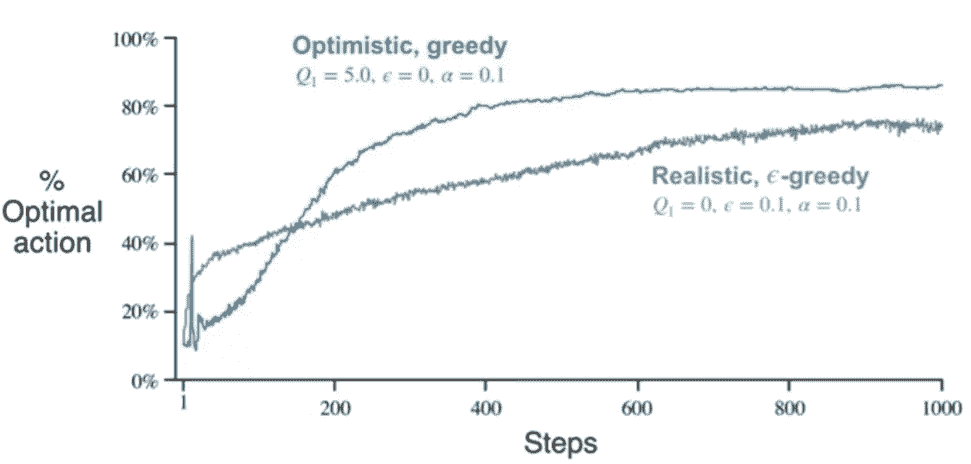
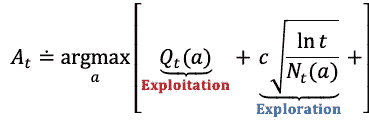
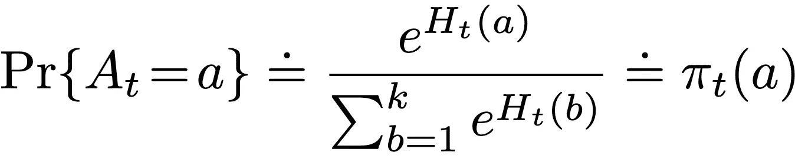
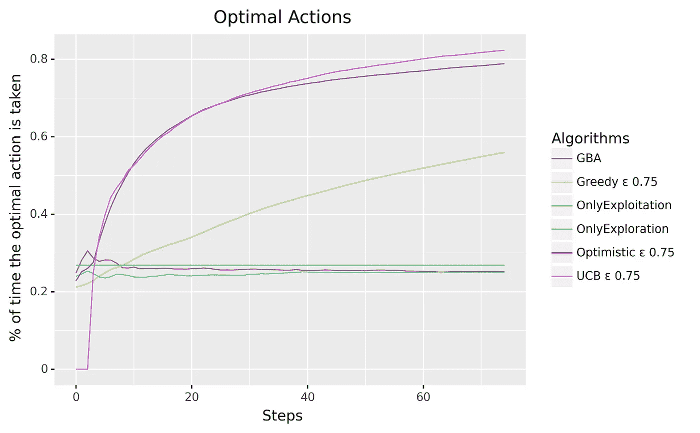
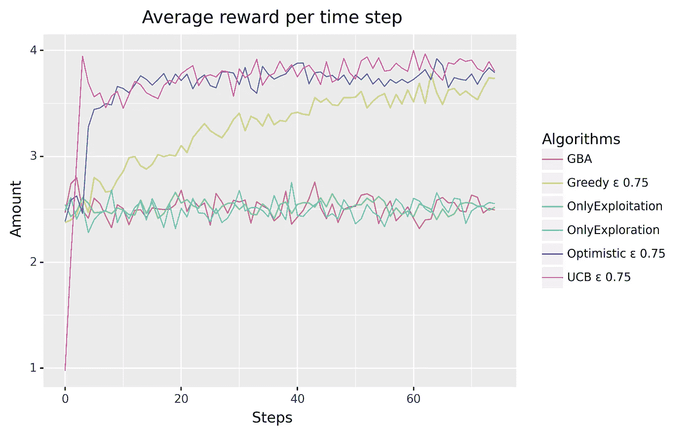

# 让数据科学为你做出选择

> 原文：<https://towardsdatascience.com/let-data-science-make-choices-for-you-5702bd759803>

## 多臂强盗入门

照片由[上的](https://unsplash.com/@burst?utm_source=unsplash&utm_medium=referral&utm_content=creditCopyText)爆裂[未爆裂](https://unsplash.com/?utm_source=unsplash&utm_medium=referral&utm_content=creditCopyText)

想象一下，你必须从一组结果不确定的互斥选项中做出多个选择。你如何最大化你的收益？

反复的过程，一次又一次的选择，不是抽象的东西，而是我们每天都在做的事情:我们吃什么？给定时间和交通状况，我们走哪条路回家？我们如何最大限度地减少花在路上的时间？我应该去我的城市的什么餐馆？

这些问题由一类称为**多臂强盗(MAB)**的算法解决，这是**强化学习** (RL)算法的一个子领域，旨在通过在没有监督的情况下执行行动，随着时间的推移做出更好的选择。

让我们一起来回顾一下最常见和最简单的算法，从具体的例子开始，逐步发展到数学形式化。在我最近对 RL 感兴趣之前(近两年)，我对它知之甚少。在博士期间，我学习的书籍主要集中在监督和非监督学习上，强化学习要么被简单提及，要么被彻底抛弃。只是在最近几年，很大程度上由于深度思维的创新，RL 正在成为一个更相关和研究的领域，我个人对此非常感兴趣。MAB 算法是这个迷人领域的第一步，我想你个人会对它们很感兴趣，而且很快也会变得专业。

# 代理人、奖励和环境

在强化学习中，我们有一个代理( *A* )，它必须在一个环境中执行*动作*。通过采取行动，代理获得*奖励*或受到处罚，随着时间的推移，确保最大*奖励*与特定*环境*中代理的最佳行为相关联。没有训练数据——代理通过反复试验和交互过程来学习。

这个领域中最简单的问题之一(多臂强盗问题的例子就是由此而来)是吃角子老虎。开始游戏需要支付一定的费用，玩家从一组 *n* 选项中选择一个手柄即可获得奖励。游戏的目的是选择正确的杠杆，最大化总回报，这可以通过使用 MAB 算法来实现。

让我们用老虎机的相同概念和一个更简单的例子来解释 MAB 算法试图解决什么样的问题。

# 一个例子

假设我们有四个按钮可供选择，分别标为 A、B、C 和 d。每个按钮按下时都会释放不同的奖励。

我们还假设我们可以按四个按钮的次数是有限制的，比如说 100 次。并且每个按钮每次都给出相同的奖励:A 总是给出 1，B，2，C，3 和 D 4 的奖励。

最大化我们总回报的策略是什么？

我们可以选择的两个最简单的策略是

1.**随机选择一个按钮，并坚持选择**。这意味着我们只有 25%的机会选择 D 并最大化我们的奖励，如果有更多的按钮，这个概率会更低

2.**每次随机按键**。这里的结果是每个按钮的平均结果乘以 100。如果我们重复实验，我们的结果总是一样的，但永远不会是最好的。

这两种选择在所谓的*开采-勘探困境*中处于对立的两端。对于第一个，我们只做了一个决定，并坚持下去(只有**利用了**)。另一方面，我们只探索了**和**，而没有使用通过其他选择获得的洞察力。

显然，我们必须在探索最佳选择和利用最佳选择之间取得平衡。

这里有四种算法试图达到*开发-探索*的平衡:

1.  ε-贪婪算法
2.  乐观的初始值
3.  梯度 bandit 算法
4.  置信上限(UCB)动作选择

# 1.**ε**-贪婪算法

继续上面的例子，我们有 4 个固定奖励的按钮。

在这种情况下，策略很简单:每个按钮尝试一次，并一直选择奖励最高的按钮，直到结束。

四次探险和 96 次剥削。总回报是 1+2+3+4*97=394，而最高分是 400。理论最高分与回报之差称为**后悔**。

假设奖励不是固定的，但是每个按钮都关联着一个正态分布的奖励。你会如何在最大化回报的同时解决这个问题？

ε-贪婪算法采用了这种解决方案:以概率按下奖励最高的按钮，选择一个概率为 1-ε的随机按钮*。同时跟踪结果并计算每个选择的平均奖励。*

> 1.将每个按钮的平均值设置为零
> 2。按下每个按钮一次，并记录其值。
> 3。继续到最后:
> a .用概率选择平均值(**贪心**)最高的按钮，否则任意一个按钮(注意，这个阶段甚至可以按下值最高的按钮)。
> b .更新与每个按钮相关的平均值。c .更新总回报

用这种方法，系统将很快知道哪个分布提供最高的平均报酬，并且它将选择它ε+1-ε/n 次。

与每个行动相关的平均回报被称为**行动值**。

也有可能有一个随时间增加的灵活性，因此它只选择最佳选项，停止任何探索过程。

例如，对于 90%，我们示例中的最佳按钮选择为 90+100–90/4 = 92.5%。过一会儿，这可能会增加到 100%。

当然，只有当分布不随时间变化时，这种策略才有意义，因为如果它们发生变化，最佳选择可能会改变。

# 2.乐观初始值

在ε-greedy 算法中，我们看到每个按钮的第一个值被认为是第一个平均值，它通常被设置为零。

最初的零值策略会给整个过程带来偏差的风险。我们看到，ε-贪婪算法在第一轮探索后立即开始选择最高平均值。但是，如果一个分布具有很大的标准差，并且它的第一个值与真实平均值相差很远，会发生什么呢？

在这种情况下，系统需要一段时间进行调整，如果这个具有较大标准差的假设分布的真实均值接近最高平均分布，调整会更加困难。

在达到我们可以按下按钮的最大时间之前，系统可能找不到最佳选项。这种对进程的限制被称为**事件**。

为了解决这个问题，我们可以将初始值设定为一个远大于我们的回报的值，这个值被称为**乐观值**，因为我们将初始值设定为远大于真正的强盗行动值。

在该图中，我们可以看到乐观算法与ε-贪婪算法的对比示例。后者开始利用它发现的最佳行动，而乐观者在探索阶段花费更多的时间来更好地了解最佳行动

无论最初选择哪种行动，回报都小于我们的乐观值，因此得到的平均值将小于其他值。因此，在值估计收敛之前，所有动作都要尝试几次，并且该方法必须进行更长时间的探索，因为具有最高平均值的动作经常改变，并且需要很长时间来选择具有一致的更高值的动作。

# 3)置信上限动作选择

正如我们提到的，任何ε-贪婪算法都在当前时间步采取最佳行动，只考虑该点的最高平均值(行动值估计)。但是，它没有考虑估计的不确定性。

在开发和探索之间的权衡中，贪婪算法给出了一种选择非贪婪动作的方式，但是它的选择在贪婪和非贪婪动作之间是随机的。

相反，置信上限动作选择(UCB)试图评估相对于其成为真正最优动作(面对不确定性时乐观)的潜力而言不具有最高值(非贪婪)的动作。这是通过以下公式实现的，该公式考虑了动作值估计和这些估计的不确定性:

**置信上限动作选择**公式。对于 Qt(a)，a 的最大自变量加上超参数 c，探索度时间 t 的自然对数的平方根除以在时间 t 之前已经选择的动作的次数。Qt(a)表示等式的 ***剥削*** 部分，选择的动作将是具有最高估计奖励的一个。等式的第二部分代表**探索**方，这为行动值提供了不确定性的度量。[图片由作者提供]

每次采取行动时，行动值估计值都会变得更准确(Qt(a)更接近真实值)。如果 *Nt(a)* 增加，被选中用于勘探目的的概率会降低，尽管仍有可能被选中用于开发。对于未选择的动作，等式左侧的值缓慢增长，直到其中一个动作触发另一个探索动作。

UCB 可以判断什么时候探索，什么时候开发，并且在寻找最佳行动方面相当快。由于这个原因，UCB 是最有效的算法之一，我们将在实验部分看到。

# 4)梯度 bandit 算法

到目前为止，我们已经看到了基于动作值来估计要采取的动作的方法。还有其他可能的不同方法，其中之一是使用**软最大分布**(即吉布斯或玻尔兹曼分布)，如下所示:

*渐变土匪公式(soft-max)更多信息* [*此处*](https://deepai.org/machine-learning-glossary-and-terms/softmax-layer) 。[图片由作者提供]

Soft-max 函数计算所有动作的概率分布，我们可以选择得分最高的动作。

您可能已经在神经网络领域中遇到过软最大分布的概念，因为它经常在输出层每个类有一个节点时使用。

要解释 GBA 背后的数学原理，可能需要另一篇比这篇文章更长的文章。我仍然选择把它放在这里，因为我想表明使用平均奖励值作为行动值并不是唯一可能的选择。

# 总结和测试

在这里，我们看到了最流行的多臂土匪问题的算法，探索不同的方法来探索与开发的困境:

1.  **仅探索**，它在每个时间步选择一个随机动作
2.  **仅利用**，第一次选择一个随机动作并重复
3.  **ε-贪婪**方法，随机选择一小部分时间或者探索
4.  **乐观**，迫使系统有更长的探索初始阶段。
5.  **UCB** 确定性地选择，但通过偏好接收到较少样本的动作来实现探索。
6.  **GBA** 是一种基于概率分布的完全不同的方法。

正如您可能已经发现的那样，没有一种方法对所有可能的场景都是最好的。UCB 可能是使用最广泛的，但这并不能保证。

然而，我认为最好用我给出的第一个例子来展示这些算法的行为，我已经对 75 个步骤进行了 250 次实验，这是结果。

*我已经为 epsilon 选择了 0.75 的值作为每种方法的中间点。UCB 的 c 是 2，乐观的初始值是 5。标准差为 1。*【作者图片】

GBA 只能在 25%的情况下找到最佳操作——这有点令人惊讶，所以在这种特定的场景中使用它可能是一种糟糕的算法。

表现最好的工具是 UCB，它能在很短的时间内找到最佳动作，并一直跟踪到剧集结束。乐观算法利用早期探索阶段并找到 t 个最优动作，而贪婪算法需要更多的时间步骤。

只有勘探和开采有 25%的最佳行动被预测。

250 个实验的每个时间步的平均回报。[图片由作者提供]

类似地，如果我们看每个时间步的平均奖励，UCB 得到最高的奖励稳定。乐观一开始有个学习曲线，贪婪滞后。

# 把这一切都编码起来

MAB 和这四种算法只是强化学习研究中一个漫长旅程的开始。

因为这是 RL 的一个复杂子领域，我决定创建一个最重要算法的 python 实现，你可以在这里找到:[https://github.com/MattiaCinelli/AlgoRL](https://github.com/MattiaCinelli/AlgoRL)

在本文中，我没有提到 Thompson 的采样(针对 Bernoulli 或 Gaussian 分布)或 Bayesian 方法，这些方法可以在代码中找到，我鼓励您尝试一下。

欢迎大家参与并改进代码，如果您有任何问题，请随时联系我们。

# 来源

1.  强化学习:导论。莎顿和巴尔托。第二版。
2.  米格尔·莫拉莱斯探索深度强化学习。