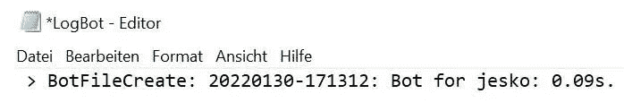
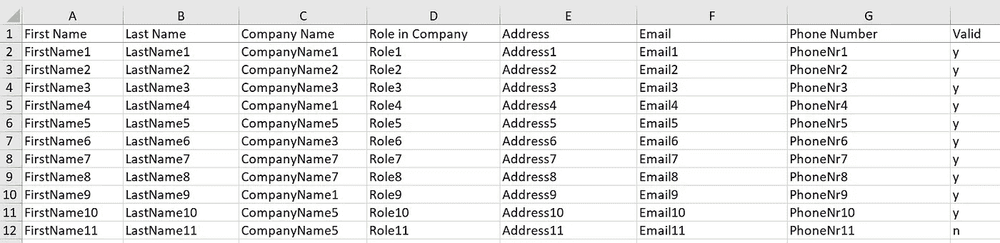
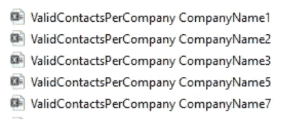
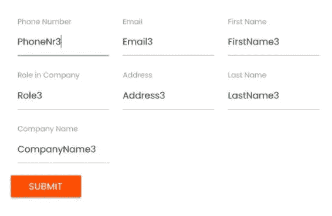

# 让机器人自动处理你的数据

> 原文：<https://towardsdatascience.com/let-the-bot-automate-your-data-processing-e6ef26959d65>

## 使用 RPA、PyAutoGui 和 Pandas 来避免在 SAP 和您的数据仓库中进行重复的手动工作


戴维·莱夫克在 [Unsplash](https://unsplash.com/s/photos/robot?utm_source=unsplash&utm_medium=referral&utm_content=creditCopyText) 上拍摄的照片

**背景**:

您是否经常从 SAP 或其他 ERP 系统中导出数据？然后，在导入数据仓库之前，您是否会花一些时间处理数据？之后，你不会忘记进行一些数据验证检查，如果你的任何可信度检查触发了警报，你会给同事发电子邮件吗？最后，您必须将这些数据填写到 web 表单中吗？在这篇文章中，你将找到如何自动完成这些任务的解决方案，这样你就可以专注于人类应该做的事情:享受机器人手中的新鲜混合饮料并放松！

**解决**:

假设我们必须导出:


GuiAutomate 和 RPA 使用计算机视觉在屏幕上定位像这个导出按钮这样的按钮。

..使用 SE16N 每周一次在 SAP 中创建表格:


除了图像识别之外，RPA 甚至可以使用 OCR(光学字符识别)。

在[的另一篇文章](/automatically-run-and-export-sap-transactions-out-of-excel-using-vba-9c63a28ff566)中，我们学习了如何使用 SAP 的默认脚本实现自动化。但是，由于贵公司的 IT 法规，有时您将无法访问此功能。在这种情况下，PyAutoGui 和 RPA 都非常有助于避免重复相同的任务。

让我们从从 SAP 导出数据开始:

```
**import** pyautogui
**import** opencv *# is needed to use confidence in PyAutoGui for image recognition*
**import** subprocess
**import** time
**from** timeit **import** default_timer **as** timer *# to log the time it takes the bot for each step*
**import** getpass *# to get the user name*

username **=**getpass**.**getuser() *# to log the user name on which system the bot is running*

start **=** timer() *#start the timing*

subprocess**.**Popen("C:\Program Files (x86)\SAP\FrontEnd\SAPgui\saplogon.exe") *# open your desktop application, eg SAP*
time**.**sleep(3) *# using any kind of gui scripting requires to wait until application screens are fully loaded*
```

SAP 开始屏幕现已打开。现在，我们希望机器人找到并点击“SE16N”交易:

```
Customse16n **=** pyautogui**.**locateOnScreen('Custom SE16N.png',confidence**=**0.8) *# let PyAutoGui search the image on the screen; image must be at least very similar when using confidence 80%. Use confidence 1 when image must match 100%.*
pyautogui**.**moveTo(Customse16n) *# moves your cursor upon this button*
pyautogui**.**click(clicks**=**2) *# double click on the button on which the mouse cursor is now located*
time**.**sleep(3) *#give a three seconds break within the code to wait for the desktop application to load its programme*
```

在下一个屏幕中，机器人将输入我们想要导出的表名。我们将获得一个之前保存在 SAP 中的变量，运行该事务并将结果保存为文本文件:

```
pyautogui**.**typewrite('WhatEverSapTable', interval**=**0.001)  *# text entering with 0.001 seconds in between entering each character*
pyautogui**.**press('enter') *# presses the enter button*
pyautogui**.**keyDown('fn') *# holding FN down so F8 can run on my marc*
pyautogui**.**press('f8') *# execute your SAP transaction with F8 works only if you also press FN, see above line*
time**.**sleep(3)

pyautogui**.**press('f6') *#now getting variant in SAP*
time**.**sleep(3)
pyautogui**.**typewrite('WhatEverSapTable variant', interval**=**0.001)
pyautogui**.**press('enter')
time**.**sleep(3)
pyautogui**.**keyDown('fn')
pyautogui**.**press('f8') 
time**.**sleep(10) *# getting your table via SE16N might take some time in SAP*exportresult **=** pyautogui**.**locateOnScreen('export.png',confidence**=**0.8) *# click the export button to save the results*
pyautogui**.**moveTo(exportresult)
pyautogui**.**click()
time**.**sleep(3)

pyautogui**.**move(0, 140) *# from this export button, we now move the cursor 140 pixel down to "Local File" to save it as text*
time**.**sleep(3)
pyautogui**.**click()
time**.**sleep(10) *# might take some time depending on the amount of data*
pyautogui**.**press('enter') *# press enter to confirm*
time**.**sleep(10)

pyautogui**.**typewrite('contacts.txt', interval**=**0.001) *# saves the file contacts as txt*
time**.**sleep(3)
pyautogui**.**press('enter')
```

这只是使用 SAP 的一个基本例子。但是当然，您可以很容易地将这些代码应用到您想要从中提取数据的任何系统中。顺便说一下，我们还将为机器人为我们执行的每个步骤编写一个日志文件。知道机器人每一步花了多长时间总是好的(我们会花多长时间？):

```
end **=** timer() *# end the timing*
timestr **=** time**.**strftime("%Y%m%d-%H%M%S")
**with** open('LogBot.txt', 'a', encoding**=**'utf-8') **as** f: *# 'a'instead of 'w', so current log will be added, not overwritten*
    f**.**write(' > ' **+** 'BotExport: ' **+**timestr  **+** ': Bot for ' **+** username **+** ': %0.2fs'**%** (end **-** start)**+**'.' **+** '\n')
```



记录我们的机器人为我们工作的持续时间。

我们的导出文件如下所示(你会在我的 [Github](https://github.com/DAR-DatenanalyseRehberg/GuiAutomateRpa/blob/main/GuiAutomateRPAPandasMedium.ipynb) 中找到这个 txt 文件):



我们将只考虑有效的联系人(列 valid = y)。然后，我们需要按公司名称对这个数据帧进行分组，并使用 enumerate 为文件名中包含公司名称的每个组生成一个文件。这是我们一位同事的要求(出于学习目的):

```
**import** pandas **as** pd

df **=** pd**.**read_csv('contacts.txt', delimiter **=** "\t")

*# create a df including only valid contacts*
ValidDf**=**df**.**query('Valid == "y"') 

*# group per Company Name and save each group as xlsx attaching the Company Name to the file's name*
**for** i, (name, group) **in** enumerate(ValidDf**.**groupby('Company Name')):
    group**.**to_excel('ValidContactsPerCompany {}.xlsx'**.**format(name),index**=False**) 
```



所有公司名称被分组并分别导出为 Excel 文件。

然后，我们将这个清理后的数据帧导入到我们的 SQL Server 数据仓库中:

```
**import** pyodbc *# to write data to data warehouse instead of text or Excel files*

YourTableName **=**'YourTableNameIncludingLayer'

conn **=** pyodbc**.**connect('Driver={SQL Server};'
                      'Server=YourSqlServer;'
                      'Database=YourDatabase;'
                      'Trusted_Connection=yes;')
*# Create Table*
cursor**.**execute('CREATE TABLE YourTableNameIncludingLayer ([First Name]  nvarchar(255),[Last Name]  nvarchar(255),[Company Name]  nvarchar(255),[Role in Company]  nvarchar(255),[Address]  nvarchar(255),[Email] nvarchar(255), [Phone Number]   nvarchar(255), [Valid] nvarchar(255))')

insert_to_tmp_tbl_stmt **=** f"INSERT INTO {YourTableName} VALUES (?,?,?,?,?,?,?,?)" *# one ? for each column*
cursor **=** conn**.**cursor()
cursor**.**fast_executemany **=** **True**
cursor**.**executemany(insert_to_tmp_tbl_stmt, ValidDf**.**values**.**tolist())
cursor**.**commit()
cursor**.**close() 
conn**.**close()
```

在那里，我们与另一个表进行比较，看看是否真的包括了所有公司名称。因为这可能是由于糟糕的主数据，不是所有当前有效的公司都包括在我们的列表中，这是我们刚刚从 ERP 中导出的。机器人应该确保我们不会遗漏任何未被发现的东西:

```
**import** glob *# glob module is used to retrieve files or pathnames matching specified patterns*

path **=** r'C:\Users'
all_files **=** glob**.**glob(path **+** "\ValidContactsPerCompany*.xlsx") *# use all Excel files which strings starts with ValidContactsPerCompany. Certainly you can also just use the* ValidDf, but again this is mostly for learning purposes on how to deal with different df generating techniques.

li **=** [] *# empty list that will be filled below*

**for** filename **in** all_files:
    DfFromFiles **=** pd**.**read_excel(filename) 
    li**.**append(DfFromFiles)

ValidDfFromManyFiles**=** pd**.**concat(li, axis**=**0, ignore_index**=True**) *# concat the list into one df*
```

根据基准表运行数据质量检查:

```
CompanyInScope**=** pd**.**read_excel(r'C:\Users\CompanyInScope.xlsx')
ValidDfFromManyFilesComparison**=**ValidDfFromManyFiles**.**loc[ValidDfFromManyFiles['Company Name']**.**isin(CompanyInScope['Company Name'])] 
*# look if there any company names listed which do not exist in our export*
CompanyExpected **=** pd**.**Index(CompanyInScope['Company Name'])
CompanyExported **=** pd**.**Index(ValidDfFromManyFilesComparison['Company Name'])
*print(CompanyExpected.difference(CompanyExported).values)*
```


公司名称 8 在我们的导出列表中不存在。

目前，我们不知道缺少公司名称 8 是否真的是一个问题。我们的机器人将通过邮件通知它的人类同事，因此她可以检查这是否是由于糟糕的主数据维护:

```
FindOutlookPath **=**r"C:\Program Files (x86)\Microsoft Office\root\Office16\OUTLOOK.EXE"
FindOutlook **=** subprocess**.**Popen(FindOutlookPath)
time**.**sleep(3)

NewMail **=** pyautogui**.**locateOnScreen('Neue.png',confidence**=**0.8) *# Neue stands for New in German*
*#print(NewMail)*
pyautogui**.**moveTo(NewMail)
pyautogui**.**click()

time**.**sleep(1)
To **=** pyautogui**.**locateOnScreen('An.png',confidence**=**0.8) *# An stands for To in German*
*#print(To)*
pyautogui**.**moveTo(To)
pyautogui**.**move(90, 0) *# 90 pixel to right to enter address*
pyautogui**.**click()
pyautogui**.**typewrite('YourColleagueMailAddress', interval**=**0.001)

time**.**sleep(1)
Cc **=** pyautogui**.**locateOnScreen('Cc.png',confidence**=**0.8)
*#print(Cc)*
pyautogui**.**moveTo(Cc)
pyautogui**.**move(90, 0) *# 90 pixel to the right*
pyautogui**.**click()
pyautogui**.**typewrite('YouOnCc', interval**=**0.001)time**.**sleep(1)
Subject **=** pyautogui**.**locateOnScreen('Betreff.png',confidence**=**0.8) *# Betreff stands for Subject in German*
*#print(Subject)*
pyautogui**.**moveTo(Subject)
pyautogui**.**move(90, 0) *# ,move 90 pixel to the right for address*
pyautogui**.**click()
pyautogui**.**typewrite('Data Validation ERP', interval**=**0.001)

time**.**sleep(1)
Signature **=** pyautogui**.**locateOnScreen('Signatur.png',confidence**=**0.8) *#Signatur stands for Signature in German*
*#print(Signature)*
pyautogui**.**moveTo(Signature)
pyautogui**.**move(0, **-**150) *# from Signature, move 150 pixels top to insert the mail's body above the signature*
pyautogui**.**click()
pyautogui**.**typewrite('Hi colleague, our bot found a company which is currently missing in our ERP master data: '**+**str(CompanyExpected**.**difference(CompanyExported)**.**values), interval**=**0.001)
```

作为最后一个自动化步骤，让我们假设需要将处理过的数据上传到 web 表单中。看看 [Ken Soh](https://github.com/tebelorg/RPA-Python) 用他漂亮的 RPA 包解决这个任务有多快:

```
**import** rpa **as** r

r**.**init(turbo_mode **=** **True**) *# to run in quick mode*
r**.**url('http://rpachallenge.com') *# open this website to fill in forms*

*# timer starts after running this step*
r**.**click('//*[text()="Start"]')

*# loop through and fill in all fields*
**for** i **in** range(len(ValidDfFromManyFiles**.**axes[0])):
    r**.**type('//*[@ng-reflect-name="labelFirstName"]', ValidDfFromManyFiles['First Name'][i])
    r**.**type('//*[@ng-reflect-name="labelLastName"]', ValidDfFromManyFiles['Last Name'][i])
    r**.**type('//*[@ng-reflect-name="labelCompanyName"]', ValidDfFromManyFiles['Company Name'][i])
    r**.**type('//*[@ng-reflect-name="labelRole"]', ValidDfFromManyFiles['Role in Company'][i])
    r**.**type('//*[@ng-reflect-name="labelAddress"]', ValidDfFromManyFiles['Address'][i])
    r**.**type('//*[@ng-reflect-name="labelEmail"]', ValidDfFromManyFiles['Email'][i])
    r**.**type('//*[@ng-reflect-name="labelPhone"]', ValidDfFromManyFiles['Phone Number'][i])
    r**.**click('//*[@value="Submit"]')

*# take a screenshot after all forms are filled in, which can also be used as a kind of log file, check also the rpa default log file*
r**.**snap('page', 'score.png')
r**.**wait(10)
r**.**close()
```



Bot 将所有数据输入网络表单的速度比我们能做到的要快得多。

顺便说一下，如果您不知道如何在网站上找到 Xpath，只需右键单击该元素，然后按“调查”:


右键单击对象以研究其 Xpath。

**总结**:

当你在吃午饭的时候，看着你的机器人为你做无聊的工作，感觉不是很好吗？因为这确实是值得一提的一点:GUI 自动化接管了你的鼠标和键盘，就像一个人坐在电脑前一样。因此，当机器人将鼠标光标定位在屏幕上的特定区域时，你不应该同时移动鼠标。同样的事情也适用于任何击键。你必须确保在加载之间有足够长的等待时间，这样机器人才能在当前显示的屏幕上运行所有步骤。在 Windows pc 上工作，我看不到一个简单的解决方案，如何让机器人在后台工作，这样你就可以在同一时间继续工作。无论是添加第二个键盘和鼠标，还是在终端服务器上运行脚本，都没有解决这个问题。也许你们中有人有解决办法？我肯定会洗耳恭听。

非常感谢您的阅读！希望这篇文章对你有帮助。请随时在 [LinkedIn](https://de.linkedin.com/in/jesko-rehberg-40653883) 、 [Twitter](https://twitter.com/DAR_Analytics) 或[工作室](https://jesko-rehberg.medium.com/virtual-reality-vr-for-education-a532aa5b6272)与我联系。

[](https://jesko-rehberg.medium.com/membership)  

你可以在我的 Github 中下载完整的 [Jupyter 笔记本和图片](https://github.com/DAR-DatenanalyseRehberg/GuiAutomateRpa)。