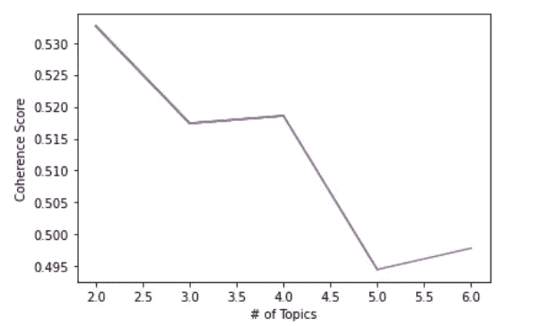
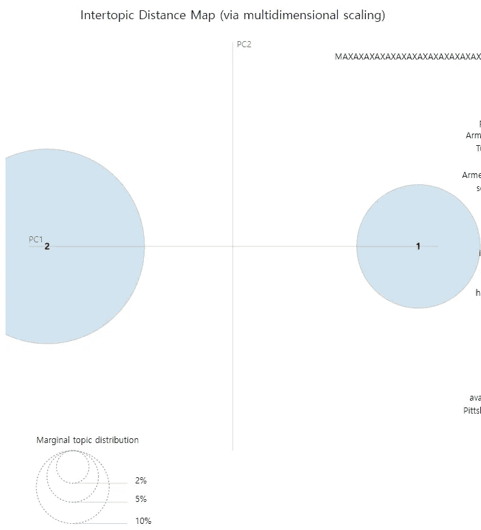
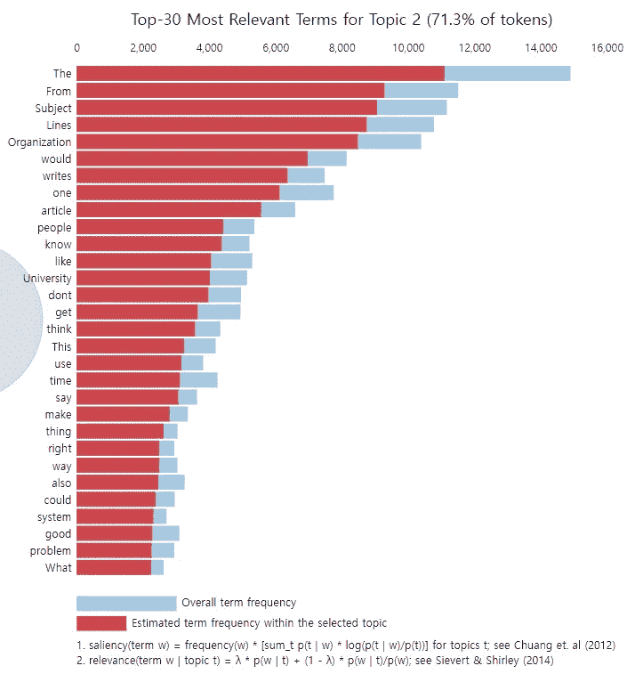

# 让我们从文本数据中提取一些主题—第一部分:潜在狄利克雷分配(LDA)

> 原文：<https://towardsdatascience.com/let-us-extract-some-topics-from-text-data-part-i-latent-dirichlet-allocation-lda-e335ee3e5fa4>

## 使用 Python 的 nltk、gensim、sklearn 和 pyLDAvis 包了解主题建模需要什么及其实现


来自[像素](https://www.pexels.com/ko-kr/photo/6937933/)的免费使用照片

# 介绍

**主题建模**是一种自然语言处理(NLP)任务，它利用无监督学习方法从我们处理的一些文本数据中提取出主要主题。这里的“无监督”一词意味着没有与主题标签相关联的训练数据。相反，算法试图直接从数据本身发现潜在的模式，在这种情况下，是主题。

有各种各样的算法广泛用于主题建模。在接下来的系列文章中，我打算一一介绍。在本文中，我们看看什么是**潜在的狄利克雷分配(LDA)** 算法，它是如何工作的，以及如何使用多个 Python 包来实现它。

# 什么是 LDA？

LDA 是一种用于主题建模的模型，由于与可能执行相同任务的极其复杂的神经网络相比，它相对简单和有效，所以经常被使用。

我将我们处理的文本数据称为“语料库”,将每个文本观察称为“文档”。LDA 的基本假设是每个文档可以由主题的分布来表示，而主题的分布又可以由一些词的分布来表示。请注意“分发”这个词。LDA 假设每个文档不仅仅由一个主题组成，而是由几个主题组成。因此，LDA 模型将分解每个主题对该文档的百分比贡献。例如，如果我们将主题的数量设置为 5，那么文档 A 可以表示如下:

```
document_A = 0.2 x Topic1 + 0.1 x Topic2 + 0.1 x Topic3 + 0.5 x Topic4 + 0.1 x Topic5 
```

我不会深入这个算法的数学，但是对于那些感兴趣的人，请看看这个算法的最初发明者的这篇[论文](https://ai.stanford.edu/~ang/papers/jair03-lda.pdf)。

我要提醒读者的是，不要将潜在的狄利克雷分配与线性判别分析模型混淆，线性判别分析模型是一种分类算法，因为它们通常都缩写为 LDA。

现在，让我们看一些实际的代码，看看如何实现 LDA。

# 清理文本

我们首先导入 nltk 包，并下载一个相关语料库的列表，这些语料库将用于删除停用词、词干化和词汇化。

```
**import** nltk**from** nltk.stem import *nltk.download(‘punkt’) **# For Stemming**nltk.download(‘wordnet’) **# For Lemmatization**nltk.download(‘stopwords’) **# For Stopword Removal**nltk.download(‘omw-1.4’)
```

我们还在一个名为 stop words 的变量中存储了一个以后要使用的英语停用词列表。

```
stopwords = set(nltk.corpus.stopwords.words('english'))
```

是时候载入一些数据了。这里，我们使用开源的 20 个新闻组数据集，每个人都可以在 sklearn 包接口中使用该数据集。它使用的是[Apache 2.0 版许可证](https://www.apache.org/licenses/LICENSE-2.0)。

```
**import** pandas as **pd****import** numpy as **np**from sklearn.datasets import fetch_20newsgroupsfetch20newsgroups = fetch_20newsgroups(subset='train')**# Store in a pandas dataframe**df = pd.DataFrame(fetch20newsgroups.data, columns=['text'])
```

接下来，我们做一些文本清理，如删除一些无关的单词或表达。我们删除网址，提及和散列标签。为此，我们导入正则表达式包，然后使用 sub 函数删除与指定正则表达式匹配的字符串部分。请记住，“\S”匹配除空白以外的单个字符。如果你看下面的代码，我们匹配的表达式包括“https”，“@”和“#”，它们对应于我们想要从文本中删除的字符串。

```
**# Remove URLs****import** re # Import regular expression package**def** remove_url(text):
    return re.sub(r'https?:\S*','',text)df.text = df.text.apply(remove_url)**# Remove mentions and hashtags****import** re**def** remove_mentions_and_tags(text):
     text = re.sub(r'@\S*','',text)
     return re.sub(r'#\S*','',text)df.text = df.text.apply(remove_mentions_and_tags)
```

现在，我们希望将我们拥有的文档标记化，并将它们转换成某种字典形式，可以用作 gensim 模型的输入。

# 预处理

我们使用下面的自定义函数来预处理语料库中的文档。

```
**def** text_preprocessing(df): corpus=[]

    lem = WordNetLemmatizer() **# For Lemmatization** for news in df['text']:
        words=[w for w in nltk.tokenize.word_tokenize(news) if (w not in stopwords)] **# word_tokenize function tokenizes text on each word by default** words=[lem.lemmatize(w) for w in words if len(w)>2] corpus.append(words) return corpus**# Apply this function on our data frame** corpus = text_preprocessing(df)
```

从上面的代码中可以看出，我们循环遍历每个文档，并按顺序应用标记化和词汇化。记号化意味着将文档分解成称为记号的小分析单元，记号通常是单词。词汇化指的是将单词还原为其原始基本形式的过程，称为“词汇”。将同一个动词的多种形式根据它的时态改变成它的基本形式就是词汇化的一个例子。

我们利用 Python 中的 gensim 包来继续第 3 步和后续步骤。

使用以下命令安装 gensim 包。

```
!pip install -U gensim==3.8.3
```

我安装特定版本的 gensim (3.8.3)的原因是因为一些不同的 LDA 实现(如 LDA Mallet 模型)在以后的版本中已经被删除。

我们首先使用已经预处理过的语料库创建一个 gensim dictionary 对象，然后创建一个名为“bow_corpus”的变量，在其中存储单词包(bow)转换后的文档。由于 gensim 包接受输入的方式，这一步是必要的。然后，我们使用 pickle 包保存 bow_corpus 和字典供以后使用。

```
import gensim# Transform to gensim dictionary
dic = gensim.corpora.Dictionary(corpus) bow_corpus = [dic.doc2bow(doc) for doc in corpus]import pickle # Useful for storing big datasetspickle.dump(bow_corpus, open('corpus.pkl', 'wb'))dic.save('dictionary.gensim')
```

# 实际模型

接下来，我们使用 gensim.models 类中的 LDAMulticore 函数来实例化我们的 LDA 模型。有人可能会问 LDAMulticore 函数和基本的 LDAmodel 函数有什么区别？它们基本上是一样的，但是前者支持多进程，这可以节省你的运行时间，所以为什么不用它来代替基本的呢？注意，我们可以通过“workers”参数指定将参与多处理操作的处理器数量。我们还通过“num_topics”参数指定要从语料库中提取的主题数量。不幸的是，除非你事先有一些关于语料库的领域知识，否则没有办法找出多少主题是最佳值。

```
lda_model = gensim.models.LdaMulticore(bow_corpus,
                                   num_topics = 4,
                                    id2word = dic,
                                      passes = 10,
                                      workers = 2)lda_model.save('model4.gensim')
```

一旦我们训练了 LDA 模型，我们查看从语料库中提取的每个主题中最重要的前十个单词。

```
**# We print words occuring in each of the topics as we iterate through them**for idx, topic in lda_model.print_topics(num_words=10):    
    print('Topic: {} \nWords: {}'.format(idx, topic))
```

输出如下。

```
Topic: 0  Words: 0.008*"The" + 0.007*"would" + 0.006*"one" + 0.006*"From" + 0.006*"people" + 0.005*"writes" + 0.005*"Subject" + 0.005*"Lines" + 0.005*"Organization" + 0.005*"article"Topic: 1  Words: 0.008*"The" + 0.007*"Subject" + 0.007*"From" + 0.007*"Lines" + 0.007*"Organization" + 0.004*"use" + 0.004*"file" + 0.003*"one" + 0.003*"would" + 0.003*"get"Topic: 2  Words: 0.007*"From" + 0.007*"Organization" + 0.007*"Lines" + 0.006*"The" + 0.006*"Subject" + 0.005*"game" + 0.005*"University" + 0.005*"team" + 0.004*"year" + 0.003*"writes"Topic: 3  Words: 0.013*"MAXAXAXAXAXAXAXAXAXAXAXAXAXAXAX" + 0.009*"The" + 0.006*"From" + 0.006*"Subject" + 0.005*"Lines" + 0.005*"key" + 0.005*"Organization" + 0.004*"writes" + 0.004*"article" + 0.003*"Israel"
```

可能题目 2 和“大学”这个词有点关系。除此之外，我们没有看到任何重要的东西。这里发生了什么事？请注意，有些词在所有主题中都出现得非常频繁。它们是包括主题、文章和组织的单词。这些词出现在每篇新闻文章的开头，列出了作者、所属单位和标题。这就是为什么他们主宰了每一个话题。换句话说，它们是没有信息的噪音，不会给我们构建的 LDA 模型增加多少价值。这说明了文本清理和预处理与你的自然语言处理项目的目标相一致的重要性！

# 估价

正如我前面提到的，没有一个确定的方法来找出多少个主题是最佳的。一种方法是简单地观察每个主题中的一些关键词，看它们是否相互连贯。但这绝对不是一种客观或严谨的评价方式。一个稍微严谨一点的方法是使用连贯性评分。

这个分数衡量每个主题中高分单词之间的语义相似程度。现有的算法有 C_v，C_p，C_uci，C_umass 等。C_v 和 C_umass 是两种应用较为广泛的方法。

C_v 的一致性分数范围从 0 到 1，值越高，一致性越好。C_umass 方法返回负值。这里的棘手之处在于，对于什么样的价值构成“良好的一致性”，没有明确的共识或解释。学者们已经做了一些尝试，例如[约翰·麦克里维，他认为任何超过 0.5 分的 C_v 方法都是相当好的](https://www.amazon.com/Doing-Computational-Social-Science-Introduction/dp/1526468190)。然而，如果你浏览一些数据科学的论坛，会有一些不同的观点。来自 Stackoverflow 的这篇[帖子](https://stackoverflow.com/questions/54762690/evaluation-of-topic-modeling-how-to-understand-a-coherence-value-c-v-of-0-4)给出了以下建议。

*   0.3 是不好的
*   0.4 很低
*   0.55 没问题
*   0.65 可能是最好的结果了
*   0.7 就不错了
*   0.8 不太可能
*   0.9 很可能是错的

对于 u_mass 方法，它变得更加混乱。看看发生在这个 [Reddit 论坛](https://www.reddit.com/r/learnmachinelearning/comments/9bcr77/coherence_score_u_mass/)的讨论。它说，当我们增加要提取的主题数量时，一致性分数可能会非常不稳定。我认为大多数数据科学用户提出的一般想法是，C_v 方法通常比 C_umass 方法更可靠，尽管最终的裁决取决于用户。

尽管如此，我认为从所有这些关于一致性评估的信息中获得的关键信息是:

*   一致性分数不是评估主题质量的绝对标准。千万不要只依靠一种方法。使用连贯性分数作为基线，然后确保你浏览每个主题的文档及其关键词，以获得你“自己”对每个主题连贯性的感觉。
*   对于计算一致性得分的 C_v 方法，检查您的模型的得分是否不太高也不太低。0.5 到 0.7 之间的任何值都是一个合适的范围。
*   对于计算一致性分数的 C_umass 方法，检查分数的绝对值是否合理地接近 0。

让我们用 C_v 方法来评价我们的模型。gensim 包的 models 类包含 CoherenceModel，它可以方便地计算一致性分数。

```
**from** gensim.models **import** CoherenceModel**# instantiate topic coherence model**cm = CoherenceModel(model=lda_model, corpus=bow_corpus, texts=corpus, coherence='c_v')**# get topic coherence score**coherence_lda = cm.get_coherence()print(coherence_lda)
>> 0.49725706360481475
```

0.497 不差但也不体面。我们想知道连贯分数是否随着从语料库中提取的主题数量而变化。我们从数字 2 到 6 迭代主题的数量，并将每个一致性分数存储在名为 score 的变量中，该变量被初始化为一个空列表。然后我们使用 Python 的 matplotlib 包将它可视化成一个线图。

```
import matplotlib.pyplot as plttopics = []score = []for i in range(2,7,1):
     lda = gensim.models.LdaMulticore(corpus=bow_corpus, id2word=dic, iterations=10, num_topics=i, workers = 3, passes=10, random_state=42) cm = CoherenceModel(model=lda, corpus=bow_corpus, texts=corpus, coherence='c_v') topics.append(i) # Append number of topics modeled score.append(cm.get_coherence()) # Append coherence scores to listplt.plot(topics, score)plt.xlabel('# of Topics')plt.ylabel('Coherence Score')plt.show()
```



来源:来自作者

我们看到，当有两个主题要提取时，连贯性得分最高。它随着话题数量的增加而不断减少。

我们现在基于两个主题建立新的 LDA 模型。

```
**# LDA model with two topics**
lda_model2 = gensim.models.LdaMulticore(bow_corpus,
                                    num_topics = 2,
                                     id2word = dic,
                                        passes = 8,
                                       workers = 3)lda_model2.save('model2.gensim') **# We print words occuring in each of the topics as we iterate through them**for idx, topic in lda_model2.print_topics(num_words=20):print('Topic: {} \nWords: {}'.format(idx, topic))
```

结果输出:

```
Topic: 0  Words: 0.007*"The" + 0.005*"MAXAXAXAXAXAXAXAXAXAXAXAXAXAXAX" + 0.004*"From" + 0.004*"Subject" + 0.004*"Lines" + 0.004*"Organization" + 0.003*"one" + 0.002*"get" + 0.002*"year" + 0.002*"**game**" + 0.002*"like" + 0.002*"would" + 0.002*"time" + 0.002*"University" + 0.002*"writes" + 0.002*"**team**" + 0.002*"article" + 0.002*"dont" + 0.002*"This" + 0.002*"people" Topic: 1  Words: 0.009*"The" + 0.007*"From" + 0.007*"Subject" + 0.007*"Lines" + 0.007*"Organization" + 0.005*"would" + 0.005*"writes" + 0.005*"one" + 0.004*"article" + 0.003*"people" + 0.003*"**know**" + 0.003*"**like**" + 0.003*"University" + 0.003*"dont" + 0.003*"get" + 0.003*"**think**" + 0.002*"This" + 0.002*"**use**" + 0.002*"time" + 0.002*"**say**"
```

上面的输出显示，主题 0 与游戏和团队有些关系，而主题 1 与动作动词更相关，包括知道、喜欢、使用和说。由于我们没有删除那些频繁出现的代词或冠词，这些代词或冠词只是为了它们的语法目的，并没有给模型增加太多的意义或价值，所以噪音在这两个主题中仍然相当猖獗。然而，即使有了眼球，我们也能对每个主题的内容有一个稍微好一点的感觉，这通常意味着更好的连贯性。

# 可视化 LDA 结果

使用另一个叫做 pyLDAvis 的软件包，我们可以可视化 LDA 结果。

```
!pip install pyldavis**import** pyLDAvis**import** pyLDAvis.gensim_models
```

请注意，pyLDAvis 包有了更新，所以人们以前知道的 pyLDAvis.gensim 模块现在变成了 **pyLDAvis.gensim_models** 而不是**。**

```
**# Loading the dictionary and corpus files we saved earlier**
dictionary = gensim.corpora.Dictionary.load('dictionary.gensim')corpus = pickle.load(open('corpus.pkl', 'rb'))**# Loading the num_of_topics = 2 model we saved earlier** lda = gensim.models.ldamodel.LdaModel.load('model2.gensim')pyLDAvis.enable_notebook()vis = pyLDAvis.gensim_models.prepare(lda, bow_corpus, dic, sort_topics=False)pyLDAvis.display(vis)
```



来源:来自作者

在我上面截图的 pyLDAvis 仪表板的左侧，每个圆圈的面积代表了主题相对于语料库的重要性。此外，圆心之间的距离表示主题之间的相似性。



来源:来自作者

现在，在仪表板的右侧，正如您在右上方看到的，每个主题的前 30 个相关词以直方图显示，红色部分代表所选主题内的估计词频(显著性)，浅蓝色部分代表整体词频。

# 奖金

LDA 有各种版本。例如，LDA Mallet 是 LDA 的另一个版本，它使用了[吉布斯采样](/gibbs-sampling-8e4844560ae5)，与我在上面展示的普通 LDA 模型相比，它提高了性能。LDA Mallet 模型的一个缺点是相对于它的原始对应物，它的计算效率较低，因此对于大型数据集，它可能不是最合适的。

请看看这篇[文章](https://neptune.ai/blog/pyldavis-topic-modelling-exploration-tool-that-every-nlp-data-scientist-should-know)的最后一部分，了解更多关于 LDA Mallet 模型的信息。

# 结论

在本文中，我向您介绍了什么是主题建模，以及 LDA 模型可以做什么来执行主题建模。我还逐步向您介绍了如何清理和预处理文本数据，然后在其上构建 LDA 模型。最后，我阐述了如何评估您的 LDA 模型以及如何可视化结果。

读者应该记住的一个要点是，预处理对增加主题连贯性比你想象的更重要。确保文本数据中没有太多噪声的一些方法是过滤掉极高或极低频率的标记，并排除特定的词性(PoS)标记的单词，例如 in(例如，upon，except)和 MD(例如，may，must)。当然，后者必须在词性标注之前，词性标注本身是一个独立的 NLP 任务，我将在另一篇文章中介绍。

如果你觉得这篇文章有帮助，请考虑通过以下链接注册 medium 来支持我: )

【joshnjuny.medium.com 

你不仅可以看到我，还可以看到其他作者写的这么多有用和有趣的文章和帖子！

# 关于作者

*数据科学家。加州大学欧文分校信息学专业一年级博士生。*

*密歇根大学刑事司法行政记录系统(CJARS)经济学实验室的前研究领域专家，致力于统计报告生成、自动化数据质量审查、构建数据管道和数据标准化&协调。Spotify 前数据科学实习生。Inc .(纽约市)。*

他喜欢运动、健身、烹饪美味的亚洲食物、看 kdramas 和制作/表演音乐，最重要的是崇拜我们的主耶稣基督。结账他的 [*网站*](http://seungjun-data-science.github.io) *！*