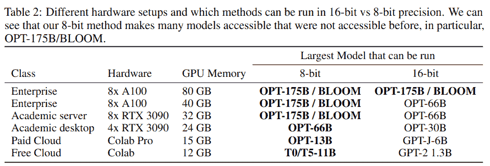
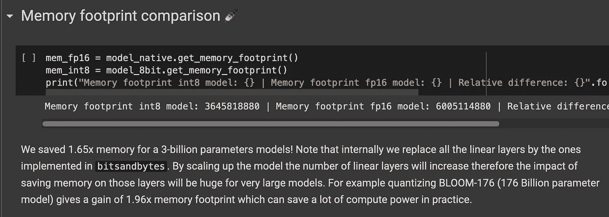

# 让我们与 BigScience 的新 AI 模型一起绽放

> 原文：<https://towardsdatascience.com/lets-bloom-with-bigscience-s-new-ai-model-803b1a0d677>

## 使用 bnb-Int8 为拥抱脸部署大型语言模型

照片由[萨夫](https://unsplash.com/@saffu?utm_source=medium&utm_medium=referral)在 [Unsplash](https://unsplash.com?utm_source=medium&utm_medium=referral) 上拍摄

# 这是怎么回事？

在本教程中，我们将在亚马逊 SageMaker 端点中部署 BigScience 的 [BLOOM 模型](https://bigscience.huggingface.co/blog/bloom)，这是最令人印象深刻的大型语言模型(LLM)之一。为此，我们将利用 [bitsandbytes](https://github.com/TimDettmers/bitsandbytes) (bnb) Int8 集成，用于来自 [Hugging Face (HF) Hub](https://huggingface.co/models) 的模型。有了这些 Int8 权重，我们可以运行以前不适合我们的 GPU 的大型模型。

本教程的代码可以在这个 [GitHub repo](https://github.com/marshmellow77/sm-bnb-transformers) 中找到。请注意，用于 HF 集成的 bnb-Int8 目前处于公开测试阶段，其目的是收集不同型号和设置可能出现的错误。在生产环境中使用它之前，请考虑这一点。你可以在这里找到更多关于测试计划的信息。

> 声明:本教程的目的是逐步完成设置 bnb-Int8 + HF 的步骤。因此，我们将只部署 3B 版本的 BLOOM，无需 bnb-Int8 集成即可轻松托管。部署较大模型的步骤是相同的，但是由于下载它们需要时间，所以需要的时间要长得多。

# 为什么这很重要？

自从 OpenAI 在 2020 年发布 GPT-3 以来，LLMs 已经席卷了全世界。几周之内，大量令人印象深刻的演示被制作出来，这些演示可以在棒极了的 GPT-3 网站上找到。很快就清楚了，这些 LLM 是自然语言处理(NLP)中最重要的发现之一。这是因为这些模型具有令人印象深刻的零射击性能，即它们无需任何进一步的模型训练即可使用。他们也非常多才多艺(从撰写法律文本到代码)和多语言。

因此，越来越多的 LLM 由不同的组织创建，试图提高 LLM 的性能和/或使其开源和更加透明(GPT-3 是一个专有模型)。BigScience 的布鲁姆模型是“诞生”的最新也可能是最重要的模型之一。从他们的[网站](https://bigscience.huggingface.co/blog/bloom):

> 大型语言模型(LLM)对人工智能研究产生了重大影响。这些强大的通用模型可以根据用户的指令承担各种新的语言任务。然而，学术界、非营利组织和小公司的研究实验室发现很难创建、研究甚至使用 LLM，因为只有少数拥有必要资源和专有权的工业实验室可以完全访问它们。今天，我们发布了[布鲁姆](https://huggingface.co/bigscience/bloom)，这是第一个在完全透明的情况下训练的多语言 LLM，以改变这一现状——这是有史以来人工智能研究人员在单个研究项目中最大规模合作的结果。

但是，即使这些新的 LLM 现在是开源的，也不意味着我们可以下载它们并在我们的笔记本电脑上使用它们。这些模型需要大量的磁盘空间、RAM 和 GPU 来运行。这就是为什么像 [bitsandbytes](https://github.com/TimDettmers/bitsandbytes) 这样的计划是重要的——它们使用漂亮的技术来降低 LLM 的硬件要求，并使它们以适当的延迟和合理的成本运行成为可能:

LLM 的不同硬件设置([源](https://docs.google.com/document/d/1JxSo4lQgMDBdnd19VBEoaG-mMfQupQ3XvOrgmRAVtpU/edit))

# 如何缩小 LLM

有几种方法可以减少大型人工智能模型的大小和内存占用——其中一些最重要的方法是[知识提炼](https://neptune.ai/blog/knowledge-distillation)、[权重修剪](https://wandb.ai/authors/pruning/reports/Plunging-into-Model-Pruning-in-Deep-Learning--VmlldzoxMzcyMDg)和量化。请注意，这些并不相互排斥，可以相互组合。关于如何使用这些技术的一个很好的例子，参见《变形金刚的自然语言处理》一书的第 8 章。

也就是说，bnb 团队专注于最后一项技术，量化。他们引入了一种叫做*分块量化*的特殊技术，你可以在这里阅读更多关于[的内容](https://arxiv.org/pdf/2110.02861.pdf)(这篇文章*稍微超出了本教程的范围*😉).他们的成果令人印象深刻:

bnb-Int8 ( [来源](https://colab.research.google.com/drive/1qOjXfQIAULfKvZqwCen8-MoWKGdSatZ4))节省的内存空间

# 部署布鲁姆模型

因此，让我们开始将[布鲁姆-3B](https://huggingface.co/bigscience/bloom-3b) 模型部署到亚马逊 SageMaker (SM)端点。我们的游戏计划如下:

1.  从 HF 模型中心下载模型
2.  编写自定义推理脚本
3.  把所有东西打包在一个*model.tar.gz*文件中并上传到 S3
4.  将模型部署到端点
5.  测试模型

## 下载模型

我们可以使用 Git LFS 下载所有模型文件，如下所示:

这将下载文件到我们的本地机器。

## 推理脚本

AWS & Hugging Face 开发了[sage maker humping Face 推理工具包](https://github.com/aws/sagemaker-huggingface-inference-toolkit)，使得在 SM 上部署 HF 模型进行推理变得容易。我们需要做的就是[编写一个推理脚本](https://github.com/aws/sagemaker-huggingface-inference-toolkit#-user-defined-codemodules)(和 *requirements.txt* 文件)来定义我们想要如何加载模型和生成预测:

注意，我们使用参数 *load_in_8bit=True* 来使用 bnb-Int8 积分。

我们还需要一个 requirements.txt 文件，确保所需的模块将安装在推理容器映像中:

最后一行确保安装最新版本的*变形金刚*库。

## 上传到 S3

现在，我们将所有内容打包到一个 model.tar.gz 文件中，并将该文件上传到 S3:

## 部署模型

现在，我们创建一个指向 S3 位置的模型表示，并使用一个命令部署该模型:

这需要几分钟时间。

## 测试

在模型成功部署后，我们可以测试它。我们以这样一种方式编写我们的推理脚本，我们可以传递任何和所有用于文本生成的参数，在这里查看这些参数的详细列表[。让我们使用采样和 0.5 的温度:](https://huggingface.co/docs/transformers/v4.18.0/en/main_classes/text_generation#generation)

作者图片

它似乎工作，但我们可能要调整参数多一点。不确定 bnb-Int8 是否真的在我的 Android 手机上效果最好！😂

# 结论

在本教程中，我们利用 bnb-Int8 集成将 BigScience 的布鲁姆-3B 模型部署到 SageMaker 端点。从这里开始，下一步可能是尝试和部署更大的模型——如果您尝试了，请告诉我您的体验。如果您在 bnb-Int8 集成中遇到任何意外行为，请记住它仍处于测试阶段——请让团队知道任何错误。