# 让我们做:神经网络

> 原文：<https://towardsdatascience.com/lets-do-neural-networks-d849d80fd012>

## PyTorch 中构建神经网络以预测保险索赔频率的详细说明


[斯凯工作室](https://unsplash.com/@skyestudios?utm_source=medium&utm_medium=referral)在 [Unsplash](https://unsplash.com?utm_source=medium&utm_medium=referral) 拍摄的照片

# 背景

在这个关于神经网络的第七集——是的，*第七集*——中，我终于开始着手建造一个了。

是时候了！

总之，总结一下我们到目前为止学到的东西:

1.  神经网络由神经元或节点组成。
2.  它们被分为输入层(数据进入的地方)、输出层(答案出来的地方)和隐藏层(神奇的事情发生的地方)。隐藏层是网络中既不是输入层也不是输出层的层。
3.  权重是将网络节点连接在一起的标量值。权重指示两个节点之间的关系强度。绝对权重越大，关联越强。
4.  每个节点可以有一个偏置项。这是一个标量，帮助模型学习可能不通过“原点”的模式。
5.  每个节点还具有在其上运行的激活功能。这是一个将节点输入、权重和偏差转换为输出的函数。激活函数是将非线性引入模型的关键。
6.  节点输出(即激活函数的输出)的连接性质意味着我们可以将神经网络视为嵌套函数，参数为权重和偏差。
7.  成本函数是衡量模型预测与事实接近程度的指标。有各种成本函数在使用，在大多数情况下，成本越低，模型越好。
8.  我们使用微积分和计算导数来确定每个权重和偏差对模型成本的贡献。这就是反向传播的本质。
9.  我们可以结合成本函数、反向传播和专门的优化算法来训练模型。
10.  这个“学习”过程实际上是一个迭代过程，用于识别最小化成本函数的一组权重和偏差(受某些约束)。

现在，我们将结合我们所知道的——并且可能在这个过程中学到更多——来建立我们自己的神经网络。在我们进入技术部分之前，让我们先谈谈我选择使用的框架:PyTorch。

# PyTorch

PyTorch 是一个用 Python 构建机器学习模型的框架。

作为一个框架，它提供了工具和构建模块，允许创建高级机器学习模型，如神经网络。虽然许多功能是预先构建的，但用户仍然需要将各个部分组装在一起，以形成模型结构和训练程序。

## 三个 PyTorch 模块

PyTorch 的功能主要分为三个模块。

`autograd`提供导数和梯度的(自动)计算功能。如果你像我一样，有一段时间没有伸展你的微积分肌肉，这很有用。

构建神经网络所需的大多数功能都可以在`nn`中找到，就像`Module`一样，我们在那里定义网络的结构以及前向传递是如何工作的。

`optim`包含预建的优化算法，如流行的 ADAM，有助于模型训练。

## PyTorch 作为一个新手

PyTorch 使用自己的数据结构，称为“张量”；这些多维结构具有`numpy`式的逻辑和语法，让 PyTorch 感觉**熟悉**。

由于我使用的大部分功能都是预先构建的，这使得我作为新人的体验更加易于使用。我很少需要深入研究基础数学来建立和训练我的模型。

GPU 加速非常简单。我想这很大程度上是因为使用了 Nvidia 显卡，但是设置起来又快又简单，在我知道之前，我一直在进行 GPU 的培训。

PyTorch 最有用的方面之一是其网站上提供的详细教程集合和丰富的社区提问(和回答！)论坛上贴出的问题。

## PyTorch vs TensorFlow & Keras

虽然我选择使用 PyTorch 并不是因为广泛的研究，但部分原因是因为论坛上反复出现的帖子表明:

1.  从 TensorFlow v1 迁移到 TensorFlow v2 显著改变了语法。
2.  大多数可用的教程和资源都是使用 TensorFlow v1 制作的。
3.  新用户可能不清楚本教程指的是 TensorFlow 的哪个版本。

虽然情况可能不再如此，但我还是接受了 PyTorch(据我所知，py torch 没有这样的问题)。

也就是说，根据快速浏览 TensorFlow 网站上的一些资源，这两者之间可能没有太大的语法差异。谁知道呢，也许有一天我会好好看看。

樊博英够了，该做点实实在在的事情了。

# 数据

我们将使用由 Christophe Dutang 提供并上传到 OpenML⁴.的大型数据集它可以在 4.0 licence⁵的 CC 下使用，正如我们很快会看到的，我们将对底层信息进行一些更改。当然，我们使用这些数据要自担风险，不在商业范围内。

## 探索性数据分析

该数据收集了大约 680，000 份法国汽车保险单的风险细节，以及相关的第三方索赔。

在对列进行快速重命名后，我们得到了以下数据集:

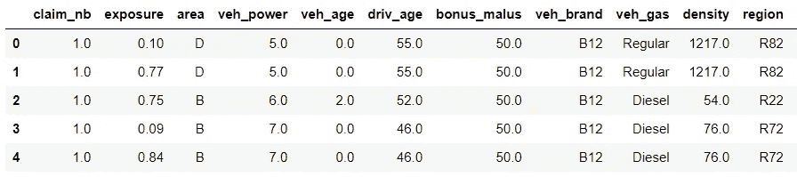

作者图片

虽然我不能 100%确定确切的定义，但 guide⁶详细描述了看起来是另一个版本的数据，表明:

*   `claim_nb`是暴露期(即保单有效期)内的索赔次数
*   `exposure`是保单面临风险的时间，以年表示。*这只是保险公司向投保人提供保险的一年比例的一种奇特的精算方式。*
*   `area`是汽车司机居住的城市社区的密度值。从代表农村地区的“A”到代表城市中心的“F”不等。
*   `region`是法国政策地区。看起来像是某种常见或广泛使用的分类形式。
*   `density`是人口密度估计值，即投保人所在城市每公里的居民人数。
*   `driv_age`是驾驶员的年龄(年)。
*   `bonus_malus`是对投保人的奖惩评级。显然在法国，价值 100 =奖金 100 =苹果。 *Bonus malus 是一个拉丁文术语，意思是“好的坏的”。从本质上讲，这是一个奖励良好索赔行为的客户、惩罚不良索赔行为的系统——也就是说，如果你的保险索赔较少，你就可以预期支付较少的保险费用。在英国，这也被称为“无索赔折扣”。*
*   `veh_power`是汽车的动力，分组为有序的类别。
*   `veh_age`是车辆的年龄，以年为单位。
*   `veh_brand`是车辆品牌，分为不同的子组。
*   `veh_gas`是车辆燃料类型。在这种情况下，我们没有任何种类的电动或混合动力汽车。

尽管被删减了，这个数据集还是相当有代表性的，我们用它来建立英国的汽车保险定价模型。通常，我们收集和使用属于以下四类之一的功能:

1.  **与保单相关的特征** —这可能是保险级别、保单销售时有效的任何促销或折扣等。
2.  **与车辆驾驶员相关的特征** —这可能是驾驶员的年龄、先前的索赔历史、主驾驶员的职业。理想情况下，将为策略上列出的所有驱动程序收集相同的信息，以及主驱动程序和任何其他列出的驱动程序之间的关系。
3.  **与车辆可能行驶的区域相关的特征** —与上述`area`和`density`非常相似，这些特征与物理环境相关。地理和人口统计特征通常是保险风险的高度预测因素。
4.  **与投保车辆相关的特征** —考虑车辆品牌、型号和规格(及相关细节)以及其他特征，如车龄和投保人拥有车辆的时间。

总之，说够了，让我们回到正题上来。

观察单向视角通常有助于我们了解趋势。我们将计算索赔频率——每单位风险敞口的索赔数量——从总体上看。

首先是`area`，单调趋势的一个好例子:

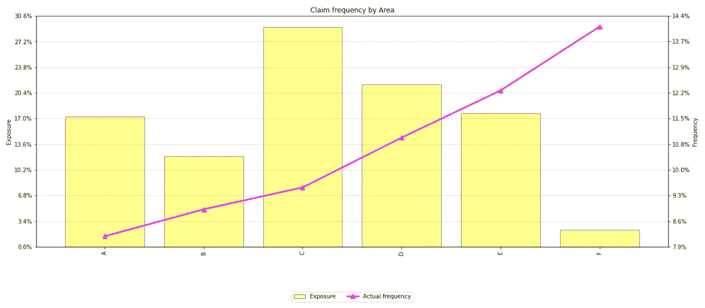

作者图片

这里我们有:

*   黄色条表示`area`每一类别中总暴露量的比例
*   一条粉色线表示每一类`area`的索赔频率，以百分比表示。

回想一下数据定义，我们知道这实际上是一个有序的分类特征，其中“A”代表农村地区，级别代表日益城市化的地区(“F”代表城市中心)。

因此，我们看到频率随着`area`的增加而增加——这是有道理的，因为我们预计在交通更繁忙、道路更繁忙的繁忙地区会发生更多事故。我们预计农村地区的情况正好相反。

*此外:在城市化程度更高的地区，索赔频率更高是很常见的。然而，这并不意味着住在农村地区会得到更便宜的保险，因为农村地区的事故严重程度往往高于城市中心的事故……想想典型的交通堵塞中的轻微轻微车祸和高速行驶中的撞车事故。*

让我们来看看一些不那么单调的东西——车辆品牌:

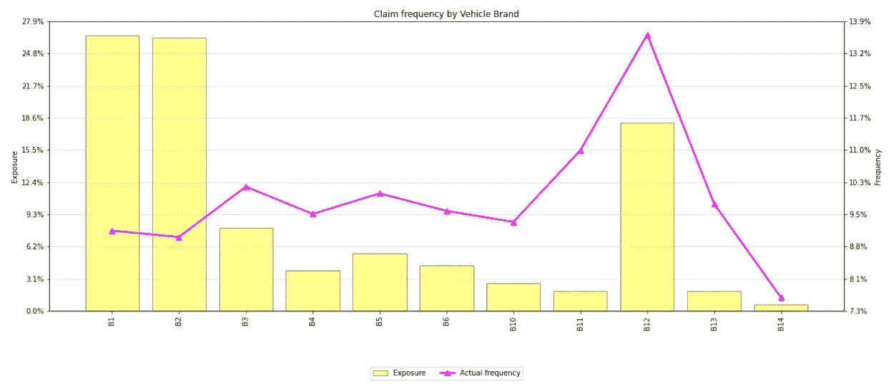

作者图片

在这里，看起来似乎是单向的，除了品牌 B11 和 B12 的频率水平较高之外，大多数品牌的车辆品牌索赔频率相当稳定，约为 9.5%。另一方面，B14 显示出明显较低的索赔频率。

这些都是非常重要的观察结果，我们希望我们的模型能够抓住这些趋势，尤其是我们看到销量最大的品牌(B1、B2 和 B12)。

也许这也是一个提醒我们自己的好时机，虽然特性的标签可能意味着某种排序，但这不一定是这样的，因此期望它有某种形式的单调趋势可能有些过头了。

让我们继续为建模准备数据。

## 数据准备

我们正在处理各种类型的数据—数字和分类的混合。因为我们只能将数字数据输入到我们的神经网络中，所以我们需要进行某种形式的转换(以及一些预处理)。我们还需要将数据分成子集，以帮助我们进行训练和验证。

为了避免任何潜在的目标泄漏，我们应该在计算**训练**集上所需的转换之前拆分数据。

## 数据分割

这里非常简单——我们将使用 scikit-learn 的`train_test_split`功能。不过，我们将按顺序进行，所以我们最终会得到我们想要的集合。

```
from sklearn.model_selection import train_test_split

# split out the validation set
train_x, val_x, train_y, val_y,train_evy,val_evy = train_test_split(
    df.drop(labels = ['claim_nb','exposure'],axis = 1),
    df['claim_nb'],
    df['exposure'],
    test_size = 0.15,
    random_state = 0,
    shuffle = True
)

# now split train and test
train_x, test_x, train_y, test_y,train_evy,test_evy = train_test_split(
    train_x,
    train_y,
    train_evy,
    test_size = 0.2,
    random_state = 0,
    shuffle = True
)
```

*设置随机种子总是个好主意。注意我们如何在第二次调用* `train_test_split`时增加 `test_size` *。这是为了确保我们的测试集比验证集稍大。*

这会产生以下数据集:

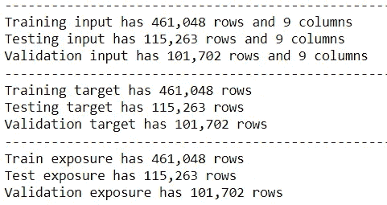

图像是作者

到目前为止，一切顺利。

## 对特征进行分组和变换

对输入变量应用某种形式的分组是很常见的。

这做了几件事，最重要的是它降低了输入数据的粒度。降低粒度会降低模型的潜在预测能力，因为模型实际上可用的信息更少。

但是，如果在数量少、可变性高的段上应用分组，减小粒度可以提高稳定性。所以——和大多数事情一样——我们需要在粒度和稳定性之间达到适当的平衡。

在一次热编码之前对特征进行分组可以减小结果(编码)数据集的大小。*提示提示。*

我们将(在很大程度上)遵循这个 paper⁹的领导，并应用以下乐队和转换的功能:

*   `area`作为分类特征保持不变，`region`也是如此。
*   `density`应用了对数变换，并保持数字特征。
*   `driv_age`被分成以下组并转换为一个字符串:(0，18]，(18，21]，(21，25]，(25，35]，(35，45]，(45，55)，(55，70)，(70，.]。
*   `bonus_malus`保持不变。
*   `veh_power`被转换成字符串。
*   `veh_age`被分成以下几组并转换成字符串:(-1，0]，(0，1]，(1，4]，(4，10)，(10，)。
*   `veh_brand`保持不变，`veh_gas`也是如此。

由于我们将应用相同的转换三次，我们将通过创建一个助手函数来使我们的生活变得更容易(并减少人工错误的可能性)。这看起来像是:

```
import pandas as pd
import numpy as np

# mappers
mapper_vehpower = {j:str(int(j)) for j in df['veh_power'].unique()}
mapper_vehbrand = {j:j for j in df['veh_brand'].unique()}
mapper_vehgas = {j:j for j in df['veh_gas'].unique()}
mapper_area = {j:j for j in df['area'].unique()}
mapper_region = {j:j for j in df['region'].unique()}

# bin edges for bandings
bins_vehage = [-1,0,1,4,10,np.inf]
bins_drivage = [0,18,21,25,35,45,55,70,np.inf]

# helper function
def transform_data(data):

    '''
    Function to apply transformations to input data.
    '''

    d = data.copy()

    # location features
    d['area'] = d['area'].map(mapper_area).astype(str)
    d['region'] = d['region'].map(mapper_region).astype(str)
    d['density'] = np.log(d['density'])

    # vehicle features
    d['veh_power'] = d['veh_power'].map(mapper_vehpower).astype(str)
    d['veh_age'] = pd.cut(d['veh_age'],bins = bins_vehage).astype(str)
    d['veh_brand'] = d['veh_brand'].map(mapper_vehbrand).astype(str)
    d['veh_gas'] = d['veh_gas'].map(mapper_vehgas).astype(str)

    # driver features
    d['driv_age'] = pd.cut(d['driv_age'],bins = bins_drivage).astype(str)

    return d

# apply groupings and transformations
train_x = transform_data(train_x)
```

即使有些东西不需要编码(比如`veh_gas`)，显式编码也是有用的。有一点是肯定的——它真的有助于记忆！

眼尖的读者会注意到，我从组合数据帧`df`而不是训练集(就像我之前宣扬的那样)中获取了一个特性可能获得的所有可能的唯一值，这多少有些作弊。

我应该正确地完成它，并处理测试或验证集中存在的值在训练集中不存在的任何实例。这将更加现实和稳健。

但是，如果我们谈论现实主义，那么如果我们没有对馈入模型的数据管道进行强有力的控制，我们就不会在像汽车保险这样高度监管和竞争的环境中建立神经网络。这意味着在现实世界的设置中，我们将确切地知道*所有*我们的功能可能采用的潜在值，并且我们可以构建适当的转换器来处理这些值。

现在，关于分组特征的最后一件事。让我们来看看(分组)车龄:

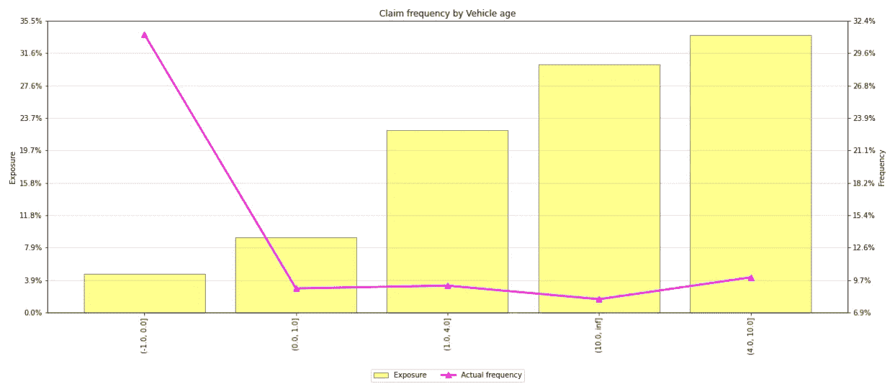

作者图片

上图显示了按车龄分类的索赔频率。我们可以看到，全新汽车的索赔频率有所提高，即`veh_age == 0`。

现在，如果我们退后一步，在不看数据的情况下考虑潜在的分组，我们可能会倾向于将全新的汽车与相当新的汽车分组(例如，将 0 岁的汽车与 1 岁的汽车分组)。如果我们这样做，我们将缓和索赔频率的巨大差异，这反过来会对模型的预测能力产生负面影响。

长话短说——分组前先看看！

## 一个热编码

我在上面暗示过，但是我将对(分组的)分类特征进行一次热编码。

我不会对此大做文章，因为这是一种很常见的方法，而且有大量的教程可供参考。在我看来，有两个很好的软件包可以试用——scikit-learn 和⁰.分类编码器我更喜欢类别编码器，因为我发现它比 scikit-learn 的实现更宽容。

# 模型

既然我们已经准备好了数据，我们就要开始建模了。

我将我的建模工作流程分为两个不同的阶段，首先定义模型类，然后定义训练循环。

## 模特班

还记得我说过 PyTorch 提供了构建模型的工具，而不是模型本身吗？这是一个很好的例子！

我们的模型是从 PyTorch 的`nn.Module`继承的 Python 类。我们必须定义网络的结构及其初始化，以及信息如何通过网络传递(“前向传递”)。

我是这样设置我的模型的:

```
class NeuralNetwork(torch.nn.Module):
    def __init__(self):
        super(NeuralNetwork, self).__init__()

        # linear
        self.F_hidden_one = torch.nn.Linear(75 + 1, 250)
        self.F_hidden_two = torch.nn.Linear(250, 250)
        self.F_output = torch.nn.Linear(250, 1)

        # add in drop out
        self.dropout_one = torch.nn.Dropout(p = 0.25)
        self.dropout_two = torch.nn.Dropout(p = 0.25)

        # initialise weights     
        # He initialisation
        torch.nn.init.kaiming_uniform_(self.F_hidden_one.weight)
        torch.nn.init.kaiming_uniform_(self.F_hidden_two.weight)
        torch.nn.init.kaiming_uniform_(self.F_output.weight)

        # initialise the final bias
        torch.nn.init.constant_(self.F_output.bias,y_hat)

    def forward(self, x):
        # ELU activations
        elu = torch.nn.ELU(alpha = 1)

        # calculate F
        F = self.dropout_one(x)
        F = self.F_hidden_one(F)
        F = elu(F)
        F = self.dropout_two(F)
        F = self.F_hidden_two(F)
        F = elu(F)
        F = self.F_output(F)
        F = torch.exp(F)

        return F
```

*先不说:使用* `nn.Sequential`有一个等价的定义网络的方法。*我发现这种方式比* `Sequential` *更清晰、更容易理解，我会推荐你使用你喜欢的任何一种形式。*

简而言之:

*   这是一个具有两个隐藏层的前馈神经网络。
*   有 75 + 1 个输入节点——每列一个，外加一个额外的列(稍后会详细介绍)。
*   每个隐藏层中有 250 个节点。
*   概率为 0.25 的丢弃应用于每个隐藏层(稍后会有更多的介绍)*。*
*   明凯(他)为权重初始化。
*   用`y_hat`初始化的输出层偏差，平均索赔频率，调整以反映网络的形式。
*   用于隐藏层的指数线性单位(ELU)激活。
*   在最后一层求幂。

输出层偏差的初始化是一个有趣的问题，这是我在排除其他故障时偶然发现的。

背后的想法相当简单——为了改进训练时间，我们给网络一个目标输出可能看起来像什么的“一般想法”,记住转换到适当的空间。在这种情况下,“总体思路”是平均索赔频率，我们已经将它(在其他地方)转化为日志空间——即`y_hat = log(mean claim frequency)`。如果你熟悉梯度增强的树模型，这个想法与使用初始或基础分数没有什么不同。

同样值得一提的是，在输出最终预测之前，对前向结果求幂。这个公式看起来非常像带有对数链接的经典广义线性模型，但是我进行了转换以确保网络输出为正。也许类似于 ReLU 的替代方法也可以实现这一点，但是在实验过程中，我发现取指数会产生更好的结果。

## 训练循环

该是我们写训练循环的时候了——模型必须正确学习！

为了训练我们的模型，我们将结合神经网络中的几个重要概念。

在我们**初始化**我们的模型后，我们将向前传递训练数据以获得初始模型预测。

然后，我们将计算训练目标的损失，并通过网络将其传播回来(**反向传播**)。所选的**优化器**将更新权重和偏差，并结束训练循环的单次迭代。

就代码而言，这看起来像这样:

```
# new model
model = NeuralNetwork().to(device)

# optimiser
optimiser = torch.optim.Adam(model.parameters(),lr = 0.001)

# training loop
for epoch in range(1,n_epoch+1):

    # training mode
    model.train()

    # prediction error
    F = model(train_X)

    # back-prop & weight update
    train_loss = poisson_loss(train_y,train_evy.float() * F)
    train_loss.backward()
    optimiser.zero_grad()
    optimiser.step()
```

一些细节:

*   我们用`model = NeuralNetwork()`创建模型的一个新实例。我们使用`to(device)`将模型发送到 GPU(如果可用，设备是包含 GPU 名称的变量)。
*   我们设置了一个学习率为`0.001`的亚当优化器。为此，我们输入原始未训练模型的权重和偏差(`model.parameters()`)。
*   `model.train()`激活模型的“学习”模式。
*   `F`是使用训练数据正向遍历模型的结果。
*   在反映了策略在预测中生效的时间之后，使用自定义函数`poisson_loss`计算训练损失(即通过 EVY 进行缩放)。
*   `backward()`方法进行反向传播。
*   使用`optimiser.zero_grad()`从优化器中清除任何先前循环的梯度，并使用`optimiser.step()`更新本轮训练的权重和偏差。

当损失在减少时，我们不断地通过训练循环；当我们关注训练损失时，我们可能会为过度适应和不良概括敞开大门。我们需要采取一些措施来避免这种情况。

## 过度拟合和提前停止

我们可以使用的一个工具是早期停止，这是一种旨在检测过度拟合并防止模型走得太远的方法。

提前停止背后的想法很简单。该模型在一组数据上学习，并在“看不见的”数据上测试。在我们的例子中，这些分别是我们的训练集和测试集。

当我们重复训练时，我们希望训练和测试集的损失都减少。这代表了一个预测性越来越强但仍具有普遍性的模型。

然而，很有可能的是，如果我们训练足够长的时间，我们的模型将开始拾取训练集中的噪声，而不是真实的信号。我们将会看到这种一般化的损失成为看不见的数据损失的恶化。诀窍是训练模型，直到我们在看不见的数据上实现最佳损失。

但是“突破”呢？我想从形式上来说，这将是逃避局部最小值的乐观者；简单地说，我们可以把乐观主义者想象成了解什么*不起作用，什么*起作用。

这暗示了某种试探，并强调了早期停止的另一个要求:需要允许乐观者尝试不同的事情。因此，我们需要在混合中引入某种形式的容差——允许乐观者嗅出路线，而不会走得太远。

现在，如果测试损失没有改善，超出了耐受范围，怎么办？好吧，我们回到模型的“最佳”版本。为此，我们需要记录模型的“最佳”版本。

我们可以迅速做出一些东西，并将其构建到培训循环中:

```
# initial set up
last_loss = 2_000_000
best_loss = last_loss
stopping_rounds = 200
counter = 0
model_state = model.state_dict()
minimum_improvement = 0.001

# training loop
for epoch in range(1,n_epoch+1):

    # training mode
    model.train()

    # prediction error
    F = model(train_X)

    # back-prop & weight update
    train_loss = poisson_loss(train_y,train_evy.float() * F)
    train_loss.backward()
    optimiser.zero_grad()
    optimiser.step()

    # test accuracy
    model.eval()
    with torch.no_grad():
        F = model(test_X)

    test_loss = poisson_loss(test_y,test_evy.float() * F).item()

    # early stopping
    current_loss = test_loss

    if current_loss >= best_loss:
        # loss does not improve - increment the counter
        counter += 1

        # if counter exceeds permissible rounds then break the loop
        if counter >= stopping_rounds:
            print(f'Early stopping after {epoch:,.0f} epochs')
            print(f'Best loss: {best_loss:,.4f}')
            print(f'Loss this epoch: {current_loss:,.4f}')
            print(f'Min. improvement required: {minimum_improvement:.2%}')
            break

    elif (
current_loss < best_loss
) * (current_loss > best_loss * (1 - minimum_improvement)):
        # loss improves but not my minimum required, increment the counter
        counter += 1

        # update best loss and model state
        best_loss = current_loss
        model_state = model.state_dict()

        # if counter exceeds permissible rounds then break the loop
        if counter >= stopping_rounds:
            print(f'Early stopping after {epoch:,.0f} epochs')
            print(f'Best loss: {best_loss:,.4f}')
            print(f'Loss this epoch: {current_loss:,.4f}')
            print(f'Min. improvement required: {minimum_improvement:.2%}')
            break

    else:
        # loss improves more than minimum required
        # reset the counter, update state, update best loss
        counter = 0
        model_state = model.state_dict()
        best_loss = current_loss
```

*为提高可读性而格式化的代码。*

我的小黑客做的很简单。

初始设置定义了“最后损失”和“最佳损失”，以及允许的公差量`stopping_rounds`和所需的测试损失的最小改善。

我们设置了三种可能的情况:(1)如果测试损失没有改善，(2)如果测试损失改善但没有达到所需的最小改善，以及(3)如果测试损失改善超过所需的最小改善。

如果测试损失没有改善，我们会在分数中增加另一个分数，即增加`counter`，这是测试损失没有改善或没有改善到最低要求的回合数的记录。如果计数超过给定的容差，循环就被打破，我们就停止训练——也就是说，我们提前停止。

在第二种情况下，试验损失有所改善，但没有达到最低要求。在这个例子中，我们更新了我们的最佳损失记录并更新了模型状态字典——我们想承认这仍然是一个改进。然而，我们也增加计数器并检查它是否超过容差。

如果测试损耗的改善超过最小值，我们将更新最佳损耗、模型状态，并重置计数器以期待进一步的增益！

## 过度拟合和辍学

一段时间后，神经网络可以开始适应训练数据集中的噪声，降低网络概括新的和看不见的输入的能力。在我们的情况下，这显然是不可取的。

这是机器学习大师的杰森·布朗利说的:

> 减少过度拟合的一种方法是在同一数据集上拟合所有可能的不同神经网络，并对每个模型的预测进行平均。这在实践中是不可行的，可以使用不同模型的小集合来近似，称为集合。

现在我可以想象，为了有效地集合网络，我们首先需要大量的网络。在我们的例子中，这可能不是完全不现实的，但是这种方法在更大或更复杂的用例中会很快变得不可行。

输入 dropout——一种允许我们近似训练和集合许多不同神经网络的方法。

再说一次，杰森·布朗利:

> 在训练过程中，一些层输出被随机忽略或“*丢失*”这具有使该层看起来像并且被视为像具有不同数量的节点和与前一层的连通性的层的效果。实际上，训练期间对层的每一次更新都是通过已配置层的不同“*视图*来执行的…
> 
> 丢弃会使训练过程变得嘈杂，迫使层中的节点在概率上或多或少地承担输入的责任…
> 
> 这种概念化表明，也许丢失打破了网络层共同适应以纠正前一层错误的情况，从而使模型更加健壮。

所以，如果我换个说法来构建:

*   每次我们运行**训练**步骤时，我们会随机“关闭”一些节点。
*   通过“关闭”，我们实际上意味着用零覆盖节点的输入和输出。
*   这使得剩余节点更有可能拾取信号，而不是纠正来自先前层的错误。
*   丢弃是按层实现的，可以引入到除输出层之外的任何层。
*   任何一个节点被置零的概率，即“丢失率”，是用户设置的一个额外的超参数。
*   在预测阶段，辍学是无效的。

如果你和我一样，喜欢将基于树的模型相提并论，我认为 dropout 类似于列采样，尽管一些模型已经开始在其算法中实现 dropout。

*此外:Ayush Thakur 有一个很棒的关于体重偏差的动画&直观地展示了辍学。*

## GPU 上的培训

简单说一下，因为我更愿意谈论结果！

我目前正在我的个人笔记本电脑上工作。虽然它更像是“可以的小笔记本电脑”，而不是一个专用的深度学习设备，但它确实有一个专用的 Nvidia GPU 卡，我一直在充分利用这个卡。

尽管如此，我一直在我的 GPU 上训练模型，将整个*训练集一次性通过模型。虽然这意味着我可以利用 GPU 加速(并且不用担心批量训练)，但它确实设置了一些限制。*

一个限制是模型大小。使用两个各有 250 个节点的隐藏层是我的 GPU 所能处理的极限，当我试图增加节点数时很快就遇到了内存问题(使用 dropout 时推荐)。*稍后将详细介绍这一点。*

总的来说，我使用 GPU 的体验总体来说很顺利。初始安装和设置很快，一旦 PyTorch 检测到任何可用的 GPU ( `device = cuda if torch.cuda.is_available() else 'cpu'`)，使用`.to(device)`方法将对象移入和移出 GPU 就很容易了。

保持所有东西都在哪里有点麻烦，但是你很快就会习惯。

现在，让我们来看看激动人心的事情——结果！

# 结果呢

终于到了看看模特引擎盖下到底发生了什么的时候了！

有几种方法可以做到这一点。我们将从一些更简单的视觉化开始，然后逐渐过渡到一些更复杂的解释器。

## 单向实际与预期

顾名思义，这些可视化是将实际目标与预期(或“模拟”)结果进行比较，每次跨越单个特征的水平(“单向”)。它们有时也被称为“AvE”图。

*此外:有一个合理的理由让你有似曾相识的感觉——这些事实上是建立在我们之前看过的图表之上的。*

这里有一个`area`的例子:

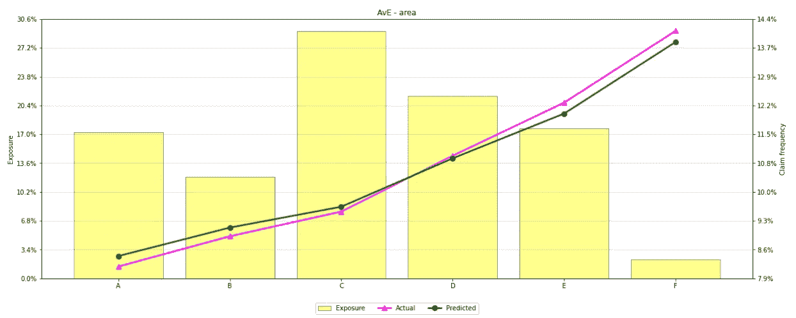

作者图片

快速复习:

*   沿着 x 轴我们有`area`的等级
*   黄色条(左边的 y 轴)显示总暴露量的*比例*，该比例属于`area`的每个级别
*   粉色和绿色线条(右侧 y 轴)分别代表实际索赔频率和预测索赔频率

在本例中，我们看到我们的模型略微超出了区域 A、B 和 C 的实际值，而低于区域 E 和 f 的实际值。

如果我们快速浏览这些 AvE 图表以了解其他一些特征，我们会发现一些有趣的事情——这里的模型很好地捕捉了`region`中大部分暴露的非线性趋势:

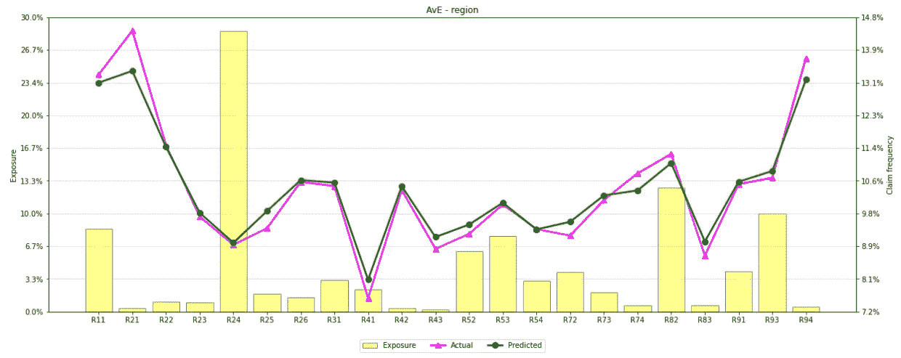

作者图片

`driv_age`也是如此:

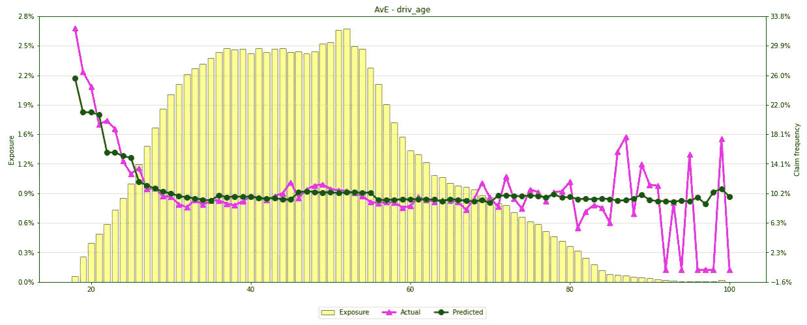

作者图片

…尽管在平均预测值中可以清楚地看到适用于驾驶员年龄的分组(即深绿色线中明显的台阶)。

总的来说，单向的模型拟合看起来还不算太差。

让我们继续研究相互作用。

## 多向图

可视化特征交互的一个简洁方法是创建多向图:通过一个、两个甚至三个特征绘制预测的索赔频率。这给了我们一种方式来理解——平均而言——不同的特性*如何相互作用*。

例如，下面是驾驶员年龄和区域相互作用的多向图:

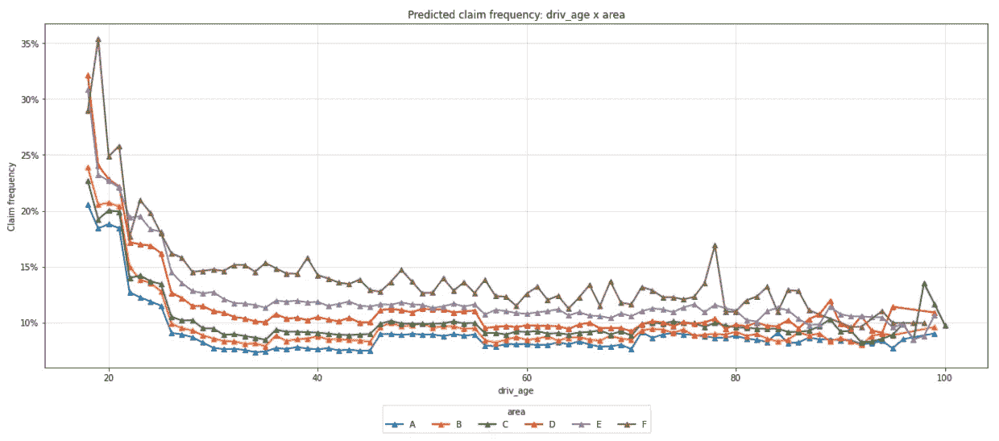

作者图片

该图表易于阅读——沿 x 轴是不同级别的驾驶员年龄，y 轴是预测的索赔频率。每条彩色线代表一层区域。

在这里，我们看到了我们之前在驾驶员年龄中看到的一般趋势——较低年龄组的高频率，随着年龄范围的上升而下降。

我们也看到了熟悉的区域趋势:A 区一般比 B 区风险小，B 区一般比 C 区风险小，等等。

有趣的是这些特征之间的关系。

让我们首先关注 B 区和 C 区:

*   我们的模型认为居住在 C 区的≤ 22 岁的司机比居住在 b 区的同龄司机风险更小。
*   对于年龄≤ 22 岁的驾驶员，绿线明显低于橙线。
*   然而，对于 23 岁及以上的司机来说，这种影响似乎相反，模型认为住在 C 区的司机比住在 b 区的同龄司机更危险。
*   我们看到，对于 23 岁以上的司机来说，绿线始终高于橙线。

在 D 区和 E 区也有一个有趣的影响，我们看到一个非常相似的索赔频率预测，直到司机 21 岁，之后有明显和一致的差异。

有时改变多向图的基础可以使发现交互更容易；这里有一个我重新设定的例子，用来显示预测频率与组最小值的比率:

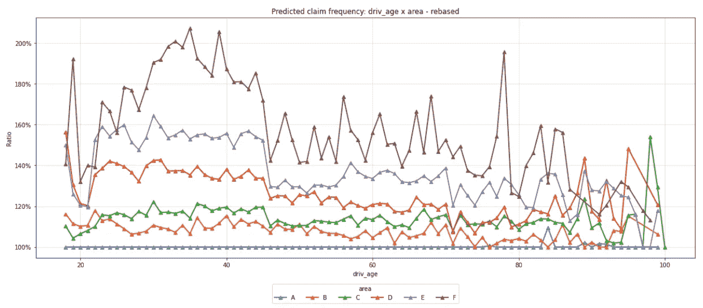

作者图片

尽管我很喜欢这些多向观想，但它们不是灵丹妙药。

首先，他们依赖于知道要询问哪些交互的建模者。如果您正在处理一个熟悉的任务或者对该问题有很好的领域知识，这可能是好的，但是如果您不确定从哪里开始寻找，这可能会成为问题。在这种情况下，使用某种特征选择方法来缩小“重要”交互将是有用的(看看弗里德曼的 H 统计)。

虽然多向图提供了比单向图更多的洞察力，但它并不能提供完整的故事。例如，我们不能肯定地说，上述影响完全是由于司机年龄和地区的相互作用——可能有其他投保人特征对这一趋势负责。

当处理高基数特征时，或者当向多向分割添加额外的“深度”(即更多特征)时，多向图表很快变得难以理解和难以解释。不是世界末日，而是要记住的事情！

让我们转而使用数据科学社区中更普遍的东西——SHAP 图。

## SHAP

我们可以使用 SHAP 包来研究我们奇特的新模型，或者使用更通用的内核解释器，或者使用`DeepExplainer`的实现。

设置非常简单——首先创建解释器，然后获得 Shaply 值:

```
# create the explainer
explainer = shap.DeepExplainer(
    model,
    torch.tensor(train_X.values).float()
)

# get the shapley values
shap_values = explainer.shap_values(
    torch.tensor(train_X.values).float()
)
```

然后我们可以得出特征重要性:

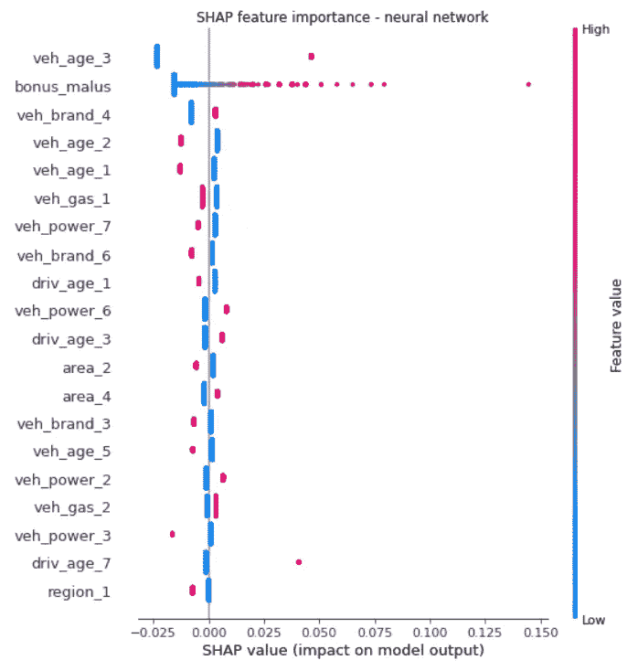

作者图片

特征编码使得理解一个特征作为一个整体如何影响预测有点困难，但是我们可以看到一些粒度效应。

例如，看起来驾驶一辆旧车会增加第三方汽车保险索赔的可能性。或许——更令人期待的是——更高水平的奖金 malus 推动了更高的索赔频率预测。

SHAP 依赖图让我们看到两个特征之间的相互作用。更好的是，用户可以指定他们希望可视化的功能，SHAP 软件包可以为该功能建议一个“有趣”的交互。整洁！

这是一个附加苹果 x 密度相互作用的依赖图的例子。同样，不是最有用的，但我们可以看到奖金 Malus 如何影响预测。

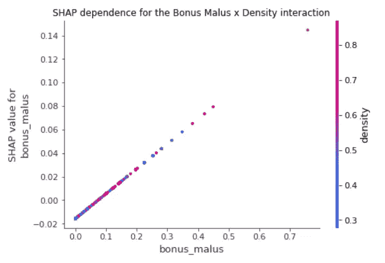

作者图片

力量图让我们看到每个投保人的特征是如何驱动其预测的。

这是一个随机选择的观察图表:


作者图片

…我们可以看到:

*   每个预测的“基值”或起点是 0.1137。
*   蓝色条表示驱使预测下降的特征。在这里，我们看到驾驶一辆更新的汽车降低了这个预测。
*   红色条代表推动预测上升的特征。例如，当一名 18-21 岁的司机会增加你的频率预测。
*   最终预测值(即 f(x))为 0.08，是从基础位置开始并应用向上和向下移动的结果。

这些图表对于检查*个人*的预测非常有用；我强烈推荐用它们来检查非常大或非常小的预测。

## 其他方法

SHAP 是*伟大的*，但是它不是获得特性重要性的唯一方法。

**排列重要性** ⁰以一种略微不同的方式来解决这个问题，当一个特征被随机打乱时，通过预测准确性的降低*来衡量重要性。从本质上讲，洗牌造成的准确度降低越大，该特征对模型就越“重要”。*

我还想看看 **Captum ⁰，**一个基于 PyTorch 的模型可解释性软件包。

最后，我们可以从基本原则出发，分析特性的重要性，并得出某种形式的**加权贡献**。这是基于网络权重指示节点之间的关系强度的基本原理；聚焦于将输入层连接到第一隐藏层的权重可以允许导出“基于权重的”特征重要性。

# 不太顺利的事情

不出所料，事情并没有完全按照计划进行。

事实上，许多事情并没有按照计划进行。这里只是一个最令人难忘的“实验”的简短列表。

*旁白:我应该强调的是，这些都是我曾经面临的问题——很有可能你不会有同样的经历。当然，只是因为我不能得到一些工作并不意味着它不会工作！*

## 零膨胀泊松模型

通常使用泊松过程对计数数据进行建模。乍一看，这似乎是一种合适的保险索赔数字建模方法(因为它们只是对投保人可能发生的索赔数量的计数)，但它比这稍微复杂一些:

*   绝大多数投保人根本没有索赔(我们看到不到 10%的培训数据有相关的索赔)
*   投保人可以有一个以上的索赔

因此，在某种程度上，这变成了一个“嵌套”建模问题，我们首先需要了解哪些投保人可能有索赔权，然后预测他们可能有多少索赔权(假设他们有索赔权)。

进入零膨胀泊松(ZIP)模型，这是一个结合了两种不同过程的混合模型:

1.  产生零的过程。
2.  产生泊松计数(其中一些可能为零)的过程。

现在更精确地说:

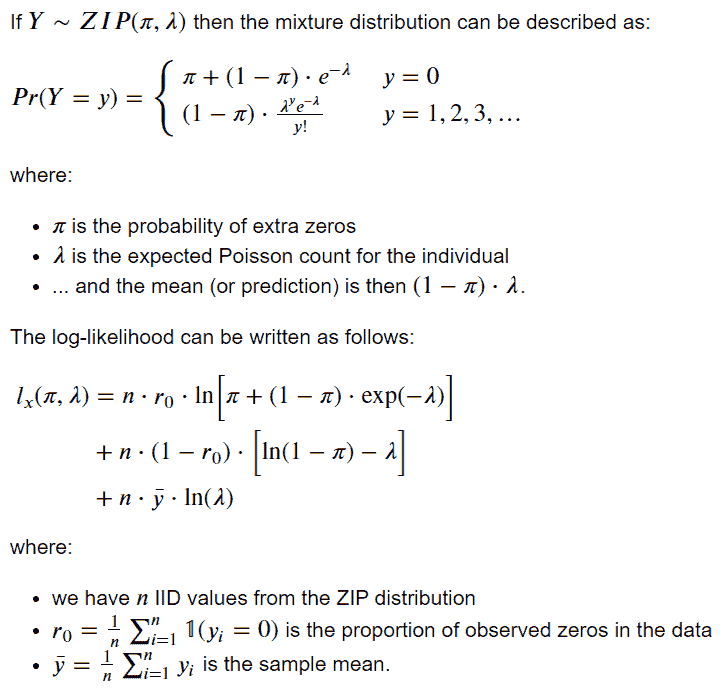

作者图片

在这种设置中，神经网络被设计成输出两个量——π和λ——并被训练成使得负对数似然损失函数最小化。这实际上是(9)中概述的 NeurFS 模型的“F”部分。

我使用这种方法尝试了各种实验，但总是发现我的预测偏离了一个一致的因素，尽管对网络的调整似乎使预测上下移动，但预测从未达到合理的水平。

我还发现很难理解什么是“好的”负对数似然得分。虽然对于一些损失函数(比如梅或 RMSE)来说，很容易理解什么是好的(甚至完美的)分数，但负对数似然函数绝对不是这样。

这是一个相当有趣的建模索赔频率的方法，我可能会在未来返回，并希望开始工作！

如果你有兴趣阅读关于零膨胀泊松模型的更多内容，我建议你看看:(14)、(150)、(16)。

## 不稳定模型

…或者“啊，为什么事情总是在变？!"。

单独的模型运行在预测和拟合参数方面产生了非常显著不同的结果。

我尝试了各种方法，包括设置随机种子和使用不同的权重和偏差初始化，但这些改变似乎没有帮助——网络仍然不稳定。

然后我看到一个讨论，认为较大的网络比较小的网络更稳定。潜在的逻辑是(换句话说，我的我):

*   较小的网络需要将信息塞进较小的包中…
*   实际上意味着节点连接包含更多信息…
*   因此，随着更多“信号”被关闭，某些节点的“去激活”——通过丢弃或初始化——会产生很大影响…
*   这会导致网络不稳定。

从较小的网络(每个隐藏层 100 个节点)转移到较大的网络(每个隐藏层 250 个节点)似乎可以解决这个问题。

## 大型模型和批量训练

现在我已经有了一个相当大且稳定的网络，我渴望从中获得尽可能多的性能。

我渴望权力，想要向四面八方扩展模型——更多的隐藏层，更多的节点，更多的一切！

只是，我的 GPU 说不。事实上，非常强调。

这意味着如果我要实现我的宏伟设计，我将需要使用批量训练。

批量训练的概念非常简单:在数据的子集上重复训练模型，直到它已经看到完整的训练数据(即，一个“时期”)，并对许多训练回合重复这一过程。

天下没有免费的午餐，因为批量训练有其自身的细微差别。

一个细微差别是**网络中更多的**不稳定性；网络一次只能看到一个数据子集，因此批量中目标的任何大的变化(以及因此的损失)都会导致参数更新的中断。

在我们的案例中，绝大多数索赔计数为零，但我们确实有一些投保人有 11 项索赔的情况。这将造成严重的训练损失，并且当权重和偏差更新时，可能会引起相当大的变化。

通过使用更大的(潜在分层的)批次，这种现象可以在一定程度上得到缓解，因为理论上每一批次更能代表整个目标。但是“大”有多大呢？批量大小是另一个可调参数，它不仅会影响训练时间，还会影响模型的学习方式(从而影响模型的预测能力)。似乎有一些证据表明，使用较小的批次会产生更好的结果，但这可能是需要由建模者根据具体情况确定的另一个因素。

批量标准化⁷是一种经常用于解决批量训练中不稳定性的方法。这种技术本质上是学习应用于流经网络的数据的转换，确保网络内的所有数据*保持在可管理的范围内。*

建议不要同时使用批量规格化和丢失，因为它们分别减少和引入噪声，就像一只脚踩刹车，另一只脚踩油门一样。

所有这些都是相当技术性的东西，我们还没有到批量训练的更实际的元素:训练时间。当我们使用整个数据集进行训练时，反向传播和参数更新发生在数据集流经模型之后——本质上，我们进行`number of rounds`更新。批量训练需要在每一批通过模型后进行更新，所以我们有效地做`number of batchs` x `number of rounds`更新；不管你喜不喜欢，这在计算上会更慢。

我希望我能汇报一下批量训练对我的模型的表现有多大的改善。虽然我确实启动并运行了批量训练过程，但我也确实重新安排了 r̵u̵n̵̵o̵u̵t̵̵o̵f̵̵p̵a̵t̵i̵e̵n̵c̵e̵的优先级，并决定恢复到更小、对 GPU 更友好的模型。

## (差点)被树打了

我对基于树的模型相当熟悉，所以想比较和对比我的神经网络与梯度增强树模型(特别是 LightGBM)的性能。

我在相同的训练数据上建立了一个非常简单的 GBM 模型，并对神经网络进行了一些测试。模型性能结果是相似的。事实上非常相似。

我很好奇，想知道这是一个已知的普遍现象，还是仅仅是“我”的问题。事实证明，它似乎不是这个用例的特定内容！

鲍里索夫等⁸注:

> 异构表格数据是最常用的数据形式，对于许多关键和计算要求高的应用程序来说是必不可少的。在同质数据集上，深度神经网络一再表现出优异的性能，因此被广泛采用。然而，他们的适应表格数据的推理或数据生成任务仍然极具挑战性。

但是证据呢？是否有经验证据表明神经网络在混合型表格数据上不容易胜过 GBM？

事实上，⁹:在不同数据集上对混合任务进行了 42 次实验，LightGBM 的表现优于神经网络 35:7。这里有一些细微的差别，但它仍然是一个相当大的打击。

让我们把它放在那里，结束吧——你现在可能已经厌倦我了。

# 一个总结，只是多一点散漫

## 包裹

我们在这一次已经涉及了很多领域。让我们总结和反思。

我们更新了关于神经网络的知识，并简要了解了用于构建模型的框架 PyTorch。

我们花了一点时间讨论数据和应用于数据的工程学。我可能花了比预期更多的时间来谈论它，但希望我的漫谈能给外行人一些现实世界的保险见解。

我经历了模型结构，训练循环，通过退出解决过度适应，通过早期停止解决过度适应。我还花了一点时间了解 GPU 上的培训是如何为我工作的。

我们花了一些时间检查结果。我们看到了像 AvE 图表这样简单的可视化如何简单地洞察模型拟合。我们还看到了如何使用 SHAP 软件包来更深入地了解神经网络这个“黑箱”。

我分享了一些(许多)不太适合我的事情。

我们看到零膨胀泊松理论听起来有潜力，但是我的实现并没有产生很大的结果。

扩大网络的规模克服了一些稳定性问题，但增加太多需要转向批量训练；批量训练有其自身的复杂性。

最令人失望的是，我们还看到我的网络几乎被 LightGBM 模型超越。

## 反思和下一次的事情

构建神经网络是困难的，我毫不惭愧地承认，我花了一些时间来理解这些模型的复杂性(我只是触及了表面)。也就是说，有一些很好的资源可用。然而，我确实发现，大多数资源都是针对初学者或高级从业者的，所以这两者之间似乎有一点差距。

我短暂的经验表明，建立一个好的神经网络就像撬锁一样——为了让模型工作，一切都必须兼容，一切都必须排列正确。我对开锁并不太了解。

下次我会做一些不同的事情。我要做的一个主要改变是将单独的代码片段缝合到一个管道中，或者将容易组装的代码片段作为一个管道运行。这将允许更多的实验，并允许在管道的其他部分进行实验——例如，在数据准备中，我很想尝试不同的功能编码。

我之前提到过，我会解释为什么我有 75 + 1 个输入层节点，我已经戏弄了足够长的时间。这只是从回归中借用的一个想法:设计矩阵包含一列用于估计截距的 1。我发现包括这个改进的模型性能，即使我通过输出层偏差项输入关于“截距”的建议。这是下次要探讨的其他内容。

说到更传统的回归，我可能应该详细解释一下为什么我没有使用风险敞口作为协变量，尽管它是索赔频率的一个强有力的预测因素。大多数泊松回归都使用它，要么将`log(exposure)`作为“补偿”项，要么对计数与暴露的比率(即`count / exposure`)进行建模。答案是，我尝试了不同的使用方法，它们并没有真正影响模型性能。它仍然存在于训练循环中——在计算训练损失之前，我通过暴露来衡量预测——但它没有直接*输入到模型中。*

下次还有一件事——辍学率。我使用的比率是 0.25，即节点被“归零”的概率是 25%。这明显低于我在其他文章和论坛看到的。我觉得这个选择很好，因为我也使用了提前停止的实现来避免过度拟合，但如果提前停止不是一个选项，我会考虑提高辍学率。

我很惊讶地发现网络在混合表格数据上的表现(相当平淡无奇)。虽然地平线上可能会有一些好消息，所以我一定会关注 NODE 和 TabNet ⁴.

这就是我要说的。我希望这是有用的。请随时在评论中提供反馈——因为我是这方面的新手，我将非常感谢你可能有的任何提示和指点。

又到了一年中的这个时候，我想祝你和你所爱的人节日快乐。就当这是我送给你的闪亮圣诞礼物。或煤块。

# *证明人、信用和许可证*

1.  让我们来学习:神经网络#1。我学习的一步一步的编年史… |作者布拉德利·斯蒂芬·肖| Medium
2.  [PyTorch](https://pytorch.org/)
3.  [张量流](https://www.tensorflow.org/)
4.  [OpenML](https://www.openml.org/search?type=data&sort=runs&id=41214&status=active)
5.  [知识共享——归属 4.0 国际——CC BY 4.0](https://creativecommons.org/licenses/by/4.0/)
6.  [CASdatasets-manual.pdf(uqam . ca)](http://cas.uqam.ca/pub/web/CASdatasets-manual.pdf)
7.  [目标编码分类变量|作者 Viní cius Trevisan |走向数据科学](/dealing-with-categorical-variables-by-using-target-encoder-a0f1733a4c69)
8.  [什么是机器学习中的目标泄漏，我如何避免？—数据机器人 AI 云](https://www.datarobot.com/blog/what-is-target-leakage-in-machine-learning-and-how-do-i-avoid-it/)
9.  [(PDF)神经频率-严重性模型及其在保险索赔中的应用(researchgate.net)](https://www.researchgate.net/publication/352642149_A_Neural_Frequency-Severity_Model_and_Its_Application_to_Insurance_Claims)
10.  [类别编码器—类别编码器 2.5.1.post0 文档(scikit-learn.org)](https://contrib.scikit-learn.org/category_encoders/)
11.  [对正则化深度神经网络辍学的温和介绍——MachineLearningMastery.com](https://machinelearningmastery.com/dropout-for-regularizing-deep-neural-networks/)
12.  [在 PyTorch 中实现辍学:示例—权重&偏差(wandb.ai)](https://wandb.ai/authors/ayusht/reports/Implementing-Dropout-in-PyTorch-With-Example--VmlldzoxNTgwOTE)
13.  [DART booster — xgboost 1.7.1 文档](https://xgboost.readthedocs.io/en/stable/tutorials/dart.html)和[参数—light GBM 3.3.3.99 文档](https://lightgbm.readthedocs.io/en/latest/Parameters.html)
14.  [零膨胀模型——维基百科](https://en.wikipedia.org/wiki/Zero-inflated_model)
15.  [零膨胀泊松回归模型——时间序列分析、回归和预测(timeseriesreasoning.com)](https://timeseriesreasoning.com/contents/zero-inflated-poisson-regression-model/)
16.  [很多零还是太多零？:思考计数数据中的零膨胀(rbind.io)](https://aosmith.rbind.io/2019/03/06/lots-of-zeros/)
17.  [如何使用 PyTorch 中的 BatchNorm 图层？—知识转移(androidkt.com)](https://androidkt.com/use-the-batchnorm-layer-in-pytorch/)
18.  【2110.01889.pdf(arxiv.org)
19.  [Lightgbm vs 神经网络| MLJAR](https://mljar.com/machine-learning/lightgbm-vs-neural-network/)
20.  [4.2。排列特征重要性—sci kit—了解 1.2.0 文档](https://scikit-learn.org/stable/modules/permutation_importance.html#:~:text=The%20permutation%20feature%20importance%20is,model%20depends%20on%20the%20feature.)
21.  [py torch 的 Captum 模型可解释性](https://captum.ai/)
22.  [8.3 特征交互|可解释机器学习(christophm.github.io)](https://christophm.github.io/interpretable-ml-book/interaction.html)
23.  [https://arxiv.org/abs/1909.06312](https://arxiv.org/abs/1909.06312)
24.  [https://arxiv.org/abs/1908.07442](https://arxiv.org/abs/1908.07442)