# 让我们开始:使用 DBSCAN 进行空间聚类

> 原文：<https://towardsdatascience.com/lets-do-spatial-clustering-with-dbscan-c3dbfd9fc4d2>

## 演示如何结合自定义指标和贝叶斯优化来调整基于密度的空间聚类算法。

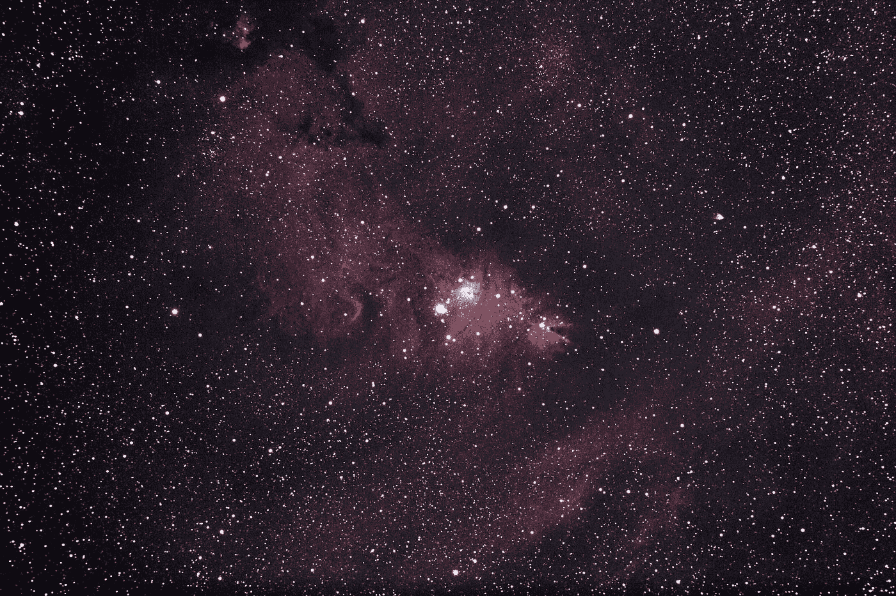

照片由[阿鲁迪巴 S](https://unsplash.com/@aldebarans?utm_source=medium&utm_medium=referral) 在 [Unsplash](https://unsplash.com?utm_source=medium&utm_medium=referral)

# 背景和导言

在过去的几年里，我曾经住在一个住宅区一个相当热闹的酒吧的对面。对该地区(和国家)不熟悉！)我认为这将是一个非常有趣的方式来更多地了解当地人和这个地区。

嗯，正如“马路对面”不能准确描述离家有多近一样——我可以坐在酒吧里，仍然可以连接到我家的 Wi-Fi——“热闹”并不能真正公平地反映警察执勤时去酒吧的次数。

现在，客观地说，警方的访问有一些共同的特点:

*   几乎所有的访问都是在星期五或星期六晚上
*   大多数访问往往发生在晚上 11:30 以后
*   大多数参观都以少数顾客坐上警车而告终
*   活动总是被限制在酒吧的范围内。

如果我们把关心邻居的帽子换成数据科学的眼镜，我们可能会开始以不同的方式思考所有这些活动:我们在一个小的地理区域内发生了许多类似的事件。或者，换句话说，一个**集群**！由于这个国家可能有不止一个小的社区酒吧，可能会有更多的麻烦分散在各地。

这巧妙地将我们带到了今天的主题——空间聚类。

我们的使命，我们是否应该选择接受它(我们愿意):**我们能否从大量公开的事件日志中识别出犯罪活动的集中集群？**

首先，我们需要一些数据。

# 数据

我们将使用来自公共门户网站的英国犯罪数据；当然，明确提醒我们自己，它**包含根据开放政府许可 v3.0\.** 许可的公共部门信息，正如其许可条件所要求的那样。

我下载并汇总了 2019 年 1 月至 2019 年 12 月期间的所有警察部队数据，这是大约 600 万行数据集的一个片段:

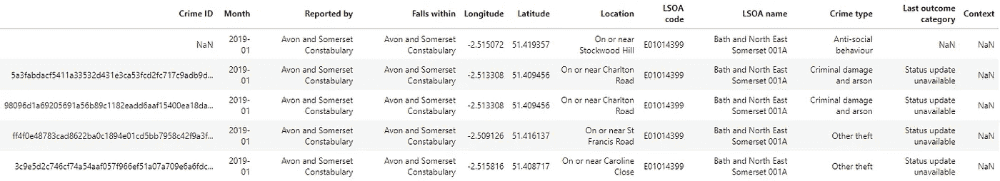

作者图片

三个变量引起了我的注意——纬度、经度和犯罪类型。

纬度和经度为我们提供了犯罪事件的地理位置，犯罪类型将允许我们专注于特定的犯罪类型(这很有用，因为当我们开始进行密集计算时，我不希望我的笔记本电脑着火)。

*旁白:熟悉英国地理系统的读者会注意到下超级产出区(LSOA)的存在，但没有邮政编码。这意味着我们可以潜在地加入到其他数据集，但是缺少 postcode 可能提供的粒度。然而，有一些非常有趣的方法，我们可以从一组(纬度，经度)对中找到最近的邮政编码。*

让我们快速检查一下缺少的值:

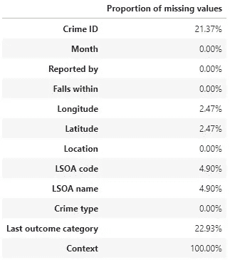

作者图片

关于我们所关心的变量，看起来我们处于一个很好的位置，因为只有一小部分纬度和经度有缺失值。我们将从数据中删除这些观察结果，然后继续。

*旁白:检查缺失值是否有偏差总是好的，例如，缺失值是否仅限于特定的警察部队？缺失值是否仅限于特定的日期范围？这些检查的结果可能会影响对缺失信息的处理。*

让我们来看看犯罪的分布:

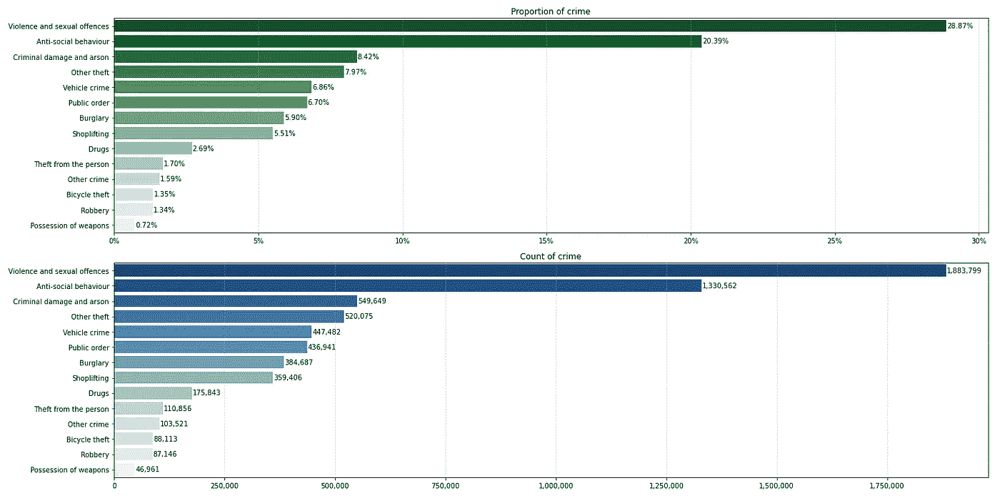

作者图片

我们看到:

*   暴力和性犯罪是 2019 年最常见的犯罪；持有武器是最不常见的。
*   盗窃有不同的种类:从人身上盗窃，自行车盗窃，其他盗窃。
*   尽管可能存在盗窃的因素，但抢劫和入室盗窃与盗窃是分开处理的。
*   我想知道车辆犯罪包括哪些内容。会不会是利用交通工具实施的犯罪——例如，欺骗性地制造事故？或者可能是影响车辆本身的犯罪，例如从车内盗窃，或者可能是对车辆的破坏？我肯定谷歌一下会有所帮助，但我会把这留给未来的布拉德去发现。

我提到在这个练习中我们将只关注一种犯罪类型——我将选择**入室盗窃**,因为它在数量上处于中间位置。

*旁白:当使用受地理和基本人口统计影响很大的数据时，进行某种形式的汇总和/或合理化是很正常的。*

例如，在其他条件相同的情况下，我们预计在人口较多的地区，犯罪率会更高。不使用计数来比较地区，使用人均犯罪率可能更合适，因为默认情况下人均犯罪率将根据人口进行调整。

*我们不会做任何类似的事情——但稍后会有更多的介绍。*

# 动机和方法

## 动机

现在我们有了 2019 年的入室盗窃数据，我们可以立即看到任何热点吗？

让我们构建一个英国热图——感谢`folium`——记住，由于我们使用的是原始数据，城市中心将默认成为热点:

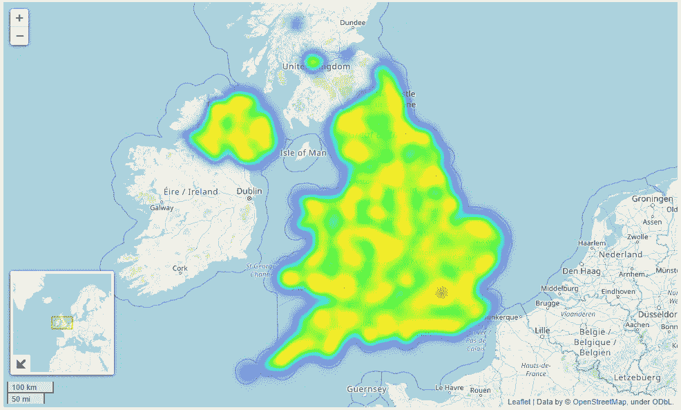

作者图片

让我们以北爱尔兰为例，来看看潜在的城乡差距有多明显:

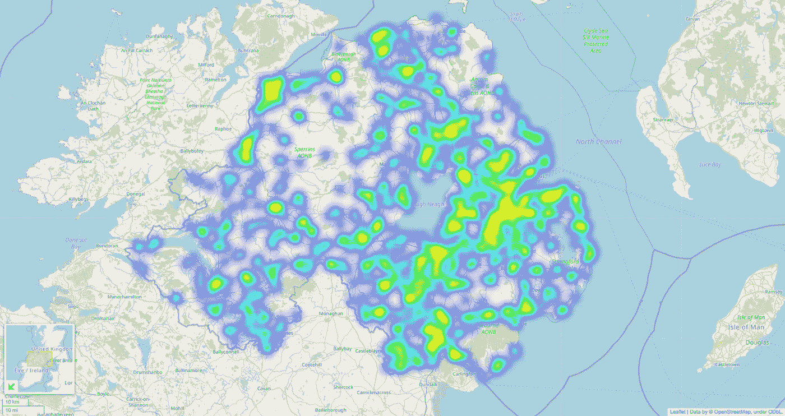

作者图片

如此明显的分歧！热图使用了某种形式的平滑——我们能看到一些小星团的例子吗？

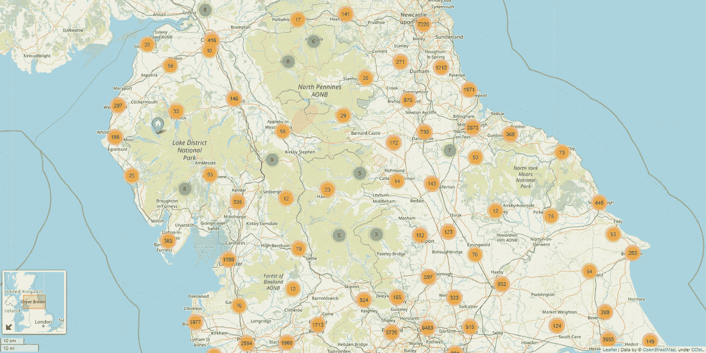

作者图片

很好地显示了成群的盗窃案，但是这些“群”往往覆盖了重要的区域，而不是狭窄的邻近地区。

一些观察结果:

1.  相对于英格兰、威尔士和北爱尔兰，我们似乎几乎没有苏格兰的数据。
2.  存在着明显的城乡差别，这也许被热图可视化中的平滑化夸大了。这没什么好惊讶的，因为城市地区往往有更多的人口，我们关注的是入室盗窃的数量(而不是比率)。
3.  在由`folium`建议的簇内，我们也许可以从中导出更集中的簇。

## 期望成果

现在很清楚，我们有(1)大量的盗窃案分布在英国大部分地区,( 2)往往发生在集中的地区，让我们试着从我们的聚类练习中定义我们想要的。

理想的情况是，我们的聚类分析将为我们提供小而密集的入室盗窃聚类。这些集群将需要尽可能地不同(即分离)，这意味着每个集群周围和集群之间有清晰的“空间”。

我们还希望我们的方法能够确定我们所达到的“最佳”集群数量。这里的基本原理很简单:预先指定聚类数不仅会引入偏差，还可能导致对聚类的不正确的观察分配。

我们还应该允许算法将一些观察结果视为噪声。也就是说，我们接受并非每一次盗窃都是一个聚类的一部分，通过“丢弃”一些观察结果，我们可能会得到更清晰的聚类。

最后，我们希望能够解释集群是如何构建的，以及它们是如何被调优的；也就是说，我们在任何优化流程中使用的度量标准都需要是可解释的和容易理解的。

## 方法

聚类将通过使用`sklearn`实现基于密度的带噪声应用空间聚类(DBSCAN)来完成。该算法将聚类视为由低密度区域分隔的高密度区域，并且需要定义“密度”的两个参数的规范。

由于这些参数需要一些输入，并且我不是聚类专家，我将使用优化方法来确定“最佳”参数对。

优化过程需要一个输出或指标来优化。我们将找到最小化从“边界”到最终聚类“中心”的平均距离的参数。

概略地说，这是:

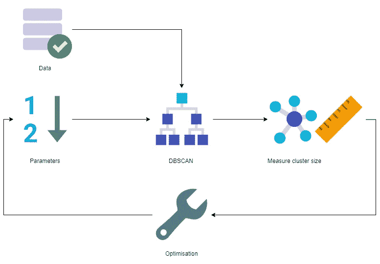

作者图片

当然，还有更多细节。

我们将测量(纬度、经度)点云中各点之间的“距离”。典型地，哈弗线距离用于确定坐标对之间的千米距离。这很容易在 DBSCAN 的`sklearn`实现中使用，但是当我们直接计算距离时，我们需要一个我们自己的实现。

我们想要测量从一个集群的“边界”到其“中心”的距离。我们将首先通过使用凸包(更多内容将在后面介绍)来识别一个集群的边界，并在我们的平均边界到质心计算中使用凸包顶点。

旁白:在距离计算中只使用凸包的顶点在两个方面是有用的。(1)第一次尝试更容易掌握和实现，以及(2)将节省我们的计算资源(我可怜的小笔记本！)通过不必计算所有 *边界点的* ***到质心的距离。***

在此过程中，我们将简化聚类质心的计算，使其成为聚类中所有(纬度、经度)坐标对的平均值。*请注意，这可能会导致质心实际上不在数据中！*

所以在视觉的帮助下:

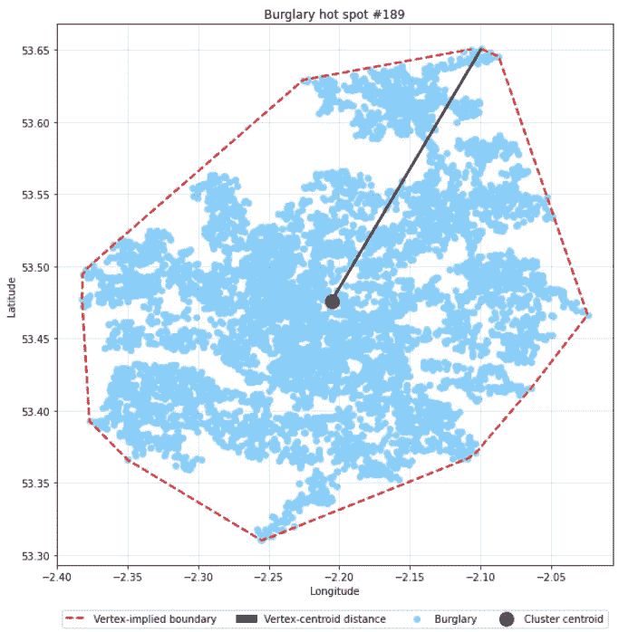

1.  我们选择输入参数，并使用 DBSCAN 对数据进行聚类。
2.  上面显示了其中一个聚类，蓝点代表该聚类中的观察结果(聚类#189)。
3.  我们使用凸包运算来寻找聚类的凸边界或边界。这由红色虚线表示。
4.  我们将质心计算为聚类中(纬度，经度)对的平均值。在这种情况下，看起来我们到达了一个不在数据中的质心。
5.  使用凸包的顶点(即边界点)，我们计算平均顶点到质心的距离。我们将这个值传递给优化器，并通过更新的参数选择返回到(1)中。

# (算法)细节中的魔鬼

让我们更详细地介绍一下算法的每个组成部分。

## 哈弗线距离

如上所述，我们可以使用哈弗线距离计算来量化两个坐标对之间的公里距离。

更正式地说:

> 哈弗辛公式确定了给定经度和纬度的球体上两点之间的大圆距离。在航海中很重要，它是球面三角学中一个更一般公式的特例，即哈弗斯定律，它涉及球面三角形的边和角。⁴

现在，使用地球表面上的点的哈弗辛公式掩盖了我们将要做的一个小的简化:地球不是球形的(不，它也不是平的)。

我们假设，因为我们集中在相对小的地理范围内的小区域，地球的形状不会扭曲结果。

数学上，哈弗辛公式如下:

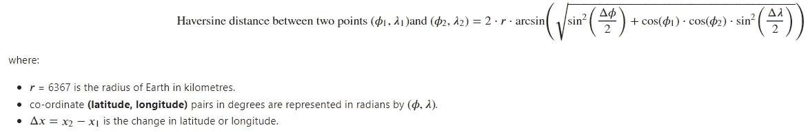

作者图片

…由于出色的 StackOverflow post⁵，我们实现了快速的矢量化 Python 实现:

## 基于密度的噪声应用空间聚类

…或者对有噪声的应用程序进行基于密度的空间聚类是一种…

> 基于密度的聚类非参数算法:给定某个空间中的一组点，它将紧密聚集在一起的点(具有许多邻近点的点)组合在一起，将单独位于低密度区域中的点标记为离群点(其最近的邻近点离 away)⁶.太远)

从`sklearn`开始:

> DBSCAN 算法将分类视为由低密度区域分隔的高密度区域。由于这种相当一般的观点，由 DBSCAN 发现的聚类可以是任何形状，这与假设聚类是凸形的 k-means 相反。

另一个关键区别是，DBSCAN 不要求用户指定要使用的集群数量，随着被集群的数据变得越来越大和/或越来越复杂，这变得越来越困难。

DBSCAN 有两个参数:`epsilon`和`min_points`，它们一起定义“density"⁷:”

*   `epsilon`是一种距离度量，用于定位任意点邻域内的点
*   `min_points`是一个区域被认为是密集的聚集在一起的最小点数(阈值)

DBSCAN 中的关键概念是**核心点**和**可达性**，这些概念被组合以生成聚类并过滤掉“噪声”点。

同样，大部分来自 Wikipedia⁶:

> 如果至少`min_points`在 *P* 的距离`epsilon`内(包括点 *P* 本身)，则点 *P* 为**核心点**。
> 
> 如果点 *Q* 在点 *P* 的`epsilon`距离内，则点 *Q* 是从点 *P* 可直接到达的**。点只能从**核心点**直接到达。**
> 
> 如果存在一条路径*P→Q→……→R*其中每个中间点都可以从前一个点直接到达(例如 *Q* 可以从 *P* 直接到达)，那么从点 *P* 到点 *R* 就是**可达**。这意味着 *P* 和沿路径的所有其他点都是核心点，可能除了 *R.*
> 
> 从任何其他点都无法到达的所有点被称为“噪声”或“离群点”。
> 
> 如果 *P* 是一个核心点，它与从 *P* 可达的所有点(核心或非核心)形成一个簇。每个集群包含至少一个核心点。
> 
> 非核心点可以是群集的一部分，但是形成群集“边缘”,因为它们不能用于到达其他点。
> 
> 可达性不是对称关系:根据定义，只有核心点才能到达非核心点。反之则不成立，所以一个非核心点可能是可达的，但从那里什么也达不到。因此，需要一个进一步的概念**连通性**来正式定义 DBSCAN 发现的集群的范围。两个点 *P* 和 *Q* 是密度连通的，如果有一个点 *O* 使得 *P* 和 *Q* 都可以从 *O* 到达。密度连接*是对称的*。
> 
> 一个集群满足两个属性:
> 
> 1.集群中的所有点都是相互密度连接的。
> 
> 2.如果一个点从集群的某个点是密度可达的，那么它就是 well⁶.集群的一部分

嗯，这有点拗口。让我们看看我们能不能画出一些来！

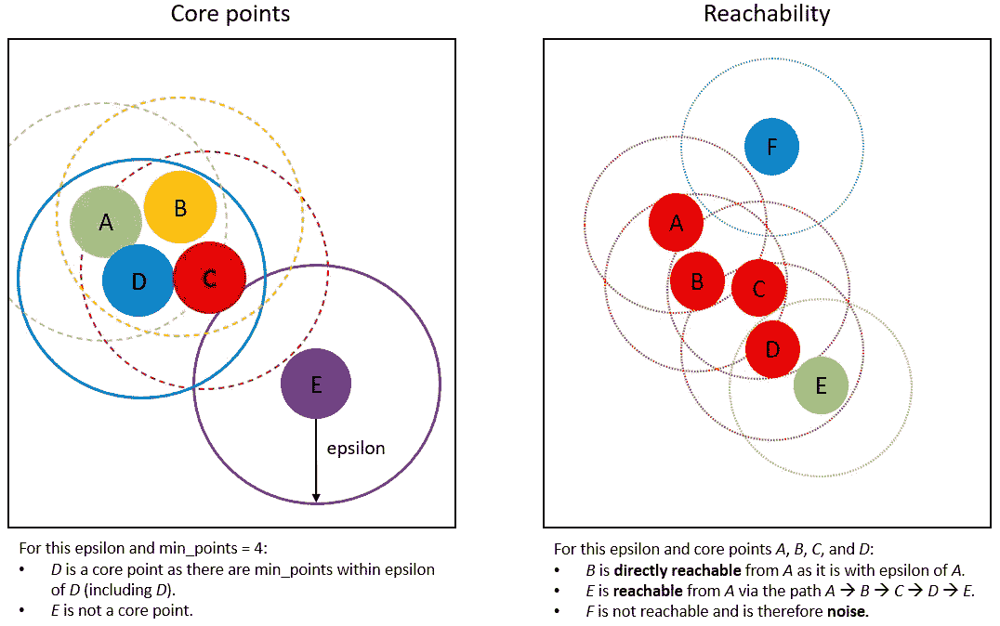

作者图片

左边的图表直观地探索了“核心点”的概念；右边的一个形象化了可达性的概念。

好了，现在我们已经对算法的工作原理有了一个基本的了解，我们可以看看如何实现它吗？是的，让我们。

需要注意的事项:

*   我们可以直接用哈弗线距离作为度量——`metric = "haversine"`。
*   哈弗辛计算要求坐标对用弧度而不是度数来表示。我们通过快速调用我最喜欢的包之一— `numpy`来做到这一点。我们需要确保坐标对的顺序是正确的，因为`sklearn`希望纬度优先。
*   由于我们现在谈论的是弧度，我们需要将`epsilon`输入转换成弧度。
*   球树算法用于加速算法运行时间。
*   我们返回聚类标签，因为这是我们唯一感兴趣的。

现在，让我们再次在 Wikipedia⁶的帮助下，通过记住要注意的事情来结束我们对 DBSCAN 的快速浏览(尽管重点是我自己的)。

> **DBSCAN 不完全是确定性的:**根据数据处理的顺序，可以从多个集群到达的边界点可以是任一集群的一部分。对于大多数数据集和域，这种情况不会经常出现，并且对聚类结果影响很小。
> 
> **DBS can 的质量取决于距离测量**...最常用的距离度量是欧几里德距离。特别是对于高维数据，由于所谓的“维数灾难”，这种度量可以变得几乎无用，使得难以找到ε的合适值。然而，这种效应也存在于任何其他基于欧几里德距离的算法中。
> 
> **DBSCAN 不能很好地对密度**差异较大的数据集进行聚类，因为`min_points — epsilon`组合不能适用于所有的聚类。
> 
> 如果没有很好地理解数据和比例，**选择一个有意义的距离阈值ε可能是困难的**。

我们将离开 DBSCAN，继续讨论凸包——即我们如何构建我们的聚类边界。

## 凸包

按照我的想法，二维凸包是包围二维点云的最小凸多边形。在这种情况下,“凸”只是意味着多边形的内角不大于 180 度(如果它大于 180 度，那么外壳将自己“向内转”并变成“凹”)。

Wikipedia⁸有一个很好的类比来设想凸包是如何创建的:如果我们希望在点云 ***C*** 周围构建一个凸包，我们可以想象一个围绕 ***C*** 拉伸的弹性带，然后让它绷紧；紧带的形状就是凸包。视觉上就是:

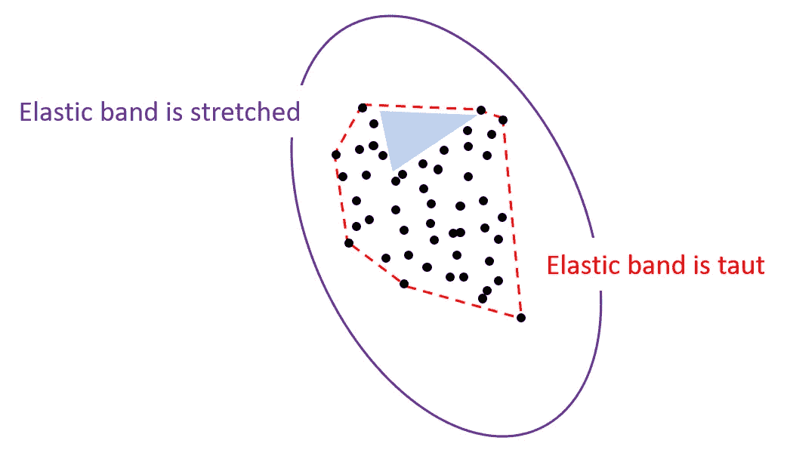

作者图片

在这里，我们看到弹性带如何首先围绕点云(紫色)拉伸，然后拉紧以创建凸包(红色)。

让我们把注意力集中在蓝色阴影区域。如果我们要在所有点周围画一个外壳，阴影区域可能会在外壳外面。但是，这意味着外壳不会凸起，因为闭合多边形所需的一些内角会超过 180 度。如果我们沿着这些思路继续思考，我们可以认为凸壳包含凹壳。

值得再次提醒我们自己地球的形状及其在我们工作流程中的作用。凸包的数学在笛卡尔平面上工作得很好，但是可能不能很好地转化为在曲面上操作。我们在这里做另一个简化的假设，由于星团的性质，即它们应该包含彼此非常接近的点，我们关注的区域足够小，足以让我们认为它是平坦的，因此我们的船体数学将成立。

最后，我们使用在`scipy` ⁹.中可用的凸包实现这个实现允许我们到达凸包的顶点，并且计算凸包的面积和体积。

*旁白:凸包可以扩展到三维。在这种情况下，它是包围三维点云的最小三维凸多边形。如果我们扩展维基百科的类比，这就像在三维云点周围膨胀一个橡胶气球，然后让气球拉紧。*

## 度量:平均顶点-质心距离

简单介绍一下我们将用来优化`espilon`和`min_points`的指标。

方法相当简单:

1.  对于每个集群，我们将计算凸包。
2.  使用这个外壳，我们可以识别集群的顶点；我们将使用我们的哈弗线距离功能来计算从每个顶点到聚类质心的距离。
3.  然后，我们将取顶点-质心距离的平均值，以得出每个聚类的值。

然后，我们可以对所有集群进行平均，以了解总体集群工作的进展情况。

理想情况下，我们喜欢小而密集的星团。使用这个度量标准，我希望我们可以选择一对最佳的`epsilon`和`min_points`(即定义“密度”的值)来实现这两个目标。我很可能错了——有一种方法可以找到答案！

就代码而言，实现起来相当简单:

眼尖的读者会注意到，少于三个点的集群的方法略有不同——这是因为`ConvexHull`需要三个或更多的点来构建凸包。

## 最佳化

最后，但同样重要的是，谈谈优化，或者我们将如何选择`epsilon`和`min_points`。

我们将使用我最喜欢的优化算法——贝叶斯优化⁰.这是一个真正强大的框架，允许我们优化任何黑盒功能，而不局限于优化机器学习模型。

我之前已经在这里介绍过优化是如何工作的[，但是我们可以用图解的方式表示如下:](/seeing-numbers-bayesian-optimisation-of-a-lightgbm-model-3642228127b3)

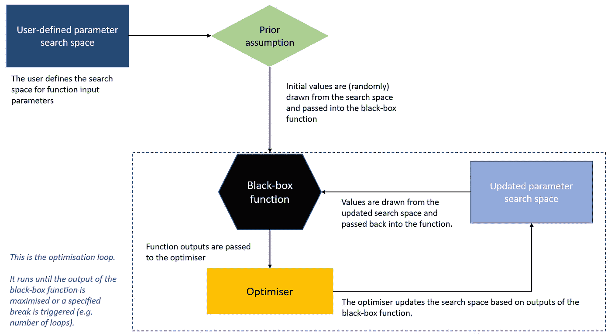

作者图片

# 一些结果

叽叽喳喳说够了——是时候得到一些结果了，对吗？对！

一旦我将上面所有的功能和想法结合到一个令人信服的工作流程中，我就进行了优化:

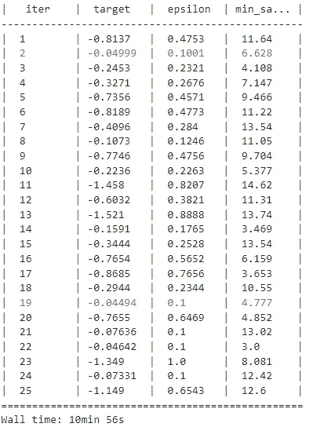

作者图片

紫色文本突出显示了最佳迭代。这里我们看到平均顶点-质心距离是 40m，并且是在`epsilon = 100m`和`min_points = 4`时产生的(在后台，我将`min_samples`的浮点值转换为整数，然后输入到 DBSCAN)。

从表面上看，这似乎是一个合理的结果。让我们直观地检查一些集群。

这里我们有一个大的集群，即在伦敦市中心有大量盗窃案的集群*(泡泡中的数字代表泡泡附近的盗窃案数量)*:

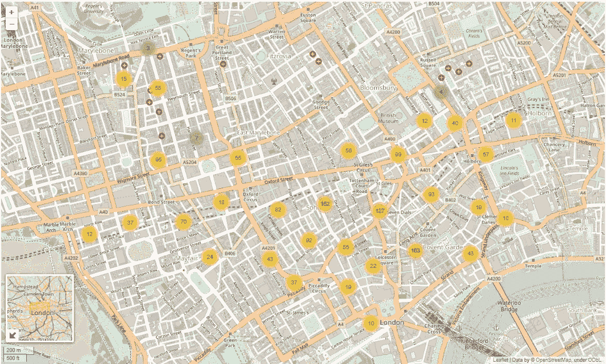

作者图片

…以及一个“更小”的集群:

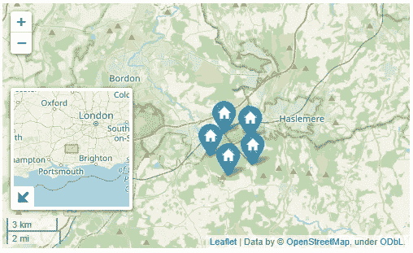

作者图片

很明显，伦敦中心的集群并不小(尽管它看起来确实很密集)。这可能是由于优化的构造，即因为我们对多个聚类进行了平均，一些异常值可能会被大量较小的值所拖累。然而，这并不是该集群的理想结果。

旁白:如果这是一些人口较多的集群的共同问题，那么为了将人口较多的集群分解成较小的集群，是否值得做进一步的集群练习？

我们在英国南部的较小星团中没有看到这个问题，因为所有五次观测都发生在同一条街上(*那些可怜的居民！*)。

在我们进入总结和最后的讨论之前，让我们来探索一些集群的用例。

# 用例

好吧布拉德，但那又怎样？我们如何使用由此产生的集群？请允许我解释。

我第一次接触 DBSCAN 和空间聚类的想法是在一篇谈论**实时导航**的文章中——想想谷歌地图为用户提供方向。总的想法是，在这种情况下，集群代表高流量的区域，会减慢旅程的进度；理想情况下，算法将识别这一点，并重新计算到*避开*群集的旅程步骤。

使用我上面描述的东西当然是一种**特征工程**的形式。根据上下文，我们可以用几种不同的方式使用它:

*   在汽车保险中，我们可以将车辆犯罪或事故信息的实例聚集在一起，以更好地了解位置如何影响索赔数量或索赔成本。同样，聚集的盗窃案例可以帮助理解家庭保险投资组合的表现。
*   识别和计算与设施群(如健身房、购物中心、学校、火车站)的接近程度可能是房价的一个非常重要的指标。

如果我们的数据中有缺失信息，那么聚类可以构成**插补**过程的一个组成部分。想象一下，我们试图理解一所房子的特征；假设同一时间建造的同一(小)街区(或街道)的房屋具有相似的特征是很合理的。因此，如果我们能够将房屋聚集在一起，我们就可以根据该群中房屋的特征进行合理的估算。

当然，我们也可以使用聚类作为一种降维形式。如果我们得到 mathsy，我们基本上已经在这里完成了一个 **R** → **R** 映射。如果我们能找到一种有效的距离度量，我们就能很容易地进行更高维度的映射。

# 总结和讨论

嗯，这是一个相当漫长的一个。让我们总结一下。

首先，我们看了一下 2019 年犯罪数据的分布。我们对入室盗窃数据的可视化显示，确实存在密集活动的小区域，并为基于密度的空间聚类方法提供了一些动机。

然后我们把一个算法的配方和一些解释放在一起。该功能允许我们:

*   计算两个(纬度、经度)坐标对之间的距离。
*   使用 DBSCAN 算法执行聚类分析。
*   计算 DBSCAN 生成的聚类的平均聚类顶点-质心距离。
*   使用贝叶斯优化来选择最小化平均顶点质心距离的 DBSCAN 输入。

我们可视化了一些结果，并讨论了潜在的用例。

在我们结束工作之前，让我们兜一圈，讨论一些事情。

## 总体结果

我认为公平地说，虽然我们的聚类方法有效，但它产生了一些稍微出乎意料的结果。现在，我们也许应该把这种方法看得不像是一个“如何做”的指南，而更像是一个“我已经做了什么”的例子。

当然，我说的是在物理距离上相当大的人口最多的集群，尽管优化结果表明了一些不同的东西。

我简要地提到了这可能是由于我们构建指标的方式造成的——使用平均值可能会允许较少的大值被许多较小的值掩盖。也许使用不同的度量标准(例如最大的平均顶点-质心距离)会产生不同的结果。也许我们需要聚类的第二阶段，集中于将较大的集群分解成较小的、更集中的集群。

## 数据和数据相关问题

首先要特别提到的是——如果你是免费、有趣、高质量数据集的粉丝，我强烈建议你去看看英国政府发布了什么。虽然我们已经查看了犯罪数据，但还有各种主题的信息，包括车祸、道路交通信息和新冠肺炎。

对于这样的数据，理解微观和宏观事件如何影响数据是很重要的。我特意选择使用 2019 年的数据，因为这是 COVID 前信息的最后一整年；我预计，在 2020 年 COVID 锁定期间，入室盗窃率将大幅下降，这使得每个人都呆在家里。

我们在前面提到了这一点，但认识到其他人口统计学(如人口和人口分布)如何影响数据也很重要。例如，在所有其他条件相同的情况下，我们预计人口密集地区的入室盗窃数量会高于人口较少的地区，这仅仅是因为人口规模(即在人口密集地区，会有更多的人入室盗窃)。

在这些情况下，明智的做法是根据人口规模进行调整，并着眼于入室盗窃率而不是入室盗窃数量。然而，这可能对分析有影响，因为可能很难获得在足够精细的水平上使计数正常化所需的数据。例如，我们不太可能找到我们得到的每个集群的人口数据。因此，我们很可能需要在对数据进行标准化之前，进行某种形式的汇总，以达到适当的水平。

*从英国网格的角度考虑，我们可能需要从坐标对到邮政编码或更低的超级输出区域(LSOA)，以便获得相应的人口数据。*

我们还需要谈谈坐标对的准确性。除非警察带着某种形式的 GPS 到每个犯罪现场，否则坐标对不太可能代表事件发生的*确切*位置。

输入到数据系统中的坐标对与实际犯罪现场的接近程度可能因犯罪类型和可能需要的任何警察干预而有所不同。例如，我们可以合理地想象，报案的抢劫案的地点将是沿着“Y 街和 X 大道的拐角处”，而报案的盗窃案的准确程度是非常具体的。

旁白:另一个例子——假设我们正在对交通事故进行聚类。繁忙的高速公路上的事故地点可以从最近的“安全地点”捕捉到。在某些情况下，这可能是实际场景中的路肩；在其他地方，它可能是最近的服务站或休息点。

这大概是更微妙的数据细微差别；虽然我们不太可能量化差异的程度，但这是值得认识和交流的。

## 优化和替代优化指标

一般来说，贝叶斯优化是我最喜欢的优化复杂函数的方法之一——包括机器学习模型。

我之前提到过，重新审视优化指标可以交付更好的——或者更符合预期的——结果。

虽然我认为作为第一步，平均顶点-质心距离还不错，但我们肯定可以改进它。

作为第一步，我们可以尝试使用最大值。正如我在上面所描述的，使用平均值可以让少量的大值被大量的小值所掩盖(因此平均值被值的分布所扭曲)。转而计算像平均最大顶点-质心距离这样的东西可能会产生更小的集群。

我们当然可以改变度量的概念。由于我们对簇的大小和密度感兴趣，切换到最小化簇的面积可能是明智的。如果我们要计算群集面积，群集密度是可达到的——双关语——如果，比方说，我们将密度定义为每单位面积的群集点数。

虽然未经测试，我认为这些想法可能很有趣，值得探索。

我还应该提到，选择`epsilon`和`min_points`有更正式的方法，其中一些在下面链接的文章中有所涉及。

## 地质公园

如果不提到⁴.的地质公园，那将是我的失职如果你不熟悉 geo pandas——我绝不是这方面的专家——它是一个 Python 包，旨在简化地理空间数据的处理。

快速浏览一下包文档，看起来我们配方中的关键功能——凸包、距离、面积——在 GeoPandas 中可用，并且可能会使工作流更容易。

我必须承认，我特意选择不使用 GeoPandas，因为我仍然熟悉坐标参考系统、投影坐标系统以及它们之间的关系(或者更重要的是，如何从一个到另一个)。

也许如果我将来回到这个话题上——或者做一些类似的事情——我可能会挑战自己，使用 GeoPandas。

## 表演

现在来简单谈谈性能。

我用的是 2017 年买的相当中级的笔记本电脑……它绝不是一个发电站，这是肯定的。

在看到如此庞大的数据量之后——全部犯罪数据集中大约有 600 万行，入室盗窃数据集中大约有 37 万行——我想老忠实可能会遇到一点困难，特别是在聚类计算方面。

但事实并非如此(令人惊讶！).即使进行了相当耗费资源的优化，我的硬件似乎也能很好地处理事情——可能更多的是算法实现的证明，而不是我自己做的任何事情。

## 最后…

如果你已经做到这一步，做得很好(感谢你的阅读！).

你现在可能已经注意到了，我不是为了改变而敲打神经网络；通过这篇文章，我打破了最近记录我从学习到建立神经网络的旅程的趋势。如果这真的引起了你的兴趣，不要担心，因为我正忙于下一部分的工作(在此期间，你必须满足于我的过期目录⁵)。

如果你喜欢阅读我的长篇大论，我写过关于机器学习其他主题的文章，比如⁷特征工程，使用贝叶斯优化⁶优化 LightGBM 模型，以及⁸.缺失值插补

一如既往，我希望你喜欢读这篇文章，就像我喜欢写它一样。下次见！

***参考文献***

1.  [首页| data.police.uk](https://data.police.uk/)
2.  [开放政府许可证(nationalarchives.gov.uk)](https://www.nationalarchives.gov.uk/doc/open-government-licence/version/3/)
3.  [2.3。集群-sci kit-learn 1 . 1 . 1 文档](https://scikit-learn.org/stable/modules/clustering.html#dbscan)
4.  [哈弗辛公式—维基百科](https://en.wikipedia.org/wiki/Haversine_formula)
5.  [https://stackoverflow.com/a/29546836/11637704](https://stackoverflow.com/a/29546836/11637704)
6.  [DBSCAN —维基百科](https://en.wikipedia.org/wiki/DBSCAN)
7.  [机器学习中的 DBSCAN 聚类算法— KDnuggets](https://www.kdnuggets.com/2020/04/dbscan-clustering-algorithm-machine-learning.html)
8.  [凸包—维基百科](https://en.wikipedia.org/wiki/Convex_hull)
9.  [SciPy . spatial . convex hull—SciPy v 1 . 9 . 0 手册](https://docs.scipy.org/doc/scipy/reference/generated/scipy.spatial.ConvexHull.html)
10.  [fmfn/BayesianOptimization:高斯过程全局优化的 Python 实现。(github.com)](https://github.com/fmfn/BayesianOptimization)
11.  [道路安全数据—data.gov.uk](https://www.data.gov.uk/dataset/cb7ae6f0-4be6-4935-9277-47e5ce24a11f/road-safety-data)
12.  [地图道路交通统计—道路交通统计(dft.gov.uk)](https://roadtraffic.dft.gov.uk/#6/55.254/-6.053/basemap-regions-countpoints)
13.  [英国概要|英国(data.gov.uk)的冠状病毒(新冠肺炎)](https://coronavirus.data.gov.uk/)
14.  [geo pandas 0 . 11 . 0—geo pandas 0 . 11 . 0+0 . g 1977 b 50 . dirty 文档](https://geopandas.org/en/stable/)
15.  让我们来学习:神经网络#1。我学习的一步一步的编年史… |作者布拉德利·斯蒂芬·肖| Medium
16.  [看数字:LightGBM 模型的贝叶斯优化| Bradley Stephen Shaw |走向数据科学](/seeing-numbers-bayesian-optimisation-of-a-lightgbm-model-3642228127b3)
17.  让我们做:特征工程。布拉德利·斯蒂芬·肖|走向数据科学
18.  [填补空白:插补三种方法| Bradley Stephen Shaw |走向数据科学](/filling-in-the-gaps-imputation-3-ways-6056c09b6417)