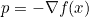
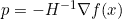
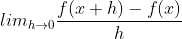
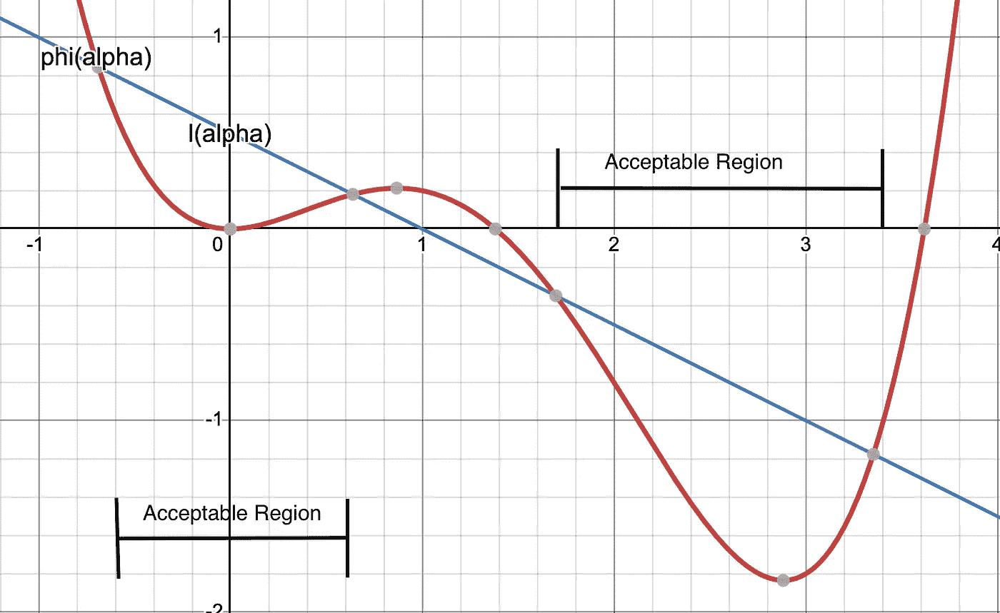
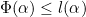
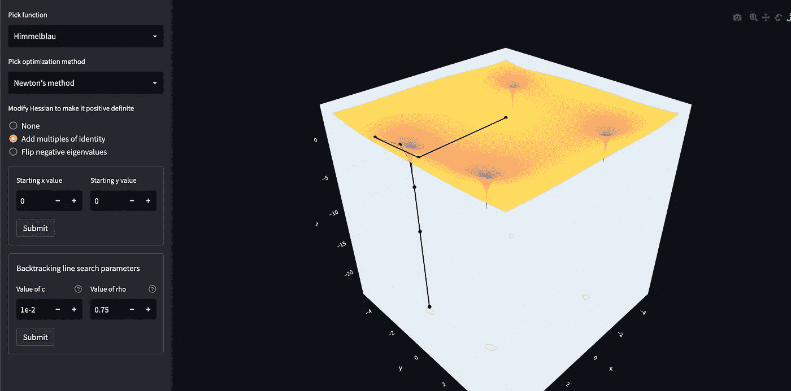

# 让我们来看看优化的本质

> 原文：<https://towardsdatascience.com/lets-get-to-the-bottom-of-optimization-509f06c8314c>

Himmelblau 函数的最速下降(自生成图像)

## 构建一个可视化工具来试验不同的优化算法

在这篇文章中，我将展示我创建的一个可视化工具，以了解优化算法如何在 2D 函数上工作。我将简要介绍算法中的一些数学知识，并深入研究 visualizer 工具的实现细节。

# 形象化

如果你想在不同的非凸函数 [**上运行不同的优化算法，点击这里**](https://sachag678-optimization-ui-sv2xnb.streamlitapp.com/) 。我用 streamlit 开发了这个，帮助我理解不同的算法如何在函数空间中移动。

# 背景

传统上有两种寻找极小值的方法——线搜索和信赖域优化方法。

这两种方法在选择走向最小值的迭代过程中的下一步的方向和大小的顺序上有所不同。线搜索方法确定方向，然后找到最佳步长，而信赖域方法确定步长，然后选择方向。

一个直观的阶跃方向是函数的负梯度。这是因为梯度指向最快速增加的方向。这是在许多 ML 优化框架中普遍存在的最速下降法的基础。它很有用，因为我们只需要计算一阶导数。

最陡下降方向

一个不太直观但很重要的步进方向是牛顿方向。这使用了海森矩阵 *H* 的逆矩阵，该矩阵描述了 *f* 的二阶偏导数。该矩阵提供了关于在 *x* 处 *f* 的局部曲率的信息。

牛顿方向

上述方程的推导以及收敛性的证明超出了本文的范围(*参见第 20-25 页的*和*Nocedal 和 Wright* 的数值优化)，但是我想提供一个手动波形解释，说明为什么 hessian 在寻找搜索方向时是有用的。

最陡下降方向是函数 *f* 的切线。因此，通过沿着该线直到从当前点有足够的减少，来确定最佳步长。

牛顿方向不是通过考虑直线来计算的，而是考虑更好地逼近函数 *f* 的二次曲线。因此，当查看搜索方向时，它试图找到二次型最小值的方向，这允许在给定的某些条件下更快地收敛。这通常消除了计算步长的需要，实际上步长被设置为 1。

我认为阅读建议的页面来理解证明是有用的，但是这需要一些线性代数的背景知识。我建议参考吉尔伯特·斯特朗的《线性代数和从数据中学习》。但是如果你对代码更感兴趣，我们开始吧！

# 实施细节

本节将深入解释最速下降法和牛顿步算法的代码，并有望为上述数学提供一些具体内容。

**最陡下降**

最速下降法使用近似导数函数计算步长方向 *p* 。

导数函数使用导数的定义以数字方式计算梯度，该定义为:

导数的定义

关键的一点是，我们使用一个小的 *h* ，而不是取 h 趋于 0 时的极限，来得到一个近似导数。使用这些近似函数允许对任何可微函数求导，而不必事先知道它。这就是为什么我们把 f 作为函数直接传递给它。

下一步是计算步长，我们使用回溯搜索来完成。

该方法使用第 2 行和第 3 行所示的不等式，称为 [Armijo 条件](https://en.wikipedia.org/wiki/Wolfe_conditions#cite_note-4)，以找到保证充分降低的最佳步长。

充分下降条件(自生成图像— Sacha Gunaratne 2022)

上图显示了 *l(* α *)* 和φ*(*α*)*是不等式的两块。LHS 为φ*(*α*)*，RHS 为 *l(* α *)* 即直线。直觉是，当满足以下条件时，φ会充分减小:

很容易看出，这个条件在可接受的范围内是成立的，因此在这些范围内的任何α值都满足这个条件。该算法以α的设定值开始，然后缓慢降低，直到满足条件。在该书中，建议将牛顿法的α设置为 1，并对其他方法使用其初始值进行实验。

一旦找到步长和方向，就可以用它们来更新当前点，使其更接近最小值。重复这一过程，直到满足退出条件，该条件检查对当前点的两次更新之间的欧几里德距离。

**牛顿法**

这两种方法有很多相似之处——主要区别在第 8、9 行，在那里计算 hessian 并用于计算步长方向 *p.*

hessian 是描述函数局部曲率的函数的二阶导数。它告诉我们，如果一个函数 *f (x)* 有一个鞍点，局部最小值或最大值在*x。*hessian 只有在它是正定的时候才有用，因为这提供了一个下降方向。**这加上需要计算 hessian 及其逆是它不是最常用方法的部分原因。**

近似 hessian 在上面使用与近似导数相同的方法计算，因为 hessian 正好是二阶导数。

使用 hessian 和梯度的逆来计算步长方向，然后遵循与最速下降法相同的步骤。

在可视化工具中，你会注意到牛顿法比最速下降法收敛得更快。然而，在某些情况下，牛顿法会失败，你会注意到它找不到任何最小值( [Himmelblau 函数](https://en.wikipedia.org/wiki/Himmelblau%27s_function)当 x，y = 0，0 时)。

牛顿的方法失败了

这是因为在这些情况下，hessian 不是正定的，因此没有下降方向。有几种方法可以解决这个问题，这里应用了其中的两种方法:

这些方法归结为修改 hessian 矩阵，使它是正定的。

方法 1 增加了单位矩阵的**倍，使得 hessian 矩阵的对角元素为某个因子*β的正。*方法 2 **将矩阵中的所有负值**翻转为正值。这两种方法都确保特征值大于零，这是正定性的一个条件。一旦应用了这些方法，牛顿法将在 Himmelblau 函数中找到最小值。**

牛顿法在对黑森(Sacha Gunaratne 2022)进行修改后仍然有效

# 外卖食品

在实现这些算法的过程中有许多错综复杂和细微差别，只有当你深陷其中时才会出现。我发现构建这个可视化工具的练习非常有助于加强我对许多机器学习和优化框架中使用的各种算法的理解。

还有几件事我想实现——BFGS 算法，这是一种准牛顿法，不需要完全计算 hessian。考虑完全 Wolfe 条件的线搜索算法。我还希望允许用户输入他们自己的函数，这样他们就可以以一种更少约束的方式使用这个工具。

我希望这篇文章对优化方法及其背后的直觉提供了一些见解，并且希望你有机会使用[可视化工具](https://sachag678-optimization-ui-sv2xnb.streamlitapp.com/)。

大部分这些我都是通过阅读 Nocedal 和 Wright 的*数值优化学来的，我发现这本书写得很好，以直观的方式处理复杂的主题。*

如果你对改进可视化工具有任何建议，或者对本文有任何疑问，请随时通过 [twitter](https://twitter.com/sacha0) 联系我。