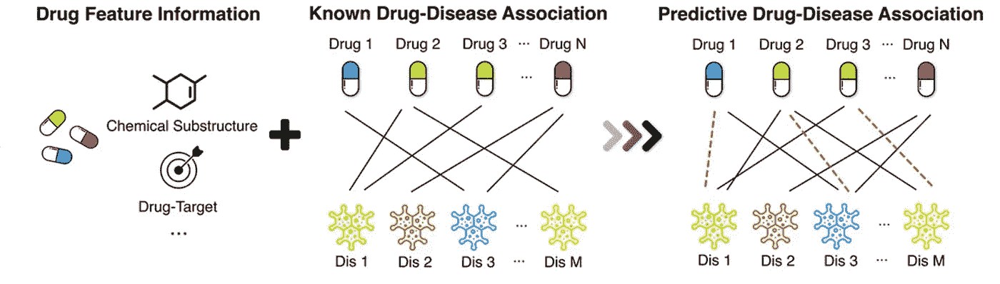
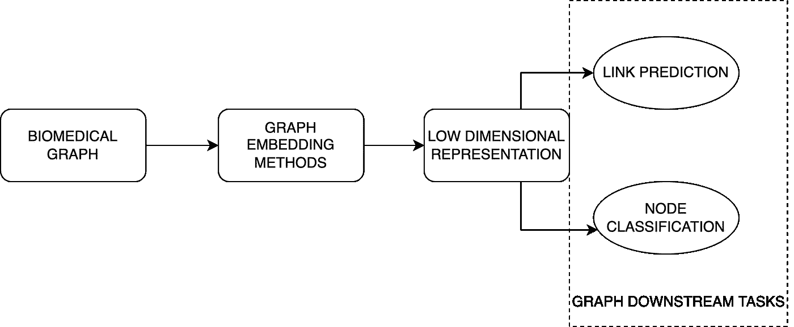

# 我们来谈谈生物医学网络中的图机器学习

> 原文：<https://towardsdatascience.com/lets-talk-about-graph-machine-learning-in-biomedical-networks-8a84139e970b>

## 机器学习技术在生物医学图上的应用概述


在 [Unsplash](https://unsplash.com/s/photos/dna?utm_source=unsplash&utm_medium=referral&utm_content=creditCopyText) 上由 [Sangharsh Lohakare](https://unsplash.com/@sangharsh_l?utm_source=unsplash&utm_medium=referral&utm_content=creditCopyText) 拍摄的照片

G raph 机器学习已经很流行了，尤其是在社交网络领域，但在生物医学领域，或者更具体地说，在生物信息学领域，它相对不太为人所知。我已经在这个有趣的领域获得了实践经验(几年前)，在这篇文章中，我将解释机器学习算法在其中的应用。

首先，生物信息学是生物学、计算机科学、数学等学科的交叉领域，其目的是分析和解释生物数据。换句话说，从生物数据中提取有价值的信息。

表示人和计算机都能理解的真实生活数据并不容易。一种很好的数据类型是图形。图形可以模拟和存储复杂的现实生活中的互动。这也适用于某些类型的生物数据，如用图表表示的蛋白质-蛋白质网络。

以下是可以用图表形式研究的生物学方面/主题的列表:

1.  **药-病关联(DDA)** —不同药物对疾病的作用不同。例如，药物 A 可以治疗疾病 X，而可能有另一种药物 B 导致疾病 y。因此，药物既可以是治疗性的，也可以是有害的，使用 DDA 我们的目标是找出哪种药物与哪种行为有关。



裁军事务部插图([来源](https://link.springer.com/article/10.1186/s12859-018-2220-4))

2.**药物-药物相互作用(DDI)** —当两种或更多种药物相互反应时发生。当有人同时服用多种药物时，我们必须了解这些药物联合使用时的反应性质。这是为了避免任何可能发生的副作用或意外反应。

3.**蛋白质-蛋白质相互作用(PPI)**—蛋白质有助于细胞内发生的大多数生物过程，如基因表达、细胞生长等。这些蛋白质很少单独发挥作用，它们倾向于与其他蛋白质分子形成关联(物理接触)，以在细胞内进行不同的分子过程。研究这种蛋白质相互作用可以提高我们在分子水平上对人体的理解。

4.**蛋白质功能预测** —正如我之前提到的，蛋白质在活细胞内执行多种功能。蛋白质功能预测基本上是给蛋白质指定一个生物学角色，即识别哪种类型的生化反应与特定的蛋白质相关。

5.**生物医学概念的语义分类** —在数字时代，我们可以在网上获得大量的生物医学信息。面对如此海量的数据，有必要对其进行索引和管理。公司存在与隐私相关的担忧，即在分发数据时可能不会披露与某个主题相关的全部信息。利用医学知识库(像 [UMLS](https://en.wikipedia.org/wiki/Unified_Medical_Language_System) )，我们可以借助各种机器学习技术(NLP 等)进行语义分类。

所有上述主题都可以转换成一个图，并在其上执行下游任务，如链路预测和节点分类。

DDA、DDI 和 PPIs 在制定为关联预测任务时，目标是识别给定实体(药物、疾病或蛋白质)之间的任何潜在相互作用或关联。存在将问题公式化为不同的图相关任务的可能性，例如图聚类和节点分类，这通常取决于用例。

蛋白质功能预测和语义分类可以建模为节点分类任务。

> 查看我上一篇关于图及其下游任务的文章，了解更多关于这些主题的内容。下面是[链接](/a-quick-note-on-graphs-and-the-formulation-of-their-downstream-tasks-d8a8c808c93f)。

# 图形机器学习

我们不能直接在图上使用标准的机器学习算法，因为图中存储的信息是高维的和非欧几里得的。因此，我们将图形实体映射到一个低维向量空间(也称为嵌入空间)，然后对其应用我们最喜欢的机器学习算法。



图表 ML 管道示例(图片由作者提供)

从上图可以看出，graph ML 管道的输入是生物医学图。我们应用图形嵌入方法将图形映射到低维空间，并计算嵌入，这些嵌入稍后将用于解决定义的用例(可以是链路预测、节点分类或不同类型的任务，如图形聚类)。

存在不同类型的图嵌入方法，我们可以将其大致分为 3 种类型:

1.  基于矩阵分解的方法—这里，我们将图(表示为邻接矩阵)分解为低维矩阵，同时保留原始矩阵的拓扑信息。这种方法有许多变体，如图分解、GraRep、HOPE 等。
2.  基于随机行走的方法——该方法从自然语言处理中流行的技术 word2vec 模型中获得了很多灵感。Word2vec 使用句子来学习单词的嵌入。类似的方法用于生成图中的节点嵌入。通常，选择一个节点(随机地或使用一个条件)，我们随机地移动(或执行“行走”)到另一个节点，移动的步数是确定的。通过这种方式，我们获得了定义长度(与步数相同)的节点序列，然后用于学习节点嵌入。一些例子包括 DeepWalk 和 node2vec。
3.  基于神经网络的方法—近年来，基于神经网络的方法得到了更多的研究，因为它们比其他方法显示出更有前景的结果。许多类型的神经网络如多层感知器(MLP)、自动编码器、生成对抗网络(GAN)和图卷积网络(GCN)被用于计算图嵌入。LINE 和 SDNE 就是这种方法的一些例子。

所有上述方法都用于计算静态图嵌入。静态的意思是它们是在固定的时间周期(不改变或发展)为图形计算的。

# 动态生物医学图

考虑这一点(以 PPIs 为例)——在 T=0 时，人类细胞内的一组蛋白质参与了生化反应“A”，而在 T=1 时，一组不同的蛋白质参与了不同的反应，比如“B”。和久而久之，不同的蛋白质组合参与不同数量的反应。这是细胞中实际发生的情况。因此，有必要研究具有时间信息的生物医学图像。

我们之前考虑的是复杂现实生活过程中最简单的情况。通过消除时间因素，我们能够将问题简化许多倍。

如果我们把时间加入到图表中，它会变成一个动态的图表。这些比静态图更复杂(但也更有趣)。您可以将动态图视为从 time=0 到 time=T 按此顺序收集的静态图列表(一系列图的快照)。我们必须使用动态图嵌入方法将动态图映射到低维空间，然后执行任务。这里使用的 ML 管道与上一个非常相似。

一种简单的动态图嵌入方法是独立考虑每个时间点 T 并计算静态嵌入。例如，如果我们有一个具有 12 个时间点的动态图，我们可以为所有 12 个时间点嵌入一个动态图(为每个时间点独立计算)。这不是一个好主意，因为我们没有捕捉到时间对图形演变的影响。

存在先进的技术，其中当计算当前时间点的嵌入时，考虑先前时间点的影响。因此，我们捕捉了图随时间的演变，并获得了高质量的嵌入。

> 我写了一篇详细解释动态图的文章，可以在这个[链接](/what-are-dynamic-graphs-and-why-they-are-interesting-180b9fab9229)上找到。

# 最后的想法

图机器学习尤其是图神经网络的研究成果近年来非常多，我们看到这些方法取得了令人印象深刻的结果。在生物医学图上制定不同的任务使我们能够解决传统实验室实验的一些瓶颈。在实验室实验中，不可能确定每一种可能的蛋白质相互作用或 DDI、DDA，因为我们在使用物理工具进行测量时存在技术限制。

这就是 ML 的用武之地。我们使用具有已经识别的相互作用(通过实验室实验)的数据来训练模型，并尝试预测潜在的相互作用或关联。这是令人兴奋的，因为它为更快的模拟和快速的药物发现过程打开了大门。

新冠肺炎·疫情向我们展示了生物医学研究的价值，而图形 ML 是辅助这项研究的工具。如果你是一个刚刚进入 graph ML 的人，检查生物医学领域的一些有趣和具有挑战性的问题可能会很有趣。

感谢阅读，干杯！

```
**Want to Connect?**Reach me at [LinkedIn](https://www.linkedin.com/in/rohithteja/), [Twitter](https://twitter.com/rohithtejam), [GitHub](https://github.com/rohithteja) or just [Buy Me A Coffee](https://www.buymeacoffee.com/rohithteja)!
```