# 白细胞检验——用神经网络进行血细胞分类

> 原文：<https://towardsdatascience.com/leukopy-blood-cell-classification-with-neural-networks-2eb2e65441eb>

## 深度学习如何彻底改变血液涂片上的白细胞识别

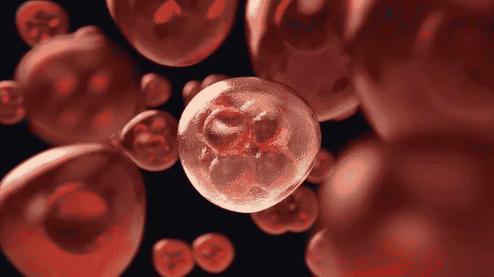

科林·伯伦斯来自[的图片](https://pixabay.com/?utm_source=link-attribution&utm_medium=referral&utm_campaign=image&utm_content=3876669)

这篇文章是与**马修·萨拉特和拉勒·拉万博德**合作撰写的。

# 一、背景

在本文中，我们将对生物学做一点了解，并探索 [**深度学习**](https://datascientest.com/deep-learning-definition) **如何帮助对血细胞**进行分类。许多疾病的**诊断**，如传染病、白血病或其他血液疾病，依赖于白细胞亚型的分类，也称为**白细胞**。存在几种识别白细胞的生物技术，但是血液涂片的显微镜检查对于确诊通常是至关重要的。细胞有不同的特征:它们的颗粒、细胞核中的叶数、细胞核的形状、细胞质的颜色。

*显示涂片上白细胞特征的图像。作者图片。*

然而，这种技术**容易出错，耗时**且**需要专家**，这就是计算机辅助血液涂片分析得以发展的原因。经典的白细胞分类流水线包括从细胞周围分割出细胞的**、特征提取和选择，接着是浅层的 [**机器学习**](https://datascientest.com/en/machine-learning-what-is-it-and-why-does-it-change-the-world) 分类器。这种工作流程很难从一个实验室推广到另一个实验室，因为染色、协议和采集系统的种类繁多。**

**这就是深度学习可以派上用场的地方。**

**传统上，循环血细胞分为 5 个主要亚型:血小板、红细胞、粒细胞(嗜碱性粒细胞、嗜中性粒细胞、嗜酸性粒细胞)、单核细胞和淋巴细胞。**

**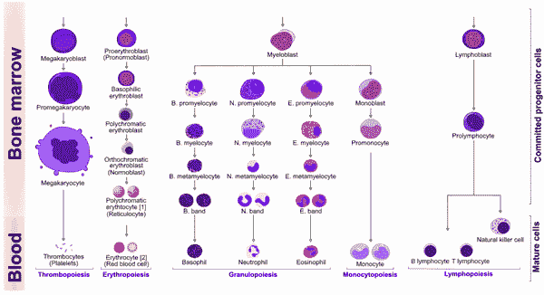**

**外周白细胞和前体细胞。图片改编自维基百科上的 [A.Rad。](https://fr.wikipedia.org/wiki/Fichier:Hematopoiesis_(human)_diagram.png)**

**我们在这里测试了 3 种类型的深度学习架构，以对 11 类健康血细胞进行分类:5 种主要亚型及其一些祖细胞(中性粒细胞祖细胞)。**

*   **中性粒细胞(分段)— SNE**
*   **嗜酸性粒细胞— EO**
*   **嗜碱性细胞— BA**
*   **淋巴细胞——LY**
*   **单核细胞—钼**
*   **血小板——血小板**
*   **成红细胞— ERB**
*   **未成熟(后髓细胞、髓细胞、早幼粒细胞)和带状中性粒细胞— MMY、— MY、— PMY 和— BNE**

# **二— EDA**

## **a.数据分布**

**我们使用了可公开获得的 **3 个数据集**:来自[巴塞罗纳](https://www.ncbi.nlm.nih.gov/pmc/articles/PMC7182702/)医院诊所的核心实验室，来自[慕尼黑](https://wiki.cancerimagingarchive.net/pages/viewpage.action?pageId=61080958)大学医院，以及来自拉什特拉齐医院、古尔哈克实验室、Shahr-e-Qods 实验室和位于德黑兰的 Takht-e Tavous 实验室( [Raabin-WBC](https://raabindata.com/free-data/) 数据集)。结合这些数据集，在 3 个不同的系统上获得了来自 MGG 和姬姆萨染色的血液涂片的大约 50，0 00 个单细胞图像。除了少数被诊断患有白血病的患者外，大多数患者被认为是健康的。**

**让我们做一些 EDA 来检查我们的数据。正如你在下面的柱状图中看到的，**分段的中性粒细胞**(中性粒细胞成熟的最高级阶段，简称 SNE)在 Munich 数据集中**被过度代表**。**淋巴细胞**群体在 Raabin 和 Munich 数据集中占**多数**。在巴塞罗纳数据集中，这些类更加平衡**。血小板只存在于后面的数据集中。****

## ****b.UMAP 与降维****

****我们选择使用 UMAP 进行降维，因为它保留了数据中的局部和大部分全局结构。观察投射到 3 个主要部分的数据，我们可以看到**可变性**主要由数据的**来源**来解释，这可能是由于染色和光度变化的差异(参见我们的[流线](https://studio.datascientest.com/project/leukopy/))。驱动聚集的另一个主要变量似乎是细胞的尺寸。****

****我们的数据是多样化的，可以构成一个有趣的数据集来建立分类模型。****

# ****III —模型化****

****为了对图像进行分类，我们测试了 **3 种不同的架构**，在我们的 [Streamlit 应用](https://studio.datascientest.com/project/leukopy/) : **VGG16 耦合到 SVM、VGG19 和 ViT** 中有更详细的描述。我们的基线模型是一个逻辑回归模型，其显示的准确度约为**65–70%**。****

## ****a.迁移学习和微调****

****我们对在 ImageNet 上训练的模型的所有神经网络使用了迁移学习，并且稍后对每个模型详细训练了或多或少的层。****

## ****b.预处理和规范化****

****我们的数据集分为训练集、验证集和测试集(80%、10%、10%)。**使用数据扩充**以减少过度拟合并提高概括能力。训练数据流通过以下管道:我们调整图片的大小和形状，然后应用一些增强(旋转、轴对称、剪切)。****

****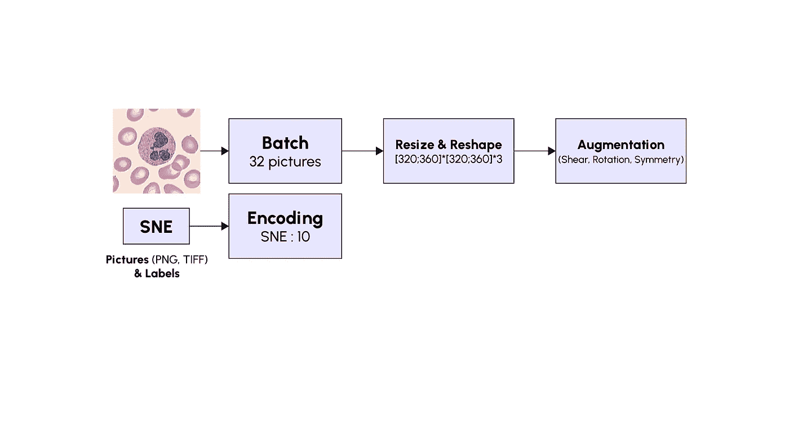****

*****图片由作者提供。*****

****此外，我们在模型训练期间实施了以下内容:****

*   ******提前停止**预定义耐心回调:防止过拟合。****
*   ****降低**高原学习率**:加速训练和收敛。****

****最后，我们在训练中使用了**类权重**:当错误发生在低群体类(如 PMY 或 BA)上时，我们惩罚更多:`(1/class_count) * (total_count/2)`。****

## ****c.模特们****

*****1)在分段细胞上具有 SVM 的 VGG16】*****

****使用 VGG16 结合 SVM，我们的目的是研究**背景过滤**对模型精度的影响。我们使用 VGG16 网络进行特征提取，连接到支持向量机进行分类。下图所示的背景过滤或细胞分割过程是基于这样的假设，即细胞位于图像的中心附近，并且比图像的其他部分更清晰。****

****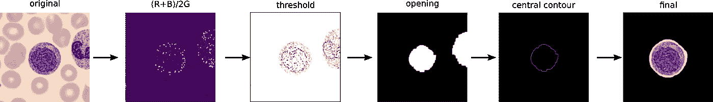****

****背景过滤过程中涉及的步骤。*图片作者。*****

****网络 VGG16 顶部的 3 个完全连接的层没有作为基础模型包括在内，基础模型由以下层完成:GlobalAveragePooling2D、密集层(1024)、速率为 0.2 的丢弃层、密集层(512)、随后是另一个丢弃层以及最后是密集分类层。训练分 3 个步骤完成:训练所有层，然后训练除最后 4 层之外的所有层，最后定义中间层模型，包括基础模型、GlobalAveragePooling2D 层和密集层(1024)。为训练数据计算中间模型的输出，并用于训练 SVM。****

******F1 得分在过滤前后没有差异**。换句话说，该模型查找单元的信息，而不管其背景。****

*****2) VGG19*****

****对于 VGG19，最后一个卷积块进行了微调，分类块层被替换为我们自己的自定义块。应用了特定的 VGG19 预处理，即 RGB 通道的反转和数据的归一化。****

****性能看起来不错，我们在测试数据上获得了大约 94%的**全局准确率，但重要的是要记住测试数据和训练数据来自相同的来源(来自 Barcelona、Munich 和 Raabin 数据集的混合)。******

*****3)视觉变压器*****

****视觉变形金刚(ViT)已经改变了计算机视觉的领域。我们选择从 ViT-Keras 库中测试一个基本的 ViT-b16。在 ViT 中，图像被切割成小片(对于 ViT-b16 为 16 x16 像素),这些小片被展平并通过位置嵌入来连接。然后，这些投影被送入经过转换的编码器层，之后是一个多层感知器(MLP ),有点像解码器。最终 MLP 负责人负责最终分类。****

****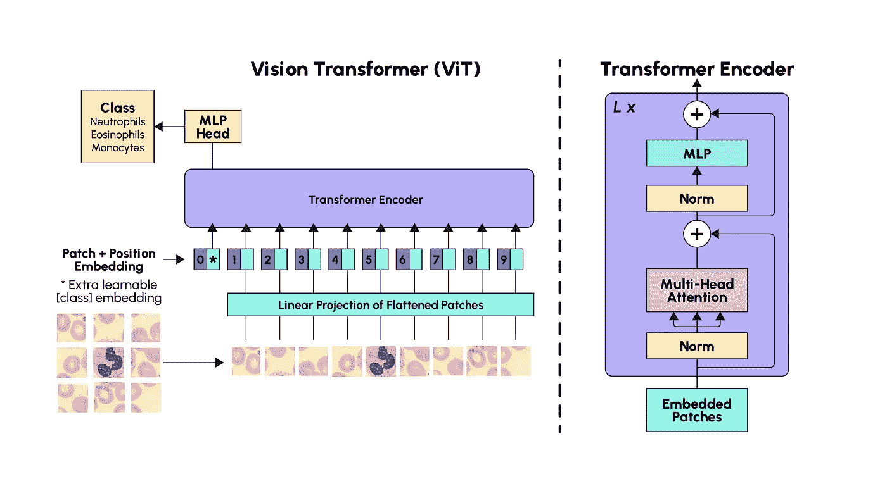****

*****图片作者。*****

****对于这些模型，我们添加了一个**标签平滑**作为额外的正则化，试图考虑标签误差。我们还选择测试**修正的 Adam 优化器**，它对学习速率不太敏感，更具普遍性。****

****该模型的表现稍逊于 VGG19，在验证和测试数据上的**全局准确率为 92%**。****

# ****四——结果分析****

****以下是 3 个模型的 F1 表现——每个类别的分数和整体准确度:****

## ****a.细胞成熟和标记****

****大多数图片被正确分类(F1 > 0.95)，除了不同种类的中性粒细胞。**混淆矩阵**揭示了 3 个模型**混淆了不同种类的中性粒细胞**(成熟的 SNE 和不成熟的 PMY、MMY、MY、BNE)，如下图所示(用 VGG19 获得的结果)，其中**错误分类图片的最大百分比用红色圈出**。****

****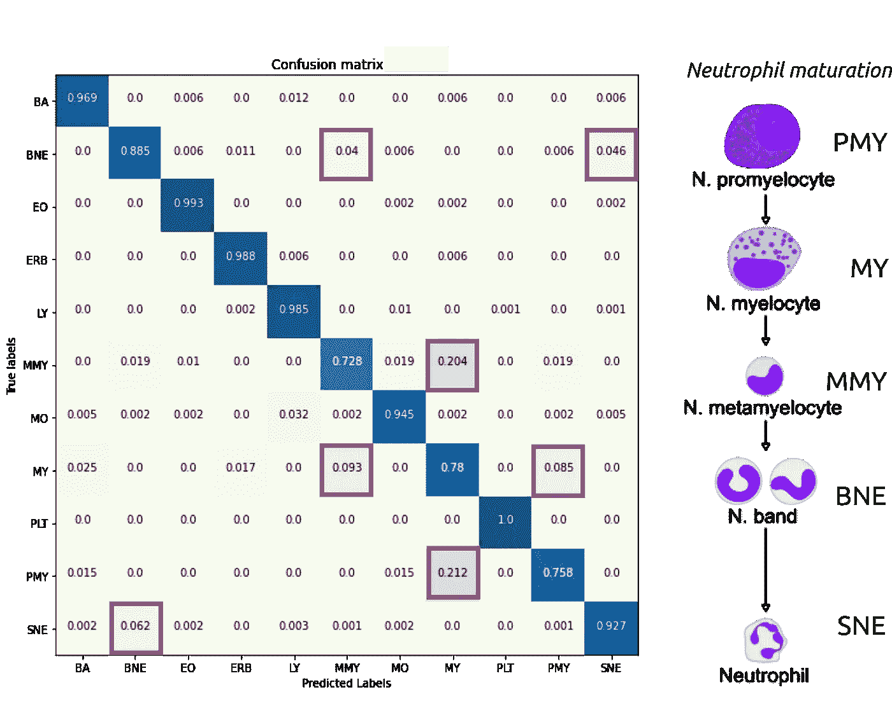****

****作者图片。****

****但是为什么呢？？？为了理解，我们需要援引生物学:PMY、米、MMY、BNE 和 SNE 是中性粒细胞成熟过程中的步骤。这个过程**是一个连续的过程**(例如，细胞核从马铃薯形状慢慢演变成多叶形)，因此我们发现**一些细胞具有两个连续生长步骤的特征**是可信的。模型必须选择一个类，然后我们可以得到分类错误。****

****出于同样的原因，一些贴标机难以达成一致，可能会出现**可能的贴标错误**(下图) :****

****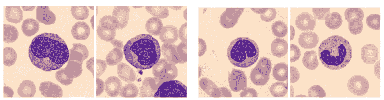****

****两张左图有着共同的显著特征(例如，相同的细胞核“豆”形、细胞质颗粒)，但分别被标记为 PMY 和 MMY。第三张照片可能是“年轻的”BNE，或者是“老的”MMY，因为它的核呈 C 形。作者图片。****

****给这样的图片贴标签是一项**复杂的工作**，需要训练有素的专家，他们不会出错。****

## ****b.可解释性****

****现在，我们可以更进一步(✪ワ✪)ノʸᵉᵃʰᵎ和调查我们的模型在图片中看什么，然后再将其分配给一个类。对于 VGG 的模型，我们使用 Grad-CAM。对于 ViT，我们使用了注意力地图。这两种技术在图片上突出显示了给定预测的**最重要的特征**。****

****我们在我们的 [Streamlit 应用](https://studio.datascientest.com/project/leukopy/)中加载了一个来自 VGG19 中 Raabin 数据集的嗜酸性粒细胞(EO ),下面是它的截图:****

****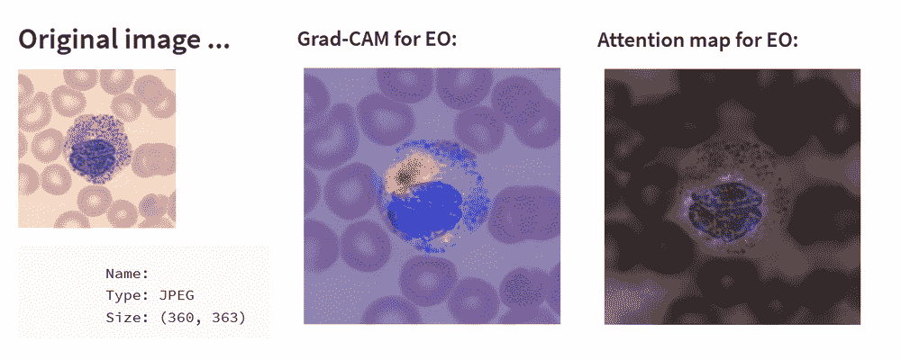****

****作者图片。****

****EO 的主要特征是一个分节的**细胞核**和细胞质中的**粉红色颗粒**。Grad-CAM 透露，当他试图确定图片是否为 EO 时，模型会搜索粉红色颗粒。ViT 注意力图似乎稍微更侧重于细胞核，但也考虑到了颗粒。对于其他类，Grad-CAM 和注意力图更难解释，但 Grad-CAM 和注意力图显示**模型聚焦于图片中心的细胞**，而不是红细胞背景。****

# ****限制:验证集之外发生的事情。****

****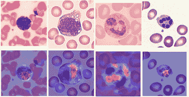****

****VGG19 的 Grad-cam 的四张图片来自 Google Images。作者图片。****

****我们已经测试了不是来自 Raabin、Barcelona 和 Munich 数据集的图片。例如，VGG19 能够准确分类一些形状和色彩非常相似的图片，如上图中的四张图片，这些图片是在 **Google Images** 上获得的。****

****然而，在一些与训练数据集非常不同的数据集上，如来自中国江西泰康科技有限公司的 [WBC_segmentation](https://github.com/zxaoyou/segmentation_WBC) ，该模型不幸失败(全局精度约为 8 %)。****

****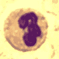****

****来自中国江西泰康科技有限公司 [WBC 图像数据集](https://github.com/zxaoyou/segmentation_WBC)的图像示例。****

****这些图像是由不同的显微镜光学系统拍摄的，血液涂片经过实验室特定的染色处理，最重要的是，与训练数据集相比，图片分辨率较低。因此，可以取得进一步的进展。****

# ****六、结论****

****我们的模型在分类来自 3 个不同数据集的 11 类血细胞图片方面做得很好，但**许多改进是可能的**。此外，我们已经看到**良好的全球指标可以隐藏重要的问题**，例如，模型的能力**概括**完全不同的数据集。以下是一些潜在的改进:****

## ****a.增加多样性:增加和变化。****

*   ****更多**不同来源或类型的图片**:包括来自其他机构的图像(不同的采集系统，不同的染色，亮度等……)将**允许更平衡的数据集**(更少的 SNE，和 LY，**更不成熟的**)和**更好的模型概括新数据的能力。******
*   ******扩充我们的数据**:我们可以尝试模仿现实生活中的组织学染色，改变实际染色或者使用 **GANs** (生成对抗网络)或者 **VAE** (可变自动编码器)来制作新的图片。****
*   ****然后，我们可以考虑放弃迁移学习方法，并考虑**在血细胞图片上对我们的模型**进行完整的训练。****

## ****b.改进标签:使用生物学定义。****

****我们**需要**用**自信标注**的图片来训练模特。一种选择是独立的病理学家专家之间的交叉验证过程，就像 Raabin 项目中所做的那样，但这是耗时和资源密集型的，因此自我监督或半监督学习可能是更合理的替代方案。****

****另一种选择是使用**转录因子和颗粒蛋白作为标记**。这可以通过与抗体共染色或在染色前使用流式细胞仪标记来完成。****

## ****c.物体检测:完全使用。****

****我们只处理了整个过程的一个步骤**:我们使用分段的图片，只有一个单元格在中间。**这项工作的一个可能扩展可能涉及在大规模血液涂片图片上的对象** (=血细胞)**(例如，使用 YoloV5)检测，以便生成我们在该应用程序中使用的那种图片。********

****我们希望你喜欢阅读我们的项目，如果你想取得联系，不要犹豫！****

****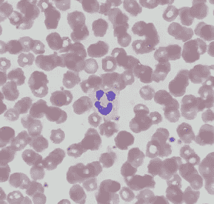****

****图片由维基共享资源的马克格顿提供。****