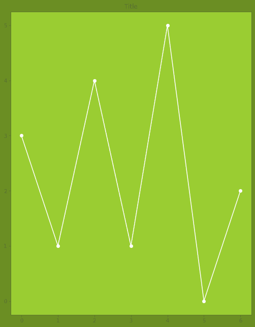
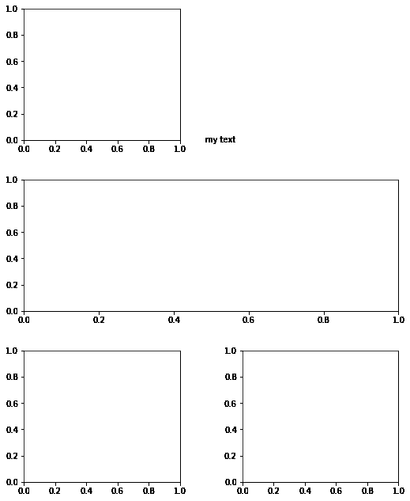
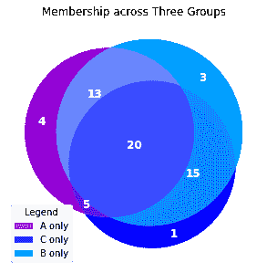
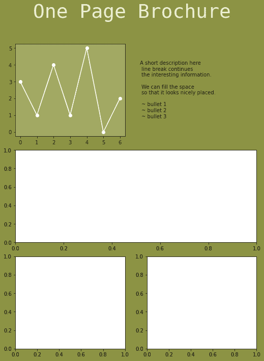
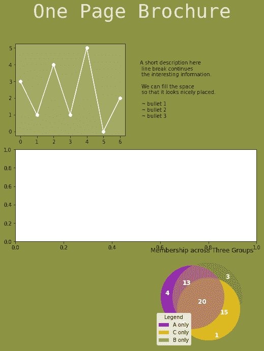
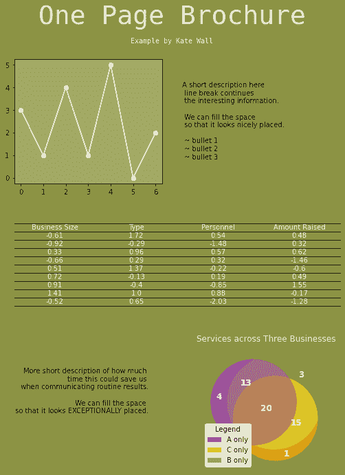
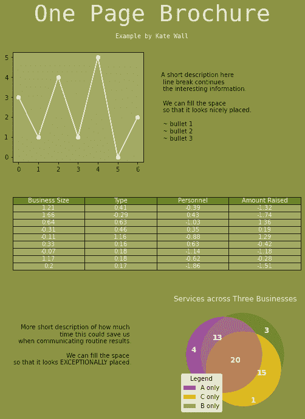
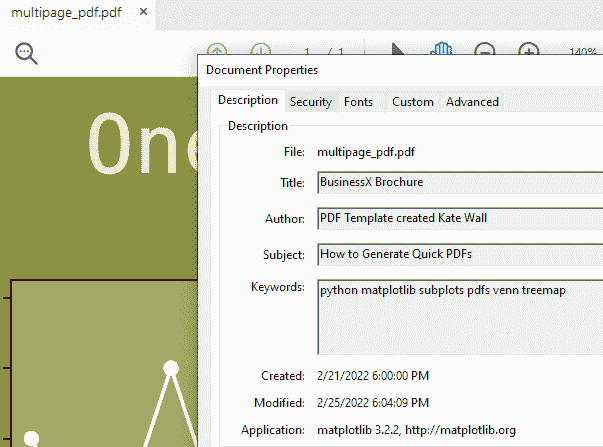

# 使用 Python 升级:快速生成具有惊人视觉效果的 pdf

> 原文：<https://towardsdatascience.com/level-up-with-python-quickly-produce-pdfs-with-stunning-visuals-d6750c9c7be2>

## 数据可视化

## 使用 Matplotlib 制作业务分发手册/电子邮件/传单

最常被忽视的任务之一是有效的信息交流。您可以创建任何人都见过的最漂亮的仪表板，但是，如果您的管理团队拒绝使用仪表板(因为它位于一个很长的 URL，他们神秘地在浏览器书签中丢失)，这没有什么区别。有时，快速和肮脏的 pdf 是共享信息的最快方式。

本教程的目的是向您展示如何使用 matplotlib 生成一个具有清晰布局、一些视觉效果和少量文本的图形，以便快速导出为 PDF。

Disclaimer: I make no claims that the PDF is the most **effective** means of communication. Beyond that, this is not even the **easiest** way to generate a PDF… (reader slowly moves mouse towards “close tab”). HOWEVER, if you have frequently changing data extractable with python 一 this is the tutorial for you. Set this PDF generation script on a timer and automatic listserv, and voila! Quick PDFs & quick distribution.

多个 python 包与 pdf 接口，但大多数都侧重于解析/读取应用程序。matplotlib 包本身就是最简单的 PDF 生成工具之一！您可以生成任何 matplotlib 图形，并将其导出为 PDF！但并非所有的视觉效果都是一样的。

在接下来的教程中，我将展示如何通过将独立图形转换为子图、自定义颜色/字体/大小/位置、添加文本以及在 matplotlib 中导出为 PDF 来调整和自定义单页 PDF 手册/电子邮件/传单的 matplotlib 图。完整的 GitHub 笔记本可以在[这里](https://github.com/katewall/medium_tutorials/blob/main/220225_Medium_PDF.ipynb)找到。

## 第一步:选择显示图形。

这里有一个相当丑陋的情节，我决定与我的团队分享。别担心，我会修好的。在其中，我调用 matplotlib 轴类“ax”来定制绘图区域的颜色( **ax.set_facecolor** )、绘图边框(**脊线**)、刻度线和轴值( **tick_params** )以及轴标签( **yaxis.label** )。我还通过设置 plt.figure()中的 **facecolor** 参数来设置图形的背景颜色。此外，我们通过在绘图调用中指定**‘w-o’**来改变绘图线的颜色。这遵循“颜色标记类型”的格式，所以我们指定“白色圆圈标记”

> 下图强调了人生中的一个重要教训:你能做某事并不意味着你也应该做。

我改变这些颜色的目的是展示当从单个 matplotlib 图形切换到子图形排列时，这些自定义参数应该如何调整。

注意，生成图形的代码被包装在一个用户定义的函数 **img1()** 中。将图包装在函数中有助于(a)组织代码和(b)减少代码块之间的意外交互。

作者选择的可疑数字

警告:如果你不喜欢绿色，我很抱歉。

## 第二步:选择一个子图布局。

下面的代码在 matplotlib 中生成一个布局系统。基本上，它使您能够使用底层网格 **(GridSpec)** 作为参考来定制块的长度和宽度。还有更简单的副抽法(如`fig, axes = plt.subplots(3, 2)`)；然而，使用 GridSpec 可以让您在 matplotlib 中最大程度地自由定制。

下面，我铺开

*   左边第一行中的一个数字(网格[0，0])，
*   右边第一行中的一个图形(网格[0，1])关闭*
*   一个跨越第二行两列的图形(网格[1，:2])，以及
*   我的第三行网格上的两个图形(左网格[2，0]，右网格[2，1])。

注*:有两种方法可以将此绘图区留空。(1)您可以指定位置，然后关闭轴。这些选项显示在注释中。或者(2)您可以不指定这个网格区域。该区域将是空白的，并且整体绘图将生成如下。

在网格的顶部，我们可以使用 **fig.text()** 在任何我们想要的地方添加文本框。注意文本框的坐标。坐标(0，0)映射到整个图形的左下区域。(1，0)映射到图的右下区域。在这里，我使用分数将我的初始文本框放置在我没有填充的空白处。后来，我会玩的位置，以实现一个漂亮的外观。

作者选择的布局

## 第三步:选择附加图形。

为了多样化，我还想加入一个构建在 matplotlib 之上的包，比如 matplotlib_venn。在这篇[文章](/professional-venn-diagrams-in-python-638abfff39cc)中，我将详细介绍如何在 python 中安排数据、绘制数据以及根据您的需要定制一个三向维恩图。以下是一个独立的、格式化的维恩图的可能版本:

我们得到了一个非常漂亮的下图。团队绝对应该看看这张！让我们把它写进我们的报告。

作者提供的维恩图示例

## 步骤 4:添加线条图作为支线剧情

现在我的布局已经在第 2 步中建立了，我可以开始用我的自定义图形填充布局了。第一个数字将放在左上角。

现在，我们对上面指定的基本布局做几件事。我们在第 1–4 行指定了一个配色方案，添加了一个标题，重新排列了我们的线图，并调整了右上角的文本框。

***添加一个标题***

通过在第 33 行调用 **fig.suptitle()** 来添加标题。可以定制字体系列、字体大小和颜色。

***重新排列线条图***

第 11–23 行指定了线图。请注意步骤 1 中的独立版本与此版本之间的差异。我们的轴调用现在用 **add_subplot()** 调用位于网格[0，0]位置的 **fig_ax1 对象**。我本可以在图上保留一个标题，但是它看起来组织得很奇怪。它必须消失。

***调整文本框***

我们在第 28 行的文本框位置添加了一些缓冲空间(+0.025，+0.03)。在我们的文本字符串中，我们使用“\n”分隔符添加换行符。

下面的代码生成了土绿色的小册子。

作者集成了第一幅图像的布局

## 步骤 5:添加维恩图作为支线剧情

添加了第一个表后，我们现在可以添加维恩图了。对代码的唯一修改是在右下方添加了 Venn，并删除了左下方的 plot，以便为附加文本腾出空间。

***添加维恩图***

第 33–51 行添加了维恩图。这很有意思。我们像以前一样在**fig _ ax4 = fig . add _ subplot(location)**中设置网格位置。不过，现在我们把 venn object **v** 设为 fig_ax4 ( **ax=fig_ax4** )。图例成为轴的属性，但子集标签属于文氏对象 v。

这不是很好吗？我们将蓝色和紫色的独立维恩颜色改为一些土绿色和橙色，以防止视觉上冒犯我们的团队。

作者使用维恩的布局

## **第六步:添加表格作为支线剧情**

接下来，我们在页面中间区域添加一个表格，并在左下角填写文本。

***添加表***

第 35–48 行通过绘制一个 **axis.table()** 对象向手册中添加一个熊猫数据框架。我们通过使用**cell colors**参数将单元格颜色设置为一个 9x4 的“medgreen”单元格数组来自定义填充颜色的白色默认值。必须用长度为 4 的列表设置列标题单元格，这是 dataframe 的宽度(ncol = 4 列)，因此我们将 colColours 设置为 **['olivedrab']*ncol** 。

***添加更多文字***

我们像前面一样在左下方添加文本。除此之外，我们将文本的对齐方式改为“右对齐”。这比你想象的更能改变位置，所以在设置位置缓冲区(-0.055，+0.23)之前改变对齐方式。

表格字体定制是通过改变 matplotlib(名为 mpl)中的默认 **rcParams** 实现的。关于 rcParams 定制的更多信息可以在[这篇文章](/professional-treemaps-in-python-how-to-customize-matplotlib-squarify-efd5dc4c8755)中找到。本质上，使用 matplotlib，表类的功能是有限的。对于习惯了 Excel 格式选项的用户来说，matplotlib 参数将不能令人满意。然而，基本功能和令人愉悦的视觉效果仍然可以在不使用额外软件包的情况下实现。正如我以前的老板常说的，有时候，做得比完美更好。

作者集成了表格的布局

最后，我们将上面的输出打包到 matplotlib 的 **PdfPages()** 函数中。

## 第七步:包装导出为 PDF 格式。

该图与上图几乎相同。作为一个挑剔的人，我通过调整第 40 行的 edges 参数改变了表格边界。另外，我在第 68 行添加了一个副标题。

***导出为 PDF***

只有第 1、70 和 71 行，我将该图导出为 PDF。

***添加 PDF 元数据***

使用第 74-80 行，我对 PDF 元数据做了一些快速更改，以便队友/客户/管理层知道这个 PDF 来自哪里。它添加了作者、标题、关键词和日期。

最后，我们结束了一个可爱的视觉如下。

作者完成的手册定稿

打开我们的 PDF 文件后，我们甚至可以检查元数据的更改是否真正实现了。很明显，他们是！

按作者分类的 PDF 元数据

总之，我们学会了在 matplotlib 中将独立图形转换为子图形，自定义颜色/字体/大小/位置，添加文本，并导出为 PDF。多么强大的可视化和交流工具啊！[完整笔记本在此。](https://github.com/katewall/medium_tutorials/blob/main/220225_Medium_PDF.ipynb)

是时候发送一些结果了！

如果你对如何整合自己的数字有疑问或意见，请在下面评论。

我希望这篇教程能帮助你快速有效地交流你的发现。

喜欢这篇文章？更像下面的。

<https://www.linkedin.com/in/kate-wall/>  </professional-treemaps-in-python-how-to-customize-matplotlib-squarify-efd5dc4c8755>  </professional-venn-diagrams-in-python-638abfff39cc> 