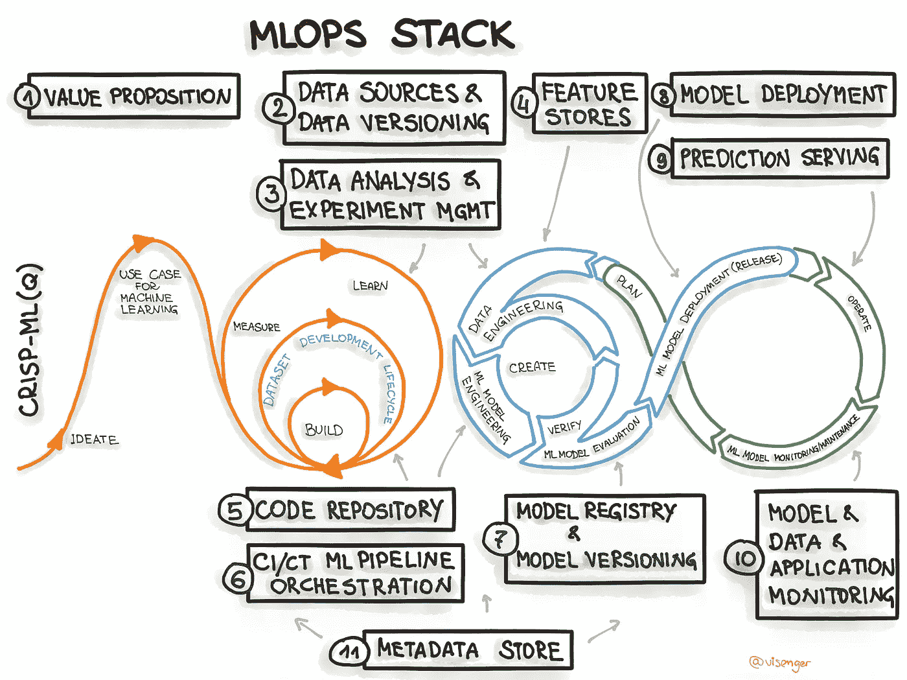

# 使用 Kedro 升级您的 MLOps 旅程

> 原文：<https://towardsdatascience.com/level-up-your-mlops-journey-with-kedro-5f000e5d0aa0>

## 向您的机器学习项目添加结构，以加速和维持创新

近年来，MLOps 的势头越来越大，这是一种在机器学习中提炼操作思维的努力。对我来说，MLOps 就是在机器学习中创造可持续性。我们希望在这个快节奏的创新领域建立一种结构化和可复制的文化。以这个熟悉的场景作为动力:

这里有一个需要你完成的用例。你能在星期五之前做它吗？

*我们无畏的英雄成功地拼凑了一些东西。每个人都很开心。直到几天后，我们把它投入生产。几周后，新的数据出现了。几个月后，一个新人接手了这个项目。*

*你的代码能承受住压力吗？*

开发机器学习项目就像修理服务器电缆一样。我们创建了十几个实验、工程管道、出站集成和监控代码。我们尽最大努力使我们的工作具有可重复性、稳健性，并随时可以交付。再加上一些团队协作，你就有了一大团意大利面。无论我们如何努力，总会有所收获，尤其是在时间紧迫的情况下。我们做一些小的捷径来积累技术债务，随着时间的推移会变得更加不愉快。用我们的比喻来说，杂乱的电线是火灾隐患，我们希望它们马上得到修复。数据必须流动！

由 [cottonbro](https://www.pexels.com/@cottonbro/) 在[Pexels.com](https://www.pexels.com/photo/man-people-woman-industry-6804585/)拍摄

之前有人发现了这一点，对吗？幸运的是，是的，我们处在一个 MLOp 正在起飞的时代。有许多工具和框架可以支持 MLOps。过去，我使用内部自我维护框架和个人工程标准集的组合。如果您没有时间创建自己的框架，那么有一个像 Kedro 这样健壮的脚手架来为您打理基础是很好的。

# 点燃凯卓

Kedro 是一个开源 Python 项目，旨在帮助 ML 从业者创建模块化、可维护、可复制的管道。作为一个快速发展的项目，它与其他有用的工具进行了许多集成，例如 MLFlow、Airflow 和 Docker。可以把 Kedro 看作是将你的项目连接到一个公共结构中的粘合剂，这是迈向可持续机器学习的非常重要的一步。 [Kedro 有惊人的文档，一定要去看看](https://kedro.readthedocs.io/en/stable/)。

启动 kedro 项目很容易。我在下面的代码块中写了一些东西。

1.  虚拟环境几乎总是必要的。创建一个，并安装 kedro。
2.  创建一个 kedro 项目。在这个例子中，我使用了一个正式的启动项目。[还有其他的，这里链接](https://kedro.readthedocs.io/en/stable/07_extend_kedro/05_create_kedro_starters.html)。*Kedro 的一个强大功能是，你可以通过 cookiecutter 创建自己的模板。* *根据您所在组织的标准来检查这一点。*
3.  创建一个新的 git 环境 MLOps 的另一个必须做的事情！
4.  安装依赖项。
5.  运行管道。

您将看到为您生成了一些目录。这个结构是任何 kedro 项目的基础。您将会看到一些很棒的操作性的东西已经嵌入其中，比如测试、日志、配置管理，甚至 Jupyter 笔记本的目录。

# 对 Kedro 项目的剖析

## 项目概述

在这篇文章的其余部分，我将使用来自 Kaggle 的数据集，这是健康保险中交叉销售用例的[。如果你想要我的全部代码，你也可以看看这个](https://www.kaggle.com/anmolkumar/health-insurance-cross-sell-prediction) [Github 链接。](https://github.com/krsnewwave/xsell)

稍后您将会看到，数据工程和机器学习工作非常标准，但是 Kedro 真正闪光的地方是它如何使您的管道可维护，坦率地说，非常漂亮。点击此处查看我的管道:

*图片由作者提供*

Kedro 管道由数据源和节点组成。从顶部开始，您可以看到数据源。您可以选择将它放在 Python 代码中，但在我的情况下，我希望它放在配置文件中，如果位置、凭证等发生变化，这是非常关键的。如果您有十几个数据集，您会希望它们的定义远离代码，以便更易于管理。此外，您可以在一个配置文件中管理中间表和输出，因此格式都是从代码中抽象出来的。

*顺便说一句，文档中有一整节专门用于凭证管理和引用云资源。为了简单起见，我将把事情放在本地。*

## 创建您的 Kedro 节点

节点是行动的地方。Kedro 允许很大的灵活性。在这里，我使用 scikit-learn 和 XGBoost 进行实际的建模，但是您也可以使用 PySpark、PyTorch、TensorFlow、HuggingFace 等等。在下面的代码中，我有我的数据工程代码，和我的建模代码(data_science)。您希望项目的阶段是什么样子取决于您。为了简单起见，我只有这两个。

首先，我的数据工程代码只有一个节点，所有的预处理都在这里完成。对于更复杂的数据集，可以包括特定数据源的预处理、数据验证和合并。

其次，`data_science` 代码包含模型的训练。`data_engineering` 部分的输出将作为这些节点的输入被插入。如何将输入和输出连接在一起在管道部分中定义。

这里有一个 Optuna 的例子，它是一个超参数优化平台。正如您将在下面看到的，您还可以使用 kedro-mlflow 将 kedro 和 mlflow 连接在一起。

*如果你是那种专注于笔记本电脑的人，那么你可能会对其数量感到震惊。py 文件。不要烦恼！Kedro 可以* [*把你的 Jupyter 笔记本变成节点。*](https://kedro.readthedocs.io/en/latest/11_tools_integration/02_ipython.html)

## 定义您的 Kedro 管道

为了把这些联系在一起，Kedro 使用了管道。使用管道，您可以设置节点的输入和输出。它还设置节点执行顺序。它看起来非常类似于火花和气流中的有向无环图(DAG)。您可以做的一件很棒的事情是创建钩子来扩展 Kedro 的功能，比如在节点执行后添加数据验证，以及通过 MLFlow 记录模型工件。

1.  第 32 行有来自 split 节点的所有输入，但是有一个特殊的参数字典。Kedro 自动从您的`parameters.yml`中放入您的参数，默认在您的`conf/base`目录中。
2.  线 34 接收来自节点的多个输出。第一个是分类器，第二个是要保存在 MLFlow 中的模型度量。这是在`catalog.yaml`中指定的。*请注意，Kedro 也有自己的实验跟踪功能，但是我想向您展示它确实可以很好地与其他工具配合使用。*
3.  第 45 行从`parameters.yaml`接收一组参数您可以重用同一个管道，为不同的运行输入几组参数！

最后，Kedro 项目的顶层是 pipelines 注册表，它包含可用的管道。我在这里定义了多个管道和它们的别名。默认情况下，__default__ 将调用所有管道。您可以通过`kedro run --pipeline=<name>`调用特定的管道。

之后，是部署的时候了。从这里开始，你可以做几件事，[如这里链接的](https://kedro.readthedocs.io/en/stable/03_tutorial/08_package_a_project.html):

*   要打包并创建车轮文件，请执行`kedro package`。然后，这些文件可以转到您自己的 Nexus 或自托管的 PyPI。如果将包脚本作为构建例程的一部分放在 CI 服务器中就更好了。没有什么比让另一个团队简单地安装你自己的项目更好的了！
*   您还可以使用`kedro build-docs`生成您的项目文档。它将使用 Sphinx 创建 HTML 文档，因此它包含了您的文档字符串。是时候给你的文档游戏增添趣味了！
*   将管道导出为 docker 容器。这可以成为您的组织的更大的编排框架的一部分。这也有助于社区已经有了针对 [Kubeflow](https://github.com/getindata/kedro-kubeflow) 和 [Kubernetes](https://github.com/getindata/kedro-airflow-k8s) 的插件。
*   [集成 Airflow](https://github.com/kedro-org/kedro-plugins/tree/main/kedro-airflow) 并将您的项目转换为 Airflow DAG。
*   [以及其他十几个具体部署](https://kedro.readthedocs.io/en/stable/10_deployment/01_deployment_guide.html)！

# MLOps、Kedro 等等

[来自](https://ml-ops.org/img/mlops-stack.jpg) [MLOps 堆栈画布](https://ml-ops.org/content/mlops-stack-canvas)([https://ml-ops.org/](https://ml-ops.org/))的图像

回想一下，我们已经开始做 MLOps，这只是一种可持续的方式来控制机器学习的巨大复杂性。我们已经实现了一个通用的结构，一种重现运行、跟踪实验和部署到不同环境的方法。然而，这仅仅是开始。其他最佳实践正在融合并快速发展。所以一定要练好基本面，永远记得可持续创新。

*原载于 2022 年 3 月 11 日*[*http://itstherealdyl.com*](https://itstherealdyl.com/2022/03/11/level-up-your-mlops-journey-with-kedro/)*。*