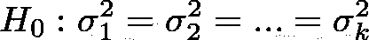
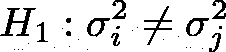
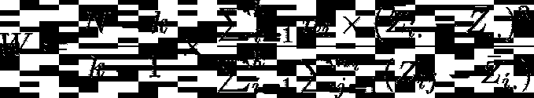
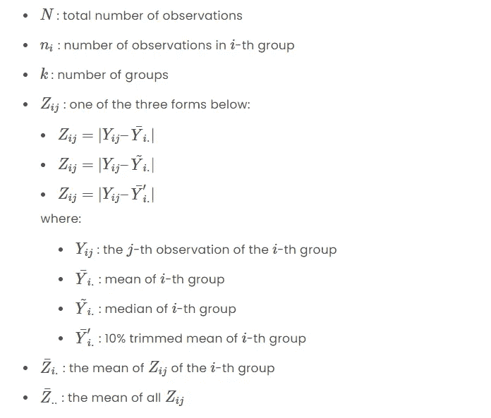
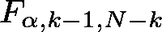
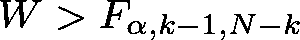

# 解释 Levene 的方差相等测试(使用 Python 示例)

> 原文：<https://towardsdatascience.com/levenes-test-for-equality-of-variances-explained-with-python-examples-f0445a19805f>

## 在本教程中，我们将探讨 Levene 的方差相等测试及其在 Python 中的应用


照片由 [Unsplash](https://unsplash.com/s/photos/variance?utm_source=unsplash&utm_medium=referral&utm_content=creditCopyText) 上的 [Pritesh Sudra](https://unsplash.com/@pritesh557?utm_source=unsplash&utm_medium=referral&utm_content=creditCopyText) 拍摄

**目录**

*   介绍
*   抽样资料
*   Levene 的测试解释了
*   勒文检验假设
*   Levenet 检验统计量
*   Levene 在 Python 中的测试示例
*   结论

# 介绍

许多统计测试和程序都假设数据的正态性和方差相等。

这些条件通常决定了研究人员是否可以使用参数或非参数测试，以某种方式阐明他们的假设，等等。

Levene 检验是推断统计学中最流行的检验之一，它处理从非正态分布中提取的数据。

## Levene 的测试是什么？

Levene 检验用于检验两个或更多组(样本)计算的变量的方差是否相等。

## 如何解读 Levene 的测试？

如果 Levene 检验的 p 值小于显著性水平(例如 0.05)，则至少两组的方差不相等。

为了继续学习本教程，我们需要以下 Python 库:pandas 和 scipy。

如果您没有安装它，请打开“命令提示符”(在 Windows 上)并使用以下代码安装它:

```
pip install pandas
pip install scipy
```

# 抽样资料

要执行本教程示例部分和 Python 实现部分中提到的计算，您将需要一些数据。

在本教程的所有示例中，来自。使用下面的 csv 文件。

该数据包含三组对新疗法反应的 80 次观察:“对照组”、“治疗 1 组”和“治疗 2 组”。

数据服从非正态分布。

在此下载示例数据:[https://pyshark . com/WP-content/uploads/2022/03/data _ levenes _ test . CSV](https://pyshark.com/wp-content/uploads/2022/03/data_levenes_test.csv)

# Levene 的测试解释了

如前所述，方差相等的假设在统计分析中是很重要的，并且在测量实验和数据分析的结果时经常会影响研究者的工作程序。

## 勒文检验假设

Levene 检验的无效假设是所有组的方差相等。

Levene 检验的另一个假设是，至少有一对组的方差不相等。

给定大小为 *N* 的变量 *Y* ，其被分成 *k* 个组:



作者图片



作者图片

其中:

*   *k* :总组数(≥2)
*   *I*:k 组之一
*   *j*:k 组之一
*   ( *i，j* ):来自 *k* 组的一对组
*   我≦*j*:两个组不是一个组

## 勒文检验统计量

Levene 的检验统计量由下式给出:



作者图片

其中:



作者图片

原始论文仅提出使用平均值计算 *Z_{ij}* 值，Lavene 检验的进一步扩展提出在计算 *Z_{ij}* 值时使用中间值和修整平均值。

计算出 Levene 的测试统计值( *W* )后，应将其与下式给出的上临界值进行比较:



作者图片

因此，我们拒绝等方差的零假设，当:



作者图片

# Levene 在 Python 中的测试示例

为了在实践中看到 Levene 的测试及其在 Python 中的应用，我们将使用前面一节提到的[样本数据文件](https://pyshark.com/levenes-test-for-equality-of-variances-explained-with-python-examples/#sample-data)。

首先，导入所需的依赖项:

然后阅读。csv 文件提供到 Pandas 数据框架中，并打印前几行:

您应该得到:

```
 group  before_treatment  after_treatment
0  control              27.9             33.8
1  control              16.8              9.3
2  control              27.2             23.4
3  control              12.5             19.9
4  control              14.4             16.0
```

您可以计算一些组摘要统计信息，以便更好地理解数据:

您应该得到:

```
 group  avg_bef_tr  var_bef_tr  avg_aft_tr  var_aft_tr
0     control      20.145   18.878436      19.825   28.825513
1  treatment1      19.210   17.007263      15.475    4.649342
2  treatment2      21.510   19.673579      20.315   15.141458
```

这里你可以清楚地看到 3 组之间的“ **var_bef_tr** ”(治疗前方差)差异并没有那么大:18.88，17.01，19.67。

然而，3 个组之间的“ **var_aft_tr** ”(治疗后方差)差异相当大:28.83、4.65、15.14。

三组治疗后的方差差异足够大，我们几乎可以肯定它是显著不同的，但是为了从统计上检查它，我们将在 Python 中执行 Levene 的测试！

我们需要创建变量来存储与特定组相关的观察结果:

最后用 Python 执行 Levene 的测试:

您应该得到:

```
Lavene's test statistic: 4.240957881271611
P-value: 0.017895111992486838
```

由于 p 值小于 0.05，我们拒绝零假设，并得出结论，至少有一对组的方差不相等。

**注:**

默认情况下， **levene()** 函数使用中值方法计算绝对残差。然而，正如在[解释部分](https://pyshark.com/levenes-test-for-equality-of-variances-explained-with-python-examples/#levenes-test-statistic)中提到的，你也可以使用均值和修整均值。[官方文档](https://docs.scipy.org/doc/scipy/reference/generated/scipy.stats.levene.html)显示了如何更改测试中使用的功能。

# 结论

在本文中，我们讨论了如何使用 scipy 库执行 Levene 方差相等测试及其在 Python 中的应用。

如果你有任何问题或对一些编辑有建议，请随时在下面留下评论，并查看更多我的[统计](https://pyshark.com/category/python-programming/)文章。

*原载于 2022 年 3 月 17 日 https://pyshark.com**的* [*。*](https://pyshark.com/levenes-test-for-equality-of-variances-explained-with-python-examples/)