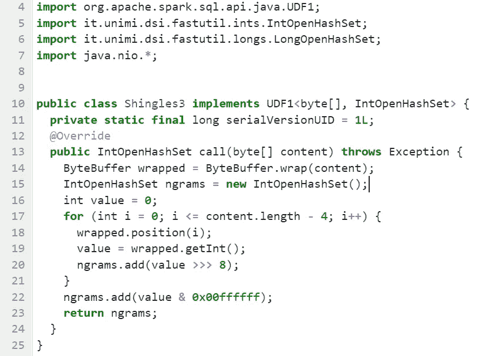
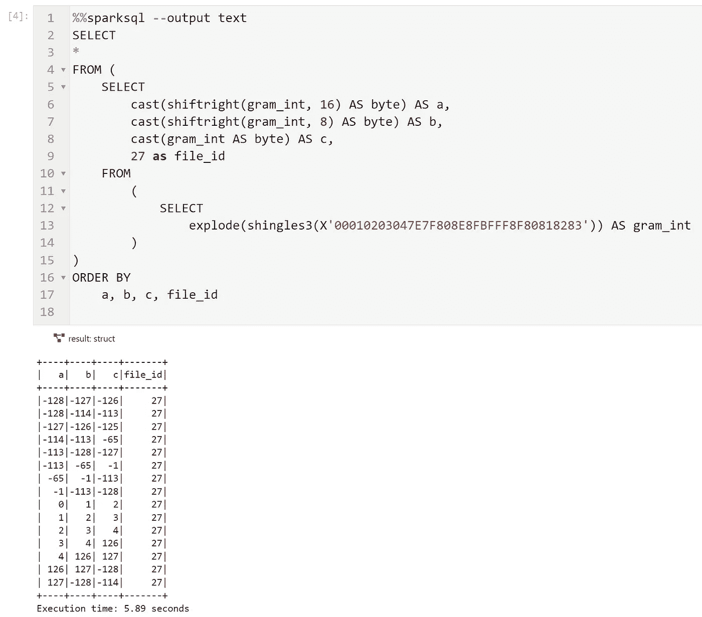
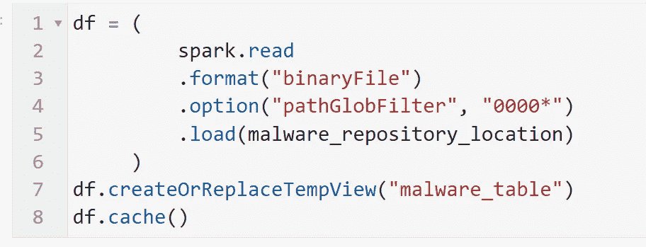
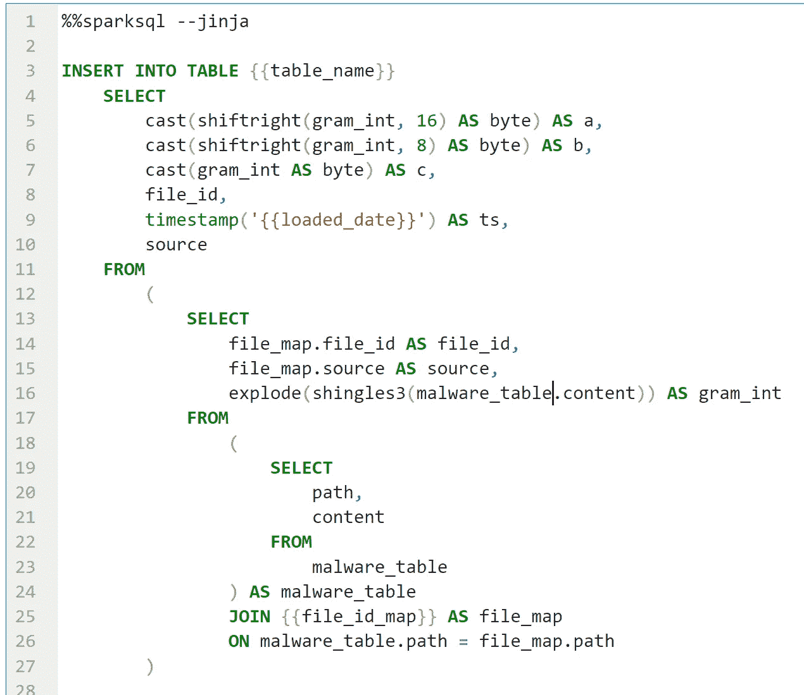
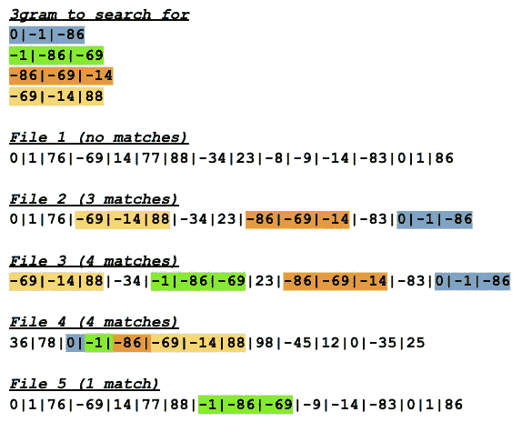
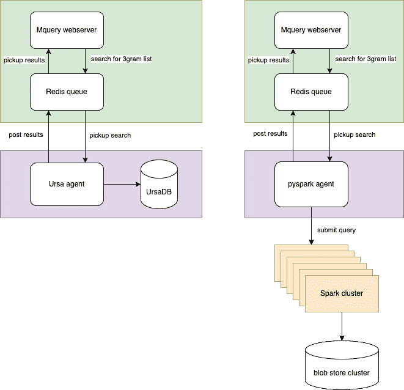
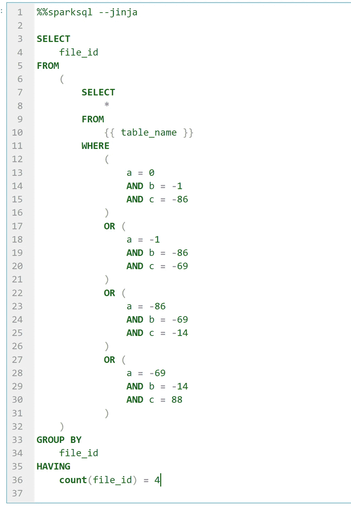
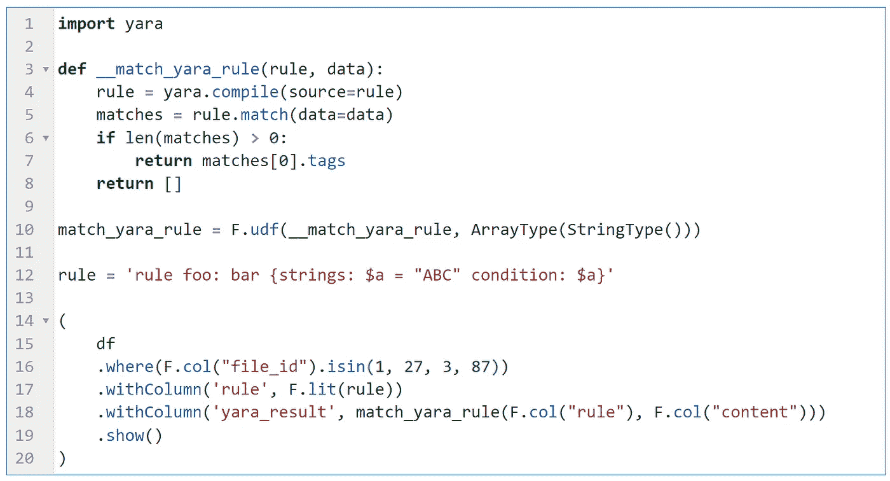
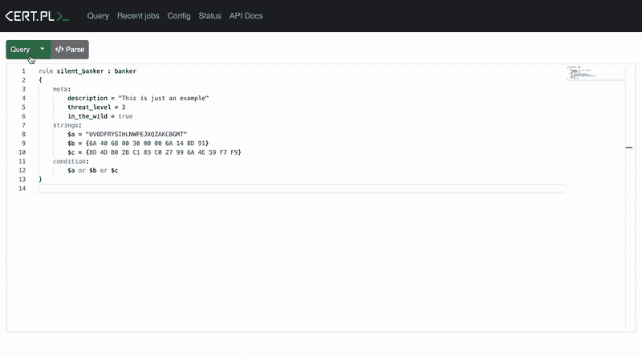

# 利用云技术大规模搜索恶意软件

> 原文：<https://towardsdatascience.com/leverage-cloud-technologies-for-malware-hunting-at-scale-27718244ee6c>

## 如何使用 Apache Spark 和 Iceberg 表索引数百 TB 的恶意软件


照片由 Hes Mundt 在 Unsplash 上拍摄

在本文中，我们将展示如何使用 Spark 和 [Iceberg](https://iceberg.apache.org/) 表实现类似于 [UrsaDB](https://github.com/CERT-Polska/ursadb) 的恶意软件索引，并将该索引集成到 [Mquery](https://github.com/CERT-Polska/mquery) 中，这是一个分析师友好的 web GUI，用于提交 [YARA](https://virustotal.github.io/yara/) 规则并显示结果。

这一概念验证是在[极客周](https://geek.collaboration.cyber.gc.ca/en/week/2022/home.html)期间开发的，极客周是由[加拿大网络安全中心](https://cyber.gc.ca/en)组织的年度研讨会，汇集了网络安全领域的主要参与者，为行业面临的重要问题提供解决方案。

# 简而言之 YARA

[YARA](https://virustotal.github.io/yara/) 是一款旨在帮助恶意软件研究人员识别和分类恶意软件样本的工具。使用 YARA，您可以基于文本或二进制模式创建恶意软件家族的描述。每个描述，也称为规则，由一组字符串和一个决定其逻辑的布尔表达式组成。例如:

```
rule silent_banker : banker
{
    meta:
        description = "This is just an example"
        threat_level = 3
        in_the_wild = true
    strings:
        $a = {6A 40 68 00 30 00 00 6A 14 8D 91}
        $b = {8D 4D B0 2B C1 83 C0 27 99 6A 4E 59 F7 F9}
        $c = "UVODFRYSIHLNWPEJXQZAKCBGMT"
    condition:
        $a or $b or $c
}
```

如果在文件中找到这些序列中的任何一个(a 或 b 或 c ),该规则将评估为真。YARA 是一个用 C 语言编写的可执行文件，通常在命令行上调用，方法是向它传递一个规则和一个二进制文件文件夹以进行处理。

虽然 YARA 执行速度很快，但以暴力方式处理数百万个恶意软件样本会占用大量 CPU 和 I/O 资源，因此执行时间会非常长。

# 波兰证书

为了加快对 YARA 规则的评估，波兰计算机应急小组(CERT-Polska)建立了一个名为 UrsaDB 的定制数据库和一个名为 Mquery 的分析师友好的 web GUI。

UrsaDB 充当[布隆过滤器](https://en.wikipedia.org/wiki/Bloom_filter)来测试给定的字节序列是否可能出现在二进制文件中。假阳性匹配是可能的，但假阴性是不可能的。换句话说，查询返回“可能在文件中”或“肯定不在文件中”。

Mquery 首先使用 UrsaDB 来查找可能包含所需字节序列的候选文件，然后使用 YARA CLI 来确认该文件是否匹配。因此，YARA CLI 是在整个恶意软件语料库的一个小子集上进行评估的，这大大加快了整体执行时间。

让我们更深入地了解一下 UrsaDB。

# 乌尔萨博

UrsaDB 中的主要指数是`3gram`指数。

对于语料库中的每个文件，UrsaDB 提取所有可能的唯一三字节组合。`3gram`索引本质上是一个大图，其中键是一个`3gram`，值是一个`list of files containing the 3gram`。

例如，如果我们索引一个包含 ASCII 字符串`TEST MALWARE` (ASCII: `54 45 53 54 20 4D 41 4C 57 41 52 45`)的文本文件，那么数据库生成以下三元组(`_`表示空格字符):

```
+---+-----------+---------+
| # | Substring | Trigram |
+---+-----------+---------+
| 0 | TES       | 544553  |
| 1 | EST       | 455354  |
| 2 | ST_       | 535420  |
| 3 | T_M       | 54204D  |
| 4 | _MA       | 204D61  |
| 5 | MAL       | 4D616C  |
| 6 | ALW       | 414C57  |
| 7 | LWA       | 4C5741  |
| 8 | WAR       | 574152  |
| 9 | ARE       | 415245  |
+---+-----------+---------+
```

UrsaDB 是一个自定义的 C 程序，运行在单台机器上，能够处理大量的恶意软件文件。UrsaDB CLI 提供了索引、压缩和搜索`3gram`索引的方法，这些索引作为定制格式的二进制文件存储在磁盘上。

UrsaDB 仅限于单个机器，尽管可以集群多个 UrsaDB 实例，但它本身不受支持，并且跨机器管理多个索引很麻烦。UrsaDB 还要求索引文件驻留在连接的存储设备上。

许多网络规模的公司正在重新评估他们对 HDFS 的使用，以支持云 blob 存储。Blob 存储正迅速成为存储大型数据集的事实上的选择。这有很多原因，很多文章都提到了这个话题。

在我们的概念验证中，我们希望了解是否可以利用云 blob 存储，特别是冰山表来降低成本并简化大规模恶意软件索引的管理。

# 用火花和冰山构建 3g 指数

UrsaDB 使用磁盘格式[将其索引存储为文件 id 和`3grams`的序列。此外，UrsaDB 使用游程编码技术，该技术也用于](https://github.com/CERT-Polska/ursadb/blob/master/docs/indextypes.md)[拼花文件](https://parquet.apache.org/docs/file-format/data-pages/encodings/)(拼花文件是 Iceberg 表的基础)。Parquet 文件格式是众所周知的，通常用于大数据平台。

我们需要构建索引的第一件事是将文件分成`3gram`的方法。这是构建索引时计算最密集的部分。我们尝试了许多方法，从纯粹的 Spark SQL 到定制的 panda python UDFs，但是没有一种方法可以与利用 ByteBuffer 和令人难以置信的 [fastutil](https://fastutil.di.unimi.it/) 库的定制 Java 实现相媲美。这是我们的自定义 UDF，它将所有不同的`3grams`作为整数值返回。



使用这个函数，很容易建立一个`3gram`索引。这就是转变的样子。请注意，我们在大多数例子中都使用了`%%sparksql`魔法。您可以在关于 [jupyterlab-sql-editor](https://medium.com/@jean-claude.cote/jupyterlab-sql-cell-editor-e6ac865b42df) 的前一篇文章中找到关于这个扩展的更多信息。



shingling 函数应用于一个字节序列，并以整数值列表的形式返回唯一的`3gram`。然后，我们分解列表并移动整数值，以获得代表 a `3gram`的字节的三列。

我们选择将`3gram`的每个字节存储到它自己的列(a，b，c)中，而不是存储到一个单独的列中，因为这样更容易概念化，并且可以更好地压缩表。

最后，我们按照构成`3gram`的字节对表格进行排序；(甲、乙、丙)。对于每个拼花文件，Iceberg 将存储 a、b 和 c 列的最小值/最大值。在查询时，Iceberg 使用这些统计数据来快速识别对于给定的`3gram`应该扫描哪些拼花文件，并由此找到哪个恶意软件 file_id 包含给定的`3gram`。

既然我们可以索引一个字节序列，我们所要做的就是获取恶意软件文件的字节。这在 Spark 中很容易。读取文件内容无非是使用带有*二进制文件*格式选项的`spark.read()`函数。`read()`函数返回包含文件路径、修改时间、文件大小和文件内容的数据帧。



一旦我们有了一个恶意软件表，我们就可以对`content`列应用收缩函数。这里，我们展示了与前面相同的示例，但是我们使用 file_id_map 表来获取给定文件路径的 file_id。我们不在索引中保存文件路径，因为与存储一个简单的 file_id 相比，这将是相当大的。



```
-- We use Iceberg's WRITE ORDER BY to make sure the table is sortedALTER TABLE {table_name} WRITE ORDERED BY ts, source, a, b, c, file_id`
```

# 在 Spark SQL 中查询 3gram 索引

Mquery 负责解析 YARA 规则，并将字节或文本模式转换成一个要搜索的列表。Mquery 包含一个 UrsaDB 代理，它使用这些“`3gram`来搜索”以形成一个 UrsaDB 查询。

让我们假设期望寻找的字节模式是`**0 -1 -86 -69 -14 88**` **。** Mquery 会生成以下 4 个`3grams`。



UrsaDB 将查找包含所有 4 个`3grams`的候选文件，但不一定是按顺序排列的。然后对文件 3 和 4 执行 YARA CLI，发现只有文件 4 匹配。



出于我们的目的，我们编写了一个定制代理来向 Spark 而不是 UrsaDB 提交查询。我们的 pyspark 代理获取要搜索的列表“`3gram`”并生成相应的 Spark SQL 查询。

每个`3gram`被转换成 3 个字节，每个字节在一个`where`子句中针对列 a、b 和 c 进行测试。查询的结果是具有特定`3gram`的文件列表。

然而有一个微妙之处。当给定 4 个`3gram`的列表时，我们必须只返回所有**4`3gram`请求的文件。为了实现这一点，我们使用了一个`*group by + having*`子句*。*完整的查询如下所示。**



由于该表是按 a、b 和 c 列排序的，Iceberg 可以使用它的元数据有效地删除大部分拼花文件。然后，在每个文件中，Spark 将使用 parquet 文件页脚(页面统计)来进一步隔离潜在的匹配。因此，查询执行得相当快。

查询的结果是一个简单的`file_id`列表，它可以很容易地在集群中被打乱以评估最终的`*group by + having*`子句。该查询的结果是具有所有 4 个`3grams`的文件列表，但不一定是顺序的。这 4 个`3grams`可能在恶意软件文件的任何地方。记住，索引就像一个布隆过滤器，给我们一个“候选文件”的小列表。我们现在必须让 YARA 支持这些候选人。火花在这里也能帮助我们。

# 在分布式 Spark 集群上运行 YARA

Spark 是一个分析平台，可以分发并行运行的任意 python 代码。此外，当使用 [yara-python](https://github.com/VirusTotal/yara-python) 绑定时，从 python 调用 YARA C 库很容易。

因此，在 Spark 中运行分布式 YARA 相当容易。下面是一个简单的 python UDF，展示了 yara-python 对恶意软件文件内容的调用。



# 把所有的放在一起

这里有一个演示展示了对沉默的银行家 YARA 规则的评估。它显示以下内容:

*   首先，我们的定制 pyspark Mquery 代理将`3gram`列表转换成 SQL 语句。
*   其次，一个定制的 Spark UDF 找到候选文件，在这些文件上评估完整的 YARA 规则。
*   最后，匹配的文件被返回到 Mquery web UI。



# 结论

在本文中，我们展示了如何利用 Spark 构建可伸缩的`3gram`索引。该索引以 Iceberg 表格式存储，并由廉价的 datalake blob 存储支持。

然后，我们演示了如何编写一个定制的 Mquery 代理来生成针对索引的 Spark SQL 查询。

最后，我们展示了如何利用 yara-python 来分发 yara 规则的完整评估。

我们的初步结果是有希望的。我们能够索引和查询 13tb 的恶意软件，压缩比和执行时间与 UrsaDB 相当，但具有更便宜的存储和更容易的索引管理的优势。

我们计划生产这种概念证明。在以后的文章中，我们将进一步深入这个项目，并给出关于实现、查询次数、压缩比和成本的更多细节。敬请期待！