# 数学之光 ML:矩阵分解直观指南(第 1 部分)

> 原文：<https://towardsdatascience.com/light-on-math-ml-intuitive-guide-to-matrix-factorization-bee5af0c01aa>

## 你永远不会害怕在你的生活中看到一个据称令人生畏的矩阵分解方程！

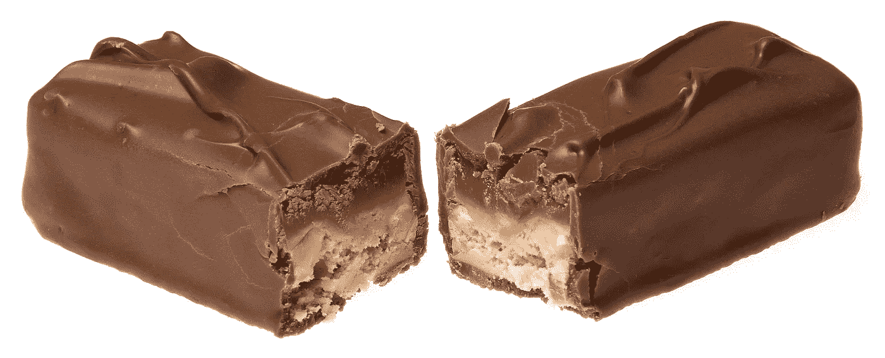

我要让矩阵分解变得像这个巧克力棒一样甜蜜(图片来自 [Pixabay](https://pixabay.com/?utm_source=link-attribution&utm_medium=referral&utm_campaign=image&utm_content=2202141) 的 [WikimediaImages](https://pixabay.com/users/wikimediaimages-1185597/?utm_source=link-attribution&utm_medium=referral&utm_campaign=image&utm_content=2202141)

**矩阵分解码**:[此处](https://github.com/thushv89/exercises_thushv_dot_com/blob/master/matrix_factorization_light_on_math_ml/matrix_factorization_part_1.ipynb)

在本文中，您将了解矩阵分解，这是许多经典机器学习方法的基础。本文将重点解释矩阵分解(MF)的实际应用(带有代码示例)以及支持它的直觉。你有没有想过[矩阵分解可能被用于药物再利用](https://academic.oup.com/bioinformatics/article/38/5/1369/6454947) ❓

如果你和我一样(希望不是)，在这篇文章结束时，你会后悔在你的本科代数课程中淡化矩阵分解，因为你从未想过你会用到它。

要访问本系列中我以前的文章，请使用以下信件。

[**A**](/light-on-math-ml-attention-with-keras-dc8dbc1fad39)**B**[**C**](http://www.thushv.com/computer_vision/light-on-math-machine-learning-intuitive-guide-to-convolution-neural-networks/)**[**D**](/light-on-math-machine-learning-intuitive-guide-to-understanding-decision-trees-adb2165ccab7)*** E F G H I J**[**K**](http://www.thushv.com/machine-learning/light-on-math-machine-learning-intuitive-guide-to-understanding-kl-divergence/)**[**L**](/light-on-math-machine-learning-intuitive-guide-to-latent-dirichlet-allocation-437c81220158)*** M**[**N**](/light-on-math-machine-learning-intuitive-guide-to-neural-style-transfer-ef88e46697ee)**O P Q******

# ****序幕****

****我在大学时，数学从来都不是我的强项。我从来不明白，为什么曲线给定点处的切线角度很重要，或者为什么曲线上的积分导致曲线下的表面积很重要，或者为什么矩阵分解很重要？当然，我们在数字领域看到的许多数据都可以用矩阵(或一般的张量)来表示。但那对我来说不再有意义了。像这样的问题，如果你已经有了完整的基本事实矩阵，你为什么要把它分成两个？在代数课上困扰着我。****

****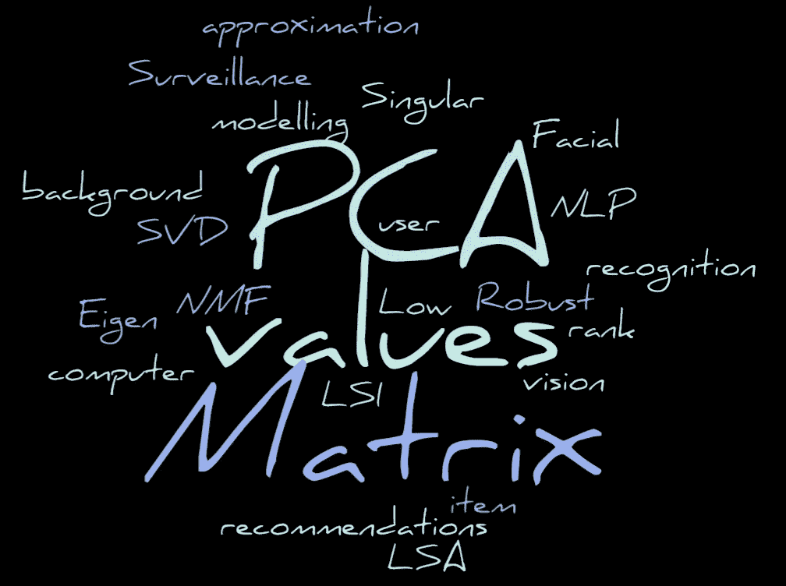****

****我大学时代的噩梦(图片由作者提供)****

****然后是研究生学习。我正在攻读深度学习的博士学位，这是一场忽略矩阵分解等主题的完美风暴，因为这是深度学习文献中很少出现的东西。****

****目前，作为一名从事推荐算法工作的 MLE，我立刻有了迫切需要的顿悟。“啊哈，这就是为什么你把矩阵分解成两个更小的矩阵”。****

****回首 10 年前那个天真的本科生，我对自己没有给予更多的关注感到深深的遗憾。为了补偿我自己，我将向你展示很酷的矩阵分解和它的概念的实际应用。我希望这将是那些可能在淹没数学和粗糙代数的沉船中的人的灯塔。****

# ****为什么是矩阵？****

****早在矩阵分解出现之前…矩阵。我们在数据科学中看到和使用的许多数据都可以用矩阵来表示。这里有几个例子。****

*   ****🖼灰度图像是按行(高度)和列(宽度)组织的像素矩阵****
*   ****📹视频可以表示为矩阵，其行显示帧数，列是展开为 1D 向量的图像****
*   ****文档的语料库可以表示为矩阵，其中行是文档，列是语料库中存在的所有术语(即词汇)****
*   ****👟项目评级(如电影或产品)可以表示为具有行(每个用户一个)和列(每个项目一个)的矩阵。****

****我希望这足以令人信服地理解我们每天遇到的数据中矩阵的广泛传播性质。****

****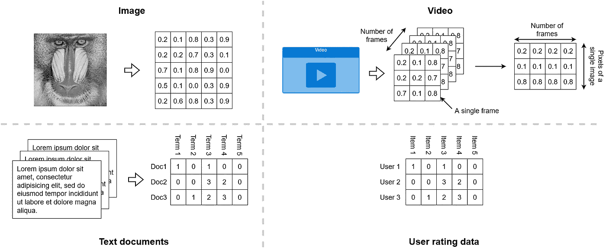****

****我们周围的矩阵——我们处理的几乎所有数据都是矩阵(图片由作者提供)****

# ****为什么要矩阵分解？****

****现在我们已经建立了矩阵没有缺席，我们的下一个目标是理解讨论中最重要的问题。****

> ****为什么我们需要分解(即因式分解)矩阵？****

****我无法给出一个通用的答案，因为 MF 的具体优势通常取决于应用程序和算法本身。所以让我激励我们如下。****

****我上面概述的这些矩阵并不十分有用。换句话说，把它们想象成数据中底层模式之上的一层——这是我们通常感兴趣去发现的。就像你切割和打磨钻石一样🔹从地球上挖掘出来以增加它的吸引力和价值，这些观察到的矩阵需要以特定的方式被操纵以到达它的甜蜜中心。矩阵分解是这个旅程的容器。****

> ****我们观察到的数据矩阵包含生成这些数据的源的模式/行为****

****更详细地说，通常数据都有内在的模式。例如，如果图像的一部分被遮挡，您仍然可以使用周围的信息来推断缺失的内容。另一个例子是，如果文档中的一些单词被修改/删除，你仍然可以理解该文档所传达的意思或信息。****

****为什么可以这样做？这是因为我们看到的数据中有潜在的模式。图像上的像素不是随机的。文档中的文本不是随机的。通过矩阵分解，我们正试图通过我们观察到的数据/噪音来揭示这种模式。你可能会问，为什么学习模式很重要？获得这些模式是我们开发的决策支持系统的生命保障。毕竟，学习模式是机器学习模型的工作。****

# ****MF 是怎么做到的？****

****将数据分成多个部分来揭示数据中的基本模式，这听起来有点不可思议。事实证明，将数据投射到一个潜在空间会迫使生成的矩阵学习模式，分离出噪音。****

****有许多不同的 MF 算法，它们利用所得的分解矩阵的各种性质。有些可能会将值约束为非负，而有些则强制稀疏。因此，你使用的算法将决定你得到的结果的性质。在我们去它的中心的旅途中，我们会看到相当多的这样的东西！****

# ****给我看看已经很酷的东西:MF 的应用****

****现在你可能厌倦了听我没完没了地谈论 MF。是时候看看这些算法是如何运行的了。****

## ****图像压缩****

****我们看到的第一个例子是图像压缩。矩阵分解可用于存储稍后重建图像所需的重要图像内容(占用的内存更少)。在这里，我们将学习一种叫做奇异值分解(SVD)的技术。SVD 背后的思想是用三个矩阵的乘法来表示矩阵**A**； **U** 、**σ**和 **V** 。****

****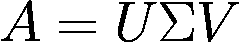****

****这里 A 是`n x m`，U 是`n x n`，σ是`n x m`，V 是`m x m`。****

****矩阵σ是对角线矩阵，包含对角线上的奇异值，是 SVD 的重要副产品。这些奇异值表示 **U** 和 **V** 的每一行/列捕获了多少方差(或奇异向量)。捕捉到的差异越多，重建就越好。你可能认识到[这与 PCA](https://jonathan-hui.medium.com/machine-learning-singular-value-decomposition-svd-principal-component-analysis-pca-1d45e885e491) 背后的原理相同。****

> ****奇异值的平方与每个奇异向量捕获的信息量(即方差)成比例****

****另一件很棒的事情是奇异值是按降序排列的。这意味着要得到最重要的奇异值，你只需将矩阵切割成包含那么多奇异值。****

****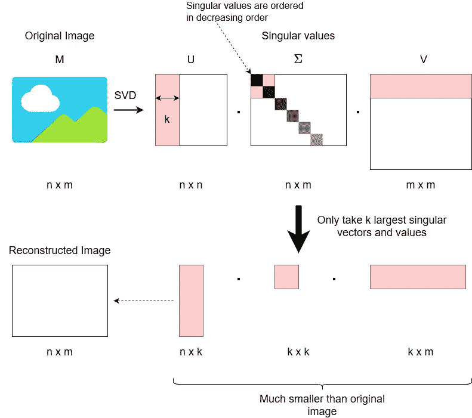****

****SVD 如何用于图像压缩(图片由作者提供)****

****奇异值分解有不同的变体。只得到最大奇异值而不计算全分解称为截断奇异值分解。一种更有效的近似变体称为[随机化 SVD](https://arxiv.org/pdf/0909.4061.pdf) 。这是我们用不同数量的随机奇异值分解得到的结果。****

********

****使用不同数量的奇异分量进行图像压缩(图片由作者提供)****

****下面是在`scikit-learn`中的实现。****

****让我们为`512x512`图像计算`k=50`的压缩率。****

*   ****原始图像= 512x512 = 262144 像素****
*   ****重建= 512x10 + 10x10 + 10x512 = 10340 像素(仅为原始图像的 4%)****

****不错！我们刚刚重建了一个近似值，它只占用了原来的 4%的内存。你可以在这里找到完整的端到端代码。****

## ****前景检测****

****接下来，我们进行前景检测。如果你认为压缩图像很酷，等着看这个吧！你可以用矩阵分解法来区分背景和前景🤯***插入心灵爆炸 GIF*** 🤯。想想在视频监控中你能做的惊人的事情。你可以从视频中检测到人或车。让我们看看如何做到这一点。****

****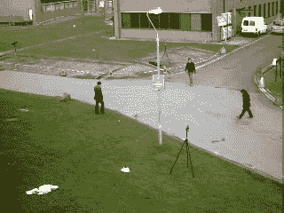****

****我们将使用的视频(来自[http://backgroundmodelschallenge.eu/](http://backgroundmodelschallenge.eu/)****

****首先，我们将视频表示为大小为`l x f`的矩阵，其中`l`是单帧的长度(即展开为 1D 矢量的灰度帧的高度和宽度)，而`f`是视频中的帧数。在我们的例子中，我们有一个大小为`76800 x 794`的矩阵(每个图像是 320x240=76800 像素)。****

****将视频作为矩阵加载****

****我们可以画出来，看看它是什么样子。****

****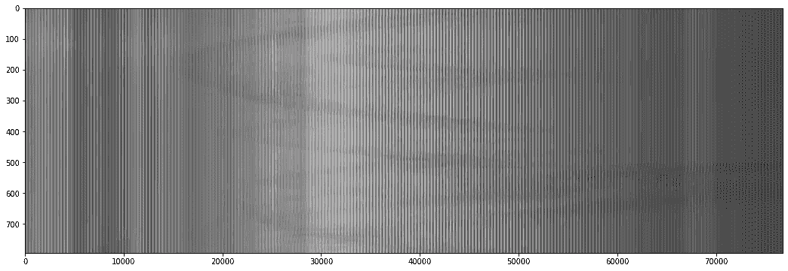****

****以矩阵形式组织的视频中的帧—这是实际矩阵的转置版本(即轴翻转)，以更好地利用空间(图片由作者提供)****

****你看到的曲线是视频中人物的动作。对于这项任务，我们将使用一种不同的矩阵分解技术，称为[鲁棒 PCA](https://en.wikipedia.org/wiki/Robust_principal_component_analysis) (rPCA)。想法是分解一个给定的矩阵 **M** 如下。****

****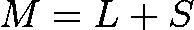****

****这里， **L** 是低秩近似， **S** 是稀疏矩阵。霍勒普。🛑，你刚才不是说你不会用令人麻木的数学来恐吓我们吗？让我们直观地理解这意味着什么。****

*****矩阵的秩*称为线性无关列的个数。如果一列不能作为矩阵中其他列的线性变换导出，则该列是*线性无关的*。为什么这很重要？因为矩阵中的线性*相关*列越多，冗余信息就越多——因为它们是从独立的列中得到的。如果考虑来自 CCTV 摄像机的视频馈送，背景是静态的，因此包含非常少的信息(或低熵)。因此，我们可以用少量线性无关的列来表示背景。换句话说，如果我将 M 的内容表示为一个低秩矩阵 **L** ，我将在其中捕获 **M** 中存在的背景。****

****附注:在奇异值分解中，非零奇异值的数量代表矩阵的秩。****

> ****低秩矩阵的一个例子是表示为矩阵的视频馈送的静态背景****

****稀疏矩阵呢。那个更有意义。在视频馈送中，静态背景将包含大部分数据(数据，而不是信息)。剩余的稀疏信息属于前景，因为前景通常在视频中占据很小的空间。因此，如果我试图迫使 **M** 成为稀疏矩阵 **S** ，我可能会在 **S** 中捕捉前景运动。另一种思考方式是， **S** 捕捉数据中的异常值！****

****现在，将 L 和 S 相加应该可以得到原始视频，这就是鲁棒 PCA 方程的含义。现在说起来容易做起来难！我们如何确保这些矩阵的这些性质。这超出了本文的范围。但是为了给你一点提示，你可以使用像主成分[追踪或者交替方向法](https://en.wikipedia.org/wiki/Augmented_Lagrangian_method#Alternating_direction_method_of_multipliers)这样的算法。对于 rPCA，我使用并修改了最初在找到的[代码。](https://freshprinceofstandarderror.com/ai/robust-principal-component-analysis/)****

****在高层次上，让我们了解如何针对这些特殊属性进行优化。****

****为了最小化 **L** 的秩，您可以使用核范数**L**，它是秩的代理。另一方面，如果你从事过线性回归，你可能记得 L1 范数鼓励权重矩阵的稀疏性。他们在这里使用相同的原理，使 **S** 成为稀疏矩阵。****

****看原著第 250 帧`frames_t`、`L`、`S`给了我们以下三个支线剧情图(按顺序)。****

****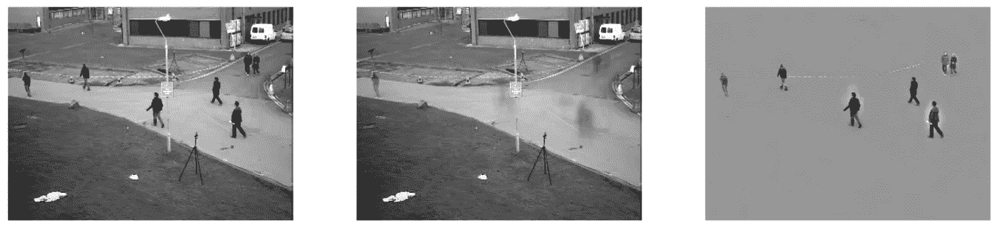****

****这是视频。****

****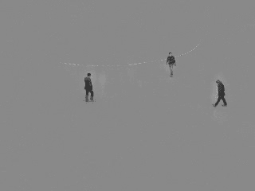****

****为所有帧提取的前景(图片由作者提供)****

****完整的端到端代码可在[这里](https://github.com/thushv89/exercises_thushv_dot_com/blob/master/matrix_factorization_light_on_math_ml/matrix_factorization_part_1.ipynb)获得。****

## ****很酷的把戏！让我们测试一下我们的知识****

****到目前为止，我们已经学习了两种技术；SVD 和 rPCA。我们还了解到，在以矩阵组织的视频中，低等级的组件捕获背景。****

****现在，在奇异值分解中有一个有趣的性质，秩等于非零奇异值的个数。那么，如果我们用很少的分量执行截断 SVD(在我们的例子中是随机化 SVD)并重建图像，会发生什么呢？****

****我们应该能分离出背景。然后提取前景是琐碎的。只需从原始图像像素中减去背景像素。****

****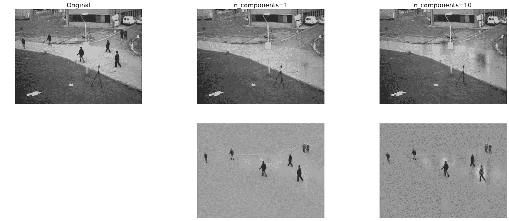****

****SVD 前景检测(图片由作者提供)****

****看起来不错。我们可以看到，增加组件的数量会使重建的前景更加广阔。这是直觉多么强大的一个很好的例子，它让你自信而有效地结合不同的技术来得到你需要的东西！****

****但是我们为什么需要 rPCA 呢？这导致了更多的技术细节，超出了本介绍的范围。简而言之，不同的算法有不同的优缺点。它们并不总是在每一个用例中得到强调。我可以指出的一个明显的区别是，rPCA 对于数据中的异常值更健壮。****

# ****现在再见****

****这里我要结束我们第一部分的讨论。我们首先理解了为什么矩阵是重要的，这也解释了为什么矩阵分解是重要的。然后我们讨论了计算机视觉中的两个应用；图像压缩和前景检测。我们讨论了两种算法，SVD 和 rPCA，甚至做了一个很酷的技巧，将 SVD 用于前景检测。****

****在下一篇文章中，我们将探索机器学习领域的其他部分，矩阵分解已经统治了这个领域！我们会讨论，****

*   ****自然语言处理中如何使用矩阵分解来学习概念****
*   ****矩阵分解如何用于项目推荐****

****在那之前，就再见了！****

# ****下一篇文章****

****[TBA]第 2 部分—矩阵分解****

# ****进一步阅读****

****[1] [fast.ai 的线性代数课程](https://github.com/fastai/numerical-linear-algebra-v2/blob/master/README.md)——非常全面地介绍了矩阵分解和 Python 中的大量应用****

****[2] [奇异值分解](http://thecooldata.com/2018/08/matrix-decomposition-image-compression-and-video-background-removal-using-r-part-1/)****

****[3] [奇异值分解和主成分分析的相似性](https://jonathan-hui.medium.com/machine-learning-singular-value-decomposition-svd-principal-component-analysis-pca-1d45e885e491)****

****[4] [健壮的 PCA](https://freshprinceofstandarderror.com/ai/robust-principal-component-analysis/)****