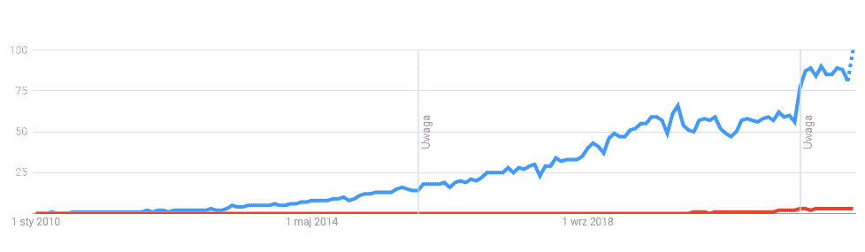
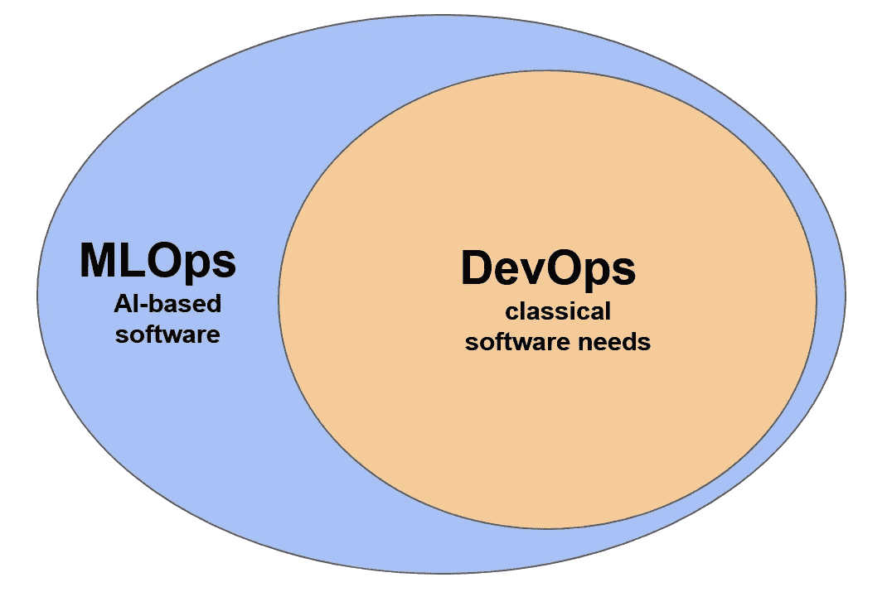
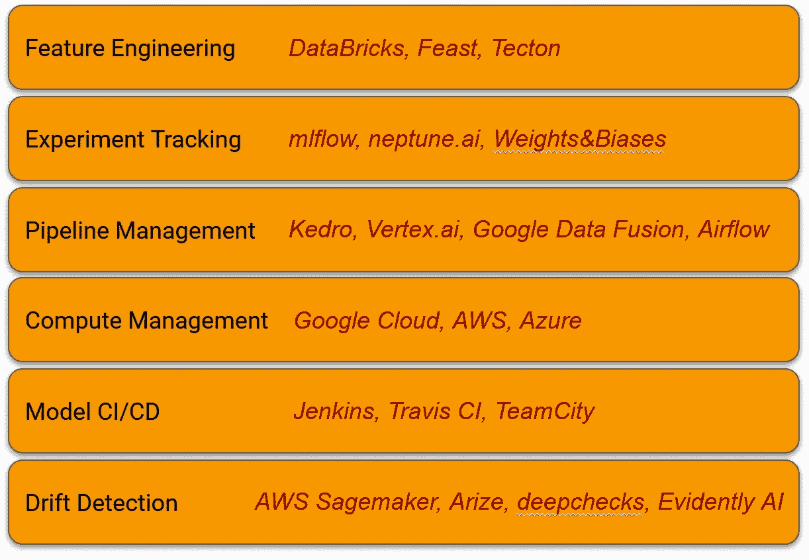

# MLOps 的轻量级介绍

> 原文：<https://towardsdatascience.com/lightweight-introduction-to-mlops-a77406cfcc68>

## MLOps 之旅如何开始以及从哪里开始—基本构建模块

克里斯蒂娜@ wocintechchat.com 在 [Unsplash](https://unsplash.com?utm_source=medium&utm_medium=referral) 上的照片

1.  **简介**

你可能听说过 [90%的 ML 车型不投产](/why-90-percent-of-all-machine-learning-models-never-make-it-into-production-ce7e250d5a4a)。实际上，任何 IT 从业者都知道，将任何软件投入生产是一个漫长而复杂的过程，并且本身就是一个挑战。然而，多年来，自从人们开始编写第一个 if-子句，过程、开发方式、部署和服务的持续改进就出现了。这导致了所谓的开发运维流程和工具的建立。如今，几乎每一家开发严肃软件的公司都采用了这些技术，不管是在游戏、制造、银行还是医疗行业。现在有成百上千的网页和文章在讨论这个话题。

然而，最近几年，一组新的软件类型出现在世人面前，即基于人工智能的系统。他们使用一种截然不同的方法来解决问题——他们基于统计学、概率以及最重要的大量数据。这产生了一系列新的挑战，无法用标准的 DevOps 方法有效解决(因为流程有些不同)。许多尝试过的公司都失败了。

因为这是一个更复杂、更具挑战性的领域，而且 IT 界已经认可了一个新的专业领域——MLOps。不幸的是，这仍然是一个非常年轻的职业——通过检查谷歌趋势中“MLOps”和“DevOps”的流行短语可以很容易地看出这一点。大约从 2019 年开始，它基本上不存在了。

蓝色——devo PS，红色——mlop；图片作者来自谷歌趋势

正因为如此，没有太多的定义、严格的规则或经过验证的方法可以轻易采用。每一个基于人工智能的公司仍然在实验，并努力寻找最佳的方法来解决有效创建和部署人工智能系统的问题。然而，如果你喜欢这些定义，你可以在谷歌云平台的 MLOps 网站上找到:

> *MLOps* 是一种 ML 工程文化和实践，旨在统一 ML 系统开发(Dev)和 ML 系统运营(Ops)。

因此，这不仅仅是关于更快的模型开发，而是关于全局和优化流程。这就是为什么写这篇文章的原因——给你一个关于 MLOps 领域的简单、非正式的介绍。这绝不是限制性的，它强调了我的个人经验，并以有关该主题的一些研究为依据，应该被视为任何考虑在其公司中引入 MLOps 或作为专业人员进入 MLOps 领域的人的思考材料。

**2。MLOps 挑战**

首先，是什么挑战使 MLOps 不同于 DevOps？您应该将 MLOps 看作是 DevOps 的扩展版本，因为它处理相同的问题以及一些额外的问题。

MLOps 与 DevOps 的范围；作者图片

让我们来看一些挑战:

1.  首先，ML 模型严重依赖于统计和概率。它们的内部参数不是由开发人员(称为 ML 工程师或数据科学家)直接设置的，而是通过设置控制算法行为的所谓超参数来间接设置的。
2.  系统的输入是灵活的，不受控制的。我的意思是，系统的内部行为是基于历史数据优化的(ML/Dev 阶段)，但在部署之后，它作用于实时数据(Ops 阶段)。例如，如果客户的行为发生变化，系统仍将遵循它根据旧数据学习到的旧决策模式。这将导致其价值快速贬值。其背后的过程被称为数据漂移，是基于人工智能的系统的 Ops 阶段的最大挑战之一。让我们举一个例子——一个披萨订购系统，您订购了一份意大利香肠披萨，收到了一份夏威夷披萨——您可以在代码中轻松地映射和跟踪问题并修复它。在 ML 系统中，这并不容易做到。
3.  另一个挑战往往来自开发者的背景和教育。因为 ML 系统是基于像高度先进的线性代数，贝叶斯统计和概率学，ML 专家在他们的教育中有不同的焦点。与典型的前端工程师相比(他们多久使用一次矩阵分解？).在实践中，这意味着在开发过程中，他们经常使用隐藏一些复杂的软件相关细节的框架，以利于易用性(例如 Keras，sklearn)。这些框架和库处于不断的发展和变化中，或者很可能出现新版本的 ML 算法(例如，在变形金刚领域的发展)。简而言之，ML 工程师:

*   并不总是能够完全、精确地控制他们使用的算法
*   喜欢并且必须尝试新的算法和方法
*   比传统软件开发人员更擅长数学

如你所见，总的来说，问题在于数据和算法的灵活性。这是它最大的优点，也是最大的缺点。

**3。实施 MLOps**

MLOps 旨在以有组织的方式控制开发和生产问题。为了实现这一点，需要采用一些重要的功能构件，如下图所示。根据行业或公司的具体情况，可能会有更多，但这些通常在各种使用案例中都很常见。

MLOps 的基本、顶级组件；作者图片

让我们简短地谈论一下他们中的每一个。

1.  特征工程是关于 ETL 管道及其版本控制的自动化。理想情况下，你会有一个特色商店的风格。如果你不熟悉这个概念，请查看这个[网站](https://www.featurestore.org/)。市场上提供的一些工具:Databricks Feature Store、Feast、Tecton。
2.  实验跟踪是一个非常重要的组成部分，因为它涉及到 ML 工程师的两个实验——成功的和失败的。它允许在时机成熟时重温一些以前的想法(如不同的算法或特性)，而无需重新发明轮子。在成熟的 ML 系统中，还有一种方法来捕获一组超参数(过去的和当前的)和相应的系统质量 KPI——通常这被称为模型注册表(像 MLflow、Neptune 或 Weight & Biases 这样的工具)。
3.  管道管理允许您对控制从输入到输出的数据流的管道进行版本控制。它还应该记录每次运行，如果发生了不好的事情，就会产生一个有意义的错误。这里来看看:Vertex AI Pipelines，Kedro，PipelineX，Apache Airflow。
4.  计算管理解决了 ML 系统的可扩展性问题。一些算法在训练和再训练时需要巨大的计算能力，而在推理时几乎不需要。由于这两项任务通常通过反馈控制回路联系在一起，因此系统必须能够上下伸缩。有时，像 GPU 这样的额外资源必须用于训练，而推理部分并不需要。公共云提供商很好地解决了这个问题，提供了自动扩展和负载平衡。
5.  模型 CI/CD 与 DevOps 区域的 CI/CD 非常相似，但是在部署模型之前必须进行额外的检查。这些是选择的性能指标，必须在可接受的范围内，并始终与生产中的当前模型进行比较。这里最受欢迎的工具之一是 Jenkins 和 Travis，但还有很多其他工具，如 TeamCity 或 Circle CI。
6.  漂移检测是一个监控输入数据特征和系统行为的模块。当传入数据的特征偏离预期范围时，应发出适当的警报，以便请求对模型进行重新训练(自动或手动)。如果这没有帮助，警报应该升级，开发团队应该更深入地研究这个问题。要考虑的工具/服务:AWS SageMaker Model Monitor，Arize，显然还有 AI。

MLOps 环境的典型工具:作者图片

当向您的组织介绍 MLOps 时，尤其是如果它曾经或现在仍在开发软件，您必须非常小心并意识到开发人员的偏见。许多不熟悉人工智能领域的人将倾向于成熟的 DevOps 解决方案，并将推动它们。这就是为什么在许多公司中，基于 ML 的系统是由专门的团队或部门开发的。

**4。总结**

正如您所看到的，这篇文章是介绍性的和一般性的，并没有为您强加任何特定的解决方案。这是因为不同的公司有自己需要自动化的内部流程和特定的挑战，可能需要不同的方法和工具来找到最佳的解决方案。尽管如此，还是有一些很棒的关于 MLOps 的资料是用一组特定的工具编写的。我强烈推荐，例如:

*   [https://cloud . Google . com/architecture/mlops-continuous-delivery-and-automation-pipeline-in-machine-learning](https://cloud.google.com/architecture/mlops-continuous-delivery-and-automation-pipelines-in-machine-learning)
*   [https://azure . Microsoft . com/en-us/products/machine-learning/mlops/# features](https://azure.microsoft.com/en-us/products/machine-learning/mlops/#features)
*   [https://aws.amazon.com/sagemaker/mlops/?sagemaker-data-wrangler-whats-new . sort-by = item . additional fields . post datetime&sagemaker-data-wrangler-whats-new . sort-order = desc](https://aws.amazon.com/sagemaker/mlops/?sagemaker-data-wrangler-whats-new.sort-by=item.additionalFields.postDateTime&sagemaker-data-wrangler-whats-new.sort-order=desc)