# 可能性、概率和你应该知道的数学

> 原文：<https://towardsdatascience.com/likelihood-probability-and-the-math-you-should-know-9bf66db5241b>

## 可能性在机器学习中起什么作用？

由 [Saad Ahmad](https://unsplash.com/es/@saadahmad_umn?utm_source=medium&utm_medium=referral) 在 [Unsplash](https://unsplash.com?utm_source=medium&utm_medium=referral) 上拍摄的照片

可能性是一个令人困惑的术语。可能性不是一种概率，而是与一种概率成正比；这两个术语不能互换使用。在这篇文章中，我们将剖析可能性这个概念，并理解它在机器学习中的重要性。

# 直觉

让我们来理解可能性，以及它与一个虚构的城市 Databerg(一个令人生厌的名字，但请原谅我)的概率分布有什么不同。让我们也想象一下，我们可以访问这个城市所有房屋的定价数据。我不知道这种分布到底是怎样的，因为数据堡不是一个真正的城市，但凭直觉，我会说我们会注意到许多价格适中的房子和一些非常昂贵的房子。如果要绘制这些价格的分布图，可能会是这样的。

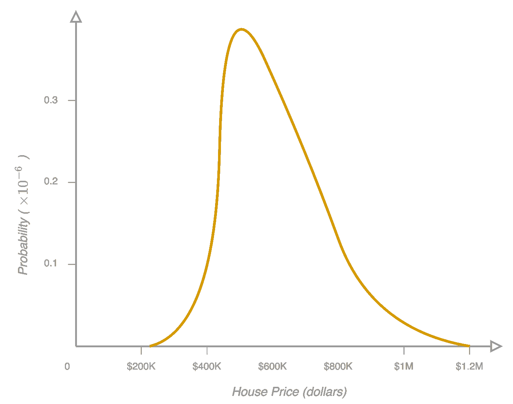

图 1

连续房价值沿 *x* 轴绘制，概率值沿 *y* 轴绘制。*图 1* 因此代表一个[概率密度函数](https://en.wikipedia.org/wiki/Probability_density_function)。*概率密度函数*这个短语在谈论连续值，比如房价时，经常与*概率分布函数*互换使用。所以在整篇文章中，我们将使用更相关的短语*概率分布函数*来表示这两者。但是，当其他来源使用短语*概率密度函数*谈论同一概念时，不要感到困惑。

因为我们处理的是概率分布函数，所以橙色曲线下的面积是 1。这意味着，如果我们在数据堡随机选择一所房子，这个价格是某个正实数的概率是 100%；这是有道理的。我们还可以确定房价位于两个价格点之间的概率。考虑下图。

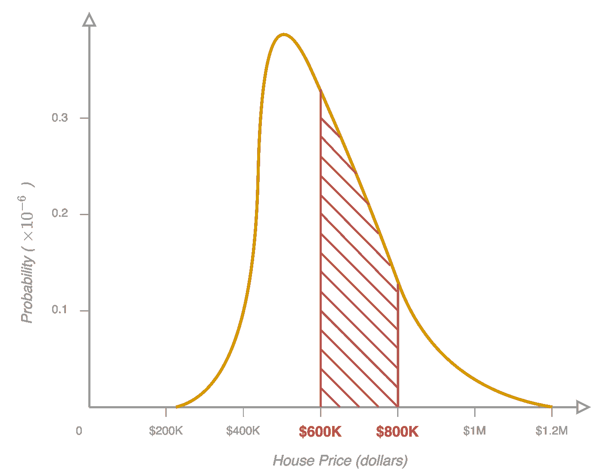

图 2

假设红色条纹部分下面的面积是 *0.45* 。然后我们可以做如下陈述。

> 给定这种房价分布，一栋房子定价在 60 万美元到 80 万美元之间的**概率**是 0.45。

现在我们有了概率的概念，让我们颠倒一下我们的设置来讨论可能性。不给出 Databerg 中的所有房屋信息(因此给出如图 1 所示的房价概率分布函数),让我们假设只给出 *10，000* 套房屋的价格。我们现在的目标是确定(或至少近似)图 1 中*的概率分布函数。*

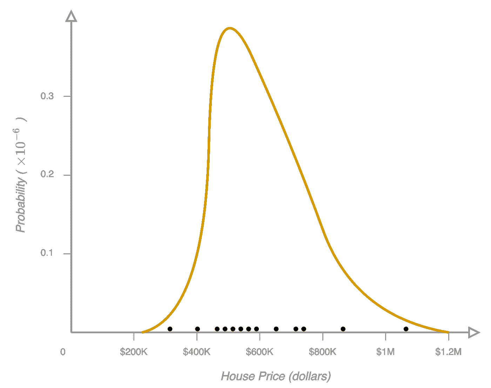

图 3

靠近 *x* 轴的每个点都是一座房子。当前分布与该数据的吻合程度通过可能性来量化。假设上面的分布是对数正态分布，均值 *13.2* ，标准差 *0.4* 。并且在给定房屋样本上这种分布的可能性是 *1.78* 。然后我们可以做如下陈述:

> 给定这 10，000 栋房屋，分布平均值的**可能性**为 13.2，标准差为 0.4，为 1.78。

请注意，可能性的值可能大于 1，因此它不是一个概率密度函数。事实上，与相同数据的其他分布的可能性相比，可能性的 1.78 值更有意义。

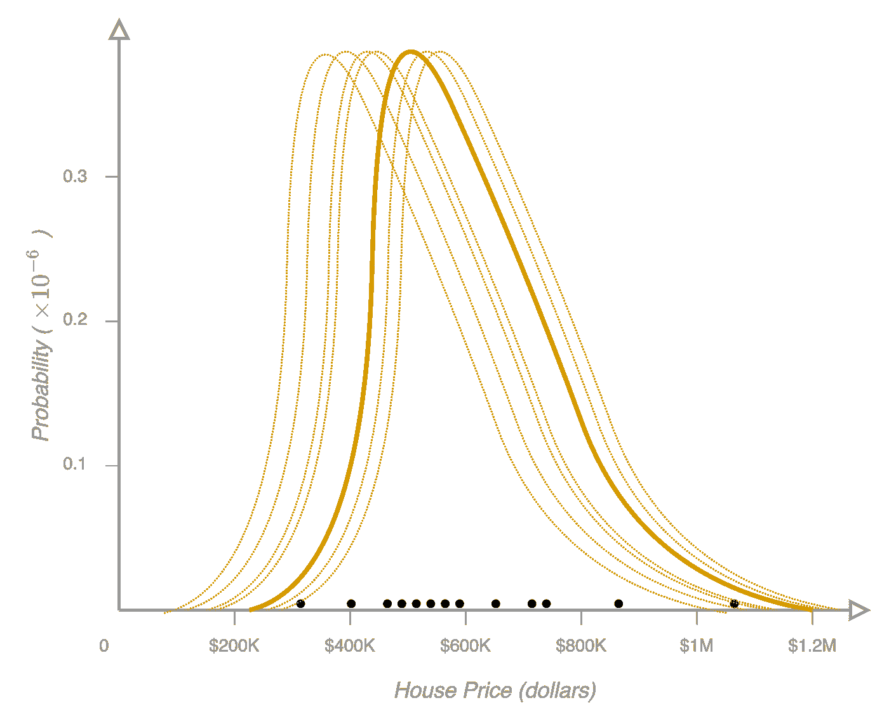

图 4

在*图 4* 中，每个虚线分布是通过改变对数正态分布的均值和标准差得到的。对于每个分布，我们可以确定可能性(量化分布与 *10，000* 数据点的拟合程度)。现在让我们继续讨论可能性的定义。

# 定义可能性

关于理论统计的数学基础的书[给了我们一个关于可能性的清晰定义。](https://royalsocietypublishing.org/doi/epdf/10.1098/rsta.1922.0009)

> 任何参数(或一组参数)应该具有任何指定值(或一组值)的可能性与这样的概率成比例，即如果是这样的话，观察的总体应该是被观察的

*组参数*是分配的参数。从*图 3* 来看，我们假设的房价分布是对数正态分布。这个分布的参数是平均值和标准差。*分配的一组值*是平均值的 *13.2* 和标准差的 *0.4* 。*观察*就是*万*房价*。有了这些信息，我们可以把这个定义转化成数学。*

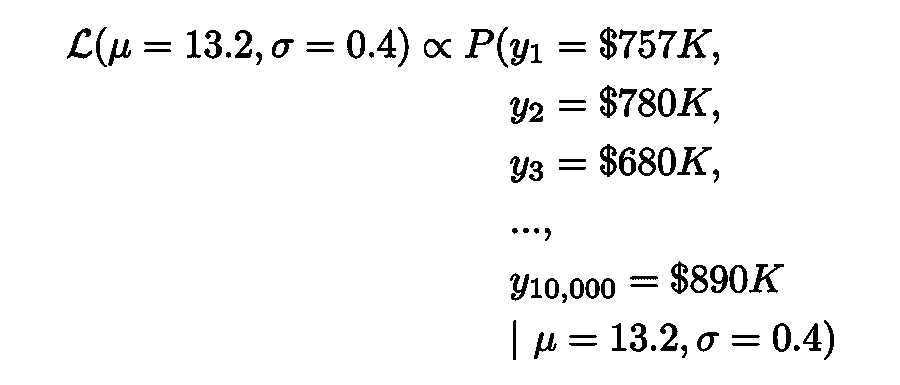

等式 1

左手边的 *L* 是*似然函数*。它是概率密度函数参数的函数。右手边的 *P* 是条件[联合概率分布函数](https://en.wikipedia.org/wiki/Joint_probability_distribution)。这是在我们假设的分布下，我们观察到的每栋房子的价格的概率。可能性与这个概率成正比，不一定等于这个概率。

# 可能性和机器学习

在[参数模型](https://en.wikipedia.org/wiki/Parametric_model)中，如线性回归和逻辑回归，我们得到一组数据点，目标是找到最适合观察数据的这些模型的参数。让我们考虑一下我们在上一节中介绍的同一个房价例子。我们希望拟合一些统计模型[来预测房屋价格，给出一些关于房屋的信息，如房屋中卧室的数量、房屋的面积(平方英尺)以及房屋的年龄。](https://en.wikipedia.org/wiki/Statistical_model)

图 5

这是模型中的 3 个特征，但在实践中还可以有更多。让我们假设我们想要执行一个[线性回归](https://en.wikipedia.org/wiki/Linear_regression)。由于这种假设，输入要素和输出标注以下列方式相关联。

等式 2

人们可以用下面的形式更一般地写它。

等式 3

*x* 项是 *i* ᵗʰ房子*的特征，y* 是 *i* ᵗʰ房子的价格，𝜃项是各特征的系数，ε𝜖表示[不可约误差](https://en.wikipedia.org/wiki/Bias%E2%80%93variance_tradeoff)。这是由固有的系统随机性引起的误差，也是因为某些特征没有被考虑在内而发生的。

为了构建这个线性回归模型，我们需要知道𝜃项的值。为了找到𝜃条件，我们需要房屋特征及其价格的例子。也就是说，我们需要成对的 *(* 𝑥，𝑦 *)* 来填充*等式 3* 中的值，以估计𝜃项。这就是为什么我们需要训练数据。

还记得我们想象中的城市数据库吗？让我们添加细节，使这些数据对训练模型有用。我们可以访问 Databerg 中的 *10，000* 份房屋记录。每个记录都有关于房子的信息:卧室的数量；房子的面积(平方英尺);房子的年龄；以及这栋房子的评估价格。既然我们要预测房子的价格，标签 *y* 就是这个价格。这个假想数据集中的其他字段是特征 *x* ，它们是我们预测相应价格的线性回归的输入。这些训练数据如下表所示。一套房子是*75.7 万美元*，第二套房子是*78 万美元*，第三套房子是*68 万美元*等等*。*

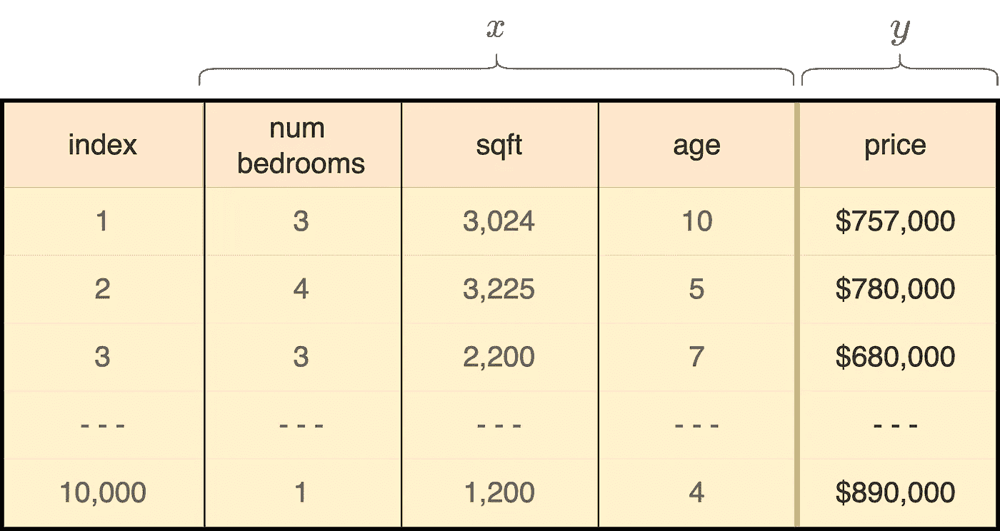

图 6

如果我们假设𝜃项的值，我们可以使用似然函数量化线性回归模型拟合训练数据的程度。最后，我们要确定最适合给定数据的𝜃项；换句话说，我们想要确定使似然函数最大化的𝜃项的值。这被翻译成数学如下。

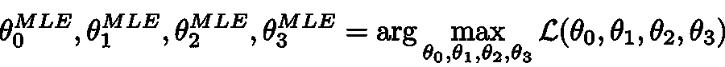

等式 4

我们将很快解释这些术语。但在此之前，让我们通过用矢量形式表示所有𝜃项来摆脱这种繁琐的符号。

等式 5

现在，*方程 4* 可以写成更一般更简洁的形式。

等式 6

这个符号告诉我们一些事情:似然函数 *L* 是模型参数𝜃的函数； *arg max* 函数返回使这个似然函数 *L* 最大化的𝜃的值。根据定义，𝜃的这个值就是𝜃.的*最大似然估计*为了区分在右边使用的变量𝜃和我们在左边寻找的𝜃的特定值，我们给后者加上一个 *MLE* 上标。此外，𝜃最大似然估计表明这个值只是一个估计值。

# 𝜃的最大似然估计

根据我们对似然性的定义，似然函数与观察到的训练数据的联合概率分布成比例。

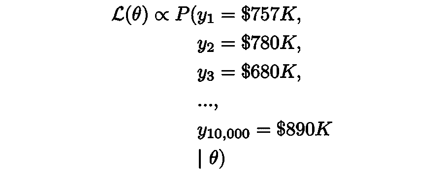

等式 7

我们在机器学习中倾向于做出的一个假设是，这些房屋的价格不会相互影响。用数学语言来说，每个房子样本都是[独立同分布](https://en.wikipedia.org/wiki/Independent_and_identically_distributed_random_variables)或 I . I . d；这个假设在很大程度上是合理的。在数学上，这意味着联合概率 *P* 现在可以表示为个体概率分布 *p* 的乘积。

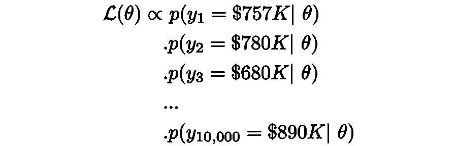

等式 8

让我们把这个符号和产品符号联系起来；并且使用 *n* 作为样本数量，而不是我们选择的任意数量的 10，000 个训练样本。

等式 9

从技术上来说，对于每一个房屋样本，这些房价标签 *y* 都是在给定房屋的其他特征(卧室数量、平方英尺、&年龄)时计算出来的。让我们用[条件概率分布](https://en.wikipedia.org/wiki/Conditional_probability_distribution)符号来说明这一点。

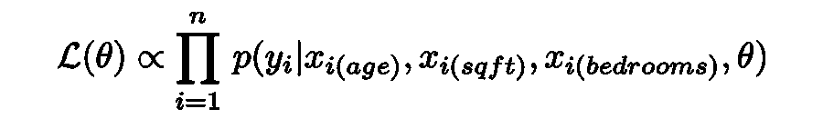

等式 10

就像我们对𝜃做的那样，让我们用向量符号使 *x* 更紧凑。

等式 11

你可以把 xᵢ向量中的 *1* 想象成线性回归*方程 3* 中常数项的系数。我们现在可以更清楚地写出如下的似然函数。

等式 12

右边的每一项都是介于 0 和 1 之间的概率。即使是合理的数据集，这些样本的乘积也将接近于 0。机器学习是用计算机完成的；计算机无法以适当的精度计算这个乘积；这种情况是[算术下溢](https://en.wikipedia.org/wiki/Arithmetic_underflow)。为了解决这个问题，我们最大化这个似然函数的对数；这是通过将乘积项转换为对数之和来实现的。

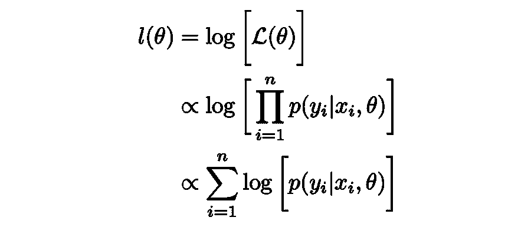

等式 13

这个公式利用了对数的一个重要性质:乘积的对数与它们各个部分的对数之和相同。最后，我们感兴趣的是使原始似然函数最大化的参数𝜃的值，而不是似然函数本身的值。最大化原始似然函数的𝜃向量的值与最大化对数似然函数的𝜃向量的值相同。我们可以写出下面的形式。

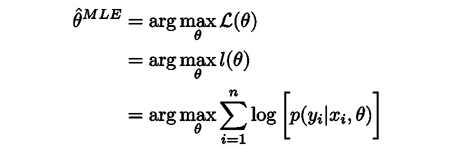

等式 14

这是因为对数是单调递增的。也就是说，如果一个数大于另一个数，对数的行为类似。所以最大化似然函数的参数值将最大化其对数。此外，我们能够写出*等式 14* 中的最后一行，因为我们知道对数似然和概率值之和彼此成比例(*等式 13)* 。因此，它们共享相同的最大值。让我们重写我们需要最大化以获得模型参数的最终似然方程。

等式 15

我们如何求解这个似然函数取决于机器学习模型的类型。例如，在线性回归中，假设给定特征 *x* 和参数𝜃.，我们将假设标签 *y* 遵循正态分布下面的参考资料给出了解决简单线性回归的似然估计的证明。完成这一数学运算后，一个有趣的认识是，𝜃的最优值将是最大化[残差平方和方程](https://en.wikipedia.org/wiki/Residual_sum_of_squares)的值，这是机器学习中的一个基本方程。类似地，我们可以使用*等式 15* 作为逻辑回归等参数分类模型的起点。[这里有一段我为逻辑回归](https://www.youtube.com/watch?v=-p1ldISb90Q&ab_channel=CodeEmporium)计算最大似然估计的视频。

# 结论

这篇文章从可能性背后的直觉开始。然后，我们正式定义了可能性及其与概率的关系。我们讨论了如何使用最大似然估计来估计最适合训练数据的统计模型的参数。同时，我们引入了数学符号来概括如何对任何参数模型进行最大似然估计。我们通过推导似然方程的一般形式来结束我们的讨论，该方程可用于求解线性回归和逻辑回归等模型中的参数。

谢谢你一直读到最后！更多技术内容，请关注我的 [Code Emporium YouTube 频道](https://www.youtube.com/c/CodeEmporium)，我在那里教数据科学和机器学习。

# 资源

[1] Code Emporium，[梯度下降——你应该知道的数学](https://www.youtube.com/watch?v=-p1ldISb90Q&ab_channel=CodeEmporium) (2019)， *YouTube* 。

[2]斯蒂芬·佩蒂格鲁，[从模型到对数似然](http://www.stephenpettigrew.com/teaching/gov2001/section4_2014.pdf) (2014)，*宾夕法尼亚大学*

[3]徐立言，[机器学习:MLE vs 地图](https://liyanxu.blog/2021/03/11/mle_vs_map/) (2021)， *Just Chillin' Blog*

【4】[whuber](https://stats.stackexchange.com/users/919/whuber)，[“可能性”和“概率”有什么区别？](https://stats.stackexchange.com/q/2659) (2019)， *stats.stackexchange.*

[5]与乔希·斯塔默的 StatQuest，[概率不是可能性](https://www.youtube.com/watch?v=pYxNSUDSFH4&ab_channel=StatQuestwithJoshStarmer) (2019)， *YouTube*

[6]马特·博格纳，[概率分布小程序](https://homepage.divms.uiowa.edu/~mbognar/) (2016)，*爱荷华大学*

[7] Joram Soch，[简单线性回归的最大似然估计](https://statproofbook.github.io/P/slr-mle) (2021)，*统计证明手册*

【8】[user 132704](https://math.stackexchange.com/users/132704/user132704)，[“概率密度函数”和“概率分布函数”有什么区别？](https://math.stackexchange.com/q/697467) (2019)， *stats.stackexchange* 。

本帖中使用的所有图像和图形均由作者创作。