# 只有两行代码的线性数据科学工作流程:简化了 MLOps

> 原文：<https://towardsdatascience.com/lineapy-data-science-workflow-in-just-two-lines-mlops-made-easy-679f36ac63bd>


卢卡斯·法夫尔在 [Unsplash](https://unsplash.com?utm_source=medium&utm_medium=referral) 上的照片

## 简化的数据工程

## 简介:

LineaPy 是用于数据科学自动化的 python 包。根据 LineaPy 文件:

> LineaPy 是一个 Python 包，用于捕获、分析和自动化数据科学工作流。在高层次上，LineaPy 跟踪代码执行的顺序，以形成对代码及其上下文的全面理解。这种理解允许 LineaPy 提供一套工具，帮助数据科学家更快更容易地将他们的工作投入生产，只需要*两行*代码。

我看到了他们上周关于 LineaPy 的声明。这源于加州大学伯克利分校的研究，如 Apache Spark，现在是开源的。我尝试了 LineaPy，它看起来非常有趣和有用。如果你想了解更多关于 LineaPy 的信息，请继续阅读。

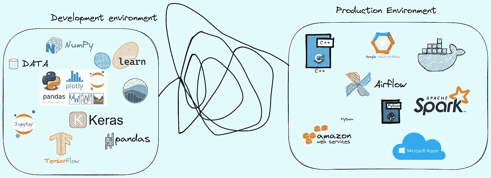

图片由作者提供(使用 Excalidraw 和 Excalidraw 贴纸)

## 目录:

**1。为什么我们需要 LineaPy？
2。线性安装。
3。概念。
第 4.2 行代码。
5。穿越线性示例。
6。结论**

我使用了以下工具来创建图表和代码片段。

*->excaldiraw
->git mind
->Gist
->carbon . now . sh*

## 为什么我们需要 LineaPy:

数据科学发展到生产的过程是一个复杂的工程过程。VentureBeat 上的一篇文章称，大约 90%的数据科学项目都无法投入生产。简而言之，十个项目中只有一个能够投入生产。在 Jupyter 笔记本中编写混乱的代码是很容易的，因为你要做大量的 EDA、统计分析、编辑单元格、删除单元格等等。此外，保持笔记本整洁有序非常费时费力。重构数据科学开发代码和构建管道是复杂的、手动的和耗时的。LineaPy 只提供了 2 行代码，用于将开发代码转换为生产代码，并生成所需的管道。

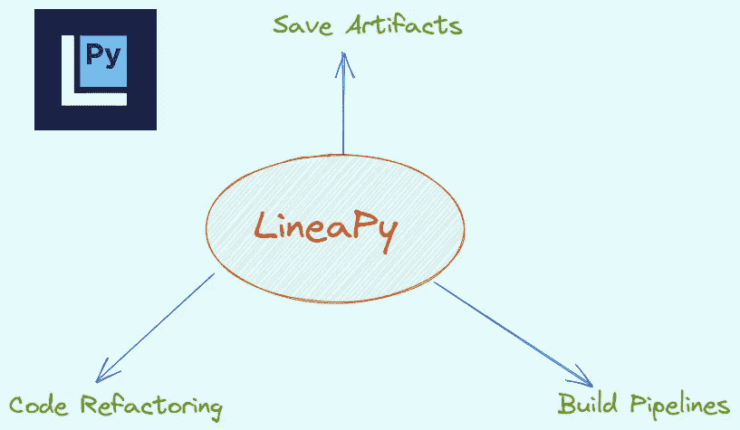

作者图片

## 线性复制安装:

作者图片

## 概念:

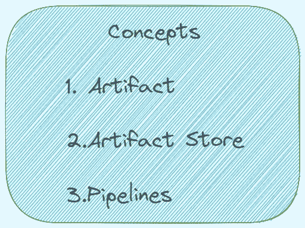

作者图片

**神器:**

*   工件是指数据科学开发过程中的一个中间结果。
*   在数据科学工作流中，工件可以是模型、图表、统计数据、数据帧或特征函数。
*   LineaPy 将工件视为代码和值。它存储工件的值以及派生工件的必要代码。

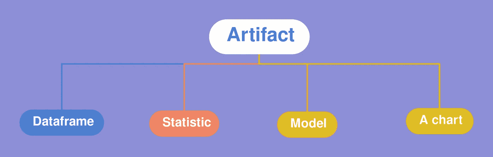

作者图片

**神器商店:**

*   工件存储在工件存储中。
*   工件存储还保存工件的元数据，如创建时间和版本等。
*   任何人都可以在全球范围内访问藏物商店。用户可以在不同的开发会话甚至不同的项目中查看、加载和构建工件。

**管道:**

*   管道是指将数据转化为有用信息/产品的一系列步骤。

例如下面是一条管道

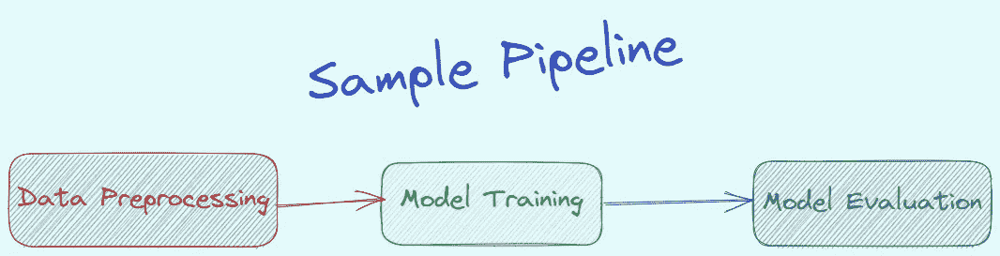

作者图片

*   这些管道是一次开发一个组件，然后将所有组件连接起来，得到整个管道。
*   在 LineaPy 中，每个组件都被表示为一个工件，并且 LineaPy 提供了从一组工件创建管道的 API。

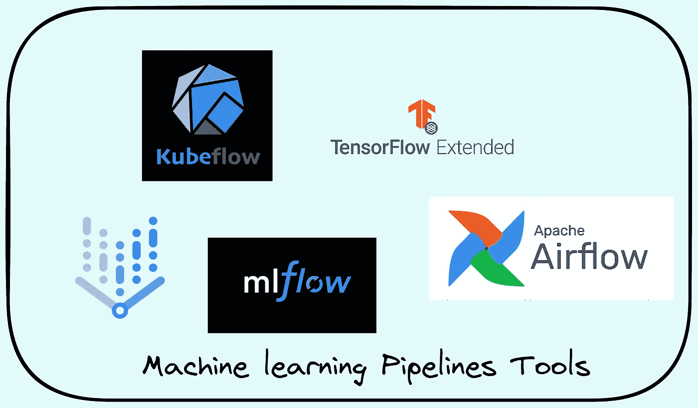

作者图片

## 2 行代码:

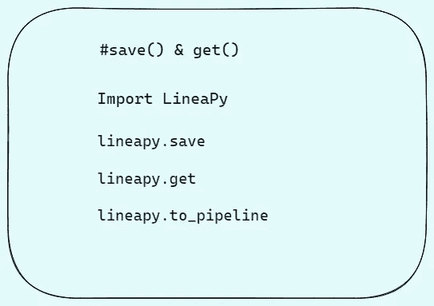

作者图片

*   保存您想要保存的工件，如数据帧、变量、模型等。然后调用工件，获取工件的值和代码。`**lineapy.save**` API 创建线性工件并将它们保存到数据库中。保存工件的代码是

```
***# Step 1
#Store the variable as an artifact***
saved_artifact = lineapy.save(model, "my_model_name")
```

*   该方法需要两个参数:要保存的变量和要保存的字符串名称。它返回保存的工件。
*   `**LineaArtifact**`该对象有两个关键的 API:
*   `**.get_value()**`返回工件的值，如整数或数据帧
*   `**.get_code()**`返回最少的基本代码来创造价值

代码是

```
***# Step2:Check the value of the artifact***
print(saved_artifact.get_value())***# Check minimal essential code to generate the artifact***
print(saved_artifact.get_code())**#Check the session code**
saved_artifact.get_session_code()**#To check the saved artifacts**
lineapy.catalog()***#Get version info of the retrieved artifact***
desired_version = saved_artifact.version

***# Check the version info***
print(desired_version)
print(type(desired_version))
```

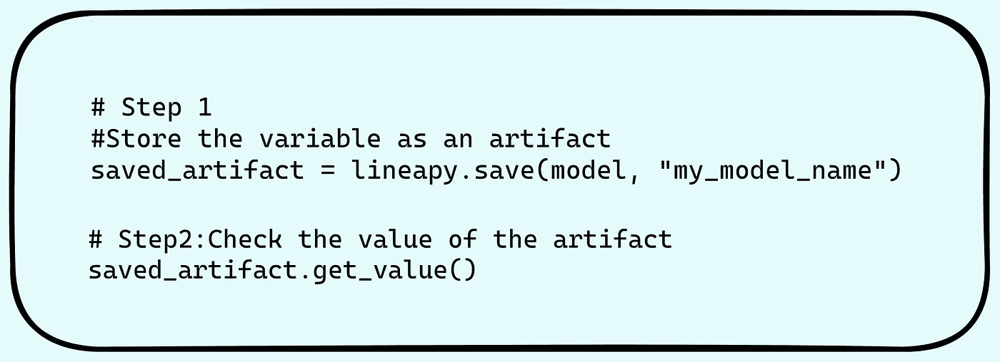

作者图片

## 穿越线性示例:

**关于数据集:**数据集是自动 MPG 数据集，可在

[**UCI 机器学习知识库**](https://archive.ics.uci.edu/ml/datasets/auto+mpg)
机器学习与智能系统中心

**来源:**该数据集取自卡内基梅隆大学的 StatLib 图书馆。该数据集被用于 1983 年美国统计协会博览会。

> **数据集** : *Dua，d .和 Graff，C. (2019)。UCI 机器学习知识库[http://archive . ics . UCI . edu/ml]。加州欧文:加州大学信息与计算机科学学院。*

**数据集特性:**

*1。* ***mpg:*** *连续
2。* ***缸*** *:多值离散
3。* ***位移*** *:连续
4。* ***马力*** *:连续
5。* ***重量*** *:连续
6。* ***加速度*** *:连续
7。* ***车型年*** *:多值离散
8。* ***产地:*** *多值离散
9。* ***汽车名称*** *:字符串(每个实例唯一)*

本教程使用经典的 [Auto MPG](https://archive.ics.uci.edu/ml/datasets/auto+mpg) 数据集，并演示如何建立模型来预测 20 世纪 70 年代末和 80 年代初汽车的燃油效率。这是一个经典的回归问题。为此，您将为模型提供该时间段内许多汽车的描述。该描述包括气缸、排量、马力和重量等属性。

在我的例子中遵循的工作流程如下。主要目标是如何保存工件、获取值/代码并生成管道。

1.  将训练和测试数据加载到 pandas 数据框架中
2.  EDA 和统计分析。
3.  将最终的训练和测试数据保存为工件——使用 Save()
4.  检查工件-get()
5.  使用不同的方法建立模型。
6.  选择最佳型号。
7.  将最佳模型保存为工件——save()
8.  显示工件目录-目录()
9.  使用保存的工件构建管道。

要在本地练习，请使用 Google Colab。我用了 G **oogle Colab。**同样，本文的主要目的是演示 LineaPy 包的用法，并且同样不太担心模型的构建或模型的性能。更多细节请查看参考文献中的 Tensorflow 教程。这里的目标是查看线性复制功能。

声明所有必需的包。

作者图片

下载数据集并将数据上传到熊猫数据框架。

作者图片

现在做一些探索性的数据分析和统计分析。

作者图片

现在将训练和测试数据数据帧保存为工件-save()

作者图片

例如

作者图片

工件的类型是

```
<class ‘lineapy.graph_reader.apis.LineaArtifact’>
```

显示工件的值和代码:

作者图片

保存的工件序列数据帧和代码的输出。

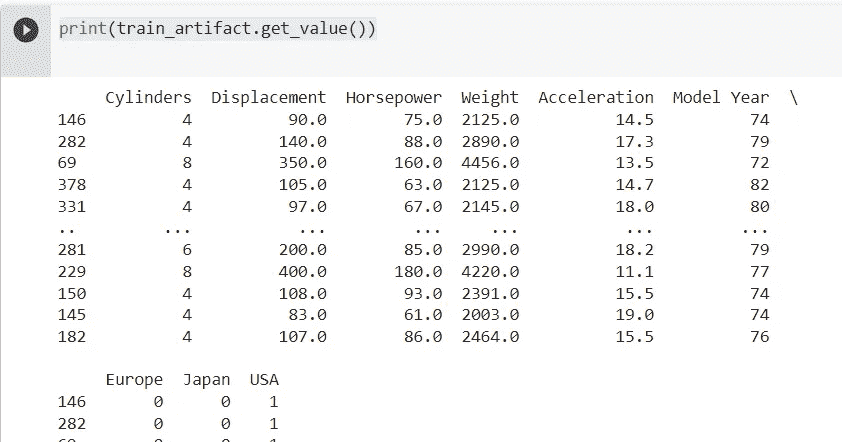

作者图片

所有的 EDA 代码和不必要的代码都被删除。

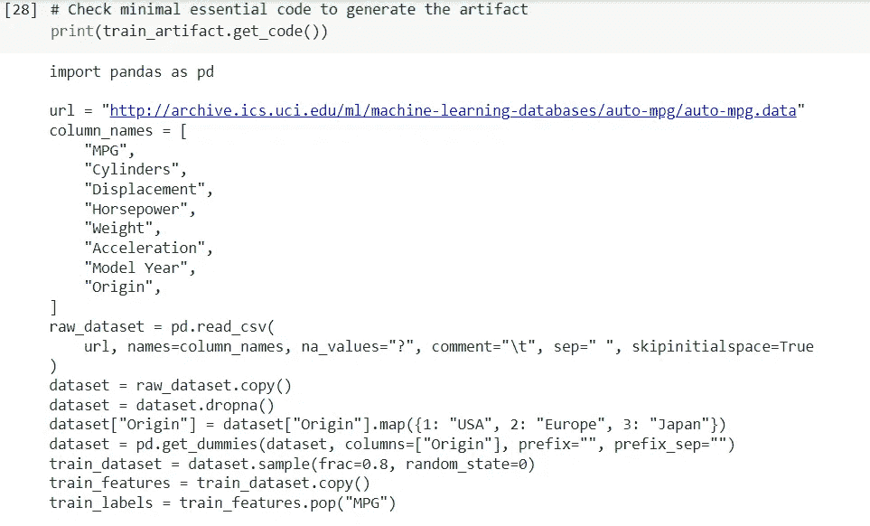

作者图片

若要显示原始会话代码，请使用 get。会议

作者图片

上面的 get_session_code 将显示包含所有 eda 代码的整个代码，等等。

现在构建模型并选择最佳模型。您可以使用之前存储的工件来获得预处理的训练和测试数据集。

**第一模型:线性回归模型**

作者图片

**第二款车型——DNN 车型:**

作者图片

**结果:**

作者图片

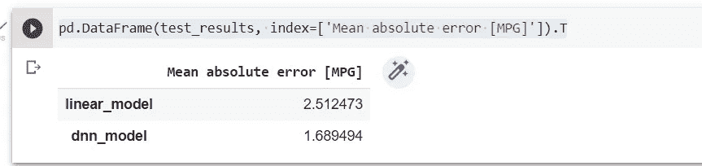

作者图片

DNN 模型是比线性回归模型更好的模型。我会拯救 DNN 模型。

现在拯救 DNN 模型。

作者图片

要显示模型的代码，使用 **get()方法**。

作者图片

下面是您对**模型 _ 工件**使用 **get_code** 时生成的代码。

作者图片

列出所有保存的工件。

作者图片

输出——显示所有存储的工件

```
train_data:0 created on 2022–05–28 02:07:02.669098 
train_labels:0 created on 2022–05–28 02:07:10.961282 
test_data:0 created on 2022–05–28 02:07:14.520631 
test_labels:0 created on 2022–05–28 02:07:20.777316 
dnn_model:0 created on 2022–05–28 02:15:23.632722
```

现在，您还可以用您保存的工件构建一个数据管道。生成管道的代码有

*   获取工件并将其赋给一个变量。

作者图片

现在构建数据管道。

*   预处理数据。
*   模型结构

作者图片

*   `**artifacts**`是用于管道的工件名称列表。这里我们使用火车和模型工件。其实我们不需要测试神器。
*   `**pipeline_name**`是管道的名称。这里的管道名称是泰坦尼克号管道。
*   `**dependencies**`是工件之间的依赖图
*   如果工件 A 依赖于工件 B 和 C，那么图被指定为`{ A: { B, C } }`
*   如果 A 依赖于 B and B 依赖于 C，那么这个图被指定为`{ A: { B }, B: { C } }`
*   `**output_dir**`是放置运行管道的文件的位置
*   `**framework**`是要使用的编排框架的名称
*   LineaPy 目前支持`**"AIRFLOW"**`和`**"SCRIPT"**`
*   如果`**"AIRFLOW"**`，会生成可以运行气流 DAGs 的文件。您可以在 airflow CLI 中执行该文件。
*   如果`**"SCRIPT"**`，它将生成可以作为 Python 脚本运行管道的文件

运行`[**lineapy.to_pipeline()**](https://docs.lineapy.org/en/latest/autogen/lineapy.html#lineapy.to_pipeline)`会生成几个文件，可以用来从 UI 或 CLI 执行管道。将生成以下文件

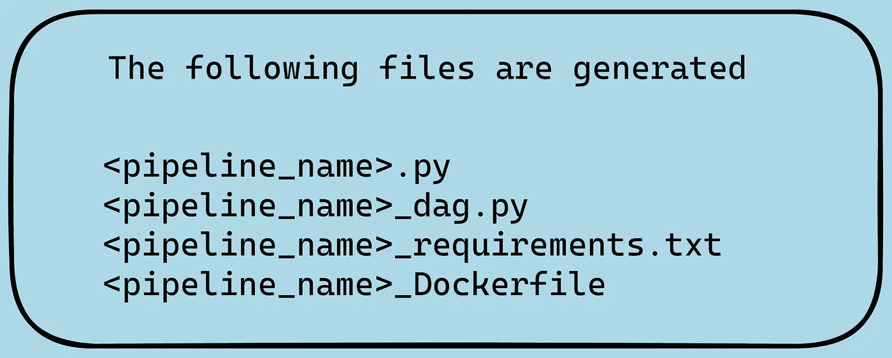

作者图片

在这种情况下，管道名称是 titanic_pipeline。

文件被存储

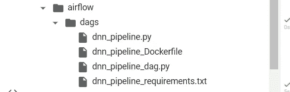

作者图片

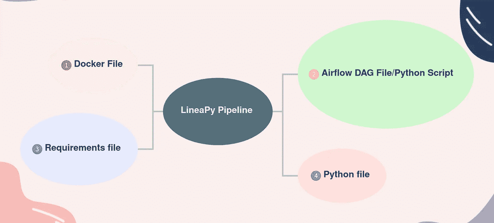

作者图片

需求文件是自动生成的

```
lineapy
matplotlib==3.2.2
numpy==1.21.6
pandas==1.3.5
seaborn==0.11.2
tensorflow==2.8.0
tensorflow.keras==2.8.0
```

dockerfile 文件是在您构建管道时自动生成的。

作者图片

生成气流 dag 文件

作者图片

包含所有数据的 python 文件

作者图片

有关构建管道的更多信息，请查看文档。

要了解更多关于工件商店的信息，请查阅文档。

请查看以下详细信息。此外，还有一些使用 Github 上 Kaggle 的 iris 数据集和房价预测数据集的例子。我在本地用 Google Colab 试了一下。

*   [线性 Github](https://github.com/LineaLabs/lineapy)
*   [线性文件](https://docs.lineapy.org/en/latest/index.html)

## 结论:

LineaPy 包通过使用 2 行代码(save()、get()和 to_pipelinemethods())肯定会帮助 MLOps 团队自动化工作流。也许它可以作为第一次削减，然后进一步修改可以做。我检查了一下，重构代码看起来不错。另外，docker 和 airflow dag 文件看起来也不错。LineaPy 是开源的，要了解更多信息，请查看他们的 GitHub repo。

请在 [Linkedin](https://www.linkedin.com/in/esenthil/) 上免费连接。

## **参考文献:**

1.  ***数据集来源*** :Dua，d .和 Graff，C. (2019)。UCI 机器学习知识库[http://archive . ics . UCI . edu/ml]。加州欧文:加州大学信息与计算机科学学院。
2.  关于直系亲属-[https://lineapy.org/why-lineapy/](https://lineapy.org/why-lineapy/)
3.  线性 Github 回购:[https://github.com/LineaLabs/lineapy](https://github.com/LineaLabs/lineapy)
4.  直系亲属艾-【https://linea.ai/】
5.  Keras 教程:[https://www.tensorflow.org/tutorials/keras/regression](https://www.tensorflow.org/tutorials/keras/regression)