# 线性代数——机器学习的生存工具包

> 原文：<https://towardsdatascience.com/linear-algebra-survival-kit-for-machine-learning-94901a62465e>

## 基本原则

# 线性代数——机器学习的生存工具包

## NumPy 中带有示例的最常见概念的快速参考指南

克里斯汀·沃克在 [Unsplash](https://unsplash.com?utm_source=medium&utm_medium=referral) 上拍摄的照片

L 线性代数通常被认为是数据的数学*和机器学习的基本支柱之一。然而，这是一个广阔的领域，包含着太快掉进兔子洞的危险。*

*在接下来的章节中，我们将介绍一些与机器学习相关的最常见的线性代数概念，以便建立强大的直觉和坚实的基础。我们不仅会讨论基础理论，还会学习如何使用 NumPy 在 python 中实现一些计算。*

> ***免责声明**:这篇文章和所涵盖的主题的唯一目的是提供一个通用的指导方针——一个快速的参考——关于机器学习的相关概念。因此，理论有时只是简单地解释一下，一些概念就被完全回避了。如果有必要，我们总是可以更深入，使用本文作为要涵盖的主题的路线图。*

# *数学对象*

## *标量*

*标量只是一个单一的数字。之所以这样称呼它，是因为它在不改变方向的情况下拉伸或缩放矢量或矩阵。*

*我们可以用 python 中的一个简单变量来表示一个标量。*

## *向量*

*从几何学上来说，我们可以把向量想象成一条线，由大小(长度)和方向来定义。然而，向量的定义不包括它的开始或结束位置。*

*例如，一个向量 v=[1，2]只告诉我们，它在第一个维度上走了一个单位，在第二个维度上走了两个单位。按照惯例，我们通常认为一个向量在*标准位置*——这意味着它的尾部位于原点[0，0]。*

*我们也可以把向量想象成一组数字。这样想可以让我们用 NumPy 表示一个向量，如下所示:*

*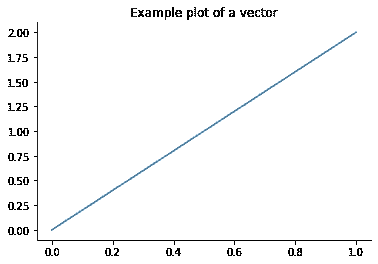*

*向量[1，2]绘制的示例[图片由作者提供]*

## *矩阵*

*矩阵是数字的二维数组。不严格地说，我们也可以把矩阵想象成一组相邻的列向量。*

*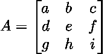*

*假设我们的示例矩阵(A)包含实数值，我们想要描述它的形状。我们可以通过以下方式做到这一点:*

*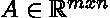*

*其中 *m* 定义了一个矩阵的高度(行),而 *n* 告诉我们一个矩阵的宽度(列)。在我们的例子中， *m* 和 *n* 都等于 3，因此我们有一个 3 乘 3 的矩阵。*

*我们可以使用 NumPy 以多种方式定义一个矩阵，在下面的代码中可以看到一些有用的方法。我们也可以使用`numpy.shape(a)`打印矩阵尺寸*

> ***注**:轴数可变的高维矩阵称为张量。*

*矩阵有多种不同的用途，其中包括:*

1.  *线性变换的表示*
2.  *方程组的表示*
3.  *存储和表示数据(观察 x 特征)*
4.  *存储例如卷积中使用的核*

# *移调*

*转置操作的概念可以被认为如下:*用行交换列，反之亦然。**

*当我们转置一个列向量时，我们得到一个行向量。如果我们转置一个矩阵，我们得到主对角线上的镜像。*

*让我们形象化一些例子来获得更好的理解。*

*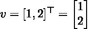*

*一个载体换位的例子。*

*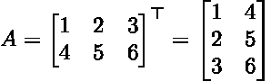*

*一个把 2×3 矩阵转置成 3×2 矩阵的例子。*

*转置操作直接应用于代码中。*

# *矩阵加法*

*矩阵加法相当简单，我们基本上只需将两个矩阵中的每个对应元素相加或相减即可。我们也可以称之为基于元素的操作。然而，我们必须记住的一件事是，两个矩阵需要具有相同的形状。*

*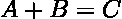**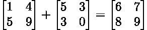*

> ***注意**:我们也可以添加两个向量——概念与矩阵加法相同。*

*在 NumPy 中执行矩阵加法可以通过使用基本算术运算符或函数`numpy.add(a,b)`来完成。*

*我们也可以在矩阵中增加或减少一个标量。标量将简单地按元素相加。*

*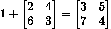*

*在某些情况下，我们允许矩阵向量相加，尽管两个形状并不完全相同。因此，通过*隐式复制*或*广播*，向量将被添加到矩阵的每一行。*

> ***注意**:向量的长度必须与矩阵中的列数相同。否则不能播放。*

# *矩阵和向量相乘*

*现在，我们完成了最重要的运算之一:两个矩阵的乘法。*

*在深入计算细节之前，让我们先了解一些有用的属性:*

*矩阵乘法是*分配的(1)、结合的(2)、*和*不可交换的(3):**

*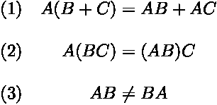*

*为了使矩阵乘法成为有效的运算，必须匹配“内部维度”*【n】*。生成的矩阵将由“外部尺寸”定义 *(m，p)* 。*

*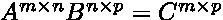*

*让我们想一个例子来更好地理解这一点。*

*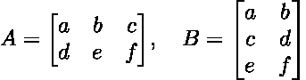*

*矩阵(A)由形状(2×3)定义，而矩阵(B)包含 3 行和 2 列，因此是形状(3×2)。因为“内部维度”匹配，所以定义了矩阵乘法，结果将是一个 2 乘 2 的矩阵。*

*既然我们已经知道了一些基本的性质，以及矩阵乘法何时有效，我们仍然需要知道如何执行计算。*

*我们基本上可以把矩阵乘法想成左矩阵的一个行向量和右矩阵的一个列向量的点积。我们可以将该机制形象化如下:*

*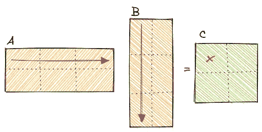*

*矩阵乘法可视化[图片由作者提供]*

*让我们通过一个数字例子来加深我们的理解。*

*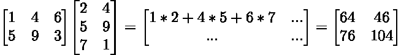*

> ***注意**:矩阵乘法不是按元素执行的。这种操作被称为[哈达玛乘积](https://en.wikipedia.org/wiki/Hadamard_product_(matrices))，通常被称为⨀ B*

*矩阵乘法可以通过内置的 NumPy 函数以多种方式执行，如下面的代码示例所示。*

*矩阵向量乘法也被定义并遵循相同的概念，允许我们以更紧凑的方式表示方程组。*

*以下面的等式为例*

*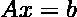*

*它可以被重写为多个方程，但是不那么密集和优雅。*

*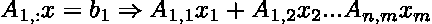*

# *逆矩阵和单位矩阵*

*矩阵的逆矩阵允许我们解出方程 *Ax = b* 解析解 *x.* 但是首先，我们需要知道什么是单位矩阵。*

*单位矩阵不会通过乘法来改变向量或矩阵。主对角线上的元素只有 1，而非对角线上的元素只有 0。此外，单位矩阵始终是正方形 *(MxM)* 。*

*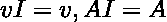*

*可视化一个 2 乘 2 的单位矩阵，我们得到如下结果:*

*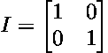*

*另一方面，矩阵的逆矩阵是一个矩阵，当与原始矩阵相乘时，产生单位矩阵。*

*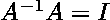*

*由于矩阵除法不存在，我们现在可以使用矩阵求逆来求解我们的方程 *x* 。*

*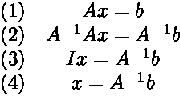*

> ***注意**:我们只能使用矩阵的逆矩阵，如果它被定义的话。对于一个有逆矩阵的矩阵，它必须是平方的和满秩的。*

*我们可以利用 NumPy 的内置函数来创建任意大小的单位矩阵，并计算矩阵的逆矩阵。*

# *线性相关性和跨度*

*在上一节中，我们计算了矩阵的逆矩阵，以求解 *x* 的 *Ax=b* 。*

*为了定义矩阵的逆矩阵，每个 *b 必须正好有一个解。然而*该方程也可能没有或定义了多个解。*

*如果我们把矩阵(A)的列想象成空间中不同的方向，我们可以算出有多少种方法可以到达 *b* 。我们例子中的向量(x)定义了我们在每个方向上要走多远。*

*一组向量的跨度——矩阵(A)的列——定义了可通过线性组合 *Ax 获得的所有点。*因此询问 *Ax=b* 是否有解，基本上与询问 *b* 是否在跨度内是一回事。向量所跨越的子空间称为列空间。*

*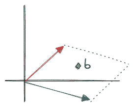*

*两个向量跨度的例子[图片由作者提供]*

*现在，想象其中一个向量是另一个向量的线性组合，从而形成一条直线。如果 *b* 正好位于那条线上，则生成的子空间现在减少到一维，并且 *Ax=b* 只有一个解。如果 *b* 不在那条线上，我们就没有办法到达它。*

*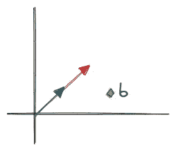*

*两个线性相关向量的例子[图片由作者提供]*

*如果一组向量中至少有一个向量可以表示为其他向量的线性组合，那么这组向量就是线性相关的——这正是我们在例子中所得到的。*

*另一方面，线性无关是完全相反的——没有一个向量可以用其他向量的线性组合来表示。*

# *规范*

*不严格地说，范数衡量的是向量的大小或长度。更正式地说，范数可以被解释为将向量映射到非负值的函数。*

*一种常用的范数是欧几里德或ℓ2 范数:*

*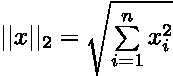*

*其他有用规范的例子包括ℓ1 规范、ℓ∞规范或弗罗贝纽斯规范。*

*在代码中，我们可以使用函数`[numpy.linalg.norm()](https://numpy.org/doc/stable/reference/generated/numpy.linalg.norm.html)`并通过参数`ord=None`指定范数的阶数*

> ***注**:默认情况下，我们会计算矩阵的弗罗贝纽斯范数和向量的ℓ2 范数。*

# *特殊矩阵和向量*

*有些矩阵的元素或形状是特殊的，因此特别有用。*

*除了主对角线上的元素，对角矩阵只包含零。*

*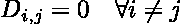*

*当我们学习单位矩阵时，我们已经遇到了对角矩阵。*

**

*对角矩阵是有用的，因为它们计算效率高。例如，为了计算逆，我们只需要计算主对角线的倒数。*

*我们可以通过指定一个向量来构建一个对角矩阵，并简单地应用函数`numpy.diag(v)`*

*对称矩阵是任何与其转置矩阵相等的矩阵，这意味着*

*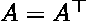*

*我们可以考虑一个矩阵示例，如下所示:*

*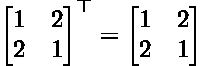*

*让我们假设我们有一个矢量 *v* 和一个矢量*w。*现在想象这两个矢量运行在不同的方向——事实上，它们是垂直的，角度为 90°。那些向量也可以被称为*正交的*——如果两个向量都有单位范数，长度为 1，则它们被称为*正交的*。*

*另一方面，正交矩阵是行和列相互正交的正方形矩阵。这意味着两个有用的属性*

*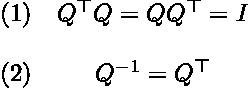*

*正交矩阵是有趣的，因为它允许我们非常便宜和有效地计算逆矩阵，因为它是由其转置定义的。*

# *特征分解*

*分解或者不严格地说，将一个数学对象分解开来，有时可以让我们通过揭示不明显的属性来更好地理解它。*

*特征分解将矩阵分解成特征值和特征向量。对于旋转不变的特征向量向我们显示了矩阵的方向，而特征值是比例因子，描述了特征向量的大小。*

*  

我们可以借助内置的 NumPy 函数来检索特征值和特征向量。为了重构原始矩阵，我们只需要计算特征向量、对角化的特征值和特征向量的逆的乘积。

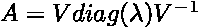

特征分解是有用的，因为它是主成分分析中的关键元素。

  

# 奇异值分解

奇异值分解(SVD)和特征分解密切相关，因为在这两种情况下，我们分解或因式分解矩阵。

然而，奇异值分解具有更广泛的适用性。例如，如果矩阵不是正方形的，则不定义特征分解，而仍然可以应用 SVD。

奇异值分解将矩阵分解成奇异值和奇异向量。应用时，我们将单个矩阵分解为三个特殊矩阵的乘积。

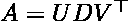

矩阵(U)和(V)都是正交的，并且分别包含左奇异向量和右奇异向量。矩阵(D)是对角矩阵，包含主对角线上的奇异值。

SVD 是有用的，因为它允许我们比特征分解更普遍地应用矩阵分解，并且它还使我们能够部分地将矩阵求逆推广到非方矩阵。

我们可以依靠使用`[numpy.linalg.svd(a)](https://numpy.org/doc/stable/reference/generated/numpy.linalg.svd.html)`来应用 SVD。

# Moore-Penrose 伪逆

没有为非方阵定义矩阵逆矩阵。然而，Moore-Penrose 伪逆允许我们计算或近似高且宽的矩阵的逆。

当计算伪逆时，实际算法依赖于 SVD。

上面的等式应该看起来很熟悉，因为它检索与 SVD 相同的三个矩阵，对角矩阵(D)的伪逆是通过计算非零元素的倒数并对结果矩阵进行转置获得的。

在代码中，我们可以简单地利用 NumPy 函数来计算伪逆。由于矩阵与逆矩阵相乘应该产生单位矩阵，我们可以用这个事实来检查我们的结果。

# 跟踪运算符

一个矩阵的所有对角线元素的和可以通过追踪算子来计算。

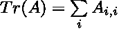

trace 运算符很有用，因为它允许更简单的符号。例如，Frobenius 范数可以使用 trace 运算符表示如下:

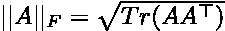

假设，我们有一个 5x 5 的单位矩阵。所有对角线元素的总和应该等于 5，并且可以使用 NumPy 来计算，正如我们在下面的代码示例中看到的。

# 行列式

行列式基本上是将矩阵映射到标量的函数，由所有特征值的乘积定义。

它在几何学上也可以分别解释为面积或体积。不严格地说，行列式给出了一个度量，即乘以一个矩阵可以扩大或缩小多少空间。

  

可以使用内置的 NumPy 函数`[numpy.linalg.det(a)](https://numpy.org/doc/stable/reference/generated/numpy.linalg.det.html)`计算行列式

# 结论

在这篇文章中，我们试图涵盖很多内容。我们简要概述了与机器学习相关的一些最常见的线性代数概念背后的理论。此外，在 NumPy 的帮助下，我们已经用 python 实现了大多数概念。

我们的目标是提供一个通用的指南和一个重要主题的简要概述。因此，我们要么必须完全回避，要么只能触及线性代数的某些方面。

然而，手头的这篇文章应该为我们提供建立第一直觉的方法，并有一个主题路线图，我们可以在必要时进一步探索。

当我们在实践中学习、应用和实现机器学习算法时，理解线性代数的基础和良好的直觉将被证明是非常宝贵的。

> 感谢您的阅读！确保保持联系&在 [Medium](https://medium.com/@marvinlanhenke) 、 [Kaggle](https://www.kaggle.com/mlanhenke) 上关注我，或者在 [LinkedIn](https://www.linkedin.com/in/marvin-lanhenke-11b902211/) 上说声“嗨”

喜欢这篇文章吗？成为 [*中等会员*](https://medium.com/@marvinlanhenke/membership) *继续无限学习。如果你使用下面的链接，我会收到你的一部分会员费，不需要你额外付费。*

  

**参考资料/更多资料:**

*   深度学习(Ian J. Goodfellow，Yoshua Bengio 和 Aaron 库维尔)，第二章，麻省理工学院出版社，2016 年。
*   迈克·科恩博士。线性代数:理论，直觉，代码。*