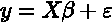
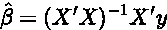
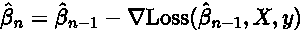
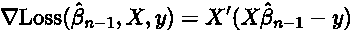
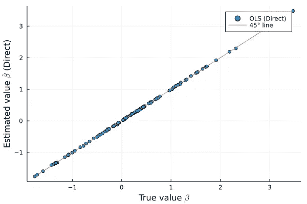
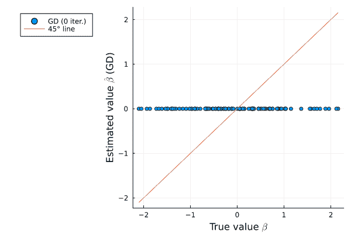
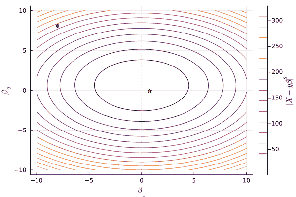
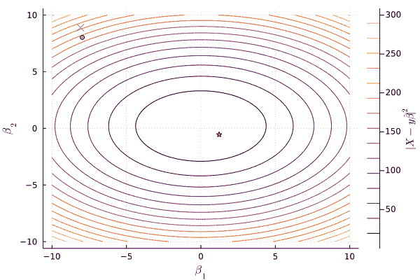

# 线性模型机器学习方式

> 原文：<https://towardsdatascience.com/linear-model-the-machine-learning-way-c33f9db9ac37>

## 当机器学习遇到计量经济学，反之亦然

照片由 [**詹姆斯·惠勒**](https://www.pexels.com/@souvenirpixels?utm_content=attributionCopyText&utm_medium=referral&utm_source=pexels) 发自 [**Pexels**](https://www.pexels.com/photo/photo-of-pathway-surrounded-by-fir-trees-1578750/?utm_content=attributionCopyText&utm_medium=referral&utm_source=pexels)

# 动机

**普通最小二乘模型(OLS)是机器学习(ML)的核心构建模块。OLS 在社会科学中也随处可见。我有经济学背景，最初我对 ML 教科书解决 OLS 问题的方式有点困惑。在这篇博文中，我解释了经济学方法和 ML 方法，以及为什么两者都有意义。**

**TL；DR:在高维设置中，不要求一个巨大矩阵的逆，用梯度下降。**

—

# 一.理论

## 经济学之路

让我们考虑一个简单的线性模型的形式:

其中 y 是因变量的向量；x 列中包含独立变量的矩阵；β是我们想知道的向量。和 e 是随机噪声项。**线性模型的 OLS 估计器在于最小化数据和(线性)模型之间的均方误差**。就不告诉你数学细节了。底线是这个问题有一个精确的公式。OLS 估计量为:

“经济学方法”在于直接使用这个公式，做这个看似无害的矩阵求逆。从理论的角度来看，这个公式是惊人的，因为我们可以用它来推导 OLS 的理论性质。我们也可以用这个公式来计算β的 OLS 估计量的置信区间。

此外，请注意，在社会科学应用程序中，没有人真正关心您如何获得 beta。人们对β系数的符号更感兴趣。例如，以β的第一个系数为例，它不是截距。我们称这个系数为β_ 1。然后，如果 y 和 x_1 都以水平表示，那么 x_1 增加一个单位会导致 y 增加一个β_ 1。线性模型被用作调查 x 和 y 之间因果关系的工具。线性模型能够预测未来结果的程度不是最终目标。

## 机器学习的方式

ML 方法在于使用递归算法来求解β。为什么不直接使用上面描述的可爱公式来计算β的估计值呢？**症结在于 X’X 的矩阵求逆。**虽然对“小”数据集(没有太多解释变量和/或观察值)可行，但 X’X 的直接求逆可能会使您的笔记本电脑崩溃，或者在处理数千个解释变量和/或数十亿个观察值时速度非常慢。

ML 的方式是用[渐变下降](https://en.wikipedia.org/wiki/Gradient_descent) (GD)。GD 的想法很直观**。**f 在给定点的梯度告诉我们 f 在该点最大增加的方向。因此，向相反的方向移动(减去梯度)可能是找到局部最小值的好主意。

GD 算法重复应用这个过程，直到找到最小值(希望是全局的)。从β的初始猜测开始，使用以下公式更新猜测:

其中α是一个小值(“学习率”)，右手边的最后一项是使用当前对β的猜测时损失函数的梯度。这里损失函数的梯度简单地是:

# 二。应用

现在让我们使用模拟数据来比较这两种方法。我使用模拟数据，因为它允许我直接比较β的估计值和真实值。我使用 Julia，它是一种在科学计算应用中日益流行的“快速 Python”。

## 经济学之路

在下面的代码块中，我定义了一些模拟数据，并固定了一个要估计的随机系数β。按照“经济学方法”，对β的估计是一个简单的矩阵求逆。如图所示，β中的所有系数都位于 45 度线上，表明 OLS 公式有效。到目前为止还没什么大惊喜。

Julia 线性模型:矩阵求逆

作者图片:(X'X)^-1X'y 在行动

## 机器学习的方式

现在我们切换到机器学习的方式。在下面的代码块中，我对 50 次迭代应用梯度下降，并绘制估计的β与真实的β。最初，因为我以随机猜测开始这个过程，所以真实值和估计值是正交的，如蓝色水平线所示。随着迭代方案向前推进，点云开始逆时针旋转。**经过 50 次迭代，所有点都极其接近 45 度线，说明我们找到了一个非常接近真值的值。**

带 Julia 的线性模型:梯度下降 100d

图片作者:梯度下降 100d 案例

如果我们把注意力限制在二维情况，另一种可视化是可能的。我们可以为梯度下降的每一步绘制β估计的坐标。下面的代码块可以做到这一点。如下图所示，在每次迭代中，beta 的估计值越来越接近真实值(小星号)。

带有 Julia 的线性模型:梯度下降 2d

作者图片:梯度下降 2d 案例

## “真正的”机器学习方式

在上一节中，样本中的所有观察值都用于计算梯度。对于非常大的数据集，计算梯度可能不可行(或者因为相关成本而不可取)。“真正的”机器学习方法在于仅使用观察值的子集来计算每一步的梯度。下面的代码块实现了这个想法。如下图所示，β使用随机梯度下降的路径用十字表示。不是非常平滑地下降到真实值，而是十字所选择的路径更加“模糊”。然而，模糊路径收敛到真实值。

带 Julia 的线性模型:随机梯度下降 2d

作者图片:SGD 与 GD 算法

# 结论

OLS 分析公式是推导理论属性的黄金标准，在处理合理大小的数据时非常好。在大数据环境中，梯度下降是必由之路。如果你接受过经济学培训，这篇博文可以被看作是对机器学习中使用的一些工具的温和介绍。如果你接受过机器学习的培训，我希望这篇文章能帮助你理解社会科学领域的人们是如何使用线性模型的。