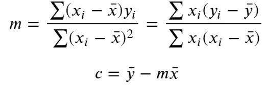
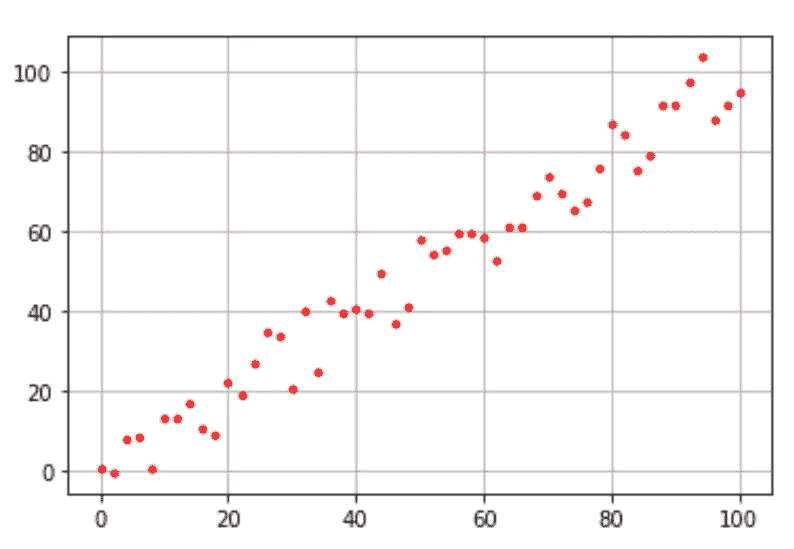
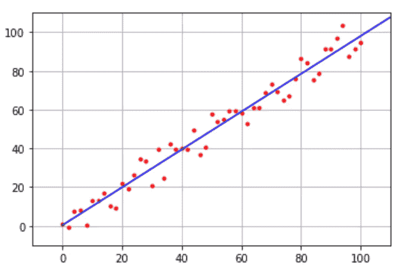
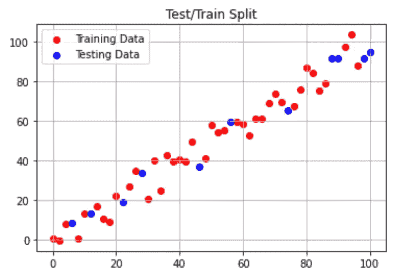
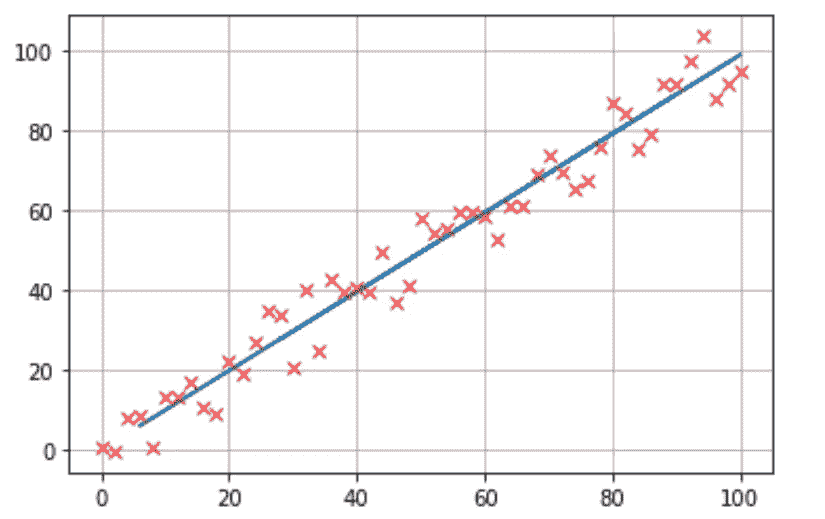
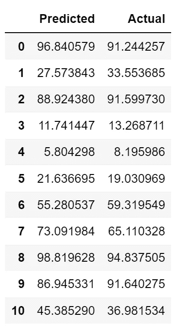
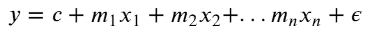

# Python 中的线性回归基础

> 原文：<https://towardsdatascience.com/linear-regression-in-python-for-data-scientists-16caef003012>

## UCL 数据科学学会研讨会 10:什么是线性回归、数据探索、Scikit 学习实施和多元线性回归


艾萨克·史密斯在 [Unsplash](https://unsplash.com?utm_source=medium&utm_medium=referral) 上拍摄的照片

今年，作为 UCL 数据科学协会的科学负责人，该协会的目标是在整个学年举办一系列 20 场研讨会，涵盖的主题包括 Python、数据科学家工具包和机器学习方法的介绍。每一篇文章的目标都是创建一系列的小博客，这些小博客将概述要点，并为任何希望跟进的人提供完整研讨会的链接。所有这些都可以在我们的 [GitHub](https://github.com/UCL-DSS) 资源库中找到，该资源库将在全年更新新的研讨会和挑战。

本系列的第十次研讨会介绍了 Python 中的线性回归，并介绍了我们的数据科学与 Python 研讨会系列。这个特定的研讨会将涵盖什么是线性回归，探索数据，实施模型和模型评估。虽然亮点将在这篇博文中呈现，但完整的研讨会可以在我们的 GitHub 账户[这里](https://github.com/UCL-DSS/linear-regression-workshop)找到。

如果您错过了我们之前的任何研讨会，可以在这里找到:

[](/an-introduction-to-sql-for-data-scientists-e3bb539decdf)  [](/git-and-github-basics-for-data-scientists-b9fd96f8a02a)  [](/an-introduction-to-plotting-with-matplotlib-in-python-6d983b9ba081)  

# 什么是线性回归？

线性回归是一种统计方法，用于模拟两个或更多数量之间的相关性或关系。这样做的目的是能够更好地理解现有的关系，或者能够预测我们目前没有数据的点的行为。

对于一组数据点 x 和 y，我们可以将我们要建模的线的方程写成:

> *y(x) = mx + c*

其中 y(x)是模型的预测 y 值，梯度(m)和 y 截距(c)称为拟合参数。通过使用线性回归方法(也称为最小二乘拟合)，我们可以计算两个参数的值，并绘制最佳拟合线，以实现我们更好地理解关系或找到未知点的估计值的目标。

为此，我们必须能够计算斜率(m)和截距(c ),以给出数据的最佳拟合线。我们可以通过以下等式来实现:



作者图片

其中 x 和 y 代表数据的平均值。然而，这通过已经实现的库变得简单，例如 Scikit-Learn 和 Statsmodels Api，它们具有内置的线性回归功能。我们将首先展示如何在 Python 中实现这些公式，然后展示如何使用 Scikit Learn 库执行更复杂的分析。

# 数据探索

我们拥有的数据是一个生成的数据集，我们首先只关注 X 和 Y 两个变量来执行简单的线性回归。我们可以使用以下代码绘制数据，以了解我们可能期望看到的关系:

```
# Generates data frame from csv file
df = pd.read_csv("RegressionData.csv")# Turning the columns into arrays
x = df["x"].values
y = df["y"].values# Plots the graph from the above data
plt.figure()
plt.grid(True)
plt.plot(x,y,'r.')
```



作者图片

我们可以看到，X 和 Y 变量显示了一种关系，Y 变量似乎随着 X 的变化而线性变化。这意味着我们可以尝试用线性拟合来模拟，所以我们可以用线性回归。

为此，我们可以使用上面详述的等式，尝试根据数据计算梯度和 y 轴截距，如下所示:

```
# calculating the means of the x and y data
mean_x = np.mean(x) 
mean_y = np.mean(y)# calculating the slope
slope = np.sum((y - mean_y)*x) / np.sum((x - mean_x)*x) 
print ("Gradient:", slope)# calculating the intercept
intercept = mean_y - slope*mean_x 
print ("Intercept", intercept)#out:
Gradient: 0.9773554490236186
Intercept 0.33323427076670953
```

然后我们可以用它来绘制数据的最佳拟合线:

```
x_max = max(x)
plt.figure("") # start a new figure
plt.grid(True) # add a grid
# generate two points for the fitted line
x_points = np.linspace(0, x_max*2., 2) 
y_points = slope*x_points + intercept
plt.plot(x, y,'r.') # plotting data as points
plt.line = plt.plot(x_points, y_points, 'b-') #plotting the line of best fit
# setting limits for the axes
plt.xlim(-10,110) 
plt.ylim(-10,110)
```



作者图片

由此我们可以看到我们在第一个数据图中确定的预期线性关系。我们还可以看到，截距约为 0.3，斜率接近 1，几乎是单位线性关系。

# Scikit 学习实现

然而，更有效和有用的方法是使用 Python 的 Scikit 学习库，该库具有更深入评估线性回归的广泛功能。虽然我们已经计算了梯度`m`和截距`c`，但是我们可以使用 Scikit Learn 来完成这项工作，然后使用这个库来评估模型性能。

首先，我们需要为模型准备数据。为此，我们可以将模型从当前格式重新调整为数组，然后将数据拆分为训练和测试数据集。我们这样做的原因是，我们可以看到我们的模型如何适应看不见的数据，而不是让它过度适应我们所有的数据。我们可以用下面的代码做到这一点，并想象它是什么样子:

```
# Independant variable or features
X = x.reshape(-1,1)# Dependant variable or labels
y = y.reshape(-1,1)# Seperates the data into test and training sets 
X_train, X_test, y_train, y_test = train_test_split(X, y, test_size = 0.2)# Plotting the training and testing splits
plt.scatter(X_train, y_train, label = "Training Data", color = 'r')
plt.scatter(X_test, y_test, label = "Testing Data", color = 'b')
plt.legend()
plt.grid("True")
plt.title("Test/Train Split")
plt.show()
```



作者图片

这表明，我们已经将大部分数据(80%)作为模型将要训练的数据，同时保留了可用于评估模型性能的少数数据(20%)。我们在这里可以看到，测试数据虽然很小，但覆盖了大范围的整体数据，因此可以作为很好的测试数据来查看模型的表现。

既然我们已经将数据分为测试和训练数据集，我们就可以实现线性回归模型了。为了通过 Scikit Learn 实现线性回归，我们首先通过调用`LinearRegression`函数来定义一个`regressor`变量。然后我们传递`regressor.fit(X_train, y_train)`，它将训练数据传递给回归，以便训练它。

```
# Defining our regressor
regressor = LinearRegression()# Train the regressor
fit = regressor.fit(X_train, y_train)
```

和以前一样，我们感兴趣的是从我们的数据中提取的梯度和截距，我们可以通过调用我们训练的回归对象的属性`.coef_`和`.intercept_`来提取这些数据。由此我们可以得到:

```
# Returns gradient and intercept
print("Gradient:",fit.coef_)
print("Intercept:",fit.intercept_)#out
Gradient: [[0.98952479]]
Intercept: [-0.1328508]
```

我们可以看到，虽然梯度与之前的相似，但截距不同。这主要是因为我们将数据分成了训练数据和测试数据，因此我们不是在处理整个数据集。

这意味着我们可以根据我们的测试数据来评估我们的模型，看看它的表现如何。为此，像以前一样，我们想提取最佳拟合线，现在我们可以使用`regressor.predict(X_test)`方法，而不是像以前一样计算直线。这意味着我们可以这样实现:

```
# Predicted values 
y_pred = regressor.predict(X_test)# Plot of the data with the line of best fit
plt.plot(X_test,y_pred)
plt.plot(x,y, "rx")
plt.grid(True)
```



作者图片

然后，通过创建一个数据框架，将预测值与实际测试结果进行比较，如下所示:

```
# Converts predicted values and test values to a data frame
df = pd.DataFrame({"Predicted": y_pred[:,0], "Actual": y_test[:,0]})
df
```



作者图片

然后我们可以通过传递`regressor.score(X_test, y_test)`为我们的模型提供一个分数。正如我们之前提到的，这是回归器没有训练过的数据，这意味着它可以为模型在数据本身上的表现提供良好的基础。这是 R 分数，它显示了模型捕获的目标变量的变化量。这方面的最佳得分为 1，其中大于 0.8 通常被视为模型拟合良好的指标，而 0 则被视为最差的性能。

对于我们当前的模型，结果如下所示:

```
# Determines a score for our model
score = regressor.score(X_test, y_test)
print(score)#out:
0.9763002831471521
```

这表明我们有一个很好的模型。

# Scikit 学习多元线性回归

我们上面使用的例子只涉及两个变量，这在我们自己的代码中相对容易实现，但在现实世界中，单独测量或使用一个特征或独立变量是极不可能的。这使得实现和等式更加复杂，因此我们可以依靠 Scikit 了解更多来实现这一点。

我们有多个独立变量的新方程采用以下形式



这意味着实际上我们有多个梯度值，还有一个额外的𝜖项，这就是误差。实际上，𝜖考虑了任何可能不适合线性模型的潜在点。

为此，我们使用生成的广告数据及其对销售的影响。这里，自变量由`TV`、`Radio`和`Newspaper`列给出，而`Sales`是我们的自变量。这方面的数据如下:

```
# Converts advertising csv to a data frame
df = pd.read_csv("advertising.csv")
df
```


作者图片

然后在 Scikit Learn library 下应用线性回归算法的过程采取了类似的路径，我们获取 X 和 Y 变量，对其进行整形，分成训练和测试数据，实施模型，预测未知数据，然后提取分数。这都可以通过以下方式实现:

```
# Independent variables
X = df.drop("Sales",axis=1)# Dependent variable
y = df["Sales"].values.reshape(-1,1)# Splitting into test and training data
X_train, X_test, y_train, y_test = train_test_split(X,y,test_size=0.2)# Defining regressor
regressor = LinearRegression()# Training our regressor
fit = regressor.fit(X_train,y_train)# Predicting values
y_pred = fit.predict(X_test)# Scoring our regressor
fit.score(X_test,y_test)#out:
0.9174440089730509
```

我们可以看到，我们的模型通常与我们拥有的数据非常吻合，得分为 0.917，实施相对简单。

当然，我们可以创建一个更复杂的模型，并通过使用 Scikit Learn 库中内置的其他指标或评估方法以更详细的方式对其进行评估，更多信息可在此处找到。此外，除了 Scikit Learn 之外，您还可以使用 Statsmodels Api 库，该库为您内置的回归实现提供了更详细的摘要，可用于评估您的模型，其实现可在[此处](https://www.statsmodels.org/stable/regression.html)找到。

如果您想了解我们协会的更多信息，请随时关注我们的社交网站:

https://www.facebook.com/ucldata[脸书](https://www.facebook.com/ucldata)

insta gram:[https://www.instagram.com/ucl.datasci/](https://www.instagram.com/ucl.datasci/)

领英:[https://www.linkedin.com/company/ucldata/](https://www.linkedin.com/company/ucldata/)

如果你想了解 UCL 数据科学协会和其他优秀作者的最新信息，请使用我下面的推荐代码注册 medium。

[](https://philip-wilkinson.medium.com/membership)  

或者看看我写的其他故事:

[](/bias-and-variance-for-machine-learning-in-3-minutes-4e5770e4bf1b)  [](/an-introduction-to-object-oriented-programming-for-data-scientists-879106d90d89)  [](/univariate-outlier-detection-in-python-40b621295bc5) 