# 线性回归与逻辑回归:区别在哪里？

> 原文：<https://towardsdatascience.com/linear-regression-vs-logistic-regression-ols-maximum-likelihood-estimation-gradient-descent-bcfac2c7b8e4>

## 成本函数、普通最小二乘法(OLS)、梯度下降法(GD)和最大似然估计法(MLE)方面的差异。

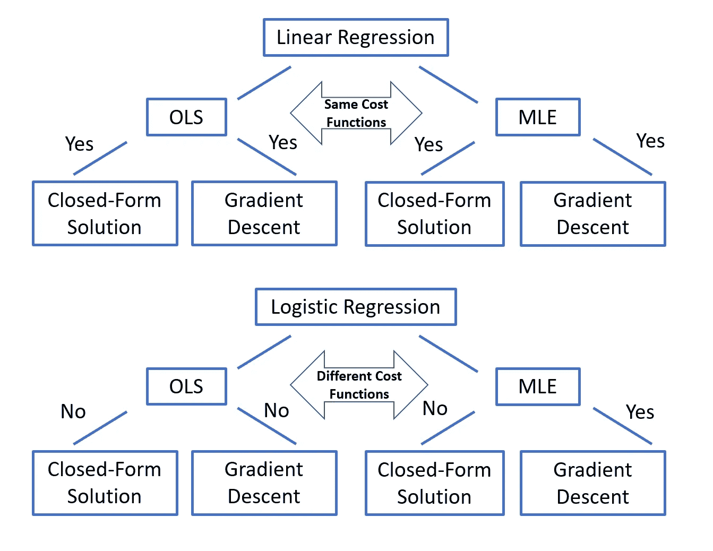

路线图(图片由作者提供)

在本文中，我将介绍统计模型开发的路线图。具体来说，我们将讨论**线性回归**与**逻辑回归**的发展有何不同。我们还将讨论为什么一些方法在一个模型中有效，而在另一个模型中无效。以下是该路线图的概述。

**第一步**:设计一个**模型**，解释响应变量和解释变量之间的关系

*   **回归**模型:响应变量为**连续**。
*   **分类**模型:响应变量为**分类**。

**第二步**:开发一个**成本函数**(又名**损失函数**)来确定这个模型对一组给定数据的解释有多好

*   根据普通最小二乘法( **OLS** )开发一个成本函数
*   根据最大似然估计开发一个成本函数

**第三步**:寻找**最佳参数**，解决**关于代价函数的优化问题**

*   解析方法:如果优化问题可以解析求解，则找到一个**闭合解**
*   数值逼近法:使用**梯度下降**迭代求解

## 如何在线性回归中应用普通最小二乘法(OLS)？

首先，我们用下面的数据来谈谈线性回归。目标是开发一个模型来解释作为连续变量的响应变量(即 Y)和解释变量(即 X)之间的关系。

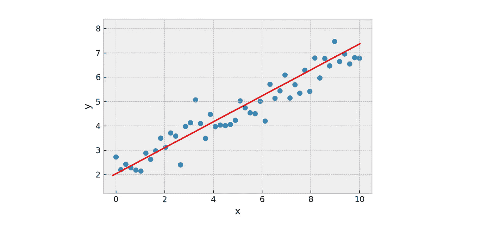

作者图片

**步骤 1** :基于 Y 和 X 之间的线性关系，一个线性方程，如下所示，将是一个合适的模型。

等式 1

参数(β0，β1)是通常未知的固定值，因为很难从总体中收集所有数据点。因此，我们使用从样本计算的 OLS 估计量(β̂0，β̂1)来估计总体参数(β0，β1)。

误差项 **ε** 是一个随机变量，它用每个点到拟合直线的距离来解释误差。误差项的值可以是正的也可以是负的。总体来说ε 需要有一个 0 的**均值，可以用截距(即β0)来实现。ε**不是**需要有一个**正态分布**与 OLS 产生一个无偏模型。**

> 然而，**正态假设**允许我们进行统计**假设检验。**估计值(例如，β̂0、β̂1)可以写成ε的线性组合([参见此处](/are-ols-estimators-normally-distributed-in-a-linear-regression-model-89b688fa8dc3)的更多细节)，假设ε呈正态分布，则意味着估计值也呈正态分布。因此，正态假设将为预测和估计生成可靠的置信区间。

**第二步**:我们想出一个成本函数，它将量化*这个建议模型有多好。对于线性回归模型，我们找到和的最佳估计，使得易和之间的距离之和，其中= β̂1Xi + β̂0，是最小化的**。通常，在成本函数中使用**二次距离**。我们可以用下面的等式来总结。*

**

*等式 2*

## *如何在线性回归中应用最大似然估计？*

*上面的代价函数是我们能为线性回归设计的唯一函数吗？答案是否定的。或者，我们可以根据**最大似然估计** (MLE)得出一个不同版本的成本函数。*

*MLE 是一种在给定观测数据的情况下估计模型参数的常用方法。在假设的统计模型下，我们可以通过最大化观察一组给定数据的可能性来找到最佳参数。*

*第一步:我们将从与 OLS 相同的线性模型开始(等式 1)。这里唯一的修改是我们需要**对最大似然估计的误差项施加正态假设**，因为我们需要假设数据的分布来计算可能性。*

**

*等式 3*

***第 2 步**:相反，我们可以提出一个不同版本的成本函数，它将量化*在给定解释变量(例如 X)的情况下，在建议的模型*下我们观察到结果变量(例如 Y)的可能性有多大。我们希望找到最佳参数，β̂ 1 和β̂ 0，这样观察我们数据的可能性**最大化**。*

*让我们首先将等式 3 改写为 X 和 y 的每个观测值的条件分布。换句话说，每个 Yi 都来自正态分布，对于给定的 Xi，其均值为β1Xi + β0，标准差为σ。*

**

*接下来，我们根据正态分布定义了观察易给定的似然函数。*

*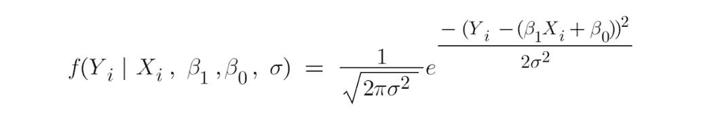*

*每个点 I 都是**独立且**同分布(iid)的，所以我们可以把观测所有点的似然函数写成每个个体概率密度的**乘积**。*

*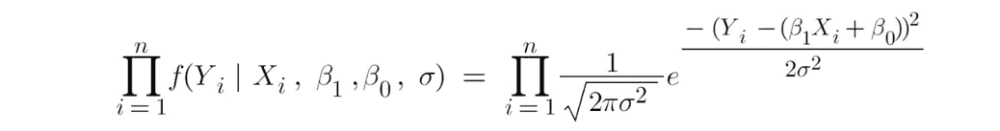*

*这就是**似然函数**。通常，我们会将其转换为一个**对数似然函数**，因为最大化似然函数相当于最大化对数似然函数，而对数似然函数在数学上更容易处理。*

*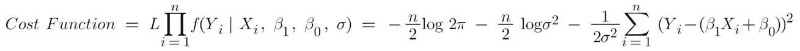*

*等式 4*

*在等式 4 中，你会注意到圈起来的项都是常量**值**并且在求和前面有一个**负号**。*

*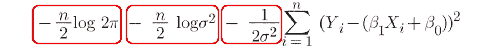*

> ***因此，最大化对数似然函数在数学上等价于最小化 OLS 的成本函数**(见等式 2) **。***

*多酷啊！我们从关于 OLS 和最大似然估计的完全不同的想法开始，以线性回归模型的**相同的成本函数**结束。*

## *第三步:如何使用封闭形式的公式最小化线性回归的成本函数？*

*寻找最小化或最大化一个函数的值的过程称为**优化**。对于机器学习的任何优化问题，你可以用**分析方法**或**数值近似方法**来处理。*

*分析方法是**确定性的，**这意味着有一个**封闭形式的解决方案**来解决优化问题。可以写下**精确**解的数学表达式。*

> *然而，在统计建模中很难获得**封闭形式的解决方案**。线性回归是极少数情况之一。*

*如果最优化问题是一个线性方程，应该有一个解析解。我们应该可以用一点点**微积分**推导出公式。*

*为了找到一个函数的最大值或最小值，我们可以对每个参数求导，并将它们设为 0。解方程会给我们最好的参数。*

*让我们推导公式。*

*我们的成本函数是误差平方和。*

**

*我们对β̂0 求导，设为 0。*

*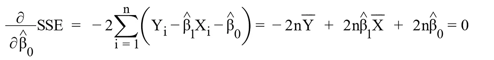*

*解上面的方程，我们得到*

**

*等式 5*

*现在对β1 求导，用等式 5 代替β0，并将其设为 0。*

*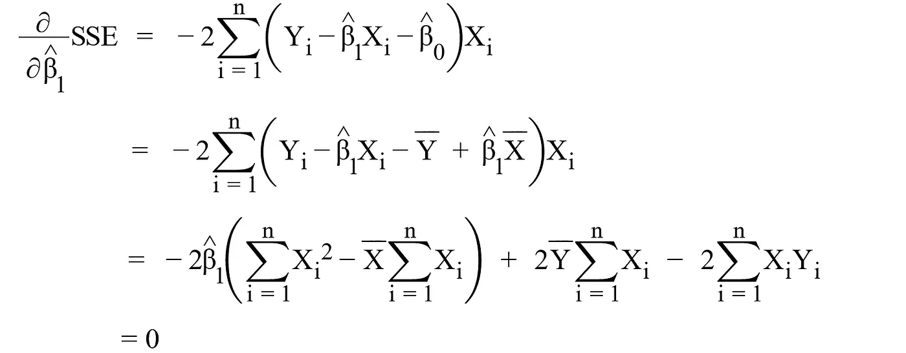*

*解上面的方程，我们得到*

**

*现在我们可以应用一些代数技巧来改写分子和分母，这很容易证明。*

**

*从β1 和β0 的公式中可以看出。对于给定的数据集，我们很可能有一个线性模型的封闭形式的解决方案。我们也可以做**矩阵形式的所有代数。**你可以在这里找到它的衍生[。](https://web.stanford.edu/~mrosenfe/soc_meth_proj3/matrix_OLS_NYU_notes.pdf)*

**

> *请记住，**多元线性回归**的封闭解有时会有问题，其中有多个解释变量(例如，X1、X2、X3 等)，因为逆矩阵仅在 X 具有**满秩**时存在，这意味着如果存在**完美多重共线性**，它就不会有封闭解。为了防止这种情况，我们需要在线性模型中排除这些变量。*

## *第三步:如何利用梯度下降最小化代价函数？*

*我们已经讨论了线性回归的解析解。接下来说一个**数值逼近法**，叫做**梯度下降**，解决优化问题。*

*在数学上，梯度下降法是一种**一阶迭代**优化算法，用于寻找可微函数的局部极小值。典型的梯度下降遵循下列步骤。*

1.  *最初，我们可以让β1 和β0 为任意值(例如，β1 = 0 和β0 = 0)。设 **L** 为**学习率**。l 确定我们将应用于更新参数的变化的**幅度**。学习率越大，代价函数越快接近最小值。如果 L 太大，你的优化器将会越过“曲线”，错过最小点。相反，如果 L 太小，将需要很长时间才能达到最小值。因此，我们需要有策略地设定学习速度。*
2.  *计算关于每个参数的成本函数的**偏导数**(我已经在上面讨论过了)。将β1，β0，，Yi 的值插入每个偏导数中，并计算它们的值。导数值将决定这些参数变化的方向。*
3.  *使用以下公式更新参数*

*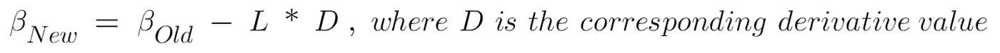*

*4.重复步骤 2 和 3，直到参数停止变化或导数值足够接近零。*

*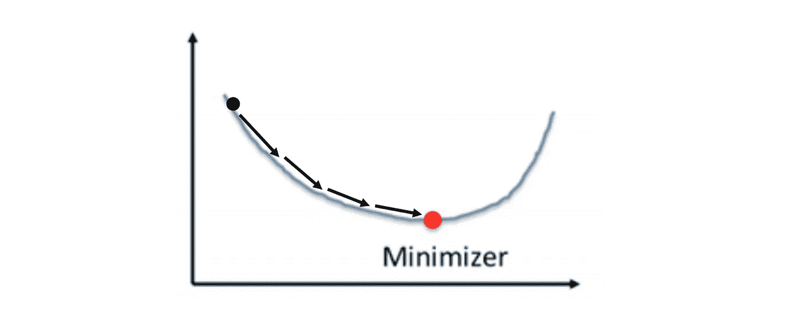*

*作者图片*

> *请记住，如果在线性回归模型中有效，分析方法会给我们**精确解**。然而，梯度下降只能给出一个**非常接近**精确解的解。幸运的是，在大多数情况下，我们无法注意到这些差异。*

***梯度下降**是机器学习中解决优化问题的流行工具。其算法简单，易于应用于大多数成本函数中。然而，它也有**限制**，例如，它不能在非凸函数中工作，这我们将在下一节讨论。*

## *线性回归在分类问题中有用吗？*

*简单的回答是没有。*

*我们知道线性回归的结果变量是一个连续变量。它能否处理**分类结果**变量，例如，动物的种类——狗对猫、物体检测、火车对飞机、垃圾邮件检测、垃圾邮件对非垃圾邮件？显然不能，因为我们开发的线性方程的预测结果变量可以取无限个值。分类问题的预测结果只能取**个有限的**个值，例如 2 个或少量的值。*

*这并不意味着线性回归对分类问题没有用。事实上，我们可以开发一个基于线性回归的新模型，使用**逻辑回归**处理分类问题。*

## *什么是逻辑回归？*

*简单来说，我们可以把 Logistic 回归分解成两部分，**回归和 Logistic。***

***回归**:线性回归模型用于估计**对数**(又名**对数比数**)的值*

*   *设 P 为特定事件发生的概率(例如，电子邮件是垃圾邮件)。赔率被定义为“特定事件发生的概率”与“该事件不发生的概率”之比。对数赔率就是赔率的对数值。*

**

*   *我们可以用线性模型来表示对数几率*

**

*   *然后我们可以解出 P*

**

***逻辑**:我们也可以把逻辑回归模型想象成把一个线性回归模型输入到一个**逻辑函数**(又名 **sigmoid 函数**)中。逻辑回归函数将范围从∞到+∞的 logit 值(即βXi)转换为范围从 0 到 1 的 Yi 值。*

*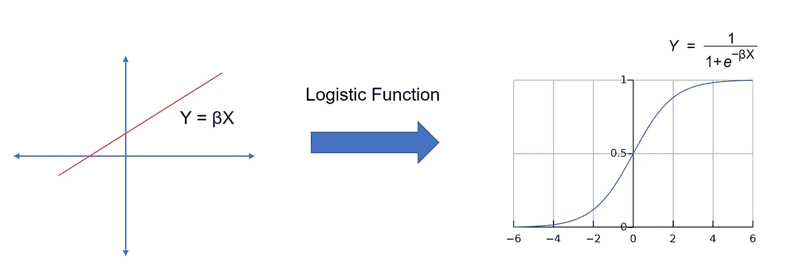*

*作者图片*

*现在我认为我们有了一个合适的分类模型。我们可以为 Y 设置一个**阈值**(例如 0.5)来确定结果变量。比如 Y ≥ 0.5 就是垃圾邮件，Y < 0.5 就不是垃圾邮件。*

**

## *为什么我们不用 OLS 的误差平方和(SSE)作为逻辑回归的成本函数呢？*

*一旦我们有了一个合理的模型来解决分类问题。接下来，我们需要提出一个成本函数。让我们试试线性回归模型中使用的平方和误差函数。*

**

> *在逻辑回归中，是否存在最小化平方和误差的解析解？简单的回答是否定的。*

*我们可以很快得出结论，这是一个非常困难的数学问题。函数的复杂性和**非线性**使得不可能找到封闭形式的解。*

> ***我们可以使用梯度下降来最小化逻辑回归中的平方和误差吗？**简单的回答也是否定的。*

*使用梯度下降来最小化成本函数。我们需要确保成本函数是一个凸的函数。如果我们试图在逻辑回归中使用平方和误差的成本函数，它最终将是一个具有许多局部最小值的非凸函数。寻找一个非凸函数的全局最小值本身就是一个非常困难的数学问题。*

*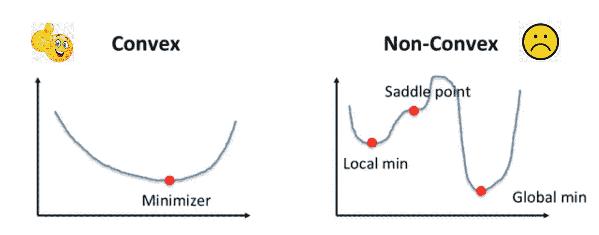*

*作者图片*

## *基于极大似然估计和交叉熵的 Logistic 回归*

> *由于**误差平方和**不能作为逻辑回归的代价函数，我们是否可以用 **MLE** 方法来寻找代价函数？简单的回答是肯定的。*

*使用最大似然估计，我们希望在逻辑回归模型下，在给定 X 的情况下，最大化观察 Y 的似然性。*

*假设 P 是给定 x 的特定事件(例如，电子邮件是垃圾邮件，用 Y =1 表示)发生的概率。那么 1-P 将意味着给定 x 的 Y=0 的概率。*

**

*因此，对于一个给定的观察对象(即易和)，我们想*

*   ***如果 Y =1，P 最大化***
*   *如果 Y =0，最大化 1-P*

*如果我们稍微扭曲一下，我们想*

*   ***如果 Y= 1，最大化 Y * P***
*   ***如果 Y = 0** ，最大化(1-Y)*(1-P)。*

*然后让我们结合上述两个功能，我们想*

*   ***最大化 Y*P + (1-Y)*(1-P)***

*让我们应用对数函数，将最大化成本函数改为最小化成本函数的反函数，我们希望*

*   ***最小化-[Y*log(P) + (1-Y)*log(1-P)]***

*接下来我们可以把观察所有点的似然函数写成每个点的似然的乘积。然后我们可以把每个可能性的乘积的 **log 重写为每个可能性的 log**的和。*

*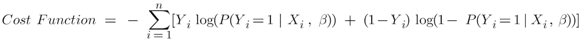*

*我们给上面的代价函数起了个好听的名字，**二元交叉熵。***

## *最小化逻辑回归中**二元交叉熵的代价函数***

> *logistic 回归中是否存在最小化二元交叉熵的解析解？简单的回答是没有。*

*类似于平方和误差，二进制交叉熵的复杂性和**非线性**使得不可能找到封闭形式的解。*

> *可以用梯度下降来最小化 logistic 回归中的二元交叉熵吗？简单的回答是肯定的。*

***二元交叉熵是一个凸函数**，通过梯度下降保证找到全局最小值。这些步骤与线性回归模型中的步骤相同。*

*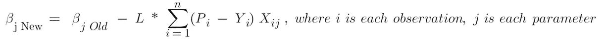*

> *酷的是逻辑回归的梯度下降公式中的**偏导函数**与线性回归的偏导函数相同。*

## *超越传统的线性回归*

*在线性回归模型中，我们可以改变**成本函数**来构建不同的模型，从而在线性模型中产生一组不同的最佳参数。*

*例如，在岭回归模型中，我们有一个成本函数*

*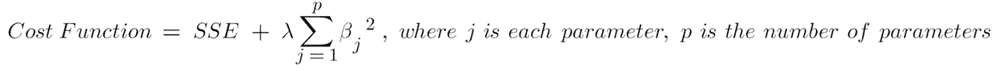*

*在套索回归模型中，我们有一个成本函数*

*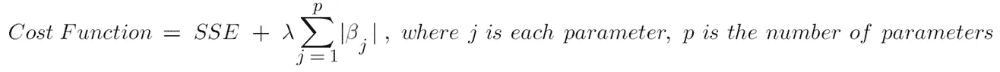*

*在弹性网回归模型中，我们有一个成本函数*

*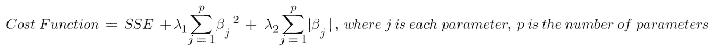*

*线性回归的这三个变量与**正则化**相关联，正则化是一种惩罚模型的灵活性和**复杂性**的技术，以防止**过度拟合**的风险。这里λ是一个超参数，用于确定模型的灵活性将受到多大的惩罚。我们可以使用**交叉验证**和**网格搜索**来调整它的值。*

## *超越传统的逻辑回归*

*当两个类别的样本大致相同(T21)时，传统逻辑回归效果最佳。然而，现实世界中有许多情况并非如此。*

*例如，在信用卡交易数据中可能有非常少量的欺诈交易。使用逻辑回归，这个阶级不平衡的问题会变得棘手。如果只有 0.1%的交易是欺诈性的。我们可以简单地预测所有正常的交易，最终达到 99.9%的准确率。多棒啊！但是这种模型是没有用的，因为我们无法预测任何欺诈交易。*

*为了解决此类不平衡问题，我们可以将二元交叉熵的成本函数修改为*

*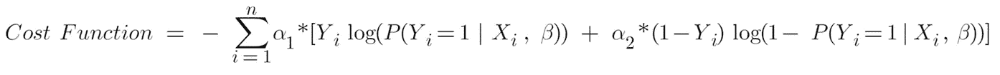*

*这里 **α1 和α2 将决定我们惩罚类错误分类的严厉程度**。它们的值通常计算为数据中它们频率的**倒数**。*

*回到我们的例子，α1 = 1 / 0.1% = 100，α2 = 1/99.9% = 1。因此，我们对欺诈交易的处罚将是正常交易的 100 倍。因此，这一小小的修改将大大提高检测欺诈交易的准确性。*

## *最终注释*

*线性回归和逻辑回归分别是处理回归和分类问题的两种广泛使用的模型。了解它们与普通最小二乘法和最大似然估计相关的基本形式将有助于我们理解基本原理，并探索它们的变体来解决现实世界的问题，如模型选择和不平衡类。*

*此外，了解成本函数优化问题背后的数学对于更有效地实现模型也很重要。请记住，只有当数据可以线性解释时，解析解才可用。否则，诸如梯度下降的数值近似方法更受欢迎，以找到机器学习模型中的最佳参数。*

*如果你对**线性回归**和**因果推断**感兴趣，这里有一些相关的帖子可以浏览。*

*   *[**因果推断:计量经济模型 vs. A/B 检验**](/causal-inference-econometric-models-vs-a-b-testing-190781fe82c5)*
*   *[**线性回归与逻辑回归:OLS、最大似然估计、梯度下降**](/linear-regression-vs-logistic-regression-ols-maximum-likelihood-estimation-gradient-descent-bcfac2c7b8e4)*
*   *[**OLS 线性回归:无偏、一致、蓝色、最佳(有效)估计量**](/linear-regression-with-ols-unbiased-consistent-blue-best-efficient-estimator-359a859f757e)*
*   *[**线性回归因果推断:省略变量和无关变量**](/understand-bias-and-variance-in-causal-inference-with-linear-regression-a02e0a9622bc)*
*   *[**用线性回归进行因果推断:内生性**](/causal-inference-with-linear-regression-endogeneity-9d9492663bac)*
*   *[**与 OLS 的线性回归:异方差和自相关**](/linear-regression-with-ols-heteroskedasticity-and-autocorrelation-c12f1f65c13)*

# *感谢您的阅读！！！*

*如果你喜欢这篇文章，并且想**请我喝杯咖啡，请[点击这里](https://ko-fi.com/aaronzhu)。***

*您可以注册一个 [**会员**](https://aaron-zhu.medium.com/membership) 来解锁我的文章的全部访问权限，并且可以无限制地访问介质上的所有内容。如果你想在我发表新文章时收到电子邮件通知，请 [**订阅**](https://aaron-zhu.medium.com/subscribe) 。*