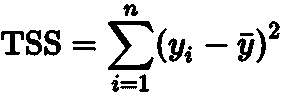
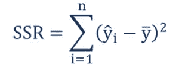
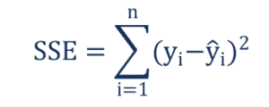
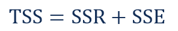

# 线性回归:平方和是多少？

> 原文：<https://towardsdatascience.com/linear-regression-what-is-the-sum-of-squares-3746db90a05d>

## 深入了解平方和对数据科学的重要性

凯利·西克玛在 [Unsplash](https://unsplash.com?utm_source=medium&utm_medium=referral) 上的照片

最近，我写了一篇关于线性回归及其在数据科学中的应用的文章。作为一个总的概述，我没有深入研究线性回归使用的工具或方法的太多细节。一个这样的工具是平方和。起初，我打算在前一篇文章中简单解释一下。然而，有几个不同的公式用来定义平方和，所以用一两句话来限定有点困难。相反，因为我发现答案很有趣，我想是时候写另一篇博客了。记住这一点，在今天的文章中，我们将着眼于平方和。我们将首先描述什么是平方和以及为什么使用它，然后我们将看看需要的公式以及它们的作用。因此，不再拖延，让我们更深入地研究平方和。

# 平方和是多少？

平方和不仅用于描述数据点和线性回归线之间的关系，还用于描述该线描述数据的准确程度。您使用一系列公式来确定回归线是否准确地描绘了数据，或者该线有多“好”或“坏”。

一个重要的注意事项是确保您的数据首先描述的是回归而不是相关性。这里有一个简单的清单来找出不同之处:

*   回归将强调一个变量如何影响另一个变量，而不仅仅是变量之间的关系。
*   相关性不能捕捉伤亡，而回归是基于它的。这很重要，因为它应该显示因果关系，而不是联系的程度。
*   在相关性中，x 和 y 之间的相关性与 y 和 x 相同。在回归中，x 和 y 与 y 和 x 会产生不同的结果。
*   最后，相关性用图形表示一个点，而回归用图形表示一条线。

现在我们对平方和有了更多的了解，让我们来看看需要的公式。

# 平方和总计

我们要看的第一个公式是总平方和(表示为 SST 或 TSS)。TSS 找出每个变量和平均值之间的平方差。

> 易=第*集第 i* 期
> 
> ȳ =集合中所有项目的平均值

这意味着对于每个变量，你取值并减去平均值，然后求结果的平方。这就给出了从直线到每个特定变量的距离。你也可以将 TSS 描述为观察变量在均值或方差周围的分散程度。因此，TSS 的目标是测量数据集的总可变性。

# 平方和回归

我们要讨论的下一个公式是回归平方和(表示为 SSR)，也称为解释平方和(表示为 ESS)。SSR 用于描述因变量的预测值和均值之间的差异。

> ŷi-由回归线估计的值
> 
> ȳ——样本的平均值

首先，我们将再次需要均值。估计值是位于回归线上的值。也就是说，不用每个变量的实际值，取该变量在回归线上的值。这将告诉我们这条线与数据的吻合程度。如果 SSR 与 TSS 匹配，那么这条线就是完美的匹配。

# 平方和误差

要讨论的最后一个公式是误差平方和(SSE)，也称为残差平方和(RSS)。SSE 查找变量的观察值或实际值与估计值之间的差异，这是根据回归线应该有的值。

> 其中:
> 
> yi——观察值
> 
> ŷi-由回归线估计的值

在完美拟合的情况下，误差将为 0，这意味着估计值与实际值相同。任何大于 0 的值都表示误差，或者根据这些值，线不准确的程度。该值越低，回归线就越符合数据。高残差和将表明该模型很难代表数据。

既然我们已经解释了这三者，我们可以表示它们的关系:

# 结论

在今天的文章中，我们谈到了平方和。首先，我们描述了它是什么以及为什么使用它。接下来，我们列出了相关和回归的区别。最后，我们查看了使用的公式(TSS、SSR 和 SSE)，并找到了一个公式来表示它们之间的关系。我希望平方和更清楚一点，并且你发现这个描述是有帮助的和有趣的。我们不一定需要手动计算所有的公式。像 R 这样的语言有计算每个公式的函数，所以你可以确定回归线是否合适，而不需要额外的工作。我希望你喜欢这个解释，一如既往，我会看到你在下一个。干杯！

***用我的*** [***每周简讯***](https://crafty-leader-2062.ck.page/8f8bcfb181) ***免费阅读我的所有文章，谢谢！***

***想看完介质上的所有文章？成为中等*** [***成员***](https://miketechgame.medium.com/membership) ***今天！***

*看看我最近的一些文章:*

 [## 数据科学中的线性回归

### 机器学习的数学技术

towardsdatascience.com](/linear-regression-in-data-science-b9a9d2aacc7c)  [## Python 中的 Seq 入门

### 向脚本中快速添加日志记录的简单方法。

python .平原英语. io](https://python.plainenglish.io/getting-started-with-seq-in-python-4f5fde688364)  [## Javascript CDNs 以及如何离线使用它们

### 它们是什么？它们如何帮助我们？

medium.com](https://medium.com/codex/javascript-cdns-and-how-to-use-them-offline-e6e6333491a3)  [## 这周学到的东西:ASP.NET 核心 MVC 中的 Vue.js

### 这听起来有点奇怪，但实际上真的很酷…

medium.com](https://medium.com/codex/something-i-learned-this-week-vue-js-in-asp-net-core-mvc-7b7540a38343)  [## 你可以每天使用的 5 个 Python 库

### 网站、机器学习、自动化——Python 可以做很多事情。

python .平原英语. io](https://python.plainenglish.io/5-python-libraries-to-use-everyday-d32a9de13269) 

参考资料:

 [## 平方和

### 平方和(SS)是一种统计工具，用于确定数据的离差，以及数据的好坏程度

corporatefinanceinstitute.com](https://corporatefinanceinstitute.com/resources/knowledge/other/sum-of-squares/)  [## 平方和:SST，SSR，SSE | 365 数据科学

### 你可能想知道这些平方和是怎么回事。也许这就是你最初来到这里的原因…

365datascience.com](https://365datascience.com/tutorials/statistics-tutorials/sum-squares/)  [## 相关性与回归| 365 数据科学

### 当你第一次听说回归时，你可能会认为相关和回归是同义词，或者至少它们…

365datascience.com](https://365datascience.com/tutorials/statistics-tutorials/correlation-regression/)