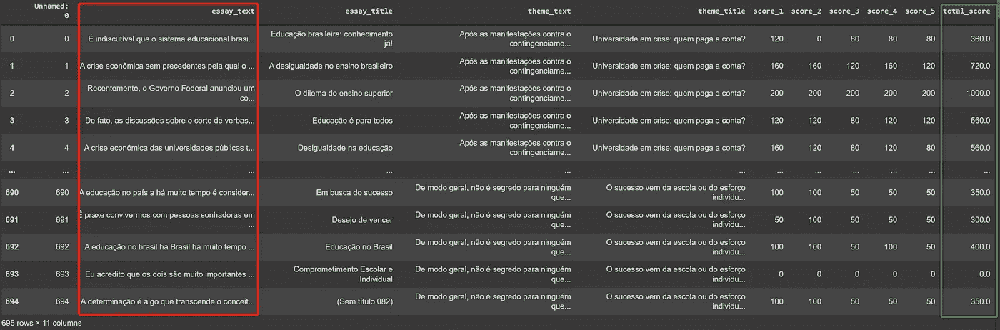
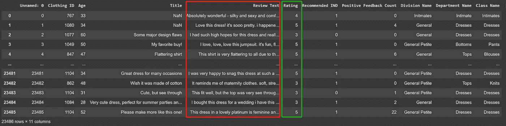
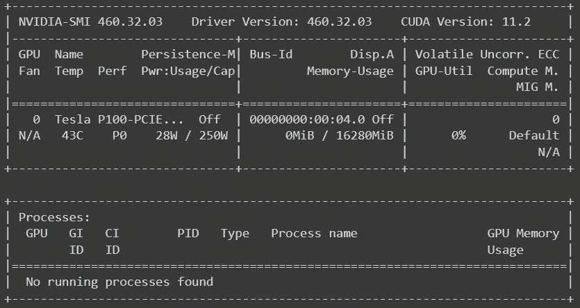

# 拥抱脸线性回归

> 原文：<https://towardsdatascience.com/linear-regression-with-hugging-face-3883fe729324>

## 这是对用变压器实现线性回归分析的可行性的探索

斯科特·韦伯摄影:[https://www.pexels.com/photo/shapes-and-pattern-2346594/](https://www.pexels.com/photo/shapes-and-pattern-2346594/)

# 介绍

众所周知，研究人员使用拥抱脸变形器在文本分类和文本聚类问题上花费了大量的努力。您是否想过可以在线性回归项目中利用预先训练好的转换器？拥抱脸 API 居然支持！我将带您看两个例子，并在最后分享一些见解。

# 数据

首先，我找到了一个包含数百篇带分数的批改过的作文的数据集。这些文章是根据每月的选择撰写的，旨在训练巴西高中生参加大学入学考试。数据集有 695 篇文章，我省略了缺少值的行或`total_score = 0`处的记录。经过预处理，100 篇文章被删除。

*   下面是数据的链接:[https://www . ka ggle . com/datasets/danlessa/corrected-essays-with-scores-from-uol](https://www.kaggle.com/datasets/danlessa/corrected-essays-with-scores-from-uol)。
*   下面是许可证的数据:[https://opendatacommons.org/licenses/odbl/1-0/](https://opendatacommons.org/licenses/odbl/1-0/)。
*   任务是用他们的短文(长文档)来预测总分。

巴西论文数据

第二个数据集是一个女装电子商务数据集，围绕着顾客写的评论。它的九个支持特性提供了一个很好的环境来从多维度解析文本。原始数据集有 23，486 条客户评论，没有缺失值。

*   下面是数据的链接:[https://www . ka ggle . com/datasets/nica potato/women-ecommerce-clothing-reviews](https://www.kaggle.com/datasets/nicapotato/womens-ecommerce-clothing-reviews)。
*   下面是许可证的数据:[https://creativecommons.org/publicdomain/zero/1.0/](https://creativecommons.org/publicdomain/zero/1.0/)。
*   任务是使用他们的审核意见(简短文档)来预测评级。我听起来更像是一个多类分类问题。但是用这个数据拟合一个线性回归模型仍然是可以接受的，因为我们的目标只是探索拥抱脸 API 的用法。

客户评论数据

# 密码

仅供参考，整个项目是在谷歌 Colab 进行的。在我们开始实验之前，让我们检查一下`GPU`是否可用，因为没有`GPU`整个过程会非常慢。

作者图片

然后，让我们导入我们需要的所有库:

## 步骤 1:准备数据

在这一步中，我们需要分割数据，对文本进行编码，并将数据转换成 torch 数据，以便进行下游建模。这与我为分类问题准备数据的过程是一样的。

***注意:由于我们训练的是一个线性回归模型，在 __getitem__ 函数中，我们需要将*** `***label***` ***转换为浮点型。请参考第 26 行。***

## 步骤 2:加载模型

这是最重要的一步。根据拥抱脸的库，当我们从拥抱脸 API 加载预训练模型时，将 AutoModelForSequenceClassification 的`num_labels`设置为 1 将触发线性回归，并自动使用`MSELoss()`作为损失函数。你可以在这里找到原剧本[。](https://github.com/huggingface/transformers/blob/7ae6f070044b0171a71f3269613bf02fd9fca6f2/src/transformers/models/bert/modeling_bert.py#L1564-L1575)

## 步骤 3:为回归创建计算指标

`logits`实际上是我们的预测。但是，在我们的语境下看起来很怪异。想了解更多关于`logits`的信息，这里有一个来自哥大的很好的学习资源: [Logit/Probit](http://www.columbia.edu/~so33/SusDev/Lecture_9.pdf) 。尽管默认的损失函数是`MSE`，我在这里再次添加损失函数，以验证损失函数是否正确实现。

## 第 4 步:构建培训师

## 巴西作文分数预测

我们需要为每个项目从拥抱脸中选择一个合适的预训练模型。由于巴西的论文都是用葡萄牙语写的，我选择了`“neuralmind/bert-large-portuguese-cased”` 作为基本模型。

作者图片

因为文章是长文档，所以平均长度比大多数预训练模型的默认最大长度长；我只是将`max_length` 设置为 512 来捕捉最多的信息。`test_size`设定为 20%。

经过几次实验后，我发现这个模型很难捕捉到分数和论文之间的任何线性关系，因为`R2` 分数等于负数。因此，我决定对目标变量进行`log10`转换。由于模型很难收敛，我运行了 100 个时期的`Trainer`，在第 44 个时期找到了最好的模型。

即使最好的`R2`只有 0.4643(这意味着只有大约 46%的总分的`log10`可以用短文嵌入来解释。)，我们可以看到一个明显的学习趋势(`R2 = -2.4783`表示短文的语义嵌入根本不能解释总分的`log10`。).

## 客户评审项目

因为这个项目的所有东西都是用英语写的，所以我简单地选择了`‘bert-base-uncased’`作为基础模型。我将前 3000 条评论作为测试集。从经验上来说，将更大百分比的数据子集化为验证数据可以提高测试数据上的微调模型的性能。因此，我将这个任务的`test_size`设置为 66%。因为客户评论是短文本数据，所以对于这个项目，我将`max_length`设置为 126。

正如我在开始时提到的，这个问题听起来更像一个多类分类问题，而不是一个线性回归问题，我添加了一个`accuracy`度量来代替`SMAPE`。下面是计算方法。

我训练了五个纪元的模型。最好的`accuracy (0.6694)`在第三时段获得，而最好的`R2 (0.6422)`和`RMSE (0.6589)`在第二时段获得。

现在，我们开始最后一步:让我们在测试数据集上测试微调后的模型。

输出如下所示。我要说的是，与模型在验证数据集上的表现相比，结果还算不错。

完整代码脚本:[Transformers _ Linear _ regression . ipynb](https://github.com/jinhangjiang/Medium_Demo/blob/main/Transformers_Linear_Regression/Transformers_Linear_Regression.ipynb)

# 外卖

1.  拥抱脸 API 通过设置`num_labels = 1`通过 ForSequenceClassification 接口支持线性回归。`problem_type` 将自动设置为`‘regression’`。
2.  由于线性回归是通过分类函数实现的，因此预测有点混乱。根据这个[文件](https://github.com/huggingface/transformers/blob/7ae6f070044b0171a71f3269613bf02fd9fca6f2/src/transformers/pipelines/text_classification.py#L140-L162)从抱紧脸(第 140 行到第 162 行)，他们会在`problem_type == “multi_label_classification” or num_labels == 1`时对输出应用`sigmoid`函数。此时我最好的解释是当`problem_type == ‘regression’` ，后处理功能被触发来设置`function_to_apply = ClassificationFunction.NONE`，所以没有额外的功能应用于输出。
3.  当连续值很大时，模型很难学习目标(参考我在第一个例子中发现的，而我输入的目标值像 700，1000 等。模型给我的预测是 15.6，16.8，…)。在这种情况下，对数转换可能会有所帮助。

# 相关阅读

      

# 参考

拥抱脸。(2021).modeling _ Bert . py .[https://github . com/hugging face/transformers/blob/7 ae6f 070044 b 0171 a 71 f 3269613 BF 02 FD 9 FCA 6 f 2/src/transformers/models/Bert/modeling _ Bert . py # l 1564-l 1575](https://github.com/huggingface/transformers/blob/7ae6f070044b0171a71f3269613bf02fd9fca6f2/src/transformers/models/bert/modeling_bert.py#L1564-L1575)

拥抱脸。(2021).text _ class ification . py .[https://github . com/hugging face/transformers/blob/7 ae6f 070044 b 0171 a 71 f 3269613 BF 02 FD 9 FCA 6 f 2/src/transformers/pipelines/text _ class ification . py # L140-L162](https://github.com/huggingface/transformers/blob/7ae6f070044b0171a71f3269613bf02fd9fca6f2/src/transformers/pipelines/text_classification.py#L140-L162)

拉爪哇研发(2022)。使用 BERT 和变压器的文本输入回归。[https://lajavaness . medium . com/regression-with-text-input-using-Bert-and-transformers-71c 155034 B13](https://lajavaness.medium.com/regression-with-text-input-using-bert-and-transformers-71c155034b13)