# OLS 线性回归:异方差性和自相关性

> 原文：<https://towardsdatascience.com/linear-regression-with-ols-heteroskedasticity-and-autocorrelation-c12f1f65c13>

## 用一点数学知识理解 OLS 线性回归

作者图片

**异方差**和**自相关**是我们在建立线性回归时需要解决的不可避免的问题。在本文中，让我们更深入地了解什么是异方差和自相关，什么是后果，以及处理问题的补救措施。

典型的线性回归采用如下形式。响应变量(即 Y)被解释为解释变量(如截距、X1、X2、X3……)的线性组合，而 **ε** 是误差项(即一个**随机变量**)，代表拟合响应值和实际响应值之间的差异。

图 1(作者图片)

## **什么是同方差？**

在**同方差**的假设下，误差项应该有常数方差和 iid。换句话说，误差项的方差-协方差矩阵中的对角线值应该是常数，非对角线值应该都是 0。

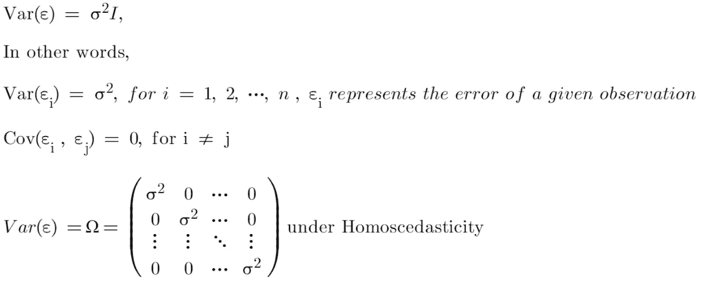

图 2(作者图片)

## 什么是异方差？

在现实世界中，同质性假设可能*不合理*。误差项的方差可能不会保持不变。有时误差项的方差取决于模型中的解释变量。

例如，卧室的数量通常用于预测房价，我们看到 6+卧室的房子比 2-卧室的房子预测误差更大，因为 6+卧室的房子通常比 2-卧室的房子价值高得多，因此，有更大的**未解释的**和有时**不可约的**价格方差，这漏入了误差项。

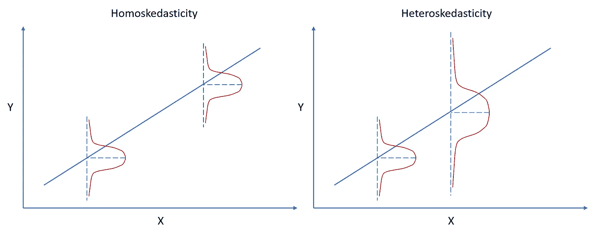

图 3(作者图片)

我们称其方差在观测值间不恒定的误差项为异方差误差。这个特性被称为**异方差**。

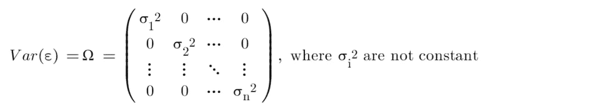

图 4(作者图片)

## 什么是自相关？

当模型中存在自相关时，误差项是相关的。这意味着误差项协方差矩阵的非对角值不全是 0。

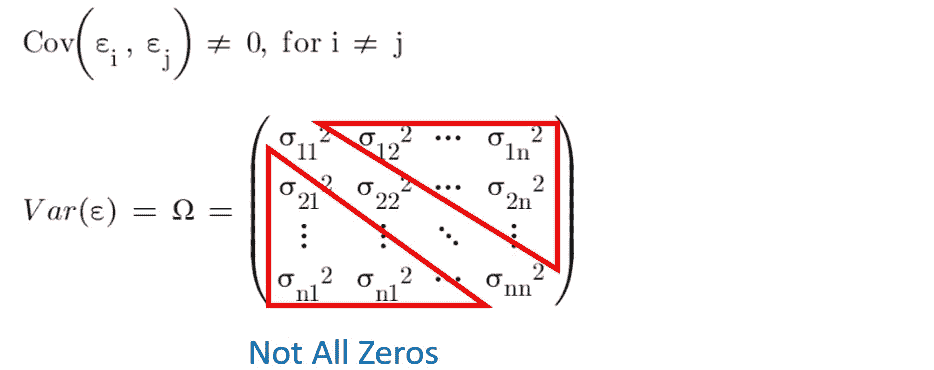

图 5(作者图片)

有一些可能的自相关来源。在**时序数据中，**时间是产生自相关的因素。例如，当前股价受到前几个交易日的价格影响(例如，股价在大幅上涨后更有可能下跌)。在**横截面数据**中，相邻单元倾向于具有相似的特征。

## **异方差和**自相关的结果是什么？

> 只要 [**零条件均值**的假设(即误差项的期望值对解释变量的所有值都是零条件的)成立，即使在异方差和自相关的情况下，OLSE 也保持**无偏**。](/linear-regression-with-ols-unbiased-consistent-blue-best-efficient-estimator-359a859f757e)

图 6(作者图片)

> *异方差或自相关下的 OLS 估计量* ***不再具有所有线性无偏估计量中最小的方差*** *因为* [*高斯-马尔可夫定理要求同方差。*](/linear-regression-with-ols-unbiased-consistent-blue-best-efficient-estimator-359a859f757e)

所以异方差或自相关下的 OLS 估计量**不再是蓝色的**。与同方差下相比，OLSE**效率不高**。

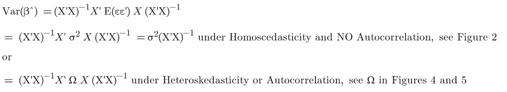

图 7(作者图片)

> 由于 OLS 估计量的方差在异方差或自相关下是无效的，统计推断可能会提供**误导性结果**。

## 异方差和自相关的补救方法是什么？

## **补救措施 1:异方差一致性(HC)和**异方差自相关一致性(HAC)标准误差

在异方差或自相关的情况下，我们仍然可以使用 [**低效的**](/linear-regression-with-ols-unbiased-consistent-blue-best-efficient-estimator-359a859f757e) OLS 估计量，但许多文献建议使用**异方差一致(HC)标准误差**(也称为稳健标准误差，白色标准误差)或**异方差-自相关一致(HAC)标准误差**(也称为纽西标准误差)，以允许异方差或自相关的存在(见图 7)。这些是最简单和最常见的解决方案。

许多计量经济学家认为，我们应该始终使用稳健的标准差，因为我们永远无法依赖同伦方差。

## **补救 2:** 广义最小二乘法(GLS)和可行 GLS (FGLS)

代替接受低效的 OLS 估计器和校正标准误差，我们可以通过使用广义最小二乘法(GLS)使用完全高效的估计器(即，无偏和具有最小方差)来校正异方差或自相关。

> 在异方差或自相关情况下，尽管 OLS 估计量和 GLS 估计量都是**无偏的**，但 GLS 估计量的**方差比 OLS 估计量的**方差小。

如果存在异方差或自相关，并且我们或者**知道**误差项的方差-协方差矩阵，或者**可以根据经验估计它**，那么我们可以将其转换成一个同方差模型。

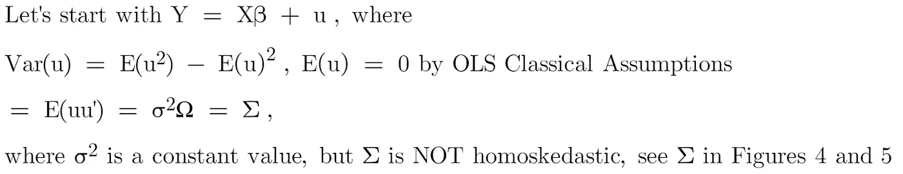

图 8(作者图片)

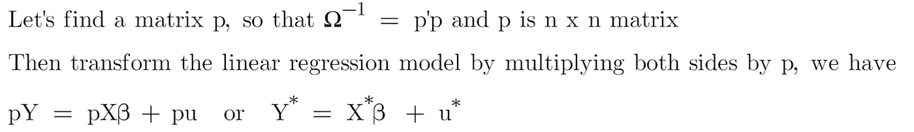

图 9(作者图片)

> **问:变换后的模型是齐次的吗？**
> 
> **答:是的，转换后的模型中的误差项具有恒定方差和 iid。**

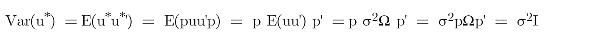

图 10(作者图片)

转换后的模型满足同方差假设，因此，转换后模型的 OLS 估计器(即 **GLS 估计器**)是**有效的**。GLS 估计量可以计算为

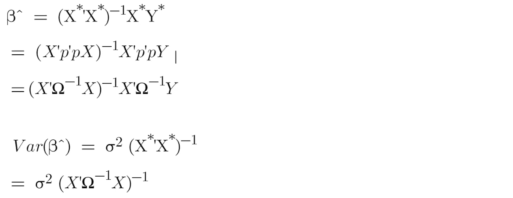

图 11(作者图片)

如果我们**知道**σ2ω**或**σ**的值，我们可以将它们的值代入一个封闭解中，找到 GLS 估计量。**

如果我们**不知道**σ2ω或**σ的值，那么**这个百万美元的问题就是“我们能估计它们的值吗？”答案是肯定的。处理这种情况的一个常见办法是采用可行的 GLS ( **FGLS** )。

## **如何在**异方差下应用 FGLS？

正如伍尔德里奇的《计量经济学导论:现代方法》中所讨论的，我们可以假设

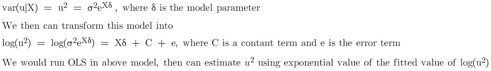

图 12(作者图片)

我们姑且称之为 **u** 的估计，FGLS 模型中的权重， **W，**(又名，**加权最小二乘估计(WLS)** )。

校正异方差的一种可行的 GLS 方法:

**第一步**:让 OLS 照原样运行，获得残差，即 Ui hat。

图 13(作者图片)

**第 2 步**:我们首先平方残差，然后取自然对数，从而创建一个新变量。

图 14(作者图片)

**第三步**:在 Xs 上回归这个新创建的变量，然后预测它们的拟合值。

图 15(作者图片)

**第四步**:对第三步得到的拟合值取幂，称之为权重 w，然后创建一个新的矩阵 p，(即 N×N 矩阵)

图 16(作者图片)

图 17(作者图片)

**第五步**:通过乘以新矩阵 p 来变换 Y 和 X。

图 18(作者图片)

**步骤 6** :对转换后的模型应用 OLS，我们得到的β hat 将是一个有效的 GLS 估计量。

图 19(作者图片)

## 如何在自相关下应用 **FGLS？**

对于大多数具有自相关的时间序列数据，**一阶自回归**扰动(即 AR(1))校正就足够了。我们有

图 20(作者图片)

图 21(作者图片)

**第一步**:让 OLS 照原样运行，得到剩余向量 e

图 22(作者图片)

**第二步**:用 r 估计ρ，然后创建一个新的矩阵 p，(即 N×N 矩阵)

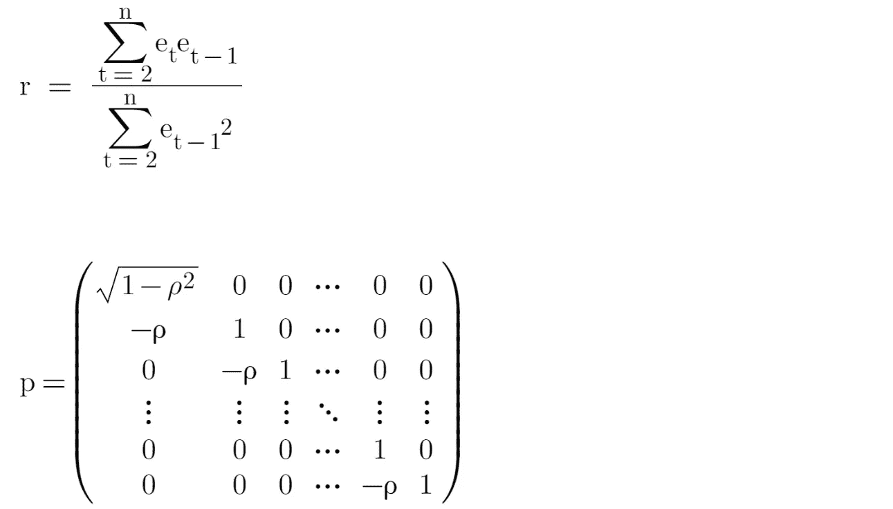

图 23(作者图片)

**第三步**:通过乘以新矩阵 p，对 Y 和 X 都进行变换，第一次观测与其他观测不同。对于我们的应用，我们可以**忽略**第一个观察值(即 t=1)。

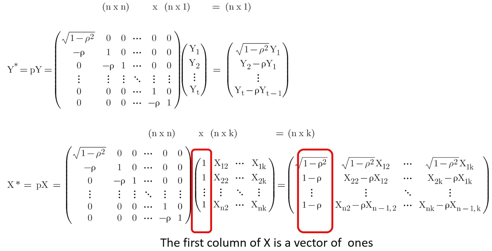

图 24(作者图片)

**步骤 4** :对变换后的模型应用 OLS，获得 GLS 估计量。

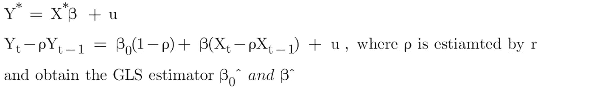

图 25(作者图片)

# 最终注释

当线性回归模型中存在异方差时，误差项的方差不是常数；当存在自相关时，误差项的协方差不为零。

在异方差或自相关的情况下，OLS 估计量仍然是无偏的，但不再有效，这意味着它不会有最小方差。

为了解决异方差或自相关问题，我们可以获得稳健的 OLS 估计量的标准误差，或者使估计量更有效，我们可以进一步获得 FGLS 的 GLS 估计量。

如果你对**线性回归**和**因果推断**感兴趣，这里有一些相关的帖子可以浏览。

*   [**因果推断:计量经济模型 vs. A/B 检验**](/causal-inference-econometric-models-vs-a-b-testing-190781fe82c5)
*   [**线性回归与逻辑回归:OLS、最大似然估计、梯度下降**](/linear-regression-vs-logistic-regression-ols-maximum-likelihood-estimation-gradient-descent-bcfac2c7b8e4)
*   [**OLS 线性回归:无偏、一致、蓝色、最佳(有效)估计量**](/linear-regression-with-ols-unbiased-consistent-blue-best-efficient-estimator-359a859f757e)
*   [**线性回归因果推断:省略变量和无关变量**](/understand-bias-and-variance-in-causal-inference-with-linear-regression-a02e0a9622bc)
*   [**线性回归因果推断:内生性**](/causal-inference-with-linear-regression-endogeneity-9d9492663bac)
*   [**与 OLS 的线性回归:异方差和自相关**](/linear-regression-with-ols-heteroskedasticity-and-autocorrelation-c12f1f65c13)

# 感谢您的阅读！！！

如果你喜欢这篇文章，并且想**请我喝杯咖啡，**请[点击这里](https://ko-fi.com/aaronzhu)。

您可以注册一个 [**会员**](https://aaron-zhu.medium.com/membership) 来解锁我的文章的全部访问权限，并且可以无限制地访问介质上的所有内容。如果你想在我发表新文章时收到电子邮件通知，请订阅。