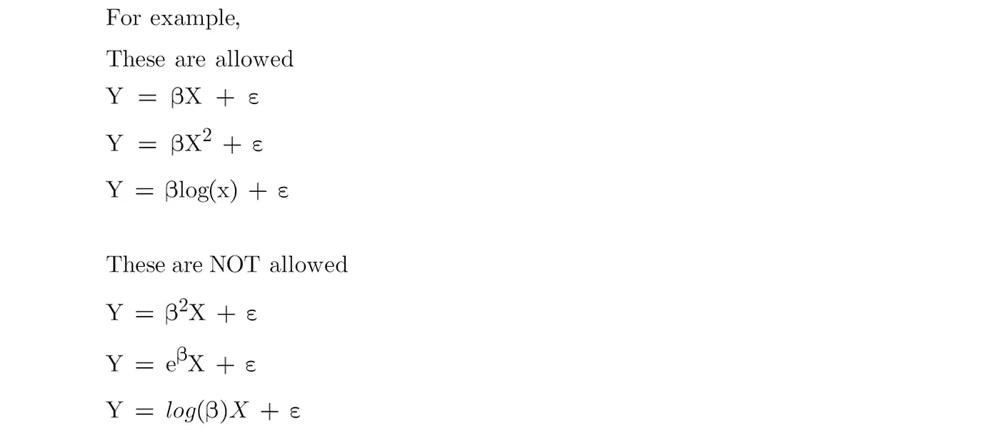
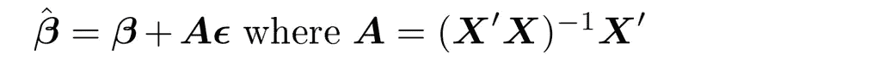
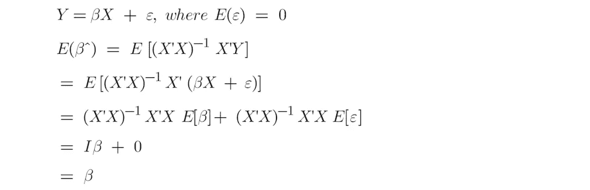
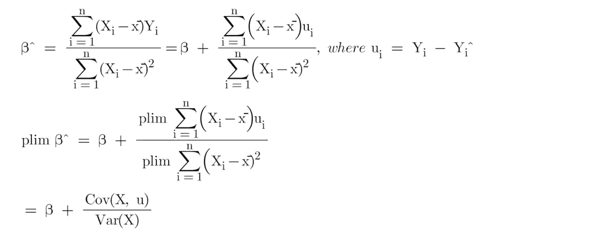
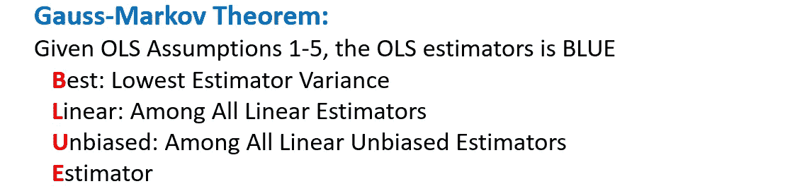
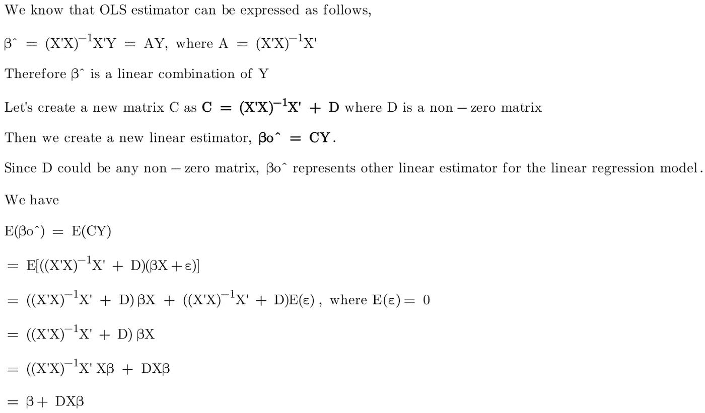
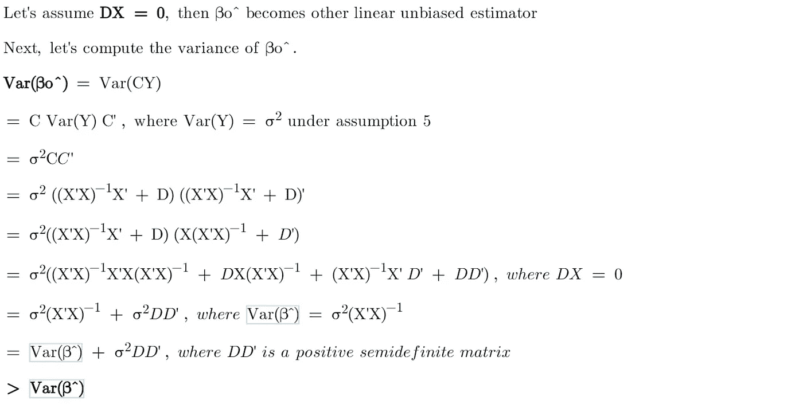

# OLS 线性回归:无偏、一致、蓝色、最佳(有效)估计量

> 原文：<https://towardsdatascience.com/linear-regression-with-ols-unbiased-consistent-blue-best-efficient-estimator-359a859f757e>

## 用一点数学知识理解 OLS 线性回归

作者图片

已知 OLS 估计量是**无偏**、**一致**和**蓝**(最佳线性无偏估计量)。但是这些属性是什么意思呢？为什么它们对线性回归模型很重要？在本文中，我们将讨论这些属性。

典型的线性回归如下所示。响应变量(即 Y)被解释为解释变量(如截距、X1、X2、X3……)的线性组合，而 **ε** 是误差项(即**随机变量**)，代表拟合响应值和实际响应值之间的差异。

图 1(作者图片)

为了让 OLS 发挥作用，我们需要确保一些假设是正确的。

假设 1- **参数的线性度**:线性模型中的参数是线性的。

图 2(作者图片)

此外，OLS 估计量也是线性的，我们可以将 OLS 闭合解改写如下(将图 1 中的 Y 代入图 3)。矩阵代数只在线性存在的情况下有效。因此，线性假设是成立的。

图 3(作者图片)

图 4(作者图片)

假设 2- **随机抽样**:观测数据代表 **iid** 独立同分布)随机样本，遵循总体模型(见图 1)。如果数据是跨部门收集的，我们需要确保它们是随机抽样的。底线是观察到的数据应该代表总体数据

假设 3- **无完美共线性**:任何解释变量都不能表示为其他解释变量的线性组合。原因是逆矩阵(在图 3 中)仅在 X 具有满秩时存在，这意味着如果存在完美的共线性，它将没有封闭形式的解决方案。

假设 4- **零条件均值**:误差项的期望值对解释变量的所有值都是零条件的(即 E[ **ε** |X] = 0)

假设 5- **同方差**和**无自相关**:误差项应具有恒定方差和 iid。换句话说，误差项的方差-协方差矩阵中的对角线值应该是常数，非对角线值应该都是 0。

假设 6- **误差的正态性**:误差项呈正态分布。这个假设对于 OLS 方法的有效性来说并不是必需的，但这允许我们有一个可靠的估计标准误差，并做出有意义的统计推断。

## β vs β^ vs E(β^)

你可能在统计学教科书上看到过 **β** (如β，β^，E(β^))的一些变体。我们来讨论一下它们的定义和区别。

**β** 是一个概念值——解释**总体数据**中解释变量和因变量之间关系的**真**(通常还有**未知**)参数值(即**常数值**)。

在大多数情况下，我们不会使用人口数据，因为它不可用或太大而无法处理。因此，我们将使用**样本数据**(具有**有限**个观察值)来开发我们的线性回归模型。

在**随机抽样**的假设下，观测样本数据代表大小为 n 的同分布随机样本，遵循**总体模型**。假设我们有多组样本数据(通过从总体中反复抽取样本)，并在每个数据集中分别运行模型。

在给定的样本数据集中，我们将有一个 OLS 估计量， **β^** ，它可以用封闭形式的解决方案来解决(图 3)。

很有可能我们会在不同的数据集中得到**一组不同的估计量(即β^)** 。因此， **β^是一个** **随机变量。**基于中心极限定理， **β^** 的**抽样分布**具有均值，随着样本量的增加，均值收敛于 **β** 。

**E(β^)** 是这个随机变量β^.的期望值通俗地说，如果我们在多组样本中运行线性模型，不断记录估计量的值，取一个平均值。平均值就是期望值，E(β^).

## OLS 估计量是无偏的

在**有限样本**属性下，我们说 OLS 估计量是无偏的，这意味着 OLS 估计量的**期望值**、 **E(β^)** 将等于**真实总体参数β** 。

> **无偏性**难道**而非**意味着我们从**观测数据**(即一组随机样本)中得到的 OLS 估计量将等于**精确总体**参数值，因为由于**不可约误差项ε** ，线性模型仍然不能完全解释这种关系。
> 
> 相反，无偏性意味着，如果我们对来自同一总体的不同随机样本集重复运行线性回归模型**，那么估计量的**预期值**将等于**真实值**总体参数，如下所示。**

****

**图 5(作者图片)**

**虽然我们从观测数据中得到的 OLS 估计量不等于**精确总体**参数值，但是只要**观测数据是总体数据的良好代表，并且线性模型在假设下被正确指定，**那么我们从观测数据中得到的系数估计量应该非常接近真实总体参数值。**

**否则，如果观察数据**不是**总体数据的良好代表，模型将遭受**测量误差、**或**线性模型**由于常见问题**没有**正确指定(例如，省略变量或内生性)，那么我们从观察数据得到的系数估计值将**有偏差**。**

## **OLS 估计量是一致的**

> **在**渐近**性质下，我们说 OLS 估计量是一致的，这意味着随着样本量变大并趋向于**无穷大，OLS 估计量将**收敛**到**真**总体参数**。******

**从 Jeffrey Wooldridge 的教科书，*计量经济学导论，C.3，*我们可以证明，如果假设成立，随着样本量变大，OLS 估计量的概率极限将等于真实总体参数。**

****

**图 6(作者图片)**

*   **当 E[ **ε** |X] = 0 成立时，暗示 Cov(X，u) = 0，那么图 6 中的第二项等于 0。我们已经证明，随着样本容量的增大，OLS 估计量会收敛到真实的总体参数。因此 OLS 估计量是一致的。**
*   **如果 Cov(X，u) ≠ 0，那么我们有一个不一致的估计量。不一致的问题不会随着样本量的增加而消失。[同时，OLS 估计量也有偏差。](/causal-inference-with-linear-regression-endogeneity-9d9492663bac)**
*   **如果 Cov(X，u) > 0 表示 X 与误差项正相关，则**渐近偏差**向上。**
*   **如果 Cov(X，u) < 0 meaning x is negatively correlated with the error term, then **渐近偏差**向下。**

**你可能想知道为什么我们对大样本的属性感兴趣，比如一致性，而实际上我们的样本是有限的。**

> **答案是，如果我们可以证明当样本量变大时，估计量是一致的，那么我们可能会对有限样本中的估计量更加自信和乐观。另一方面，**如果一个估计量是不一致的，我们知道这个估计量在有限样本中是有偏的**。**

## **OLS 估计量是**有效的****

**为了评估线性回归模型的估计量，我们根据其偏差和方差来使用其效率。**

*   **无偏但没有最小方差的估计量不是最好的。**
*   **方差最小但有偏差的估计量不是最好的**
*   **无偏且方差最小的估计量是最好的(有效的)。**
*   **OLS 估计量是最好的(有效的)估计量，因为在所有的**线性**和**无偏**估计量中，OLS 估计量具有**最小方差**。**

****

**图 7(作者图片)**

**我们可以用一点矩阵运算来证明高斯-马尔可夫定理。**

****

**图 8(作者图片)**

****

**图 9(作者图片)**

**现在我们已经证明了 OLS 估计量的方差比任何其他线性无偏估计量都小。因此，OLS 是最好的(有效的)线性估计。**

## **最终注释**

*   **如果估计量的抽样分布的期望值等于真实总体参数值，则估计量是无偏的。**
*   **如果随着样本量的增加，估计值趋于无穷大，那么估计值是一致的。换句话说——一致性意味着，随着样本量的增加，估计量的抽样分布在总体参数值处变得更加集中，方差变得更小。**
*   **在 OLS 假设下，OLS 估计量是蓝色的(所有线性无偏估计量中方差最小的)。因此，它是**最好的** ( **高效的**)估计器。**

**如果你对**线性回归**和**因果推断**感兴趣，这里有一些相关的帖子可以浏览。**

*   **[**因果推断:计量经济模型 vs. A/B 检验**](/causal-inference-econometric-models-vs-a-b-testing-190781fe82c5)**
*   **[**线性回归与逻辑回归:OLS、最大似然估计、梯度下降**](/linear-regression-vs-logistic-regression-ols-maximum-likelihood-estimation-gradient-descent-bcfac2c7b8e4)**
*   **[**OLS 线性回归:无偏、一致、蓝色、最佳(有效)估计量**](/linear-regression-with-ols-unbiased-consistent-blue-best-efficient-estimator-359a859f757e)**
*   **[**线性回归因果推断:省略变量和无关变量**](/understand-bias-and-variance-in-causal-inference-with-linear-regression-a02e0a9622bc)**
*   **[**线性回归因果推断:内生性**](/causal-inference-with-linear-regression-endogeneity-9d9492663bac)**
*   **[**OLS 线性回归:异方差和自相关**](/linear-regression-with-ols-heteroskedasticity-and-autocorrelation-c12f1f65c13)**

# **感谢您的阅读！！！**

**如果你喜欢这篇文章，并且想**请我喝杯咖啡，请**点击这里。**

**您可以注册一个 [**会员**](https://aaron-zhu.medium.com/membership) 来解锁我的文章的全部访问权限，并且可以无限制地访问介质上的所有内容。如果你想在我发表新文章时收到电子邮件通知，请订阅。**