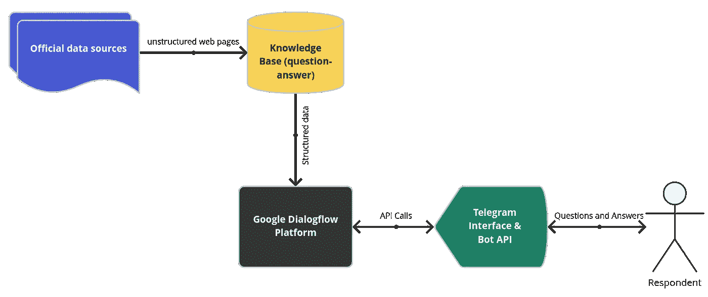
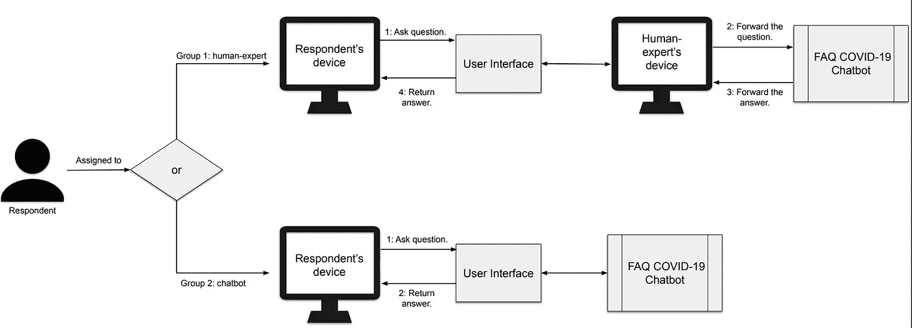
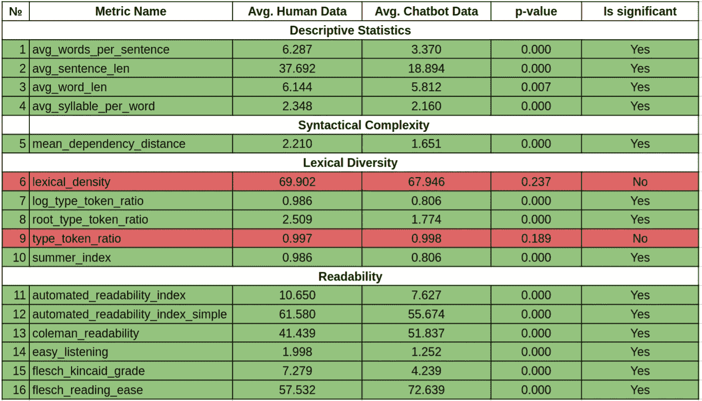

# 虚拟助手对话中人类语言的语言特征

> 原文：<https://towardsdatascience.com/linguistic-features-of-human-speech-in-dialogues-with-a-virtual-assistant-ca961ab3a272>

## 人们和聊天机器人说话的方式和和其他人说话的方式不同吗？

> 通常，机器学习方法，当然还有基于规则的方法被用来创建虚拟助手。两者(大多是机器学习)都依赖于输入数据，通常是人类对话。这还没有考虑到对话系统的用户不会像和真人一样和他们交流的因素。

在本文中，我将考虑我们对人与人和人与聊天机器人对话文本进行统计分析的实验。对话以俄语的*新冠肺炎*常见问题(FAQ)为主题。使用*定量文本分析方法*对结果进行处理(这些度量组包括:可读性、句法复杂性、词汇多样性)。统计分析显示上述指标存在显著差异。特别是，受访者在与聊天机器人对话时使用了更短的单词和句子以及更简单的语法。此外，在人机对话中，词汇多样性和可读性指数更高，所有这些都表明人们在与虚拟助手交流时使用更简单的语言。在这方面，开发人员应该特别注意为创建这样的应用程序准备源数据。

# 介绍

众所周知，如今虚拟助手(尤其是聊天机器人)已经积极地进入了我们的生活。他们在银行、政府网站和我们想找乐子的时候跟着我们。尽管我认为 Gartner 的预测到 2022 年 70%的白领每天都会和聊天机器人聊天并没有完全实现，但是聊天机器人在我们生活中的应用趋势是显而易见的。在我看来，*虚拟助手之类的技术是中性的*。根据它掌握在谁的手中，它的有用程度或敌对程度可能会有所不同。在这篇文章中，我建议将重点放在虚拟助手有用的一面，即快速准确地获得特定问题答案的能力。

作为一个例子，考虑一个*FAQ-聊天机器人回答用户关于新冠肺炎*的问题。对话数据的收集发生在 2021 年 3 月*到 2021 年 7 月*，即在疫情的一个高峰期。数据收集过程被设计成使得对两种不同类型的对话(人-人和人-聊天机器人)的分析可以在几乎“所有其他条件都相同”的情况下进行更多细节在下一章。

# 创建聊天机器人

F 首先，有必要*收集一个问答格式的知识库*。知识库的数据来自公开和官方的信息来源，如站点 [stopkoronavirus.rf](https://xn--80aesfpebagmfblc0a.xn--p1ai/faq/) 。数据是手动构建的，以便可以训练适当的分类模型。作为技术解决方案，使用了 [Google Dialogflow](https://cloud.google.com/dialogflow) 平台及其意图分类模块。聊天机器人的界面是[电报](https://core.telegram.org/bots/api)信使。在下图中，你可以看到聊天机器人的概念架构。

FAQ 聊天机器人的概念架构(图片由作者提供)

# 计划实验

F 为了实验，我们将回答者分为*第一组(人对人对话)*和*第二组(人对聊天机器人对话)*。让我们从第二组(第二组)开始，因为那里的一切都很简单——回答者被邀请直接与聊天机器人进行对话。在这种情况下，我们介绍对话的主题和可能的问题。在第一种情况下(第一组)，一切都很相似，除了受访者正在与人类专家对话，而不知道他或她正在使用相同的聊天机器人来回答问题。换句话说，专家是回答者和聊天机器人之间的代理人。这种类型的实验被称为*颠倒的绿野仙踪*。原版《绿野仙踪》的描述可以在[这里](https://en.wikipedia.org/wiki/Wizard_of_Oz_experiment)找到。下图显示了我们的[原始文章](https://icaiit.org/proceedings/10th_ICAIIT_1/2_2_Perevalov.pdf)中的实验示意图。

实验方法(图片由作者提供)

本实验于 2021 年 3 月至 2021 年 7 月进行。结果，组 1(人-人)获得了 35 个对话，组 2(人-聊天机器人)获得了 68 个对话。所得数据被匿名化并用于进一步分析。源代码和数据在 [Github 存储库中。](https://github.com/sshvskv/Comparison-of-lexical-features)在下一章中，我将给出测量指标的详细统计数据。

# 文本对话分析的结果

选择了以下组中的个指标来分析文本对话:

*   描述性统计(平均单词长度、平均音节数等。);
*   可读性([Flesch read ease](https://en.wikipedia.org/wiki/Flesch%E2%80%93Kincaid_readability_tests)等。);
*   句法复杂度([平均依存距离](https://www.researchgate.net/publication/273459859_Dependency_Distance_as_a_Metric_of_Language_Comprehension_Difficulty))；
*   词汇多样性([类型记号比例](https://de.wikipedia.org/wiki/Type-Token-Relation)，[词汇密度](https://en.wikipedia.org/wiki/Lexical_density)等。).

这些指标是使用 Python 库 [LinguaF](https://github.com/Perevalov/LinguaF) 计算的。计算指标的描述和技术可以在我们的[原始文章](https://icaiit.org/proceedings/10th_ICAIIT_1/2_2_Perevalov.pdf)中找到。下面是一个表格，其中包含计算出的指标平均值，以及 [t-test](https://en.wikipedia.org/wiki/Student%27s_t-test) 值，这些值允许我们确定不同类型对话(第 1 组和第 2 组)上相同指标的差异是否具有*统计显著性*(显著性水平α=0.01)。

显示文本间语言差异的度量计算值表(作者图片)

显然，对于大多数指标来说，我们有一个统计上的显著差异。让我们从简单的开始。衡量标准# 1——第一组对话的句子中的平均字数几乎是第二组对话的两倍。这也适用于衡量标准 2——平均句子长度。第一组的平均单词长度和单词中的音节数也略高。

句法复杂性的度量(平均依存距离)显示了句子中依存单词之间的平均距离，表明对于人与人的对话，该距离要大得多。这显然意味着第一组的句子结构更加复杂。

度量#6 和#9 的值的差异在统计上不显著。然而，词汇多样性的其他指标清楚地显示了第二组对话的滞后。所有可读性指标都显示了统计上的显著差异，这说明了第一组对话的文本结构更复杂。

# 调查结果和结论

在这项工作中，我们从数字上证实了*人在与聊天机器人的对话中倾向于使用简化的语言结构*。这既关系到单个单词，也关系到整个句子的结构。*使用简体语言的事实推动了人们更仔细地收集用于创建聊天机器人的原始数据。*

通常，机器学习方法，当然还有基于规则的方法被用来创建虚拟助手。这两种方法(主要是机器学习)都依赖于原始数据，这些数据通常是人类对话。这还没有考虑到*因素，即基于对话系统的用户不会像与真人交流一样与他们交流。我们建议所有开发人员*记住这个因素，并相应地修改您系统的数据和算法*。*

如需引用，请使用:[https://ICA IIT . org/proceedings/10 th _ ICA IIT _ 1/2 _ 2 _ perevalov . pdf](https://icaiit.org/proceedings/10th_ICAIIT_1/2_2_Perevalov.pdf)

你在日常生活中多久使用一次聊天机器人？拜托，写在评论里吧！